# Overview


Pervasive use (and misuse) of antibiotics for human disease treatment, as well as for various agricultural purposes, has resulted in the evolution of multi-drug resistant (MDR) pathogenic bacteria. The [Center for Disease Control estimates](https://www.cdc.gov/drugresistance/) that in the U.S. alone, every year at least 2 million people get an antibiotic-resistant infection, and at least 23,000 people die. Antibiotic resistance poses a major public health challenge, and its causes and mitigations are widely studied.

Plasmids are small DNA molecules within a cell which are physically separated from chromosomal DNA and can replicate independently. They are most commonly found as small circular, double-stranded DNA molecules in bacteria.

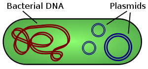

Plasmids are considered a major vector facilitating the transmission of drug resistant genes among bacteria via [horizontal transfer](https://en.wikipedia.org/wiki/Horizontal_gene_transfer) (, ). Careful characterization of plasmids and other MDR mobile genetic elements is vital for understanding their evolution and transmission and adaptation to new hosts.

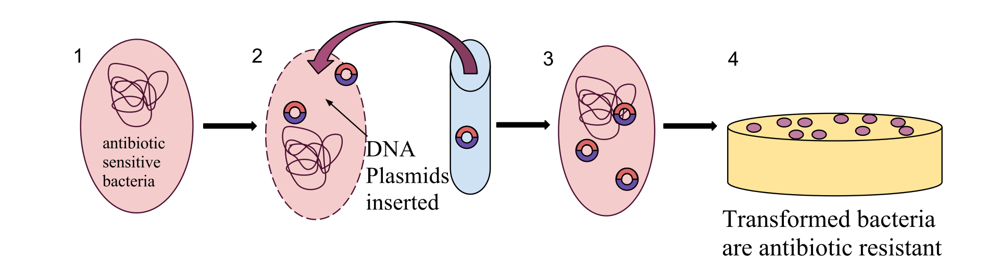

Due to the high prevalence of repeat sequences and inserts in plasmids, using traditional NGS short-read sequencing to assemble plasmid sequences is difficult and time-consuming. With the advent of third-generation single-molecule long-read sequencing technologies, full assembly of plasmid sequences is now possible.

In this tutorial we will recreate the analysis described in the paper by  entitled *Efficient generation of complete sequences of MDR-encoding plasmids by rapid assembly of MinION barcoding sequencing data*. We will use data sequenced by the [Nanopore](https://nanoporetech.com/) MinION sequencer.

The assembly will be performed with **Minimap2**  (),
**Miniasm**  (), **Racon**  () and **Unicycler**  ().
The downstream analysis will use **Nanoplot**  (),
**Bandage**  (), **PlasFlow**  () and **starmr**  ([GitHub](https://github.com/phac-nml/staramr)).

A schematic view of the workflow we will perform in this tutorial is given below:

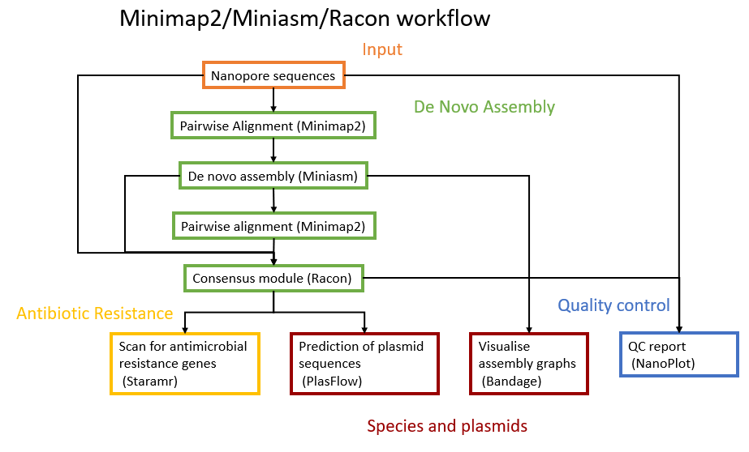


> <agenda-title></agenda-title>
>
> In this tutorial, we will cover:
>
> 1. TOC
> {:toc}
>
{: .agenda}




In this tutorial we use metagenomic Nanopore data, but similar pipelines can be used for other types of datasets or other long-read sequencing platforms.


# Obtaining and preparing data

We are interested in the reconstruction of full plasmid sequences and determining the presence of any antimicrobial resistance genes.
We will use the plasmid dataset created by  for their evaluation of the efficiency of MDR plasmid sequencing by MinION platform. In the experiment, 12 MDR plasmid-bearing bacterial strains were selected for plasmid extraction, including *E. coli*, *S. typhimurium*, *V. parahaemolyticus*, and *K. pneumoniae*.



## Importing the data into Galaxy

For this tutorial, in order to speed up the analysis time, we will use 6 of the 12 samples from the original study.

> <hands-on-title>Obtaining our data</hands-on-title>
>
> 1. Make sure you have an empty analysis history. Give it a name.
>
>    
>
> 2. **Import Sample Data** [](https://doi.org/10.5281/zenodo.3247504)
>    ```
>    https://zenodo.org/record/3247504/files/RB01.fasta
>    https://zenodo.org/record/3247504/files/RB02.fasta
>    https://zenodo.org/record/3247504/files/RB04.fasta
>    https://zenodo.org/record/3247504/files/RB05.fasta
>    https://zenodo.org/record/3247504/files/RB10.fasta
>    https://zenodo.org/record/3247504/files/RB12.fasta
>    ```
>
>    
>
> 3. **Build a list collection** containing all fasta files. Name it `Plasmids`
>
>    
>
{: .hands_on}

# Quality Control

## NanoPlot to explore data


The first thing we want to do is to get a feeling for our input data and its quality. This is done
using the NanoPlot tool. This will create several plots, a statisical report and an HTML
report page.

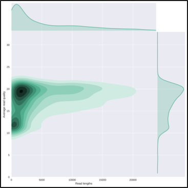

> <hands-on-title>Plotting scripts for long read sequencing data</hands-on-title>
>
> 1.  with the following parameters
>    -  *"Select multifile mode"*: `batch`
>    -  *"Type of the file(s) to work on"*: `fasta`
>    -  *"files"*: The `Plasmids` dataset collection you just created
>
>    
>
{: .hands_on}

The `HTML report` gives an overview of various QC metrics for each sample. For example, it will
plot the read length distribution of each sample:
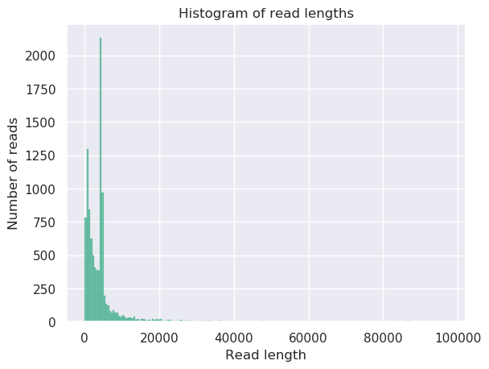


> <question-title></question-title>
>
> What was the mean read length for this (RB01) sample?
>
> > <solution-title></solution-title>
> > 4906.3
> >
> > This can be determined by looking at the NanoStats or HTML output of NanoPlot RB01.
> {: .solution }
{: .question}


For more information on the topic of quality control, please see our training materials
[here]({{site.baseurl}}/topics/sequence-analysis/)

# De-novo Assembly

## Pairwise alignment using Minimap2

In this experiment we used Nanopore sequencing; this means sequencing results with long reads, and significant overlaps between those reads.
To find this overlap, Minimap2 is used. Minimap2 is a sequence alignment program that can be used for different
purposes, but in this case we'll use it to find overlaps between long reads with an error rate up to ~15%.
Typical other use cases for Minimap2 include:

1. mapping PacBio or Oxford Nanopore genomic reads to the human genome
2. splice-aware alignment of PacBio Iso-Seq or Nanopore cDNA or Direct RNA reads against a reference genome
3. aligning Illumina single- or paired-end reads
4. assembly-to-assembly alignment
5. full-genome alignment between two closely related species with divergence below ~15%.

Minimap2 is faster and more accurate than mainstream long-read mappers such as BLASR, BWA-MEM, NGMLR and GMAP and
therefore widely used for Nanopore alignment. Detailed evaluations of Minimap2 are available in
the Minimap2 publication ().

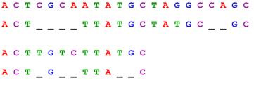


> <hands-on-title>Pairwise sequence alignment</hands-on-title>
>
> 1.  with the following parameters
>    -  *"Will you select a reference genome from your history or use a built-in index?"*: `Use a genome from history and build index`
>      -  *"Use the following data collection as the reference sequence"*: `Plasmids` dataset collection we just created
>    -  *"Single or Paired-end reads"*: `Single`
>      -  *"Select fastq dataset"*: The `Plasmids` dataset collection
>      -  *"Select a profile of preset options"*: `Oxford Nanopore all-vs-all overlap mapping`
>    - In the section **Set advanced output options**:
>      -  *"Select an output format"*: `paf`
>
>    
>
{: .hands_on}

This step maps the Nanopore sequence reads against itself to find overlaps. The result is a PAF file.
PAF is a text format describing the approximate mapping positions between two
set of sequences. PAF is TAB-delimited with each line consisting of the
following predefined fields:

|Col|Type  |Description                               |
|--:|:----:|:-----------------------------------------|
|1  |string|Query sequence name                       |
|2  |int   |Query sequence length                     |
|3  |int   |Query start (0-based)                     |
|4  |int   |Query end (0-based)                       |
|5  |char  |Relative strand: "+" or "-"               |
|6  |string|Target sequence name                      |
|7  |int   |Target sequence length                    |
|8  |int   |Target start on original strand (0-based) |
|9  |int   |Target end on original strand (0-based)   |
|10 |int   |Number of residue matches                 |
|11 |int   |Alignment block length                    |
|12 |int   |Mapping quality (0-255; 255 for missing)  |

View the output of **Minimap2**  of the collection against RB12, it should look something like this:
```
channel_100_69f2ea89-01c5-45f4-8e1b-55a09acdb3f5_template	4518	114	2613	+	channel_139_250c7e7b-f063-4313-8564-d3efbfa7e38d_template	3657	206	2732	273	2605	0	tp:A:S	cm:i:29	s1:i:240	dv:f:0.2016	rl:i:1516
channel_100_69f2ea89-01c5-45f4-8e1b-55a09acdb3f5_template	4518	148	1212	+	channel_313_35f447cb-7e4b-4c3d-977e-dc0de2717a4d_template	3776	2433	3450	218	1064	0	tp:A:S	cm:i:31	s1:i:210	dv:f:0.1291	rl:i:1516
channel_100_69f2ea89-01c5-45f4-8e1b-55a09acdb3f5_template	4518	251	1328	+	channel_313_a83f7257-52db-46e4-8e2a-1776500c7363_template	3699	2327	3382	208	1082	0	tp:A:S	cm:i:29	s1:i:203	dv:f:0.1363	rl:i:1516
```

## Ultrafast de novo assembly using Miniasm

The mapped reads are ready to be assembled with **Miniasm**  (). Miniasm is a very fast Overlap Layout Consensus based de-novo assembler for noisy long reads.
It takes all-vs-all read self-mappings (typically by **Minimap2** ) as input and outputs an assembly graph in the GFA format.

Different from mainstream assemblers, miniasm does not have a consensus step.
It simply concatenates pieces of read sequences to generate the final sequences.
The optimal case would be to recreate a complete chromosome or plasmid.
Thus the per-base error rate is similar to the raw input reads.

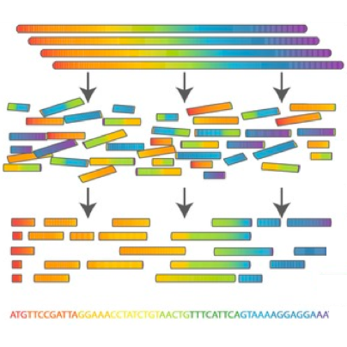

> <hands-on-title>De novo assembly</hands-on-title>
>
> 1.  with the following parameters
>    -  *"Sequence Reads"*: The `Plasmids` dataset collection
>    -  *"PAF file"*: `Output Minimap dataset collection` created by **Minimap2** 
>
>    
>
{: .hands_on}

The `Assembly Graph` output file gives information about the steps taken in the assembly.

The output should look like:

```
S	utg000001l	GAAATCATCAGGCGTTTTTCACGATATGGACGGGAAGATGCGGAAATAGGCAGGAGGACATAGAA [..]
a	utg000001l	0	channel_364_204a2254-2b6f-4f10-9ec5-6d40f0b870e4_template:101-4457	+	4357
```

## Remapping using Minimap2

Remapping is done with the original reads, using the Miniasm assembly as a reference, in order to improve the consensus base call per position. This is used by **Racon**  for consensus construction. This is done as some reads which might not have mapped well during the consensus calling, will now map to your scaffold.

The Assembly graph created can be used for mapping again with Minimap2, but first the graph should be transformed to FASTA format.

> <hands-on-title>Pairwise sequence alignment</hands-on-title>
>
> 1.  with the following parameters
>   -  *"Input GFA file"*: the `Assembly Graph` (collection) created by **Miniasm** 
>
>     > <question-title></question-title>
>     >
>     > How many contigs do we have for the RB05 sample after de novo assembly?
>     > <br><br>
>     > Hint: run **Nanoplot**  on the output of **GFA to Fasta** 
>     >
>     > > <solution-title></solution-title>
>     > > 25
>     > >
>     > > This can be determined by looking at the NanoStats output of NanoPlot.
>     > {: .solution }
>     {: .question}
>
> 2.  with the following parameters
>    -  *"Will you select a reference genome from your history or use a built-in index?"*: `Use a genome from history and build index`
>      -  *"Use the following dataset as the reference sequence"*: `FASTA file` output from **GFA to Fasta**  (collection)
>    -  *"Single or Paired-end reads"*: `single`
>      -  *"Select fastq dataset"*: The `Plasmids` collection
>      -  *"Select a profile of preset options"*:: `PacBio/Oxford Nanopore read to reference mapping (-Hk19)`
>    - In the section **Set advanced output options**:
>       -  *"Select an output format"*: `paf`
>
>
>    
>
{: .hands_on}

## Ultrafast consensus module using Racon

The mapped reads can be improved even more using **Racon**  () to find a consensus sequence.
Racon is a standalone consensus module to correct raw contigs generated by rapid assembly methods which do not include a consensus step.
It supports data produced by both Pacific Biosciences and Oxford Nanopore Technologies.

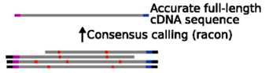


> <hands-on-title>Consensus module</hands-on-title>
>
> 1.  with the following parameters
>   -  *"Sequences"*: The `Plasmids` dataset collection
>   -  *"Overlaps"*: the latest `PAF file` collection created by **Minimap2** 
>   -  *"Target sequences"*: the `FASTA file` collection created by **GFA to Fasta** 
>
{: .hands_on}

The **Racon**  output file gives the final contigs.

The output of RB04 should look something like:

```
>utg000001c LN:i:4653 RC:i:11 XC:f:0.888889
AATGCAGCTATGGCGCGTGCGGTGCCAAGAAAGCCCGCAGATATTCCGCTTCCTCGCTCATT [..]
```

## Visualize assemblies using Bandage

To get a sense of how well our data was assembled, and to determine whether the contigs are chomosomal or plasmid DNA (the former being linear sequences while plasmids are circular molecules), **Bandage**  can give a clear view of the assembly.

**Bandage**  () (a **B**ioinformatics **A**pplication for **N**avigating **D**e novo **A**ssembly **G**raphs **E**asily), is a program that creates visualisations of assembly graphs.
Sequence assembler programs (such as **Miniasm**  (), **Velvet**  (), **SPAdes**  (), **Trinity**  () and **MEGAHIT**  ) carry out assembly by building a graph, from which contigs are generated.

By visualizing these assembly graphs, Bandage allows users to better understand, troubleshoot, and improve the assemblies.

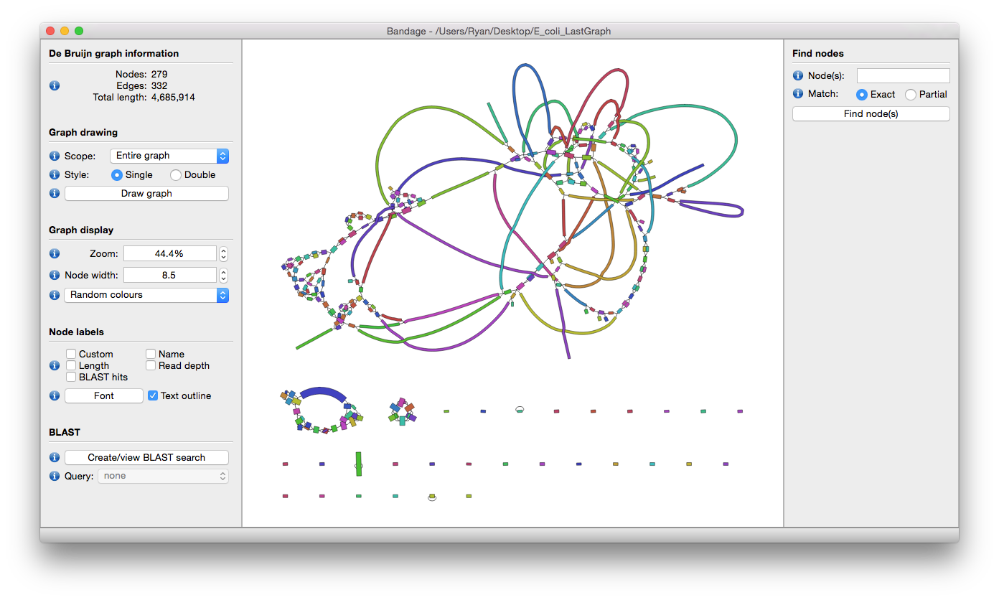


> <hands-on-title>Visualising de novo assembly graphs</hands-on-title>
>
> 1.  with the following parameters
>   -  *"Graphical Fragment Assembly"*: the `Assembly graph` collection created by **Miniasm** 
>
> 2. Explore  the output images
>
> > <question-title></question-title>
> >
> > In how many samples were the full plasmid sequences assembled?
> >
> > Hint: what shape do you expect plasmid molecules to be?
> >
> > > <solution-title></solution-title>
> > > Ideally, we want to see circular assemblies, indicating the full plasmid sequence was resolved.
> > > This is not the case for most of the samples, but we will improve our assemblies in the next section!
> > {: .solution }
> {: .question}
>
{: .hands_on}


For example, the assembly for sample RB01 looks something like this (your assembly will look a bit different due to randomness in several of the tools):


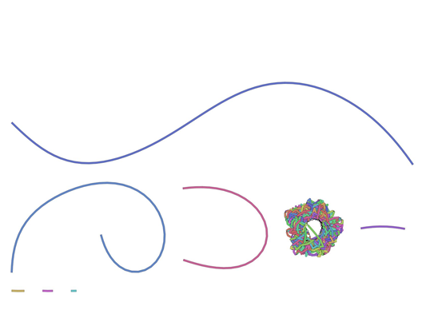


As you can see from these Bandage outputs, we were able to assemble our data into fairly large fragments, but were not quite successful in assembling the full (circular) plasmid sequences.

However, all the tools we used to do the assembly have many different parameters that we did not explore, and multiple rounds of mapping and cleaning could improve our data as well. Choosing these parameters carefully could potentially improve our assembly, but this is also a lot of work and not an easy task. This is where **Unicycler**  () can help us out.


## Optimizing assemblies using Unicycler

The assembly tools we used in this tutorial are all implemented in **Unicycler** , which will repeatedly run these tools on your data using different parameter settings, in order to find the optimal assembly.

**Unicycler**  has a couple of advantages over running the tools separately:

1. The first modification is to **help circular replicons assemble** into circular string graphs.
2. **Racon**  polishing is carried out in **multiple rounds to improve the sequence accuracy**. It will polish until the assembly stops improving, as measured by the agreement between the reads and the assembly.
3. Circular replicons are 'rotated' (have their starting position shifted) between rounds of polishing to ensure that **no part of the sequence is left unpolished**.


Let's try it on our data!

> <hands-on-title>Unicycler assembly</hands-on-title>
>
> 1.  with the following parameters
>   -  *"Paired or Single end data"*: `None`
>   -  *"Select long reads. If there are no long reads, leave this empty"*: The `Plasmids` dataset collection
>
> 2.  with the following parameters
>   -  *"Graphical Fragment Assembly"*: the `Final Assembly Graph` collection created by **Unicycler** 
>
> 3. Examine  the output images again
>
> 4. Use the **Scratchbook**  to compare the two assemblies for sample `RB01`
>    - Compare the **Bandage**  images for our two assemblies:
>      1. The assembly we got from running **minimap2, miniasm, racon**  (first time we ran bandage)
>      2. The assembly obtained with **Unicycler** 
>    - Tip: Search your history for the term `bandage` to easily find the outputs from our two bandage runs
>
>    
>
>    
>
> 5. Repeat this comparison for the other samples.
>
>    > <question-title></question-title>
>    >
>    > For which samples has the plasmid assembly improved?
>    >
>    > > <solution-title></solution-title>
>    > > Exploring the outputs for all the samples reveals that many now display circular assemblies, indicating the full plasmids sequence was resolved.
>    > {: .solution }
>    {: .question}
>
{: .hands_on}

The Assembly graph image of the RB01 assembly with **miniasm**  shows one unclear hypothetical plasmid, where the output of **Unicycler**  shows two clear plasmids, as also shown by .

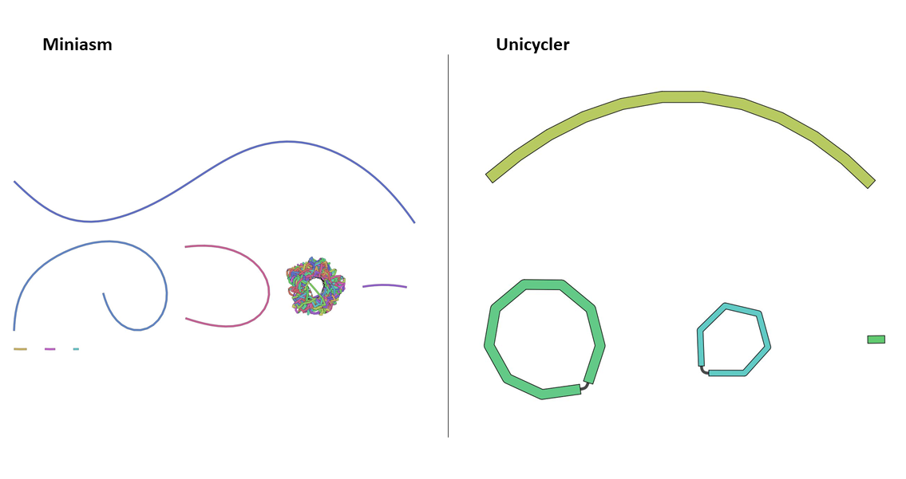

# Species and plasmids

## Prediction of plasmid sequences and classes using PlasFlow

To automatically determine whether the contigs represent chromosomal or plasmid DNA, **PlasFlow**  () can be used, also in the case where a full circular plasmid sequence was not assembled. Furthermore, it assigns the contigs to a bacterial class.

**PlasFlow**  is a set of scripts used for prediction of plasmid sequences in metagenomic contigs.
It relies on the neural network models trained on full genome and plasmid sequences and is able to differentiate between plasmids and chromosomes with accuracy reaching 96%.

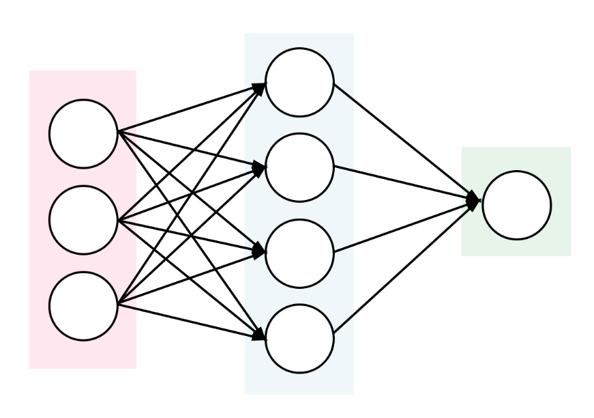


> <hands-on-title>Prediction of plasmid sequences</hands-on-title>
>
> 1.  with the following parameters
>   -  *"Sequence Reads"*: the `Final Assembly` collection created by **Unicycler** 
>
> > <question-title></question-title>
> >
> > What is the classification of contig_id 0 in RB10? (Hint: Check the probability table created by PlasFlow)
> >
> > > <solution-title></solution-title>
> > > plasmid.Proteobacteria
> > >
> > > This can be determined by looking at the 5th column of the probability table.
> > {: .solution }
> {: .question}
{: .hands_on}


The most important output of **PlasFlow**  is a tabular file containing all predictions, consisting of several columns including:

```
contig_id 	contig_name 	contig_length 	id 	label 	...
```

where:

- `contig_id`is an internal id of sequence used for the classification
- `contig_name` is a name of contig used in the classification
- `contig_length` shows the length of a classified sequence
- `id` is an internal id of a produced label (classification)
- `label` is the actual classification
- `...` represents additional columns showing probabilities of assignment to each possible class

Additionally, PlasFlow produces FASTA files containing input sequences binned to plasmids, chromosomes and unclassified.

# Antibiotic Resistance

## Scan genome contigs for antimicrobial resistance genes

To determine whether the contigs contain antimircobial resistance genes (AMR) [staramr](https://github.com/phac-nml/staramr) can be used.
**Staramr**  scans bacterial genome contigs against both the **ResFinder** (), **PointFinder** (), and **PlasmidFinder** () databases (used by the ResFinder webservice)
and compiles a summary report of detected antimicrobial resistance genes.

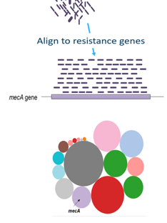


> <hands-on-title>Prediction of AMR genes</hands-on-title>
>
> 1.  with the following parameters
>   -  *"genomes"*: the `Final Assembly` collection created by **Unicycler** 
>
> > <question-title></question-title>
> >
> > Which samples contained the resistance gene: dfrA17?
> >
> > Hint: Check the resfinder.tsv created by staramr
> >
> > > <solution-title></solution-title>
> > > RB01, RB02, and RB10
> > >
> > > This can be determined by looking at the 2nd column of the resfinder.tsv output (and the first column for the sample names).
> > {: .solution }
> {: .question}
{: .hands_on}

There are 5 different output files produced by **staramr** :

1. `summary.tsv`:  A summary of all detected AMR genes/mutations in each genome, one genome per line.
2. `resfinder.tsv`: A tabular file of each AMR gene and additional BLAST information from the **ResFinder** database, one gene per line.
3. `pointfinder.tsv`: A tabular file of each AMR point mutation and additional BLAST information from the **PointFinder** database, one gene per line.
4. `settings.txt`: The command-line, database versions, and other settings used to run `staramr`.
5. `results.xlsx`: An Excel spreadsheet containing the previous 4 files as separate worksheets.

The summary file is most important and provides all the resistance genes found.

## CARD database
To get more information about these antibiotic resistant genes, you can check the [CARD database](https://card.mcmaster.ca) (**C**omprehensive **A**ntibiotic **R**esistance **D**atabase) ()

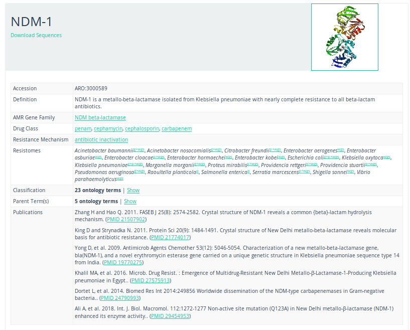


> <question-title></question-title>
>
> What is the resistance mechanism of the *dfrA17* gene?
>
> > <solution-title></solution-title>
> > antibiotic target replacement
> >
> > This can be determined by searching for [the gene on the CARD database](https://card.mcmaster.ca/ontology/39294)
> > <br><br>
> > For more information about antibiotic resistance mechanisms, see 
> {: .solution }
{: .question}


# Conclusion
You have now seen how to perform an assembly on Nanopore sequencing data, and classify the type and species of the sequences, as well as determined the presence of potential antibiotic resistance genes.

As for any analysis, there are many different tools that can do the job, and the tools presented here are just
one possible pipeline. Which tools are best for your specific data and research question depends on a number of
factors. For more information and comparisons between various tools, review papers such as  and 
may provide further insight.

You have worked your way through the following pipeline:


