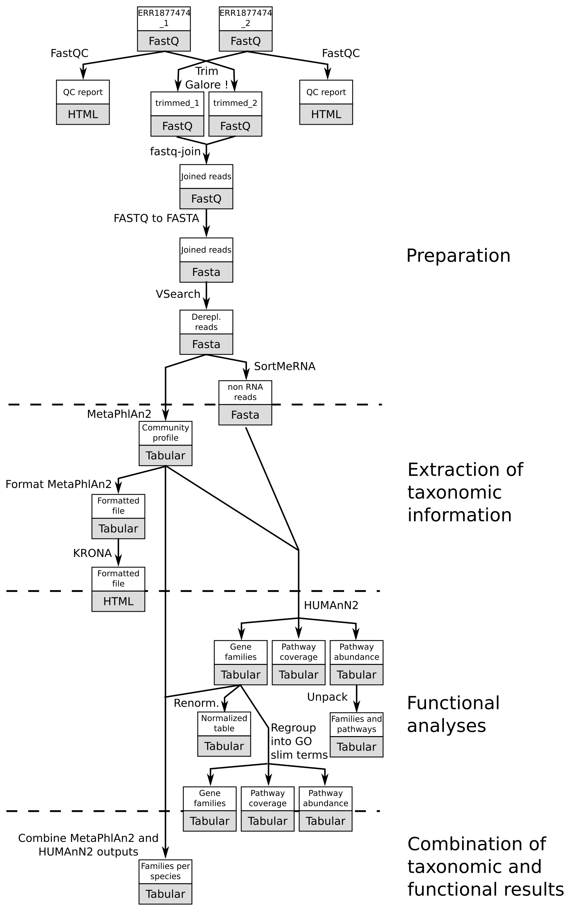

# Introduction
{:.no_toc}

In metagenomics, information about micro-organisms in an environment can be extracted with two main techniques:

- Amplicon sequencing, which sequence only on the rRNA/rDNA of organisms
- Shotgun sequencing, which sequence full genomes of the micro-organisms in the environment

Data generated from these two techniques must be treated differently. In this tutorial, we will focus on the analysis of whole-genome sequencing. 

> ###  Comments
> If you want to learn how to analyze amplicon data, please check our dedicated tutorials
{: .comment}

From both amplicon and shotgun metagenomics raw data, we can extract information about which micro-organisms are present in the studied environment. But, contrary to amplicon, shotgun metagenomics data contain also full genome information about the micro-organisms. It is then possible to identify genes associated to functions, to reconstruct metabolic pathways and then determine which functions are done by the micro-organisms in the studied environment. It is even possible to go further and determine which micro-organisms are involved in a given function or pathways.

> ### Agenda
>
> However, extraction of useful information from raw shotgun metagenomics sequences is a complex process
with numerous bioinformatics steps and tools to use. These steps can be get together in 4 main steps we will deal with in the following tutorial:
>
> 1. TOC
> {:toc}
>
{: .agenda}


In this tutorial, we will work on a sample of a [simulated community](https://www.ebi.ac.uk/metagenomics/projects/ERP021973/samples/ERS1588931/runs/ERR1877474/results/versions/3.0), with between 28 to 32 species and strains of bacteria, archaea, eukaryotes and bacteriophage. The community has the same cell/phage particle number for all community members. It was sequenced using NextSeq 500.

This sample has already been analyzed with the [EBI Metagenomics' pipeline](https://www.ebi.ac.uk/metagenomics/pipelines/3.0), which uses slightly different tools than the ones we will use here. But, we could compare our results with the ones obtained with EBI Metagenomics.

# Pretreatments

Before any extraction of information about the community, raw sequences have to be pre-processed with quality control of the raw sequences and sequence sorting. But, first, we need in get our data in Galaxy.

## Data upload

The original data are available at EBI Metagenomics under run number [ERR1877474](https://www.ebi.ac.uk/metagenomics/projects/ERP021973/samples/ERS1588931/runs/ERR1877474/results/versions/3.0). 

> ###  Hands-on: Data upload
>
> 1. Import the FASTQ file pair from [Zenodo]() or from the data library
>
>    > ###  Tip: Importing data via links
>    >
>    > * Copy the link location
>    > * Open the Galaxy Upload Manager
>    > * Select **Paste/Fetch Data**
>    > * Paste the link into the text field
>    > * Press **Start**
>    {: .tip}
>
>    > ###  Tip: Importing data from a data library
>    >
>    > * Go into "Shared data" (top panel) then "Data libraries"
>    > * Click on "Training data" and then "WGS input data"
>    > * Select both files
>    > * Click on "Import selected datasets into history"
>    > * Import in a new history
>    {: .tip}
>
>    As default, Galaxy takes the link as name, so rename them.
>
{: .hands_on}

## Quality control and treatment

For quality control, we use [FastQC](http://www.bioinformatics.babraham.ac.uk/projects/fastqc/) and [Trim Galore!](http://www.bioinformatics.babraham.ac.uk/projects/trim_galore/).

> ###  Hands-on: Quality control
>
> 1. **FastQC**  on both FastQ files to control the quality of the reads
> 2. **MulitQC**  with
>    - "Software name" to `FastQC`
>    - "Result file" to the raw data generated with FastQC
>
>    > ###  Questions
>    >
>    > 1. What can we say about the quality of the sequences in both sequence files?
>    >
>    >    <details>
>    >    <summary>Click to view answers</summary>
>    >    <ol type="1">
>    >    <li>The quality of the sequence decrease a lot at the end of sequences for both datasets. We will need to trim them</li>
>    >    </ol>
>    >    </details>
>    {: .question}
>
> 2. **Trim Galore**  with
>    - "Is this library paired- or single-end?" to `Paired-end`
>    - "Reads in FASTQ format" to the input datasets with first the forward (ending with `_1`) and then the reverse (ending with `_2`)
>    - "Trim Galore! advanced settings" to `Full parameter list`
>    - "Trim low-quality ends from reads in addition to adapter removal" to `20`
>    - "Discard reads that became shorter than length N" to `60`
>    - "Generate a report file" to `Yes`
>
> 3. **MulitQC**  with
>    - "Software name" to `Cutadapt`
>    - "Result file" to the report file generated with Trim Galore!
>
>    > ###  Questions
>    >
>    > 1. How much of the sequences have been trimmed?
>    >
>    >    <details>
>    >    <summary>Click to view answers</summary>
>    >    <ol type="1">
>    >    <li>6.7% and 18.3% of the bases for the forward reads and reverse reads (respectively)</li>
>    >    </ol>
>    >    </details>
>    {: .question}
{: .hands_on}

One sequence file in Fasta is expected for the next steps. We need then to assemble the paired sequences and convert them to Fasta.

> ###  Hands-on: Paired-end join and FASTA conversion
>
> 1. **fastq-join**  with
>    - "Dataset type" to `Paired-end`
>    - "Read 1 Fastq" to the forward trimmed reads 
>    - "Read 2 Fastq" to the reverse trimmed reads
> 2. **FASTQ to FASTA**  with
>    - "FASTQ Library to convert" to the joined FastQ file
>    - "Discard sequences with unknown (N) bases" to `no`
>    - "Rename sequence names in output file" to `no`
{: .hands_on}

## Dereplication

During sequencing, one sequence must have been added to the dataset in multiple exact copy. Removing such duplicates reduce the size of the dataset without loosing information, with the dereplication (identification of unique sequences in a dataset).

> ###  Hands-on: Dereplication
>
> 1. **VSearch dereplication**  with
>    - "Select your FASTA file" to the Fasta file generated previously
>    - "Strand specific clustering" to `Both strand`
>
>    > ###  Questions
>    >
>    > 1. How many sequences are removed with the dereplication?
>    >
>    >    <details>
>    >    <summary>Click to view answers</summary>
>    >    <ol type="1">
>    >    <li>314,302 sequences are conserved on the 314,641</li>
>    >    </ol>
>    >    </details>
>    {: .question}
>
{: .hands_on}

## Sequence sorting

With shotgun metagenomics data, full genome information can be accessed: information corresponding to CDS of the micro-organisms, sequences corresponding to ribosomal sequences (rDNA or rRNA) of the micro-organisms, etc. Useful functional information are present in sequences corresponding to CDS, and some taxonomic information in sequences corresponding to ribosomomal sequences (like the amplicon). To reduce the dataset size for the extraction of functional information, we can remove rRNA/rDNA sequences from the original dataset. 

This task is also useful to inspect the rRNA/rDNA sequences. And as in EBI Metagenomics' pipeline, these sequences can be used for taxonomic analyses as any amplicon data

> ###  Comments
> If you want to learn how to analyze amplicon data, please check our dedicated tutorials
{: .comment}

For this task, we use SortMeRNA ([Kopylova et al, 2012](https://academic.oup.com/bioinformatics/article-abstract/28/24/3211/246053)). This tool filter RNA sequences based on local sequence alignment (BLAST) against 8 rRNA databases (2 Rfam databases for 5.8S and 5S eukarya sequences and 6 SILVA datasets for 16S (archea and bacteria), 18S (eukarya), 23S (archea and bacteria) and 28S (eukarya) sequences.

> ###  Hands-on: Sequence sorting
>
> 1. **SortMeRNA**  with
>    - "Querying sequences" to the dereplicated dataset
>    - "Sequencing type" to `Reads are not paired`
>    - "Which strands to search" to `Search both strands`
>    - "Databases to query" to `Public pre-indexed ribosomal databases`
>    - "rRNA databases" to select all
>    - "Include aligned reads in FASTA/FASTQ format?" to `Yes`
>    - "Include rejected reads file?" to `Yes`
>    - "Include alignments in SAM format?" to `No`
>    - "Include alignments in BLAST-like format?" to `No`
>
> 2. (Optional) **SortMeRNA**  Run SortMeRNA on the assigned rRNA sequences with the selection of 16S rRNA databases
> 3. (Optional) **SortMeRNA**  Run SortMeRNA on the assigned rRNA sequences with the selection of 18S rRNA databases
{: .hands_on}

> ###  Questions
>
> 1. Which percentage of the original data are assigned to rRNA/rDNA sequences?
> 2. How can you explain with low percentage?
>
>    <details>
>    <summary>Click to view answers</summary>
>    <ol type="1">
>    <li>495 over 313,807 are aligned on rRNA databases so 0.16%</li>
>    <li>Shotgun metagenomics data with few rRNA genes</li>
>    </ol>
>    </details>
{: .question}

The low percentage of sequences assigned to rRNA genes show that using only these sequences can biais the found taxons. But if you want, you can still using the extracted 16S rRNA and/or 18S rRNA sequences with tools like QIIME for the taxonomic information. Here, we will use a different approach.

# Extraction of taxonomic information

The first important information to extract from any metagenomics sample is which micro-organisms are present in the sequenced sample and in which proportion are they present. So we want to extract information about the structure of the community of micro-organisms in the environment.

To identify the community structure, several approaches can be used. With amplicon or rRNA data, the sequences are clustered into Operational Taxonomic Units (OTU) and one representative sequence of each OTU is assigned to the most plausible microbial lineage. This approach is possible because of rRNA data: data that evolved quite slowly compared to other part of genomes, rRNA sequences data (particularly 16S and 18S) are then well conserved and good taxonomic markers.

However, for shotgun data, applying such approaches implies using a really small proportion of sequences for the taxonomic assignation, which can induce statistical bias. Other approaches have been developed to cope with shotgun data. For example, MetaPhlAn2 ([Truong et al, 2015](https://www.nature.com/nmeth/journal/v12/n10/full/nmeth.3589.html)) uses a database of ~1M unique clade-specific marker genes (not only the rRNA genes) identified from ~17,000 reference (bacterial, archeal, viral and eukaryotic) genomes.

## Taxonomic assignation

> ###  Hands-on: Taxonomic assignation
>
> 1. **MetaPhlAN2**  with
>    - "Input file" to the dereplicated sequences
>    - "Database with clade-specific marker genes" to `Locally cached`
>    - "Cached database with clade-specific marker genes" to `MetaPhlAn2 clade-specific marker genes`
>    - "Type of analysis to perform" to `Profiling a metagenomes in terms of relative abundances`
>    - "Taxonomic level for the relative abundance output" to `All taxonomic levels`
>
{: .hands_on}

3 files are generated by MetaPhlAn2:

- A tabular file with the community structure

    ```
    #SampleID   Metaphlan2_Analysis
    k__Bacteria 70.4264
    k__Viruses  29.5736
    k__Bacteria|p__Proteobacteria   64.0148
    k__Viruses|p__Viruses_noname    29.5736
    k__Bacteria|p__Firmicutes   4.18915
    ```

    Each line contains a taxa and its relative abundance found for our sample. The file starts with high level taxa (kingdom: `k__`) and go to more precise taxa.


- A BIOM file with the same information as the previous file but in BIOM format

    It can be used then by mothur and other tools requiring community structure information in BIOM format

- A SAM file with the results of the mapping of the sequences on the reference database

> ###  Questions
>
> 1. What is the most precise level we have access to with MetaPhlAn2?
> 2. What is the most abundant order found in our sample?
> 3. What is the most abundant family in our sample?
> 4. What type of viruses are found?
>
>    <details>
>    <summary>Click to view answers</summary>
>    <ol type="1">
>    <li>We have access to species level. Strains can be identified also but it is less reliable.</li>
>    <li>Enterobacteriales and Solirubrobacterales are found in our sample</li>
>    <li>The most abundant family is Enterobacteriaceae with 31.69 % of the assigned sequences</li>
>    <li>You can use the tool "Select lines" to extract the lines starting with "k__Viruses". The viruses are phages of Enterobacteria and Salmonella.</li>
>    </ol>
>    </details>
{: .question}

## Community structure visualization

The generated files remains difficult to inspect. Visualization would help. Here, we will look at 3 tools that can be used to visualize the community structure in our sample.

Krona ([Ondov et al, 2011](https://bmcbioinformatics.biomedcentral.com/articles/10.1186/1471-2105-12-385)) is a visualization tool for intuitive exploration of relative abundances of taxonomic classifications. It produces an interactive HTML file

> ###  Hands-on: Interactive visualization with KRONA
>
> 1. **Format MetaPhlAn2 output for Krona**  with
>    - "Input file" to `Community profile` output of `MetaPhlAn2`
>
> 2. **KRONA pie chart**  with
>    - "What is the type of your input data" as `MetaPhlan`
>    - "Input file" to the output of `Format MetaPhlAn2`
{: .hands_on}

> ###  Questions
>
> 1. Which bacteria species are found?
>
>    <details>
>    <summary>Click to view answers</summary>
>    <ol type="1">
>    <li>Escherichia coli, Salmonella enterica, Stenotrophomonas, etc</li>
>    </ol>
>    </details>
{: .question}

[GraPhlAn](https://bitbucket.org/nsegata/graphlan) is a tool for producing circular static representation of taxonomic analyses, easily exportable.

> ###  Hands-on: Static visualization with GraPhlAn
>
> 1. **Export to GraPhlAn**  with
>    - "Input file" to `Community profile` output of `MetaPhlAn2`
>    - "Use a LEfSe output file as input?" to `No`
>    - "List which levels should be annotated in the tree" to `5`
>    - "List which levels should use the external legend for the annotation" to `6,7`
>    - "Title font size" to `15`
>    - "Default size for clades not found as biomarkers" to `10`
>    - "Minimum value of clades that are biomarkers" to `0`
>    - "Maximum value of clades that are biomarkers" to `250`
>    - "Font size for the annotation legend" to `11`
>    - "Minimun abundance value for a clade to be annotated" to `0`
>    - "Number of clades to highlight" to `100`
>
>    > ###  Comments
>    > We decide to display the maximum of clade (100, here). If you want more or less, you can modulate the number of clades to highlight. And if you want to change displayed annotations, you can change levels to annotate.
>    {: .comment}
>
> 2. **Generation, personalization and annotation of tree for GraPhlAn**  with
>    - "Input tree" to the tree generated by the previous tool
>    - "Annotation file" to the annotation file generated by the previous tool
> 3. **GraPhlAn**  with
>    - "Input tree" to the tree generated in the last step
>    - "Output format" to `PNG`
>
{: .hands_on}

With our dataset, we obtain a nice graphical representation of taxonomic diversity inside our sample, with circle radius being proportional to relative abundance of the corresponding clade.

[Phinch](http://phinch.org/) is an open-source framework for visualizing biological data. 

Galaxy runs an instance of Phinch which is directly accessible for any BIOM file.

> ###  Hands-on: Visualisation with Phinch
>
> 1. Click on the BIOM file generated by MetaPhlAn2
> 2. Click on the "Visualize" icon and then on "Phinch"
>   
>    It will lead you to the Phinch website, which will automatically load in your file, and where you can several interactive visualisations:
>
{: .hands_on}

# Functional analyses

Investigation of the structure composition gives an insight on "What organisms are present in our sample". We now want to know "What are they doing in that environment?". 

With shotgun data, we have full genome information and particularly the sequence of genes. To determine which functions are done by the micro-organisms in the studied environment, we need then to identify genes, associate them to functions, combine such information to reconstruct metabolic pathways, ...

## Gene family and pathway identifications

The first step is then to identify sequences and affiliate them to a known genes, using available database. [HUMAnN2](http://huttenhower.sph.harvard.edu/humann2) is a tool to profile the presence/absence and abundance of gene families and microbial pathways in a community from metagenomic or metatranscriptomic sequencing data.

> ###  Hands-on: Metabolism function identification
>
> 1. **HUMAnN2**  with
>    - "Input sequence file" to the rejected sequences of SortMeRNA
>    - "Use a custom taxonomic profile?" to `Yes`
>    - "Taxonomic profile file" to the community profile file generated by MetaPhlAn2
>    - "Nucleotide database" to `Locally cached`
>    - "Nucleotide database" to `Full`
>    - "Software to use for translated alignment" to `Diamond`
>    - "Protein database" to `Locally cached`
>    - "Protein database" to `Demo`
>    - "Search for uniref50 or uniref90 gene families?" to `uniref50`
>    - "Database to use for pathway computations" to `MetaCyc`
>
{: .hands_on}

HUMAnN2 generates 3 files

- A file with the abundance of each gene family in the community

    Gene families are groups of evolutionarily-related protein-coding sequences that often perform similar functions. Gene family abundance at the community level is stratified to show the contributions from known and unknown species. Individual species' abundance contributions sum to the community total abundance.

    Gene family abundance is reported in RPK (reads per kilobase) units to normalize for gene length. It reflects the relative gene (or transcript) copy number in the community.

    "UNMAPPED" value is the total number of reads which remain unmapped after both alignment steps (nucleotide and translated search). Since other gene features in the table are quantified in RPK units, "UNMAPPED" can be interpreted as a single unknown gene of length 1 kilobase recruiting all reads that failed to map to known sequences.

- A file with the coverage of pathways

    Pathway coverage provides an alternative description of the presence (1) and absence (0) of pathways in a community, independent of their quantitative abundance.

- A file with the abundance of pathways

> ###  Questions
>
> 1. How many gene families are found? And pathways?
>
>    <details>
>    <summary>Click to view answers</summary>
>    We can not access directly this information: in the generated, the gene families and pathways are repeated for the different species contributing to these gene families. We then need to use the tool "Split stratified table" to extract only the lines without information about the involved species. We found then that 29,621 gene families and 333 pathways are found.
>    </details>
{: .question}

## Exploration of the gene families

The RPK for the gene families are quite difficult to interpret in term of relative abundance. We decide then to normalize the values

> ###  Hands-on: Normalize the gene family abundances
>
> 1. **Renormalize a HUMAnN2 generated table**  with
>    - "Gene/pathway table" to the gene family table generated with `HUMAnN2`
>    - "Normalization scheme" to `Relative abundance`
>    - "Normalization level" to `Normalization of all levels by community total`
>
>  > ###  Questions
>  >
>  > 1. Which percentage of sequences has not be assigned to a gene family?
>  > 2. What is the most abundant gene family?
>  > 3. Which genus is the most involved in "UniRef50_P77221"?
>  >
>  >    <details>
>  >    <summary>Click to view answers</summary>
>  >    <ol type="1">
>  >    <li>10.38% of the sequences has not be assigned to a gene family</li>
>  >    <li>The most abundant gene family with 0.1% of sequences is a unknown UniRef50 gene families. </li>
>  >    <li>Salmonella</li>
>  >    </ol>
>  >    </details>
>  {: .question}
{: .hands_on}

## Exploration of the pathways

HUMAnN2 infers [MetaCyc](http://metacyc.org/) pathways if the gene families implied in the pathways are detected. We may want to retrieve such information

> ###  Hands-on: Investigation of the gene families implied in pathways
>
> 1. **Unpack pathway abundances to show genes included** 
>
>  > ###  Questions
>  >
>  > 1. Which gene families are involved in 1CMET2-PWY pathwy for Rhizobium leguminosarum?
>  > 2. Are they different for Salmonella enterica?
>  >
>  >    <details>
>  >    <summary>Click to view answers</summary>
>  >    <ol type="1">
>  >    <li>UniRef50_Q1ME83, UniRef50_Q9I2Q2, UniRef50_Q99707, UniRef50_M4MVP5, UniRef50_Q9LHH7, UniRef50_Q7UID0, UniRef50_Q73WG1</li>
>  >    <li>
>  >      <ol>
>  >        <li>Found in both: UniRef50_Q7UID0</li>
>  >        <li>Found only for Rhizobium leguminosarum: UniRef50_Q1ME83, UniRef50_Q9I2Q2, UniRef50_Q99707, UniRef50_M4MVP5, UniRef50_Q9LHH7, UniRef50_Q73WG1</li>
>  >        <li>Found only for Salmonella enterica: UniRef50_P0AC29, UniRef50_P0AEZ1, UniRef50_E5AMJ1, UniRef50_B7M4N2, UniRef50_Q057P9</li>
>  >      </ol>
>  >    </li>
>  >    </ol>
>  >    </details>
>  {: .question}
{: .hands_on}

# Combination of taxonomic and functional results

With the previous analyses, we can now give some answers to the questions "Which micro-organims are present in my sample?" and "What function are done by the micro-organisms in my sample?". One remaining question stays unanswered: "Which micro-organisms are implied in the realization of a given function?".

To answer this question, we need to relate generated taxonomic and functional results. 

> ###  Hands-on: Combination of taxonomic and functional results
>
> 1. **Combine MetaPhlAn2 and HUMAnN2 outputs**  on the gene families
>
>    > ###  Questions
>    >
>    > 1. What are the different columns of the output?
>    > 2. Which species are involved in "HTH type transcriptional regulator BetI"?
>    >
>    >    <details>
>    >    <summary>Click to view answers</summary>
>    >    <ol type="1">
>    >    <li>The table represent for each gene family the implication of the species
>    >      <ol>
>    >          <li>The first 2 columns are the information about the genus implied in the gene families with the abundance of the genus globally in the sample</li>
>    >          <li>The next 2 columns are the information about the species, with similar information as for the genus</li>
>    >          <li>The next 3 columns are the information about the gene families: id, name and then the relative abundance of sequences related to the gene families attributed to the species in the 3rd column</li>
>    >      </ol>
>    >    </li>
>    >    <li>Escherichia_coli, Pseudomonas_pseudoalcaligenes and Pseudomonas_denitrificans</li>
>    >    </ol>
>    >    </details>
>    {: .question}
>
> 2. **Combine MetaPhlAn2 and HUMAnN2 outputs**  on the pathways
>
>    > ###  Questions
>    >
>    > 1. Are the same species involved in the different pathways related to "adenosine"?
>    >
>    >    <details>
>    >    <summary>Click to view answers</summary>
>    >    <ol type="1">
>    >    <li>To access such information, you can use the "Select line" tools and search for "adenosine". You will find 28 lines. We can see that in all pathways involved in "do novo biosynthesis", Rhizobium leguminosarum, Salmonella enterica, Agrobacterium fabrum and Pseudomonas pseudoalcaligenes but with different abundance for their implication.</li>
>    >    </ol>
>    >    </details>
>    {: .question}
{: .hands_on}

# Comparative analysis

This dataset comes from a [project](https://www.ebi.ac.uk/metagenomics/projects/ERP021973) to compare methods for quantifying taxonomic composition of microbial communities with 3 types of mock communities:

- The "C" type communities: same cell/phage particle number for all community members
- The "P" type communities: same protein content for all community members
- The "U" (uneven) type communities: large range of protein amounts and cell numbers

With this project, we have access to 3 replicates for each type of mock communities:

Type of mock community | Samples
--- | ---
Equal cell number mock community | ERR1877474, ERR1877475, ERR1877476
Equal protein amount mock community | ERR1877477, ERR1877478, ERR1877479
Uneven mock community | ERR1877480, ERR1877481, ERR1877482

We can then do some comparative analyses. We will now look at the pathway abundance and try to compare them between the 9 samples.

To save time, we already generated the gene families for you: the output of HUMAnN2 are avalaible on Zenodo

> ###  Hands-on: Comparative analysis of the pathway abundance
>
> 1. Upload the pathway abundance file from Zenodo
> 2. **Join HUMAnN2 generated tables** 
> 3. Create an empty file with 
> 4. Transform the space into tabular
> 5. Concatenate the file with header and joined table
> 6. **Associate HUMAnN2 functions with metadata** 
> 7. **Barplot stratified HUMAnN2 features** 
>
>    > ###  Questions
>    >
>    > 1. 
>    >
>    >    <details>
>    >    <summary>Click to view answers</summary>
>    >    <ol type="1">
>    >    <li></li>
>    >    </ol>
>    >    </details>
>    {: .question}
>
{: .hands_on}

# Conclusion

The analyses can be summarized by:



{:.no_toc}


