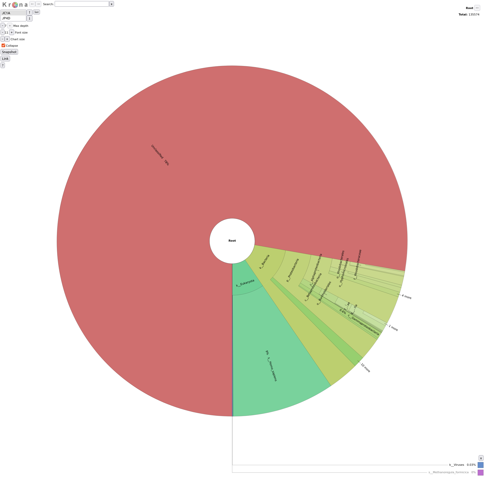
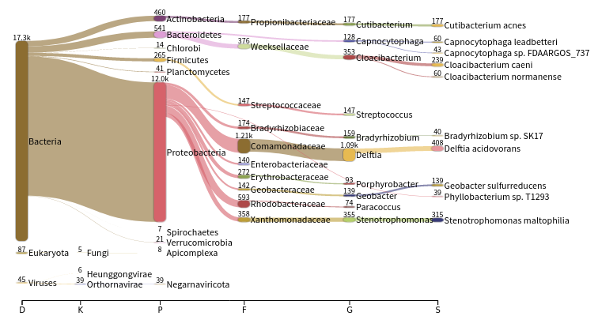
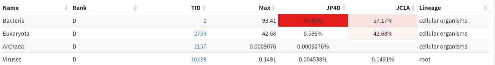

The term **"microbiome"** describes "a characteristic microbial community occupying a reasonably well-defined habitat which has distinct physio-chemical properties. The term thus not only refers to the microorganisms involved but also encompasses their theatre of activity" ().

Microbiome data can be gathered from different environments such as soil, water or the human gut. The biological interest lies in general in the question how the microbiome present at a specific site influences this environment. To study a microbiome, we need to use indirect methods like metagenomics or metatranscriptomics.

**Metagenomic samples** contain DNA from different organisms at a specific site, where the sample was collected. Metagenomic data can be used to find out which organisms coexist in that niche and which genes are present in the different organisms.
**Metatranscriptomic samples** include the transcribed gene products, thus RNA, that therefore allow to not only study the presence of genes but additionally their expression in the given environment. The following tutorial will focus on metagenomics data, but the principle is the same for metatranscriptomics data.

The investigation of microorganisms present at a specific site and their relative abundance is also called **"microbial community profiling"**.
The main objective is to identify the microorganisms that are present within the given sample. This can be achieved for all known microbes, where the DNA sequence specific for a certain species is known.

For that we try to **identify the taxon** to which each individual read belongs.



For metagenomic data analysis we start with sequences derived from DNA fragments that are isolated from the sample of interest. Ideally, the sequences from all microbes in the sample are present. The underlying idea of taxonomic assignment is to compare the DNA sequences found in the sample (reads) to DNA sequences of a database. When a read matches a database DNA sequence of a known microbe, we can derive a list with microbes present in the sample.

When talking about taxonomic assignment or taxonomic classification, most of the time we actually talk about two methods, that in practice are often used interchangeably:
- **taxonomic binning**: the clustering of individual sequence reads based on similarities criteria and assignation of clusters to reference taxa
- **taxonomic profiling**: classification of individual reads to reference taxa to extract the relative abundances of the different taxa

The reads can be obtained from **amplicon sequencing**  (e.g. 16S, 18S, ITS), where only specific gene or gene fragments are targeted (using specific primers) or **shotgun metagenomic sequencing**, where all the accessible DNA of a mixed community is amplified (using random primers). 
This tutorial focuses on reads obtained from shotgun metagenomic sequencing. 

## Taxonomic profiling

Tools for taxonomic profiling can be divided into three groups. Nevertheless, all of them require a pre-computed database based on previously sequenced microbial DNA or protein sequences.
1. **DNA-to-DNA**: comparison of sequencing reads with genomic databases of DNA sequences with tools like Kraken ()
2. **DNA-to-Protein** : comparison of sequencing reads with protein databases (more computationally intensive because all six frames of potential DNA-to amino acid translations need to be analyzed) with tools like DIAMOND)
3. **Marker based**: searching for marker genes (e.g. 16S rRNA sequence) in reads, which is quick, but introduces bias, with tools like MetaPhlAn ()

The comparison of reads to database sequences can be done in different ways, leading to three different types of taxonomic assignment:

- **Genome based** approach

   Reads are aligned to reference genomes. Considering the coverage and breadth, genomes are used to measure genome abundance. Furthermore, genes can be analyzed in genomic context. Advantages of this method are the high detection accuracy, that the unclassified percentage is known, that all SNVs can be detected and that high-resolution genomic comparisons are possible. This method takes medium compute cost.

- **Gene based** approach

   Reads are aligned to reference genes. Next, marker genes are used to estimate species abundance. Furthermore, genes can be analyzed in isolation for presence or absence in a specific condition. The major advantage is the detection of the pangenome (entire set of genes within a species). Major disadvantages are the high compute cost, low detection accuracy and that the unclassified percentage is unknown. At least intragenic SNVs can be detected and low-resolution genomic comparison is possible.

- **k-mer based** approach

   Databases as well as the samples DNA are broken into strings of length $$k$$ for comparison. From all the genomes in the database, where a specific k-mer is found, a lowest common ancestor (LCA) tree is derived and the abundance of k-mers within the tree is counted. This is the basis for a root-to-leaf path calculation, where the path with the highest score is used for classification of the sample. By counting the abundance of k-mers, also an estimation of relative abundance of taxa is possible. The major advantage of k-mer based analysis is the low compute cost. Major disadvantages are the low detection accuracy, that the unclassified percentage is unknown and that there is no gene detection, no SNVs detection and no genomic comparison possible. An example for a k-mer based analysis tool is Kraken, which will be used in this tutorial.

After this theoretical introduction, let's now get hands on analyzing an actual dataset!

## Background on data

The dataset we will use for this tutorial comes from an oasis in the Mexican desert called Cuatro Ciénegas (). The researchers were interested in genomic traits that affect the rates and costs of biochemical information processing within cells. They performed a whole-ecosystem experiment, thus fertilizing the pond to achieve nutrient enriched conditions.

Here we will use 2 datasets:
- `JP4D`: a microbiome sample collected from the Lagunita Fertilized Pond
- `JC1A`: a **control** samples from a control mesocosm.

The datasets differ in size, but according to the authors this doesn't matter for their analysis of genomic traits. Also, they underline that differences between the two samples reflect trait-mediated ecological dynamics instead of microevolutionary changes as the duration of the experiment was only 32 days. This means that depending on available nutrients, specific lineages within the pond grow more successfully than others because of their genomic traits.

The datafiles are named according to the first four characters of the filenames.
It is a collection of paired-end data with R1 being the forward reads and R2 being the reverse reads. Additionally, the reads have been trimmed using __cutadapt__ as explained in the [Quality control tutorial]().

> <agenda-title></agenda-title>
>
> In this tutorial, we will cover:
>
> 1. TOC
> {:toc}
>
{: .agenda}

# Prepare Galaxy and data

Any analysis should get its own Galaxy history. So let's start by creating a new one:

> <hands-on-title>Data upload</hands-on-title>
>
> 1. Create a new history for this analysis
>
>    
>
> 2. Rename the history
>
>    
>
{: .hands_on}

Now, we need to import the data

> <hands-on-title>Import datasets</hands-on-title>
>
> 1. Import the following samples via link from [Zenodo]({{ page.zenodo_link }}) or Galaxy shared data libraries:
>
>    ```text
>    {{ page.zenodo_link }}/files/JC1A_R1.fastqsanger.gz
>    {{ page.zenodo_link }}/files/JC1A_R2.fastqsanger.gz
>    {{ page.zenodo_link }}/files/JP4D_R1.fastqsanger.gz
>    {{ page.zenodo_link }}/files/JP4D_R2.fastqsanger.gz
>    ```
>
>    
>
>    
>
> 2. Create a paired collection.
>
>    
>
{: .hands_on}

# k-mer based taxonomic assignment with Kraken2

Our input data is the DNA reads of microbes present at Cuatro Ciénegas.

To find out which microorganisms are present, we will compare the reads of the sample to a reference database, i.e. sequences of known microorganisms stored in a database, using **Kraken2** ().



For this tutorial, we will use the PlusPF database which contains the Standard (archaea, bacteria, viral, plasmid, human, UniVec_Core), protozoa and fungi data.

> <details-title>What is in the PlusPF database</details-title>
> 
> Database | Origin
> --- | ---
> Archaea | RefSeq complete archaeal genomes/proteins
> Bacteria | RefSeq complete bacterial genomes/proteins
> Plasmid | RefSeq plasmid nucleotide/protein sequences
> Viral | RefSeq complete viral genomes/proteins
> Human | GRCh38 human genome/proteins
> Fungi | RefSeq complete fungal genomes/proteins
> Plant | RefSeq complete plant genomes/proteins
> Protozoa | RefSeq complete protozoan genomes/proteins
> UniVec_Core | A subset of UniVec, NCBI-supplied database of vector, adapter, linker, and primer sequences that may be contaminating sequencing projects and/or assemblies, chosen to minimize false positive hits to the vector database
>
> The databases have been prepared for Kraken2 by Ben Leagmead and [details can found on his page](https://benlangmead.github.io/aws-indexes/k2).
{: .details}

> <hands-on-title>Assign taxonomic labels with Kraken2</hands-on-title>
>
> 1.  with the following parameters:
>    - *"Single or paired reads"*: `Paired Collection`
>      -  *"Collection of paired reads"*: Input paired collection
>    - *"Confidence"*: `0.1`
>
>      A confidence score of 0.1 means that at least 10% of the k-mers should match entries in the database. This value can be reduced if a less restrictive taxonomic assignation is desired.
>
>    - In *"Create Report"*:
>        - *"Print a report with aggregrate counts/clade to file"*: `Yes`
>    - *"Select a Kraken2 database"*: most recent `Prebuilt Refseq indexes: PlusPF`
>
{: .hands_on}

**Kraken2** will create two outputs for each dataset

- **Classification**: tabular files with one line for each sequence classified by Kraken and 5 columns:

   1. `C`/`U`: a one letter indicating if the sequence classified or unclassified
   2. Sequence ID as in the input file
   3. NCBI taxonomy ID assigned to the sequence, or 0 if unclassified
   4. Length of sequence in bp (`read1|read2` for paired reads)
   5. A space-delimited list indicating the lowest common ancestor (LCA) mapping of each k-mer in the sequence     
      
      For example, `562:13 561:4 A:31 0:1 562:3` would indicate that:
      1. The first 13 k-mers mapped to taxonomy ID #562
      2. The next 4 k-mers mapped to taxonomy ID #561
      3. The next 31 k-mers contained an ambiguous nucleotide
      4. The next k-mer was not in the database
      5. The last 3 k-mers mapped to taxonomy ID #562     
      
      `|:|` indicates end of first read, start of second read for paired reads

   For JC1A:

   ```
   Column 1	Column 2	Column 3	Column 4	Column 5
   U 	MISEQ-LAB244-W7:91:000000000-A5C7L:1:1101:13417:1998 	0 	151|190 	A:18 0:14 2055:5 0:1 2220095:5 0:74 |:| 0:3 A:54 2:1 0:32 204455:1 2823043:5 0:60
   U 	MISEQ-LAB244-W7:91:000000000-A5C7L:1:1101:15782:2187 	0 	169|173 	0:101 37329:1 0:33 |:| 0:10 2751189:5 0:30 1883:2 0:39 2609255:5 0:48
   U 	MISEQ-LAB244-W7:91:000000000-A5C7L:1:1101:11745:2196 	0 	235|214 	0:173 2282523:5 2746321:2 0:21 |:| 0:65 2746321:2 2282523:5 0:108
   U 	MISEQ-LAB244-W7:91:000000000-A5C7L:1:1101:18358:2213 	0 	251|251 	0:35 281093:5 0:3 651822:5 0:145 106591:3 0:21 |:| 0:64 106591:3 0:145 651822:5
   U 	MISEQ-LAB244-W7:91:000000000-A5C7L:1:1101:14892:2226 	0 	68|59 	0:34 |:| 0:25
   U 	MISEQ-LAB244-W7:91:000000000-A5C7L:1:1101:18764:2247 	0 	146|146 	0:112 |:| 0:112
   C 	MISEQ-LAB244-W7:91:000000000-A5C7L:1:1101:12147:2252 	9606 	220|220 	9606:148 0:19 9606:19 |:| 9606:19 0:19 9606:148
   ```

   > <question-title></question-title>
   >
   > For JC1A sample
   > 1. Is the first sequence in the file classified or unclassified?
   > 2. What is the taxonomy ID assigned to the first classified sequence?
   > 3. What is the corresponding taxon?
   >
   > > <solution-title></solution-title>
   > > 1. classified
   > > 2. 9606, for the line 7
   > > 3. 9606 corresponds to Homo sapiens when looking at NCBI.
   > {: .solution}
   {: .question}

- **Report**: tabular files with one line per taxon and 6 columns or fields

   1. Percentage of fragments covered by the clade rooted at this taxon
   2. Number of fragments covered by the clade rooted at this taxon
   3. Number of fragments assigned directly to this taxon
   4. A rank code, indicating
      - (U)nclassified
      - (R)oot
      - (D)omain
      - (K)ingdom
      - (P)hylum
      - (C)lass
      - (O)rder
      - (F)amily
      - (G)enus, or
      - (S)pecies

      Taxa that are not at any of these 10 ranks have a rank code that is formed by using the rank code of the closest ancestor rank with a number indicating the distance from that rank. E.g., `G2` is a rank code indicating a taxon is between genus and species and the grandparent taxon is at the genus rank.

   5. NCBI taxonomic ID number
   6. Indented scientific name

   ```
   Column 1	Column 2	Column 3	Column 4	Column 5	Column 6
   76.86 	105399 	105399 	U 	0 	unclassified
   23.14 	31740 	1197 	R 	1 	root
   22.20 	30448 	312 	R1 	131567 	cellular organisms
   12.58 	17254 	3767 	D 	2 	Bacteria
   8.77 	12027 	2867 	P 	1224 	Proteobacteria
   4.94 	6779 	3494 	C 	28211 	Alphaproteobacteria
   1.30 	1782 	1085 	O 	204455 	Rhodobacterales
   0.43 	593 	461 	F 	31989 	Rhodobacteraceae
   0.05 	74 	53 	G 	265 	Paracoccus
   ```

   > <question-title></question-title>
   >
   > 1. What are the percentage on unclassified for JC1A and JP4D?
   > 2. What are the kindgoms found for JC1A and JP4D?
   > 3. Where might the eukaryotic DNA come from?
   > 4. How is the diversity of Proteobacteria in JC1A and JP4D?
   >
   > > <solution-title></solution-title>
   > >
   > > 1. 78% for JC1A and 90% for JP4D
   > > 2. Kindgoms:
   > >    - JC1A: 13% Bacteria, 10% Eukaryota, 0.03% Virus
   > >    - JP4D: 10% Bacteria, 0.7% Eukaryota
   > > 3. It seems to be human contamination
   > > 4. JC1A seems to have a big diversity of classes and species of Proteobacteria. JP4D seems more dominated by Aphaproteobacteria.
   > {: .solution}
   >
   {: .question}

Getting an overview of the assignation is not straightforward with the **Kraken2** outputs directly. We can use visualisation tools for that.

A "simple and worthwile addition to Kraken for better abundance estimates" () is called __Bracken__ (Bayesian Reestimation of Abundance after Classification with Kraken). Instead of only using proportions of classified reads, it takes a probabilistic approach to generate final abundance profiles. It works by re-distributing reads in the taxonomic tree: "Reads assigned to nodes above the species level are distributed down to the species nodes, while reads assigned at the strain level are re-distributed upward to their parent species" ().

> <hands-on-title>Estimate species abundance with Bracken</hands-on-title>
>
> 1.  with the following parameters:
>     -  *"Kraken report file"*: **Report** output of **Kraken**
>     - *"Select a kmer distribution"*: `PlusPF`, same as for Kraken
>
>        It is important to choose the same database that you also chose for Kraken2
>
>     - *"Level"*: `Species`
>     - *"Produce Kraken-Style Bracken report"*: `yes`
>
{: .hands_on}

# Visualization of taxonomic assignment

Once we have assigned the corresponding taxa to each sequence, the next step is to properly visualize the data. There are several tools for that:
- __Krona__ ()
- __Phinch__ ()
- __Pavian__ ()

## Visualisation using Krona

__Krona__ creates an interactive HTML file allowing hierarchical data to be explored with zooming, multi-layered pie charts. With this tool, we can easily visualize the composition of the bacterial communities and compare how the populations of microorganisms are modified according to the conditions of the environment.

Kraken outputs can not be given directly to **Krona**, they first need to be converted.

__Krakentools__ () is a suite of tools to work on Kraken outputs. It include a tool designed to translate results of the Kraken metagenomic classifier to the full representation of NCBI taxonomy. The output of this tool can be directly visualized by the Krona tool.

> <hands-on-title>Convert Kraken report file</hands-on-title>
>
> 1.  with the following parameters:
>    -  *"Kraken report file"*: **Report** collection of **Kraken**
>
> 2. Inspect the generated output for JC1A
{: .hands_on}


> <question-title></question-title>
>
> ```
> 3868 	k__Bacteria
> 2867 	k__Bacteria 	p__Proteobacteria
> 3494 	k__Bacteria 	p__Proteobacteria 	c__Alphaproteobacteria
> 1085 	k__Bacteria 	p__Proteobacteria 	c__Alphaproteobacteria 	o__Rhodobacterales
> 461 	k__Bacteria 	p__Proteobacteria 	c__Alphaproteobacteria 	o__Rhodobacterales 	f__Rhodobacteraceae
> 53 	k__Bacteria 	p__Proteobacteria 	c__Alphaproteobacteria 	o__Rhodobacterales 	f__Rhodobacteraceae 	g__Paracoccus
> 10 	k__Bacteria 	p__Proteobacteria 	c__Alphaproteobacteria 	o__Rhodobacterales 	f__Rhodobacteraceae 	g__Paracoccus 	s__Paracoccus_pantotrophus
> 6 	k__Bacteria 	p__Proteobacteria 	c__Alphaproteobacteria 	o__Rhodobacterales 	f__Rhodobacteraceae 	g__Paracoccus 	s__Paracoccus_sanguinis
> 4 	k__Bacteria 	p__Proteobacteria 	c__Alphaproteobacteria 	o__Rhodobacterales 	f__Rhodobacteraceae 	g__Paracoccus 	s__Paracoccus_sp._AK26
> 1 	k__Bacteria 	p__Proteobacteria 	c__Alphaproteobacteria 	o__Rhodobacterales 	f__Rhodobacteraceae 	g__Paracoccus 	s__Paracoccus_sp._MA
> ```
>
> 1. What are the different columns?
> 2. What are the lines?
>
> > <solution-title></solution-title>
> >
> > 1. Column 1 seems to correspond to the number of fragments covered by a taxon, the columns after represent the different taxonomic level (from kingdom to species)
> > 2. A line is a taxon with its hierarchy and the number of reads assigned to is
> {: .solution}
>
{: .question}

Let's now run **Krona**

> <hands-on-title>Generate Krona visualisation</hands-on-title>
> 1.  with the following parameters:
>    - *"Type of input data"*: `Tabular`
>    -  *"Input file"*: output of **Krakentools**
>
> 2. Inspect the generated file
{: .hands_on}

<iframe id="krona" src="krona-kraken.html" frameBorder="0" width="100%" height="900px">  </iframe>

> <question-title></question-title>
>
> 1. What are the percentage on unclassified for JC1A and JP4D?
> 2. What are the kindgoms found for JC1A and JP4D?
> 3. Where might the eukaryotic DNA come from?
> 4. How is the diversity of Proteobacteria in JC1A and JP4D?
>
> > <solution-title></solution-title>
> >
> > 1. 78% for JC1A and 90% for JP4D
> > 2. Kindgoms:
> >    - JC1A: 13% Bacteria, 10% Eukaryota, 0.03% Virus
> >    - JP4D: 10% Bacteria, 0.7% Eukaryota
> > 3. It seems to be human contamination
> > 4. JC1A seems to have a big diversity of classes and species of Proteobacteria. JP4D seems more dominated by Aphaproteobacteria.
> {: .solution}
>
{: .question}


## Visualization using Pavian

__Pavian__ (pathogen visualization and more) () is an interactive visualization tool for metagenomic data. It was developed for the clinical metagenomic problem to find a disease-causing pathogen in a patient sample, but it is useful to analyze and visualize any kind of metagenomics data.

> <hands-on-title>Launch Pavian</hands-on-title>
> 1.  with the following paramters:
>     -  *"Kraken and MetaPhlAn-style reports"*: **Report** collection of **Kraken**
>
{: .hands_on}

**Pavian** runs a Galaxy Interactive tool. You can access it when it become orange.

> <hands-on-title>Interact with Pavian</hands-on-title>
>
> 1. Open **Pavian**
>
>    
>
> 2. Import data
>    1. Click on `Use data on server`
>    2. Select both samples
>    3. Click on `Read selected directories`
>    4. Check you have a table in `Available sample sets` looks like
>
>       X | FormatOK | Include | Name | ReportFile | ReportFilePath
>       --- | --- | --- | --- | --- | ---
>       1 | X | X | JP4AD | JP4AD | /home/shiny//JP4AD
>       2 | X | X | JC1A | JC1A | /home/shiny//JC1A
>
>    5. Click on `Save table`
>
> 3. Click on `Results Overview` in the left panel
>
{: .hands_on}

This page shows the summary of the classifications in the selected sample set:


> <question-title></question-title>
>
> 1. Does both sample have same size?
> 1. What are the percentage of classified reads for JC1A and JP4D?
> 2. Are the percentage of bacterial reads similar?
>
> > <solution-title></solution-title>
> >
> > 1. JP4D has much more reads than JC1A
> > 2. 10.2% for JP4D and 23.1% for JC1A
> > 3. 12.6% for JC1A and 9.44% for JP4D. So similar magnitude orders
> {: .solution}
>
{: .question}

Let's now inspect assignements to reads per sample.

> <hands-on-title>Inspect samples with Pavian</hands-on-title>
>
> 1. Click on `Sample` in the left panel
> 2. Select `JC1A` in the `Select sample` drop-down on the top
>
>    The first view gives a Sankey diagram for one sample:
>
>    
>
>    > <question-title></question-title>
>    >
>    > 1. What is a Sankey diagram?
>    > 2. What are the different set of values represented as the horizontal axis?
>    >
>    > > <solution-title></solution-title>
>    > >
>    > > 1. A sankey diagram is a visualization used to depict a flow from one set of values to another
>    > > 2. The taxonomy hierarchy from domain on the left to species on the right
>    > {: .solution}
>    >
>    {: .question}
>
> 3. Click on `Proteobacteria` in the Sankey plot
> 4. Inspect the created graph on the right
>
>    
>
>    > <question-title></question-title>
>    >
>    > 1. Are the number of reads assigned to Proteobacteria similar for both samples?
>    > 2. Why?
>    >
>    > > <solution-title></solution-title>
>    > >
>    > > 1. JP4A has many more reads assigned to Proteobacteria than JC1A
>    > > 2. JP4A has many more reads initialls
>    > {: .solution}
>    >
>    {: .question}
{: .hands_on}

We would like now to compare both samples.

> <hands-on-title>Inspect samples with Pavian</hands-on-title>
>
> 1. Click on `Comparison` in the left panel
> 2. Select `%`  and unclick `Reads` in the blue area drop-down on the top
> 3. Click on `Domain` green button
>
>    
>
>    > <question-title></question-title>
>    >
>    > Is there similar proportion of Bacteria in both samples?
>    >
>    > > <solution-title></solution-title>
>    > >
>    > > JP4D has much higher proportion of Bacteria (> 93%>) than JC1A (57%), which contains quite a lot of Eukaryote
>    > {: .solution}
>    >
>    {: .question}
>
> 4. Select `Homo sapiens` in the `Filter taxa` box below the green buttons
>
>    > <question-title></question-title>
>    >
>    > Is there similar proportion of Bacteria in both samples?
>    >
>    > > <solution-title></solution-title>
>    > >
>    > > After human filtering, both samples have similar proportion of Bacteria
>    > {: .solution}
>    >
>    {: .question}
>
> 3. Click on `Class` green button
>
>    > <question-title></question-title>
>    >
>    > 1. How are the diversities of classes in both samples?
>    > 2. What could it biologically mean given that JC1A is a control and JP4D a sample from fertilized pond?
>    >
>    > > <solution-title></solution-title>
>    > >
>    > > 1. JP4D seems highly dominated by a Alphaproteobacteria class. JC1A has also a majority of Alphaproteobacteria, but also significant proportions of Betaproteobacteria, Gammaproteobacteria, Flavobacteria, Actinomycetia
>    > > 2. Alphaproteobacteria seems to have a survival advantage in the new environment. According to the authors this correlates with specific genomic traits that enable them to cope better with high nutrient availability.
>    > {: .solution}
>    >
>    {: .question}
>
{: .hands_on}

Once you are done with Pavian, you should delete it in your history so the corresponding job is killed.

> <details-title>Visualize the taxonomical classification with Phinch</details-title>
>
> __Phinch__ () is another tools to visualize large biological datasets like our taxonomic classification. Taxonomy Bar Charts, Bubble Charts, Sankey Diagrams, Donut Partitions and Attributes Column Chart can be generated using this tool.
>
> As a first step, we need to convert the Kraken output file into a kraken-biom file to make it accessible for Phinch. For this, we need to add a metadata file, provided on [Zenodo]({{ page.zenodo_link }}/files/metadata.tabular).
> When generating a metadata file for your own data, you can take this as an example and apply the [general guidelines](http://qiime.org/documentation/file_formats.html).
>
> > <hands-on-title>Phinch</hands-on-title>
> > 1. Import the metadata tabular from [Zenodo]({{ page.zenodo_link }}) or Galaxy shared data libraries:
> >
> >    ```text
> >    {{ page.zenodo_link }}/files/metadata.tabular
> >    ```
> >
> > 1. Use  to convert Kraken2 report into the correct format for phinch with the following parameters.
> >    -  *"Input"*: **Report** output of **Kraken2**
> >    -  *"Sample Metadata file"*: Metadata tabular
> >    - *"Output format"*: `JSON`
> >
> > 2.  with the following paramters:
> >    - *"Input"*: `Kraken-biom output file`
> {: .hands_on}
>
> **Phinch** runs a Galaxy Interactive tool. You can access it when it become orange.
>
> > <hands-on-title>Interact with Phinch</hands-on-title>
> >
> > 1. Open **Phinch**
> >
> >    
> >
> >    The first pages shows an overview of your samples. Here, you have the possibility to further filter your data, for example by date or location, depending on which information you provided in your metadata file.
> > 
> >    > <question-title></question-title>
> >    >
> >    > 1. How many sequence reads do the samples contain?
> >    >
> >    > > <solution-title></solution-title>
> >    > >
> >    > > 1. JC1A (Phinch name: 0) contains 56008 reads, while JP4D (Phinch name: 1) contains 242438 reads
> >    > {: .solution}
> >    {: .question}
> >
> > 2. Click on `Proceed to gallery` to see an overview of all visualization options.
> {: .hands_on}
>
> Let's have a look at the **taxonomy bar chart**. Here, you can see the abundance of different taxa depicted in different colors in your samples. On top of the chart you can select which rank is supposed to be shown in the chart.  You can also change the display options to for example switch between value und percentage. 
>
> > <question-title></question-title>
> >
> > 1. What information can you get from hovering over a sample?
> > 2. How many percent of the sample reads are bacteria and how many are eukaryota?
> >
> > > <solution-title></solution-title>
> > >
> > > 1. the taxon’s name and the taxonomy occurrence in the sample
> > > 2. choose kingdom and hover over the bars to find "taxonomy occurence in this sample":
> > >    - Sample 0: 75,65 % bacteria; 24,51 % eukaryota
> > >    - Sample 1: 92,70 % bacteria; 6,87 % eukaryota
> > {: .solution}
> {: .question}
>
> Let's go back to the gallery and choose the **bubble chart**. Here, you can find the distribution of taxa across the whole dataset at the rank that you can choose above the chart. When hovering over the bubbles, you get additional information concerning the taxon. 
> 
> > <question-title></question-title>
> >
> > 1. Which is the most abundant Class?
> > 2. How many reads are found in both samples?
> >
> > > <solution-title></solution-title>
> > >
> > > To order the bubbles according to their size you can choose the `list` option shown right next to the taxonomy level. Clicking on one bubble gives you the direct comparison of the distribution of this taxon in the different samples. 
> > > 1. The most abundant Class is Alphaproteobacteria
> > > 2. With 18.114 reads in Sample 0 and 153.230 reads in sample 1
> > {: .solution}
> {: .question}
>
>
> Another displaying option is the **Sankey diagram**, that is depicting the abundance of taxonomies as a flow chart. Again, you can choose the taxonomy level that you want to show in your diagram. When clicking on one bar of the diagram, this part is enlarged for better view.
>
> The **donut partition** summarizes the microbial community according to non-numerical attributes. In the drop-down menu at the top right corner, you can switch between the different attributes provided in the metadata file. In our case, you can for example choose the 'environmental medium' to see the difference between sediment and water (It doesn't really make a lot of sense in our very simple dataset, as this will show the same result as sorting them by sample 0 and 1, but if attributes change across different samples this might be an interesting visualization option). When clicking on one part of the donut you will also find the distribution of the taxon across the samples. On the right hand side you can additionally choose if you’d like to have dynamic y axis or prefer standard y axis to compare different donuts with each other.
>
> The **attributes column chart** summarizes the microbial community according to numerical attributes. In the drop-down menu at the top right corner, you can switch between the different attributes provided in the metadata file. In our case, you can for example choose the 'geographic location' to (again, it doesn't really make a lot of sense in our very simple dataset, as this will show the same result as sorting them by sample 0 and 1, but if attributes change across different samples this might be an interesting visualization option).
> 
> Once you are done with Phinch, you should delete it in your history so the corresponding job is killed.
{: .details}

# Choosing the right tool

When it comes to taxonomic assignment while analyzing metagenomic data, **Kraken2** is not the only tool available. Several papers do benchmarking of different tools (,,).

> <details-title>Benchmarking taxonomic classification tools</details-title>
>
> The benchmarking papers present different methods for comparing the available tools:
> - The **CAMI challenge** is based on results of different labs that each used the CAMI dataset to perform their analysis on and send it back to the authors.
> -  performed all the analysis themselves.
>
> Additionally, the datasets used for both benchmarking approaches differ:
> - **CAMI**: only ~30%-40% of reads are simulated from known taxa while the rest of the reads are from novel taxa, plasmids or simulated evolved strains.
> -  used International Metagenomics and Microbiome Standards Alliance (IMMSA) datasets, wherein the taxa are described better.
>
> When benchmarking different classification tools, several metrics are used to compare their performance:
> 1. **Precision**: proportion of true positive species identified in the sample divided by number of total species identified by the method.
> 2. **Recall**: proportion of true positive species divided by the number of distinct species actually in the sample.
> 3. Precision-recall curve: each point represents the precision and recall scores at a specific abundance threshold, the **area under the precision-recall curve (AUPR)**
> 4. **L2 distance**: representation of abundance profiles → how accurately the abundance of each species or genera in the resulting classification reflects the abundance of each species in the original biological sample (“ground truth”)
>
> When it comes to taxonomic profiling, thus investigating the abundance of specific taxa, the biggest problem is the abundance bias. It is introduced during isolation of DNA (which might work for some organisms better then for others) and by PCR duplicates during PCR amplification.
{: .details}

> <details-title>Profiling tools</details-title>
>
> Profilers, which are tools that investigate relative abundances of taxa within a dataset, fall into three groups depending on their performance:
> 1. Profilers, that correctly predict relative abundances
> 2. Precise profilers (suitable, when many false positives would increase cost and effort in downstream analysis)
> 3. Profilers with high recall (suitable for pathogen detection, when the failure of detecting an organism can have severe negative consequences)
>
> However, some characteristics are common to all profilers:
> - Most profilers only perform well until the family level
> - Drastic decrease in performance between family and genus level, while little change between order and family level
> - Poorer performance of all profilers on CAMI datasets compared to International Metagenomics and Microbiome Standards Alliance (IMMSA)
> - Fidelity of abundance estimates decreases notably when viruses and plasmids were present
> - High numbers of false positive calls at low abundance
> - Taxonomic profilers vs profiles from taxonomic binning:
> Precision and recall of the taxonomic binners were comparable to that of the profilers;
> abundance estimation at higher ranks was more problematic for the binners
{: .details}

Tool | Approach | Available in Galaxy | CAMI challenge | 
--- | --- | --- | --- | ---
mOTUs |  | No | Most memory efficient |
MetaPhlAn | Marker genes | Yes | | Recommended for low computational requirements (< 2 Gb of memory)
DUDes | | No | |
FOCUS |  | No | Fast, most memory efficient |
Bracken | k-mer | Yes | Fast |
Kraken | k-mer | Yes | Fastest; most memory efficient | Good performance metrics; very fast on large numbers of samples; allow custom databases when high amounts of memory (>100 Gb) are available

# Marker gene based approach using MetaPhlAn 

In this tutorial, we follow second approach using **MetaPhlAn** (). MetaPhlAn is a computational tool for profiling the composition of microbial communities (Bacteria, Archaea and Eukaryotes) from metagenomic shotgun sequencing data (i.e. not 16S) at species-level. MetaPhlAn 4 relies on ~5.1M unique clade-specific marker genes identified from ~1M microbial genomes (~236,600 references (bacterial, archeal, viral and eukaryotic) and 771,500 metagenomic assembled genomes) spanning 26,970 species-level genome bins.

It allows:
- unambiguous taxonomic assignments;
- accurate estimation of organismal relative abundance;
- species-level resolution for bacteria, archaea, eukaryotes and viruses;
- strain identification and tracking
- orders of magnitude speedups compared to existing methods.
- microbiota strain-level population genomics
- MetaPhlAn clade-abundance estimation

The basic usage of MetaPhlAn consists in the identification of the clades (from phyla to species and strains in particular cases) present in the microbiota obtained from a microbiome sample and their relative abundance.

**MetaPhlAn** in Galaxy can not directly take as input a paired collection but expect 2 collections: 1 with forward data and 1 with reverse. Before launching **MetaPhlAn**, we need to split our input paired collection.

> <hands-on-title>Assign taxonomic labels with MetaPhlAn</hands-on-title>
>
> 1.  with the following parameters:
>    -  *"Paired input to unzip"*: Input paired collection
>
> 2.  with the following parameters:
>    - In *"Inputs"*
>      - *"Input(s)"*: `Fasta/FastQ file(s) with microbiota reads`
>        - *"Fasta/FastQ file(s) with microbiota reads"*: `Paired-end files`
>          -  *"Forward paired-end Fasta/FastQ file with microbiota reads"*: output of **Unzip collection** with **forward** in the name
>          -  *"Reverse paired-end Fasta/FastQ file with microbiota reads"*: output of **Unzip collection** with **reverse** in the name
>    - In *"Outputs"*:
>        - *"Output for Krona?"*: `Yes`
{: .hands_on}


5 files and a collection are generated by **MetaPhlAn** :

- `Predicted taxon relative abundances`: tabular files with the **community profile**

   ```
   #SampleID 	Metaphlan_Analysis 		
   #clade_name 	NCBI_tax_id 	relative_abundance 	additional_species
   k__Bacteria 	2 	100.0 	
   k__Bacteria|p__Bacteroidetes 	2|976 	94.38814 	
   k__Bacteria|p__Proteobacteria 	2|1224 	5.61186 	
   k__Bacteria|p__Bacteroidetes|c__CFGB45935 	2|976| 	94.38814 	
   k__Bacteria|p__Proteobacteria|c__Alphaproteobacteria 	2|1224|28211 	5.61186 	
   k__Bacteria|p__Bacteroidetes|c__CFGB45935|o__OFGB45935 	2|976|| 	94.38814 	
   k__Bacteria|p__Proteobacteria|c__Alphaproteobacteria|o__Rhodobacterales 	2|1224|28211|204455 	5.61186 	
   k__Bacteria|p__Bacteroidetes|c__CFGB45935|o__OFGB45935|f__FGB45935 	2|976||| 	94.38814 	
   k__Bacteria|p__Proteobacteria|c__Alphaproteobacteria|o__Rhodobacterales|f__Rhodobacteraceae 	2|1224|28211|> 204455|    31989 	5.61186 	
   k__Bacteria|p__Bacteroidetes|c__CFGB45935|o__OFGB45935|f__FGB45935|g__GGB56609 	2|976|||| 	94.38814 	
   k__Bacteria|p__Proteobacteria|c__Alphaproteobacteria|o__Rhodobacterales|f__Rhodobacteraceae|g__Phycocomes 	2| 1224|    28211|204455|31989|2873978 	5.61186 	
   k__Bacteria|p__Bacteroidetes|c__CFGB45935|o__OFGB45935|f__FGB45935|g__GGB56609|s__GGB56609_SGB78025 	2| 976||||| 	94.    38814 	
   k__Bacteria|p__Proteobacteria|c__Alphaproteobacteria|o__Rhodobacterales|f__Rhodobacteraceae|g__Phycocomes|     s__Phycocomes_zhengii 	2|1224|28211|204455|31989|2873978|2056810 	5.61186 	
   k__Bacteria|p__Bacteroidetes|c__CFGB45935|o__OFGB45935|f__FGB45935|g__GGB56609|s__GGB56609_SGB78025| t__SGB78025 	2|    976|||||| 	94.38814 	
   k__Bacteria|p__Proteobacteria|c__Alphaproteobacteria|o__Rhodobacterales|f__Rhodobacteraceae|g__Phycocomes|     s__Phycocomes_zhengii|t__SGB31485 	2|1224|28211|204455|31989|2873978|2056810| 	5.61186 	
   ```

   Each line contains 4 columns:
   1. the lineage with different taxonomic levels, from high level taxa (kingdom: `k__`) to more precise taxa
   2. the NCBI taxon ids of the lineage taxonomic level
   3. the relative abundance found for our sample for the lineage
   4. any additional species

   > <question-title></question-title>
   >
   > 1. Which kindgoms have been identified for JC1A?
   > 2. For JP4D?
   > 3. How is the diversity for JP4D compared to **Kraken** results?
   >
   > > <solution-title></solution-title>
   > > 1. All reads have been unclassified so no kindgom identified
   > > 2. Bacteria, no eukaryotes
   > > 3. Diversity is really reduced for JP4D using **MetaPhlAn**, compared to the one identified with **Kraken**
   > {: .solution}
   {: .question}

- `Predicted taxon relative abundances for Krona`: same information as the previous files but formatted for > visualization using **Krona**

   ```
   Column 1	Column 2	Column 3	Column 4	Column 5	Column 6	Column 7	Column 8	Column 9	Column 10
   94.38814 		Bacteria 	Bacteroidetes 	CFGB45935 	OFGB45935 	FGB45935 	GGB56609 	GGB56609 SGB78025 	
   5.61186 		Bacteria 	Proteobacteria 	Alphaproteobacteria 	Rhodobacterales 	Rhodobacteraceae 	Phycocomes 	Phycocomes zhengii 	
   94.38814 		Bacteria 	Bacteroidetes 	CFGB45935 	OFGB45935 	FGB45935 	GGB56609 	GGB56609 SGB78025 	SGB78025
   5.61186 		Bacteria 	Proteobacteria 	Alphaproteobacteria 	Rhodobacterales 	Rhodobacteraceae 	Phycocomes 	Phycocomes zhengii 	SGB31485 
   ```

   Each line represent an identified taxons with 9 columns:
   - Column 1: The percentage of reads assigned the taxon
   - Column 2-9: The taxon description at the different taxonomic levels from Kindgom to more precise taxa

- A **collection** with the same information as in the tabular file but splitted into different files, one per taxonomic level
- `BIOM file` with **community profile** in BIOM format, a common and standard format in microbiomics and used as the input for tools like mothur or Qiime.

- `Bowtie2 output` and `SAM file` with the results of the sequence mapping on the reference database

Let's now run **Krona** to visualize the communities

> <hands-on-title>Generate Krona visualisation</hands-on-title>
> 1.  with the following parameters:
>    - *"Type of input data"*: `tabular`
>    -  *"Input file"*: Krona output of **Metaphlan**
> 
> 2. Inspect the generated file
{: .hands_on}

As pointed before, the community looks a lot less diverse than with **Kraken**. This is probably due to the reference database, which is potentially not complete enough yet to identify all taxons. Or there are too few reads in the input data to cover enough marker genes. Indeed, no taxon has been identified for JC1A, which contains much less reads than JP4D. However, **Kraken** is also known to have high number of false positive. A benchmark dataset or mock community where the community DNA content is known would be required to correctly judge which tool provides the better taxonomic classification.

# Conclusion

In this tutorial, we look how to get the community profile from microbiome data. We apply **Kraken2** or **MetaPhlAn** to assign taxonomic labels to two microbiome sample datasets. We then visualize the results using **Krona**, **Pavian** and **Phinch** to analyze and compare the datasets. Finally, we discuss important facts when it comes to choosing the right tool for taxonomic assignment.å
