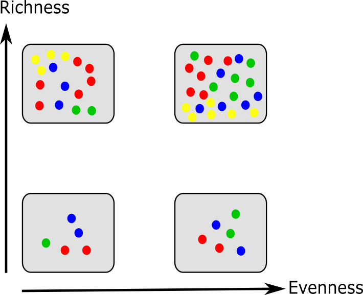
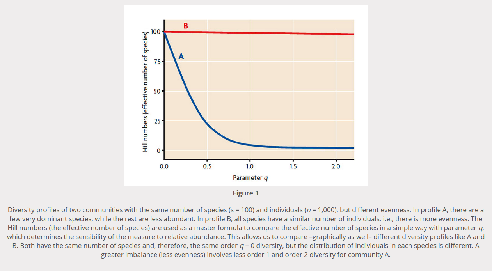

# Introduction

A **diversity index** is a quantitative measure that is used to assess the level of diversity or variety within a particular system, such as a biological community, a population, or a workplace. It provides a way to capture and quantify the distribution of different types or categories within a system.

In various fields, diversity indexes are employed to understand and compare the composition and richness of various elements. Apart from ecology, fields such as social and cultural science are interested in the diversity within a population or workplace. In these cases, the indexes may consider factors like age, gender, ethnicity, or other relevant characteristics to assess the diversity and inclusiveness of a group or organization.

To study microbiome data, indirect methods like **metagenomics** can be used. Metagenomic samples contain DNA from different organisms at a specific site, where the sample was collected. Metagenomic data can be used to find out which organisms coexist in that niche and which genes are present in the different organisms.

Once we know which taxons are present in a metagenomic sample ([Tutorial on Taxonomic Profiling and Visualization of Metagenomic Data]()), we can do diversity analyses.

Related to ecology, the term **diversity** describes the number of different species present in one particular area and their relative abundance. More specifically, several different metrics of diversity can be calculated. The most common ones are α, β and γ diversity:

- **α diversity** describes the diversity within a community

    It considers the number of different species in an environment (also referred to as species **richness**). Additionally, it can take the abundance of each species into account to measure how evenly individuals are distributed across the sample (also referred to as species **evenness**). 

- **β diversity** compare the diversity between different communities by measuring their distance

- **γ diversity** is a measure of the overall diversity for the different ecosystems within a region.


  

In this analysis we will use Galaxy for calculating different alpha diversity indexes and the Bray-Curtis dissimilarity index for β diversity. 

# Background on data

The dataset we will use for this tutorial comes from an oasis in the Mexican desert called Cuatro Ciénegas (). The researchers were interested in genomic traits that affect the rates and costs of biochemical information processing within cells. They performed a whole-ecosystem experiment, thus fertilizing the pond to achieve nutrient enriched conditions.

Here we will use 2 datasets:
- `JP4D`: a microbiome sample collected from the Lagunita Fertilized Pond
- `JC1A`: a **control** samples from a control mesocosm.

The datasets differ in size, but according to the authors this doesn't matter for their analysis of genomic traits. Also, they underline that differences between the two samples reflect trait-mediated ecological dynamics instead of microevolutionary changes as the duration of the experiment was only 32 days. This means that depending on available nutrients, specific lineages within the pond grow more successfully than others because of their genomic traits. The samples have been analysed as explained in the [Taxonomic profiling tutorial]().

In a nutshell, taxonomic labels have been assigned to the metagenomics data using [Kraken2](https://ccb.jhu.edu/software/kraken2/) to find out which species are present in the samples. Finally, species abundance was estimated using [Bracken](https://ccb.jhu.edu/software/bracken/). For this tutorial, we will use the output file of Bracken.

To get an overview, you can find a Krona chart visualizing the different species present in the two samples.

<iframe id="krona" src="krona-kraken.html" frameBorder="0" width="100%" height="900px">  </iframe>

The dataset we will work with in this tutorial is the output file of Bracken, which estimates species abundance.

```
name	taxonomy_id	taxonomy_lvl	kraken_assigned_reads	added_reads	new_est_reads	fraction_total_reads
Paracoccus sp. MC1862	2760307	S	98	4	102	0.00169
Paracoccus sp. AK26	2589076	S	85	8	93	0.00154
Paracoccus sp. Arc7-R13	2500532	S	67	13	80	0.00133
Paracoccus sp. BM15	1529068	S	27	1	28	0.00046
Paracoccus sanguinis	1545044	S	142	37	179	0.00297
Paracoccus contaminans	1945662	S	87	18	105	0.00174
Paracoccus aminovorans	34004	S	86	26	112	0.00186
```

> <question-title></question-title>
>
> What information do the different columns contain?
>
> > <solution-title></solution-title>
> >
> >  1. species name
> >  2. taxonomy ID
> >  3. taxonomic level: K_kingdom, P_phylum, C_class, O_order, F_family, G_genus, and S_species
> >  4. reads assigned by Kraken
> >  5. additional reads added by Bracken: In order to estimate species abundance, Bracken reestimates the reads assigned by Kraken using bayesian reestimation. For details on the procedure, have a look into the [Bracken publication](https://peerj.com/articles/cs-104/).
> >  6.  sum of column 4 and column 5
> >  7. fraction of the reads assigned to the particular species and the total reads
> >
> {: .solution}
{: .question}


> <details-title>More details on using input other than Bracken</details-title>
>
> It is possible to use Krakentools to calculate a and b diversity also on other datasets than the Bracken output. Any tool that outputs taxonomy abundances can be used prior to the diversity analysis. Importantly, the respective output file needs to be converted into the correct table format and filtered for the taxonomic rank "species". This step is not necessary when using Bracken output as already only the species level is listed.
>
>
{: .details}

> <agenda-title></agenda-title>
>
> In this tutorial, we will cover:
>
> 1. TOC
> {:toc}
>
{: .agenda}

# Prepare Galaxy and data

Any analysis should get its own Galaxy history. So let's start by creating a new one:

> <hands-on-title>Data upload</hands-on-title>
>
> 1. Create a new history for this analysis
>
>    
>
> 2. Rename the history
>
>    
>
{: .hands_on}

We need now to import the data

> <hands-on-title>Import datasets</hands-on-title>
>
> 1. Import the following samples via link from [Zenodo]({{ page.zenodo_link }}) or Galaxy shared data libraries:
>
>    ```text
>    {{ page.zenodo_link }}/files/JC1A_Estimate_Abundance_at_Species_Level.tsv
>    {{ page.zenodo_link }}/files/JP4D_Estimate_Abundance_at_Species_Level.tsv
>    ```
>
>    
>
>    
>
> 2. Create a paired collection.
>
>    
>
{: .hands_on}


# Calculating α diversity

## Theory of α diversity

**α diversity** describes the diversity within a community. There are several different indexes used to calculate α diversity because different indexes capture different aspects of diversity and have varying sensitivities to different factors. These indexes have been developed to address specific research questions, account for different ecological or population characteristics, or highlight certain aspects of diversity. 

(Source: [Pedro J Torres](https://medium.com/pjtorres-high-gut-alpha-diversity-and-health/high-alpha-diversity-and-health-65e5eca7fa36))

Metrics of alpha diversity can be grouped into different classes:

**richness**: estimate the quantity of distinct species within a sample

- **Margalef’s richness**, which indicates the estimated species richness, accounting for the community size. This metric takes into account that a larger community size can support a greater number of species ()
                                       
   $$ D = \frac{(S - 1)}{\log(n)} $$

   With
   - $$S$$ the total number of species,
   - $$n$$ the total number of individuals in the sample                                                                                                                                                          
- **Chao1**, which estimates the true species richness or diversity of a community, particularly when there might be rare or unobserved species. Chao1 estimates the number of unobserved species based on the number of singletons and doubletons. It assumes that there are additional rare species that are likely to exist but have not been observed. The estimation considers the number of unobserved singletons and doubletons and incorporates them into the observed species richness to provide an estimate of the true species richness ().
  
   $$ 
   S_{chao1} = S_{obs} + \frac{n_{1}(n_{1} - 1)}{2(n_2 + 1)} 
   $$
  
   With:
   - \\(S_{obs}\\) the observed species richness, 
   - \\(n_{1}\\) the number of species represented by a single individual (singletons), 
   - \\(n_{2}\\) the number of species represented by two individuals (doubletons).
  
- **ACE** (Abundance-based Coverage Estimator), which takes into account the abundance distribution of observed species and incorporates the presence of rare or unobserved species. ACE estimates the number of unobserved species based on the abundance distribution and incorporates it into the observed species richness. It takes into account the relative rarity of observed species and uses this information to estimate the true species richness.    
                                                                             

**evenness**: evaluate the relative abundances of species rather than their total count
  
- **Pielou’s evenness**, which quantifies how close the community’s diversity is to the maximum possible diversity. This index is calculated by taking the Shannon Diversity Index (which measures the overall diversity of the community) and dividing it by the maximum possible diversity given the observed species richness ().  

   $$ J = \frac{H'}{ln(S)} $$
                                                                                
   With:
   - $$H'$$ Shannon Weiner diversity
   - $$S$$ the total number of species in a sample, across all samples in dataset.
 

   
**diversity**: incorporate both the relative abundances and total count of distinct species
  
- **Shannons** index, which calculates the uncertainty in predicting the species identity of an individual that is selected from a community ().

   $$ 
   H' = - \sum_{i=1}^{S} p_i \cdot ln(p_i) 
   $$
   
   With:
   - \\(p_i\\) the proportion of individuals of species i
   - and ln the natural logarithm
                                                                                                                                  
- **Berger-Parker** index, which expresses the proportional importance of the most abundant type. Highly biased by sample size and richness ( ).

   $$ 
   D = \frac{n_{max}}{N} 
   $$
  
   With:
   - \\(n_{max}\\) the abundance of the most dominant species
   - N the total number of individuals (sum of all abundances)

- **Simpsons** index, which calculates the probability that two individuals selected from a community will be of the same species. Obtains small values in datasets of high diversity and large values in datasets of low diversity ().

  $$ 
  D = \sum_{i=1}^{S} \frac{n_i}{N}^2 
  $$
  
  With:
  - \\(n_i\\) is the number of individuals in species i
  - N = total number of individuals of all species
  - and \\(\frac{n_i}{N} = pi\\) (proportion of individuals of species i), and S = species richness.
                                                                    
- **Inverse Simpons** index, which is the transformation of Simpsons index that increases with increasing diversity. 

- **Fishers alpha** index, which describes the relationship between the number of species and the number of individuals in those species. Parametric index of diversity that assumes that the abundance of species follows a log series distribution ().

   $$ 
   S=a \cdot ln(1+\frac{n}{a}) 
   $$

   With:                                                      
   - S the number of taxa
   - n the number of individuals 
   - a the the Fisher's alpha. 



## Computing α diversity using Galaxy                                                  

**KrakenTools** is a suite of scripts designed to help Kraken users with downstream analysis of Kraken results. The Krakentool **Calculate alpha diversity** offers the possibility to calculate five different alpha diversity indexes:
1. Shannon's alpha diversity
2. Berger Parker's alpha
3. Simpson's diversity
4. Inverse Simpson's diversity
5. Fisher's index

> <hands-on-title>Calculate α diversity with Krakentools</hands-on-title>
> 1.  with the following parameters:
>    - *"Abundance file"*: `Dataset Collection`: uploaded Bracken output file
>    - *"Specify alpha diversity type"*: `Shannon's alpha diversity`
>
{: .hands_on}


> <question-title></question-title>
>
> 1. Calculate the 5 different alpha indexes available in Krakentools and compare the results. What do these numbers tell you?
> 2. Are the results consistent among the different indexes?
> 3. What is the dominant species in the samples. What problem do you see.
>
> > <solution-title></solution-title>
> >
> > 
> > 1. The five alpha indexes available in Krakentools are: Shannon's alpha diversity, Berger Parker's alpha, Simpson's diversity, Inverse Simpson's diversity, Fisher's index. Below you can find a table comparing the different results for both the JC1A and JP4D sample as well as an explanation of the meaning of these values.
> >     
> >     |                 | JC1A      | JP4D      |
> >     | --------------- | --------- | --------- |
> >     | Shannon         | 2.06    | 3.74    |
> >     | Berger-Parker   | 0.46    | 0.08    |
> >     | Simpson         | 0.74    | 0.97    |
> >     | Inverse Simpson | 3.92   | 28.84  |
> >     | Fisher          | 209.73 | 456.61 |
> >      
> >     
> >      When the **Shannon index** is given as a value of ~4, it indicates a **relatively high level of diversity** within the community. The index ranges from 0 to a maximum value that depends on the number of species and their relative abundances. The higher the Shannon index value, the greater the diversity within the community.
> >      
> >      When the **Berger-Parker index** is given as a value of 0.46, it suggests that **a single species dominates the community**, as it represents **46 %** of the total individuals in the community. This indicates a relatively low level of species evenness, meaning that the abundance of individuals is heavily skewed towards one dominant species. In contrast to the Shannon index, which considers both species richness and evenness, the Berger-Parker index emphasizes the dominance of a particular species. A value of 0.46 indicates that the community is heavily influenced by one species, while the other species in the community are less abundant. In the case of JP4D, the dominant species accounts for only **8 %** of the total individuals, which implies a **more balanced distribution of individuals** among different species compared to a higher Berger-Parker index value.
> >      
> >       When the **Simpson's index** is given as a value of 0.97, it indicates a **high level of species diversity and evenness** within the community. The index ranges from 0 to 1, with 1 representing maximum diversity. Therefore, a Simpson's index of 0.97 suggests that the community is highly diverse, with a relatively even distribution of individuals among different species. In other words, the value of 0.97 indicates that if you were to randomly select two individuals from the community, there is a 97% probability that they would belong to different species. This implies a rich and balanced community where multiple species coexist in relatively equal abundance.
> >  
> >       When the **Inverse Simpson's index** is given as a value of **3.92**, it suggests a **relatively low level of species diversity** within the community. The index ranges from 1 to the total number of species in the community, with higher values indicating higher diversity. Therefore, a value of 3.92 indicates a lower diversity compared to a higher index value. An Inverse Simpson's index of 28.84 suggests a relatively high level of species diversity within the community. The index ranges from 1 to the total number of species in the community, with higher values indicating greater diversity. Therefore, a value of **28.84 indicates a higher diversity compared to a lower index value**. The Inverse Simpson's index is the reciprocal of the Simpson's index, which quantifies species diversity and evenness within a community. A higher Inverse Simpson's index value signifies a community with a greater number of species and a more even distribution of individuals among those species.
> >
> > 
> > 2. The results are consistent as all indexes show JP4D to be the more diverse sample compared to JC1A.                                                                   
> > 3. If you look at the bracken files, you will see, that the dominant species in this samples is `Homo sapiens` - so us! This should not be part of the samples and is probably due to contamination. This finding should be used to reanalyze the samples and remove the human contamination. For the sake of simplicity we will continue with the samples as is and assume the `Homo sapiens` to be a species in out samples.                                                     
> {: .solution}
>
{: .question}


> <comment-title></comment-title>
>
> Apart from Krakentools, there are at least two more tools available in Galaxy that can be used to calculate diversity indexes, QIIME2 () and [Vegan](https://github.com/vegandevs/vegan).
>
>
> QIIME 2 (Quantitative Insights Into Microbial Ecology 2) is a powerful open-source bioinformatics software package that provides a comprehensive suite of tools and methods for processing, analyzing, and visualizing microbiome data. It offers a modular approach to microbiome analysis, allowing researchers to build flexible analysis pipelines tailored to their specific research goals. The software supports a wide range of data types, including 16S rRNA gene sequencing, metagenomics, metatranscriptomics, and others.
> 
> Some of the key features and functionalities of QIIME 2 include:
> 1. Diversity Analysis: QIIME 2 allows users to explore and quantify microbial diversity within and between samples. It provides metrics for alpha diversity (within-sample diversity) and beta diversity (between-sample diversity).
> 2. Data Import and Preprocessing
> 3. Taxonomic Assignments
> 4. Community Analysis
> 5. Phylogenetic Analysis
> 6. Statistical Analysiss.
> 7. Visualization
>
> The vegan package is a community ecology package in the R programming language. It provides a wide range of tools and methods for analyzing and interpreting ecological data, particularly in the context of community ecology. The package is designed to handle multivariate data and offers various statistical techniques for studying species composition, diversity, and community dynamics.
>
> The vegan package encompasses several functionalities, including:
>
> 1. Diversity Analysis: vegan offers numerous diversity indices, such as species richness, Shannon diversity index, Simpson index, and many others. These indices allow researchers to quantify the diversity of species within a community and compare diversity between different samples or groups.
> 2. Ordination Techniques
> 3. Community Classification:
> 4. Ecological Network Analysis
> 5. Ecological Indices
> 6. Plotting and Visualization
>
{: .comment}

# Calculating β diversity 

## Theory of β diversity

**β diversity** measures the distance between two or more separate entities. It therefore describes the difference between two communities or ecosystems. 

There are **multiple indexes** used to calculate β diversity because different indexes emphasize different aspects of compositional dissimilarity between communities or sites.

These indexes have been developed to address specific research questions, accommodate different data types, or provide insights into different dimensions of β diversity. Below, you can find a list of commonly used indexes to calculate β diversity and their description.

- **Jaccard Index**, which measures the proportion of shared species between two samples ().
  
  $$ 
  J(X, Y) =  \frac{\|  X ∩ Y\|}{\| X ∪ Y\|} 
  $$
  
   With:
   - $$X ∩ Y$$ the intersection of sets X and Y (elements common to both sets)
   - $$X ∪ Y$$ the union of sets X and Y (all unique elements from both sets combined)
  
- **Sørensen Index**, which is similar to Jaccard Index, but accounts for species abundance ().

  $$
  DSC = \frac{2\| X ∩ Y\|}{\| X\|} + \| Y\| 
  $$

   With:
   - $$X ∩ Y$$ the intersection of sets X and Y (elements common to both sets)
   - $$ \| X\|$$ and $$\| Y \|$$  the cardinalities of the two sets (i.e. the number of elements in each set)
  
- **Bray-Curtis Dissimilarity**, which measures the dissimilarity of species abundances between two samples ().

  $$ 
  BC_{ij} = 1 - \frac{2C_{ij}}{S_{i} + S_{j}}
  $$

   With:
   - \\(C_{ij}\\) the sum of the absolute differences in abundances between corresponding species in samples i and j
   - \\(S_{i}\\) the total abundance or sum of species abundances in sample i
   - \\(S_{j}\\) the total abundance or sum of species abundances in sample j
  
- **Kulczynski Dissimilarity**, which masures the dissimilarity in the proportional abundances of shared species.

  $$ 
  D = 1 - \frac{S_{AB}}{S_{A} + S_{B} - 2S_{AB}} 
  $$

   With:
   - \\(S_{AB}\\) the number of shared OTUs between communities A and B
   - \\(S_{A}\\) the number of OTUs in community A
   - \\(S_{B}\\) the number of OTUs in community B
  
- **UniFrac**, which incorporates information on phylogenetic distances between observed species in the computation. Can be calculated either weighted (accounts for abundances) or unweighted (accounts only for richness).

   

## Computing β diversity using Galaxy   

> <hands-on-title>Calculate β diversity with Krakentools</hands-on-title>
> 1.  with the following parameters:
>   - *"Taxonomy file"*: `Dataset Collection`: uploaded Bracken output file 
>   - *"Specify type of input file"*: `Bracken species abundance file`
>    
{: .hands_on}


> <question-title></question-title>
>
> 1. What is the Bray-Curtis dissimilarity calculated for the two samples?
> 2. What does this number tell you?
>
> > <solution-title></solution-title>
> >
> > 1. The output file gives you a table comparing sample 0 and 1, respectively. Consequently, comparing 0 to 0 and 1 to 1 results in a dissimilarity of 0, as those are exactly the same. Comparing sample 0 to sample 1 shows a Bray-Curtis dissimilarity of 0.701.
> > 2. The Bray-Curtis dissimilarity  measures the dissimiliraty of two samples. Consequently, an output of 0 represents two samples that are exactly the same, while an output of 1 means they are maximally divergent. In our case, a Bray-Curtis dissimilarity of 0.7 suggests that there is a substantial difference in the species composition or abundances between the two communities being compared. The higher the dissimilarity value, the greater the difference in species composition or abundances.
> {: .solution}
>
{: .question}

# Evaluation of different diversity metrics

Bonilla-Rosso et al. did **performance evaluation** of different diversity metrics using simulated data sets . For details on the individual metrics, please check their [publication](https://pubmed.ncbi.nlm.nih.gov/22554028/). However, it is important to note that none of the estimated metrics showed statistical similarity to their corresponding parameters in the source communities. Moreover, the results obtained were inconsistent across the samples.

This **inconsistency** can be attributed to the fact that individual metrics only provide a **specific** perspective on diversity and are prone to bias in their estimation, leading to incorrect ranking of the samples.

In summary, **relying solely on single-diversity metrics may not be enough** to accurately compare the diversity between two communities. Instead, we recommend utilizing multi-dimensional metrics to capture diverse rankings across different scales of diversity, which can be affected differently in manipulative studies.

**Multidimensional diversity metrics**, also known as multivariate diversity metrics, are quantitative measures that capture multiple dimensions or aspects of diversity simultaneously. These metrics go beyond single-diversity metrics, such as species richness or Shannon entropy, which provide a one-dimensional representation of diversity.

In contrast, multidimensional diversity metrics **take into account various attributes or characteristics** of species or communities to provide a more comprehensive understanding of diversity. These attributes can include species abundances, functional traits, phylogenetic relationships, or spatial distributions.

The choice and composition of dimensions in multidimensional diversity metrics depend on the research context and the specific objectives of the study. Some aspects, multidimensional diversity metrics take into account, include:
1. **Functional Diversity**: This metric considers the range and variation of functional traits among species within a community. It assesses the diversity of ecological roles and functional strategies present, contributing to ecosystem functioning and resilience.
2. **Phylogenetic Diversity**: This metric incorporates the evolutionary relationships among species within a community. It quantifies the diversity based on the length and topology of the phylogenetic tree, highlighting the evolutionary history and relatedness of species.
3. **Spatial Diversity**: This metric incorporates spatial patterns and distributions of species within a landscape or ecosystem. It considers the heterogeneity of habitats, connectivity, and the arrangement of species populations across space.

Multidimensional diversity metrics offer a **more nuanced and holistic perspective** on biodiversity, capturing different facets and dimensions of ecological variation. They provide insights into the ecological processes shaping communities and ecosystems and can be valuable in conservation planning, ecosystem management, and understanding the functional implications of biodiversity patterns.

> <details-title>More details on Multidimensional diversity metrics and Parameter q</details-title>
> 
> ## Multidimensional diversity metrics and Parameter q
>
> Expressing the compositional complexity of an assemblage cannot be accomplished with a single numerical value. Traditional measures like diversities (Hill numbers) and entropies (Rényi entropies) vary in their **order q**, which determines **the extent to which rare or common species are emphasized**. The ranking and comparison of assemblages rely on the chosen value of q. 
>
> Instead of selecting a few measures to describe an assemblage, it is preferable to **present a continuous profile** that depicts diversity or entropy as a function of q (where q ≥ 0). This approach enables a visual comparison of the compositional complexities among multiple assemblages and facilitates the assessment of the evenness in the relative abundance distributions of the assemblages. In practice, the profile is typically plotted for values of q ranging from 0 to q = 3 or 4, beyond which there is usually little change.
>
> 
> https://www.redalyc.org/journal/5117/511766773011/html/
> 
> # Hill numbers
> 
> Hill numbers, also known as diversity indices or diversity measures, are mathematical metrics used to quantify the diversity or richness of a biological community. They were developed by ecologist Robert H. Whittaker and are widely used in ecology and biodiversity studies.
>
> Hill numbers provide a way to summarize and compare the diversity of different communities based on the abundance or occurrence of different species within those communities. These numbers take into account both the number of species present and their relative abundances. The higher the Hill number, the greater the diversity or richness of the community.
>
> Hill numbers are often represented by the symbol "D", followed by a subscript that indicates the order of diversity. The order of diversity determines the weight given to rare versus common species. Commonly used Hill numbers include:
>
> 1.	Species richness (D₀): This is the simplest Hill number and represents the total number of species in a community, without considering their abundances. It provides a basic measure of biodiversity based on species count.
> 2.	Shannon diversity index (D₁): This index incorporates both species richness and evenness. It takes into account both the number of species and their relative abundances, providing a more comprehensive measure of diversity.
> 3.	Simpson diversity index (D₂): This index focuses on the dominance or concentration of species within a community. It considers both species richness and the probability that two individuals randomly selected from the community belong to the same species.
>
> # Rényi entropy
>
> Rényi entropy is a concept in information theory and statistical physics introduced by Alfréd Rényi, a Hungarian mathematician. It is a generalization of the Shannon entropy, which measures the uncertainty or information content of a random variable or probability distribution.
> The Rényi entropy of a discrete probability distribution is defined by the parameter α, which determines the order of the entropy. The formula for calculating Rényi entropy is:
>
> $$ 
> Hα(P) = \frac{1}{1 - α} \dot log_{2}(\sum{i=1}^{N} pi^α) 
> $$
>
> where P = {p₁, p₂, ..., pN} is the probability distribution of N discrete events or states, and pi represents the probability of the ith event.
>
> The value of α determines the properties of Rényi entropy. When α = 1, Rényi entropy reduces to Shannon entropy, providing a measure of average uncertainty or information content. As α approaches 0, Rényi entropy converges to the minimum value, representing the most certain or least diverse distribution. Conversely, as α approaches infinity, Rényi entropy approaches the maximum value, indicating a uniform or maximally diverse distribution.
>
> Rényi entropy has applications in various fields, including information theory, statistical physics, and data analysis. It offers a way to quantify the diversity or randomness of a system beyond the traditional Shannon entropy, allowing for a more nuanced understanding of information content and structure.
>
{: .details}


For further information on how to choose the best diversity metric also check

1. [Measuring the diversity of the human microbiota with targeted next-generation sequencing](https://academic.oup.com/bib/article/19/4/679/2871295?utm_source=pocket_reader) 
2. [Understanding microbial community diversity metrics derived from metagenomes: performance evaluation using simulated data sets](https://academic.oup.com/femsec/article/82/1/37/567182?utm_source=pocket_reader) 

# Conclusion

In this tutorial, we look how to calculate α and β  diversity from microbiome data. We apply **Krakentools** to calculate the α and β  diversity of two microbiome sample datasets.


