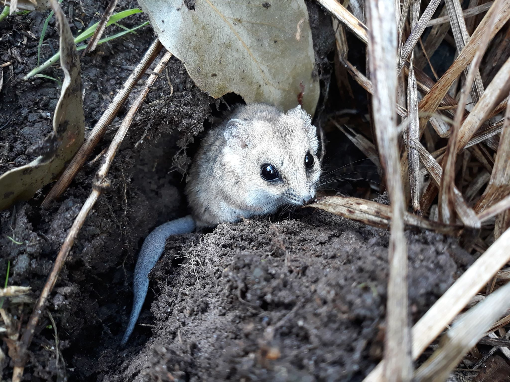
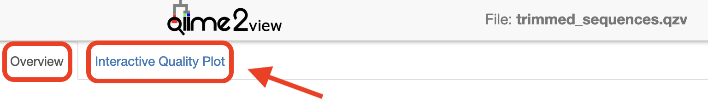
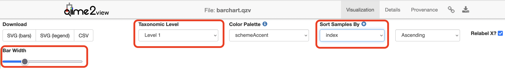
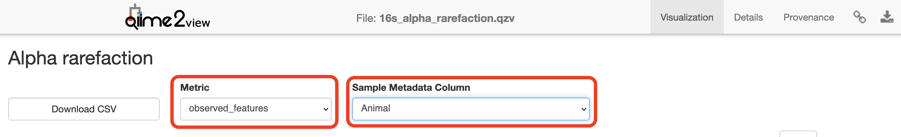
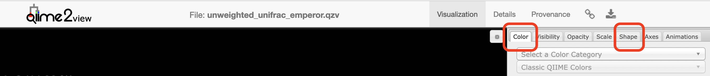
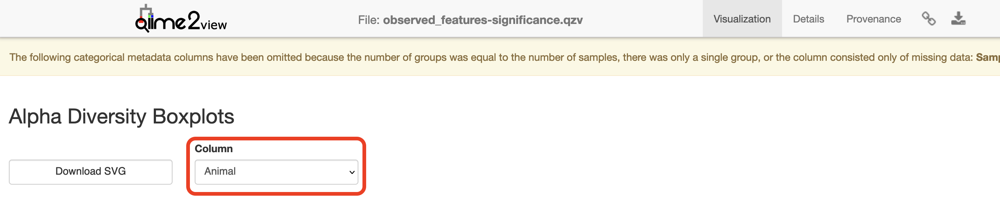
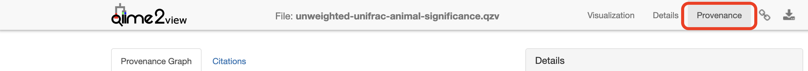

# Background

What is the influence of captivity on gut microbiota of the fat-tailed dunnart?

## The Players


(Photo credit: Emily Scicluna)


Fat-tailed dunnart [*Sminthopsis crassicaudata*](https://en.wikipedia.org/wiki/Fat-tailed_dunnart) - a species of mouse-like marsupial in the family Dasyuridae, which includes quolls, the Tasmanian devil, and the extinct Thylacine. There are 10 samples in this dataset (*This data is a subset from a larger experiment*); 5 faecal samples each from captive and wild fat-tailed dunnarts.  

## The Study

Indigenous microbial communities (microbiota) play critical roles in host health. Small marsupials, such as the fat-tailed dunnart, are increasingly used as model systems to understand how environmental conditions shape host-associated microbiomes. Transitions between wild and captive environments can substantially alter diet, behaviour, and microbial exposure, providing a natural framework to investigate microbiome restructuring and its potential consequences for host physiology and health. Here, we characterise the gut microbiome of wild and captive fat-tailed dunnarts to assess how captivity influences microbial community composition. This dataset represents a subset of a larger experimental framework examining microbiome-mediated effects on host function and conservation outcomes.

## QIIME 2 Analysis platform

> <comment-title>QIIME2 Version</comment-title>
> 
> The version used in this workshop is `qiime2-2026.1`. Other versions of QIIME2 may result in minor differences in results.
>
{: .comment}

Quantitative Insights Into Microbial Ecology 2 ([QIIME 2](https://www.nature.com/articles/s41587-019-0209-9)) is a next-generation microbiome [bioinformatics platform](https://qiime2.org/) that is extensible, free, open source, and community developed. It allows researchers to:

  - Automatically track analyses with decentralised data provenance
  - Interactively explore data with beautiful visualisations
  - Easily share results without QIIME 2 installed
  - Plugin-based system — researchers can add in tools as they wish

### Viewing QIIME2 visualisations

In order to use QIIME2 View to visualise your files, you will need to use a Google Chrome or Mozilla Firefox web browser (not in private browsing). For more information, click [here](https://view.qiime2.org). As this tutorial uses Galaxy Australia, you will need to download the visual files (*.qzv) to your local computer and view them in [QIIME2 View](https://view.qiime2.org) (q2view).

We will be doing this step multiple times throughout this workshop to view visualisation files as they are generated.


> <comment-title>The QIIME vizualisation extractor Tool</comment-title>
> 
> Within Galaxy, the `QIIME vizualisation extractor` tool can be used to view QIIME2 `.qzv` visualisation files. However, some QIIME2 visualisation files will not properly display or will lose some of the visualisation's interactive features.
> 
{: .comment}

This Galaxy tutorial based on material from the [Metabarcoding of bacteria in dunnart faecal samples across Australia (wild + captive)](https://mbite.mdhs.unimelb.edu.au/qiime2_dunnart/aio.html) tutorial and workshop created by [Melbourne Bioinformatics](https://mdhs.unimelb.edu.au/melbournebioinformatics) at the University of Melbourne.

> <agenda-title></agenda-title>
>
> In this tutorial, we will deal with:
>
> 1. TOC
> {:toc}
>
{: .agenda}

# Data upload

These [samples](./index.html#data) were sequenced on a single Illumina NextSeq run at the Walter and Eliza Hall Institute (WEHI), Melbourne, Australia. Data from WEHI came as paired-end, demultiplexed, unzipped *.fastq files with adapters still attached. Following the [QIIME2 importing tutorial](https://amplicon-docs.qiime2.org/en/stable/how-to-guides/how-to-import.html), this is the Casava One Eight format. The files have been renamed to satisfy the Casava format as `SampleID_FWDXX-REVXX_L001_R[1 or 2]_001.fastq` (e.g. `CTRLA_Fwd04-Rev25_L001_R1_001.fastq.gz`). The files were then zipped (`.gzip`).

Here, the data files (two per sample, i.e. forward and reverse reads `R1` and `R2` respectively) will be imported and exported as a single QIIME 2 artefact file. These samples are already demultiplexed (i.e. sequences from each sample have been written to separate files), so a metadata file is not initially required.


> <hands-on-title>Data upload</hands-on-title>
>
> 1. Create a new history
>
>    
>
> 2. Import from [Zenodo](https://doi.org/10.5281/zenodo.21614436).
>
>    > <tip-title>Importing data via links</tip-title>
>    >
>    > 1. Copy the link location
>    > 
>    > 2. Open the Galaxy Upload Manager
>    >    
>    > 3. Select **Paste/Fetch Data**
>    >
>    >    Below are the links to the datasets that are required for the tutorial that can be copied and pasted in the upload manager.
>    >
>    >    ```
>    >    https://zenodo.org/records/21614437/files/D01_FWD09_REV01_L001_R1_001.fastq.gz
>    >    https://zenodo.org/records/21614437/files/D01_FWD09_REV01_L001_R2_001.fastq.gz
>    >    https://zenodo.org/records/21614437/files/D06_FWD09_REV06_L001_R1_001.fastq.gz
>    >    https://zenodo.org/records/21614437/files/D06_FWD09_REV06_L001_R2_001.fastq.gz
>    >    https://zenodo.org/records/21614437/files/D08_FWD09_REV08_L001_R1_001.fastq.gz
>    >    https://zenodo.org/records/21614437/files/D08_FWD09_REV08_L001_R2_001.fastq.gz
>    >    https://zenodo.org/records/21614437/files/D09_FWD09_REV09_L001_R1_001.fastq.gz
>    >    https://zenodo.org/records/21614437/files/D09_FWD09_REV09_L001_R2_001.fastq.gz
>    >    https://zenodo.org/records/21614437/files/D11_FWD09_REV11_L001_R1_001.fastq.gz
>    >    https://zenodo.org/records/21614437/files/D11_FWD09_REV11_L001_R2_001.fastq.gz
>    >    https://zenodo.org/records/21614437/files/D13_FWD10_REV01_L001_R1_001.fastq.gz
>    >    https://zenodo.org/records/21614437/files/D13_FWD10_REV01_L001_R2_001.fastq.gz
>    >    https://zenodo.org/records/21614437/files/D14_FWD10_REV02_L001_R1_001.fastq.gz
>    >    https://zenodo.org/records/21614437/files/D14_FWD10_REV02_L001_R2_001.fastq.gz
>    >    https://zenodo.org/records/21614437/files/D17_FWD10_REV05_L001_R1_001.fastq.gz
>    >    https://zenodo.org/records/21614437/files/D17_FWD10_REV05_L001_R2_001.fastq.gz
>    >    https://zenodo.org/records/21614437/files/D19_FWD10_REV07_L001_R1_001.fastq.gz
>    >    https://zenodo.org/records/21614437/files/D19_FWD10_REV07_L001_R2_001.fastq.gz
>    >    https://zenodo.org/records/21614437/files/D20_FWD10_REV08_L001_R1_001.fastq.gz
>    >    https://zenodo.org/records/21614437/files/D20_FWD10_REV08_L001_R2_001.fastq.gz
>    >    https://zenodo.org/records/21614437/files/dunnart_metadata.tsv
>    >    https://zenodo.org/records/21614437/files/silva_138.2_16s_v4_classifier.qza
>    >    ```
>    >
>    > 4. Paste the links into the text field
>    > 
>    > 5. Press **Start**
>    {: .tip}
>
> 3. Create a paired collection of the imported raw reads (`.fastq.gz`) datasets.
> 
>    
>
{: .hands_on}

# Importing, cleaning and quality control of the data

## Remove primers

> <comment-title>Check with Sequencing Facility</comment-title>
> 
> Remember to ask your sequencing facility if the raw data you get has the primers attached - they may have already been removed.
>
{: .comment}

These sequences still have the primers attached and must be removed prior to denoising. 

For this workshop, we perform primer trimming using the `cutadapt` tool in Galaxy. Amplicons were generated using standard 16S rRNA gene primers for the v4 region, and the reads returned from the sequencer therefore include these primer sequences at the 5′ ends. Using `cutadapt`, the specified primer sequence and any bases upstream of the match are removed, with an error rate of 0.10 to balance sensitivity of primer detection with specificity of trimming. Degenerate bases in the primers are accommodated using wildcard matching, and any reads lacking the expected primer sequences are discarded to minimise inclusion of off-target amplification products. A modest 3′ quality trimming threshold (Phred score = 20) is also applied to remove low-quality bases prior to downstream denoising.

It is important to note that these data were generated on an Illumina NextSeq platform, which uses 2-colour chemistry and can produce artificial poly-G tails at the ends of reads under low-signal conditions. We use standalone `cutadapt` tool instead of `qiime2 cutadapt trim-paired` because the QIIME2 implementation does not have the `NextSeq trimming` parameter (the `--nextseq-trim` flag if running `cutadapt` via command line), which is specifically designed to remove these artificial poly-G tails.

> <hands-on-title>Run Cutadapt</hands-on-title>
>
> 1. : 
>    - *"Single-end or Paired-end reads?"*: `Paired-End Collection`
>    - *"Paired Collection"*: `paired reads`
>    - *"Read 1 Adapters"*: `+ Insert 5' (Front) Adapters"`
>        - *"1: 5' (Front) Adapters"*
>        - *"Source"*: `Enter Custom Sequence`
>        - *"Custom 5' adapter sequence "*: `GTGYCAGCMGCCGCGGTAA`
>    - *"Read 2 Adapters"*: `+ Insert 5' (Front) Adapters"`
>        - *"1: 5' (Front) Adapters"*
>        - *"Source"*: `Enter Custom Sequence`
>        - *"Custom 5' adapter sequence "*: `GGACTACNVGGGTWTCTAAT`
>    - *"Adapter Handling Options"*
>        - *"Maximum error rate"*: `0.1`
>        - *"Minimum overlap length"*: `10`
>        - *"Match wildcards in adapters"*: `Yes`
>    - *"Other Read Trimming Options"*
>        - *"Quality cutoff(s) (R1)"*: `0,30`
>        - *"NextSeq trimming"*: `20`
>    - *"Read Filtering Options"*
>        - *"Discard Untrimmed Reads"*: `Yes`
>
> 2. Rename the output to: `trimmed pairs`
>
> > <comment-title>Primers</comment-title>
> >
> > The primers specified are the Earth Microbiome Project (EMP) 16S V4 primers (515F (Parada)– 806R (Apprill) targeting the v4 region of the bacterial 16S rRNA gene), which correspond to *this* specific experiment. Unless you are using these exact primers for your experiment, you will need to replace the `Custom 5’ adapter sequence` with the primers used in your experiment.
> >
> {: .comment}
>
> > <comment-title>Error Rate and Overlap</comment-title>
> >
> > The error rate, `Maximum error rate`, and overlap, `Minimum overlap length`, parameters will likely need to be adjusted for your own sample data to maximise the proportion of reads successfully trimmed while avoiding nonspecific matches. Play around with these values and see what happens.
> >
> {: .comment}
> 
> > <comment-title>Alternately running qiime2 cutadapt trim-paired</comment-title>
> > 
> > The following step shows the tool set up for running `qiime2 cutadapt trim-paired` to perform a simplified trimming approach without the `NextSeq trimming` option. However, for production analyses of NextSeq data, best practice is to perform trimming with the standalone `cutadapt` (including `NextSeq trimming`) prior to importing reads into QIIME 2, as this improves removal of sequencing artefacts and can enhance downstream denoising and taxonomic resolution.
> >
> > Note, `qiime2 cutadapt trim-paired` requires the input reads to be stored as a single QIIME2 artefact (e.g. `combined.qza`), not a dataset collection as used by `cutadapt`. A QIIME2 artefact can be created from a dataset collection using `qiime2 tools import` as shown below in [Hands On: Create QIIME2 Artefact](#hands-on-create-qiime2-artefact).
> >
> > > <hands-on-title>Run Cutadapt</hands-on-title>
> > >
> > > 1. : 
> > >    - *"demultiplexed_sequences: SampleData[PairedEndSequencesWithQuality]"*: `combined.qza`
> > >    - *"Click here for additional options"*
> > >    - *"front_f: List[Str]"*: `+ Insert front_f: List[Str]"`
> > >        - *"1: front_f: List[Str]"*: `GTGYCAGCMGCCGCGGTAA`
> > >    - *"front_r: List[Str]"*: `+ Insert front_r: List[Str]"`
> > >        - *"1: front_r: List[Str]"*: `GGACTACNVGGGTWTCTAAT`
> > >    - *"error_rate: Float % Range(0, 1, inclusive_end=True)"*: `0.1`
> > >    - *"overlap: Int % Range(1, None)"*: `10`
> > >    - *"match_adapter_wildcards: Bool"*: `Yes`
> > >    - *"discard_untrimmed: Bool"*: `Yes`
> > >    - *"quality_cutoff_5end: Int % Range(0, None)"*: `0`
> > >    - *"quality_cutoff_3end: Int % Range(0, None)"*: `30`
> > >
> > > 2. Rename the output to: `trimmed_sequences.qza`
> > >
> > {: .hands_on}
> >
> {: .comment}
> 
{: .hands_on}

## Create a QIIME2 Artefact

QIIME2 requires `.fastq.gz` sequence datasets to follow the CASAVA file naming format (`SampleID_FWDXX-REVXX_L001_R[1 or 2]_001.fastq`, e.g. `D01_FWD09_REV01_L001_R1_001.fastq.gz`) in order to import `.fastq.gz` sequence datasets into the QIIME2 artefact format (`.qza`), which is the data format used by the QIIME2 suite of tools. Generally a single `.qza` QIIME2 artefact will be created that contains all of the `.fastq.gz` sample datasets to be processed. 

In Galaxy, the `.fastq.gz` datasets can be provided as an input to the import tool, `qiime2 tools import`, either as individual datasets (although this requires manually specifying each dataset to be included) or as a dataset collection (recommended method). The input dataset collection must be a list collection even when using paired-end reads.

The following steps reformat the paired-end collection of `.fastq.gz` trimmed sequences produced by Cutadapt to a flat list collection and rename the datasets within the list collection to satisfy the CASAVA format requirements.

> <hands-on-title>Prepare Collection for QIIME2</hands-on-title>
> 
> 1. : 
>    - *"Input Collection"*: `trimmed pairs`
>   
> 2. Rename the output to: `trimmed pairs flattened`
> 
> 3. : 
>    - *"Dataset collection"*: `trimmed sequences flattened`
>   
> 4. Rename the output to: `collection identifiers`
>   
> 5. : 
>    - *"Select lines from"*: Output of `collection identifiers`
>    - *"Check"*: `+ Insert Check`
>        - *"Find Regex"*: `001_forward`
>        - *"Replacement"*: `R1_001.fastq.gz`
>     - *"Check"*: `+ Insert Check`
>        - *"Find Regex"*: `001_reverse`
>        - *"Replacement"*: `R2_001.fastq.gz`
> 
> 6. Rename the output to: `corrected identifiers`
> 
> 7. : 
>    - *"Paste"*: `collection identifiers`
>    - *"and"*: `corrected identifiers`
>    - *"Delimit by"*: `Tab`
> 
> 8. Rename the output to: `identifier mapping`
> 
> 9. : 
>    - *"Input Collection"*: `trimmed sequences flattened`
>    - *"How should the new labels be specified?"*: `Map original identifiers to new ones using a two-column table`
>        - *"Identifier mapping"*: `identifier mapping`
>
> 10. Rename the output to: `trimmed sequences`
> 
{: .hands_on}

Once the collection of trimmed `.fastq.gz` sequences is correctly named to import into QIIME2, we use the `qiime2 tools import` tool to create a single QIIME2 artefact file (`.qza`) containing all the trimmed sequences.

> <hands-on-title>Create QIIME2 Artefact</hands-on-title>
>
> 1. : 
>    - *"Type of data to import"*: `SampleData[PairedEndSequencesWithQuality]`
>    - *QIIME 2 file format to import from:*: `Casava One Eight Single Lane Per Sample Directory Format`
>    - *"Import sequences"*
>      - *"Select a mechanism"*: `Use collection to import`
>      - *"elements"*: `trimmed sequences`
>    - *"Append an extension?"*: `No, use element identifiers as is` (*If the datasets in the collection include the extension `.fastq.gz`*)
>
> 2. Rename the output to: `trimmed_sequences.qza`
>    
> > <comment-title></comment-title>
> >
> > When providing an input collection for `qiime2 tools import`, if the datasets in the collection **DO NOT** include the extension `.fastq.gz`, then this extension must been appended to each dataset identifier to conform to the CASAVA format.
> > 
> > - *"Append an extension?"*: `Yes`
> >     - *"Extension to append (e.g. '.fastq.gz')"*: `.fastq.gz`
> >
> {: .comment}
>
{: .hands_on}

## Create and interpret sequence quality data

Create a viewable summary file so the data quality can be checked. Viewing the quality plots generated here helps determine settings for dada2, which we will run next.

Trimmed sequences are processed using the `dada2` [plugin](https://pubmed.ncbi.nlm.nih.gov/27214047/) within QIIME2. DADA2 denoises data by modelling and correcting Illumina amplicon sequencing errors, and infers exact amplicon sequence variants (ASVs), resolving differences of as little as a single nucleotide. Its workflow includes filtering, dereplication, paired-end read merging, and reference-free chimera detection, resulting in a feature (ASV) table.

Truncation removes bases from the 3′ end of reads at the specified position. When choosing DADA2 truncation lengths, the first step is to inspect the forward and reverse quality plots you just created. In many modern Illumina datasets, especially after primer and basic quality trimming, these plots may appear relatively flat with consistently high quality across most of the read length. In these cases, there is no obvious “cut point” where quality sharply declines. Instead of looking for a specific quality threshold (for example, Q35), you should choose truncation lengths conservatively, trimming only the very ends of reads if needed while retaining as much high-quality sequence as possible without compromising read overlap.

For paired-end data, an additional and critical consideration is read overlap. After truncation, the forward and reverse reads must still overlap sufficiently to merge. While the absolute minimum overlap is ~12 bp, an overlap of ~50 bp is recommended to ensure robust merging and reduce the risk of losing reads during this step. As a result, truncation lengths are often chosen by balancing two factors: maintaining high-quality sequence and preserving enough overlap for successful merging.

TL;DR: when quality plots are essentially straight lines, truncation is less about identifying where quality drops and more about keeping as much usable sequence as possible while ensuring adequate overlap between reads.

### Things to look for when choosing truncation lengths
 
1. Do the forward and reverse quality profiles show a clear decline near the ends of the reads? If so, truncate before the low-quality tail.
2. If the quality profiles remain high and relatively flat, avoid trimming too aggressively and retain as much high-quality sequence as possible.
3. Will the chosen forward and reverse truncation lengths still leave enough overlap for paired-end merging? A minimum overlap of ~50 bp is recommended.

> <hands-on-title>Summarise Trimmed Sequences</hands-on-title>
>
> 1. : 
>   - *"data: SampleData[SequencesWithQuality \| PairedEndSequencesWithQuality \| JoinedSequencesWithQuality]"*: `trimmed_sequences.qza`
>
> 2. Rename the output to: `trimmed_sequences.qzv`
> 
> 3. Visualisations: Read quality and demux output
> 
>   - Download `trimmed_sequences.qzv` to your local computer and view in [QIIME 2 View](https://view.qiime2.org) (q2view).
>   - [Click to view the **`trimmed_sequences.qzv`** file in QIIME 2 View](https://view.qiime2.org/visualization/?src=https://www.dropbox.com/scl/fo/romu76hw5alep6qj4xfws/AAF9YHZ2oAZQ48Kl-k1Jvyo/trimmed_sequences.qzv?rlkey=z0rtnozon2hlic4ba6i30c301).
>   - Make sure to switch between the "Overview" and "Interactive Quality Plot" tabs in the top left hand corner. Click and drag on the plot to zoom in. Double click to zoom back out to full size. Hover over a box to see the parametric seven-number summary of the quality scores at the corresponding position.
>   
>
{: .hands_on}

##  Denoising the data

> <comment-title></comment-title>
> 
> This step may take a long time to run (i.e. hours), depending on file sizes and available computational power.
>
{: .comment}

In the following command, a pooling method of `pseudo` is selected. Pseudo-pooling improves sensitivity to shared low-abundance ASVs across samples while remaining computationally efficient. This is better than the default of `independent` (where samples are denoised independently) when you expect samples in the run to have similar ASVs overall.

> <comment-title>Precomputed DADA2 Denoising Results</comment-title>
>
> The following DADA2 denoising step can take a long time to run (~1h). You can either wait for this step to run or import the results from a previous run of `qiime2 dada2 denoise-paired`.
>
> > <hands-on-title>Import denoised dataset files</hands-on-title>
> >
> > 1. Import the DADA2 output table, representative sequences and denoising stats files from [Zenodo](https://zenodo.org/api/records/21614437):
> >
> >    ```text
> >    https://zenodo.org/records/21614437/files/dada2out_table.qza
> >    https://zenodo.org/records/21614437/files/dada2out_representative_sequences.qza
> >    https://zenodo.org/records/21614437/files/dada2out_denoising_stats.qza
> >    ```
> >
> {: .hands_on}
> 
{: .comment}


> <hands-on-title>DADA2 Denoise Sequences</hands-on-title>
>
> 1. : 
>   - *"demultiplexed_seqs: SampleData[PairedEndSequencesWithQuality]"*: `trimmed_sequences.qza`
>   - *"trunc_len_f: Int"*: `210`
>   - *"trunc_len_r: Int"*: `170`
>   - *"Click here for additional options"*
>      - *"pooling_method: Str % Choices('independent', 'pseudo')"*: `pseudo `
>
> 2. Rename the `table.qza` output to: `dada2out_table.qza`
> 
> 3. Rename the `representative_sequences.qza` output to: `dada2out_representative_sequences.qza`
> 
> 4. Rename the `denoising_stats.qza` output to: `dada2out_denoising_stats.qza`
>
> > <comment-title>Calculating truncation lengths</comment-title>
> >
> > Remember to adjust `trunc_len_f` and `trunc_len_r` according to your own data.
> > 
> > Overlap = (forward truncation length + reverse truncation length) − amplicon length.
> >
> > For this amplicon, the expected length is ~255 bp. Try a few sensible truncation-length combinations and compare read retention and merging success.
> > 
> {: .comment}
> 
{: .hands_on}

## Generate summary files

A [metadata file](https://use.qiime2.org/en/stable/references/metadata.html) is required which provides the key to gaining biological insight from your data. The file <fn>dunnart_metadata.tsv</fn> is provided in the home directory of your Nectar instance. This spreadsheet has already been verified using the plugin for Google Sheets, [keemei](https://keemei.qiime2.org/).  

### Things to look for

1. *How many features (ASVs) were generated?* Does this seem reasonable for the sample type? High-diversity communities will usually yield more ASVs than low-diversity communities, but very large numbers can also reflect residual noise or non-target amplification.
2. *Do the representative sequences make biological sense?* Taxonomic assignments or BLAST hits should broadly match the expected environment or host (for example, marine, soil, gut, or terrestrial communities).
3. *How many reads were retained after filtering, denoising, merging, and chimera removal?* If a large proportion of reads were lost (for example, >50%), this may indicate that trimming or truncation settings were too stringent, read quality was poor, or overlap between forward and reverse reads was insufficient.
4. *Did most samples retain enough reads for downstream analysis?* Samples with very low final read counts may still be usable in some contexts, but they should be interpreted cautiously and may need to be excluded later.

> <hands-on-title>Tabulate Denoising Stats</hands-on-title>
>
> 1. : 
>   - *"1: input: Metadata"*
>      - *"input: Metadata"*: `Metadata from Artifact`
>      - *"Metadata Source"*: `dada2out_denoising_stats.qza`
>
> 2. Rename the output to: `16s_denoising_stats.qzv`
> 
> 3. Visualisation: Denoising Stats
> 
>   - Download `16s_denoising_stats.qzv` to your local computer and view in QIIME 2 View (q2view).
>   - [Click to view the **`16s_denoising_stats.qzv`** file in QIIME 2 View](https://view.qiime2.org/visualization/?src=https://www.dropbox.com/scl/fo/romu76hw5alep6qj4xfws/AAsCKOqmM-t2RhSr39K7E_g/16s_denoising_stats.qzv?rlkey=z0rtnozon2hlic4ba6i30c301).
>
{: .hands_on}

> <hands-on-title>Summarise DADA2 Table</hands-on-title>
>
> 1. : 
>   - *"table: FeatureTable[Frequency \| PresenceAbsence]"*: `dada2out_table.qza`
>   - *"Click here for additional options"*
>      - *"1: input: Metadata"*
>          - *"input: Metadata"*: `Metadata from TSV`
>          - *"Metadata Source"*: `dunnart_metadata.tsv`
>
> 2. Rename the output to: `summary_table.qzv`
> 
> 3. Visualisation: Feature/ASV summary
> 
>   - Download `summary_table.qzv ` to your local computer and view in QIIME 2 View (q2view).
>   - [Click to view the **`summary.qzv`** file in QIIME 2 View](https://view.qiime2.org/visualization/?src=https://www.dropbox.com/scl/fo/romu76hw5alep6qj4xfws/ADpnQOqVK-JD1zIkLejSfmY/summary_table/summary.qzv?rlkey=z0rtnozon2hlic4ba6i30c301).
>   - Make sure to switch between the "Overview" and "Feature Detail" tabs in the top left hand corner. 
>   
>
{: .hands_on}

> <hands-on-title>Tabulate Representative Sequences</hands-on-title>
>
> 1. : 
>   - *"data: FeatureData[Sequence \| AlignedSequence]"*: `dada2out_representative_sequences.qza`
>
> 2. Rename the output to: `16s_representative_seqs.qzv`
> 
> 3. Visualisation: Denoising Stats
> 
>   - Download `16s_representative_seqs.qzv` to your local computer and view in QIIME 2 View (q2view).
>   - [Click to view the **`16s_representative_seqs.qzv`** file in QIIME 2 View](https://view.qiime2.org/visualization/?src=https://www.dropbox.com/scl/fo/romu76hw5alep6qj4xfws/AHIIyoQHzEzPyoEXzjBVxBc/16s_representative_seqs.qzv?rlkey=z0rtnozon2hlic4ba6i30c301).
>
{: .hands_on}

# Taxonomic Analysis

## Assign taxonomy
Here we will classify each identical read or *Amplicon Sequence Variant (ASV)* to the highest resolution based on a database. Common databases for bacteria datasets are [SILVA](https://www.arb-silva.de/), [Ribosomal Database Project](http://rdp.cme.msu.edu/)*, or [Genome Taxonomy Database](https://gtdb.ecogenomic.org/). See [Porter and Hajibabaei, 2020](https://www.frontiersin.org/articles/10.3389/fevo.2020.00248/full) for a review of different classifiers for metabarcoding research. The classifier chosen is dependent upon:

1. Previously published data in a field
2. The target region of interest
3. The number of reference sequences for your organism in the database and how recently that database was updated.

A classifier has already been trained for you for the V4 region of the bacterial 16S rRNA gene using the SILVA database. The next step will take a while to run.

> <comment-title>*A Note on the Ribosomal Data Project</comment-title>
> 
> As of the time of writing, the Ribosomal Data Project website is no longer available. You can find a standalone version of the RDP Classifier 2.14 released in August 2023 on [Sourgeforce](https://sourceforge.net/p/rdp-classifier/news/2023/08/rdp-classifier-214-august-2023-released/) and [Zenodo](https://zenodo.org/records/10367203).
>
{: .comment}

> <comment-title></comment-title>
> 
> [The classifier](https://www.dropbox.com/scl/fi/5eg7gqeczdzjf287o20p6/silva_138.2_16s_v4_classifier.qza?rlkey=a8gde5oggidosqxapqw44kdum&st=axl7llhj&dl=0) used here is only appropriate for the specific 16S rRNA region that *this* data represents. You will need to train your own classifier for your own data. For more information about training your own classifier, see [Extra Information](./07-extra-info.html#train-silva-v138-classifier-for-16s18s-rrna-gene-marker-sequences-).
>
{: .comment}

> <hands-on-title>Classify Taxonomy</hands-on-title>
>
> 1. : 
>   - *"reads: FeatureData[Sequence]"*: `dada2out_representative_sequences.qza`
>   - *"classifier: TaxonomicClassifier"*: `silva_138.2_16s_v4_classifier.qza`
>
> 2. Rename the output to: `taxonomy_classification.qzv`
> 
> 3. Visualisation: Denoising Stats
> 
>   - Download `taxonomy_classification.qzv` to your local computer and view in QIIME 2 View (q2view).
>   - [Click to view the **`taxonomy_classification.qzv`** file in QIIME 2 View](https://view.qiime2.org/visualization/?src=https://www.dropbox.com/scl/fo/romu76hw5alep6qj4xfws/AHM-SIH5EEGMxhpwz8vbpG8/taxonomy.qzv?rlkey=z0rtnozon2hlic4ba6i30c301).
>
{: .hands_on}

## Generate a viewable summary file of the taxonomic assignments.

> <hands-on-title>Tabulate Taxonomic Assignments</hands-on-title>
>
> 1. : 
>   - *"1: metadata: Metadata"*
>     - *"metadata: Metadata"*: `Metadata from Artifact`
>     - *"Metadata Source"*: `taxonomy_classification.qza`
>
> 2. Rename the output to: `taxonomy.qzv`
> 
> 3. Visualisation: Denoising Stats
> 
>   - Download `taxonomy.qzv` to your local computer and view in QIIME 2 View (q2view).
>   - [Click to view the **`taxonomy.qzv`** file in QIIME 2 View](https://view.qiime2.org/visualization/?src=https://www.dropbox.com/scl/fo/romu76hw5alep6qj4xfws/AHM-SIH5EEGMxhpwz8vbpG8/taxonomy.qzv?rlkey=z0rtnozon2hlic4ba6i30c301).
>
{: .hands_on}

## Filtering

Filter out reads classified as mitochondria and chloroplast. Unassigned ASVs are retained. Generate a viewable summary file of the new table to see the effect of filtering. According to QIIME developer Nicholas Bokulich, low abundance filtering (i.e. removing ASVs containing very few sequences) is not necessary under the ASV model.

> <hands-on-title>Filter Taxanomic Table</hands-on-title>
>
> 1. : 
>   - *"table: FeatureTable[Frequency¹ \| PresenceAbsence²]"*: `dada2out_table.qza`
>   - *"taxonomy: FeatureData[Taxonomy]"*: `classification.qza`
>   - *"Click here for additional options"*
>   - *"exclude: Str"*: `Provide a value`
>     - *"exclude"*: `Mitochondria,Chloroplast`
>
> 2. Rename the output to: `16s_table_filtered.qza`
> 
> 3. : 
>   - *"table: FeatureTable[Frequency \| PresenceAbsence]"*: `16s_table_filtered.qza`
>   - *"Click here for additional options"*
>   - *"1: metadata: Metadata"*
>     - *"metadata: Metadata"*: `Metadata from TSV`
>     - *"Metadata Source"*: `dunnart_metadata.tsv`
> 
> 4. Rename the output to: `summary_filtered.qzv`
> 
> 5. Visualisation: Denoising Stats
> 
>   - Download `summary_filtered.qzv` to your local computer and view in QIIME 2 View (q2view).
>   - [Click to view the **`summary_filtered.qzv`** file in QIIME 2 View](https://view.qiime2.org/visualization/?src=https://www.dropbox.com/scl/fo/romu76hw5alep6qj4xfws/AFgPkLgEwPhYoS_BaZekjMw/summary_table_filtered/summary.qzv?rlkey=z0rtnozon2hlic4ba6i30c301).
>
{: .hands_on}


> <details-title>Train the SILVA v138 classifier for 16S/18S rRNA gene marker sequences</details-title>
>
> This section contains information on how to train the classifier for analysing your **own** data.
>
> The newest version of the [SILVA](https://www.arb-silva.de/) database (v138) can be trained to classify marker gene sequences originating from the 16S/18S rRNA gene. Reference files `silva-138-99-seqs.qza` and `silva-138-99-tax.qza` were [downloaded from SILVA](https://www.arb-silva.de/download/archive/) and imported to get the artefact files. You can download both these files from [here](https://www.dropbox.com/s/x8ogeefjknimhkx/classifier_files.zip?dl=0).
>
> > <hands-on-title>Train Classifier</hands-on-title>
> > 
> > Reads for the region of interest are first extracted. **You will need to input your forward and reverse primer sequences**. See QIIME2 documentation for more [information](https://amplicon-docs.qiime2.org/en/stable/references/plugins/feature-classifier.html).
> >
> > 1. : 
> >   - *"sequences: FeatureData[Sequence]"*: `silva-138-99-seqs.qza`
> >   - *"f_primer: Str"*: `FORWARD_PRIMER_SEQUENCE`
> >   - *"r_primer: Str"*: `REVERSE_PRIMER_SEQUENCE`
> >
> > 2. Rename the output to: `silva_138_marker_gene.qza`
> > 
> > The classifier is then trained using a naive Bayes algorithm. See QIIME2 documentation for more [information](https://amplicon-docs.qiime2.org/en/stable/references/plugins/feature-classifier.html#q2-action-feature-classifier-fit-classifier-naive-bayes).
> > 
> > 3. : 
> >   - *"reference_reads: FeatureData[Sequence]"*: `silva_138_marker_gene.qza`
> >   - *"reference_taxonomy: FeatureData[Taxonomy]"*: `silva-138-99-tax.qza`
> >   - *"r_primer: Str"*: `REVERSE_PRIMER_SEQUENCE`
> >
> > 4. Rename the output to: `silva_138_marker_gene_classifier.qza `
> >
> {: .hands_on}
>
{: .details}


# Build a Phylogenetic Tree

The next step does the following:

1. Perform an alignment on the representative sequences.
2. Mask sites in the alignment that are not phylogenetically informative.
3. Generate a phylogenetic tree.
4. Apply mid-point rooting to the tree.

A phylogenetic tree is necessary for any analyses that incorporates information on the relative relatedness of community members, by incorporating phylogenetic distances between observed organisms in the computation. This would include any beta-diversity analyses and visualisations from a weighted or unweighted Unifrac distance matrix.

> <hands-on-title>Tabulate Taxonomic Assignments</hands-on-title>
>
> 1. : 
>   - *"sequences: FeatureData[Sequence]"*: `dada2out_representative_sequences.qza`
>
> 2. Rename the `rooted_tree.qza` output to: `16s_rooted_tree.qza`
> 
> 3. Rename the `tree.qza` output to: `16s_unrooted_tree.qza`
> 
> 4. Rename the `masked_alignment.qza` output to: `masked_aligned_16s_representative_seqs.qza`
> 
> 5. Rename the `alignment.qza` output to: `aligned_16s_representative_seqs.qza`
> 
{: .hands_on}

# Basic Visualisations and Statistics

## ASV relative abundance bar charts
Create bar charts to compare the relative abundance of ASVs across samples.

> <hands-on-title>Taxonamy Barplot</hands-on-title>
>
> 1. : 
>   - *"table: FeatureTable[Frequency \| PresenceAbsence]"*: `16s_table_filtered.qza`
>   - *"Click here for additional options"*
>   - *"taxonomy: FeatureData[Taxonomy]"*: `taxonomy_classification.qza`
>   - *"1: metadata: Metadata"*
>      - *"metadata: Metadata"*: `Metadata from TSV`
>      - *"Metadata Source"*: `dunnart_metadata.tsv`
>
> 2. Rename the output to: `barchart.qzv`
> 
> 3. Visualisation: Taxonomy Barplots
> 
>   - Download `barchart.qzv` to your local computer and view in QIIME 2 View (q2view). Try selecting different taxonomic levels and metadata-based sample sorting.
>   - [Click to view the **`barchart.qzv`** file in QIIME 2 View](https://view.qiime2.org/visualization/?src=https://www.dropbox.com/scl/fo/romu76hw5alep6qj4xfws/APrHWMBRZRFHT5GCxr_2NR0/barchart.qzv?rlkey=z0rtnozon2hlic4ba6i30c301).
>   - Increase the "Bar Width", select "Captivity" in "Sort Samples By" drop-down menu and explore the resulting barplots by changing the levels in the "Change Taxonomic Level" dropdown menu (Select Level 1, then Level 3, and then Level 5 for example).  
>   
>
{: .hands_on}

## Rarefaction curves
Generate rarefaction curves to determine whether the samples have been sequenced deeply enough to capture all the community members. The max depth setting will depend on the number of sequences in your samples.

### Things to look for

 1. Do the curves for each sample plateau? If they don’t, the samples haven’t been sequenced deeply enough to capture the full diversity of the bacterial communities, which is shown on the y-axis.
 2. At what sequencing depth (x-axis) do your curves plateau? This value will be important for downstream analyses, particularly for alpha diversity analyses.

> <comment-title>Specifying a Max Depth Value</comment-title>
> 
> The value that you provide for `max_depth` should be determined by reviewing the “Frequency per sample” information presented in the `summary.qzv` file that was created above after filtering. In general, choosing a value that is somewhere around the median frequency seems to work well, but you may want to increase that value if the lines in the resulting rarefaction plot don’t appear to be levelling out, or decrease that value if you seem to be losing many of your samples due to low total frequencies closer to the minimum sampling depth than the maximum sampling depth.
>
{: .comment}

> <hands-on-title>Alpha Diversity Rarefaction</hands-on-title>
>
> 1. : 
>   - *"table: FeatureTable[Frequency]"*: `16s_table_filtered.qza`
>   - *"max_depth: Int % Range(1, None)"*: `200000`
>   - *"Click here for additional options"*
>   - *"phylogeny: Phylogeny[Rooted]"*: `16s_rooted_tree.qza`
>   - *"1: metadata: Metadata"*
>      - *"metadata: Metadata"*: `Metadata from TSV`
>      - *"Metadata Source"*: `dunnart_metadata.tsv`
>   - *"min_depth: Int % Range(1, None)"*: `500`
>   - *"steps: Int % Range(2, None)"*: `40`
>
> 2. Rename the output to: `16s_alpha_rarefaction.qzv`
> 
> 3. Visualisation: Rarefaction
> 
>   - Download `16s_alpha_rarefaction.qzv` to your local computer and view in QIIME 2 View (q2view). Try selecting different taxonomic levels and metadata-based sample sorting.
>   - [Click to view the **`16s_alpha_rarefaction.qzv`** file in QIIME 2 View](https://view.qiime2.org/visualization/?src=https://www.dropbox.com/scl/fo/romu76hw5alep6qj4xfws/APhv6-MkB307twQ0bCWkrkY/16s_alpha_rarefaction.qzv?rlkey=z0rtnozon2hlic4ba6i30c301).
>
>   - Select "Animal" in the "Sample Metadata Column" and "observed_features" under "Metric":
>   
>
{: .hands_on}

## Alpha and beta diversity analysis

The following is taken  from the [Moving Pictures tutorial](https://amplicon-docs.qiime2.org/en/stable/tutorials/moving-pictures.html) and adapted for this data set. QIIME 2’s diversity analyses are available through the `q2-diversity` plugin, which supports computing alpha- and beta- diversity metrics, applying related statistical tests, and generating interactive visualisations. We’ll first apply the core-metrics-phylogenetic method, which rarefies a FeatureTable[Frequency] to a user-specified depth, computes several alpha- and beta- diversity metrics, and generates principle coordinates analysis (PCoA) plots using Emperor for each of the beta diversity metrics.

The metrics computed by default are:

- Alpha diversity (operate on a single sample (i.e. within sample diversity)).
    - Shannon’s diversity index (a quantitative measure of community richness)
    - Observed OTUs (a qualitative measure of community richness)
    - Faith’s Phylogenetic Diversity (a qualitative measure of community richness that incorporates phylogenetic relationships between the features)
    - Evenness (or Pielou’s Evenness; a measure of community evenness)
- Beta diversity (operate on a pair of samples (i.e. between sample diversity)).
    - Jaccard distance (a qualitative measure of community dissimilarity)
    - Bray-Curtis distance (a quantitative measure of community dissimilarity)
    - unweighted UniFrac distance (a qualitative measure of community dissimilarity that incorporates phylogenetic relationships between the features)
    - weighted UniFrac distance (a quantitative measure of community dissimilarity that incorporates phylogenetic relationships between the features)

An important parameter that needs to be provided to this script is *"sampling_depth: Int % Range(1, None)"*, which is the even sampling (i.e. rarefaction) depth that was determined above. As most diversity metrics are sensitive to different sampling depths across different samples, this script will randomly subsample the counts from each sample to the value provided for this parameter. For example, if *"sampling_depth: Int % Range(1, None)"*: `500` is provided, this step will subsample the counts in each sample without replacement, so that each sample in the resulting table has a total count of 500. If the total count for any sample(s) are smaller than this value, those samples will be excluded from the diversity analysis. Choosing this value is tricky. We recommend making your choice by reviewing the information presented in the summary.qzv file that was created above. Choose a value that is as high as possible (so more sequences per sample are retained), while excluding as few samples as possible.

> <hands-on-title>Phylogenetic Metrics</hands-on-title>
>
> 1. : 
>   - *"table: FeatureTable[Frequency]"*: `16s_table_filtered.qza`
>   - *"phylogeny: Phylogeny[Rooted]"*: `16s_rooted_tree.qza`
>   - *"sampling_depth: Int % Range(1, None)"*: `100000`
>   - *"1: metadata: Metadata"*
>      - *"metadata: Metadata"*: `Metadata from TSV`
>      - *"Metadata Source"*: `dunnart_metadata.tsv`
>
> 2. Rename the `unweighted_unifrac_emperor.qzv` output to: `unweighted_unifrac_emperor.qzv`
> 
> 3. Rename the `weighted_unifrac_emperor.qza` output to: `weighted_unifrac_emperor.qza`
> 
> 4. Rename the `jaccard_emperor.qzv` output to: `jaccard_emperor.qzv`
> 
> 5. Rename the `bray_curtis_emperor.qzv` output to: `bray_curtis_emperor.qzv`
> 
> 6. Rename the `observed_features_vector.qza` output to: `observed_features_vector.qza`
> 
> 7. Rename the `evenness_vector.qza` output to: `evenness_vector.qza`
> 
> 8. Rename the `unweighted_unifrac_distance_matrix.qza` output to: `unweighted_unifrac_distance_matrix.qza`
> 
> 9. Visualisations: Unweighted UniFrac Emperor Ordination
> 
>   - To view the differences between sample composition using unweighted UniFrac in ordination space, download `unweighted_unifrac_emperor.qzv` to your local computer and view in QIIME 2 View (q2view).
>   - [Click to view the **`unweighted_unifrac_emperor.qzv`** file in QIIME 2 View](https://view.qiime2.org/visualization/?src=https://www.dropbox.com/scl/fo/romu76hw5alep6qj4xfws/ANRMHJr8pw58adbJ2yv4i38/unweighted_unifrac_emperor.qzv?rlkey=z0rtnozon2hlic4ba6i30c301).
>
>   - On q2view, select the "Color" tab, choose "Captivity" under the "Select a Color Category" dropdown menu.
>   
>
{: .hands_on}

### Alpha Diversity

Next, we’ll test for associations between categorical metadata columns and alpha diversity data. We’ll do that here for observed ASVs and evenness metrics.

> <hands-on-title>Alpha Group Significance - Observed Features</hands-on-title>
>
> 1. : 
>   - *"alpha_diversity: SampleData[AlphaDiversity]"*: `observed_features_vector.qza`
>   - *"1: metadata: Metadata"*
>     - *"metadata: Metadata"*: `Metadata from TSV`
>     - *"Metadata Source"*: `dunnart_metadata.tsv`
>
> 2. Rename the `visualization.qzv` output to: `observed_features-significance.qzv`
> 
> 3. Visualisations: Observed Features
> 
>   - Download `observed_features-significance.qzv` to your local computer and view in QIIME 2 View (q2view).
>   - [Click to view the **`observed_features-significance.qzv`** file in QIIME 2 View](https://view.qiime2.org/visualization/?src=https://www.dropbox.com/scl/fo/romu76hw5alep6qj4xfws/AMje09kxzAz65VKNBORJoAI/observed_features-significance.qzv?rlkey=z0rtnozon2hlic4ba6i30c301).  
>
>   - Select "Captivity" under the "Column" dropdown menu.  
>   
>
{: .hands_on}

> <hands-on-title>Alpha Group Significance - Evenness</hands-on-title>
>
> 1. : 
>   - *"alpha_diversity: SampleData[AlphaDiversity]"*: `evenness_vector.qza`
>   - *"1: metadata: Metadata"*
>     - *"metadata: Metadata"*: `Metadata from TSV`
>     - *"Metadata Source"*: `dunnart_metadata.tsv`
>
> 2. Rename the `visualization.qzv` output to: `evenness-group-significance.qzv`
> 
> 3. Visualisations: Observed Evenness
> 
>   - Download `evenness-group-significance.qzv` to your local computer and view in QIIME 2 View (q2view).
>   - [Click to view the **`evenness-group-significance.qzv`** file in QIIME 2 View](https://view.qiime2.org/visualization/?src=https://www.dropbox.com/scl/fo/romu76hw5alep6qj4xfws/ALNMCSgm30C2zhm7sHNSA5s/evenness-group-significance.qzv?rlkey=z0rtnozon2hlic4ba6i30c301).
>   - Select "Captivity" under the "Column" dropdown menu.  
>   
>
{: .hands_on}

### Beta Diversity

Next, we’ll analyse sample composition in the context of categorical metadata using a permutational multivariate analysis of variance (PERMANOVA, first described in Anderson (2001)) test using the beta-group-significance command. The following commands will test whether distances between samples within a group are more similar to each other then they are to samples from the other groups. If you call this command with the *"pairwise: Bool"*: `Yes` parameter, as we’ll do here, it will also perform pairwise tests that will allow you to determine which specific pairs of groups differ from one another, if any. This command can be slow to run, especially when setting *"pairwise: Bool"*: `Yes`, since it is based on permutation tests. So, unlike the previous commands, we’ll run beta-group-significance on specific columns of metadata that we’re interested in exploring, rather than all metadata columns to which it is applicable. Here we’ll apply this to our unweighted UniFrac distances, using two sample metadata columns, as follows.

> <hands-on-title>Beta Group Significance - Unifrac Distance</hands-on-title>
>
> 1. : 
>   - *"distance_matrix: DistanceMatrix"*: `unweighted_unifrac_distance_matrix.qza`
>   - *"metadata: MetadataColumn[Categorical]"*: `Metadata from TSV`
>     - *"Metadata Source"*: `dunnart_metadata.tsv`
>     - *"Column Name"*: `c3: Captivity`
>
> 2. Rename the `visualization.qzv` output to: `unweighted-unifrac-captivity-significance.qzv`
> 
> 3. Visualisations: Captivity significance output and provenance
> 
>   - Download `unweighted-unifrac-captivity-significance.qzv` to your local computer and view in QIIME 2 View (q2view).
>   - [Click to view the **`unweighted-unifrac-captivity-significance.qzv`** file in QIIME 2 View](https://view.qiime2.org/visualization/?src=https://www.dropbox.com/scl/fo/romu76hw5alep6qj4xfws/ALN4XydwBZnK-0qP0xoUmJg/unweighted-unifrac-captivity-significance.qzv?rlkey=z0rtnozon2hlic4ba6i30c301).
>   
>
{: .hands_on}

### ANCOM-BC2 Differential Abundance

Finally, we'll do differential abundance testing with ANCOM-BC2. ANCOM-BC2 is a compositionally-aware linear regression model that allows testing for differentially abundant features across sample groups while also implementing bias correction. This can be accessed using the `qiime2 composition ancombc2` tool.

We’ll apply ANCOM-BC2 to see which ASV are differentially abundant across Captivity. If you had more than two treatments, you can specify a reference level to define what each group is compared against (*"reference_levels: List[Str]"*: `Captivity::Wild`). This is not necessary when you just have two groups. 

> <hands-on-title>Differential Abundance Tests</hands-on-title>
>
> 1. : 
>   - *"table: FeatureTable[Frequency]"*: `unweighted_unifrac_distance_matrix.qza`
>   - *"1: metadata: Metadata"*
>     - *"metadata: Metadata"*: `Metadata from TSV`
>     - *"Metadata Source"*: `dunnart_metadata.tsv`
>   - *"fixed_effects_formula: Str"*: `Captivity`
>
> 2. Rename the `ancombc2_results.qza` output to: `ancombc2-results.qza`
> 
> 1. : 
>   - *"data: FeatureData[ANCOMBC2Output]"*: `ancombc2-results.qza`
>   - *"Click here for additional options"*
>   - *"taxonomy: FeatureData[Taxonomy]"*: `taxonomy_classification.qza`
>
> 2. Rename the `visualization.qzv` output to: `ancombc2-barplot.qzv`
> 
> 3. Visualisations: Differential Abundance Testing
> 
>   - Download `ancombc2-barplot.qzv` to your local computer and view in QIIME 2 View (q2view).
>   - [Click to view the **`ancombc2-barplot.qzv`** file in QIIME 2 View](https://view.qiime2.org/visualization/?src=https://www.dropbox.com/scl/fo/romu76hw5alep6qj4xfws/ALlpMHvkL69hNlowYAk5I7Y/ancombc2-barplot.qzv?rlkey=z0rtnozon2hlic4ba6i30c301).
>
{: .hands_on}

# Exporting data for further analysis in R

You need to export your ASV table, taxonomy table, and tree file for analyses in R. Many file formats can be accepted. 

The tool for exporting QIIME2 artefacts to standard formats, `qiime2 tools export`, requires the user to specify the type and format of `.qza` artefact. When running the tool manually (selecting from the tool panel and specifying the input dataset to be exported), these fields will pre-fill with the correct values for the selected dataset. 

However, when creating a workflow, the `.qza` type and format cannot be pre-filled and the tool step in the workflow will provide free-text boxes in which the user must provide the correct type and format. The easiest way to determine the type and format is to run the tool manually with an example of the expected input `.qza` and note and copy the type and format that are pre-filled into the tool in the workflow.

## Export unrooted tree as .nwk format as required for the R package phyloseq.

> <hands-on-title>Export Tree</hands-on-title>
>
> 1. : 
>   - *"input: The path to the artifact you want to export"*: `16s_unrooted_tree.qza`
>   - *"The type of your input qza is"*: `Phylogeny[Unrooted]` (should pre-select the correct artefact type)
>   - *"The current QIIME 2 format is"*: `NewickDirectoryFormat` (should pre-select the correct datatype)
>
> 2. Rename the output to: `16s_unrooted_tree.nwk`
>
{: .hands_on}

## Create a BIOM table with taxonomy annotations. 

Export a FeatureTable[Frequency] artefact as a BIOM v2.1.0 formatted file.

> <hands-on-title>Export Taxonomy Annotations Table</hands-on-title>
>
> 1. : 
>   - *"input: The path to the artifact you want to export"*: `16s_table_filtered.qza`
>   - *"The type of your input qza is"*: `FeatureTable[Frequency]` (should pre-select the correct artefact type)
>   - *"The current QIIME 2 format is"*: `BIOMV210DirFmt` (should pre-select the correct datatype)
>
> 2. Rename the output to: `feature-table.biom`
> 
> 3. Update the `feature-table.biom` datatype attribute to explicitly define the datatype as `biom1`. This does not affect the contents of the dataset and only informs Galaxy how to interact with it. The output of `qiime2 tools export` has the assigned datatype of `biom`, which is not an accepted input for the `Convert between BIOM table formats` tool. The accepted input format is `biom1`.
> 
>    
> 
> 4. Then convert the BIOM to TSV
> 
> 5. : 
>   - *"Choose the source BIOM format"*: `BIOM File`
>   - *"Input BIOM table"*: `feature-table.biom`
>   - *"Choose the output type"*: `TSV-formatted (classic) table`
> 
> 6. Rename the output to: `feature-table.tsv`
>
{: .hands_on}

## Export Taxonomy as TSV

> <hands-on-title>Export Taxonomy</hands-on-title>
>
> 1. : 
>   - *"input: The path to the artifact you want to export"*: `taxonomy_classification.qza`
>   - *"The type of your input qza is"*: `FeatureData[Taxonomy]` (should pre-select the correct artefact type)
>   - *"The current QIIME 2 format is"*: `TSVTaxonomyDirectoryFormat` (should pre-select the correct datatype)
>
> 2. Rename the output to: `taxonomy.tsv`
>
{: .hands_on}

## Remove the header lines from the .tsv files

> <hands-on-title>Remove Header</hands-on-title>
>
> 1. : 
>   - *"Remove first"*: `1`
>   - *"from"*: `taxonomy.tsv`
>
> 2. Rename the output to: `taxonomy_noheader.tsv`
> 
> 3. : 
>   - *"Remove first"*: `1`
>   - *"from"*: `feature-table.tsv`
>
> 4. Rename the output to: `feature-table_noheader.tsv`
>
{: .hands_on}

Some packages require your data to be in a consistent order (i.e. the order of your ASVs in the taxonomy table rows to be the same order of ASVs in the columns of your ASV table). It's recommended to clean up your taxonomy file. You can have blank spots where the level of classification was not completely resolved.

# Conclusion

We have used `QIIME2` to process fat-tailed dunnart faecal samples and analyse differences in the observed microbiome between 5 captive and 5 wild fat-tailed dunnarts.

## What have we done?

We used QIIME 2 within Galaxy to transform raw paired-end 16S rRNA gene sequencing reads into an analysis-ready microbiome dataset. This was done by removing primer sequences, performing quality filtering and denoising, inferring ASVs, assigning taxonomy, and constructing a phylogenetic tree. Microbiome data was then examined from several complementary perspectives: taxonomic composition, alpha diversity, beta diversity, and differential abundance. Together, these analyses allow us to ask whether captive and wild animals differ in overall microbial diversity, community composition, and the abundance of particular microbial taxa.

## Where can we go from here?

The files generated during this workshop provide a starting point for much more extensive analyses. Exported feature tables, taxonomy, sequences, phylogenetic trees and metadata can be imported into R using packages such as phyloseq, vegan and other microbiome-analysis tools. These could be used to:

- Produce publication-quality taxonomic composition and ordination figures.
- Examine specific taxa or taxonomic groups in greater detail.
- Test additional metadata variables or incorporate continuous host/environmental variables.
- Use multivariable models to separate the effects of captivity from potential confounding variables.
- Explore alternative transformations and distance metrics.
- Perform more extensive differential abundance analyses to identify taxa that consistently distinguish captive and wild populations.
- Integrate microbiome data with host diet, physiology, immune function, metabolomics or environmental data.
 
## Questions to think about

Now you can process raw data microbiome sequencing in QIIME 2 with Galaxy! Here are some question’s related to this study that help interpret the output that you created during the workshop. You may want to create your own list of questions that are relevant to your own work.

1. Do captive and wild dunnarts appear to have different gut microbiomes? What evidence supports your answer?
2. How sensitive are your conclusions to analytical decisions, such as sampling depth or choice of diversity metric?
3. What biological mechanisms might explain the patterns you observed? For example, could diet, environmental microbial exposure or animal management contribute?
4. Which results would you want to reproduce in a larger dataset before making strong biological conclusions?
5. If captivity alters the microbiome, does that necessarily mean the change is harmful? What additional evidence would you need to demonstrate consequences for host health or conservation?
6. How could these results inform management of captive or reintroduced animals?

