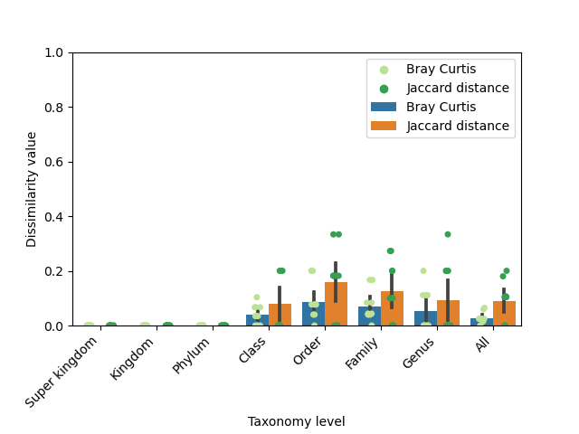

Amplicon sequencing is a powerful research method designed to explore and reveal the taxonomic composition of diverse microbial communities. By focusing on specific genetic regions, researchers can gain insights into the structure and function of these communities. Typically, ribosomal ribonucleic acid (rRNA) or ribosomal deoxyribonucleic acid (rDNA) is sequenced, with particular attention given to key marker genes. For bacteria and archaea, the 16S rRNA gene is commonly targeted; for eukaryotes, the 18S rRNA gene is used, while fungi are often studied through internal transcribed spacers (ITS) regions. These marker genes provide the genetic signatures necessary for identifying and categorizing the various organisms present within a sample.<br>

In this tutorial, we will dive into the MGnify amplicon pipeline v5.0 on Galaxy, a sophisticated toolset for microbial analysis. This pipeline is a ported version of the same well-established amplicon pipeline used by MGnify, a leading metagenomics platform dedicated to the analysis and archiving of microbiome sequences. MGnify has seen significant adoption and growth in recent years (); as of the time of writing, over 495,889 analyses have been conducted using this pipeline for amplicon data alone ().<br>

<div style="width:45%; margin: auto;">
  <strong>The workflow of the MGnify amplicon pipeline v5.0</strong> (). The figure illustrates the workflow of the MGnify amplicon pipeline, beginning with quality control to filter low-quality reads. The processed reads then proceed to the rRNA-prediction step, where SSU and LSU regions are classified and their taxonomic abundance is visualized. Following this, the pipeline handles the ITS regions, classifying them and visualizing their taxonomic abundance using pie charts. Each stage is clearly outlined, showcasing how data moves through the pipeline and is analyzed to provide comprehensive insights into microbial communities.
</div>

<br>
<br>

Our journey through this tutorial will provide a comprehensive understanding of the different sub-workflows that make up the pipeline and how each contributes to the overall analysis process. We will explore how these workflows are executed within the Galaxy platform. Additionally, we will explore which databases and tools are integrated into the pipeline, giving us a clearer picture of the resources that power these analyses. By the end of this tutorial you will have the knowledge to apply the MGnify amplicon pipeline effectively in your own research.<br>

Before diving into the tutorial, it is strongly recommended to review the Introduction to Microbiome Analysis slides or watch the corresponding video, which are linked in the requirements section above, especially if you are new to this field. These slides will provide essential background knowledge and help you better understand the concepts covered in this tutorial.

> <warning-title>Slight discrepancy between runs</warning-title>
> The outputs generated by this workflow may vary slightly between runs due to the non-deterministic behavior of the MAPseq version used. While this variation does not always occur, certain processing steps involve elements of randomness that can lead to minor differences in the results on different executions.
> <div style="width:55%; margin: auto;">
>  <strong>Beta diversity-based benchmark</strong>. Dissimilarity between MAPseq runs. Executed 10 times using identical configuration and the same sample from analysis MGYA00578954 to demonstrate MAPseq inconsistency. The term ’All’ refers to all ranks combined. Species rank was excluded, due to taxa absence at this rank. Bars represent the average dissimilarity values, while individual data points represent the values for each of the ten different runs.
> </div>
{: .warning}

> <agenda-title></agenda-title>
>
> In this tutorial, we will deal with:
>
> 1. TOC
> {:toc}
>
{: .agenda}

In this tutorial, we'll cover two different versions:
1. Running the workflows using NCBI data (default)
2. Running the workflows using own reads, which requires some minor adjustments




# Download datasets and import workflows 

Let's begin with creating a history and giving it a suitable name.

> <hands-on-title>Create history</hands-on-title>
>
> 1. Create a new history
>
>    
>
> 2. Rename the created history
>
>    
>
{: .hands_on}

To keep things straightforward, we will be working with two small datasets throughout this tutorial. These datasets are specifically chosen to demonstrate the full range of outputs that this pipeline can generate, allowing us to explore each type of result without being overwhelmed by large-scale data.

> <hands-on-title>Downloading datasets</hands-on-title>
> 1. Click on  **Upload Data** at the top of left panel
>   - Select  **Paste/Fetch Data** at the bottom
>   - Copy  and paste the following:
>   - Click on **Start**
```
https://zenodo.org/records/13710235/files/ribo.cm
https://zenodo.org/records/13710235/files/ribo.claninfo
https://zenodo.org/records/13710235/files/accessions.csv
```
>   - **Close** the window
> 2.  using the parameters:
>   -  *"select input type"*: `List of SRA accession, one per line`
>   -  *"Accession"*: `accessions.csv`
>   - *"Advanced Options"*:
>        - *"Defline format specification for sequence"*: `@$ac.$si-$sn-$ri`
{: .hands_on}

# Quality control
Quality control (QC) is a crucial first step in any metagenomic analysis pipeline. It ensures that sequencing reads are free from contaminants, low-quality bases, and adapter sequences, which can negatively impact downstream analyses. In the MGnify v5.0 pipeline, QC involves trimming, filtering, and assessing read quality using tools like Trimmomatic, SeqPrep, and FastQC. This process guarantees that only high-quality data progresses, providing reliable results for subsequent steps like taxonomic classification and diversity analysis.<br>
The quality control phase in this amplicon pipeline is split into two sub-workflows: one dedicated to paired-end reads and another for single-end reads

## Single-end reads
The quality control sub-workflow for single-end reads involves a series of tools that perform trimming, filtering, and quality assessment to ensure high-quality sequencing data. The workflow includes the following tools:
-  trims low quality sequencing regions. Using the following parameters:
    - *"SLIDING WINDOW - Number of bases to average across"*: `4`
    - *"SLIDING WINDOW - Average quality required"*: `15`
    - *"LEADING"*: `3`
    - *"TRAILING"*: `3`
    - *"MINLEN"*: `100`
    - *"Quality score encoding"*: `Phred33`
-  filters sequences shorter than 100 nucleotides in length out
-  provides advanced filtering, trimming, and data quality control, allowing for the removal of duplicate reads, low-complexity sequences, and additional quality filtering. Using the following parameters:
    - *"Is this library paired- or single-end?"*: `Single-end`
    - *"Apply filter treatments?"*: `Yes`
    - *"Filter sequence based on their length?"*: `No`
    - *"Filter sequences based on quality score?"*: `No`
    - *"Filter sequences based on their base content?"*: `Yes`
    - *"Filter sequences based on their GC percentage?"*: `No`
    - *"Filter sequences based on their number of N bases?"*: `No`
    - *"Filter sequences based on their percentage of N bases?"*: `Yes`
    - *"Maximal N percentage threshold to conserve sequences"*: `10`
    - *"Filter sequences with characters other than A, T, C, G and N?"*: `Yes`
    - *"Filter sequences based on their complexity?"*: `No`
    - *"Apply trimming treatments?"*: `No`
-  converts the quality control processed reads from FASTQ into FASTA format
-  performs comprehensive quality checks on sequencing data, providing visual summaries and detailed metrics for read quality
-  aggregates reports from multiple quality control FASTQC reports, into a single, consolidated report for easier interpretation. Using the following parameters:
    - **Which tool was used generate logs?**: `FastQC`
    - **Type of FastQC output?**: `Raw data`

<div class="NCBI-data" markdown="1">
> <hands-on-title>Running the single-end quality control sub-workflow</hands-on-title>
> 1. **Import** the [single-end quality control sub-workflow]({{ site.baseurl }}{{ page.dir }}workflows/mgnify-amplicon-pipeline-v5-quality-control-single-end.ga)
>
>    
>
> 2. **Run**  the single-end sub-workflow using the following input:
>   - **Single-end reads**: `Single-end data (fasterq-dump)` collection
>
>    
>
{: .hands_on}
</div>

<div class="Own-data" markdown="1">
> <hands-on-title>Running the single-end quality control sub-workflow</hands-on-title>
> 1. **Import** the [single-end quality control sub-workflow]({{ site.baseurl }}{{ page.dir }}workflows/mgnify-amplicon-pipeline-v5-quality-control-single-end.ga)
>
>    
> 2. Click on  **Upload Data** at the top of left panel
> 3. Click on  **Choose local file** and select the desired single-end files
> 4. Click on **Start** and **Close** the window
> 5. When the upload is finished create a collection for all single-end reads files:
>
>    
>
> 5. **Run**  the single-end sub-workflow using the following input:
>   - **Single-end reads**: Single-end reads collection we just created
>
>    
>
{: .hands_on}
</div>

## Paired-end reads
The quality control sub-workflow for paired-end reads is designed to optimize the accuracy and reliability of sequencing data by addressing the unique challenges of handling paired-end sequences. The tools included are:
-  A versatile tool that performs quality filtering, trimming, adapter removal, and other preprocessing tasks specifically for paired-end reads. Using the following parameters:
    - *"Single-end or paired reads"*: `Paired`
    - *"Filter Options"*:
        - *"Quality filtering options"*:
            - *"Qualified quality phred"*: `20`
            - *"Unqualified percent limit"*: `20`
        - *"Length filtering options"*:
            - *"Length required"*: `70`
    - *"Read Modification Options"*:
        - *"Base correction by overlap analysis options"*:
            - *"Enable base correction"*: `Yes`
-  Merges the forward and reverse reads. Using the default parameters.
-  trims low quality sequencing regions. Using the following parameters:
    - *"SLIDING WINDOW - Number of bases to average across"*: `4`
    - *"SLIDING WINDOW - Average quality required"*: `15`
    - *"LEADING"*: `3`
    - *"TRAILING"*: `3`
    - *"MINLEN"*: `100`
    - *"Quality score encoding"*: `Phred33`
-  filters sequences shorter than 100 nucleotides in length out
-  provides advanced filtering, trimming, and data quality control, allowing for the removal of duplicate reads, low-complexity sequences, and additional quality filtering. Using the following parameters:
    - *"Is this library paired- or single-end?"*: `Single-end`
    - *"Apply filter treatments?"*: `Yes`
    - *"Filter sequence based on their length?"*: `No`
    - *"Filter sequences based on quality score?"*: `No`
    - *"Filter sequences based on their base content?"*: `Yes`
    - *"Filter sequences based on their GC percentage?"*: `No`
    - *"Filter sequences based on their number of N bases?"*: `No`
    - *"Filter sequences based on their percentage of N bases?"*: `Yes`
    - *"Maximal N percentage threshold to conserve sequences"*: `10`
    - *"Filter sequences with characters other than A, T, C, G and N?"*: `Yes`
    - *"Filter sequences based on their complexity?"*: `No`
    - *"Apply trimming treatments?"*: `No`
-  converts the quality control processed reads from FASTQ into FASTA format
-  performs comprehensive quality checks on sequencing data, providing visual summaries and detailed metrics for read quality
-  aggregates reports from multiple quality control FASTQC reports, into a single, consolidated report for easier interpretation. Using the following parameters:
    - *"Which tool was used generate logs?"*: `FastQC`
    - *"Type of FastQC output?"*: `Raw data`

<div class="NCBI-data" markdown="1">
> <hands-on-title>Running the paired-end quality control sub-workflow</hands-on-title>
> 1. **Import** the [paired-end quality control sub-workflow]({{ site.baseurl }}{{ page.dir }}workflows/mgnify-amplicon-pipeline-v5-quality-control-paired-end.ga)
>
>    
>
> 2. **Run**  the paired-end sub-workflow using the following input:
>      - **Paired-end reads**: `Pair-end data (fasterq-dump)` collection
>
>    
>
{: .hands_on}
</div>

<div class="Own-data" markdown="1">
> <hands-on-title>Running the paired-end quality control sub-workflow</hands-on-title>
> 1. **Import** the [paired-end quality control sub-workflow]({{ site.baseurl }}{{ page.dir }}workflows/mgnify-amplicon-pipeline-v5-quality-control-paired-end.ga)
>
>    
>
> 2. Click on  **Upload Data** at the top of left panel
> 3. Click on **Choose local file** and select the desired paired-end files
> 4. Click on **Start** and **Close** the window
> 5. When the upload is finished create a paired collection for all paired-end reads files:
>
>    
>
> 6. **Run**  the paired-end sub-workflow using the following input:
>      - **Paired-end reads**: Paired-end reads collection, which was created in the steps above
>
>    
>
{: .hands_on}
</div>

# rRNA-prediction
The rRNA prediction sub-workflow focuses on identifying and classifying ribosomal RNA (rRNA) sequences, particularly small subunit (SSU) and large subunit (LSU) rRNAs. This workflow uses several tools for comparison against covariance models, filtering, classification, and visualization:
-  the datasets are compared against the LSU and SSU models from Rfam (v13.0). Using the following parameters:
    - *"Subject covariance models"*: `Covariance model from your history`
    - *"Calculate E-values as if the search space size is 'x' megabases (Mb)"*: `1000`
    - *"Options controlling acceleration heuristics"*: `Use HMM only, don't use a CM at all (--hmmonly)`
    - *"Omit the alignment section from the main input"*: `Yes`
-  removes overlapping reads that belong to the same clan. Using the default parameters.
-  extract sequences from a FASTA file
-  classifies matching OTUs to the reads, used in conjunction with SILVA (v132) SSU and LSU databases. Using the following parameters:
    - *"Use cached database or database from history"*: `Cached database`
    - *"Using built-in mapseq DB**. MAPseq is used in conjunction with the following databases:
        1. `MGnify LSU (v5.0.7) - silva_lsu-20200130 downloaded at 2023-09-26`
        2. `MGnify SSU (v5.0.7) - silva_ssu-20200130 downloaded at 2023-09-26`
    - *"Create OTU table"*: `Yes`
    - *"Create taxon table for Krona"*: `Yes`
    - *"Top hits"*: `80`
    - *"Top OTUs"*: `40`
    - *"Output format"*: `simple`
-  generates pie charts demonstrating the taxonomic abundance. Using the following parameters:
    - *"What is the type of your input data"*: `Tabular`
    - *"Provide a name for the basal rank"*: `Root`
-  converts the taxonomic abundance tables to JSON and HDF5 formats. Using the following parameters:
    - *"Choose the source BIOM format"*: `Tabular File`
    - *"Process metadata associated with observations when converting"*: `taxonomy`
    - *"Choose the output type"*: `BIOM`
    - *"Table Type"*: `OTU table`
    - *"BIOM format type"*:
        1. `JSON-formatted table(BIOM1)`
        2. `HDF5-formatted table(BIOM2)`

> <hands-on-title>Running the rRNA-prediction sub-workflow</hands-on-title>
> 1. **Import** the [rRNA-prediction sub-workflow]({{ site.baseurl }}{{ page.dir }}workflows/mgnify-amplicon-pipeline-v5-rrna-prediction.ga)
>
>    
> 2. Using  merge both quality processed single- and paired-end reads collections: `SE_QC_processed_FASTA` and `PE_QC_processed_FASTA`
> 3. **Run**  the rRNA-prediction sub-workflow using the following inputs:
>      - **Processed sequences**: Quality processed sequences (merged collection)
>      - **Clan information file**: `ribo.claninfo`
>      - **Covariance models**: `ribo.cm`
>
>    
>
{: .hands_on}

# ITS
The ITS (Internal Transcribed Spacer) workflow is designed for the identification and taxonomic classification of fungal sequences, specifically focusing on ITS regions. The sub-workflow includes several tools to mask, classify, and visualize taxonomic data:
-  masks SSU and LSU regions from a FASTA file based on intervals defined in a BED regions file. Using the default parameters.
-  classifies matching OTUs to the reads, used in conjunction with the UNITE (v8.0) and ITSoneDB (v1.138) databases. Using the following parameters:
    - *"Use cached database or database from history"*: `Cached database`
    - *"Using built-in mapseq DB**. MAPseq is used in conjunction with the following databases:
        1. `MGnify ITS ITSonedb (v5.0.7) - ITSoneDB-20200214 downloaded at 2023-09-26`
        2. `MGnify ITS UNITE (v5.0.7) - UNITE-20200214 downloaded at 2023-09-26`
    - *"Create OTU table"*: `Yes`
    - *"Create taxon table for Krona"*: `Yes`
    - *"Top hits"*: `80`
    - *"Top OTUs"*: `40`
    - *"Output format"*: `simple`
-  generates pie charts demonstrating the taxonomic abundance. Using the following parameters:
    - *"What is the type of your input data"*: `Tabular`
    - *"Provide a name for the basal rank"*: `Root`
-  converts the taxonomic abundance tables to JSON and HDF5 formats. Using the following parameters:
    - *"Choose the source BIOM format"*: `Tabular File`
    - *"Process metadata associated with observations when converting"*: `taxonomy`
    - *"Choose the output type"*: `BIOM`
    - *"Table Type"*: `OTU table`
    - *"BIOM format type"*:
        1. `JSON-formatted table(BIOM1)`
        2. `HDF5-formatted table(BIOM2)`

> <hands-on-title>Running the ITS sub-workflow</hands-on-title>
> 1. **Import** the [ITS sub-workflow]({{ site.baseurl }}{{ page.dir }}workflows/mgnify-amplicon-pipeline-v5-its.ga)
>
>    
>
> 2. **Run**  the ITS sub-workflow using the following inputs:
>      - *"LSU and SSU BED"*: `LSU_SSU_BED`
>      - *"Processed sequence"*: Quality processed sequences (merged single-end and paired-end collection)
>
>    
>
{: .hands_on}

# Summary tables
The summary tables sub-workflow takes as input the taxonomic abundance tables generated from all datasets within the pipeline. It processes these tables to create two comprehensive taxonomic summary tables:
1. Full Taxonomic Summary Table: This table provides detailed taxonomic information spanning all levels, from superkingdom down to species. It offers a complete overview of the taxonomic composition across all samples, facilitating in-depth analyses of microbial communities.

2. Phylum-Level Summary Table: Focused specifically on the phylum level, this table aggregates data to provide a clear view of the phylum distribution within the datasets. This level-specific summary is particularly useful for high-level comparisons and identifying major trends within the microbial communities.

Both summary tables serve as essential tools for downstream interpretation, helping to visualize and compare the taxonomic profiles across multiple samples (e.g. [Calculating α and β diversity]()).

> <hands-on-title>Running the summary tables sub-workflow</hands-on-title>
> 1. **Import** the [summary tables sub-workflow]({{ site.baseurl }}{{ page.dir }}workflows/mgnify-amplicon-summary-tables.ga)
>
>    
>
> 2. **Run**  the summary tables sub-workflow 4 times using the following inputs:
>       1. First run:
>           - *"OTU tables"*: `OTU_LSU_SILVA`
>           - *"taxonomic_summary_table"*: `LSU_taxonomic_summary_table`
>           - *"phylum_taxonomic_summary_table"*: `LSU_phylum_taxonomic_summary_table`
>       2. Second run:
>           - *"OTU tables"*: `OTU_SSU_SILVA`
>           - *"taxonomic_summary_table"*: `SSU_taxonomic_summary_table`
>           - *"phylum_taxonomic_summary_table"*: `SSU_phylum_taxonomic_summary_table`
>       3. Third run:
>           - *"OTU tables"*: `OTU_ITS_UNITE`
>           - *"taxonomic_summary_table"*: `UNITE_taxonomic_summary_table`
>           - *"phylum_taxonomic_summary_table"*: `UNITE_phylum_taxonomic_summary_table`
>       2. Second run:
>           - *"OTU tables"*: `OTU_ITSoneDB`
>           - *"taxonomic_summary_table"*: `ITSoneDB_taxonomic_summary_table`
>           - *"phylum_taxonomic_summary_table"*: `ITSoneDB_phylum_taxonomic_summary_table`
>
>    
>
{: .hands_on}

# Complete Workflow (including all sub-workflows)
This workflow streamlines the entire process, from quality control to taxonomic classification, leading to the generation of comprehensive summary tables. By following the steps below, you’ll execute the full pipeline on your datasets, applying all the tools and techniques covered in previous sections. This is the final step, where all the preparation comes together to deliver detailed insights into your microbial communities.

<div class="NCBI-data" markdown="1">
> <hands-on-title>Running the complete MGnify amplicon pipeline</hands-on-title>
> 1. **Import** the [complete MGnify amplicon workflow]({{ site.baseurl }}{{ page.dir }}workflows/mgnify-amplicon-pipeline-v5-complete.ga)
>
>    
>
> 2. **Run**  the workflow using the following inputs:
>      - *"SRA accession list"*: `accessions.csv`
>      - *"Clan information file"*: `ribo.claninfo`
>      - *"Covariance models"*: `ribo.cm`
>
>    
>
{: .hands_on}
</div>

<div class="Own-data" markdown="1">
> <hands-on-title>Running the complete MGnify amplicon pipeline</hands-on-title>
> 1. **Import** the [complete MGnify amplicon workflow]({{ site.baseurl }}{{ page.dir }}workflows/mgnify-amplicon-pipeline-v5-complete.ga)
>
>    
>
> 2. Adjust workflow:
>      - Click on  **Workflows** in the left side-bar
>      - Search for *"MGnify's amplicon pipeline v5.0 - complete"* workflow
>      - Click on  **Edit**
>      - **Remove** the steps:
>           - *"1: SRA accession list"*
>           - *"32: Faster Download and Extract Reads in FASTQ"*
>      - Click on **Inputs** in the left side-panel and add an **Input dataset collection**
>           - Add the *"Label"*: `Single-end reads`
>           - Connect it to the *"Single-end reads"* input in step *"33: MGnify's amplicon pipeline v5.0 - Quality control SE"*
>      - Click on **Inputs** in the left side-panel and add an **Input dataset collection**
>           - Add the *"Label"*: `Paired-end reads`
>           - Change *"Collection type"* to `list:paired`
>           - Connect it to the *"Paired-end reads"* input in step *"34: MGnify's amplicon pipeline v5.0 - Quality control PE"*
>      - Click on  **Save** and then  **Run** in the right side-panel
> 3. **Run**  the workflow using the following inputs:
>      - *"Single-end reads"*: Single-end reads collection
>      - *"Paired-end reads"*: Paired-end reads collection
>      - *"Clan information file"*: Upload the clan information file, which contains details about the sequence family assignments required for accurate taxonomic classification `ribo.claninfo`
>      - *"Covariance models"*: Provide the covariance models necessary for the rRNA prediction step, enabling accurate alignment and prediction of ribosomal RNA sequences `ribo.cm`
>
>    
>
{: .hands_on}
</div>

# MAPseq-to-ampvis2
The MAPseq to Ampvis2 workflow processes MAPseq OTU tables and associated metadata for analysis in Ampvis2. This workflow involves reformatting MAPseq output datasets to produce structured output files suitable for Ampvis2.

> <hands-on-title>Downloading datasets</hands-on-title>
> 1. Click on  **Upload Data** at the top of left panel
>   - Select  **Paste/Fetch Data** at the bottom
>   - Copy  and paste the following:
```
https://zenodo.org/records/13347829/files/SRR11032273.tsv
https://zenodo.org/records/13347829/files/SRR11032274.tsv
https://zenodo.org/records/13347829/files/SRR11032275.tsv
https://zenodo.org/records/13347829/files/SRR11032276.tsv
https://zenodo.org/records/13347829/files/SRR11032277.tsv
https://zenodo.org/records/13347829/files/SRR11038211.tsv
https://zenodo.org/records/13347829/files/SRR11038212.tsv
https://zenodo.org/records/13347829/files/SRR11038213.tsv
https://zenodo.org/records/13347829/files/SRR11038214.tsv
https://zenodo.org/records/13347829/files/SRR11038215.tsv
https://zenodo.org/records/13347829/files/test_metadata_formatted.tabular
```
>   - Click on **Start**
> 2. Create a collection out of the tsv files
>
>    
>
{: .hands_on}

> <hands-on-title>Running the MAPseq-to-ampvis2 workflow</hands-on-title>
> 1. **Import** the [MAPseq-to-ampvis2 workflow]({{ site.baseurl }}{{ page.dir }}workflows/mapseq-to-ampvis2.ga)
>
>    
>
> 2. **Run**  the workflow using the following inputs:
>      - *"MAPseq outputs"*: Provide the OTU tables generated by MAPseq, which need to be reformatted for Ampvis2
>      - *"Metadata"*: Contextual information associated with the data from the OTU tables
>
>    
>
{: .hands_on}

# Conclusion
This tutorial provided a step-by-step guide to running the different sub-workflows of the MGnify v5.0 amplicon pipeline on Galaxy. By following these steps, you should be able to process, analyze, and visualize your amplicon sequencing data efficiently.

> <details-title>Tool/database version summary table</details-title>
> > | **Tool**                                                |                  **Version**     |  **Galaxy version suffix**                    |
> > |:-------------------------------------------------------:|:--------------------------------:|:---------------------------------------------:|
> > | fastp                                                   | 0.23.2                           | 1                                             |
> > | SeqPrep                                                 | a MGnify modified version of 1.2 | 0                                             |
> > | Trimmomatic                                             | 0.39                             | 2                                             |
> > | Filter FASTQ                                            | 1.1.5                            | -                                             |
> > | PRINSEQ                                                 | 0.20.4                           | 2                                             |
> > | FASTQ to FASTA                                          | 1.1.5                            | -                                             |
> > | FastQC                                                  | 0.74                             | 0                                             |
> > | FASTA Width                                             | 1.0.1                            | 2                                             |
> > | MultiQC                                                 | 1.11                             | 1                                             |
> > | cmsearch                                                | 1.1.4                            | 0                                             |
> > | CMsearch deoverlap                                      | 0.08                             | 2                                             |
> > | Query Tabular                                           | 3.3.1                            | -                                             |
> > | Text reformatting                                       | 9.3                              | 0                                             |
> > | Concatenate two BED files                               | 1.0.1                            | -                                             |
> > | Filter empty datasets                                   | 1.0.0                            | -                                             |
> > | Extract element identifiers                             | 0.0.2                            | -                                             |
> > | Filter collection                                       | 1.0.0                            | -                                             |
> > | bedtools getfasta                                       | 2.30.0                           | 1                                             |
> > | MAPseq                                                  | 2.1.1                            | 0                                             |
> > | Convert biom                                            | 2.1.15                           | 1                                             |
> > | Krona                                                   | 2.7.1                            | 0                                             |
> > | bedtools MaskFastaBed                                   | 2.30.0                           | -                                             |
> > | Column join                                             | 0.0.3                            | -                                             |
> > | Group                                                   | 2.1.4                            | -                                             |
> > | Faster Download and Extract Reads in FastQ(faster-dump) | 3.1.1                            | 0                                             |
> > | **Databases and Rfam models**                           | **Version**                      | -                                             |
> > |:-------------------------------------------------------:|:--------------------------------:|:---------------------------------------------:|
> > | SILVA (LSU and SSU)                                     | 132                              | -                                             |
> > | UNITE                                                   | 8.0                              | -                                             |
> > | ITSoneDB                                                | 1.138                            | -                                             |
> > | Rfam (LSU and SSU)                                      | 13.0                             | -                                             |
> {: .matrix}
{: .details}