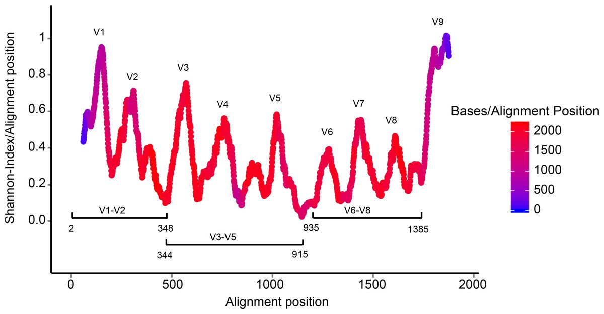

> <comment-title>Background: The 16S ribosomal RNA gene</comment-title>
>    
>
> The 16S rRNA gene has several properties that make it ideally suited for our purposes
>
> 1. Present in all prokaryotes
> 2. Highly conserved + highly variable regions
> 3. Huge reference databases
>
> 
>
> The highly conserved regions make it easy to target the gene across different organisms,
> while the highly variable regions allow us to distinguish between different species.
>
> (slide credit [https://www.slideshare.net/beiko/ccbc-tutorial-beiko](https://www.slideshare.net/beiko/ccbc-tutorial-beiko ))
{: .comment}