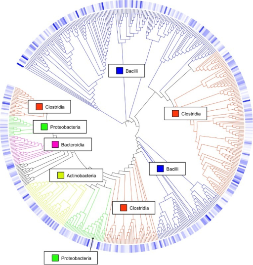

> <comment-title>Background: What are Operational Taxonomic Units (OTUs)?</comment-title>
>
> In 16S metagenomics approaches, OTUs are clusters of similar sequence variants of the 16S rDNA marker gene
> sequence. Each of these clusters is intended to represent a taxonomic unit of a bacteria species or genus
> depending on the sequence similarity threshold. Typically, OTU cluster are defined by a 97% identity
> threshold of the 16S gene sequence variants at species level. 98% or 99% identity is suggested for strain
> separation.
>
> 
>
> (Image credit: Danzeisen et al. 2013, 10.7717/peerj.237)
{: .comment}

