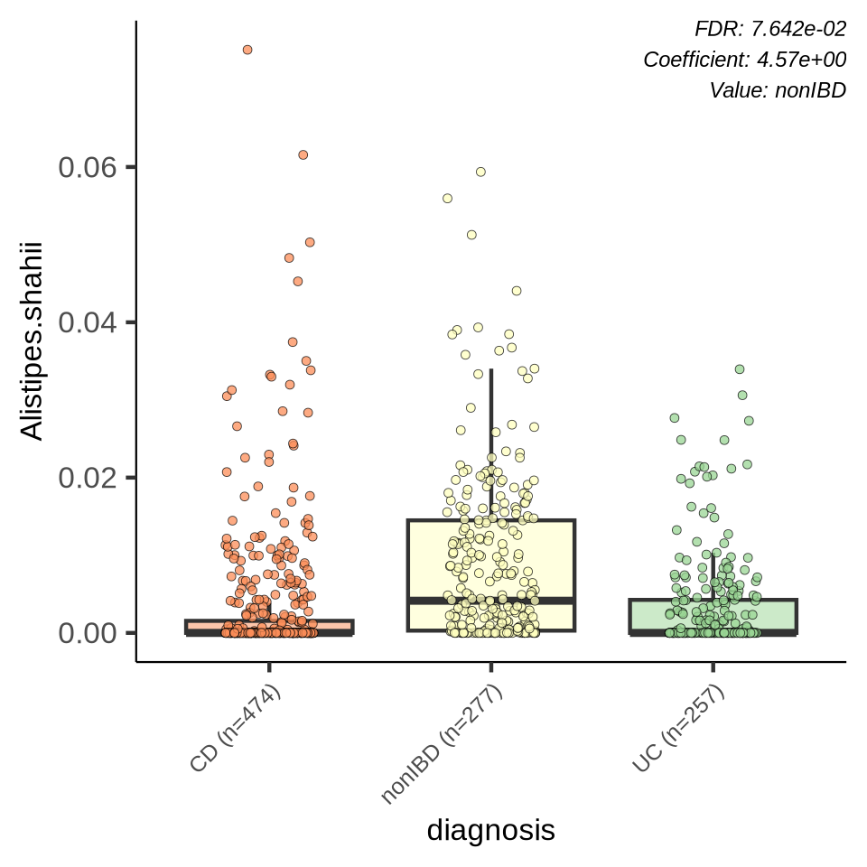
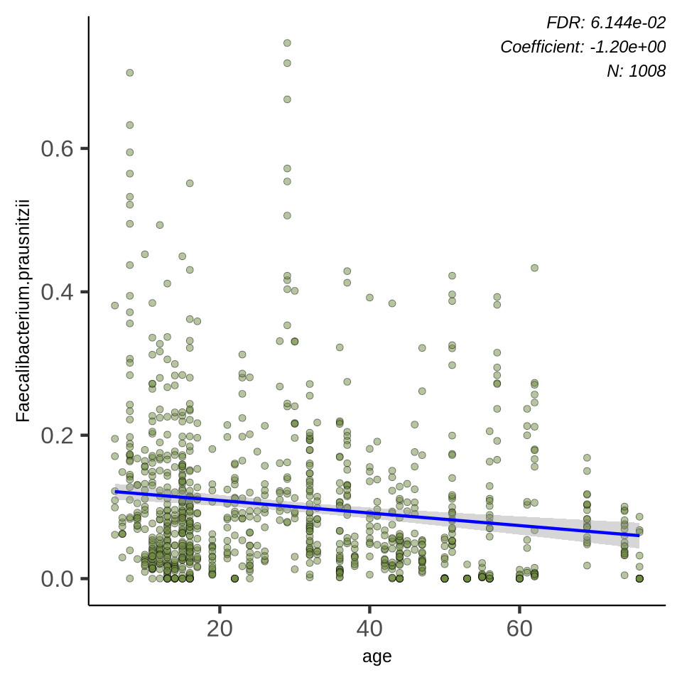

# Microbiome Association Detection with MaAsLin2

The importance of identifying associations between microbial features and metadata variables using tools like MaAsLin2 lies in several key areas:

- **Understanding Disease Mechanisms:** These associations can provide insights into how microbial composition changes may contribute to disease development or progression. This understanding is crucial for advancing knowledge of disease mechanisms.

- **Potential Diagnostic Markers:** Identifying microbial biomarkers associated with specific diseases or conditions can potentially lead to the development of diagnostic tests. These tests could aid in earlier detection, more accurate diagnosis, and monitoring of disease progression.

- **Personalized Medicine:** By identifying associations between gut microbes and individual characteristics (such as diet, medication use, or genetic factors), personalized treatment strategies can be developed. This approach may lead to more effective and tailored interventions for patients.

- **Therapeutic Targets:** Associations can reveal potential targets for therapeutic interventions, such as probiotics, prebiotics, or dietary changes, aimed at modulating the gut microbiota to promote health or mitigate disease risks.

- **Advancing Microbiome Research:** Building a comprehensive understanding of microbial associations with various factors enhances microbiome research. This knowledge can contribute to broader insights into microbial ecology, evolution, and interactions within the human body and the environment.

In addition to MaAslin2, Galaxy offers several other differential analysis tools widely used in transcriptomics and microbiome studies.
These tools are designed to handle different types of data (e.g., RNA-seq, microbial count data), with varying strengths in terms of statistical power,
handling of sparsity, and treatment of compositional data. Some of them are mentioned below: 


| Tool                | Strengths                                    | Weaknesses                               | Comparison to MaAsLin2                          |
|---------------------|----------------------------------------------|------------------------------------------|------------------------------------------------|
| **ANCOM-BC**        | Compositionality and bias correction          | Computationally intensive for large datasets | ANCOM-BC is good for simpler designs, but MaAsLin2 handles complex metadata better. |
| **LEfSe**           | Easy to interpret, focuses on effect size     | No covariates, may overfit               | LEfSe is simpler but lacks the flexibility and multivariable depth of MaAsLin2. |
| **ALDEx2**          | Robust to sparsity, small sample sizes        | Limited handling of complex metadata     | ALDEx2 is suitable for small datasets, but MaAsLin2 is superior in handling multivariable data and covariates. |
| **MetagenomeSeq**   | Handles zero-inflation, sparse data           | Computationally heavy for large datasets | MetagenomeSeq is great for zero-inflated data, but lacks MaAsLin2's multivariable modeling capacity. |
| **Corncob**         | Models both abundance and variability        | Complex to use, requires R expertise     | Corncob excels at overdispersion analysis, but MaAsLin2 is easier for broader multivariable models. |
| **Phyloseq + DESeq2**| Strong for RNA-seq and transcriptomics; integrates with Phyloseq | Lacks compositionality awareness         | While DESeq2 works for microbiome data, MaAsLin2 offers more suitable options for compositional data and covariate handling. |
| **Limma-Voom**      | Effective for RNA-seq and microarray data, handles low counts | Not tailored for compositional microbiome data | Limma-Voom is well-suited for gene expression, but MaAsLin2 better accounts for the unique characteristics of microbiome data. |

- ANCOM-BC and MaAsLin2, outperform general-purpose tools like DESeq2 and limma-voom when it comes to microbiome data. This is due to their handling of the compositional nature of microbiome data and the sparsity typical of microbial datasets. ()
- While general methods like DESeq2 and limma-voom are reliable for gene expression analysis, they do not handle the unique properties of microbiome data as effectively as MaAsLin2. The latter provides a more accurate estimation of differential abundance in the presence of metadata confounders.

 across different tools</a>"){:width="60%"} 

- The above figure compares various tools for differential abundance detection (Panel A) and multivariable association detection (Panel B) in microbiome studies, based on sensitivity and false discovery rate (FDR).
- **Sensitivity** measures how well the methods detect true signals, higher values lead to better performance.
- **False discovery rate (FDR)** measures the proportion of false positives among detected signals (lower FDR is better).
- MaAsLin2 is the clear standout for both differential abundance detection and multivariable association detection, showing high sensitivity and maintaining a low FDR.

> <agenda-title></agenda-title>
>
> In this tutorial, we will cover:
>
> 1. TOC
> {:toc}
>
{: .agenda}

# Get the data
MaAsLin2 requires the following input files:

- **Features file**: \
        This file is tab-delimited.\
        Formatted with features as columns and samples as rows.\
        Possible features in this file include microbes, genes, pathways, etc.
- **Metadata file** : \
        This file is tab-delimited.\
        Formatted with features as columns and samples as rows.
    
The Features file can contain samples not included in the metadata file (or vice versa). For both cases, those samples not included in both files will be removed from the analysis.
Also, the samples do not need to be in the same order in the two files.

In this tutorial, the two input files used are:
-  `HMP2_taxonomy.tsv` or features file
-  `HMP2_metadata.tsv` or metadata file

The files provided were generated from the HMP2 data. To download [Click here](https://ibdmdb.org/)
 
 **Origin** : \
The **HMP2_taxonomy.tsv** and **HMP2_metadata.tsv** files are part of the **Human Microbiome Project 2 (HMP2)**, which is a key component of the Inflammatory Bowel Disease Multi'omics Database (). The IBDMDB is a large-scale, multi-omic research initiative aimed at understanding the microbiome's role in IBD progression by integrating various omics data like metagenomics, metabolomics, and host genetics. 

The **HMP2_taxonomy.tsv** file contains microbiome data (species abundances) collected from IBD patients and healthy controls, while the **HMP2_metadata.tsv** file includes clinical and demographic metadata for these samples, such as IBD diagnosis (non-IBD, ulcerative colitis(UC), or Crohn’s disease(CD)), dysbiosis state, and treatments like antibiotics.

The above two files were utilized prominently in the research study, **"Multivariable Association Discovery in Population-Scale Meta-Omics Studies."** ()

> <hands-on-title>Getting the data</hands-on-title>
> 1. Create and name a new history for this tutorial.
> 
>    
> 
> 2. Import the files from [Zenodo](https://zenodo.org/records/12614561) or from the data library:
> 
>    ```
> 
>    https://zenodo.org/records/12614561/files/HMP2_taxonomy.tsv
>    https://zenodo.org/records/12614561/files/HMP2_metadata.tsv
>
>    ```
>
>    > <tip-title>Importing data via links</tip-title>
>    >
>    > * Copy the link location (Right-click on the filename then "Copy Link Address")
>    > * Open the Galaxy Upload Manager
>    > * Select **Paste/Fetch Data**
>    > * Paste the link into the text field
>    > * Press **Start**
>    {: .tip}
>
> 3. Change the name of the files to `feature` and `metadata` .
>
>    As a default, Galaxy uses the link as the name of the new dataset. It also does not link the dataset to a database or a reference genome.
>
>    
>
> 4. Inspect the content of a file.
>
>    > <tip-title>Inspecting the content of a dataset</tip-title>
>    >
>    > * Click on the  (eye) icon next to the relevant history entry
>    > * View the content of the file in the central panel
>    {: .tip}
>
>    > <question-title></question-title>
>    >
>    > 1.  What is the main difference between the two files?
>    >
>    >
>    > > <solution-title></solution-title>
>    > > 1. The metadata file describes sample characteristics (e.g., clinical data, demographics) while the features file contains microbial data (e.g., taxa abundance) used for analysis in microbiome studies.
>    > {: .solution }
>    {: .question}
>
{: .hands_on}

MaAsLin2 is designed to analyze various types of **tabular data** for multivariable association studies. The following table formats are compatible:

**OTU/ASV Abundance Tables:** These tables represent the abundance of Operational Taxonomic Units (OTUs) or Amplicon Sequence Variants (ASVs) across different samples, allowing for analysis of microbial diversity in relation to metadata.

**MAGs Abundance Matrices:** These matrices reflect the abundance of Metagenome-Assembled Genomes (MAGs) in samples, facilitating the exploration of associations between reconstructed genomes and various metadata.

**Taxonomy Tables:** These tables contain taxonomic classifications of microbes, enabling researchers to investigate how different taxonomic levels relate to associated metadata variables.

**Gene Count Matrices:** These matrices provide counts of specific genes across samples, useful for examining associations between gene abundances and metadata, particularly in metagenomics or transcriptomics studies.

Several tools available on Galaxy can generate outputs that are compatible with MaAsLin2, particularly in the context of microbiome data analysis. Following are some Galaxy tools that produce outputs that can be used as input for MaAsLin2:
1. [**QIIME2**](https://training.galaxyproject.org/training-material/search2?query=Qiime) is a popular tool for processing microbiome data, and Galaxy offers a suite of QIIME2 tools.\
**Outputs compatible with MaAsLin2**:\
    - Feature Table (OTU/ASV table): Generated after steps like DADA2 or Deblur, this table includes the abundance of microbial features in each sample.
    - Taxonomy Assignment: The feature table can be combined with taxonomy information to link ASVs/OTUs to microbial taxa.
    - Metadata Files: QIIME2 requires metadata to perform analyses, and the same metadata file can be formatted and used in MaAsLin2.
    
2. [**Mothur**](https://training.galaxyproject.org/training-material/search2?query=mothur) is another widely used microbiome data analysis tool available in Galaxy, and it can be used to produce inputs for MaAsLin2.\
**Outputs compatible with MaAsLin2**:
    - Shared File (OTU Table): Mothur generates a "shared" file that contains the abundance of OTUs across samples, which can be reformatted and used as input to MaAsLin2.
    - Features File: Mothur also outputs taxonomy assignments for OTUs, which can be paired with the shared file.
    - Metadata File: As in QIIME2, metadata is used during the Mothur workflow and can be reused in MaAsLin2.
3. [**MetaPhlAn (Metagenomic Phylogenetic Analysis)**](https://training.galaxyproject.org/training-material/by-tool/iuc/metaphlan.html) is a tool that provides taxonomic profiling of microbial communities from metagenomic sequencing data. It is available in Galaxy and can generate outputs that are directly compatible with MaAsLin2.\
**Outputs compatible with MaAsLin2**:
    - Taxonomic Profiles: MetaPhlAn generates taxonomic abundance tables (e.g., relative abundance of microbial taxa at various taxonomic levels) that can be directly used as the feature table for MaAsLin2.
    - Metadata File: As with other tools, the sample metadata used in MetaPhlAn analysis can also be reused in MaAsLin2.


# Find associations between the two files
Now we will find significant associations between microbial features(features file) and metadata variables (metadata file) using the **MaAslin2** tool

> <hands-on-title> Task description </hands-on-title>
>
> 1.  with the following parameters:
>    - *"Interactions: Fixed effects"*: `c3:age`, `c4:diagnosis`
>    - *"Random effects"*: `c5:subject`
>    - *"Reference"*: `diagnosis,CD`
>
>  Keep the rest of the default values as it is.
{: .hands_on}

# Understanding parameters in the tool

Let's now understand the role of each parameter in the tool.

1. **Interactions: Fixed effects**: Fixed effects are the factors in your model that you want to study and draw conclusions about. These are the variables you hypothesize have a direct and consistent influence on the outcome. For example, you are studying how different diets affect gut microbiome composition, then diet would be a fixed effect because you’re specifically interested in understanding how different diets influence the microbiome. You might also include other fixed effects like age and gender to control for their impact.

3. **Random effects**: In some studies, like those following people over time or studying families, samples from the same group can be similar. MaAsLin2 helps handle this by letting researchers choose a grouping factor. This helps make sure the statistical analysis is more accurate. For example, setting random_effects = "Subject_ID" helps control for the correlation between samples that come from the same individual.

4. **Reference**: It allows researchers to establish a baseline or standard feature file category against which other categories are compared, helping to interpret and understand the effects of different variables on microbial features. 

   > <comment-title></comment-title>
   > - In MaAslin2, the reference level is required for variables with more than two levels to avoid errors. 
   > - Reference for a variable with more than two levels is provided as a string of `variable, reference`.
   > - Reference for more than one variable having more than two levels each is provided as a string of `variable1,reference1,variable2,reference2`.
   > - Example, both diagnosis and site variable have more than two levels hence reference can be provided as `diagnosis, CD, site, Cedars-Sinai`.
   {: .comment}

**Additional options** :

4. **min_abundance** [ Default: 0 ] 
- The minimum abundance for each feature within a single sample.
- If a feature's abundance (or presence) is lower than this threshold, it won't be included in the analysis.
- For example, if you set min_abundance to 0.01, only features that make up at least 1% of the total abundance in at least one
   sample will be analyzed. 
- Setting the min_abundance parameter to 0 means that no abundance threshold is applied. In other words, all features (regardless
   of how rare or abundant they are) will be included in the analysis, as long as they are present in the data.
5. **min_prevalence** [ Default: 0.1 ] :
- The minimum proportion of samples in which a feature must be detected to be included in the analysis. 
- It filters features based on their frequency across the entire dataset.
- For example, if min_prevalence is set to 0.1 (10%), only features that appear in at least 10% of the samples are kept,
    regardless of how abundant they are in those samples.
6. **max_significance** [ Default: 0.25 ] :
- When you set a value for max_significance, you are specifying the maximum q-value a feature can have to be
 considered significant.
- A max_significance of 0.25 means you are considering results with a q-value of 0.25 or lower as
 statistically significant.
7. **normalization**:  [ Default: "TSS" ] [ Options: "TSS", "CLR", "CSS", "TMM", "NONE"]
- Ensures that features or samples with different scales or units are brought to a comparable level. 
- Prevents features with larger scales or more abundant counts from dominating the analysis. 
- Helps in making accurate comparisons and interpretations by standardizing data. 
- Options:\
        1. <u> Total Sum Scaling (TSS) </u>: Each count is divided by the total count for that sample, often multiplied by a constant to transform it into a percentage or proportion. 
        2. <u> Centered Log-Ratio (CLR) </u>: Each feature count is divided by the geometric mean of the counts in the same sample, and then the logarithm is taken. Useful for data where ratios between features are of interest, and it helps deal with the compositional nature of microbiome data.
        3. <u> Cumulative Sum Scaling (CSS) </u>: Does the same basic conversion as TSS but it might include extra adjustments to deal with specific data patterns, giving a potentially more accurate normalization.
        4. <u> Trimmed Mean of M-values(TMM) </u>: TMM normalizes data so you can accurately compare gene or feature counts across samples that may have
different total counts or distributions.\
For each feature (like a gene), TMM computes the log-fold change (M-value) between each sample and  a metadata sample.\
It then removes extreme values (outliers) that could skew the results. This trimming helps focus on more  typical values and reduces the impact of any unusual data points.\
The weighted mean of the remaining M-values is calculated to determine the overall adjustment factor for each sample.\
Finally, this adjustment factor is used to normalize the counts in each sample, making them more comparable.\
                                              
8. **transform** [ Default: "LOG" ] [Options: "LOG", "LOGIT", "AST", "NONE" ] 
- The transform to apply to the datasets.
- This is done to make the data more suitable for the linear models used in MaAslin2, helping to improve the accuracy and reliability of the results.
- Options: \
        1. <u>LOG</u>: The log transformation applies the natural logarithm (log base e) to the data. Used When your data has a wide range of values or
is heavily skewed, such as microbiome abundance data where some taxa are much more abundant than others.
        2. <u>LOGIT</u>:   The logit transformation is used for data that represent proportions or probabilities, where the values lie between 0 and 1. It is defined as logit(x) = log(x / (1 - x)). Used when dealing with data that represents proportions, such as relative abundances that are expressed as fractions or percentages.\
The logit transformation is only applicable to data within the open interval (0, 1), so values exactly at 0 or 1 need to be adjusted                     (e.g., adding a small constant like 0.001).
        3.  <u>Arcsine Square Root Transformation (AST)</u>: It is a statistical transformation used primarily on proportion or percentage data.\
The transformation starts by taking the square root of the proportion value. This step reduces the impact of extreme values.\
Next, it applies the arcsine function (the inverse of the sine function) to the square root result. The arcsine function helps to normalize the distribution further.\
Used when you are working with proportion data, such as relative abundances in microbiome studies, where the values are bounded between 0 and 1. 
                                 
9. **analysis_method** [ Default: "LM" ] [ Options: "LM", "CPLM", "ZICP", "NEGBIN", "ZINB" ]
- The analysis method to apply.
- Options: \
        1. <u>Linear Model (LM)</u>: Determines how changes in metadata are associated with changes in the taxonomy data. 
        2. <u>Compositional Proportional Linear Model (CPLM)</u>: used for analyzing compositional data, where the taxa abundances are proportions or percentages that sum to 1.
        3. <u>Zero-Inflated Count Model (ZCIP)</u>: used when there are many zero counts in the microbiome data. It handles datasets where a large number of taxa are absent in many samples. 
        4. <u>Negative Binomial Model (NEGBIN)</u>: used for count data where there is overdispersion (variance exceeds the mean).
        5. <u>Zero-Inflated Negative Binomial Model (ZIND)</u>: combines features of both zero-inflation and negative binomial models, useful for count data with both excess zeros and overdispersion.   
                                                          
10. **correction or adjustment methods** [ Default: "BH" ] : 
- When performing numerous statistical tests simultaneously, like testing the association of many microbial taxa with various metadata variables, the risk of finding false positives increases. 
- Correction methods help control this risk to ensure that the results are reliable and that significant findings are not due to random chance.
- This is done by computing the q-value, which is a measure of how many false positives are expected among the significant results. 
- Options:
      1. <u>Benjamini & Hochberg(BH)(aka false discovery rate(fdr))</u>: A common method used for FDR correction. It ranks the p-values from smallest to largest and adjusts them based on their rank and the total number of tests.
      2. <u>Benjamini & Yekutieli(BY)</u>: Similar to Benjamini-Hochberg but includes a correction factor that accounts for the correlation between tests.
      3. <u> Bonferroni correction</u>: Divides the significance threshold (alpha level) by the number of tests performed and then compares each p-value to this adjusted significance level to determine if it is statistically significant. 
      4. <u>Hochberg </u>:  It is similar to the Bonferroni correction but is often more powerful, meaning it has better statistical power to detect true effects while controlling for false positives.
      5. <u>Hommel</u>: controls the Family-Wise Error Rate (FWER) by adjusting p-values in a step-down fashion, starting from the smallest p-value and progressively increasing the threshold. It is more powerful than Bonferroni while maintaining strict error control.
      6. <u>Holm</u>:  controls the Family-Wise Error Rate (FWER) by sequentially adjusting p-values from smallest to largest, and then comparing them to adjusted critical value, given by $$ \frac{α}{m−i+1} $$​, where α is the significance level (e.g., 0.05), m is the total number of hypothesis, and i is the rank of the p-value in the ordered list.\
The corresponding null hypothesis is rejected for p-values less than the adjusted critical value and the process stops as soon as p-values equals or exceeds the corresponding critical value. This stepwise approach is less conservative than the Bonferroni correction, offering greater statistical power.\
**FWER** is the probability of finding at least one false positive among all the tests performed, assuming all null hypotheses are true.\
**FWER Control** is used to minimize the risk of incorrectly claiming significant results when there are none, thus maintaining the overall reliability of the results.\
For more information on correction methods, [click here](https://www.rdocumentation.org/packages/stats/versions/3.6.2/topics/p.adjust).

11.  **standardize**: Apply z-score so continuous metadata are on the same scale [ Default: TRUE ]
12.  **plot_heatmap**: Generate a heatmap for the significant associations [ Default: TRUE ]
13. **heatmap_first_n**: In heatmap, plot top N features with significant associations [ Default: 50 ]
14.  **plot_scatter**: Generate scatter plots for the significant associations [ Default: TRUE ]
15.   **cores**: The number of R processes to run in parallel [ Default: 1 ]

# Model types in MaAslin2
MaAsLin2 uses linear models by default, but the statistical model and transformation applied depend on the data type and the configuration of parameters:
1. **Linear Model (default)**:\
This is the default modeling approach. A linear model is used when the relationships between the metadata and the taxa abundance are assumed to be linear.\
- **Example:**\
Modeling the association between age and the abundance of a specific bacterial taxon, assuming that the abundance changes linearly with age.
- **When to Use:**
When the data is continuous and the relationships are likely to be linear.

2. **Mixed-Effects Model:**\
MaAsLin2 supports mixed-effects models, which can account for **random effects**.\
- Fixed effects are the primary variables of interest (e.g., age, disease state).
- Random effects account for variables with inherent grouping structures (e.g., multiple samples from the same patient, geographic region, or experimental batch). To use mixed-effects modeling, specify the random_effects parameter to define variables with random effects. This is important when you expect that variability between subjects is different from the variability within subjects.
- **Characteristics**:\
Accounts for both within-group and between-group variability.
Particularly useful for longitudinal or repeated-measures data where multiple observations are taken from the same subject over time.
- **Example**:\
Modeling the association between microbial abundance and disease state, while accounting for multiple samples taken from the same patient as a random effect.
- **When to Use:**\
When the data has a hierarchical or grouped structure, and you need to account for subject-specific variability (e.g., repeated measures within patients).


3. **Generalized Linear Models (GLMs):**\
For non-normal distributions of microbiome abundance data, MaAsLin2 supports generalized linear models. For example, logit models or Poisson models can be used depending on the response variable distribution.
- **GLM Variants in MaAsLin2:**\
    **Binomial**: For binary outcome data (e.g., presence/absence of a microbe).\
    **Poisson**: For count data (e.g., counts of a microbe in samples).
- **Example**:\
Modeling the presence/absence of a microbe (binary outcome) with predictors like treatment group or environmental exposure using a binomial GLM.
- **When to Use**:\
When the response variable is not continuous, such as in the case of binary data (0 or 1) or counts of microbial taxa.

# Reading Output Files
The tool generates the following five major files:
- **Data output files**
    1. `residuals.rds`
             Residual output in Maaslin2 refers to the values that remain after fitting a model to the data. It represents the variation in the microbiome data of feature file that cannot be explained by the metadata (predictors like diet, age, or treatment conditions) in metadata file.\
    **<u>Why is Residual Output Important?</u>**\
    **Finding Other Influences** : Looking at the residuals can help us spot other factors that might affect the microbiome that we didn’t include in our model.\
    **Checking Model Fit**: By examining the residuals, we can see if our model is working well. If the residuals show a pattern, it means our model might need some adjustments.\
    **Exploring Further**: We can analyze these residuals to find new connections or patterns that we might want to study further.
                
    2. `significant_results.tsv`
            Provides the most important output from MaAsLin2 which is the list of significant associations.
    3.  `all_results.tsv`
            Same format as significant_results.tsv, but includes all association results (instead of just the significant ones).

- **Visualization output files**
    4.  `heatmap.pdf`
        This file contains a heatmap of the significant associations.
        

    5.  `plots :`
        A plot is generated for each significant association.\
        Scatter plots are used for continuous metadata.\
        Box plots are for categorical data.\
        Data points plotted are after normalization, filtering, and transformation.\
        For example, observe the output file diagnosis_3.png located in the 'Plots' directory:  
        
        
        
The above plot displays the relative abundance of the microbial species **Alistipes shahii** across different **diagnosis** groups: CD (Crohn's Disease), nonIBD (non-Inflammatory Bowel Disease), and UC (Ulcerative Colitis).\
**Key Components of the Plot:**
- **<u>X-axis (Diagnosis)</u>**:\
        Represents the three diagnostic categories:\
            - CD: Crohn’s Disease (n = 474 samples)\
            - nonIBD: Individuals without Inflammatory Bowel Disease (n = 277 samples)\
            - UC: Ulcerative Colitis (n = 257 samples)
            
- **<u>Y-axis (Alistipes shahii)</u>**:\
        Shows the relative abundance of Alistipes shahii in the samples from each diagnostic group.\
        The scale goes from 0.00 to 0.06, indicating that most of the abundance values are relatively low.

- **<u>Boxplots and Scatter Points</u>**:\
        Each boxplot represents the distribution of Alistipes shahii abundance within each diagnosis group.\
        The box shows the interquartile range (IQR), with the horizontal line inside the box representing the median abundance value for each group.
        Whiskers extend to 1.5 times the IQR, showing the spread of the data.\
        The individual points represent the relative abundance of Alistipes shahii for each sample, giving a more granular view of the data distribution.

- **<u>FDR (False Discovery Rate): 7.642e-02 (or 0.076)</u>**\
This value indicates the statistical significance of the association between diagnosis and the abundance of Alistipes shahii after adjusting for multiple testing.

- **<u>Coefficient: 4.57e+00 (~4.57)</u>**\
This is the effect size representing how strongly the abundance of Alistipes shahii differs across the diagnostic categories. The positive coefficient here is associated with the nonIBD group (as indicated by the "Value: nonIBD" label), meaning this group tends to have higher relative abundances compared to the other groups.

- **<u>Diagnosis Groups</u>:**\
<u>CD (Crohn's Disease)</u>: The boxplot shows a very low abundance of Alistipes shahii in most samples, with the median near zero and very few outliers showing higher values.\
<u>nonIBD (non-IBD individuals)</u>: This group shows a wider distribution, with a higher median and more spread in the abundance of Alistipes shahii. Some samples have noticeably higher abundance compared to the disease groups.\
<u>UC (Ulcerative Colitis)</u>: Similar to CD, the UC group shows low median abundance with some variation, but overall the values are lower compared to the nonIBD group.

- **<u>Conclusion:</u>**
    This plot suggests that Alistipes shahii is more abundant in healthy individuals (nonIBD) compared to those with IBD (CD and UC).
     
    > <question-title></question-title>
    >
    > 1. Open the heatmap.pdf output file and observe the heatmap. What do you notice?
    > 2. What do you observe in the significant.tsv file?
    > 3. What does residuals.rds output convey?
    > 4. Try explaining the following plot.
    > 
    > > <solution-title></solution-title>
    > > 1. You will observe the association of the microbes with the fixed effects variables as `age` and `diagnosis`.
    > > - Observe how setting the reference value as `CD` for the categorical variable `diagnosis` in MaAsLin2 implies that this reference level will be used as the baseline for comparison against other levels of the variable, i.e, `nonIBD` and `UC`.
    > > - The effects of other levels will be interpreted relative to this reference level, helping to understand their impact on microbial features.
    > > - The **colors** of the heatmap represent the magnitude and direction of associations between microbial features and metadata variables.
    >       > - **Color Intensity**: The intensity of the color indicates the strength of the association. Darker or more vivid colors usually represent stronger associations.
    >       > - **Color Hue**: The hue (e.g., red, blue) typically indicates the direction of the association. For instance, red represents positive associations (where an increase in the metadata variable is associated with an increase in the microbial feature) and another color blue represents negative associations (where an increase in the metadata variable is associated with a decrease in the microbial feature).
    >       >
    >       > For example, if you look for `Bifidobacterium longum` in the heatmap, you'll notice that its occurrence in the human gut is least affected by the individual's age and shows a neutral effect in relation to their diagnosis of UC (Ulcerative Colitis) and non-IBD (non-Inflammatory Bowel Disease).
    > > 2. The **significant.tsv** file shows statistically significant associations between microbial features and metadata variables that meet a specified threshold (in our case, the default `Maximum significance = 0.25`). It includes effect sizes, p-values, and adjusted p-values (q-values) to indicate the strength, direction, and reliability of each association. This file helps identify meaningful relationships in the microbiome data.
    > > 3. To read and interpret the **residual.rds** file from Maaslin2, first load the file into R using the **readRDS()** function, which will typically return a matrix or data frame. 
    > > - The rows of this matrix represent different features, such as taxa or other variables in your microbiome dataset.
    > > - The columns correspond to individual samples, identified by unique sample IDs (e.g., MSM9VZHN), which are used to match each sample to its metadata (e.g., patient, treatment, or environmental condition).
    > > - The values in the matrix are the residuals, which show the difference between the observed microbiome abundance and the values predicted by the model for each sample and feature.
    > > - Positive residuals indicate that the observed value is higher than the model’s prediction, while negative residuals indicate lower observed values. For example, a residual of 0.12 indicates that the observed value was slightly higher than predicted, -0.15 shows it was lower, and 0.02 suggests the observed and predicted values are nearly identical.
    > > - Maaslin2 applies statistical thresholds (such as q-value for multiple testing correction or p-value) to filter results. If a taxon’s abundance is well predicted by the metadata, it may not meet the criteria for inclusion in the residual output. Essentially, only taxa with residuals large enough to be considered meaningful might be included. Interpreting these residuals allows you to assess how well the model has captured the variability in your data and explore any patterns or deviations not explained by the model's predictors.
    > > 4. The mentioned plot shows the relationship between **age** (on the x-axis) and the relative abundance of the bacterial species **Faecalibacterium prausnitzii** (on the y-axis).\
    > > **Key Components:**
    >   > - **<u>Y-axis (Faecalibacterium prausnitzii)</u>:**\
    >   > Represents the relative abundance of the species Faecalibacterium prausnitzii across samples.\
    >   > The range goes from 0 to approximately 0.6, indicating that the abundance values vary, but most are below 0.4.
    >   > - **<u>X-axis (Age)</u>:**\
    >   > Represents the age of the individuals from whom the samples were taken. The ages range from about 10 to 70.
    >   > - **<u>Scatter Points</u>:**\
    >   > Each green dot represents a single sample, showing the relative abundance of Faecalibacterium prausnitzii for that specific individual's age.\
    >   > There is considerable variability, with some individuals showing relatively high abundance, while others have low values.
    >   > - **Trend Line (Blue Line):**\
    >   > A blue trend line indicates the overall relationship between age and the abundance of Faecalibacterium prausnitzii.\
    >   > The line shows a slight downward slope, suggesting a negative correlation between age and the abundance of this species. As age increases, the relative abundance of Faecalibacterium prausnitzii tends to decrease slightly.
    >   > - **FDR (False Discovery Rate): 6.144e-02 (or ~0.061)**\
    >   > This FDR value (0.061) is slightly above the commonly accepted threshold of 0.05, indicating that the observed association between age and Faecalibacterium prausnitzii is not statistically significant after correcting for multiple comparisons.
    >   > - **Coefficient: -1.20e+00 (~-1.20)**\
    >   > The coefficient indicates the effect size of age on the abundance of Faecalibacterium prausnitzii. A negative coefficient (-1.20) implies that as age increases, the abundance of this species tends to decrease.
    >   > - **N = 1008:**\
    >   > The number of samples analyzed is 1008, providing a large dataset to examine the relationship.
    >   > - **Conclusion:**\
    >   > Faecalibacterium prausnitzii tends to decrease in abundance with age.
    > {: .solution }
    {: .question}


# Studies involving MaAslin2 tool for analysis

- **Instegrating Dietary Data into Microbiome Studies: A Step Forward for Nutri-Metaomics** () : \
The study explores the enhancement of microbiome research through the incorporation of dietary data. The research emphasizes that integrating detailed dietary information with microbiome analyses provides a more comprehensive understanding of how diet influences gut microbiota composition and function. By applying advanced techniques in nutri-metaomics, the study aims to link specific dietary patterns with microbial changes, revealing insights into the interactions between diet, the microbiome, and health outcomes. This approach improves the ability to identify diet-related biomarkers and tailor personalized nutrition interventions based on microbial profiles.\
MaAsLin2 was used to assess how specific dietary patterns influence the abundance and diversity of gut microbiota by integrating detailed dietary data with microbiome profiles. \
MaAsLin2 was set up with the following parameters: \
1. **normalization**: TMM
2. **transform**:  LOG
3. **correction**: BH
4. **analysis_method**: LM
5. **max_significance**: 0.25 (default significance threshold)
6. **min_abundance**:  0.0001
7. **min_prevalence**: 0.1
8. **fixed effects**: Age, gender, and other characteristics of the participants as well as dietary data were added as fixed effects.
9. **random effects**: as participant samples from two time points were included, the participant identification number was added as a random effect.\
All models were adjusted for gender. \
Results with a false-discovery rate (FDR) lower than 0.25 were considered significant.

- **Longitudinal profiling of the intestinal microbiome in children with cystic fibrosis treated with elexacaftor-tezacaftor-ivacaftor**(  ) :\
The study investigated how the intestinal microbiome of children with cystic fibrosis (CF) evolves over time while being treated with the elexacaftor-tezacaftor-ivacaftor (ETI) combination therapy. MaAsLin2 was employed to detect shifts in microbial abundance associated with this treatment. By performing longitudinal microbiome profiling, the research tracked changes in gut microbial diversity and composition in response to ETI treatment. The findings highlighted significant shifts in the microbiome, which could impact gut health and inform future CF treatment approaches. 
MaAsLin2 was set up with the following parameters:

1. **fixed effects**: treatment(ELX/TEZ/IVA), age, and recent antibiotic exposure
2. **random effects**: Subject ID was specified as a random effect due to multiple samples from the same subject
3. **min_prevalence**: The minimum prevalence threshold was set to 0.1, indicating that features must be present in at least 10% of the samples to be included.
4. **transform**: LOG transformed
5. **Analysis method**: The general linear “LM” model was used.
6. **Correction method**: The Benjamini-Hochberg procedure was used to correct P values
7. **Normalization method**: A Centered Log-Ratio (CLR) normalization approach was used instead of default normalization methods

- **The infant gut resistome is associated with E. coli and early-life exposures** ():\
The study investigated how the infant gut resistome—the collection of antibiotic resistance genes (ARGs) in the gut microbiome—associates with E. coli and early-life exposures using MaAsLin2.
The analysis, which utilized additive boosting of generalized linear models for feature reduction, revealed significant associations between ARGs and E. coli presence, as well as early-life factors such
as antibiotic use and other exposures. Key parameters included CLR normalization of compositional abundance data, no standardization of continuous variables, and a strict significance threshold
(q-value < 0.01) using Benjamini-Hochberg correction. This approach highlighted how early exposures influence the resistome and its relationship with E. coli in the infant's gut.

# Conclusion

In essence, uncovering associations between microbial features and metadata variables through tools like MaAsLin2 not only deepens our understanding of microbiome dynamics but also holds promise for clinical applications, personalized health strategies, and advancing the field of microbiome research.

The results obtained from MaAslin2 can further be visualized using tools like [**phyloseq**](https://training.galaxyproject.org/training-material/by-tool/interactive_tool_phyloseq.html).\
Tools like phyloseq require that you prepare your data (OTU/ASV table, metadata) in a structured format before visualizing.\
Once the data is prepared, you can use phyloseq to create a range of plots, such as:

**Barplots**: Show the relative abundance of significant taxa across different metadata groups (e.g., diagnosis).\
**Ordination plots**: Show how samples cluster based on beta diversity, focusing on the significant taxa identified.\
**Heatmaps**: Show the abundance of significant taxa across samples, grouped by metadata variables.


Congratulations! You have successfully completed the tutorial. Now, feel free to explore the tool further by running it with different input files from other Galaxy tools and experimenting with various parameter settings. Enjoy the process! :)
