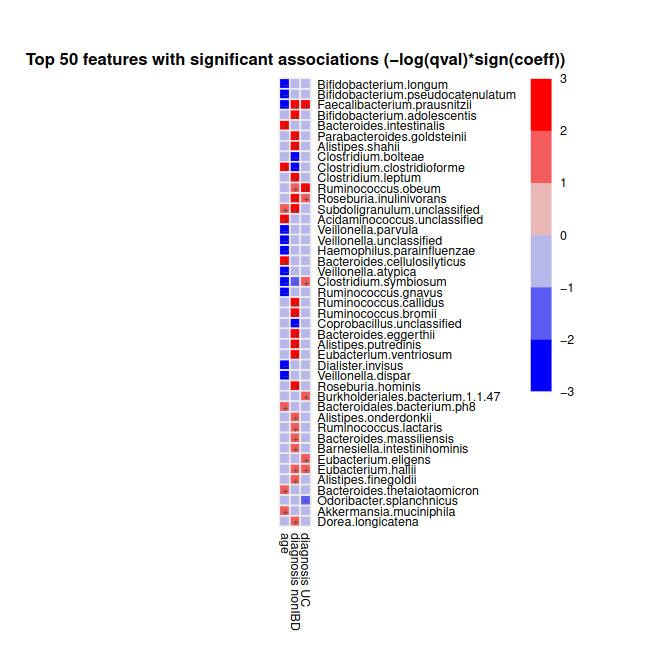

# Microbiome Association Detection with MaAsLin2

The importance of identifying associations between microbial features and metadata variables using tools like MaAsLin2 lies in several key areas:

- **Understanding Disease Mechanisms:** These associations can provide insights into how changes in microbial composition may contribute to the development or progression of diseases. This understanding is crucial for advancing knowledge of disease mechanisms.

- **Potential Diagnostic Markers:** Identifying microbial biomarkers associated with specific diseases or conditions can potentially lead to the development of diagnostic tests. These tests could aid in earlier detection, more accurate diagnosis, and monitoring of disease progression.

- **Personalized Medicine:** By identifying associations between gut microbes and individual characteristics (such as diet, medication use, or genetic factors), personalized treatment strategies can be developed. This approach may lead to more effective and tailored interventions for patients.

- **Therapeutic Targets:** Associations can reveal potential targets for therapeutic interventions, such as probiotics, prebiotics, or dietary changes, aimed at modulating the gut microbiota to promote health or mitigate disease risks.

- **Advancing Microbiome Research:** Building a comprehensive understanding of microbial associations with various factors enhances microbiome research. This knowledge can contribute to broader insights into microbial ecology, evolution, and interactions within the human body and the environment.

> <comment-title></comment-title>
>
> For more information about MaAslin2, [click here](https://huttenhower.sph.harvard.edu/maaslin/).
{: .comment}

MaAsLin2 requires the following input files:

- **Taxonomy (or features) file** : \
        This file is tab-delimited.\
        Formatted with features as columns and samples as rows.\
        The transpose of this format is also okay.\
        Possible features in this file include microbes, genes, pathways, etc.
- **Metadata file** : \
        This file is tab-delimited.\
        Formatted with features as columns and samples as rows.\
        The transpose of this format is also okay.

The Taxonomy file can contain samples not included in the metadata file (or vice versa). For both cases, those samples not included in both files will be removed from the analysis. Also the samples do not need to be in the same order in the two files.

> <agenda-title></agenda-title>
>
> In this tutorial, we will cover:
>
> 1. TOC
> {:toc}
>
{: .agenda}

# Get the data
> <hands-on-title>Getting the data</hands-on-title>
>In this tutorial, the two input files used are:
> -  `HMP2_taxonomy.tsv` or taxonomy file
> -  `HMP2_metadata.tsv` or metadata file
>
> 1. Create and name a new history for this tutorial.
>
>    
>
> 2. Import from [Zenodo](https://zenodo.org/records/12614561) or from the data library the files:
>
>    ```
>
>    https://zenodo.org/api/records/12614561/files/HMP2_taxonomy.tsv/content
>    https://zenodo.org/api/records/12614561/files/HMP2_metadata.tsv/content
>
>    ```
>
>    > <tip-title>Importing data via links</tip-title>
>    >
>    > * Copy the link location (Right-click on the filename then "Copy Link Address")
>    > * Open the Galaxy Upload Manager
>    > * Select **Paste/Fetch Data**
>    > * Paste the link into the text field
>    > * Press **Start**
>    {: .tip}
>
> 3. Change the name of the files to `taxonomy` and `metadata` .
>
>    As a default, Galaxy uses the link as the name of the new dataset. It also does not link the dataset to a database or a reference genome.
>
>    
>
> 4. Inspect the content of a file.
>
>    > <tip-title>Inspecting the content of a dataset</tip-title>
>    >
>    > * Click on the  (eye) icon next to the relevant history entry
>    > * View the content of the file in the central panel
>    {: .tip}
>
>    > <question-title></question-title>
>    >
>    > 1.  What is the main difference between the two files?
>    >
>    >
>    > > <solution-title></solution-title>
>    > > 1. The metadata file describes sample characteristics (e.g., clinical data, demographics) while the taxonomy or feature file contains microbial data (e.g., taxa abundance) used for analysis in microbiome studies.
>    > {: .solution }
>    {: .question}
>
{: .hands_on}


# Find associations between the two files
Now we will find significant associations between microbial features( taxonomy file) and metadata variables (metadata file) using the **MaAslin2** tool

> <hands-on-title> Task description </hands-on-title>
>
> 1.  with the following parameters:
>    - *"Interactions: Fixed effects"*: `c3:age`, `c4:diagnosis`
>    - *"Random effects"*: `c5:subject`
>    - *"Reference"*: `diagnosis,CD`
>
>  Keep rest of the default values as it is.
{: .hands_on}

# Understanding parameters in the tool
Lets now understand the role of each parameter in the tool.

1. **Interactions:Fixed effects** : MaAsLin2 doesn't directly support testing for interactions between variables. To explore interactions, users must manually create interaction terms as additional fixed_effects in their analysis.

2. **Random effects** : In some studies, like those following people over time or studying families, samples from the same group can be similar. MaAsLin2 helps handle this by letting researchers choose a grouping factor. This helps make sure the statistical analysis is more accurate.

3. **Reference** : It allows researchers to establish a baseline or standard category against which other categories are compared, helping to interpret and understand the effects of different variables on microbial features. In MaAslin2, reference level is must for variables with more than two distinct kind of values.

   > <comment-title></comment-title>
   >
   > - Reference for a variable with more than two levels is provided as a string of `variable,reference`.
   > - Reference for more than one variable having more than two levels each is provided as a string of `variable1,reference1,variable2,reference2` .
   > - Example, both diagnosis and site variable have more than two levels hence reference can be provided as `diagnosis,CD,site,Cedars-Sinai`.
   {: .comment}

4. **Additional options** :
- min_abundance : The minimum abundance for each feature [ Default: 0 ]
- min_prevalence:  The minimum percent of samples for which a feature is detected at minimum abundance [ Default: 0.1 ]
- max_significance: The q-value threshold for significance [ Default: 0.25 ]
- normalization: The normalization method to apply [ Default: "TSS" ] [ Choices: "TSS", "CLR", "CSS", "NONE", "TMM" ]
- transform: The transform to apply [ Default: "LOG" ] [ Choices: "LOG", "LOGIT", "AST", "NONE" ]
- analysis_method : The analysis method to apply [ Default: "LM" ] [ Choices: "LM", "CPLM", "ZICP", "NEGBIN", "ZINB" ]
- correction : The correction method for computing the q-value [ Default: "BH" ]
- standardize : Apply z-score so continuous metadata are on the same scale [ Default: TRUE ]
- plot_heatmap : Generate a heatmap for the significant associations [ Default: TRUE ]
- heatmap_first_n : In heatmap, plot top N features with significant associations [ Default: 50 ]
- plot_scatter : Generate scatter plots for the significant associations [ Default: TRUE ]
- cores : The number of R processes to run in parallel [ Default: 1 ]


# Reading Output Files
The tool generate the following five major files:
- **Data output files**
    1. `residuals.rds`
            This file contains a data frame with residuals for each feature.
    2. `significant_results.tsv`
            Provides the most important output from MaAsLin2 which is the list of significant associations.
    3.  `all_results.tsv`
            Same format as significant_results.tsv, but include all association results (instead of just the significant ones).

- **Visualization output files**
    4.  `heatmap.pdf`
        This file contains a heatmap of the significant associations.
        

    5.  `plots :`
        A plot is generated for each significant association.
        Scatter plots are used for continuous metadata.
        Box plots are for categorical data.
        Data points plotted are after normalization, filtering, and transform.

   > <question-title></question-title>
    >
    > 1. Open the heatmap.pdf output file and observe the heatmap. What do you notice?
    > 2. What do you observe in the significant.tsv file?
    >
    > > <solution-title></solution-title>
    > > 1. You will observe the association of the microbes with the fixed effects variables as `age` and `diagnosis`.
    > > - Observe how setting the reference value as `CD` for the categorical variable `diagnosis` in MaAsLin2 implies that this reference level will be used as the baseline for comparison against other levels of the variable, i.e, `nonIBD` and `UC`.
    > > - The effects of other levels will be interpreted relative to this reference level, helping to understand their impact on microbial features.
    > > - The **colors** of the heatmap represent the magnitude and direction of associations between microbial features and metadata variables.
    >       > - **Color Intensity** : The intensity of the color indicates the strength of the association. Darker or more vivid colors usually represent stronger associations.
    >       > - **Color Hue** : The hue (e.g., red, blue) typically indicates the direction of the association. For instance, red represents positive associations (where an increase in the metadata variable is associated with an increase in the microbial feature) and another color blue represents negative associations (where an increase in the metadata variable is associated with a decrease in the microbial feature).\
    >       >
    >       > For example, if you look for `Bifidobacterium longum` in the heatmap, you'll notice that its occurrence in the human gut is least affected by the individual's age and shows a neutral effect in relation to their diagnosis of UC (Ulcerative Colitis) and non-IBD (non-Inflammatory Bowel Disease).
    > > 2. The significant.tsv file shows statistically significant associations between microbial features and metadata variables that meet a specified threshold (in our case, the default `Maximum significance = 0.25`). It includes effect sizes, p-values, and adjusted p-values (q-values) to indicate the strength, direction, and reliability of each association. This file helps identify meaningful relationships in the microbiome data.
    > {: .solution }
    {: .question}


# Conclusion

In essence, uncovering associations between microbial features and metadata variables through tools like MaAsLin2 not only deepens our understanding of microbiome dynamics but also holds promise for clinical applications, personalized health strategies, and advancing the field of microbiome research.

Hurray! You have successfully completed the tutorial. Now try to run the tool with some other parameter values and have fun :)
