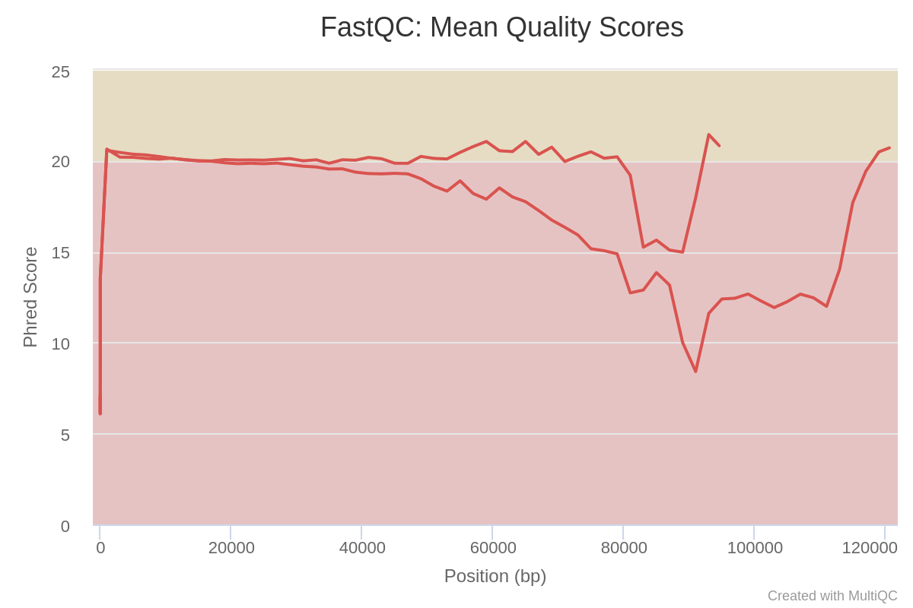
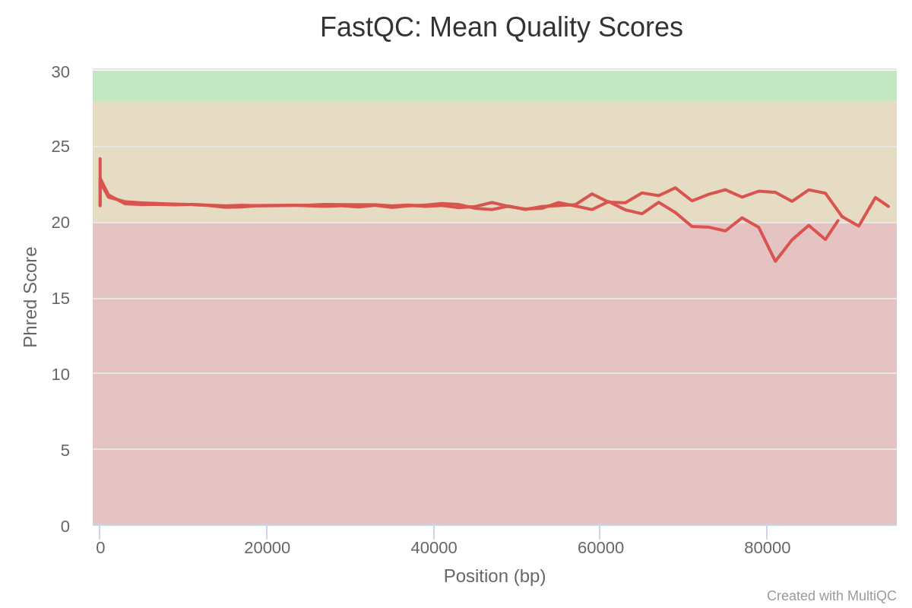
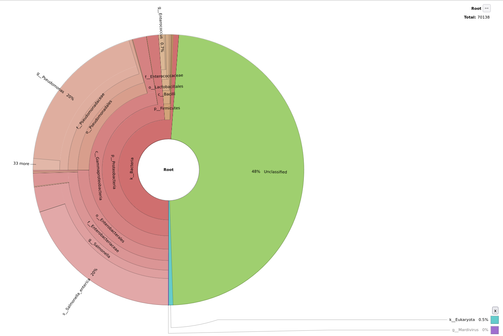
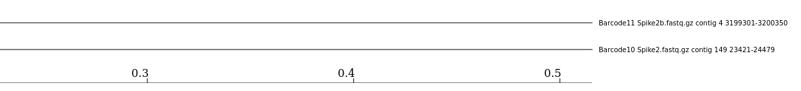

Food contamination with pathogens is a major burden on our society. In the year 2019, foodborne pathogens caused 137 hospitalisations in Germany [(BVL 2019)](https://www.bvl.bund.de/SharedDocs/Berichte/10_BELA_lebensmittelbed_Krankheitsausbruechen_Dtl/Jahresbericht2019.pdf?__blob=publicationFile&v=4). Globally, they affect an estimated 600 million people a year and impact socioeconomic development at different levels. These outbreaks are mainly due to _Salmonella spp._ followed by _Campylobacter spp._ and Noroviruses, as studied by the [__Food safety - World Health Organization (WHO)__](https://www.who.int/publications/i/item/9789241565165).

During the investigation of a foodborne outbreak, a microbiological analysis of the potentially responsible food vehicle is performed in order to detect the responsible pathogens and identify the contamination source. By default, the [__European Regulation (EC)__](https://eur-lex.europa.eu/LexUriServ/LexUriServ.do?uri=OJ:L:2005:338:0001:0026:EN:PDF) follows ISO standards to detect bacterial pathogens in food: pathogens are detected and identified by **stepwise cultures** on selective media and/or **targeting specific genes with real-time PCRs**. The current gold standard is Pulsed-field Gel Electrophoresis (PFGE) or Multiple-Locus Variable Number Tandem Repeat Analysis (MLVA) to characterize the detected strains. These techniques have some disadvantages.

**Whole Genome Sequencing** (WGS) has been proposed as an alternative. With just one sequencing run, we can:
- detect all genes
- run phylogenetic analysis to link cases
- get information on antimicrobial resistance genes, virulence, serotype, resistance to sanitizers, root cause, and other critical factors in one assay, including historical reference to pathogen emergence.

WGS is more than a surveillance tool and was recommended by the European Centre for Disease Prevention and Control (ECDC) and the European Food Safety Authority (EFSA) for surveillance and outbreak investigation. WGS still requires isolation of the targeted pathogen, which is a time-consuming process, the execution is not always straightforward, nor the success is guaranteed. **Sequencing methods without prior isolation could solve this issue**.

The evolution of sequencing techniques in the last decades has made the development of shotgun metagenomic sequencing possible, *i.e.* the **direct sequencing of all DNA present in a sample**. This approach gives an overview of the genomic composition of all cells in the sample, including the food source itself, the microbial community, and any possible pathogens and their complete genetic information without the need for prior isolation. Several studies have demonstrated the potential of shotgun metagenomics to identify and characterize pathogens and their functional characteristics (*e.g.* virulence genes) in naturally contaminated or purposefully spiked food samples.

The currently available studies used Illumina sequencing, generating short reads. Longer read lengths, generated by third-generation sequencing platforms such as Pacific Biosciences (PacBio) and Oxford Nanopore Technologies (ONT), make it **easier and more practical to identify strains with fewer reads**. MinION (from Oxford Nanopore) is a portable, real-time device for ONT sequencing. Several proof-of-principle studies have shown the **utility of ONT long-read sequencing from metagenomic samples for pathogen identification** ().



To identify and track foodborne pathogens using long-read metagenomic sequencing, different samples of potentially contaminated food (at different time points or different locations) are prepared, DNA is extracted and sequenced using MinION (ONT). The generated sequencing data then need to be processed using bioinformatics tools.

In this tutorial, we will be presenting a series of Galaxy workflows whose main goals are to:
1. **agnostically detect pathogens** (What exactly is this pathogen and what virulence factors does it carry?) from data extracted directly (without prior cultivation) from a potentially contaminated sample (e.g. food like chicken, beef, etc.) and sequenced using Nanopore
2. **compare different samples to trace** the possible source of contamination

To illustrate how to process such data, we will use datasets generated by [Biolytix](https://www.biolytix.ch/) with the following approach:


Food samples, here chicken, are spiked with known pathogens, here:
- _Salmonella enterica subsp. enterica_  in the sample named `Barcode 10 Spike 2`
- _Salmonella enterica subsp. houtenae_ in the sample named `Barcode 11 Spike 2b`

DNA in the samples is extracted, analyzed with qPCR, and sequenced via Nanopore. We start the tutorial from raw data generated by Nanopore.

> <agenda-title></agenda-title>
>
> In this tutorial, we will deal with:
>
> 1. TOC
> {:toc}
>
{: .agenda}


# Prepare Galaxy and data
Any analysis should get its own Galaxy history. So let's start by creating a new one:

> <hands-on-title>Data upload</hands-on-title>
>
> 1. Create a new history for this analysis
>
>    
>
> 2. Rename the history
>
>    
>
{: .hands_on}

Before we can begin any Galaxy analysis, we need to upload the input data: FASTQ files with the sequenced samples.

> <hands-on-title>Import datasets</hands-on-title>
>
> 1. Import the following samples via link from [Zenodo]({{ page.zenodo_link }}) or Galaxy shared data libraries:
>
>    ```text
>    {{ page.zenodo_link }}/files/Barcode10_Spike2.fastq.gz
>    {{ page.zenodo_link }}/files/Barcode11_Spike2b.fastq.gz
>    ```
>
>    
>
>    
>
> 2. Rename the files to `Barcode10` and `Barcode11` respectively
>
>    
>
> 3. Create a collection named `Samples` that includes both datasets (`Barcode10` and `Barcode11`)
>
>    
>
{: .hands_on}

In this tutorial, we can offer 2 versions:
- A short version, running prebuilt workflows
- A long version, going step-by-step




# Preprocessing

Before starting any analysis, it is always a good idea to assess the quality of your input data and to discard poor quality base content by trimming and filtering reads.

<div class="Short-Version" markdown="1">

In this section we will run a Galaxy workflow that performs the following tasks with the following tools:
1. Assess the reads quality before and after preprocessing it using [__FastQC__](https://www.bioinformatics.babraham.ac.uk/projects/fastqc/), [__NanoPlot__](https://github.com/wdecoster/NanoPlot) and  [__MultiQC__](https://multiqc.info/) ()
2. Trimming and filtering reads by length and quality using [__Porechop__](https://github.com/rrwick/Porechop) and **Fastp** ()
3. Remove main host sequences, in this training all __chicken__ (Gallus gallus) sequences, using [__Minimap2__](https://github.com/lh3/minimap2)
4. Remove other possible hosts sequences e.g. human, cow, etc. using [__Kraken2__](https://ccb.jhu.edu/software/kraken2/) () with the [__Kalamari__](https://github.com/lskatz/Kalamari) database, and [__Krakentools: Extract Kraken Reads By ID__](https://github.com/jenniferlu717/KrakenTools/blob/master/extract_kraken_reads.py) to remove all the hosts sequences before moving on to the next section with only the non-host sequences.

We will run all these steps using a single workflow, then discuss each step and the results in more detail.

> <hands-on-title>Pre-Processing</hands-on-title>
>
> 1. **Import the workflow** into Galaxy
>    - Copy the URL (e.g. via right-click) of [this workflow]({{ site.baseurl }}{{ page.dir }}workflows/nanopore_preprocessing.ga) or download it to your computer.
>    - Import the workflow into Galaxy
>
>    
>
> 2. Run **Workflow 1: Nanopore Preprocessing**  using the following parameters
>    - *"Samples Profile"*: `PacBio/Oxford Nanopore read to reference mapping`, which is the technique used for sequencing the samples.
>
>    -  *"Collection of all samples"*: `Samples` collection created from the imported Fastq.qz files
>
>    
>
{: .hands_on}

The workflow will take a little while to complete. Once tools have completed, the results will be available in your history for viewing. Note that only the most important outputs will be visible; intermediate files are hidden by default.

While you are waiting for the workflow to complete, please continue reading in the next section(s) where we will go into a bit more detail about what happens at each step of the workflow we launched and examine the results.
</div>

## Quality Control and Preprocessing

During sequencing, errors are introduced, such as incorrect nucleotides being called. These are due to the technical limitations of each sequencing platform. Sequencing errors might bias the analysis and can lead to a misinterpretation of the data. **Sequence quality control is therefore an essential first step in your analysis.**

In this tutorial we use similar tools as described in the tutorial ["Quality control"](), but more specific to Nanopore data:

- Quality control with
    - [__FastQC__](https://www.bioinformatics.babraham.ac.uk/projects/fastqc/) generates a web report that will aid you in assessing the quality of your data
    - [__NanoPlot__](https://github.com/wdecoster/NanoPlot) plotting tool for long read sequencing data and alignments

    <div class="Long-Version" markdown="1">

    > <hands-on-title> Initial quality assessment </hands-on-title>
    > 1.  with the following parameters:
    >    -  *"Raw read data from your current history"*: `Samples` collection created from the imported Fastq.qz files
    >
    > 2.  with the following parameters:
    >    - *"Select multifile mode"*: `batch`
    >        - *"Type of the file(s) to work on"*: `fastq`
    >            -  *"Data input files"*: `Samples` collection created from the imported Fastq.qz files
    >
    >    > <comment-title></comment-title>
    >    > The `NanoPlot` step, as it does not require the results of FastQC to run, can be launched even if FastQC is not ready
    >    {: .comment}
    >
    > 3.  with the following parameters:
    >    - In *"Results"*:
    >        -  *"Insert Results"*
    >            - *"Which tool was used generate logs?"*: `FastQC`
    >                - In *"FastQC output"*:
    >                    -  *"Insert FastQC output"*
    >                        - *"Type of FastQC output?"*: `Raw data`
    >                        -  *"FastQC output"*: collection of `Raw data` outputs of **FastQC** 
    {: .hands_on}

    </div>


- Read trimming and filtering with [__Porechop__](https://github.com/rrwick/Porechop) and **Fastp** ()

    <div class="Long-Version" markdown="1">

    > <hands-on-title> Read trimming and filtering </hands-on-title>
    >
    > 1.  with the following parameters:
    >    -  *"Input FASTA/FASTQ"*: `Samples` collection created from the imported Fastq.qz files
    >    - *"Output format for the reads"*: `fastq.gz`
    >
    > 2.  with the following parameters:
    >    - *"Single-end or paired reads"*: `Single-end`
    >        -  *"Input 1"*: output collection of **Porechop** 
    >    - In *Output Options*
    >        - *"Output JSON report"*: `Yes`
    >
    >    > <comment-title></comment-title>
    >    > This step can be launched even if **Porechop** is not done. It will be scheduled and wait until **Porechop** is done to start.
    >    {: .comment}
    {: .hands_on}

    </div>

- Quality recheck after read trimming and filtering with **FastQC** and **Nanoplot** and report aggregation with [__MultiQC__](https://multiqc.info/)

    <div class="Long-Version" markdown="1">

    > <hands-on-title> Final quality checks </hands-on-title>
    > 1.  with the following parameters:
    >    -  *"Raw read data from your current history"*: output collection of **fastp** 
    >
    > 2.  with the following parameters:
    >    - *"Select multifile mode"*: `batch`
    >        - *"Type of the file(s) to work on"*: `fastq`
    >            -  *"files"*: output collection of **fastp** 
    >
    > 3.  with the following parameters:
    >    - In *"Results"*:
    >        -  *"Insert Results"*
    >            - *"Which tool was used generate logs?"*: `FastQC`
    >                - In *"FastQC output"*:
    >                    -  *"Insert FastQC output"*
    >                        - *"Type of FastQC output?"*: `Raw data`
    >                        -  *"FastQC output"*: collection of `Raw data` output of **FastQC**  done after **fastp**
    >        -  *"Insert Results"*
    >            - *"Which tool was used generate logs?"*: `fastp`
    >                -  *"Output of fastp"*: `JSON report` output of **fastp** 
    {: .hands_on}

    </div>

> <question-title></question-title>
>
> Inspect the HTML two outputs of **MultiQC** for `Barcode10` before and after preprocessing tagged `MultiQC_Before_Preprocessing` and `MultiQC_After_Preprocessing`
>
> 1. How many sequences does `Barcode10` contain before and after trimming?
> 2. What is the quality score over the reads before and after trimming? And the mean score?
> 3. What is the importance of **FastQC**?
>
> > <solution-title></solution-title>
> >
> > 1. Before trimming the file has 114,986 sequences and After trimming the file has 91,434 sequences
> > 2. The "Per base sequence quality" is globally medium: the quality score stays above 20 over the entire length of reads after trimming, while quality below 20 could be seen before trimming specially at the beginning and the end of the reads.
> >
> > Sequence quality of Barcode 10 and Barcode 11 before preprocessing:
> >
> >    
> >
> >
> > Sequence quality of Barcode 10 and Barcode 11 after preprocessing:
> >
> >    
> >
> > 3. After checking what is wrong, e.g. before trimming, we should think about the errors reported by **FastQC**: they may come from the type of sequencing or what we sequenced (check the ["Quality control" training](): [FastQC](https://www.bioinformatics.babraham.ac.uk/projects/fastqc/) for more details). However, despite these challenges, we can already see sequences getting slightly better after the trimming and filtering, so now we can proceed with our analyses.
> {: .solution}
{: .question}

> <comment-title></comment-title>
> For more information about how to interpret the plots generated by **FastQC** and **MultiQC**, please see our dedicated ["Quality control"]() Tutorial.
{: .comment}

## Host read filtering

Generally, we are not interested in the food (host) sequences, rather only those originating from the pathogen itself. It is an important to get rid of all host sequences and to only retain sequences that might include a pathogen, both in order to speed up further steps and to avoid host sequences compromising the analysis.

In this tutorial, we know the samples come from __chicken__ meat spiked with **_Salmonella_** so we already know what will we get as the host and the main pathogen. If the host is not known, **Kraken2** with **Kalamari** database can be used to detect it.

In this tutorial we use:
1. Map reads to __chicken__ reference genome using **Map with minimap2** and **Chicken (Gallus gallus): galGal6** built in reference genome of __chicken__, and we move forward with the unmapped ones.

    <div class="Long-Version" markdown="1">

    > <hands-on-title>Read taxonomic classification for host filtering </hands-on-title>
    >
    > 1.  with the following parameters:
    >    - *"Will you select a reference genome from your history or use a built-in index?"*: `Use a built-in genome index`
    >        - *"Using reference genome"*: `Chicken (Gallus gallus): galGal6`
    >    - *"Single or Paired-end reads"*: `Single`
    >        -  *"Select fastq dataset"*: `out1` (output of **fastp** )
    >        - *"Select a profile of preset options"*: `PacBio/Oxford Nanopore read to reference mapping (-Hk19) (map-pb)`, which is the technique used for sequencing the samples.
    >    - In *"Alignment options"*:
    >        - *"Customize spliced alignment mode?"*: `No, use profile setting or leave turned off`
    >
    > 2.  with the following parameters:
    >    -  *"BAM dataset to split by mapped/unmapped"*: `alignment_output` (output of **Map with minimap2** )
    >
    > 3.  with the following parameters:
    >    -  *"BAM or SAM file to convert"*: `unmapped` (output of **Split BAM by reads mapping status** )
    >    - *"Output format"*: `compressed FASTQ`
    >    - *"Write index read files"*: `No`
    >
    {: .hands_on}

2. Assign filted reads, after mapping (non __chicken__ reads), to taxa using **Kraken2** () as a further contamination detection using the **Kalamari** database. The **Kalamari** database includes mitochondrial sequences of various known hosts including food hosts.

    <div class="Long-Version" markdown="1">

    > <hands-on-title>Read taxonomic classification for host filtering </hands-on-title>
    >
    > 1.  with the following parameters:
    >    - *"Single or paired reads"*: `Single`
    >        -  *"Input sequences"*: `output` (output of **Samtools fastx** )
    >    - *"Print scientific names instead of just taxids"*: `Yes`
    >    - In *"Create Report"*:
    >        - *"Print a report with aggregrate counts/clade to file"*: `Yes`
    >        - *"Report counts for ALL taxa, even if counts are zero"*: `Yes`
    >        - *"Report minimizer data"*: `Yes`
    >    - *"Select a Kraken2 database"*: `kalamari`
    >
    {: .hands_on}

    </div>

    > <question-title></question-title>
    >
    > For the tutorial long version takers, run **Samtools fastx** on the `mapped` (output of **Split BAM by reads mapping status** ), then inspect the output for `Barcode10`. If you are a short version taker then inspect the output named `host_sequences_fastq`.
    >
    > 1. How many __chicken__ sequences were found?
    >
    > > <solution-title></solution-title>
    > >
    > > 1. 53722
    > >
    > {: .solution}
    {: .question}

3. Filter host assigned reads based on **Kraken2** assignments
    1. Manipulate **Kraken2** classification to extract the sequence ids of all hosts sequences identified with **Kraken2**
    2. Filter the FASTQ files to get 1 ouput with the host-assigned sequences and 1 output without the host-assigned reads

    <div class="Long-Version" markdown="1">

    > <hands-on-title> Host read filtering </hands-on-title>
    >
    > 1.  with the following parameters:
    >    - *"Single or paired reads?"*: `Single`
    >        -  *"FASTQ/A file"*: `out1` (output of **fastp** )
    >    -  *"Results"*: `Kraken2 with Kalamri database Results` outputs of **Kraken2** 
    >    -  *"Report"*: `Kraken2 with Kalamri database Report` outputs of **Kraken2** 
    >    - *"Taxonomix ID(s) to match"*:`9031 9606 9913`
    >
    >       We specify here the taxonomic ID of the hosts so we can filter reads assigned to these hosts. Kraken2 uses taxonomic IDs from NCBI, the IDs for a specific taxa can be found at [ncbi](https://www.ncbi.nlm.nih.gov/taxonomy). To be generic, we remove here:
    >         - Human (`9606`)
    >         - Chicken (`9031`)
    >         - Beef (`9913`)
    >
    >       If the contaminated food comes from and may include other animals, you can change the value here.
    >    - *"Invert output"*: `Yes`
    >    - *"Output as FASTQ"*: `Yes`
    >    - *"Include parents"*: `Yes`
    >    - *"Include children"*: `Yes`
    {: .hands_on}

    </div>


> <comment-title></comment-title>
>
> We will need the outputs from this section in the next one.  If yours is still running or you get an error you can go on and upload it so you can start the next workflow, the next hands-on is optional.
>
> > <hands-on-title>Optional Data upload</hands-on-title>
> >
> > 1. Import the quality processed samples fastqsanger files via link from [Zenodo]({{ page.zenodo_link }}) or the Shared Data library:
> >
> >    ```text
> >    {{ page.zenodo_link }}/files/preprocessed_sample_barcode10_spike2.fastq.gz
> >    {{ page.zenodo_link }}/files/preprocessed_sample_barcode11_spike2b.fastq.gz
> >    ```
> >
> > 2. Rename datasets to `Barcode10` and `Barcode11` respectively
> >
> > 3. Create a collection named `collection of preprocessed samples` from the two imported datasets
> >
> {: .hands_on}
{: .comment}


# Taxonomy Profiling

In this section we would like to identify the different organisms found in our samples by assigning taxonomy levels to the reads starting from the kingdom level down to the species level and visualize the result. It's important to check what might be the species of a possible pathogen to be found, it gets us closer to the investigation as well as discovering possible multiple food infections if any existed.



In the previous section we ran **Kraken2** along with the **Kalamari** database, which is also a kind of taxonomy profiling but the database used is designed to include all possible host sequences. In the following part, we run **Kraken2** again; but this time with one of its built-in databases, **Standard PlusPF**, which can give us more insight into pathogen candidate species than **Kalamari**. You can test this yourself by comparing reports of both **Kraken2** runs.



<div class="Short-Version" markdown="1">

> <hands-on-title>Taxonomy Profiling and visualisation</hands-on-title>
>
> 1. **Import the workflow** into Galaxy
>    - Copy the URL (e.g. via right-click) of [this workflow]({{ site.baseurl }}{{ page.dir }}workflows/taxonomy_profiling_and_visualisation_with_krona.ga) or download it to your computer.
>    - Import the workflow into Galaxy
>
> 2. Run **Workflow 2: Taxonomy Profiling and Visualization with Krona**  using the following parameters:
>    - *"Send results to a new history"*: `No`
>    -  *"Collection of preprocessed samples"*: `collection of preprocessed samples` collection, output from **Krakentools: Extract Kraken Reads By ID**  from the preproceesing workflow
>    - *"Kraken database"*: `Prebuilt Refseq indexes:  PlusPF (Standard plus protozoa and fungi) (Version:  2022-06-07 - Downloaded: 2022-09-04T165121Z)`
>
>    
>
{: .hands_on}

</div>

To assign reads to taxons, we use **Kraken2** with **Standard PlusPF** database.

<div class="Long-Version" markdown="1">

> <hands-on-title> Taxonomy Profiling </hands-on-title>
>
> 1.  with the following parameters:
>    - *"Single or paired reads"*: `Single`
>        -  *"Input sequences"*: collection output from **Krakentools: Extract Kraken Reads By ID**  from the preprocessing section
>    - In *"Create Report"*:
>        - *"Print a report with aggregrate counts/clade to file"*: `Yes`
>    - *"Select a Kraken2 database"*: `Prebuilt Refseq indexes:  PlusPF (Standard plus protozoa and fungi) (Version:  2022-06-07 - Downloaded: 2022-09-04T165121Z)`
{: .hands_on}

</div>

> <question-title></question-title>
>
> Inspect the **Kraken2** report for `Barcode10`
>
> 1. What is the most commonly found species?
> 2. What is the second most commonly found species?
> 3. How many sequences are classified and how many are unclassified?
> 4. What are the differences between **Kraken2** tool's report with **Kalamari** database and **Kraken2** tool's report with **Standard PlusPF** database regarding the previous 3 questions?
>
> > <solution-title></solution-title>
> >
> > 1. Genus level _Salmonella_ with 9,950 sequences
> > 2. Genus level _Escherichia_ with 1,949 sequences
> > 3. 33,941 sequences are classified and 3,738 are unclassified
> > 4. With **Kalamari** database the most found Genus is _Escherichia_ with 13,943 sequences and the second most found Genus is _Salmonella_ with 10,585 sequences. The number of classified sequences are 30,838 sequences and the unclassified sequences are 6,874. In conclusion, both databases are able to show the similar results of the most common identified species, but with different counts of identified sequences. As well as, the number of the classified sequences with **Standard PlusPF** database is higher than **Kalamari** database.
> {: .solution}
{: .question}

In order to view the taxonomy profiling produced by **Kraken2** tool, there are a lot of tools to be used afterwards such as **Krona pie chart**, which we will be using in this tutorial. For later, you can also check out [__Pavian__](https://academic.oup.com/bioinformatics/article/36/4/1303/5573755) tool, as well as **Phinch visualization**, which is an interactive tool that contains multiple visualization plots, it is interactive alowing you to choose between different parameters, you can visualize each taxonomic level on its own, you can have the metadata of the samples represented along with the taxonomic visualization, download all plots for publications and a lot of other benefits.


<div class="Long-Version" markdown="1">

> <hands-on-title> Visualisation </hands-on-title>
>
> 1.  with the following parameters:
>    -  *"Kraken report file"*: `report_output` (output of **Kraken2** )
>
> 2.  with the following parameters:
>    - *"What is the type of your input data"*: `Tabular`
>        -  *"Input file"*: `output` (output of **Krakentools: Convert kraken report file** )
>
{: .hands_on}

</div>


Now let's explore the **Krona pie chart** output for `Barcode11`

> <question-title></question-title>
>
> 1. What is the most commonly found species?
> 2. What is the second most commonly found species?
>
> > <solution-title></solution-title>
> >
> > 1. At Genus level: *Salmonella* with 16,111 sequences
> > 2. At Genus level: *Pseudomonas* with 14,251 sequences
> >
> >    
> >
> {: .solution}
{: .question}

> <comment-title></comment-title>
> While these steps are running, you can move on to the next section **Gene based pathogenic identification** and run the steps there, as well. Both analyses can execute in parallel.
{: .comment}

You may have noticed some sequences have been assigned to the Human Genome (Homosapians) species, when we run **Kraken2** using the **Standard PlusPF** in this section. However, in the **pre-processing** section when we ran **Kraken2** with **Kalamari** no Human Genomes were found. The lab (data producers) has confirmed that these sequences assigned to human by **Standard PlusPF** database are not human and there should be no human sequences in the samples as **Kalamari** database result's confirmed. So these sequences were wrongly assigned to human by **Standard PlusPF**. That is due to resemblance between organisms and the limited species coverage of **Kraken2** databases sometimes do happen that reads corresponding to higher organisms get mapped to humans. It was a very severe problem for the **Standard PlusPF**, because yeast genes were mis-assigned to human.

We decide to keep these sequences since we do not know what are they via the **taxonomy profiling** step, which could mean that they might be identified as pathogens in the coming steps, and if we delete them we are possibly losing important information and losing the main goal of the workflow to detect pathogens and track them.

# Gene-based pathogen identification

With taxonomy profiling, we identified some bacterial species. But we want to be sure they are pathogenic, by **looking for genes known to be linked to pathogenicity or to the pathogenecity character** of the organim:

- [**Virulence Factor (VF)**](https://www.sciencedirect.com/topics/immunology-and-microbiology/virulence-factor): gene products, usually proteins, involved in pathogenicity. By identifiying them we can call a pathogen and its severity level
- [**Antimicrobial Resistance genes (AMR)**](https://www.sciencedirect.com/topics/engineering/antibiotic-resistance-genes).

    These type of genes have three fundamental mechanisms of antimicrobial resistance that are enzymatic degradation of antibacterial drugs, alteration of bacterial proteins that are antimicrobial targets, and changes in membrane permeability to antibiotics, which will lead to not altering the target site and spread throughput the pathogenic bacteria decreasing the overall fitness of the host.

To look for these genes and determine the strain of the bacteria we are testing for pathogenicity we do:

1. Genome assembly to get contigs, i.e. longer sequences, using **metaflye** ()  then assembly polishing using [__medaka consensus pipeline__](https://github.com/nanoporetech/medaka) and visualizing the assembly graph using **Bandage Image** ()
2. Generate reports with **AMR** genes and **VF** using [__ABRicate__](https://github.com/tseemann/abricate)

As outputs, we will get our **FASTA** and **Tabular** files to track genes and visualize our pathogenic identification.

<div class="Short-Version" markdown="1">

> <hands-on-title>Gene based Pathogenic Identification</hands-on-title>
>
> 1. **Import the workflow** into Galaxy
>    - Copy the URL (e.g. via right-click) of [this workflow]({{ site.baseurl }}{{ page.dir }}workflows/gene_based_pathogen_identification.ga) or download it to your computer.
>    - Import the workflow into Galaxy
>
>    
>
> 2. Run **Workflow 3: Gene-based Pathogen Identification**  using the following parameters:
>    -  *"Collection of preprocessed samples"*: `collection of preprocessed samples` collection output from **Krakentools: Extract Kraken Reads By ID**  from the preprocessing workflow
>
>    
>
{: .hands_on}

</div>

## Assembly

To identify VF or AMR genes, it is better to assemble reads into longer seuqences or contigs, that can be then used to search databases for the presence of any pathogenic gene:

- Assembly of long-read metagenomic data using **metaflye** or **Flye**.

    <div class="Long-Version" markdown="1">

    > <hands-on-title> Assembly with Flye </hands-on-title>
    >
    > 1.  with the following parameters:
    >    - In *"Dataset"*:
    >        -  *"Insert Dataset"*
    >            -  *"Input Dataset"*: collection output from **Krakentools: Extract Kraken Reads By ID**  from the preprocessing section
    >            - *"Label to use"*: `Index`
    >
    > 2.  with the following parameters:
    >    -  *"Input reads"*: collection output from **Build list** 
    >
    >      > <comment-title></comment-title>
    >      > We need to run **Flye** individually on each sample otherwise **Flye** runs by default a co-assembly mode, *i.e.* it combines reads of both samples together before running the assembly.
    >      {: .comment}
    >
    >    - *"Mode"*: `Nanopore HQ (--nano-hq)`
    >    - *"Perform metagenomic assembly"*: `Yes`
    >    - *"Reduced contig assembly coverage"*: `Disable reduced coverage for initial disjointing assembly`
    >
    {: .hands-on}

    </div>

- For the visualization of the assembly graph output from **Flye** we have chosen **Bandage Image**.

    <div class="Long-Version" markdown="1">

    > <hands-on-title> Visualization of the assembly grap </hands-on-title>
    > 3.  with the following parameters:
    >    -  *"Graphical Fragment Assembly"*: `assembly_graph` Assembly graph outputs of **Flye** 
    {: .hands-on}

    </div>

- Contig polishing using **medaka** to correct the long, error-prone Nanopore reads

    <div class="Long-Version" markdown="1">

    > <hands-on-title> Contig polishing </hands-on-title>
    >
    > 4.  with the following parameters:
    >    -  *"Select basecalls"*: collection output from **Krakentools: Extract Kraken Reads By ID**  from the preprocessing section
    >    -  *"Select assembly"*: `consensus` collection output of **Flye** 
    >    - *"Select model"*: `r941_min_hac_g507`
    >    - *"Select output file(s)"*: `select all`
    {: .hands-on}

    To keep information about the provenance of the contigs, we extract the sample names from the **collection of preprocessed samples** collection and add it to the contigs files.

    > <hands-on-title> Contig renaming to add sample names </hands-on-title>
    > 1.  with the following parameters:
    >    -  *"Convert these sequences"*: collection output of **medaka consensus pipeline** 
    > 2.  with the following parameters:
    >    -  *"Dataset collection"*: collection output from **Krakentools: Extract Kraken Reads By ID**  from the preprocessing section
    >
    > 3.  with the following parameters:
    >    -  *"Text file to split"*: output from **Extract element identifiers** 
    >
    > 4.  with the following parameters:
    >    -  *"Input file containing parameter to parse out of"*: output from **Split file** 
    >
    > 5.  with the following parameters:
    >    - In *"components"*:
    >        -  *"Insert components"*
    >            - *"Choose the type of parameter for this field"*: `Text Parameter`
    >                - *"Enter text that should be part of the computed value"*: output from **Parse parameter value** 
    >        -  *"Insert components"*
    >            - *"Choose the type of parameter for this field"*: `Text Parameter`
    >                - *"Enter text that should be part of the computed value"*: `_$1`
    >
    > 6.  with the following parameters:
    >    -  *"File to process"*: collection output of **FASTA-to-Tabular** 
    >    - In *"Find and Replace"*:
    >        -  *"Insert Find and Replace"*
    >            - *"Find pattern"*: `^(.+)$`
    >            - *"Replace with"*: output from **Compose text parameter value** 
    >            - *"Find-Pattern is a regular expression"*: `Yes`
    >            - *"Replace all occurences of the pattern"*: `Yes`
    >            - *"Find and Replace text in"*: `specific column`
    >                - *"in column"*: `Column: 1`
    >
    > 7.  with the following parameters:
    >    -  *"Tab-delimited file"*: `outfile` (output of **Replace** )
    >    - *"Title column(s)"*: `c1`
    >    - *"Sequence column"*: `c2`
    >
    > 8. Rename the output collection `Contigs`
    {: .hands-on}

    </div>

> <question-title></question-title>
>
> Inspect **Flye** and **Medaka consensus pipeline** output results for `Barcode10`
>
> 1. How many different contigs did you get after **Flye**, collection name: Flye Consensus Fasta?
> 2. How many were left after **Medaka consensus pipeline**, collection name: Sample all contigs, and what does that mean?
> 2. What is the result of your **Bandage Image**?
>
> > <solution-title></solution-title>
> >
> > 1. After **Flye** we have got 130 contigs
> > 2. After **Medaka consensus pipeline** all 130 contigs were kept, which means that the quality of the **Flye** run was high, and as a result the polishing did not remove any of the contigs.
> > 3. The graph looks like:
> >
> >    
> >
> {: .solution}
{: .question}

<!--## Multilocus Sequence Typing

**MLST** tool is used to scan the [pubMLST](https://pubmlst.org/) database against PubMLST typing schemes. It's one of the analyses that you can perform on your dataset to determine the allele IDs, you can also detect novel alleles. This step is not essential to identify pathogens and track them in the remainder of this tutorial, however we wanted to show some of the analysis that one can use Galaxy in to understand more about the dataset, as well as identifying the strain that might be a pathogen or not.

<div class="Long-Version" markdown="1">

> <hands-on-title> Multilocus Sequence Typing </hands-on-title>
>
> 1.  with the following parameters:
>    -  *"input_files"*:  collection output of **medaka consensus pipeline**  FASTA files with contigs
>    - *"Specify advanced parameters"*: `Yes, see full parameter list`
>        - *"Output novel alleles"*: `Yes`
>        - *"Automatically set MLST scheme"*: `Automatic MLST scheme detection`
>
{: .hands-on}

</div>

The output file of the **MLST** tool is a tab-separated output file which contains:
- the filename
- the closest PubMLST scheme name
- the ST (sequence type)
- the allele IDs

> <question-title></question-title>
>
> Inspect **MLST**  results
>
> 1. What is the the closest PubMLST typing scheme name detected by the tool for  `Barcode11`?
>
> > <solution-title></solution-title>
> >
> > 1. senterica_achtman_2 ()
> >
> {: .solution}
{: .question}
-->

## Antimicrobial Resistance Genes

Now, to search **AMR** genes among our samples' contigs, we run **ABRicate** and choose the [__NCBI Bacterial Antimicrobial Resistance Gene Database (AMRFinderPlus)__](https://www.ncbi.nlm.nih.gov/pmc/articles/PMC6811410/) from the advanced options of the tool. The tool checks if there is an AMR found or not, if found then in which contig it is, its location on the contig, what the name of the exact product is, what substance it provides resistance against and a lot of other information regarding the found **AMR**.

<div class="Long-Version" markdown="1">

> <hands-on-title> Antimicrobial Resistance Genes Identification </hands-on-title>
>
> 1.  with the following parameters:
>    -  *"Input file (Fasta, Genbank or EMBL file)"*: collection output of **medaka consensus pipeline**  FASTA files with contigs
>    - In *"Advanced options"*:
>        - *"Database to use - default is 'resfinder'"*: `NCBI Bacterial Antimicrobial Resistance Reference Gene Database`
> 2. Rename **ABRicate** the output collection `amr_identified_by_ncbi`
{: .hands-on}

</div>

The outputs of **ABRicate** is a tabular file with different columns:
1. `FILE`: The filename this hit came from
2. `SEQUENCE`: The sequence in the filename
3. `START`: Start coordinate in the sequence
4. `END`: End coordinate
5. `STRAND`: AMR gene
6. `GENE`: AMR gene
7. `COVERAGE`: What proportion of the gene is in our sequence
8. `COVERAGE_MA`: A visual represenation
9. `GAPS`: Was there any gaps in the alignment - possible pseudogene?
10. `%COVERAGE`: Proportion of gene covered
11. `%IDENTITY`: Proportion of exact nucleotide matches
12. `DATABASE`: The database this sequence comes from
13. `ACCESSION`: The genomic source of the sequence
14. `PRODUCT`
15. `RESISTANCE`

<!--<div class="Long-Version" markdown="1">

> <hands-on-title> Antimicrobial Resistance Genes Identification </hands-on-title>
> 2.  with the following parameters:
>    - *"Cut columns"*: `c13`
>    -  *"From"*: `report` (output of the **ABRicate**  run)
>
> 3.  with the following parameters:
>    - *"text to add"*: `Spike2Barcode10` or `Spike2bBarcode11` respectively to the tag chosen for the first parameter (the sample ID)
>    -  *"input file"*: `out_file1` (output of the **Cut** )
{: .hands-on}

</div>-->
To prepare the **ABRicate** output tabulars of both samples for further analysis in the **Pathogen Detection Samples Aggregation and Visualisation** section, tabular manipulation tools such as **Replace** is used. We mainly use it to add the sample ID along with which contig at which exact location.

<div class="Long-Version" markdown="1">

> 1.  with the following parameters:
>    -  *"File to process"*: `report` (output of **ABRicate** )
>    - In *"Find and Replace"*:
>        -  *"Insert Find and Replace"*
>            - *"Find pattern"*: `#FILE`
>            - *"Replace with"*: `SampleID`
>            - *"Replace all occurences of the pattern"*: `Yes`
>            - *"Find and Replace text in"*: `specific column`
>                - *"in column"*: `c1`
>        -  *"Insert Find and Replace"*
>            - *"Find pattern"*: `^(.+)$`
>            - *"Replace with"*: output from **Compose text parameter value** 
>            - *"Find-Pattern is a regular expression"*: `Yes`
>            - *"Replace all occurences of the pattern"*: `Yes`
>            - *"Ignore first line"*: `Yes`
>            - *"Find and Replace text in"*: `specific column`
>                - *"in column"*: `c2`
>
> 2. Rename the output collection `AMRs`
{: .hands-on}
</div>

> <question-title></question-title>
>
> Inspect **ABRicate** output files from `Barcode10`and `Barcode11` tags
>
> 1. How many **AMR** genes found in `Barcode10` sample, what are they? Give more details about them.
> 2. How many **AMR** genes found in `Barcode11` sample, what are they? Give more details about them.
>
> > <solution-title></solution-title>
> >
> > 1. 7 **AMR** genes were found:
> >    1. Tet(C), which resists [TETRACYCLINE](https://medlineplus.gov/druginfo/meds/a682098.html). It was found in contig 119 from the position 1635 till 2810, with 100% coverage, so 100% of gene is covered in this contig.
> >    2. Tet(34), which resists [TETRACYCLINE](https://medlineplus.gov/druginfo/meds/a682098.html). It was found in contig 135 from the position 69874 till 70223, with 74.41% coverage.
> >    3. aac(6')_Yersi, which resists [AMINOGLYCOSIDE](https://en.wikipedia.org/wiki/Aminoglycoside). It was found in contig 156 from the position 37698 till 38000, with  69.68 % coverage.
> >    4. 2 genes with sulfonamide-resistant dihydropteroate synthase Sul1 products
> >    5. 2 genes with oxacillin-hydrolyzing class D beta-lactamase OXA-2 products
> > 2. 2 **AMR** genes were found by the database in `Barcode11` sample, Tet(34) and aac(6')_Yersi.
> >
> {: .solution}
{: .question}

## Virulence Factor identification

In this step we return back to the main goal of the tutorial where we want to identify the pathogens: **identify if the bacteria found in our samples are pathogenic bacteria or not**. One of the ways to do that is to identify if the sequences include genes with a [Virulence Facor](https://www.ncbi.nlm.nih.gov/pmc/articles/PMC2646308/) or not, such that if the samples include gene(s) with a Virulence Factor then it for sure is a pathogen.

> <comment-title>Definitions</comment-title>
>
> **Bacterial Pathogen**: A bacterial pathogen is usually defined as any bacterium that has the capacity to cause disease. Its ability to cause disease is called pathogenicity.
>
> **Virulence**: Virulence provides a quantitative measure of the pathogenicity or the likelihood of causing a disease.
>
> **Virulence Factors**: Virulence factors refer to the properties (i.e., gene products) that enable a microorganism to establish itself on or within a host of a particular species and enhance its potential to cause disease. Virulence factors include bacterial toxins, cell surface proteins that mediate bacterial attachment, cell surface carbohydrates and proteins that protect a bacterium, and hydrolytic enzymes that may contribute to the pathogenicity of the bacterium.
>
{: .comment}

To identifly VFs, we use again **ABRicate** but this time with the [__VFDB__](https://pubmed.ncbi.nlm.nih.gov/26578559/) from the advanced options of the tool.

<div class="Long-Version" markdown="1">

> <hands-on-title> Virulence Factor identification </hands-on-title>
>
> 1.  with the following parameters:
>    -  *"Input file (Fasta, Genbank or EMBL file)"*: collection output of **medaka consensus pipeline**  FASTA files with contigs
>    - In *"Advanced options"*:
>        - *"Database to use - default is 'resfinder'"*: `VFDB`
>
> 2. Rename **ABRicate** the output collection `vfs_of_genes_identified_by_vfdb`
{: .hands-on}

</div>

> <question-title></question-title>
>
> Inspect **VFs of genes Identified by VFDB** output file from`Barcode10`and `Barcode11`
>
> 1. How many different **VFs** gene products were found in `Barcode10` sample?
> 2. How many different **VFs** gene products were found in `Barcode11` sample?
>
> > <solution-title></solution-title>
> >
> > 1. 188
> > 2. 287
> >
> {: .solution}
{: .question}

To prepare the **ABRicate** output tabulars of both samples for further analysis in the **Pathogen Detection Samples Aggregation and Visualisation** section, tabular manipulation tools such as **Replace** is used. We mainly use it to add the sample ID along with which contig at which exact location.

<div class="Long-Version" markdown="1">

> 1.  with the following parameters:
>    -  *"File to process"*: `report` (output of **ABRicate** )
>    - In *"Find and Replace"*:
>        -  *"Insert Find and Replace"*
>            - *"Find pattern"*: `#FILE`
>            - *"Replace with"*: `SampleID`
>            - *"Replace all occurences of the pattern"*: `Yes`
>            - *"Find and Replace text in"*: `specific column`
>                - *"in column"*: `c1`
>        -  *"Insert Find and Replace"*
>            - *"Find pattern"*: `^(.+)$`
>            - *"Replace with"*: output from **Compose text parameter value** 
>            - *"Find-Pattern is a regular expression"*: `Yes`
>            - *"Replace all occurences of the pattern"*: `Yes`
>            - *"Ignore first line"*: `Yes`
>            - *"Find and Replace text in"*: `specific column`
>                - *"in column"*: `c2`
>
> 2. Rename the output collection `VFs`
{: .hands-on}

</div>


# Allele-based pathogen identification

Now we would like to identify pathogens with a third approach based on variant and [single nucleotide polymorphisms (SNPs) calling](https://genome.sph.umich.edu/w/images/e/e6/Seqshop_may_2015_day2_snp_lecture_v2.pdf): comparison of reads to a targeted reference genome, and call the differences between sample reads and reference genomes to identify variants.

For example, if we want to check whether our samples include [_Campylobacter_ pathogenic strains](https://www.cdc.gov/campylobacter/index.html) or not, we will map our samples against the reference genome of the _Campylobacter_ species. Variants in specific positions on the genome are queried to judge if these variations would indicate a pathogen or not.

This approach also allows identification of novel alleles and possible **new variants of the pathogen**.

Using this approach, we also build the consensus genome of each sample, so we can later build a phylogenetic tree of all samples' full genomes and have an insight into events that occurred during the evolution of same or different species in the samples.

In this training, we are testing _Salmonella enterica_, with different strains of which our samples were spiked. So we will now upload to our history the reference genome of [_S. enterica_](https://www.ncbi.nlm.nih.gov/genome/?term=txid99287[Organism:exp]) we originally obtained from the [National Center for Biotechnology Information (NCBI) database](https://www.ncbi.nlm.nih.gov/).

> <hands-on-title>Data upload</hands-on-title>
>
> 1. Import a reference genome FASTA file via link from [Zenodo]({{ page.zenodo_link }}) or Galaxy shared data libraries
>
>    ```text
>    {{ page.zenodo_link }}/files/Salmonella_Ref_genome.fna.gz
>    ```
>
{: .hands_on}


<div class="Short-Version" markdown="1">

> <hands-on-title>Allele based Pathogenic Identification</hands-on-title>
>
> 1. **Import the workflow** into Galaxy
>    - Copy the URL (e.g. via right-click) of [this workflow]({{ site.baseurl }}{{ page.dir }}workflows/allele_based_pathogen_identification.ga) or download it to your computer.
>    - Import the workflow into Galaxy
>
>    
>
> 2. Run **Workflow 4: Nanopore Allele-based Pathogen Identification**  using the following parameters:
>    - *"Send results to a new history"*: `No`
>    -  *"Collection of preprocessed samples"*: `collection of preprocessed samples` collection output from **Krakentools: Extract Kraken Reads By ID**  from the preprocessing workflow
>    - *"Samples Profile"*: `Nothing selected`
>
>       Samples profile is the technique used for sequencing the samples, it is an optional input, if you choose nothing, the tool will automatically detect it based on the input samples reads.
>
>    -  *"Reference Genome of Tested Strain"*: `Salmonella_Ref_genome.fna.gz`
>
{: .hands_on}

</div>

## Variant Calling or SNP Calling

To identify variants, we

1. **Map reads to the reference genome** of the species of the pathogen we want to test our samples against using **Minimap2** () as our datasets are from a Nanopore:

    <div class="Long-Version" markdown="1">

    > <hands-on-title> Mapping to reference genome </hands-on-title>
    > 1.  with the following parameters:
    >    - *"Will you select a reference genome from your history or use a built-in index?"*: `Use a genome from history and build index`
    >        -  *"Use the following dataset as the reference sequence"*: `Salmonella_Ref_genome.fna.gz`
    >    - *"Single or Paired-end reads"*: `Single`
    >        -  *"Select fastq dataset"*: collection output from **Krakentools: Extract Kraken Reads By ID**  from the preprocessing section
    {: .hands-on}

    </div>

2. **Identify variants and single nucleotide variants** using **Clair3** (), which is designed specifically for Nanopore datasets and giving better results than other variant calling tools, as well as being new and up-to-date.

    > <comment-title></comment-title>
    > [__Medaka consensus tool__ and __medaka variant tool__](https://github.com/nanoporetech/medaka) can be also used instead of **Clair3**, they give similar results but they are much slower then **Clair3** and offer fewer options.
    {: .comment}

    <div class="Long-Version" markdown="1">

    > <hands-on-title> Variant or SNP Calling </hands-on-title>
    > 1.  with the following parameters:
    >    -  *"BAM/CRAM file input"*: collection output of **Map with minimap2** 
    >    - *"Reference genome source"*: `History`
    >        -  *"Reference genome"*: `Salmonella_Ref_genome.fna.gz`
    >    - *"Clair3 model"*: `Built-in`
    >        - *"Built-in model"*: `r941_prom_hac_g360+g422`
    >    - In *"Advanced parameters"*:
    >        - *"Call with the following ploidy model"*: `haploid precise (--haploid_precise)`
    {: .hands-on}

    </div>

3. **Left-align and normalize indels** using **bcftools norm** ()

    This step:
    - checks REF alleles in the output match the reference;
    - splits multiallelic sites into multiple rows;
    - recovers multiallelics from multiple rows

    <div class="Long-Version" markdown="1">

    > <hands-on-title>Left-align and normalize indels</hands-on-title>
    > 1.  with the following parameters:
    >    -  *"VCF/BCF Data"*: collection output of **Clair3** 
    >    - *"Choose the source for the reference genome"*: `Use a genome from the history`
    >        -  *"Reference genome"*: `Salmonella_Ref_genome.fna.gz`
    >    - *"output_type"*: `uncompressed VCF`
    {: .hands-on}

    </div>

4. **Filter variants** to keep only the pass and good quality variants using **SnpSift Filter** ()

    > <comment-title></comment-title>
    > [__LoFreq filter__](https://csb5.github.io/lofreq/) can be also used instead, both tools performs equal and fast results.
    {: .comment}

    <div class="Long-Version" markdown="1">

    > <hands-on-title>Filter variants</hands-on-title>
    > 1.  with the following parameters:
    >    -  *"Input variant list in VCF format"*: collection output of **bcftools norm** 
    >    - *"Type of filter expression"*: `Simple expression`
    >        - *"Filter criteria"*: `(QUAL > 2)`
    >    - *"Filter mode"*: `Retain selected variants, remove others`
    {: .hands-on}

    </div>

    The output is a VCF file. VCF is the standard file format for storing variation data, with different columns:
    - `#CHROM`: Chromosome
    - `POS`: Co-ordinate - The start coordinate of the variant.
    - `ID`: Identifier
    - `REF`: Reference allele - The reference allele is whatever is found in the reference genome. It is not necessarily the major allele.
    - `ALT`: Alternative allele - The alternative allele is the allele found in the sample you are studying.
    - `QUAL`: Score - Quality score out of 100.
    - `FILTER`: Pass/fail - If it passed quality filters.
    - `INFO`: Further information - Allows you to provide further information on the variants. Keys in the INFO field can be defined in header lines above thetable.
    - `FORMAT`: Information about the following columns - The GT in the FORMAT column tells us to expect genotypes in the following columns.
    - `Individual identifier (optional)` - The previous column told us to expect to see genotypes here. The genotype is in the form "0\|1", where 0 indicates the reference allele and 1 indicates the alternative allele, i.e it is heterozygous. The vertical pipe "\|" indicates that the genotype is phased, and is used to indicate which chromosome the alleles are on. If this is a slash (/) rather than a vertical pipe, it means we dont know which chromosome they are on.

5. **Extract a tabular report** with Chromosome, Position, Identifier, Reference allele, Alternative allele and Filter from the VCF files using [__SnpSift Extract Fields__](http://pcingola.github.io/SnpEff/)

    <div class="Long-Version" markdown="1">

    > <hands-on-title>Extract a tabular report</hands-on-title>
    > 1.  with the following parameters:
    >    -  *"Variant input file in VCF format"*: collection output of **SnpSift Filter**
    >    - *"Fields to extract"*: `CHROM POS ID REF ALT FILTER`
    {: .hands-on}

    </div>


> <question-title></question-title>
>
> Now let's inspect the outputs for `Barcode10`:
>
> 1. How many variants were found by **Clair3**?
> 2. How many variants were found after quality filtering?
>
> > <solution-title></solution-title>
> >
> > 1. Before filtering: 2,812
> > 2. After filtering 2,642
> {: .solution}
{: .question}


## Mapping Depth and Coverage

Mapping depth and coverage are essential metrics in variant calling because they ensure comprehensive analysis and accuracy in genomic studies. Mapping coverage indicates the percentage of the reference genome covered by sequencing reads, ensuring that the majority of the genome is analyzed to detect variants accurately. Mapping depth, on the other hand, refers to the number of times each base is sequenced, providing confidence in variant calls by distinguishing true variants from sequencing errors and enabling the detection of low-frequency variants. Both metrics are crucial for quality control, resource allocation, and reliable interpretation of genomic data, ensuring that important variants are not missed and reducing the risk of false positives or negatives.

For this step we run [__Samtools depth__](http://www.htslib.org/doc/samtools-depth.html) and [__Samtools coverage__](http://www.htslib.org/doc/samtools-coverage.html)

<div class="Long-Version" markdown="1">

> <hands-on-title> Mapping Depth and Mapping Coverage </hands-on-title>
> 1.  with the following parameters:
>    -  *"BAM file(s)"*: `alignment_output` (output of **Map with minimap2** )
>    - *"Filter by regions"*: `No`
>
> 2.  with the following parameters:
>    - *"Are you pooling bam files?"*: `No`
>        -  *"BAM file"*: `alignment_output` (output of **Map with minimap2** )
>    - *"Histogram"*: `No`
>
{: .hands-on}

</div>


> <question-title></question-title>
>
> Inspect the **Samtools coverage** output for `Barcode10`
>
> 1. How well the sample reads covering the reference genome of _Salmonella_?
>
> > <solution-title></solution-title>
> >
> > 1. 99.65%.
> {: .solution}
{: .question}


## Consensus Genome Building

For further anaylsis we have included one more step in this section, where we build the full genome of our samples.

This consensus genome can be used later to compare and relate samples together based on their full genome. In cases such as SARS-CoV2, it is important to do so in order to discover new outbreaks. In this example of the training, it is not really important to draw a tree of the full genomes of the samples as _Salmonella_ does not have such a speedy outbreak as SARS-CoV2 does. However, we decided to include it in the workflow for any further analysis of the users, if needed.

For this step we run [__bcftools consensus__](https://samtools.github.io/bcftools/bcftools.html) ().

<div class="Long-Version" markdown="1">

> <hands-on-title> Consensus Genome Building </hands-on-title>
> 1.  with the following parameters:
>    -  *"VCF/BCF Data"*: collection output of **SnpSift Filter** 
>    - *"Choose the source for the reference genome"*: `Use a genome from the history`
>        -  *"Reference genome"*: `Salmonella_Ref_genome.fna.gz`
{: .hands-on}

</div>


> <question-title></question-title>
>
> Inspect the **bcftools consensus** output for `Barcode11`
>
> 1. How many sequences did we get for the sample? What are they?
> 2. Why?
>
> > <solution-title></solution-title>
> >
> > 1. We got 2 sequences: the complete genome and the complete [plasmid](https://www.genome.gov/genetics-glossary/Plasmid) genome.
> > 2. The tool uses the reference genome and the variants found to build the consensus genome of the sample, and the reference genome FASTA file we use includes two sequences a complete one and a plasmid complete one. So the tool constructed both sequences for us to choose from, based on our further analysis.
> {: .solution}
{: .question}

# Pathogen Detection Samples Aggregation and Visualisation


<div class="Long-Version" markdown="1">

> <comment-title></comment-title>
>
> If you did not get your **Gene-based pathogen identification** section output files needed yet or you got an error for some reason, you can go on and download them all or the ones missing from Zenodo so you can start this workflow, please don't forget to create the collections for them as explained in the pervious hands-on.
>
> > <hands-on-title>Optional Data upload</hands-on-title>
> >
> > 1. Import all tabular and FASTA files needed for this section via link from [Zenodo]({{ page.zenodo_link }}) to the new created history:
> >
> >    ```text
> >    {{ page.zenodo_link }}/files/vfs_of_genes_identified_by_vfdb_barcode10.tabular
> >    {{ page.zenodo_link }}/files/vfs_of_genes_identified_by_vfdb_barcode11.tabular
> >    {{ page.zenodo_link }}/files/VFs_Barcode10.tabular
> >    {{ page.zenodo_link }}/files/VFs_Barcode11.tabular
> >    {{ page.zenodo_link }}/files/Contigs_Barcode10.fasta
> >    {{ page.zenodo_link }}/files/Contigs_Barcode11.fasta
> >    ```
> >
> >    
> >
> {: .hands_on}
{: .comment}

In this last section, we would like to show how to aggregate results and use the results to help tracking pathogenes among samples by:

1. Drawing a presence-absence heatmap of the identified **VF** genes within all samples to visualize in which samples these genes can be found.
2. Drawing a [phylogenetic tree](https://www.sciencedirect.com/topics/medicine-and-dentistry/phylogenetic-tree) for each pathogenic gene detected, where we will relate the contigs of the samples together where this gene is found.

With these two types of visualizations we can have an overview of all samples and the genes, but also how samples are related to each other i.e. which common pathogenic genes they share. Given the time of the sampling and the location one can easily identify using these graphs, where and when the contamination has occurred among the different samples.

> <hands-on-title>Organize imported data</hands-on-title>
>
> Follow these steps only if you imported the datasets, but if your **Gene-based Pathogen Identification** part is already finished correctly then skip the following 3 steps.
>
> 1. Create a collection named `VFs` with `VFs` files
>
>    
>
> 2. Create a collection named `vfs_of_genes_identified_by_vfdb` with `vfs_of_genes_identified_by_vfdb` files
>
> 3. Create a collection named `Contigs` with `Contigs` files
>
{: .hands_on}
</div>

<div class="Short-Version" markdown="1">

> <comment-title></comment-title>
>
> If you did not get your **Gene-based pathogen identification** section output files needed yet or you got an error for some reason, you can go on and download them all or the ones missing from Zenodo so you can start this workflow, please don't forget to create the collections for them as explained in the pervious hands-on. You also need to download and import more tabular files that are generated from the output of **Preprocessing** and **Allele-based pathogen identification**.
>
> > <hands-on-title>Optional Data upload</hands-on-title>
> >
> > 1. Import all tabular and FASTA files needed for this section via link from [Zenodo]({{ page.zenodo_link }}) to the new created history:
> >
> >    ```text
> >    {{ page.zenodo_link }}/files/removed_hosts_percentage_tabular.tabular
> >    {{ page.zenodo_link }}/files/mapping_coverage_percentage_per_sample.tabular
> >    {{ page.zenodo_link }}/files/mapping_mean_depth_per_sample.tabular
> >    {{ page.zenodo_link }}/files/number_of_variants_per_sample.tabular
> >    {{ page.zenodo_link }}/files/amr_identified_by_ncbi_barcode10.tabular
> >    {{ page.zenodo_link }}/files/amr_identified_by_ncbi_barcode11.tabular
> >    {{ page.zenodo_link }}/files/vfs_of_genes_identified_by_vfdb_barcode10.tabular
> >    {{ page.zenodo_link }}/files/vfs_of_genes_identified_by_vfdb_barcode11.tabular
> >    {{ page.zenodo_link }}/files/VFs_Barcode10.tabular
> >    {{ page.zenodo_link }}/files/VFs_Barcode11.tabular
> >    {{ page.zenodo_link }}/files/AMRs_Barcode10.tabular
> >    {{ page.zenodo_link }}/files/AMRs_Barcode11.tabular
> >    {{ page.zenodo_link }}/files/Contigs_Barcode10.fasta
> >    {{ page.zenodo_link }}/files/Contigs_Barcode11.fasta
> >    ```
> >
> >    
> >
> {: .hands_on}
{: .comment}

In this last section, we would like to show how to aggregate results and use the results to help tracking pathogenes among samples by:

1. Drawing a presence-absence heatmap of the identified **VF** genes within all samples to visualize in which samples these genes can be found.
2. Drawing a [phylogenetic tree](https://www.sciencedirect.com/topics/medicine-and-dentistry/phylogenetic-tree) for each pathogenic gene detected, where we will relate the contigs of the samples together where this gene is found.

With the visualizations types in this workflow, e.g. Heatmaps, Phylogenetic trees and Barplots, we can have an overview of all samples and the genes, but also how samples are related to each other i.e. which common pathogenic genes they share. Given the time of the sampling and the location one can easily identify using these graphs, where and when the contamination has occurred among the different samples.

> <hands-on-title>Organize imported data</hands-on-title>
>
> Follow these steps only if you imported the datasets, but if your **Gene-based Pathogen Identification** part is already finished correctly then skip the following 5 steps.
>
> 1. Create a collection named `VFs` with `VFs` files
>
>    
>
> 2. Create a collection named `vfs_of_genes_identified_by_vfdb` with `vfs_of_genes_identified_by_vfdb` files
>
> 3. Create a collection named `AMRs` with `AMRs` files
>
> 4. Create a collection named `amr_identified_by_ncbi` with `amr_identified_by_ncbi` files
>
> 5. Create a collection named `Contigs` with `Contigs` files
>
{: .hands_on}

> <hands-on-title>All Samples Analysis</hands-on-title>
>
> 1. **Import the workflow** into Galaxy
>    - Copy the URL (e.g. via right-click) of [this workflow]({{ site.baseurl }}{{ page.dir }}workflows/pathogen_detection_pathoGFAIR_samples_aggregation_and_visualisation.ga) or download it to your computer.
>    - Import the workflow into Galaxy
>
>    
>
> 2. Run **Workflow 5: Pathogen Detection Samples Aggregation and Visualisation**  using the following parameters:
>    - *"Send results to a new history"*: `No`
>    -  *"Contigs"*: collection `Contigs` output from the **Gene-based Pathogen Identification** workflow
>    -  *"VFs"*: collection `VFs` output from the **Gene-based Pathogen Identification** workflow
>    -  *"AMRs"*: collection `AMRs` output from the **Gene-based Pathogen Identification** workflow
>    -  *"vfs_of_genes_identified_by_vfdb"*: collection `vfs_of_genes_identified_by_vfdb` output from the **Gene-based Pathogen Identification** workflow
>    -  *"amr_identified_by_ncbi"*: collection `amr_identified_by_ncbi` output from the **Gene-based Pathogen Identification** workflow
>    -  *"removed_hosts_percentage_tabular"*: tabular `removed_hosts_percentage_tabular` output from the **Preprocessing** workflow
>    -  *"mapping_coverage_percentage_per_sample"*: tabular `mapping_coverage_percentage_per_sample` output from the **Allele-based Pathogen Identification** workflow
>    -  *"mapping_mean_depth_per_sample"*: tabular `mapping_mean_depth_per_sample` output from the **Allele-based Pathogen Identification** workflow
>    -  *"number_of_variants_per_sample"*: tabular `number_of_variants_per_sample` output from the **Allele-based Pathogen Identification** workflow
>
>    
>
{: .hands_on}

</div>

## Heatmap

A heatmap is one of the visualization techniques that can give you a complete overview of all the samples together and whether or not a certain value exists. In this tutorial, we use the heatmap to visualize all samples aside and check which common bacteria pathogen genes are found in samples and which is only found in one of them.

We use **Heatmap w ggplot** tool along with other tabular manipulating tools to prepare the tabular files.

<div class="Long-Version" markdown="1">


1. Combine VFs accessions for samples into a table and get 0 or 1 for absence / presence

    > <hands-on-title> Heatmap </hands-on-title>
    >
    > 1.  with the following parameters:
    >    -  *"from"*: `vfs_of_genes_identified_by_vfdb` collection output of **ABRicate**  from the **Gene-based Pathogen Identification** section
    >
    > 2.  with the following parameters:
    >    -  *"Select data"*: `out_file1` (output of **Remove beginning** )
    >    - *"Group by column"*: `c6`
    >    - In *"Operation"*:
    >        -  *"Insert Operation"*
    >            - *"Type"*: `Count`
    >            - *"On column"*: `c6`
    >
    > 3.  with the following parameters:
    >    -  *"Input Collection"*: `out_file1` (output of **Group** )
    >
    > 4.  with the following parameters:
    >    -  *"Tabular files"*: `output` (output of **Filter empty datasets** )
    >    - *"Fill character"*: `0`
    >
    > 5.  with the following parameters:
    >    -  *"Select cells from"*: `tabular_output` (output of **Column join** )
    >    - *"using column"*: `c1`
    >    - In *"Check"*:
    >        -  *"Insert Check"*
    >            - *"Find Regex"*: `#KEY`
    >            - *"Replacement"*: `key`
    {: .hands_on}

2. Draw heatmap

    > <hands-on-title> Heatmap </hands-on-title>
    > 1.  with the following parameters:
    >    -  *"Select table"*: `out_file1` (output of **Column Regex Find And Replace** )
    >    - *"Select input dataset options"*: `Dataset with header and row names`
    >        - *"Select column, for row names"*: `c1`
    >        - *"Sample names orientation"*: `vertial`
    >    - *"Plot title"*: `Pathogeneic Genes Per Samples`
    >    - In *"Advanced Options"*:
    >        - *"Enable data clustering"*: `Yes`
    >    - In *"Output Options"*:
    >        - *"Unit of output dimensions"*: `Centimeters (cm)`
    >        - *"width of output"*: `70.0`
    >        - *"height of output"*: `70.0`
    >        - *"dpi of output"*: `1000.0`
    >        - *"Additional output format"*: `PDF`
    {: .hands-on}

</div>

> <question-title></question-title>
>
> Now let's see how your heatmap PDF looks like, you can zoom-in and out in your Galaxy history.
>
> 
>
> 1. Mention three of the common bacterial pathogen genes found in both samples.
> 2. How can the differences in the found **VF** bacteria pathogen genes between the two samples be interpreted?
>
> > <solution-title></solution-title>
> >
> > 1. A lot of bacteria pathogen **VF** gene products identified by the **VFDB** are common in both samples, such as: **rfaD**, **ssaN** and **fliQ**
> > 2. Both samples were spiked with the same pathogen species, _S. enterica_, but not the same strain:
> >
> >    - `Barcode10` sample is spiked with _S. enterica subsp. enterica_ strain
> >    - `Barcode11` sample is spiked with _S. enterica subsp. houtenae_ strain.
> >
> >    This can be the main cause of the big similarities and the few differences of the bacteria pathogen **VF** gene products found between both of the two samples.
> >    Other factors such as the **time** and **location** of the sampling may cause other differences. By knowing the metadata of the samples inputted for the workflows in real life we can understand what actually happened. We can have samples with no pathogen found then we start detecting genes from the 7th or 8th sample, then we can identify where and when the pathogen entered the host, and stop the cause of that
> >
> {: .solution}
{: .question}

## Phylogenetic Tree building

Phylogenetic trees can be used to track the evolution of the pathogen between the samples. Therefore, the VFs are used as a marker gene for the pathogen, similar to 16S marker genes for species profiling. We use the VFs since we know they are associated to the pathogenicity of the sample. By observing the created trees one can identify groups of related pathogens. If additional meta data of the samples would be available one could further identify groups that are associated to specific traits such as increase pathogenicity or faster transmission. Consequently, the tree could be used for phylogenetic placement of unknwon samples.

For the phylogenetic trees, for each bacteria pathogen gene found in the samples we use **ClustalW** () for [Multiple Sequence Alignment (MSA)](https://www.sciencedirect.com/topics/medicine-and-dentistry/multiple-sequence-alignment) needed before constructing a phylogenetic tree, for the tree itself we use **FASTTREE** and **Newick Display** () to visualize it.

<div class="Long-Version" markdown="1">

To get the sequence to align, we need to extract the sequences of the VFs in the contigs:

> <hands-on-title> Extract the sequences of the VFs </hands-on-title>
> 1.  with the following parameters:
>    -  *"Collection of files to collapse into single dataset"*: `Contigs`
>    - *"Prepend File name"*: `Yes`
>
> 2.  with the following parameters:
>    -  *"Collection of files to collapse into single dataset"*: `VFs`
>    - *"Keep one header line"*: `Yes`
>    - *"Prepend File name"*: `Yes`
>
> 3.  with the following parameters:
>    -  *"File to split"*: output of 2nd **Collapse Collection** 
>    - *"on column"*: `Column: 13`
>    - *"Include header in splits?"*: `Yes`
>
> 4.  with the following parameters:
>    - *"Cut columns"*: `c2,c3,c4`
>    -  *"From"*: `split_output` (output of **Split by group** )
>
> 5.  with the following parameters:
>    -  *"from"*: output of **Cut** 
>
> 6.  with the following parameters:
>    -  *"BED/bedGraph/GFF/VCF/EncodePeak file"*: `out_file1` (output of **Remove beginning** )
>    - *"Choose the source for the FASTA file"*: `History`
>        -  *"FASTA file"*: `output` (output of 1st **Collapse Collection** )
>
{: .hands-on}

We can now run multiple sequence alignment, build the trees for each VF and display them.

> <hands-on-title> Phylogenetic Tree building </hands-on-title>
>
> 1.  with the following parameters:
>    -  *"FASTA file"*: output of **bedtools getfasta** 
>    - *"Data type"*: `DNA nucleotide sequences`
>    - *"Output alignment format"*: `FASTA format`
>    - *"Output complete alignment (or specify part to output)"*: `Complete alignment`
>
> 2.  with the following parameters:
>    - *"Aligned sequences file (FASTA or Phylip format)"*: `fasta`
>        -  *"FASTA file"*: output of **ClustalW** 
>        - *"Set starting tree(s)"*: `No starting trees`
>    - *"Protein or nucleotide alignment"*: `Nucleotide`
>
> 3.  with the following parameters:
>    -  *"Newick file"*: output of **FASTTREE** 
>    - *"Branch support"*: `Hide branch support`
>    - *"Branch length"*: `Hide branch length`
>    - *"Image width"*: `2000`
{: .hands-on}

</div>

> <question-title></question-title>
>
> Now let's see how your trees for the bacteria pathogen gene with accession IDs: **AAF37887** and **NP_459543** look like. To access that go to the output of Newick
>
>
> 1. In which samples and contigs is gene **AAF37887** found?
> 2. In which samples and contigs is gene **NP_459543** found?
>
> > <solution-title></solution-title>
> >
> > 1. In the `Barcode10`: Contig 149 and `Barcode11`: Contig 4
> >
> >    
> >
> > 2. In the `Barcode10`: Contig 91 and `Barcode11`: Contig 4
> >
> >    
> >
> {: .solution}
{: .question}

# Conclusion

In this tutorial, we have tried the workflow designed to detect and track pathogens in our food and drinks. Through out the full workflow we used our Nanopore sequenced datasets from Biolytix and analyzed it, found the pathogens and tracked it. This approach can be summarized with the following scheme:


