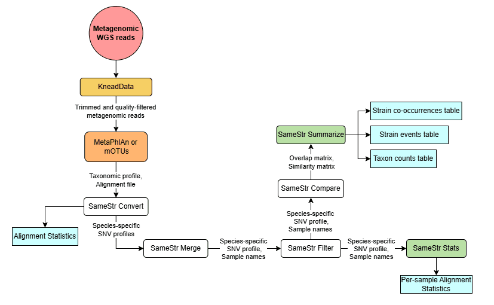
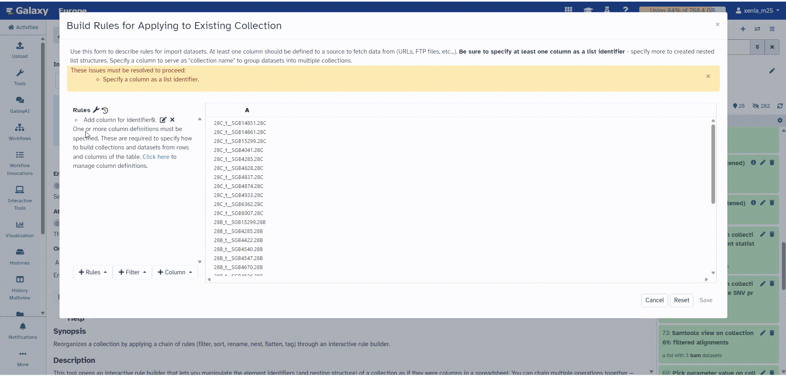
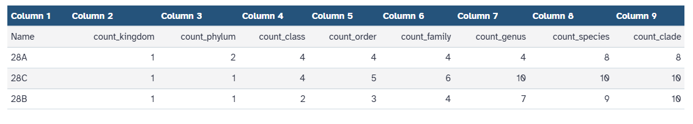
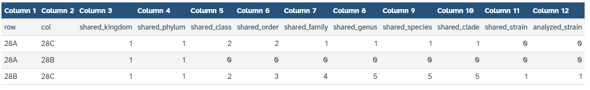
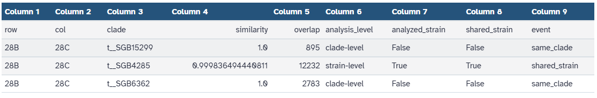

*Clostridioides difficile* is a pathogen found in the gut that can proliferate once antibiotics remove its competing bacteria, leading to recurrent *Clostridioides difficile* infection (rCDI) . Fecal microbiota transplantation (FMT) treats rCDI by restoring a donor's balanced gut microbiota in the patient . Since bacterial strains within the same species can behave differently, confirming that a bacterium detected in the patient after treatment is the same strain that came from the donor, rather than a different strain of the same species that was already present, requires strain-level resolution rather than species-level identification alone .

SameStr is a bioinformatic tool that detects shared microbial strains across metagenomic samples by comparing the genetic variation observed at species-specific marker genes. In FMT studies, this allows tracking of strain persistence and engraftment between donor, pre-FMT, and post-FMT samples .

> <details-title>Key terms used in this tutorial</details-title>
>
> - **rCDI**: recurrent *Clostridioides difficile* infection, caused by *C. difficile* spores that survive antibiotic treatment and later reactivate.
> - **FMT**: fecal microbiota transplantation, a treatment for rCDI that restores a donor's gut microbiota in the patient.
> - **Strain**: a classification within a bacterial species that exhibits distinct genotypic or phenotypic traits.
> - **Clade**: a group of organisms in a phylogenetic tree that share a common ancestor and all of its descendants.
> - **SGB (Species-level Genome Bin)**: a species-level cluster of genomes used by MetaPhlAn 4 to refer to a taxonomic species. SGBs are reported by their bin ID (e.g. `t__SGB4285`). The `t__` prefix indicates it is a species-level clade.
> - **Marker gene**: a short genomic sequence specific to a given clade, used by MetaPhlAn to detect that the clade is present in a sample.
> - **SNV profile**: the frequency of each nucleotide observed across the aligned reads at every covered position of a clade's marker genes in a sample, used by SameStr to compare samples.
> - **MVS (Maximum Variant Profile Similarity)**: Of all positions covered in both samples, the fraction at which the two samples share at least one nucleotide variant.
> - **Persistence**: a strain detected in a patient before FMT (pre-FMT) that is still detected in the same patient after treatment (post-FMT).
> - **Engraftment**: a strain from the donor that is detected in the patient's sample after FMT (post-FMT).
{: .details}


> <agenda-title></agenda-title>
>
> In this tutorial, we will cover:
>
> 1. TOC
> {:toc}
>
{: .agenda}

# SameStr workflow overview

This workflow uses metagenomic samples as input and runs the following sequence of tools to detect shared strains between them:

1. Reads are trimmed and quality-filtered with .
2. Reads are aligned to species-specific marker genes with , which also produces a taxonomic profile for each sample.
3. The alignments are converted into a species-specific SNV profile for each clade with the SameStr tools.
4. SNV profiles are merged across samples for each clade.
5. The Maximum Variant Profile Similarity (MVS) is calculated between samples for each clade.
6. Overlap and MVS thresholds are applied, and the results are reported in a table across all sample comparisons, indicating whether each clade is classified as a shared strain.



The following sections first go through each tool individually to explain what it does and how it contributes to the entire workflow, and then show how to run the whole thing in one step.


## Get data

The following steps use metagenomic shotgun sequencing data from FMT-treated rCDI patient stool samples, part of the FRICKE cohort . Three paired-end samples are used: a donor sample, a sample collected from the patient before treatment (pre-FMT), and a sample collected from the patient after treatment (post-FMT). The reads used in this tutorial have been reduced from the original dataset to minimize the time needed to complete the workflow.


> <hands-on-title> Data Upload </hands-on-title>
>
> 1. Create a new history for this tutorial and name it (e.g. "SameStr tutorial")
>
>    
>
> 2. Import the files from [Zenodo]({{ page.zenodo_link }}) or from
>    the shared data library (`GTN - Material` -> `{{ page.topic_name }}`
>     -> `{{ page.title }}`):
>
>    ```
>    https://zenodo.org/records/20745835/files/28A_R1.fastq.gz
>    https://zenodo.org/records/20745835/files/28A_R2.fastq.gz
>    https://zenodo.org/records/20745835/files/28B_R1.fastq.gz
>    https://zenodo.org/records/20745835/files/28B_R2.fastq.gz
>    https://zenodo.org/records/20745835/files/28C_R1.fastq.gz
>    https://zenodo.org/records/20745835/files/28C_R2.fastq.gz
>    ```
>
>    
>
>    
>
> 3. Rename the datasets to show the role of each sample in FMT:
>    - `28A_R1` / `28A_R2` → `Pre-FMT_R1` / `Pre-FMT_R2`
>    - `28B_R1` / `28B_R2` → `Donor_R1` / `Donor_R2`
>    - `28C_R1` / `28C_R2` → `Post-FMT_R1` / `Post-FMT_R2`
>
>    
>
>    > <warning-title> Non-optional Step </warning-title>
>    >
>    > The Apply Rules step later in this tutorial assumes these sample names contain no underscores. Skipping this rename, or keeping the original names, will make Apply Rules silently produce incorrect identifiers.
>    {: .warning}
>
> 4. Check that the datatype of each dataset is set to `fastqsanger.gz`
>
>    
>
> 5. Build a paired collection from the three samples. Each sample's forward and reverse reads will be grouped together
>
>    
>
>
{: .hands_on}

Want to just run the whole workflow in one step? [Jump to running the complete workflow](#running-samestr-as-a-complete-workflow).

# Shared strain analysis

This section goes through each tool used by SameStr individually, explaining what it does and why it is configured this way. Start with the data uploaded and the paired collection built in the *Get data* section. Once you've been through each tool, you can jump to the end to see how to run the whole thing in one step instead.

## Pre-processing of reads with **KneadData**

 trims reads based on quality parameters and performs host-read removal on the raw sequencing reads . This step is performed to reduce the impact of sequencing-quality errors on the shared strain analysis. KneadData has several tools internally, which can be seen as different sections in the tool.

- **Trimmomatic** performs quality-based trimming and removes adapters, short synthetic DNA sequences attached to each read during library preparation so it can bind to the sequencer. These are not part of the original biological sample, so they must be removed before alignment.
- **Tandem Repeat Finder (TRF)** removes repetitive DNA sequences, short sequences repeated consecutively along the genome that can otherwise align to multiple locations and introduce ambiguous mappings.
- **FastQC reports** can be enabled to obtain additional outputs of quality metrics for the sequencing reads.
- **Host removal** discards reads that map to the host genome, since raw metagenomic reads can contain both microbial and human DNA, and only the microbial DNA is relevant for the shared strain analysis.

TRF and FastQC are optional and are skipped in this tutorial, matching how KneadData was configured in the original SameStr publication .


> <hands-on-title> Trim and Remove Host Reads </hands-on-title>
>
> 1.  with the following parameters:
>    - *"Read type"*: `Paired reads`
>        - *"Save all unmatched reads"*: `Yes`
>        -  *"Paired reads collection"*: the paired collection created earlier
>    - In *"Alignment Tool"*:
>        - *"Select reference genome database"*: `hg19` (KneadData's bundled human reference)
>    - In *"Trimmomatic"*:
>        - *"Run Trimmomatic quality/adapter trimming"*: `Enable Trimmomatic trimming`
>            - *"Available sequencers"*: `NexteraPE`
>    - In *"Tandem Repeat Finder (TRF)"*:
>        - *"Specify if you want to include the TRF step in the workflow."*: `Skip TRF Step`
>
>    > <warning-title> Understanding KneadData's outputs </warning-title>
>    >
>    > KneadData runs quality and adapter trimming (Trimmomatic) and host-DNA removal (Bowtie2) as two sequential steps, and reports the result after each step. `Trimmed paired reads` and `Unmatched trimmed reads` are the intermediate result right after trimming only, before host-DNA removal. `Paired output reads` and `Unmatched reads` are the final result, after both trimming and host removal. If TRF is enabled, two further output collections are added, containing only the reads affected by repeat removal. These are useful for inspection but are not meant to be carried forward.
>    {: .warning}
>
> 2.  with the following parameters:
>    - In *"Input Collections"*:
>        -  *"Insert Input Collections"*
>            -  *"Input Collection"*: `Paired output reads` (output of **KneadData** )
>        -  *"Insert Input Collections"*
>            -  *"Input Collection"*: `Unmatched reads` (output of **KneadData** )
>    - In *"Advanced Options"*:
>        - *"How should conflicts (or potential conflicts) be handled?"*: `Keep first instance`
>
>    > <comment-title> Why merge these two collections? </comment-title>
>    >
>    > Of KneadData's output collections, `Paired output reads` and `Unmatched reads` are the final fully decontaminated reads. Merging both ensures that all of the surviving microbial sequence data is used in the strain-level analysis, since orphaned reads also carry valuable information.
>    {: .comment}
>
{: .hands_on}

> <question-title></question-title>
>
> 1. Why is `hg19`, a human reference genome, selected as the reference genome database for host removal?
>
> > <solution-title></solution-title>
> >
> > 1. Because the samples used are human stool, so the sequencing reads include human DNA alongside the microbial DNA. This human DNA must be removed before the strain analysis.
> >
> {: .solution}
>
{: .question}

The result of these two steps is a single collection containing one set of reads per sample: all the reads that passed KneadData's quality filtering and host decontamination, both paired and orphaned. The reads are now ready to be used for taxonomic profiling in the next step.


## Taxonomic profiling and marker-based alignment with **MetaPhlAn**

 performs both the taxonomic profiling and the marker-based alignment used by SameStr. It maps the pre-processed reads against a set of clade-specific markers derived from reference genomes . MetaPhlAn produces several outputs. The ones used in the subsequent workflow steps are the taxonomic profile, which lists the relative abundance of each clade detected in the sample, and the reads that aligned to the markers.

> <hands-on-title> Taxonomic profiling and Read Alignment </hands-on-title>
>
> 1.  with the following parameters:
>    - In *"Inputs"*:
>        - *"Input(s)"*: `Fasta/FastQ file(s) with microbiota reads`
>            - *"Fasta/FastQ file(s) with microbiota reads"*: `Paired-end collection`
>                -  *"Paired-end Fasta/FastQ file with microbiota reads"*: the paired collection produced by **Merge collections** 
>        - *"Database with clade-specific marker genes"*: `Locally cached`
>            - *"Cached database with clade-specific marker genes"*: `mpa_vJan25_CHOCOPhlAnSGB_202503-11062025`
>
>
> 2.  with the following parameters:
>    -  *"SAM/BAM/CRAM data set"*: `SAM file collection` (output of **MetaPhlAn** )
>    - *"What would you like to look at?"*: `All reads in the input dataset`
>        - *"What would you like to have reported?"*: `The actual reads`
>            - *"Output format"*: `BAM (-b)`
>    - *"Use a reference sequence"*: `No`
>
>    
>
>    > <comment-title> Why convert to BAM? </comment-title>
>    >
>    > MetaPhlAn outputs the aligned reads in SAM format, but SameStr Convert requires BAM input. Samtools performs this conversion.
>    {: .comment}
>
{: .hands_on}

> <details-title> How will taxonomic profiling be used in the workflow? </details-title>
>
> The taxonomic profile identifies which clades are present in each sample and at what relative abundance. SameStr can only compare strains for a clade if that clade is detected in more than one sample, so the taxonomic profile determines, for each pair of samples, which clades are even candidates for shared strain detection in the following steps.
>
{: .details}

## Strain-level analysis with **SameStr**

SameStr is not a single tool but a chain of command-line tools, each carrying out one step of the shared-strain detection process. The chain starts with the marker alignments, which are converted into per-clade SNV profiles. These profiles are then merged across samples and filtered to remove low-quality positions, before the samples are compared to identify shared strains between them. The following subsections go through each of these tools in the order they are run.


### SameStr Convert


 takes the aligned reads and the taxonomic profile from MetaPhlAn and produces one SNV profile per detected clade, describing the nucleotides observed at each covered position of that clade's marker genes.


> <hands-on-title> Generate Per-Clade SNV Profiles </hands-on-title>
>
> 1.  with the following parameters:
>    -  *"Aligned reads"*: `filtered alignments` collection produced by **Samtools view** 
>    -  *"Taxonomic profile"*: `Predicted taxon relative abundances` collection produced by **MetaPhlAn** 
>    - *"SameStr database"*: `MetaPhlAn clade-specific marker genes (mpa_vJan25_CHOCOPhlAnSGB_202503-11062025)`
>    - In *"Alignment Parameters"*:
>        - *"Percent identity"*: `0.9` (expressed as a fraction)
>        - *"Minimum alignment length"*: `40`
>        - *"Minimum base quality"*: `20`
>        - *"Minimum alignment quality"*: `0`
>        - *"Minimum vertical coverage"*: `3`
>
>    > <comment-title> What do these alignment parameters control? </comment-title>
>    >
>    > Each of these settings decides whether a given aligned read, or a given position within it, has enough quality to be counted in the SNV profile:
>    >
>    > - *"Percent identity"* is the minimum fraction of bases in a read that must match the reference marker sequence. Reads with more mismatches than this are discarded.
>    > - *"Minimum alignment length"* is the shortest amount of aligned base pairs a read can have and still be kept. Shorter alignments are considered too unreliable to use.
>    > - *"Minimum base quality"* is the lowest sequencing quality score a nucleotide call can have and still be counted. A score of 20 corresponds to a 99% probability that the base was called correctly.
>    > - *"Minimum alignment quality"* is the lowest mapping quality score a read can have and still be kept. Setting it to 0 means no read is excluded on this basis alone.
>    > - *"Minimum vertical coverage"* is the minimum number of reads that must cover a position for that position to be included in the SNV profile.
>    >
>    {: .comment}
>
>    > <details-title> How is the quality score calculated? </details-title>
>    >
>    > Sequencing quality scores follow the Phred scale, where the score Q relates to the probability P of an incorrect base call by Q = -10·log₁₀(P). For a quality score of 20, this gives P = 10⁻² = 0.01, a 1% chance of an incorrect call.
>    >
>    {: .details}
>
{: .hands_on}

Each run of SameStr Convert produces two outputs. The per-clade SNV profiles are compressed NumPy arrays (`.npz`) that have the nucleotide frequencies observed at every covered position of one clade's marker genes in this sample. The second output generated is the alignment statistics table. For each clade it reports the mean and median coverage, the number of covered positions, and the fraction of those positions that are monomorphic versus polymorphic (`f_mono`/`f_poly`).

> <question-title></question-title>
>
> 1. Open the alignment statistics table for one of your samples. Are the clades mostly monomorphic or polymorphic?
>
> > <solution-title></solution-title>
> >
> > 1. Mostly monomorphic: `f_mono` is close to `1.0` and `f_poly` close to `0.0` for most clades, meaning each clade is dominated by a single strain in this sample.
> >
> {: .solution}
>
{: .question}

> <hands-on-title> Flatten the SNV Profile Collection </hands-on-title>
>
> 1.  with the following parameters:
>    -  *"Input Collection"*: `per-clade SNV profiles` collection produced by **SameStr Convert** 
>    - *"Join collection identifiers using"*: `underscore (_)`
>
>    > <comment-title> Why flatten the collection? </comment-title>
>    >
>    > SameStr Convert organizes its output by sample, with each sample containing one npz file per detected clade. SameStr Merge instead needs a single flat list of npz files, since it groups them by clade internally based on their filenames. Flatten collection removes the per-sample nesting so all npz files can be passed to SameStr Merge together.
>    {: .comment}
>
{: .hands_on}


The  tool joins each identifier with an underscore, which adds the sample name as an extra prefix, producing `sample_clade.sample` (e.g. `Pre-FMT_t__SGB14809.Pre-FMT`). This breaks the `clade.sample` format that SameStr Merge expects, so the following step removes this prefix and restores the original identifiers. The step is added to the workflow as a workaround for Apply Rules' flat-list input requirement.


> <hands-on-title> Fix the Collection Identifiers </hands-on-title>
>
> 1.  with the following parameters:
>    -  *"Input Collection"*: the flattened SNV profile collection produced by **Flatten collection** 
>    - Under *"Rules"* click "* Edit*" to open the **Rule Builder**
>        1. Click *" Column"* -> *"Using a Regular Expression"*
>           - In *"From Column"*, choose `A` from the dropdown
>           - Select *"Create column from expression replacement"*
>           - Fill in *"Regular Expression"*: `^[^_]+_(.*)$`
>           - Fill in *"Replacement Expression"*: `\1`
>
>             
>
>           - Click *"Apply"*
>
>             
>
>        2. Click *" Rules"* -> *"Add/Modify Column Definitions"*
>           - Click *"List Identifier(s)"* and select `B`
>           - Click *"Apply"*
>        3. Click *"Save"*
>
>
{: .hands_on}

> <warning-title> Sample Names Must Not Contain Underscores </warning-title>
>
> The regex `^[^_]+_(.*)$` strips everything up to the first underscore, treating it as the sample-name prefix added by **Flatten collection**. This only works if sample names themselves contain no underscores. If your own sample names contain underscores, this step will strip too much, please avoid underscores in your naming, or adjust the regex accordingly.
{: .warning}


> <comment-title> Expected output </comment-title>
>
> If you are following this tutorial with the same parameters and datasets, you should have a single flat list of 28 npz datasets, combining all samples together.
>
{: .comment}

### SameStr Merge

 combines the per-sample SNV profiles for the same clade into a single multi-sample profile. For each clade, it produces one merged npz profile combining the data from every sample that contains it, along with a sample name file listing which samples are included.

> <hands-on-title> Merge SNV Profiles Across Samples </hands-on-title>
>
> 1.  with the following parameters:
>    -  *"Input SNV profiles"*: the SNV profile collection produced by **Apply rules** 
>    - *"SameStr database"*: `mpa_vJan25_CHOCOPhlAnSGB_202503-11062025`
>
>    
>
{: .hands_on}


> <question-title></question-title>
>
> 1. The input to SameStr Merge was a list of 28 npz datasets. After running SameStr Merge, this list decreased to 22 datasets. Why do we have fewer datasets than before?
>
> > <solution-title></solution-title>
> >
> > 1. SameStr Merge combines the per-sample profiles for the same clade into a single profile, so any clade detected in more than one sample is merged into one entry instead of being counted once per sample.
> >
> {: .solution}
>
{: .question}

### SameStr Filter

 removes clades, samples, and positions that do not meet a set of coverage and quality thresholds, before the profiles are used to detect shared strains.

> <hands-on-title> Filter the Merged SNV Profiles </hands-on-title>
>
> 1.  with the following parameters:
>    -  *"SNV profile to filter"*: `per-clade merged SNV profiles` collection produced by **SameStr Merge** 
>    -  *"Sample identifiers"*: `per-clade sample names` collection produced by **SameStr Merge** 
>    - *"SameStr database"*: `mpa_vJan25_CHOCOPhlAnSGB_202503-11062025`
>    - In *"Clade and marker settings"*:
>        - *"Minimum samples per clade"*: `2`
>        - *"Marker truncation length"*: `20`
>    - In *"Sample Variant Filtering"*:
>        - *"Minimum variant coverage (nucleotides)"*: `2`
>        - *"Minimum variant coverage (fraction)"*: `0.1`
>    - In *"Sample Position Filtering"*:
>        - *"Minimum position coverage (nucleotides)"*: `1`
>        - *"Position coverage standard deviation cutoff"*: `3.0`
>    - In *"Sample Filtering"*:
>        - *"Minimum horizontal coverage (nucleotides)"*: `5000`
>    - In *"Global Position Filtering"*:
>        - *"Minimum sample coverage per position (count)"*: `2`
>
>    > <comment-title> What do these filtering parameters control? </comment-title>
>    >
>    > - *"Minimum samples per clade"* discards clades detected in fewer samples than this.
>    > - *"Marker truncation length"* trims this many nucleotides from each end of every marker gene, removing edge regions where alignments tend to be less reliable.
>    > - *"Minimum variant coverage"* (nucleotides and fraction) sets the minimum read count and minimum proportion of reads that must support a nucleotide call for it to be counted as a real variant, rather than sequencing noise.
>    > - *"Minimum position coverage"* and the *"standard deviation cutoff"* remove positions with too few reads, or with coverage that is too high or too low than a sample's average.
>    > - *"Minimum horizontal coverage"* discards a clade from a sample if too few of its marker positions are covered overall.
>    > - *"Minimum sample coverage per position"* keeps a position in the final profile only if it is covered in at least this many samples.
>    >
>    {: .comment}
>
{: .hands_on}

The resulting collections contain some empty datasets. In order to use the collections in the subsequent steps, the empty datasets need to be eliminated from the collections.

> <hands-on-title> Remove Empty Datasets </hands-on-title>
>
> 1.  with the following parameters:
>    -  *"Input Collection"*: `filtered SNV profiles` produced by **SameStr Filter** 
>
> 2.  with the following parameters:
>    -  *"Input Collection"*: `per-clade retained sample names` produced by **SameStr Filter** 
>
{: .hands_on}


> <comment-title> Expected output </comment-title>
>
> If you are following this tutorial with the same parameters and datasets, you should now have 3 datasets in the filtered SNV profile collection, and 3 tabular datasets in the sample name collection.
>
{: .comment}


### SameStr Stats

 is a side branch of the workflow: its output is a final result and is not consumed by any later tool. It calculates statistics on the coverage and nucleotide diversity of the filtered SNV profiles.

> <hands-on-title> Compute Alignment Statistics </hands-on-title>
>
> 1.  with the following parameters:
>    -  *"Input SNV profiles"*: the SNV profile collection produced by **Filter empty datasets** 
>    -  *"Sample identifiers"*: the sample name collection produced by **Filter empty datasets** 
>    - *"SameStr database"*: `mpa_vJan25_CHOCOPhlAnSGB_202503-11062025`
>
{: .hands_on}


> <details-title> What can you learn from these statistics? </details-title>
>
> Two columns are especially useful for a first look at the results. *f_covered* shows what fraction of the clade's marker positions were actually covered in a given sample, which reflects how much of that clade was captured by sequencing. *f_mono* and *f_poly* show whether the covered positions are dominated by a single nucleotide (monomorphic) or contain multiple nucleotides (polymorphic). A high f_mono value suggests the sample is colonized by a single dominant strain for that clade, while a higher f_poly value would point to multiple co-existing strains.
{: .details}

> <question-title></question-title>
>
> 1. Looking at your SameStr Stats output, for each clade, are the covered positions monomorphic or polymorphic? How can you tell?
>
> > <solution-title></solution-title>
> >
> > 1. Monomorphic. For every clade and every sample, `f_mono` is `1.0` and `f_poly` is `0.0`, meaning all covered positions are dominated by a single nucleotide, with no positions showing multiple co-occurring variants.
> >
> {: .solution}
>
{: .question}


### SameStr Compare

 calculates pairwise similarity between samples for each clade, using the filtered SNV profiles to determine whether samples share the same strain. SameStr Compare generates 3 output matrices for each clade: an overlap matrix giving the number of shared covered positions between each pair of samples, a fraction matrix giving the Maximum Variant Profile Similarity (MVS) between each pair, and a closest matrix identifying each sample's most similar match.

> <hands-on-title> Compare Samples for Each Clade </hands-on-title>
>
> 1.  with the following parameters:
>    -  *"Input SNV profiles"*: the SNV profile collection produced by **Filter empty datasets** 
>    -  *"Sample identifiers"*: the sample name collection produced by **Filter empty datasets** 
>    - *"SameStr database"*: `mpa_vJan25_CHOCOPhlAnSGB_202503-11062025`
>
{: .hands_on}


> <details-title> Variant comparison settings </details-title>
>
> This step is run with the default setting, which uses all variants without distinguishing between minority and dominant alleles. Two other options exist: using only dominant variants at each position, or using all variants while also reporting a separate set of metrics based on dominant variants alone. A further option, disabled by default, additionally generates FASTA alignments of the dominant variants for each clade as an extra output.
>
{: .details}


### SameStr Summarize

 is the last tool in the workflow, which produces the shared-strain results. It combines the overlap and similarity matrices from SameStr Compare with the taxonomic profiles from MetaPhlAn, and generates three summary tables: a taxon count table listing the clades detected per sample, a co-occurrence table showing which clades are shared between sample pairs, and a strain events table reporting, for each shared clade, whether the two samples count as sharing the same strain.


> <hands-on-title> Generate the Shared Strain Summary </hands-on-title>
>
> 1.  with the following parameters:
>    - *"SameStr database"*: `mpa_vJan25_CHOCOPhlAnSGB_202503-11062025`
>    -  *"Overlap metrics (collection output of SameStr compare)"*: `Coverage overlap` collection produced by **SameStr Compare** 
>    -  *"Fractional similarities (collection output of SameStr compare)"*: `Similarity fraction` collection produced by **SameStr Compare** 
>    -  *"Taxonomic profiles"*: `Predicted taxon relative abundances` collection produced by **MetaPhlAn** 
>    - In *"Summary threshold arguments"*:
>        - *"Minimum overlap for comparison"*: `5000`
>        - *"Minimum similarity for shared strains"*: `0.999`
>
>    > <comment-title> What do these two thresholds control? </comment-title>
>    >
>    > These are the two values that decide whether a clade counts as a shared strain between two samples or not.
>    >
>    > - *"Minimum overlap for comparison"* (5000) requires at least this many shared covered positions between two samples before their similarity is even considered, so the comparison isn't based on too little data to be reliable.
>    > - *"Minimum similarity for shared strains"* (0.999) is the MVS threshold a sample pair must have to be classified as sharing a strain.
>    >
>    {: .comment}
>
{: .hands_on}


## Interpreting the results from SameStr Summarize

### Taxon counts table

This table shows how many different taxa were detected in each sample at every taxonomic level, from kingdom down to clade. It gives a quick way to compare the overall taxonomic groups found in each sample before looking at any shared-strain results. Open the `Taxon counts` dataset in your own history to see your results. The image below shows an example.




### Co-occurrence table

This table is the fastest way to check whether clades are shared at all between samples. *shared_species* and *shared_clade* count how many taxa were detected in both samples, regardless of whether they turned out to be the same strain, while *shared_strain* counts only those clades confirmed as the same strain by SameStr Compare. The gap between *shared_clade* and *shared_strain* tells you how many shared taxa were only confirmed at the species/clade level instead of being detected as strains. Open the `Strain co-occurrences` dataset in your own history to see your results. The image below shows an example.




> <question-title></question-title>
>
> 1. Why is it less likely that Pre-FMT and Donor share the same strain, compared to the other two pairs?
> 2. Can you tell from this table whether any strain persisted in the patient? How would you tell?
>
> > <solution-title></solution-title>
> >
> > 1. The Pre-FMT sample reflects the patient's gut microbiome before treatment, while the Donor reflects a healthy and unrelated microbiome. These two have no direct biological relationship, so any shared strain between them would be coincidental.
> > 2. Yes. The Pre-FMT/Post-FMT row shows `shared_strain = 0`, so no clade was confirmed as the same strain between those samples, this data shows no evidence of persistence.
> >
> {: .solution}
>
{: .question}

### Strain events table

This table shows the exact clades analyzed between each pair of samples, which is what the co-occurrence table's totals are built from. Each clade is given one of three events:

- *shared_strain*: when both the overlap and similarity thresholds are met
- *other_strain*: when the overlap threshold is met but similarity falls below 0.999
- *same_clade*: when the overlap threshold itself is not met, so the comparison never reaches strain-level resolution

Open the `Strain events` dataset in your own history to see your results and compare them to the image below.



> <question-title></question-title>
>
> 1. In your results, find a clade with a similarity of `1.0`, a perfect match, that is still not labeled `shared_strain`. Why not?
>
> > <solution-title></solution-title>
> >
> > 1. Its overlap is below the minimum overlap threshold of 5000, so the comparison could only be resolved at clade level, not strain level. That means we can confirm the same clade was found in both samples, but not whether it's the same strain.
> >
> {: .solution}
>
{: .question}


Open your `Strain events` results and find the one clade classified as `shared_strain`. This is the shared strain between the Donor and Post-FMT samples, meaning it successfully engrafted.


# Running SameStr as a complete workflow

Now that you have run through each step individually, this section shows how to repeat the same analysis in a single step using the published workflow.

> <hands-on-title> Run SameStr </hands-on-title>
>
> 1. Run the **SameStr**  workflow using the parameter values described in the previous section, tool by tool
>    -  *"Raw Reads"*: the paired collection built in the *Get data* step
>    - *"Select MetaPhlAn Database"*: `MetaPhlAn clade-specific marker genes (mpa_vJan25_CHOCOPhlAnSGB_202503-11062025)`
>    - *"Select SameStr database"*: `MetaPhlAn clade-specific marker genes (mpa_vJan25_CHOCOPhlAnSGB_202503-11062025)`
>
>    
>
>    > <details-title> Why these parameter values? </details-title>
>    >
>    > These values include some of the parameters mentioned in the original SameStr publication . For parameters not specified there, the tool's default values are used instead. A few important parameters are:
>    >
>    > - *"Select SameStr database"* must always match the profiler selected in *"Select MetaPhlAn Database"*. Mixing databases from different profilers will cause errors.
>    > - *"Minimum overlap for comparison"* (5000) and *"Minimum similarity for shared strains"* (0.999) are the two thresholds that ultimately decide whether a clade is classified as a shared strain.
>    >
>    > The remaining alignment and filtering parameters are explained individually, tool by tool, in the previous section.
>    {: .details}
>
>
>    > <warning-title> Changing Parameters </warning-title>
>    >
>    > The tutorial dataset was reduced to the minimum size that still produces results with the parameter values listed above. Changing these parameters may therefore cause the workflow to produce no output. To experiment with different parameter values, download the complete samples from the [ENA under accession PRJEB39023](https://www.ebi.ac.uk/ena/browser/view/PRJEB39023) and repeat the Data Upload step with the full dataset.
>    {: .warning}
>
{: .hands_on}


# Conclusion

This tutorial showed how to detect shared microbial strains between metagenomic samples using SameStr, both as a complete workflow and as individual tools:

- Trimming and host-read removal with 
- Taxonomic profiling and marker-based alignment with 
- Strain-level SNV profiling, filtering, and comparison with the SameStr tools

Applying this to the FMT-treated rCDI dataset used here, SameStr found one shared strain between the Donor and Post-FMT samples, indicating that this strain successfully engrafted.
