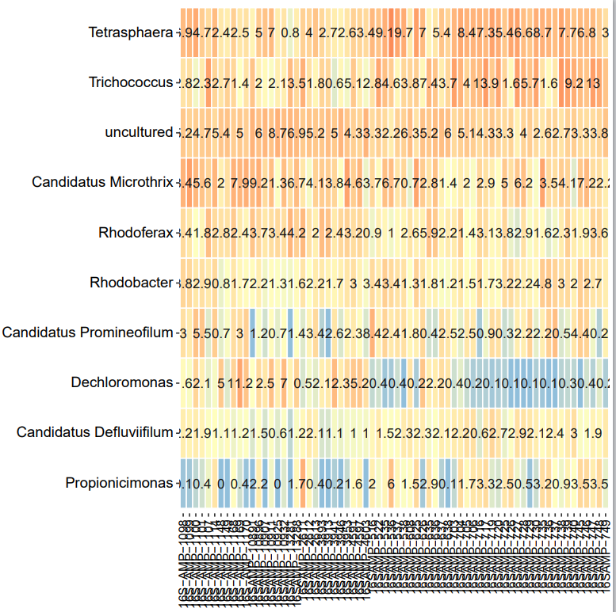
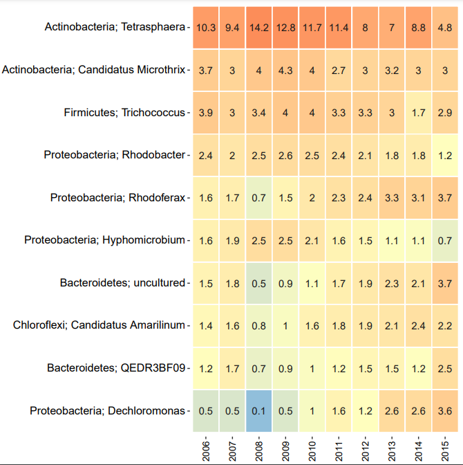
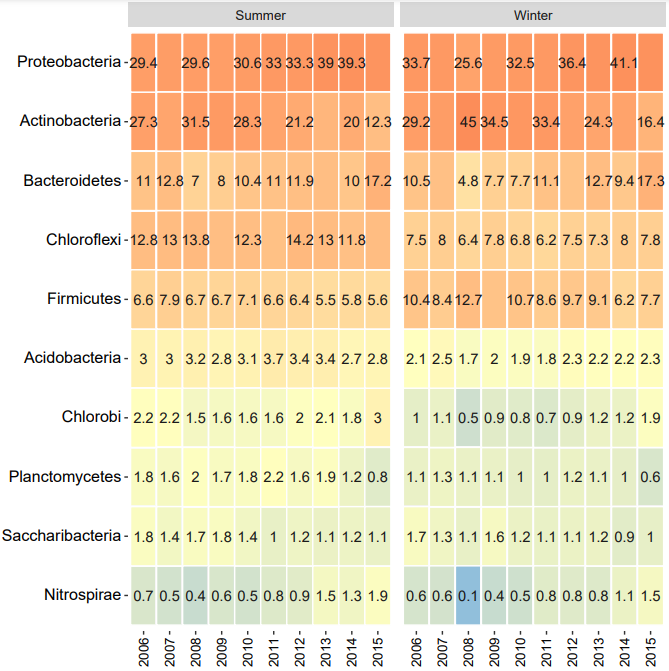

Microbiome analysis using amplicon sequencing is central to many ecological studies.
The produced amplicon sequencing data are converted to OTU tables and represent the input 
for the ampvis2 tool, where it can be visualised in various ways .
If you already have amplicon data produced and ready to feed in and visualise it, 
then you can start with this tutorial. First of all you can put your data into a 
rarefraction curve to explore species richness. Than you can input your
data into subsets and finaly create a heatmap, or a boxplot, or an ordination plot
or even a timeseries plot out of it. Most of them are described in 
[Introduction to ampvis2](https://kasperskytte.github.io/ampvis2/articles/ampvis2.html#heatmap).
")
Your data need to be in an acceptable format for the ampvis_load tool. The tool 
needs an OTU table and accepts the following formats for it: _phyloseq_, _biom_, 
_dada2_sequencetable_ or _tabular_. OTU table is the only mandatory input into the 
ampvis_load. But you can also input _'sample_metadata'_ (in the formats: _tabular_ or _tsv_), 
_'taxonomy_table'_ (in the _tabular_ format), _'fasta_file'_ (in the format _fasta_)
and _'phylogenetic_tree'_ (in the format _newick_) and various combinations thereof.

For this tutorial we choosed to demonstrate all visualisation tools with the combination 
of 3 inputs:
OTU table, 'sample metadata' and 'taxonomy table', all of them in _tabular_ format.


> <agenda-title></agenda-title>
>
> In this tutorial, we will cover:
>
> 1. TOC
> {:toc}
>
{: .agenda}

# Rarefaction curve

Like first exploration of your data, you can start with rarefaction curve.
Rarefaction curves are the smoothen version of accumulation curves and symbolise 
the means of all pooled samples and therefore display the measured species richness. 
Rarefaction delivers proper curves for dataset comparison .
> <comment-title>Note: </comment-title>
> - for this part we need 'row' data, it shall not be normalised
> - for this section we used a different dataset than for the rest of the tutorial
{: .comment}

## Get data
If you don't use your own dataset, you can also go to **Zenodo** and find a dataset to download.
We looked for a dataset marked "open" and used the following:
[Environmental DNA metabarcoding data from Marina di Camerota coast (Italy) based on citizen science sampling](https://zenodo.org/records/10362755)
there are 2 datasets **"V4-18S"** and **"COI"** of which we took the one named **"COI"**.


## create a rarefaction curve
You can find the workflow "ampvis2 rarefaction v1.0 " on Galaxy and use it for the tutorial.

We pre-selected the "step size", "colour curves by" and set __"free__ __scale"__ for "scales of the facets".

> <comment-title></comment-title>
> - first you need to upload the freshly generated dataset to Galaxy
> - the steps from heatmap hands-on box (next section) might be helpful
{: .comment}

> <details-title> How it will look like </details-title>
>
> Result of the rarefaction curve.
> 
>
{: .details}

> <question-title></question-title>
> 
> 1. If you run the workflow "ampvis2 rarefaction v1.1 (with subset)" on Galaxy and use the following metadata for the subset: metadata variable = sample_id and metadata values = (select all possible samples).
	What is the difference to the rarefaction curve you generated with the workflow without subsets? 
> 2. If you consider the output of the rarefaction curve before, one sample has a high curve and the rest is close to each other.
	Can you make the rest more "visible"?
>
> > <solution-title></solution-title>
> >
> > 1. none, it's the same output 
> > 2. yes, if you run the workflow (with subsets) and select all samples except of __"COI-B2b"__
> >
> > > <details-title> How it will look like </details-title>
> > > 
> > >  Result of this boxplot.
> > > 
> > >  
> > > 
> > {: .details}
>
> {: .solution}
>
{: .question}


# Use case 1: heatmap, ordination plot or boxploot

To create a heatmap, or ordination plot, or boxplot you can continue with your dataset.

> <comment-title>Note: </comment-title>
> - we now use normalised data and a different dataset than for rarefaction curve (as it has more metadata)
{: .comment}

## Get data

> <hands-on-title> Data Upload </hands-on-title>
>
> 1. Create a new history for this tutorial
> 2. Import the files from [Zenodo]({{ page.zenodo_link }}) or from
>    the shared data library (`GTN - Material` -> `{{ page.topic_name }}`
>     -> `{{ page.title }}`):
>
>    ```
>    https://zenodo.org/api/records/11281381/files/Galaxy11-[MiDAS_otushort_table.tsv].mothur.axes/content
>    https://zenodo.org/api/records/11281381/files/Galaxy1-[MiDAS_metadata.tsv].tabular/content
>    https://zenodo.org/api/records/11281381/files/Galaxy3-[MiDAS_taxtable.tsv].tabular/content
>    ```
>
>    
>
>    
>
> 3. Rename the datasets
> 4. Check that the datatype is in the right format
>
>    
>
> 5. Add to each database a tag corresponding to ...
>
>    
>
> 6. When you have your history created and ready on the right side. You click on "workflow" above.
>	 Choose the needed workflow by clicking on the blue play button in its box(if you hover over it, 
>	 it says: Run workflow).
>
> 7. The workflow will ask you to input mandarory parameter. After done so, click the blue button above
>	 "Run Workflow".
>    See on the next picture how it looks like.
>
{: .hands_on}


## heatmaps
We now can use our data, put them in subsets and create ungrouped, or grouped output or
even grouped with facets. 
The subsets are based on variable we set and available in the metadata .
> <comment-title>Note: </comment-title>
> - in the next sections, we give you prepared workflows on Galaxy and the set of parameters to choose
for running the indicated workflow
> - some parameters are pre-chosen for you e.g. taxonomic level to 
aggregate the OTUs
{: .comment}

### heatmap (ungrouped)
You can find the workflow "ampvis2 heatmap v3.0 (no group)" on Galaxy and use it for the tutorial.
Metadata we used for this subset: metadata variable = Plant and metadata values = Aalborg East & Aalborg West.

Choose the metadata variable as Plant and metadata values as Aalborg East & Aalborg West.
In the next box you can see the resulting heatmap.

> <details-title> How it will look like </details-title>
>
> Result of the heatmap created with ungrouped data.
> 
>
{: .details}

> <details-title> metadata values error while running workflow </details-title>
>
> If a set in history gets red, symbolising an error, click on the set to expand.
> If it says: "parameter 'vals': an invalid option", then click on the button "Run
> job again". The box is highlighted blue, you just select the values again in the drop down
> menue and click the "Run Tool" above.
>
> Also note, the heatmap generation is paused. When all sets in history except heapmap becomes
> green, expand the heapmap set and click on "Run job again". You might have to choose the metadata
> list again. Make sure you choose the freshly generated one. Once more "Run Tool" above.
> 
{: .details}

### heatmap (grouped)
You can find the workflow "ampvis2 heatmap v2.0 (only group)" on Galaxy and use it for the tutorial.
We used 2 different metadata subsets:
- 1) metadata we used for this subset: metadata variable = Plant and metadata values = Aalborg East & Aalborg West 
   plus grouped by = Plant
- 2) metadata we used for this subset: metadata variable = Period and metadata values = Winter & Summer 
   plus grouped by = Year

> <hands-on-title> Run a workflow </hands-on-title>
>
> 1. Create a new history (you can use the previous, but if you make a lot of runs, it could
>  	 happen that you don't find your favourite heatmap anymore)
>  
> 2. Use the same data and rename if you wish following the hands-on sections above
>
> 3. Choose the needed workflow 
>
> 4. Choose the mandarory parameters and click the button "Run Workflow".
>    See on the next pictures how it looks like.
>
{: .hands_on}

> <details-title> How it will look like </details-title>
>
> Result of the first metadata subset heatmap created with grouped by Plant data.
> 
>
> 
> Result of the second metadata subset heatmap created with grouped by Year data.
> 
>
{: .details}

> <question-title></question-title>
>
> 1. Can you create a heatmap, which shows only the first and the last year of data collection?
> 2. Can you use the following settings to create a nice heatmap: metadata variable = Year and 
	metadata value = Date plus grouped by = Year?
>
> > <solution-title></solution-title>
> >
> > 1. yes, with the following settings: metadata variable = Year and 
   metadata values = 2006 & 2015 plus grouped by = Year
> > 2. no, metadata values must be from the set of metadata variable
> >
> {: .solution}
>
{: .question}

### heatmap (grouped with facets)
You can find the workflow "ampvis2 heatmap v1.0 (group+facet)" on Galaxy and use it for the tutorial.
We used 2 different metadata subsets:
- 1) metadata we used for this subset: metadata variable = Plant and metadata values = Aalborg East & Aalborg West 
   plus grouped by = Plant and facet by Period 
- 2) metadata we used for this subset: metadata variable = Period and metadata values = Winter & Summer 
   plus grouped by = Year and facet by Period 
   

> <hands-on-title> Run a workflow </hands-on-title>
>
> 1. Create a new history (if you wish)
>  
> 2. Use the same data and rename if you wish following the hands-on sections above
>
> 3. Choose the needed workflow 
>
> 4. Choose the mandarory parameters and click the button "Run Workflow".
>    See on the next pictures how it looks like.
>
{: .hands_on}

> <details-title> How it will look like </details-title>
>
> Result of the first metadata subset heatmap created with grouped by Plant data and facet by Period.
> 
>
> 
> Result of the second metadata subset heatmap created with grouped by Year data.
> 
>
> 
{: .details}

## ordination plots
We now can use our data, put them in subsets and create different plots by using different ordination methods. 
Like with heatmaps, the subsets are based on variable we set and available in the metadata .

> <comment-title> Note: </comment-title>
> - in the next sections, we give you prepared workflows on Galaxy and the set of parameters to choose
for running the indicated workflow
> - some parameters are pre-chosen for you e.g. ordination method, 
transformation (if used) and others like to colour and label the points or frames
{: .comment}

### ordination method: PCA
You can find the workflow "ampvis2 ordination plot v1.0 (pca)" on Galaxy and use it for the tutorial.
Metadata we used for this subset: metadata variable = Plant and metadata values = Aalborg East & Aalborg West.

> <comment-title></comment-title>
> - use the same data set as for heatmaps
> - the steps from heatmap hands-on boxes remain the same
{: .comment}

> <details-title> How it will look like </details-title>
>
> Result of the ordination plot created with the method PCA.
> 
>
{: .details}

### ordination method: PCA plus trajectory: _date_
You can find the workflow "ampvis2 ordination plot v1.1 (pca+trajectory_date)" on Galaxy and use it for the tutorial.
Metadata we used for this subset: metadata variable = Plant and metadata values = Aalborg East & Aalborg West.

> <comment-title></comment-title>
> - use the same data set as for heatmaps
> - the steps from heatmap hands-on boxes remain the same
{: .comment}

> <details-title> How it will look like </details-title>
>
> Result of the ordination plot created with the method PCA plus using the trajectory date.
> 
>
{: .details}

> <question-title></question-title>
>
> 1. Does it make sense to run the following settings: metadata variable = Period and metadata values = Winter & Summer?
>
> > <solution-title></solution-title>
> >
> > 1. no, you will get a very messy bundle of colours.
> >
> {: .solution}
>
{: .question}

### ordination method: CCA
You can find the workflow "ampvis2 ordination plot v1.2 (cca transform_hellinger)" on Galaxy and use it for the tutorial.
Metadata we used for this subset: metadata variable = Plant and metadata values = Aalborg East & Aalborg West.

> <comment-title></comment-title>
> - use the same data set as for heatmaps
> - the steps from heatmap hands-on boxes remain the same
{: .comment}

> <details-title> How it will look like </details-title>
>
> Result of the ordination plot created with the method CCA and the Hellinger transformation.
> 
>
{: .details}

> <question-title></question-title>
>
> 2. If you take the CCA ordination method with the following settings: metadata variable = Period and metadata values = Winter & Summer.
	What do you need to remove from pre-chosen parameters so the ordination plot stays "readable"?
>
> > <solution-title></solution-title>
> >
> > 2. when you expand the ordination plot set in your history, you see colour, shape, frame, and label by options. Select colour by _Period_ 
and frame by _Periaod_ and deselect the other mentioned options above, so they read _"Nothing_ _selected"_ .
> >
> {: .solution}
>
{: .question}

## boxplot
We now can use our data, put them in subsets and create a boxplot. 
Like with heatmaps, the subsets are based on variable we set and available in the metadata .
> <comment-title> Note: </comment-title>
> - in the prepared workflow on Galaxy, we provide in this tutorial, some parameters are pre-chosen for you 
e.g. number of taxa to show
> - The samples are grouped by _Period_
{: .comment}

Metadata we used for this subset: metadata variable = Plant and metadata values = Aalborg East & Aalborg West.

> <comment-title></comment-title>
> - use the same data set as for heatmaps
> - the steps from heatmap hands-on boxes remain the same
{: .comment}

> <details-title> How it will look like </details-title>
>
> Result of the boxplot grouped by Period.
> 
>
{: .details}

> <tip-title>create a different boxplot</tip-title>
>
> * use the same data set
> * set metadata variable = Period and metadata values = Summer & Winter
>
> > <details-title> How it will look like </details-title>
> >
> > Result of this boxplot.
> >
> > 
> >
> {: .details}
>
{: .tip}

> <question-title></question-title>
>
> 1. Can you create an output where only odd years are considered?
> 2. Do you need to change any pre-chosen parameter for question 1?
>
> > <solution-title></solution-title>
> >
> > 1. yes, if you set metadata variable = Year and metadata values = 2007, 2009, 2011, 2013, 2015 
> > 2. yes, set "group the sample" to _Year_
> >
> {: .solution}
>
{: .question}

# Use case 2: time series plot

Time series analysis is mainly known for forecasting. A time series can be seen as 
an example of a random or stochastic process, which we can use to visualise seasonal 
differences . 

In our dataset, and with the settings listed below, we can observe the 
temporal evolution of the 3 most common microorganisms in the plants Aalborg East and Aalborg West 
over the entire period data was collected.

## create a time series plot
You can find the workflow "ampvis2 timeseries v1.0" on Galaxy and use it for the tutorial.
Metadata we used for this subset: metadata variable = Plant and metadata values = Aalborg East & Aalborg West.
Time variable is mandatory here, as **_Date_** is the only valid time variable we can select, we already pre-selected
it. And as Number of taxa to show becomes a bit messy (for this data set at least) we choose the number of 3. 

> <comment-title></comment-title>
> - use the same data set as for heatmaps
> - the steps from heatmap hands-on boxes remain the same
{: .comment}

> <details-title> How it will look like </details-title>
>
> Result of the time series plot.
> 
>
{: .details}

> <question-title></question-title>
>
> 1. If you run the following settings: metadata variable = Period and metadata values = Winter & Summer. 
	Do you need to change the time variable in the pre-chosen parameters?
> 2. Can you separate the 3 curves from the main section settings into curves of periods coresponding to the shown Phylum?
>
> > <solution-title></solution-title>
> >
> > 1. no, _Date_ is still the only possible option 
> > 2. yes, if expand the time series set in the history and run it again with "group the sample by" _Period_
> >
> {: .solution}
>
{: .question}


<!-- edited until here. -->


{: .hands_on}

# Title of the section usually corresponding to a big step in the analysis

It comes first a description of the step: some background and some theory.
Some image can be added there to support the theory explanation:


The idea is to keep the theory description before quite simple to focus more on the practical part.

***TODO***: *Consider adding a detail box to expand the theory*

> <details-title> More details about the theory </details-title>
>
> But to describe more details, it is possible to use the detail boxes which are expandable
>
{: .details}

A big step can have several subsections or sub steps:


## Sub-step with **ampvis2 load**

> <hands-on-title> Task description </hands-on-title>
>
> 1.  with the following parameters:
>    -  *"OTU table"*: `output` (Input dataset)
>    -  *"Sample metadata"*: `output` (Input dataset)
>    -  *"Taxonomy table"*: `output` (Input dataset)
>
>    ***TODO***: *Check parameter descriptions*
>
>    ***TODO***: *Consider adding a comment or tip box*
>
>    > <comment-title> short description </comment-title>
>    >
>    > A comment about the tool or something else. This box can also be in the main text
>    {: .comment}
>
{: .hands_on}

***TODO***: *Consider adding a question to test the learners understanding of the previous exercise*

> <question-title></question-title>
>
> 1. Question1?
> 2. Question2?
>
> > <solution-title></solution-title>
> >
> > 1. Answer for question1
> > 2. Answer for question2
> >
> {: .solution}
>
{: .question}

## Sub-step with **ampvis2 subset samples**

> <hands-on-title> Task description </hands-on-title>
>
> 1.  with the following parameters:
>    -  *"Ampvis2 RDS dataset"*: `ampvis` (output of **ampvis2 load** )
>    -  *"Metadata list"*: `metadata_list_out` (output of **ampvis2 load** )
>    - *"Metadata variable"*: ``
>    - *"Metadata value(s)"*: ``
>
>    ***TODO***: *Check parameter descriptions*
>
>    ***TODO***: *Consider adding a comment or tip box*
>
>    > <comment-title> short description </comment-title>
>    >
>    > A comment about the tool or something else. This box can also be in the main text
>    {: .comment}
>
{: .hands_on}

***TODO***: *Consider adding a question to test the learners understanding of the previous exercise*

> <question-title></question-title>
>
> 1. Question1?
> 2. Question2?
>
> > <solution-title></solution-title>
> >
> > 1. Answer for question1
> > 2. Answer for question2
> >
> {: .solution}
>
{: .question}

## Sub-step with **ampvis2 heatmap**

> <hands-on-title> Task description </hands-on-title>
>
> 1.  with the following parameters:
>    -  *"Ampvis2 RDS dataset"*: `ampvis` (output of **ampvis2 subset samples** )
>    -  *"Metadata list"*: `metadata_list_out` (output of **ampvis2 subset samples** )
>    - *"Group samples"*: ``
>    - *"Facet the samples"*: ``
>    - *"The taxonomic level to aggregate the OTUs"*: `Species`
>    - *"Additional taxonomic level(s) to display"*: ``
>    - *"Limit the number of shown taxa"*: `Select a number of taxa to show`
>    - *"Plot the values on the heatmap"*: `Yes`
>    - *"Sort heatmap by most abundant taxa"*: `No`
>    - *"Show functional information about the Genus-level OTUs"*: `No`
>
>    ***TODO***: *Check parameter descriptions*
>
>    ***TODO***: *Consider adding a comment or tip box*
>
>    > <comment-title> short description </comment-title>
>    >
>    > A comment about the tool or something else. This box can also be in the main text
>    {: .comment}
>
{: .hands_on}

***TODO***: *Consider adding a question to test the learners understanding of the previous exercise*

> <question-title></question-title>
>
> 1. Question1?
> 2. Question2?
>
> > <solution-title></solution-title>
> >
> > 1. Answer for question1
> > 2. Answer for question2
> >
> {: .solution}
>
{: .question}


## Re-arrange

To create the template, each step of the workflow had its own subsection.

***TODO***: *Re-arrange the generated subsections into sections or other subsections.
Consider merging some hands-on boxes to have a meaningful flow of the analyses*

# Conclusion

Sum up the tutorial and the key takeaways here. We encourage adding an overview image of the
pipeline used.