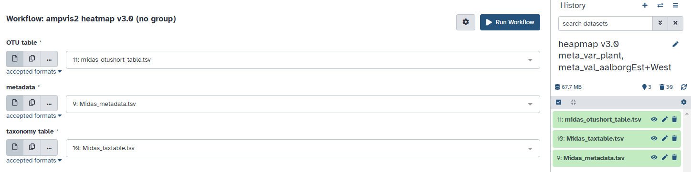

Microbiome analysis using amplicon sequencing is central to many ecological studies .
This method is crucial for identifying microorganisms within an ecosystem or engineered system, as understanding which 
microorganisms are present is key to comprehending the communities and their functions. After sequencing, the amplicons 
can be processed as exact amplicon sequence variants (ASVs) or clustered into operational taxonomic units (OTUs) based on 
sequence identity .

Visualising amplicon data is essential for interpreting the complex relationships within microbial communities. It allows 
researchers to explore patterns of diversity, abundance, and ecological interactions. Various tools can be used for this purpose, 
such as FISH-based visualisation (fluorescence in situ hybridisation), Usearch for mapping sequences, or R for analysis and 
visualisation with packages like ggplot2. Among these tools, ampvis2 stands out for its ability to handle large datasets and 
provide a range of visualisation options tailored to microbial ecology, making it a wide-ranging choice for many researchers .

If you already have amplicon data and your OTU table created, you are ready to visualise it. You can start with this tutorial
using your own data or download the data we used, thus follow this tutorial step-by-step. 

These OTU tables can be generated using various tools on Galaxy: 
> <tip-title> Generate OTU or ASV table with one of this tools</tip-title>
>
> 1. Use one of this mothur tools: {% tool [Cluster](toolshed.g2.bx.psu.edu%2Frepos%2Fiuc%2Fmothur_cluster%2Fmothur_cluster%2F1.39.5.0) %} or {% tool [Hcluster](toolshed.g2.bx.psu.edu%2Frepos%2Fiuc%2Fmothur_hcluster%2Fmothur_hcluster%2F1.36.1.0&version=latest) %}
>
> 2.  
>
> 3. {% tool [qiime2 fragment-insertion classify-otus-experimental](toolshed.g2.bx.psu.edu%2Frepos%2Fq2d2%2Fqiime2__fragment_insertion__classify_otus_experimental%2Fqiime2__fragment_insertion__classify_otus_experimental%2F2024.5.0%2Bq2galaxy.2024.5.0&version=latest) %} 
>
>    > <comment-title></comment-title>
>    > Alternatively, you can generate an ASV table, which functions similarly to an OTU table and is also accepted in ampvis_load.
>    >  
>    > ASVs, with their higher phylogenetic resolution, are often preferred over OTUs because they provide sub-genus and sub-species 
		classification. However, without taxonomic assignment, ASVs are difficult to compare with other studies. Additionally, 
		linking microbial identity to functions using ASVs may not yield sufficient results. .
>    {: .comment}
>
> 4. {% tool [dada2: makeSequenceTable](toolshed.g2.bx.psu.edu%2Frepos%2Fiuc%2Fdada2_makesequencetable%2Fdada2_makeSequenceTable%2F1.30.0%2Bgalaxy0&version=latest) %} 
>
>    > <comment-title></comment-title>
>    > The Galaxy Training Network provides nice tutorials on this topic, such as [Building an amplicon sequence variant (ASV) table from 16S data using DADA2](https://training.galaxyproject.org/training-material/topics/microbiome/tutorials/dada-16S/tutorial.html)   
>    {: .comment}
>
> 5. Additionally, you can consider using outputs from tools like [Kraken2](https://training.galaxyproject.org/training-material/topics/microbiome/tutorials/dada-16S/tutorial.html) 
	and [MetaPhlAn](https://training.galaxyproject.org/training-material/topics/microbiome/tutorials/taxonomic-profiling/tutorial.html) 
	for further microbial analysis, as they can also contribute valuable data that might complement or be used in conjunction with OTU tables. 
>
{: .tip}

# Plotting options with ampvis2
First of all you can put your data into a 
rarefaction curve to explore species richness. Then you can input your
data into subsets and finally create a heatmap, a boxplot, an ordination plot
or even a timeseries plot. Most of these visualisation methods are described in 
[Introduction to ampvis2](https://kasperskytte.github.io/ampvis2/articles/ampvis2.html#heatmap).
")

Your data need to be in an acceptable format for the ampvis_load tool. The tool 
requires an OTU table and accepts the following formats:
- _phyloseq_ 
- _biom_ 
- _dada2_sequencetable_ 
- _tabular_ 

The OTU table is the only mandatory input for ampvis_load, but you can also input: 
- _sample_metadata_ (in _tabular_ or _tsv_ formats) 
- _taxonomy_table_ (in _tabular_ format) 
- _fasta_file_ (in _fasta_ format)
- _phylogenetic_tree_ (in _newick_ format)
- as well as various combinations thereof.

> <comment-title></comment-title>
> - If you work without taxonomy table, ampvis wouldn't be able to visualise taxonomy hierarchy and other options might be missing
{: .comment}

> <tip-title>Upload .biom file; create a phyloseq file</tip-title>
>
> * Use your own biom dataset or find one online, we used the following:
> 
> > <hands-on-title> Download the BIOM dataset </hands-on-title>
> >
> > 1. Create a new history for this tutorial
> > 2. Import the files from [Zenodo]({{ page.zenodo_link3 }}) or a data library:
> >    ```text
> >    {{ page.zenodo_link }}/files/closed_otu_table_mc2_w_tax_0.00005_rarefied12000_filtered.biom
> >    ``` 
> >
> >    
> >
> >    
> >
> > 3. Rename the datasets
> > 4. Check that the datatype
> >
> >    
> >
> > 5. Add to each database a tag corresponding to ...
> >
> >    
> >
>{: .hands_on}
>
> > <details-title> How the Upload should look like </details-title>
> >
> > Make sure to select "biom2" instead of "Auto-detect".
> >
> > 
> >
> {: .details}
>
> * You can create a phylosec object using this workflow: 
>
> > <hands-on-title> Create phyloseq </hands-on-title>
> >
> > 1.  with the following parameters:
> >    -  *"BIOM file"*: `output` (Input dataset)
> >
> > 2.  with the following parameters:
> >    -  *"OTU table"*: `output` (output of **Create phyloseq object** )
> >
> {: .hands_on}
>
> * biom or phyloseq files can be used as input for all of the visualisation methods presented in this tutorial 
>
{: .tip}


For this tutorial we chose to demonstrate all visualisation tools using a combination 
of 3 inputs:
OTU table, sample metadata and taxonomy table, all in _tabular_ format.


> <agenda-title></agenda-title>
>
> In this tutorial, we will cover:
>
> 1. TOC
> {:toc}
>
{: .agenda}

This tutorial has 2 versions:
- A short version, running prebuilt workflows
- A long version, going step-by-step



# Use Case 1: Load your own data and create a Rarefaction Curve

As first exploration of your data, you can start with rarefaction curve.
Rarefaction curves are a refined version of accumulation curves. They help visualise 
the number of species (species richness) in your samples by showing the average number 
of species observed as more samples are added. This method pools all the samples 
together and calculates the mean species richness for different sample sizes, resulting 
in a smooth curve. Rarefaction curves are particularly useful for comparing different datasets, 
as they provide a standard way to assess species richness regardless of sample size differences .
> <comment-title></comment-title>
> - For this part, we need 'raw' data, it should not be normalised
> - For this section, we used a different dataset than for the rest of the tutorial
{: .comment}

## Get Data
If you don't use your own dataset, you can also go to **Zenodo** and find a dataset to download.
We looked for a dataset marked "open" and used the following:

> <hands-on-title> Data Upload </hands-on-title>
>
>    Import the files from [Zenodo]({{ page.zenodo_link2 }}) or a data library:
>    ```text
>     {{ page.zenodo_link }}/files/BIOMARCS_ASV_tables.xlsx
>    ```
>
>    
>
>    
>
>
{: .hands_on}

There are 2 datasets: **"V4-18S"** and **"COI"**, of which we used the one named **"COI"**.

### Sub-step: Generate **Uploadable Datasets from Downloaded Excel Sheet**
All data (OTU, metadata and tax table) we need to upload to Galaxy separately are combined in one excel sheet and looks like this...


> <hands-on-title> Generate separated datasets for Galaxy upload </hands-on-title>
>
> 1. For OTU table:
>    - Keep the sample names in the first row
>    - Keep the asv+number in the first column
>    - The first cell (A1) needs to reed ASV or OTU 
>
>    > <comment-title> Attention! </comment-title>
>    >
>    > Make sure sample names have no blank spaces
>    {: .comment}
>    
>    > <details-title> How it will look like </details-title>
>    >
>    > After separeting OTUs from the main data sheet it will look like this...
>    > 
>    >
>    {: .details}
>
> 2. For metadata table:
>    - Copy the metadata (marked in blue) and the sample names to a new sheet
>    
>    > <details-title> How it will look like </details-title>
>    >
>    > The copied set of metadata will look like this...
>    > 
>    >
>    {: .details}
>
>    - Transpose the dataset and copy to a new sheet 
>    - Remove blank spaces from sample names 
>    
>    > <details-title> How it will look like </details-title>
>    >
>    > The transposed set of metadata will look like this...
>    > 
>    >
>    {: .details}
>
> 3. For tax table:
>    - Keep the asv+number in the first column
>    - Keep the last column "lineage"
>    - Split the "lineage"-column by the delimeter __semicolon__
>    - Give all columns a name 
>    
>    > <details-title> How it will look like </details-title>
>    >
>    > After separeting the taxa into diferent columns and renaming, it will look like this...
>    > 
>    >
>    {: .details}
>
> 4. Save all 3 data sheets separately
>
> 5. Convert to tsv format
>    - Use any free available tool online to convert xlsx to tsv
>    
{: .hands_on}


> <question-title></question-title>
> 
> 1. Why do you need to ensure that sample names have no blank spaces in the OTU table?
> 2. Why don't you use the metadata in its original untransposed form?
>
> > <solution-title></solution-title>
> >
> > 1. Many bioinformatics tools assume that sample names are continuous strings, and spaces can be 
interpreted as delimiters or end-of-string characters, leading to incorrect data parsing or analysis failures.
> > 2. You need the sample names as a column. Bioinformatics tools expect the metadata to be organised such that 
each metadata attribute has its own column.
> >
> {: .solution}
> 
{: .question}

## Rarefaction Curve
You can generate the rarefaction curve directly using the ampvis_load tool, or you can do so with subsets. 
Subsets allow you to filter the data, focusing on specific parts that are relevant to a particular research question. 

Follow this workflow to create a rarefaction curve directly from ampvis_load. 
<div class="Short-Version" markdown="1">
> <hands-on-title> Create a rarefaction curve </hands-on-title>
>
> 1. **Import the workflow** into Galaxy
>    - Copy the URL (e.g. via right-click) of [this workflow]({{ site.baseurl }}{{ page.dir }}workflows/ampvis2_rarefaction_v1.0.ga) or download it to your computer
>    - Import the workflow into Galaxy
>
>    
>
> 2. Run **Workflow: (without subsempling)**  using the following parameters
>    - *"Step size"*: `5`
>    - *"Color curves by"*: `sample_id`
>    - *"Scales of the facets"*: `Free scale`
>
>    
>
{: .hands_on}
</div>

<div class="Long-Version" markdown="1">
> <hands-on-title> Rarefaction curve workflow steps </hands-on-title>
>
> 1.  with the following parameters:
>    -  *"OTU table"*: `output` (Input dataset)
>    -  *"Sample metadata"*: `output` (Input dataset)
>    -  *"Taxonomy table"*: `output` (Input dataset)
>
> 2.  with the following parameters:
>    -  *"Ampvis2 RDS dataset"*: `ampvis` (output of **ampvis2 load** )
>    -  *"Metadata list"*: `metadata_list_out` (output of **ampvis2 load** )
>    - *"Step size"*: `5`
>    - *"Color curves by"*: `sample_id`
>    - *"Scales of the facets"*: `Free scale`
>
{: .hands_on}
</div>

Unfortunately multiple parameter selection is not possible at the time of the publication of this tutorial and
the workflow can not be prepared and run at once. Therefore, we first need to run the both tools **ampvis load** 
and **ampvis subset samples** before we can run the rest of the workflow with the visualisation tools in it.

### **ampvis2 load**
<div class="Short-Version" markdown="1">
> <hands-on-title> Create ampvis2_load datasets </hands-on-title>
>
>    Run  
> 
{: .hands_on}
</div>

<div class="Long-Version" markdown="1">
> <hands-on-title> Create ampvis2_load datasets </hands-on-title>
>
> 1.  with the following parameters:
>    -  *"OTU table"*: `output` (Input dataset)
>    -  *"Sample metadata"*: `output` (Input dataset)
>    -  *"Taxonomy table"*: `output` (Input dataset)
>
{: .hands_on}
</div>

You will need the output of **ampvis2 load** as input for **ampvis2 subset samples**.

### **ampvis2 subset samples**
<div class="Short-Version" markdown="1">
> <hands-on-title> Create subsamples datasets </hands-on-title>
>
>    Run  using the following parameters
>    - *"Metadata variable"*: `sample_id`
>    - *"Metadata value(s)"*: `COI-B1b COI-B2a COI-B3 COI-B4 COI-B5 COI-B6 COI-B7 COI-B8 COI-B9 COI-B10 COI-B11 COI-B12 COI-B13 COI-B14 COI-B15 COI-B16 COI-B17 COI-B18 COI-B19 COI-B20 COI-B21 COI-B22 COI-B23`
>
{: .hands_on}
</div>

<div class="Long-Version" markdown="1">
> <hands-on-title> Create subsamples datasets </hands-on-title>
>
> 1.  with the following parameters:
>    -  *"Ampvis2 RDS dataset"*: `output` (Input dataset)
>    -  *"Metadata list"*: `output` (Input dataset)
>    - *"Metadata variable"*: `sample_id`
>    - *"Metadata value(s)"*: `COI-B1b COI-B2a COI-B3 COI-B4 COI-B5 COI-B6 COI-B7 COI-B8 COI-B9 COI-B10 COI-B11 COI-B12 COI-B13 COI-B14 COI-B15 COI-B16 COI-B17 COI-B18 COI-B19 COI-B20 COI-B21 COI-B22 COI-B23`
>
{: .hands_on}
</div>

Now you can use the output of **ampvis2 subset samples** as input for the rarefaction curve.

> <details-title> Select the right dataset to continue </details-title>
>
> If you are not sure how to select the right datasets, you can scroll down to use case 2, find the details box with the same name as this one
and look at the picture how it was selected there.
> 
{: .details}

<div class="Short-Version" markdown="1">
> <hands-on-title> Create a rarefaction curve </hands-on-title>
>
>   Run  
>
{: .hands_on}
</div>

<div class="Long-Version" markdown="1">
> <hands-on-title> Rarefaction curve workflow steps </hands-on-title>
>
> 1.  with the following parameters:
>    -  *"Ampvis2 RDS dataset"*: `ampvis` (output of **ampvis2 subset samples** )
>    -  *"Metadata list"*: `metadata_list_out` (output of **ampvis2 subset samples** )
>    - *"Step size"*: `5`
>    - *"Color curves by"*: `sample_id`
>    - *"Scales of the facets"*: `Free scale`
>
{: .hands_on}
</div>

> <details-title> How it will look like </details-title>
>
> Result of the rarefaction curve. We can observe that sample __"COI-B2b"__ has the highest richness, over 150 observed OTUs, while the
remaining samples fall below 50 observed OTUs.
> 
>
{: .details}

> <question-title></question-title>
> 
> 1. If you run the workflow with subset on Galaxy and use the following metadata for the subset: 
	metadata variable = sample_id and metadata values = (select all possible samples).
	What is the difference from the rarefaction curve you generated in the workflow without subsets? 
> 2. If you consider the output of the rarefaction curve before, one sample has a high curve and the rest are close to each other.
	Can you make the rest more "visible"?
>
> > <solution-title></solution-title>
> >
> > 1. There is no difference;, it's the same output 
> > 2. Yes, if you run the workflow (with subsets) and select all samples except of __"COI-B2b"__
> >
> > > <details-title> How it will look like </details-title>
> > > 
> > >  Result of this rarefaction curve.
> > > 
> > >
> > > 
> > {: .details}
> > 
> {: .solution}
>
{: .question}

# Use Case 2: Heatmap, Ordination Plot or Boxploot

To create a heatmap, ordination plot, or boxplot you can continue with your dataset or use the same as we do for the next sections.

> <comment-title></comment-title>
> - We now use normalised data and a different dataset than for the rarefaction curve, as this dataset has more metadata
> - However, this normalised data cannot be use for rarefaction analysis, which requires raw data. Rarefaction analysis
examines the distribution of sequencing depth across samples by counting the number of observed species or OTUs. 
Normalised data loses information about the original sequencing depth, making it impossible to accurately evaluate species richness.
{: .comment}

## Get Data

> <hands-on-title> Data Upload </hands-on-title>
>
> 1. Create a new history for this tutorial
> 2. Import the files from [Zenodo]({{ page.zenodo_link }}) or from
>    the shared data library (`GTN - Material` -> `{{ page.topic_name }}`
>     -> `{{ page.title }}`):
>
>    ```
>    MiDAS_otushort_table.tsv
>    MiDAS_metadata.tsv
>    MiDAS_taxtable.tsv
>    ```
>
>    
>
>    
>
> 3. Rename the datasets
> 4. Check that the datatype is in the right format
>
>    
>
> 5. Add to each database a tag corresponding to ...
>
>    
>
> 6. When you have your history created and ready on the right side, click on "workflow" above.
>	 Choose the needed workflow by clicking on the blue play button in its box(if you hover over it, 
>	 it says: Run workflow).
>
> 7. The workflow will ask you to input mandatory parameters. After doing so, click the blue button above
>	 "Run Workflow".
>    See on the next picture how it looks like.
>
{: .hands_on}



## Create datasets
First you will need to run these 2 tools ampvis2_load and after that ampvis2_subset. Here is how to run the tools:
### **ampvis2 load**
<div class="Short-Version" markdown="1">
> <hands-on-title> Create ampvis2_load datasets </hands-on-title>
>
>    Run  
> 
{: .hands_on}
</div>

<div class="Long-Version" markdown="1">
> <hands-on-title> Create ampvis2_load datasets </hands-on-title>
>
> 1.  with the following parameters:
>    -  *"OTU table"*: `output` (Input dataset)
>    -  *"Sample metadata"*: `output` (Input dataset)
>    -  *"Taxonomy table"*: `output` (Input dataset)
>
{: .hands_on}
</div>

You will need the output of **ampvis2 load** as input for **ampvis2 subset samples**.

### **ampvis2 subset samples**
<div class="Short-Version" markdown="1">
> <hands-on-title> Create subsamples datasets </hands-on-title>
>
>    Run  using the following parameters
>    - *"Metadata variable"*: `Plant`
>    - *"Metadata value(s)"*: `Aalborg East & Aalborg West`
>
{: .hands_on}
</div>

<div class="Long-Version" markdown="1">
> <hands-on-title> Create subsamples datasets </hands-on-title>
>
> 1.  with the following parameters:
>    -  *"Ampvis2 RDS dataset"*: `output` (Input dataset)
>    -  *"Metadata list"*: `output` (Input dataset)
>    - *"Metadata variable"*: `Plant`
>    - *"Metadata value(s)"*: `Aalborg East & Aalborg West`
>
{: .hands_on}
</div>

Now you can use the output of **ampvis2 subset samples** as input for the rest of use case 2 and for use case 3.

> <details-title> Select the right dataset to continue </details-title>
>
> Select the datasets from **ampvis2 subset samples** output. Also you will need to select parameters to group (and facet) 
the heatmaps. You will find these parameters listed under the corresponding heatmap sections.
> 
>
> 
{: .details}

## Heatmaps
Heatmaps show relationships between 2 variables ploted on 2 axis and colour intensity representing the abundance of taxa in 
relation to what it was ploted to, like sample, specific plant or year ([A complete guide to heatmaps](https://www.atlassian.com/data/charts/heatmap-complete-guide)).

Now, we can use our data, put them into subsets, and create ungrouped or grouped outputs, including those with facets. 
The subsets are based on variables we define and are available in the metadata .

### Heatmap (ungrouped)
Follow this workflow to create a simple heatmap without grouping or faceting data.
<div class="Short-Version" markdown="1">
> <hands-on-title> Create a simple heatmap </hands-on-title>
>
>    Import and Run [this workflow]({{ site.baseurl }}{{ page.dir }}workflows/ampvis2_heatmap__ordination__boxplot.ga)  
>
{: .hands_on}
</div>

<div class="Long-Version" markdown="1">
> <hands-on-title> Create a simple heatmap </hands-on-title>
>
> 1.  with the following parameters:
>    -  *"Ampvis2 RDS dataset"*: `output` (Input dataset)
>    -  *"Metadata list"*: `output` (Input dataset)
>    - *"The taxonomic level to aggregate the OTUs"*: `Phylum`
>    - *"Limit the number of shown taxa"*: `Select a number of taxa to show`
>    - *"Plot the values on the heatmap"*: `Yes`
>    - *"Color missing values with the lowest color in the scale"*: `Yes`
>    - *"Sort heatmap by most abundant taxa"*: `No`
>    - *"Show functional information about the Genus-level OTUs"*: `No`
>
{: .hands_on}
</div>

> <details-title> How it will look like </details-title>
>
> Heatmap showing ungrouped data, where each sample is plotted against the identified Phyla. 
The colour intensity represents the abundance of each Phylum within the samples. The last line shows the remaining taxa.
> 
>
> 
>    > <comment-title></comment-title>
>    >
>    > Difault pdf output is generating a compressed picture, to make it more visible click on heatmap, go to "output optionts"
		open it and input a different plot width or height.
>    >
>    {: .comment}
> 
>
{: .details}

> <tip-title>Play around with options of output</tip-title>
>
> * Choose a different **The taxonomic level to aggregate the OTUs**, in the Tutorial **Phylum** was used, but you might have different preferences
> * Use **Additional taxonomic level(s) to display** to show more taxa on the plot
> * Select **Plot the values on the heatmap** as **No** to generate a legend for the heatmap, or as **YES** to have the values insede the heatmap
> * Set **Display sum of remaining taxa** to **YES** to have the sum as last row on your plot
> 
{: .tip}

### Heatmap (grouped)
Subsampling is used to standardise the dataset by reducing it to a manageable size, often resulting in the removal of rare taxa. 
Grouping involves aggregating data based on specific criteria, which simplifies the heatmap by reducing complexity and noise. 
As a result, the community structure of the microbiome becomes clearer and easier to interpret.

We used 2 different subsets of metadata to focus on specific aspects of the data:
- 1) **Plant-based subset**: In this subset, the metadata variable chosen was Plant, with the metadata values being 
Aalborg East and Aalborg West. This subset focuses on comparing the two different plant locations. The data were 
grouped according to the variable Plant, which allows us to examine how the microbial communities differ between these two locations
- 2) **Seasonal subset**: The second subset focused on the Period variable, with the metadata values being Winter and Summer. 
This subset was grouped by Year and aims to explore how microbial communities vary between the two seasons

Follow this workflow to create a heatmap by grouping the data.
<div class="Short-Version" markdown="1">
> <hands-on-title> Create a heatmap by grouping the data </hands-on-title>
>
>    Import and Run [this workflow]({{ site.baseurl }}{{ page.dir }}workflows/ampvis2_heatmap__ordination__boxplot.ga)  using the following parameters
>    - *"Group samples"*: `Plant` (Option 1) or  
>    - *"Group samples"*: `Year` (Option 2)
>
{: .hands_on}
</div>

<div class="Long-Version" markdown="1">

> <hands-on-title> Create a heatmap by grouping the data </hands-on-title>
>
> 1.  with the following parameters:
>    -  *"Ampvis2 RDS dataset"*: `output` (Input dataset)
>    -  *"Metadata list"*: `output` (Input dataset)
>    - *"Group samples"*: `Plant` (Option 1) or `Year` (Option 2)
>    - *"The taxonomic level to aggregate the OTUs"*: `Phylum`
>    - *"Limit the number of shown taxa"*: `Select a number of taxa to show`
>    - *"Plot the values on the heatmap"*: `Yes`
>    - *"Color missing values with the lowest color in the scale"*: `Yes`
>    - *"Sort heatmap by most abundant taxa"*: `No`
>    - *"Show functional information about the Genus-level OTUs"*: `No`
>
{: .hands_on}
</div>

> <details-title> How it will look like </details-title>
>
> Result of the first metadata subset heatmap created with grouped by Plant data. To see the difference, one is ploted with 
values inside the heatmap itself and the other with a legend instead.
> 
>
> 
>
> 
> Result of the second metadata subset heatmap created with grouped by Year data.
> 
>
{: .details}

> <question-title></question-title>
>
> 1. Can you create a heatmap that shows only the first and the last year of data collection?
> 2. Can you create a heatmap using the following settings: metadata variable = Year and 
	metadata value = Date plus grouped by = Year?
>
> > <solution-title></solution-title>
> >
> > 1. Yes, with the following settings: metadata variable = Year, 
   metadata values = 2006 & 2015, grouped by = Year
> > 2. No, the metadata values must correspond to the metadata variable options
> >
> {: .solution}
>
{: .question}

### Heatmap (grouped with facets)
We used 2 different metadata subsets:
- 1) Metadata used for this subset: metadata variable = Plant, metadata values = Aalborg East & Aalborg West, 
	grouped by = Plant, facet by = Period 
- 2) Metadata used for this subset: metadata variable = Period, metadata values = Winter & Summer, 
   grouped by = Year, facet by = Period 
   
Follow this workflow to create a heatmap by grouping and faceting the data.
<div class="Short-Version" markdown="1">
> <hands-on-title> Create a heatmap by grouping and faceting the data </hands-on-title>
>
>    Import and Run [this workflow]({{ site.baseurl }}{{ page.dir }}workflows/ampvis2_heatmap__ordination__boxplot.ga)  using the following parameters
>    - *"Group samples"*: `Plant` (Option 1) or `Year` (Option 2)
>    - *"Facet the samples"*: `Period`
>
{: .hands_on}
</div>

<div class="Long-Version" markdown="1">

> <hands-on-title> Create a heatmap by grouping and faceting the data </hands-on-title>
>
> 1.  with the following parameters:
>    -  *"Ampvis2 RDS dataset"*: `output` (Input dataset)
>    -  *"Metadata list"*: `output` (Input dataset)
>    - *"Group samples"*: `Plant` (Option 1) or `Year` (Option 2)
>    - *"Facet the samples"*: `Period`
>    - *"The taxonomic level to aggregate the OTUs"*: `Phylum`
>    - *"Limit the number of shown taxa"*: `Select a number of taxa to show`
>    - *"Plot the values on the heatmap"*: `Yes`
>    - *"Color missing values with the lowest color in the scale"*: `Yes`
>    - *"Sort heatmap by most abundant taxa"*: `No`
>    - *"Show functional information about the Genus-level OTUs"*: `No`
>
{: .hands_on}
</div>

> <details-title> How it will look like </details-title>
>
> Result of the first metadata subset heatmap created with grouped by Plant data and facet by Period.
> 
>
>  
> Result of the second metadata subset heatmap created with grouped by Year data and facet by Period.
> 
>
> 
{: .details}

## Ordination Plots
To plot a multidimensional dataset onto a lower-demensional space, we need ordination techniques. In ecological datasets, similar 
samples and species are plotted close to each other, while dissimilar samples and species will be found far apart. The dimensions
on the ordination plot represent enviromental gradients and describe the relationship between species patterns and environmental
gradient ([Introduction to ordination](https://ourcodingclub.github.io/tutorials/ordination/)).

We can now use our data, generate subsets, and create different plots by applying various ordination methods. 
As with heatmaps, the subsets are based on variables we define and are available in the metadata .


### Ordination Method: PCA
PCA (Principal Component Analysis) is an unconstrained ordination technique and a common reduction technique to linear dimensionality 
([MDAnalysis User Guide](https://userguide.mdanalysis.org/stable/examples/analysis/reduced_dimensions/pca.html)).

Follow this workflow to create a simple ordination plot.
<div class="Short-Version" markdown="1">
> <hands-on-title> Create a simple ordination plot </hands-on-title>
>
>    Import and Run [this workflow]({{ site.baseurl }}{{ page.dir }}workflows/ampvis2_heatmap__ordination__boxplot.ga)  
>
{: .hands_on}
</div>

<div class="Long-Version" markdown="1">
> <hands-on-title> Create a simple ordination plot </hands-on-title>
>
> 1.  with the following parameters:
>    -  *"Ampvis2 RDS dataset"*: `output` (Input dataset)
>    -  *"Metadata list"*: `output` (Input dataset)
>    - *"Ordination method"*: `(PCA) Principal Components Analysis`
>    - *"Color sample points by"*: `Plant`
>    - *"Label Frame by"*: `Plant`
>    - *"Plot species points"*: `No`
>
{: .hands_on}
</div>

> <details-title> How it will look like </details-title>
>
> Result of the ordination plot created with the PCA method. Samples and species with the most similarities in the plant 
Aalborg East are closer together on the plot, same for Aalborg West plant.
> 
>
{: .details}

### Ordination Method: PCA plus Trajectory
Using the PCA method, we can improve the analysis by adding a trajectory. This allows the samples 
to be visualised following a path over the time points at which they were collected.

Follow this workflow to create an ordination plot with trajectory.
<div class="Short-Version" markdown="1">
> <hands-on-title> Create an ordination plot with trajectory </hands-on-title>
>
>    Import and Run [this workflow]({{ site.baseurl }}{{ page.dir }}workflows/ampvis2_heatmap__ordination__boxplot.ga)  using the following parameters
>    - *"Make a trajectory between sample points by"*: `Date`
>
{: .hands_on}
</div>

<div class="Long-Version" markdown="1">
> <hands-on-title> Create an ordination plot with trajectory </hands-on-title>
>
> 1.  with the following parameters:
>    -  *"Ampvis2 RDS dataset"*: `output` (Input dataset)
>    -  *"Metadata list"*: `output` (Input dataset)
>    - *"Ordination method"*: `(PCA) Principal Components Analysis`
>    - *"Color sample points by"*: `Plant`
>    - *"Frame the sample points with a polygon by"*: `Plant`
>    - *"Label Frame by"*: `Plant`
>    - *"Make a trajectory between sample points by"*: `Date`
>    - *"Plot species points"*: `No`
>
{: .hands_on}
</div>

> <details-title> How it will look like </details-title>
>
> Result of the ordination plot created with the PCA method plus using the trajectory date. The points are connected in the order they 
were sampled.
> 
>
{: .details}

> <question-title></question-title>
>
>  Does it make sense to run the following settings: metadata variable = Period and metadata values = Winter & Summer?
>
> > <solution-title></solution-title>
> >
> >  No, you will get a very messy bundle of colours.
> >
> {: .solution}
>
{: .question}

### Ordination Method: CCA
CCA (Canonical Correspondance Analysis) is a constrained ordination technique derived form CA (Correspondance Analysis) and is
prefered for most ecological data. CCA maximises the correlation between samples and species scores ([Ordination Methods](https://ordination.okstate.edu/overview.html)). 
Hellinger transformation is a modified species profile computed from Euclidean distances, organised into a matrix of
Hellinger distances. Hellinger distances are used to measure clustering or ordination of species abundance ([Ordination](https://www.numericalecology.com/Reprints/Legendre_Ordination_chapter_in_Palaeolimnology_book_2012.pdf)).

Follow this workflow to create an ordination plot with the CCA method and the Hellinger transformation.
<div class="Short-Version" markdown="1">
> <hands-on-title> Create an ordination plot with trajectory </hands-on-title>
>
>    Import and Run [this workflow]({{ site.baseurl }}{{ page.dir }}workflows/ampvis2_heatmap__ordination__boxplot.ga)  using the following parameters
>    - *"Ordination method"*: `(CCA) Canonical Correspondence Analysis (considered the constrained version of CA)`
>        - *"Transforms the abundances before ordination"*: `square root of method = "total" (hellinger)`
>        - *"Constrain analysis by"*: `Period`
>
{: .hands_on}
</div>

<div class="Long-Version" markdown="1">
> <hands-on-title> Create an ordination plot with transformation </hands-on-title>
>
> 1.  with the following parameters:
>    -  *"Ampvis2 RDS dataset"*: `output` (Input dataset)
>    -  *"Metadata list"*: `output` (Input dataset)
>    - *"Ordination method"*: `(CCA) Canonical Correspondence Analysis (considered the constrained version of CA)`
>        - *"Transforms the abundances before ordination"*: `square root of method = "total" (hellinger)`
>        - *"Constrain analysis by"*: `Period`
>    - *"Color sample points by"*: `Period`
>    - *"Shape sample points by"*: `Plant`
>    - *"Frame the sample points with a polygon by"*: `Date`
>    - *"Label Frame by"*: `Period`
>    - *"Plot species points"*: `No`
>
{: .hands_on}
</div>

> <details-title> How it will look like </details-title>
>
> Result of the ordination plot created with the CCA method and the Hellinger transformation. We see the correlation between taxa and seasons
in the plants Aalborg East and Aalborg West.
> 
>
{: .details}

> <question-title></question-title>
>
>  If you use the CCA ordination method with the following settings: metadata variable = Period and metadata values = Winter & Summer.
	What do you need to remove from pre-selected parameters to keep the ordination plot stays readable?
>
> > <solution-title></solution-title>
> >
> >  When you expand the ordination plot set in your history, you see options for colour, shape, frame, and label by. Select colour by _Period_ 
and frame by _Period_ and deselect the other mentioned options above, so they read _"Nothing_ _selected"_ .
> >
> {: .solution}
>
{: .question}

## Boxplot
Boxplots are used to provide high-level information at a glance and make comparisons between mulpiple groups very easy, as they offer
general information about data symmetry, skew, variance and outliers ([A complete guide to box plots](https://www.atlassian.com/data/charts/box-plot-complete-guide)).

As with heatmaps, the subsets are based on variables we define and are available in the metadata .

<div class="Short-Version" markdown="1">
> <hands-on-title> Create a boxplot </hands-on-title>
>
>    Import and Run [this workflow]({{ site.baseurl }}{{ page.dir }}workflows/ampvis2_heatmap__ordination__boxplot.ga)  using the following parameters
>    - *"Group samples"*: `Period`
>    - *"Limit the number of shown taxa"*: `Select a number of taxa to show`
>        - *"Number of taxa to show"*: `5`
>
{: .hands_on}
</div>

<div class="Long-Version" markdown="1">
> <hands-on-title> Create a boxplot </hands-on-title>
>
> 1.  with the following parameters:
>    -  *"Ampvis2 RDS dataset"*: `output` (Input dataset)
>    -  *"Metadata list"*: `output` (Input dataset)
>    - *"Group samples"*: `Period`
>    - *"The taxonomic level to aggregate the OTUs"*: `Phylum`
>    - *"Limit the number of shown taxa"*: `Select a number of taxa to show`
>        - *"Number of taxa to show"*: `5`
>
{: .hands_on}
</div>

> <details-title> How it will look like </details-title>
>
> Result of the boxplot grouped by Period.
> 
>
{: .details}

> <tip-title>Create a different boxplot</tip-title>
>
> * Set metadata variable = Period and metadata values = Summer & Winter
>
> > <details-title> How it will look like </details-title>
> >
> > Result of this boxplot.
> >
> > 
> >
> {: .details}
>
{: .tip}

> <question-title></question-title>
>
> 1. Can you create an output where only odd years are considered?
> 2. Do you need to change any pre-selected parameter for question 1?
>
> > <solution-title></solution-title>
> >
> > 1. Yes, if you set metadata variable = Year and metadata values = 2007, 2009, 2011, 2013, 2015 
> > 2. Yes, set "group the sample" to _Year_
> >
> {: .solution}
>
{: .question}

# Use Case 3: Time Series Plot

Time series analysis is primarily known for forecasting. A time series can be seen as 
an example of a random or stochastic process, which we can use to visualise seasonal 
differences . 

In our dataset, and with the settings listed below, we can observe the 
temporal evolution of the 3 most common microorganisms in the plants Aalborg East and Aalborg West 
over the entire period data was collected.

## Create a Time Series Plot
Like in use case 2, you will need the ampvis2_load datasets as well as ampvis2_subset datasets to start of.

So, in the same history where you created heatmaps, ordination plots and boxplots with the **metadata variable**: _Plant_ and 
**metadata value(s)**: _Aalborg_ _East_ & _Aalborg_ _West_ , select the right datasets and follow this workflow to create a time series plot.

<div class="Short-Version" markdown="1">
> <hands-on-title> Create a boxplot </hands-on-title>
>
>    Import and Run [this workflow]({{ site.baseurl }}{{ page.dir }}workflows/ampvis2_timeseries_v1.0.ga)  using the following parameters
>    - *"Time variable"*: `Date`
>    - *"Limit the number of shown taxa"*: `Select a number of taxa to show`
>        - *"Number of taxa to show"*: `3`
>
{: .hands_on}
</div>

<div class="Long-Version" markdown="1">
> <hands-on-title> Create a time series plot </hands-on-title>
>
> 1.  with the following parameters:
>    -  *"Ampvis2 RDS dataset"*: `output` (Input dataset)
>    -  *"Metadata list"*: `output` (Input dataset)
>    - *"Time variable"*: `Date`
>    - *"The taxonomic level to aggregate the OTUs"*: `Phylum`
>    - *"Limit the number of shown taxa"*: `Select a number of taxa to show`
>        - *"Number of taxa to show"*: `3`
>
{: .hands_on}
</div>


> <details-title> How it will look like </details-title>
>
> Result of the time series plot.
> 
>
{: .details}

> <question-title></question-title>
>
> 1. If you run the following settings: metadata variable = Period and metadata values = Winter & Summer. 
	Do you need to change the time variable in the pre-selected parameters?
> 2. Can you adjust the settings to separate the 3 curves into distinct curves for each period, corresponding to the shown Phylum?
>
> > <solution-title></solution-title>
> >
> > 1. No, _Date_ is still the only possible option 
> > 2. Yes, you can separate the curves by expanding the time series set in the history and running it again with "group the sample by" _Period_
> >
> {: .solution}
>
{: .question}


# Conclusion
This tutorial has equipped you with essential skills for visualising and interpreting microbiome data using ampvis2. 
By exploring diverse visualisation methods and leveraging metadata effectively, you've learned how to gain valuable insights 
from complex datasets. Don't hesitate to explore further in Galaxy's toolbox for additional data manipulation tools and 
continue refining your analysis techniques to enhance your research capabilities. 

Happy exploring!