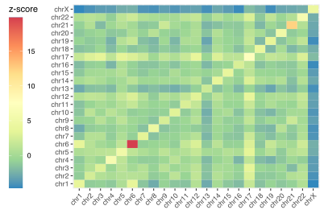

# Introduction
{:.no_toc}

Detecting and evaluating homophily/heterophily in complex networks is a challenging task. Here we show how to address this problem by using a novel method and tool able to provide a quantifiable score, expressed in terms of z-score, associated to the homophilic nature of complex networks.

The data we use in this tutorial are available on [Zenodo](https://doi.org/10.5281/zenodo.6941315).

> ### Agenda
>
> This tutorial is composed of two steps:
>
> 1. TOC
> {:toc}
>
{: .agenda}

# Step 1: Retrieving data

The first step consists in retrieving a specific network for which we need to evaluate its homophily/heterophily. Here we are going to work on the human protein-protein interation (PPI) network retrieved from the [STRING](https://string-db.org/) database.

Homophily is evaluated with respect to specific class of nodes. For this reason, we also need to group the network's nodes according to specific characteristics. In the case of the human PPI, we grouped nodes according to their chromosomes in order to investigate inter- and intra-chromosomal interactions. Please note that nodes refer to proteins in a PPI network, and we were able to retrieve the chromosome by recovering the genes whose products are the proteins in the PPI. We relied on the information provided by the [HUGO Gene Nomenclature Committee](https://www.genenames.org/) to retrieve both the gene IDs and their chromosomes starting from the Ensemble Protein IDs provided by STRING.

> ###  Hands-on: Get the data
> 1. Create a new history for this tutorial
>
>    
>
> 2. Import datasets:
>    - Human PPI network (`9606.protein.links.v11.5.txt`)
>    - Nodes clustered according to chromosomes (`9606.protein.nodes.v11.5.txt`)
>
>    ```
>    https://zenodo.org/record/6941315/files/9606.protein.links.v11.5.txt
>    https://zenodo.org/record/6941315/files/9606.protein.nodes.v11.5.txt
>    ```
>
{: .hands_on}

# Step 2: Evaluating homophily/heterophily

Here we are going to run the `honto` tool, which has been designed for assessing and measuring homophily in networks whose nodes have categorical attributes, namely when the nodes of networks come partitioned into classes.

Homophily evaluation is performed through the comparison between the relative edge density of the subgraphs, induced by each class, and the corresponding expected relative edge density under a null model.

The novelty of our approach consists in prescribing an endogenous null model, namely, the sample space of the null model is built on the input network itself. This allows to give exact explicit expressions for the z-scores of the relative edge density of each class as well as other related statistics

The evaluation is expressed in terms of z-score values.

> ###  Hands-on: Start the evaluation
> **honto** : Run **honto** with the following settings:
>    * Select `9606.protein.links.v11.5.txt`  retrieved during **Step 1** under the `Select a network` input field;
>    * Select `9606.protein.nodes.v11.5.txt`  retrieved during **Step 1** under the `Select a nodes definition file` input field;
>    * Use the default value `700` under `Weight threshold`.
>
> The **honto**  tool will produce two `txt` files with the z-scores representing the evaluation of the inter- and intra-chromosomal interactions in the STRING PPI.
>
> It also produces a graphical representation of the inter-chromosomal interactions as a heatmap, as reported below.
>
> 
{: .hands_on}

> ###  Additional resources
>
> Read more about **honto** [here](https://github.com/cumbof/honto).
{:.details}
