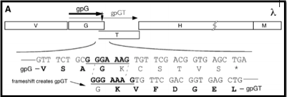

# A Brief Preamble

Often times, phage genomes contain overlapping gene features (e.g. tape measure protein chaperones, occasionally spanin genes). The current version of web Apollo is not built to properly deal with these occurrences of overlapping gene features. However, here the [CPT](https://cpt.tamu.edu) offers a solution to allow temporary annotation that can be manually corrected (or, corrected in another program like Artemis) after the export of genome annotations from Apollo.

> ### Agenda
>
> * Background: Tape Measure Protein Chaperones and Frameshifts
> * Locating TMPs, Chaperones, and Frameshifts
> * Annotating the Frameshifts
>    > 1. Getting Three Gene Features
>    > 2. Adjusting Gene Boundaries
>    > 3. Edit the Annotation
>    > 4. Examples of TMP Chaperone and TMP Chaperone Frameshift Annotations
>
{: .agenda}

# Background: Tape Measure Protein Chaperones and Frameshifts

Within the unique tail structure of siphophages and myophages lies the tape measure protein (TMP) - a long, unfolded protein that determines the length of the phage tail. Upon phage adsorption to the host cell, the TMP is injected out of the tail and into the cell; it generates a hole in the host cell membrane and allows the phage genetic material to enter.

During assembly in the infected host cell, the TMP is maintained in an unfolded state by chaperone proteins. In phage lambda, the TMP, gpH, is coated by the two tape measure protein chaperones, gpG and gpGT (see [figure below](https://www.ncbi.nlm.nih.gov/pubmed/15469818)). 

> ###  A Relevant Read
> The above figure comes from the paper: [Xu J, Hendrix RW, Duda RL. Chaperone-protein interactions that mediate assembly of the bacteriophage lambda tail to the correct length. Journal of Molecular Biology. 426: 1004-18.](https://www.ncbi.nlm.nih.gov/pubmed/15469818), where detailed information on phage lambda tail assembly is available.
{: .tip}

The chaperones gpG and gpGT bind to the unfolded TMP until it is bound by the tail protein gpV. These two chaperone proteins are translated from a single mRNA via a *programmed translational frameshift*. The ribosome slips backward one nucleotide during translation at a heptanucleotide slip site, resulting in N-terminally identical, but C-terminally unique protein products. The slip site at which the programmed translational frameshift occurs is generally conserved.

Shown here is the section of lambda’s genome where the TMP, H ,and TMP chaperones, G and GT, are encoded. The bolded triplet codons highlight a **slippery sequence**. this is characteristic of many TMP chaperones, and appears to be a conserved feature in many (*but not all*) tailed bacteriophages. A **slippery sequence** allows a ribosome to shift into a different reading frame at a low frequency. In most cases, the ribosome ‘slips’ backward a single nucleotide before continuing to translate the sequence. This low frequency causes a larger concentration of one chaperone protein as opposed to the other protein. Referring back the lambda example, this means that there is more G protein present than GT protein. These slippery sequences tend to follow the canonical motif of **XXXYYYZ**. The table below gives known and suspected slippery sequences in various phages.

> ###  A Relevant Read
> This table originates from: [Xu J, Hendrix RW, Duda RL. 2004. Conserved translational frameshift in dsDNA bacteriophage tail assembly genes. Mol Cell 16:11–21.](https://www.ncbi.nlm.nih.gov/pubmed/15469818), where greater detail about programmed translational frameshifts can be found.
{: .comment}

# Locating TMPs, Chaperones, and Frameshifts

Begin by opening CPT Galaxy ([CPT Galaxy Public](https://cpt.tamu.edu/galaxy-pub/), [CPT TAMU Galaxy](https://cpt.tamu.edu/galaxy)) and navigate the organism of interest in Apollo ([_see here_](https://cpt.tamu.edu/training-material-dev/topics/introduction/tutorials/getting-started-with-apollo/tutorial.html##getting-into-apollo) for how to access Apollo).

> ###  Note That…
> This portion of the annotation process **_CANNOT_** be completed unless both the [structural annotation workflow]({{ site.baseurl }}//topics/phage-annotation-pipeline/tutorials/structural-annotation-workflow/tutorial.html) and [functional annotation workflow]({{ site.baseurl }}//topics/phage-annotation-pipeline/tutorials/functional-annotation-workflow/tutorial.html) have been successfully run.
{: .tip}

It is useful to close the Galaxy history and tools columns on the right and left side of the screen (respectively). Keep the Available Tracks and Apollo Annotations panels open on the left and right sides of the screen for navigation. Clicking on “Length” at the top of the Apollo Annotations table will organize the genes by their length in base pairs. Classically, the TMP will be the longest gene in the genome; however, tail fiber proteins also tend to rank with the longest genes in a phage’s genome. Browse all of the genes by clicking the arrows above the table. Clicking on each gene product in the table list will reveal more details about the gene below, including the specific location on the genome. Locate and zoom into the gene in the center window. Evidence tracks can be used to help distinguish TMP from tail fiber proteins. 

Before annotating the gene as the TMP for the phage, it is important to use the evidence tracks to search for supporting evidence. Locate the Protein options underneath the BLAST section of the Available Tracks column. Turn on the Canonical Phages track. If that does not yield any results, turn that off and turn on SwissProt, followed by TrEMBL and NR if there still aren’t any viable hits. Here, SwissProt provided reasonable support.

Upon determination of the TMP location, the annotator will look directly upstream for the TMP chaperone genes. It is likely that one these genes was previously called, but the frameshifted version (downstream) was *not*. Turn on the Possible Frameshifts track underneath the Phage subsection of the Sequence Analysis section in the Available Tracks pane. Using the resulting evidence hits as a guide, look at the genes closely upstream of the TMP location; zoom in so that the nucleotides, triplet codons, and reading frames are displayed above the User-Created Annotations track.

Although the second gene (above, CDS.0.116_0.388872507629) has a good start codon, looking upstream reveals that there is a very poor (debatably nonexistent) Shine-Dalgarno sequence. This will most likely be the case for chaperones and frameshifts - the second gene will have a very poor Shine-Dalgarno sequence, or it won’t have one at all, which is fine since it doesn't use one (remember it uses the upstream SD and frameshifts into the second reading frame during translation).

From there, look at the end portion of the first gene (l8 in the above example); the slippery sequence *must* be somewhere in there. Search for an example of a series of nucleotides following suit with the **XXXYYYZ** canonical motif. On the (+) strand, notice the series of two lysine residues (K) that persists on all three reading frames; the nucleotide sequences corresponding to all three of these instances aligns with the **XXXYYYZ** canonical motif. 

> ###  Note that…
> The slippery sequence will not always include one or two lysine residues. Phenylalanine (F; one or two), glycine (G; one or two), glutamate (E), leucine (L), or asparagine (N) are all possible amino acids in -1 frameshifts. Refer back to the image containing the canonical phage slippery sequences above, cited from [this report.](https://www.ncbi.nlm.nih.gov/pubmed/15469818)
{: .tip}

# Annotating the Frameshifts

## Getting Three Gene Features

Ideally, the final chaperone frameshift annotations will consist of three gene features -  the TMP chaperone frameshift products, and one non-frameshifted TMP chaperone.

In some cases, the two TMP chaperone frameshift products have already been called in the structural annotation. Right-click on the TMP chaperone frameshift product upstream, and click “Duplicate.” The duplication will become the TMP chaperone.

In other cases, only the first, further upstream TMP chaperone frameshift product was called; as above, right-click on this gene, and select “Duplicate.” Turn on the *Glimmer3* and *MetaGeneAnnotator* tracks, and call a gene near the TMP and TMP chaperone/first frameshift product; it may likely be the same gene that eventually became the TMP chaperone. This gene will be manipulated into becoming the second TMP chaperone frameshift product.

> ###  Important Note!
>  **GENES CALLED FROM SIXPACK CAN _NOT_ BE MOVED, NOR HAVE THEIR BORDERS EDITED. DO NOT USE SIX-PACK FOR  CALLING TAPE MEASURE PROTEIN CHAPERONE GENES.** *Only use genes from* **Glimmer3** *and/or* **MetaGeneAnnotator**.
{: .tip}

> ###  Lacking Shine-Dalgarno Sequences
> Existing genes with poor Shine-Dalgarno sequences (or entire lack thereof) may be difficult to call; in the case of the PBSX prophage genome, it is seen that the second TMP chaperone frameshift gene was not called at all.
>
> 
>
> However, in this other set of PBSX prophage annotations, there *is* a gene present there; it is one of the tape measure protein chaperones.
>
> 
>
> Zooming in on the nucleotide sequence for this gene and looking upstream for the Shine-Dalgarno sequence, one can see that there is a relatively weak start codon (TTG) as well as a complete lack of a valid Shine-Dalgarno sequence.
>
> 
>
> As a result, a gene will need to be called and manipulated into placed to represent the second TMP chaperone frameshift product.
{: .details}

> ###  Calling Genes
> In the case of a missing gene between the TMP and chaperone, genes from *Glimmer3* or *MetaGeneAnnotator* can be called and manipulated. Here, the PBSX prophage genome is adjusted.
>
> 
>
> Both tracks yield the same hit, so either could be called. Right-click on it, hover over ‘Create new annotation,’ and select ‘gene.’ This gene will appear in the User-created Annotations track.
>
> 
>
> 
{: .hands_on}

## Adjusting Gene Boundaries

The non-frameshifted TMP chaperone gene can be left as it is.

The first TMP frameshift product will share a start with the non-frameshifted TMP chaperone gene. Look at the end of this gene and find the slippery sequence (the examples below come from phage T1).

> ###  Moving Boundaries - First TMP Chaperone Frameshift Product
>
> 1. Click on the first TMP chaperone frameshift gene in the User-created Annotations; this will border the gene in red. Hover over the right end of the gene until the cursor becomes an arrow pointing to the right.
>
> 2. Click, hold, and drag the end of the gene backwards to the *SECOND* nucleotide in the *SECOND* codon of the slippery sequence (XXXY**_Y_**YZ). In the case of T1, it is the second A of the (red reading frame) second lysine (K) codon (AAAA**_A_**AC).
>
> 3. Right-click *at the very end of the newly formed boundary*, and select “Set Translation End.”
>
> 
{: .hands_on}

The second TMP chaperone frameshift product will definitely need to have the start adjusted to fit the slippery sequence motif. The end will likely also need to be modified to the correct stop codon.

> ###  Moving Boundaries - Second TMP Chaperone Frameshift Product
>
> 1. Click on the second TMP chaperone frameshift gene to border it in red. Hover over the left end of the gene until the cursor becomes an arrow pointing to the left.
>
> 2. Click, hold, and drag the left end of the gene backwards to the *FIRST* nucleotide in the *SECOND* codon of the slippery sequence (XXX**_Y_**YYZ). In the case of T1, it is the first A of the (red reading frame) second lysine (K) codon (AAA**_A_**AAC). If need be, use the arrow keys to scroll to the left while continuing to hold the mouse.
>
> 3. Right-click *at the very end of the newly formed boundary*, and select “Set Translation Start.” 
>
> 
>
> 4. Look for the *first* stop codon after the slippery sequence in the reading frame corresponding to the second TMP chaperone frameshift gene. The end of the gene will need to be modified to there. Scroll right to the end of the gene.
>
> 5. Click on the gene to border it in red. Hover over the right end of the gene until the cursor becomes an arrow pointing to the right.
>
> 6. Click, hold, and drag the right end of the gene forward or backward to the *third* nucleotide of the *first* stop codon in the corresponding strand and reading frame.
>
> 7. Right-click *at the very end of the newly formed boundary*, and select “Set Translation End.”
>
> 
>
{: .hands_on}

## Edit the Annotation

The TMP chaperone and TMP chaperone frameshift  products have been generated, now they need to be named with attributes to ensure they export correctly. 

> * Right-click on the non-frameshifted gene and select “Edit information.” Change the name of this gene to “tape measure chaperone.” Close the window.

> * For both frame-shifted products, the names will be changed to “tape measure chaperone frameshift product.”
> * While in the Information Editor window, add the **Attribute** tag “frameshift” with the value “a” to *both* TMP chaperone frameshift products.
>    > * This will allow for a merger later.

## Examples of TMP Chaperone and TMP Chaperone Frameshift Annotations

> ###  Phage T1 (before)
>
> 
>
>    > ###  After
>    >
>    > 
>    >
>    > 
>    >
> {: .solution}
{: .question}

> ###  Phage C2 (before)
>
> 
>
>    > ###  After
>    >
>    > 
>    >
>    > 
>    >
> {: .solution}
{: .question}

> ###  Phage PBSX (before)
>
> 
>
>    > ###  After
>    >
>    > 
>    >
>    > 
>    >
> {: .solution}
{: .question}
