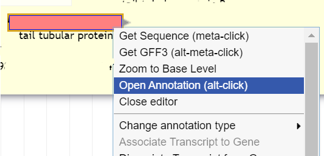
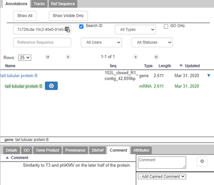
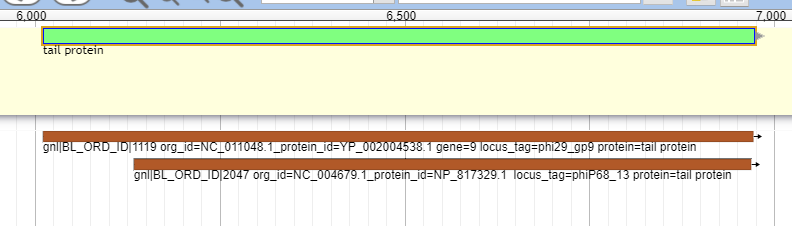
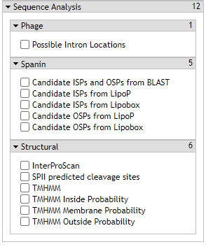
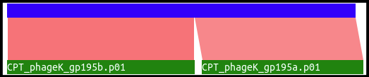
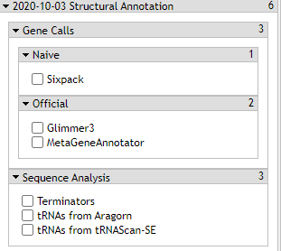

> ### Agenda
>
> * Prerequisites
> * Making an Annotation
>    > * Ensure Changes in Gene Information are Saved
> * Making the Best Prediction
>    > * Gene Calls
>    > * BLAST
>    >    > 1. NT (Nucleotide) database
>    >    > 2. NR (non-redundant) protein database
>    > * Phage Analyses
>    >    > 1. Candidate ISPs/OSPs
>    >    > 2. Possible Intron Locations
>    >    > 3. Possible Frameshifts
>    > Sequence Analyses
>    >    > 1. InterProScan
>    >    > 2. TMHMM (Transmembrane hidden Markov model)
>    >    > 3. Terminators
>    >    > 4. tRNA and tmRNA
>
{: .agenda}

# Prerequisites

Before beginning annotation within Galaxy ([CPT Public Galaxy](https://cpt.tamu.edu/galaxy-pub), [CPT TAMU Galaxy](https://cpt.tamu.edu/galaxy)), it is necessary that there is a genome loaded into Apollo. Additionally, the [structural annotation]({{ site.baseurl }}//topics/phage-annotation-pipeline/tutorials/structural-annotation-workflow/tutorial.html) *must* be complete, and the [functional annotation workflow]({{ site.baseurl }}//topics/phage-annotation-pipeline/tutorials/functional-annotation-workflow/tutorial.html) has **already been run**. The functional annotation workflow opens up the necessary evidence tracks for annotation.

# Making an Annotation

Generally, the annotation process is a synthesis between the understanding of phage genomics and the available evidence tracks. The [Center for Phage Technology](https://cpt.tamu.edu) encourages **phage** annotators on the CPT’s Apollo instance to follow some specific conventions (Field -> *Recommended Input*):

> * Name -> *Gene name* (Could be something like **terminase small subunit** or **hypothetical protein**.) Follow the universal naming conventions at [NCBI](https://www.ncbi.nlm.nih.gov/genome/doc/internatprot_nomenguide/) and [UniProt](https://www.uniprot.org/docs/International_Protein_Nomenclature_Guidelines.pdf).
> * Symbol -> *Do not use.*
> * Aliases -> *Do not use.*
> * Description -> *Do not use.*
> * DBXRefs -> *Only use if the annotator is experienced; please ensure formatting is correct.*
> * Attributes -> *Do not use,* except in spacial cases such as for frame shifted proteins.
> * PubMed IDs -> *Do not use.*
> * Gene Ontology IDs -> *Do not use.*
> * Comments -> *Apply any free-text comments here.* (Could be something like **the e-value(s)** between the annotated gene and homologs or notes to one’s self.)

> ###  Note that…
> Calling genes is [covered in another tutorial.]({{ site.baseurl }}//topics/phage-annotation-pipeline/tutorials/structural-annotation-workflow/tutorial.html)
{: .tip}

To annotate a gene that has been called, right click on the gene in the pale yellow  User-Created Annotations track, and select “Open Annotation (alt-click).”

A screen will appear with various fields that can be filled in with information about the gene.

Reference the list above to see how the CPT would prefer to have genes annotated. *Note that in the current Apollo verion, when you select the gene under "Name" in the annotation screen shown above, the gene name is NOT directly editable.  Instead, only the mRNA name is editable and the annotated mRNA name is what is displayed in the annotation track. We are working on syncing the gene and mRNA name for better user experience.*  

> ###  Naming Guidelines
> It is imperative to follow suit with the [UniProt](https://www.uniprot.org/docs/International_Protein_Nomenclature_Guidelines.pdf) and [NCBI](https://www.ncbi.nlm.nih.gov/genome/doc/internatprot_nomenguide/) international naming conventions. It allows for standardization and consistency in naming proteins, subsequently aiding data retrieval and improving communication. Follow the convention for capitalization and hypothetical protein naming.
{: .comment}

### Ensure Changes in Gene Information are Saved
> There are occasional small bumps on the road when annotating in Apollo, many of which are encountered when editing information for a gene. It helps to be aware of how to avoid them, and where to fix issues when they arise. When changing a data field in the annotation, make sure that the data is saved before moving on. By clicking another field or hitting the tab key, changes should automatically save. If it has successfully been saved, the change will be immediately noticeable in the User-Created Annotations track, even without closing the annotation window. If the changes are not being saved, refresh the page and try again. If this continues to happen, try opening Galaxy ([CPT Public Galaxy](https://cpt.tamu.edu/galaxy-pub), [CPT TAMU Galaxy](https://cpt.tamu.edu/galaxy)) in an incognito window.

# Making the Best Prediction

The Center for Phage Technology integrates as many data sources as is feasible when making predictions about gene function. Please contact the CPT IT staff (cpt@tamu.edu) if another data source not currently available in Apollo is desired. The CPT staff will assess your recommendation and may add it to the Phage Annotation Pipeline (PAP).

> ###  A word on genome annotation
> While we use all the best bioinformatic tools available to complete these analyses, all these are still predictions. Hypothetical. Every prediction is subject to being wrong and getting corrected with new information. This is the nature of genome annotation, and science in general. Due diligence and thorough work is expected, but it is inadvisable to agonize over any single gene prediction. 
{: .tip}

Many of the protein prediction tracks yield multiple homologs for the same gene. To learn more about each homolog, hover over the homolog to be investigated, or right-click on it and select “View details.”

The details presented will vary between evidence types (e.g.BLAST vs. InterProScan).

### Gene Calls

The CPT’s PAP integrates gene calls from numerous sources, specifically *MetaGeneAnnotator* and *Glimmer3*. These gene callers are generally very accurate. However, should those fail to find a gene, *SixPack* is a backup gene caller.

> ###  Note that…
> Gene calling is part of structurally annotating a genome in Apollo. For more information on structural annotation and gene calling, please look at [this tutorial]({{ site.baseurl }}//topics/phage-annotation-pipeline/tutorials/structural-annotation-workflow/tutorial.html).
{: .tip}

### BLAST

BLAST is an acronym standing for Basic Local Alignment Search Tool. Different variations of BLAST exist to search different kinds of sequences. BLAST breaks down the input sequence (called the query) into *k*-mers and compares these to sequences in the database; default *k*-mers are currently 6 for BLASTp (protein database) and 28 for BLASTn (nucleotide sequence database). Matching *k*-mers are then extended to the left and right until the score drops below a threshold, *T*. Sometimes the extended coverage encompasses the entire sequence, and other times the alignment is broken up into homologous segments that are separated by low similarity regions. Alignments with high similarity are referred to as a *high-scoring pair* (HSP); this may be the entire sequence pair, or only part of the query.

Although BLAST is accessible through the [NCBI website](https://blast.ncbi.nlm.nih.gov/Blast.cgi), the databases detailed below are those that are available to an annotator in Apollo. In Apollo, right-clicking on a hit and selecting ‘View Details’ will yield a summary of the details about the protein.

> * Score = *E-value*; the lower the score, the better the alignment with the query. This is also reflected in the color highlight intensity of the feature displayed in the evidence track.
> * Description = may be informative, but this depends on the quality of the annotation in the protein record. In the above example, the accession number is underlined; this same information can be found in the Description portion. Searching the accession number in [NCBI BLAST](https://blast.ncbi.nlm.nih.gov/Blast.cgi) will yield much more information about the protein, including the paper in which this protein was originally reported.

> ###  Note that…
> In practice, an E-value of less than 1e-3 or 1e-5 are considered relevant, **if that hit covers most or all of the protein!**
{: .tip}

##### 1. Nucleotide (NT) database

Megablast is run against a copy of NCBI’s NT database. Hovering over a hit segment will show where in the target genome the region aligns. *Look into the functional flow used for the exact setting (such as the Dice value cutoff when displaying the results) to better interpret the results.*  

##### 2. Protein database

BLASTp is run against three databases (in the most recent PAP iteration, after PAP Functional Workflow v2020.07):

> * CPT’s Canonical Phage database, a select collection of high-quality and well-studied representative phage proteomes
> * SwissProt (curated from UniProt)
> * nr (from NCBI).  *Note that the CPT use a nr database that only include viruses that infect baceria in the most recent functional workflow.* 

These databases offer insight into possible names and functionalities for the phage proteins being analyzed. An example of the Canonical phage track can be seen below.

### Phage Analyses

The CPT has developed a number of phage analysis tools for aid in *phage specific* annotation. These are supplementary bits of information which can inform the analysis, but they must be looked at critically. Many of these tools intentionally yield many possible options, unfortunately yielding high false positive rates.

##### 1. Candidate ISPs/OSPs

Phage lysis genes are [notoriously poorly annotated](https://www.ncbi.nlm.nih.gov/pubmed/30219026). Often they are missed or completely misattributed. To combat this problem for phage spanin proteins, lysis proteins specific to disrupting the outer membrane of gram-negative bacterial hosts, the CPT utilizes the candidate ISP (i-spanin) and OSP (o-spanin) tool output.

> ###  Note that…
> These tracks will generate false positives. Be sure that the data occurs somewhere around the phage’s lysis cluster (where applicable). Additionally, know what to look for in a lipobox in these potential spanin genes.
{: .tip}

The ISP track naïvely searches the genome for every possible CDS, and then analyzes them with TMHMM. This happens even in the case of a mis-called or entirely missed i-spanin. The OSP track searches through every possible CDS which contains a lipobox as defined by the CPT. *Both* of these datasets are filtered for proximity. Co-incidence of a possible ISP gene and a possible OSP gene is a good sign, but the genomic context information will need to be taken into account to complete the functionality inference.

##### 2. Possible Intron Locations

This track analyzes BLASTp against NR data for locations where two or more called, disjointed CDSs match separate locations on the same target protein. Below is an example alignment from phage K.

Both 195a and 195b align to distinct regions of the same protein, based on BLAST data. It can be theorized that these are actually *one* protein with *one* intron and *two* exons; however, **this evidence should not be taken as 100% correct**. Similar results may happen for other reasons, such as separation of domains from a single protein due to evolution, sequencing errors, and a myriad of other possibilities. See [this tutorial]({{ site.baseurl }}//topics/additional-analyses/tutorials/finding-interrupted-genes/tutorial.html) on how to use the possible intron locations track to annotate interrupted genes.  

> ###  Note that…
> Currenty the CPT does not have a tool that can automatically detect frameshifts. Refer to this [frameshifts annotation tutorial]({{ site.baseurl }}//topics/phage-annotation-pipeline/tutorials/annotating-tmp-chaperone-frameshifts/tutorial.html) for more information on how to annotate tape measure protein chaperone frameshifts.
{: .tip}

### Sequence Analyses

Additional analyses run in the PAP are listed in the Annotations Track on the left under both the structural and functional sections. 

#### 1. InterProScan

InterProScan is an extremely useful domain finder. It is hosted by [EMBL-EBI](https://www.ebi.ac.uk/) (European Molecular Biology Laboratory - European Bioinformatics Institute) and integrated into [UniProt](https://www.uniprot.org/) (a freely accessible database of protein sequence and functional information, of which many entries are derived from genome sequencing projects). InterProScan searches a protein sequence against the member databases and detects similarity to conserved domains. It integrates 14 other conserved domain databases to assign a single [InterPro](https://www.ebi.ac.uk/interpro/) ID to related domains. Hits from InterProScan predict protein function based on conserved domains (**beware of domain swapping!**)

> ###  Domain Swapping 
> * It is not uncommon for proteins to contain more than one domain that function independent of each other. These domains can be found alone. Sometimes you may see a BLAST hit to a protein that has two domains, but the name of the protein only reflects one domain's function. **When you see a hit, make sure that the domain the name is based off is actually aligning to your query.**
{: .details}

These InterPro conserved domain hits will be more sparse than BLAST hits and often only align to a portion of the protein. Right clicking on a feature from the InterProScan evidence track and selecting ‘View Details’ will yield a summary of that feature.

If the domain hit is part of InterPro, there will be a “Dbxref” entry. Searching either the name or Dbxref fields in Google (or use the IPR number at [InterPro's website](http://www.ebi.ac.uk/interpro/)) will often find the domain entry in either the member database or InterPro. The Score for these conserved domain searches is a probability or a quality score, and its calculation varies between databases. This tool, among all other tools food in Apollo, have been pre-calibrated to show results the authors think are significant, so the annotator does not need to evaluate this value.

##### 2. TMHMM (Transmembrane hidden Markov model)

Here, TMHMM is run over the genome to pick out genes that contain likely transmembrane domains (TMDs). TMHMM data is used in a number of other tracks and analyses as well.

There are three variations of the TMHMM track - *Inside Probability, Membrane Probability,* and *Outside Probability.* The Membrane Probability track yields the actual scores from the TMHMM track plotted to the genome. The Inside Probability track shows the probability of a region of a protein being within the cytoplasm. The Outside Probability show the probability of a region of a protein being within the periplasm or extracellular.

##### 3. Terminators

Terminators are produced from [TransTermHP.](http://transterm.ccb.jhu.edu/) TransTermHP finds rho-independent transcription terminators in bacterial genomes. Each terminator found by the program is assigned a confidence value that estimates its probability of being a true terminator.

> ###  Note that…
> This track can be found underneath the “Sequence Analysis” section of the Structural Annotation portion all of the tracks.
>
> 
>
{: .tip}

##### 4. tRNA

[ARAGORN](https://www.ncbi.nlm.nih.gov/pubmed/14704338) and [tRNAscan-SE](http://lowelab.ucsc.edu/tRNAscan-SE/) provides the CPT with quality tRNA annotations. Recall that tRNAs are **not** likely to be embedded within genes.

> ###  Note that…
> tRNA tracks can be found underneath the “Sequence Analysis” section of the Structural Annotation portion.
>
> 
>
{: .tip}
