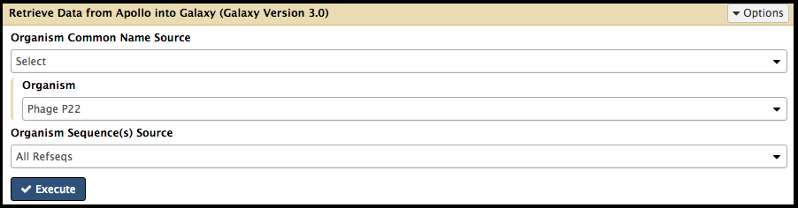
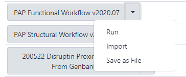
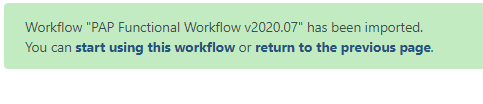
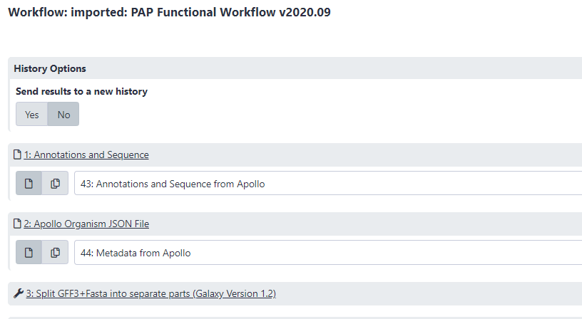
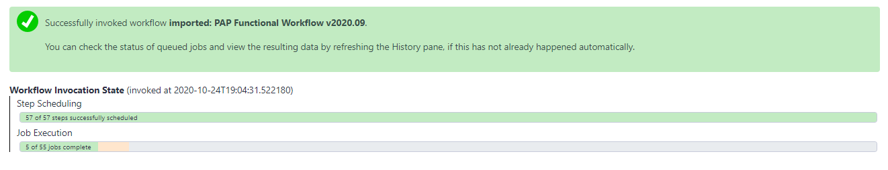

# Functional Annotation Workflow

This tutorial is used to run analyses for gene function prediction after the genome [structural annotation]({{ site.baseurl }}//topics/phage-annotation-pipeline/tutorials/structural-annotation-workflow/tutorial.html) has been completed.

> ### Agenda
>
> 1. Workflow
> 2. Completion
>
{: .agenda}

# Workflow

To begin the analysis in Galaxy, the genome data must be retrieved from its Apollo record. Start by accessing Galaxy ([CPT Public Galaxy](https://cpt.tamu.edu/galaxy-pub), [CPT TAMU Galaxy](https://cpt.tamu.edu/galaxy/)). It is recommended to create and name a new history. Once in the appropriate history, navigate to the [Retrieve Data tool](https://cpt.tamu.edu/galaxy/tool_runner?tool_id=export) using the search bar at the top of the Tool panel on the left. Open the tool by clicking on the hyperlink of the same name underneath CPT: Get Data, and the parameters to adjust will load in the center pane. 

Using the *Organism* drop-down menu, select the name of your phage, then click “Execute.”  *Note that by default the tool retrieves the "GFF annotations + whole genome".  You have the option to select other files (such as peptide/CDS sequences), which are not usually needed in our annotation pipeline.*   A message in a green box will appear when the retrieval has begun. Note that the following steps can be started as soon as the retrieval datasets appear in the history list (even before they turn green). The retrieval step will generate two files, "Annotation and Sequence from Apollo" and "Metadata from Apollo".  These data will serve as the input for the functional annotation workflow. 

To import the functional workflow, click on the “Shared Data” drop-down list and select “Workflows”.

The next [page](https://cpt.tamu.edu/galaxy/workflows/list_published) will list all the public and shared workflows developed at the CPT. The Phage Annotation Pipeline (PAP) workflows are available here. Look for the most recent Functional Annotation Workflow version labelled with the year and a version number, “PAP 202# Functional (v #.#)”. Click on the drop-down menu arrow for that most recent functional workflow, and select “Import”.

> ###  Note that…
> The screenshots displayed here may not precisely reflect what you see on your screen. As these are regularly updated, it is likely that the current version year or number is different. Just look for the most recent one.
{: .tip}

A successfully imported workflow will result in a message in a green box where you can click on the 'start using this workflow link'.

Alternatively, click on the Workflows menu item at the top of the center panel of Galaxy. All imported and user-generated workflows on this Galaxy account are shown and can be run. Find the functional workflow that has just been imported (at the top of the list), and click on the blue run button to the right of the title. 

In the center pane, adjust the parameters to run the functional annotation workflow. Specifically, ensure that datasets are associated with their correct phage counterpart.
> 1. Annotation and Sequence should contain the “#\: Annotations and Sequence from Apollo” dataset (where # varies dependent on their place in the current History).
> 2. Apollo Organism JSON File should contain the “#\: Metadata from Apollo” dataset (where # varies dependent on their place in the current History).

When the proper parameters have been set, select “Run workflow” at the top corner of the page. A message in a green box will appear, indicating a successful invocation of the functional annotation workflow.  The window also shows the running state of the workflow.

This workflow includes multiple computationally-intensive steps:

> * BLAST against numerous databases, including NCBI’s NT database, CPT’s Canonical Phage database (a select collection of high-quality and well-studied representative phage proteomes), SwissProt (curated from UniProt), and a nr database that only include viruses that infect baceria (in functional workflow newer than v2020.07).  
> * InterProScan
> * phage spanin search tools
> * various other analyses.  See [Annotation in Apollo tutorial]({{ site.baseurl }}//topics/phage-annotation-pipeline/tutorials/annotation-in-apollo/tutorial.html) for more info.  

> ###  Note that…
> Check back on this workflow periodically; if any of the queued jobs have failed (the datasets in the History column have turned red), click on the dataset. Report a bug by clicking on the bug icon.
>
>
>
> Some individual jobs (e.g. BLAST and InterProScan) may remain yellow (“running”) for extended period of time.
{: .tip}

# Completion

Once all the datasets and tools have completed, then functional annotation within Apollo may begin. How to use the evidence to predict gene function is beyond the scope of this tutorial but is touched on in the [Annotation in Apollo tutorial]({{ site.baseurl }}//topics/phage-annotation-pipeline/tutorials/annotation-in-apollo/tutorial.html). General Apollo function help can be found in the [Getting Started with Apollo]({{ site.baseurl }}//topics/introduction/tutorials/getting-started-with-apollo/tutorial.html) tutorial.
