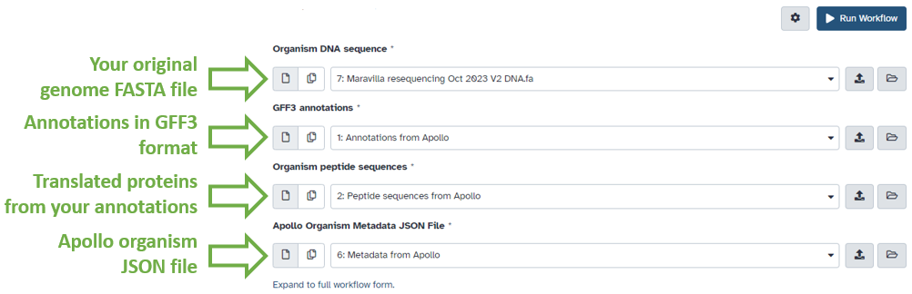

# Functional Annotation Workflow

This tutorial is used to run analyses for gene function prediction after the genome [structural annotation]({{ site.baseurl }}//topics/phage-annotation-pipeline/tutorials/structural-annotation-workflow/tutorial.html) has been completed.

> ### Agenda
>
> 1. Prerequisites
> 2. Data retrieval from Apollo
> 3. Importing and running the workflow
>
{: .agenda}

# Prerequisites 
> ###  Are you ready?
> This module assumes you have already completed the following tutorials:
> [**Introduction to CPT Galaxy**](https://cpt.tamu.edu/training-material/topics/introduction/tutorials/introduction-to-cpt-galaxy/tutorial.html)
> [**Getting Started with Apollo**](https://cpt.tamu.edu/training-material/topics/introduction/tutorials/getting-started-with-apollo/tutorial.html)
> [**Structural Annotation Workflow**](https://cpt.tamu.edu/training-material/topics/phage-annotation-pipeline/tutorials/structural-annotation-workflow/tutorial.html)
>
> This tutorial also assumes that you have already created an organism in Apollo using the [**CPT Phage Structural Workflow**](https://cpt.tamu.edu/training-material/topics/phage-annotation-pipeline/tutorials/structural-annotation-workflow/tutorial.html) and have annotated the organism's protein-coding genes.
{: .hands_on}

> ###  Note that…
> Any screenshots displayed here may not precisely reflect what you see on your screen. As software is regularly updated, it is possible that version numbers or page layouts may change.
{: .tip}

# Data retrieval from Apollo

To begin the analysis in Galaxy, the genome data must be retrieved from its Apollo record so that exists as datasets in your Galaxy history. This step will import the data contained in the top *User Annotation* track for the organism in Apollo. 

To perform this step, open the desired history and find the ***Retrieve Data*** *from Apollo into Galaxy* tool using the search bar at the top of the Tool panel on the left. Open the tool and the parameters will load in the center pane. With the *Organism Common Name Source* field set at *Select*, use the *Organism* drop-down menu to select the name of the organism you wish to import, then click *Run Tool*. Note that by default the tool will retieve the GFF3 annotations as a file without its associated DNA sequence. The retrieval step will generate multiple datasets in your history.

> ###  Note that…
> You will need the following datasets in your history to continue to running the functional workflow:
> - *Annotations from Apollo*
> - *Peptide sequences from Apollo*
> - *Metadata from Apollo*
> - The original FASTA DNA sequence file used to generate the organism during the [structural annotation]({{ site.baseurl }}//topics/phage-annotation-pipeline/tutorials/structural-annotation-workflow/tutorial.html) workflow.
{: .tip}

# Importing and running the workflow

To import the functional workflow, click on the *Shared Data* drop-down list and select *Workflows*.  The next page will list all the public workflows on the Galaxy instance. Find the functional workflow by using the top search bar; it will be named *CPT Phage Functional Workflow v[year]#*, and is also tagged with the terms "CPT", "phage", and "Apollo". Look for the most recent functional annotation workflow version labelled with the year and a version number. Click on the workflow name and select “Copy”. This will create a copy of the workflow in your Galaxy account. Once the workflow has been imported to your account, you can run it by clicking on the Workflow menu item at the top of the center panel of Galaxy. In this list will be all the workflows that can run from this Galaxy account. Find the desired workflow and click on blue button to the right of the title to run it.

In the center pane, ensure that input datasets are associated with their correct phage counterpart.
> 1. *Organism DNA Sequence* should contain the original FASTA DNA sequence file you used to create the organism in the structural workflow.
> 2. *GFF3 Annotations* should contain the *Annotations from Apollo* dataset, retrieved from Apollo using the *Retrieve Data* tool.
> 3. *Organism peptide sequences* should contain the *Peptide sequences from Apollo* dataset, retrieved from Apollo using the *Retrieve Data* tool.
> 4. *Apollo organism metadata JSON file* should contain the *Metadata from Apollo* dataset, retrieved from Apollo using the *Retrieve Data* tool.

When the proper parameters have been set, select *Run workflow* at the top corner of the page. A message in a green box will appear, indicating a successful invocation of the functional annotation workflow.  The window also shows the running state of the workflow.

This workflow includes multiple computationally-intensive steps:
* BLASTp against two general databases: 
  * A protein database generated from all species-level *Caudoviricetes* phages listed in the [ICTV Master Species List (MSL38v3)](https://ictv.global/msl)
  * a "Canonical phage" database contatining protens from the RefSeq records for well-studied phages including coliphages T1, T3, T4, T5, T7, Lambda, P1, P2, N4, Mu, and N15; *Salmonella* phage P22, and *Bacillus* phages SPO1 and phi29
* InterProScan in two separate processes:
  * One track for protein conserved domains in Pfam, TIGRFAM, SUPERFAMILY, PANTHER, Gene3d, and PROSITE
  * One track for protein signals and transmembrane domains detected by SignalP and TMHMM
* Phage spanin search tools
  * A BLASTp search of all protein-coding ORFs against a database of over 600 phage spanin complex proteins
  * A search of all protein-coding ORFs for potential SPII (lipobox) signals

> ###  Note that…
> This workflow is under continuous development and new features will be added in the future.
{: .tip}

# Completion

Once all the datasets and tools have completed, then functional annotation within Apollo may begin. How to use the evidence to predict gene function is beyond the scope of this tutorial but is touched on in the [Annotation in Apollo tutorial]({{ site.baseurl }}//topics/phage-annotation-pipeline/tutorials/annotation-in-apollo/tutorial.html). General Apollo function help can be found in the [Getting Started with Apollo]({{ site.baseurl }}//topics/introduction/tutorials/getting-started-with-apollo/tutorial.html) tutorial.
