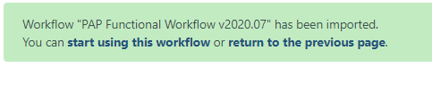
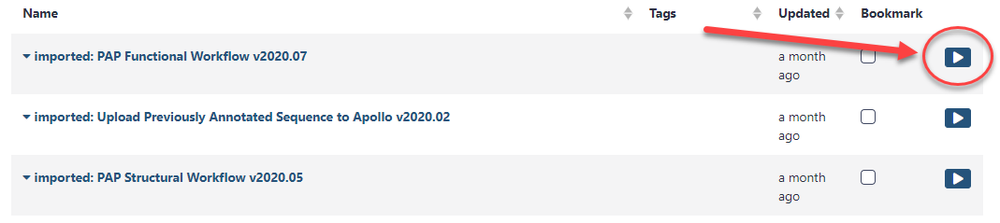
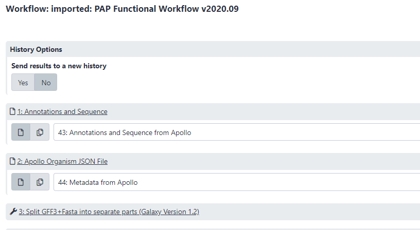
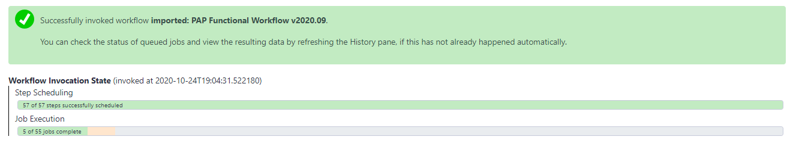

# Functional Annotation Workflow

This tutorial is used to run analyses for gene function prediction after the genome [structural annotation]({{ site.baseurl }}//topics/phage-annotation-pipeline/tutorials/structural-annotation-workflow/tutorial.html) has been completed.

> ### Agenda
>
> 1. Data retrieval from Apollo
> 2. Running the workflow
>
{: .agenda}

# Data retrieval from Apollo

To begin the analysis in Galaxy, the genome data must be retrieved from its Apollo record so that exists as datasets in your Galaxy history. This step will import the data contained in to top *User Annotation* track for the organism in Apollo. Once in the desired history, find the ***Retrieve Data*** *from Apollo into Galaxy* tool using the search bar at the top of the Tool panel on the left. Open the tool and the parameters will load in the center pane. 

With the *Organism Common Name Source* field set at *Select*, use the *Organism* drop-down menu to select the name of the organism you wish to import, then click *Run Tool*. Note that by default the tool will retieve the GFF annotations and source DNA sequence as separate files. You have the option to import a combination GFF3 + DNA sequence file by setting the switch *Include fasta in the GFF3 file*.  The pipeline is currently designed to work with the GFF3 and DNA sequence as separate files.  The retrieval step will generate multiple datasets in your history. the datasets *Annotations from Apollo*, *Peptide sequences from Apollo* and *Metadata from Apollo* will be used for the functional workflow.

> ###  Note that…
> You will need the following datasets in your history to continue to running the functional workflow:
> - *Annotations from Apollo*
> - *Peptide sequences from Apollo*
> - *Metadata from Apollo*
> - The original FASTA DNA sequence file used to generate the organism during the [structural annotation]({{ site.baseurl }}//topics/phage-annotation-pipeline/tutorials/structural-annotation-workflow/tutorial.html) step.
{: .tip}

To import the functional workflow, click on the “Shared Data” drop-down list and select “Workflows”.  The next page will list all the public workflows on the Galaxy instance. Find the functional workflow by using the top search bar; it will be named *CPT Phage Functional Workflow v[year]#*, and is also tagged with the terms "CPT" "phage" and "Apollo". Look for the most recent functional annotation workflow version labelled with the year and a version number. Click on the workflow name for the most recent functional workflow, and select “Import”.

> ###  Note that…
> The screenshots displayed here may not precisely reflect what you see on your screen. As these are regularly updated, it is likely that the current version year or number is different. Just look for the most recent one.
{: .tip}

A successfully imported workflow will result in a message in a green box where you can click on the 'start using this workflow link'.

Alternatively, click on the Workflows menu item at the top of the center panel of Galaxy. All imported and user-generated workflows on this Galaxy account are shown and can be run. Find the functional workflow that has just been imported (at the top of the list), and click on the blue run button to the right of the title. 

In the center pane, adjust the parameters to run the functional annotation workflow. Specifically, ensure that datasets are associated with their correct phage counterpart.
> 1. Annotation and Sequence should contain the “#\: Annotations and Sequence from Apollo” dataset (where # varies dependent on their place in the current History).
> 2. Apollo Organism JSON File should contain the “#\: Metadata from Apollo” dataset (where # varies dependent on their place in the current History).

When the proper parameters have been set, select “Run workflow” at the top corner of the page. A message in a green box will appear, indicating a successful invocation of the functional annotation workflow.  The window also shows the running state of the workflow.

This workflow includes multiple computationally-intensive steps:

> * BLAST against numerous databases, including NCBI’s NT database, CPT’s Canonical Phage database (a select collection of high-quality and well-studied representative phage proteomes), SwissProt (curated from UniProt), and a nr database that only include viruses that infect baceria (in functional workflow newer than v2020.07).  
> * InterProScan
> * phage spanin search tools
> * various other analyses.  See [Annotation in Apollo tutorial]({{ site.baseurl }}//topics/phage-annotation-pipeline/tutorials/annotation-in-apollo/tutorial.html) for more info.  

> ###  Note that…
> Check back on this workflow periodically; if any of the queued jobs have failed (the datasets in the History column have turned red), click on the dataset. Report a bug by clicking on the bug icon.
>
>
>
> Some individual jobs (e.g. BLAST and InterProScan) may remain yellow (“running”) for extended period of time.
{: .tip}

# Completion

Once all the datasets and tools have completed, then functional annotation within Apollo may begin. How to use the evidence to predict gene function is beyond the scope of this tutorial but is touched on in the [Annotation in Apollo tutorial]({{ site.baseurl }}//topics/phage-annotation-pipeline/tutorials/annotation-in-apollo/tutorial.html). General Apollo function help can be found in the [Getting Started with Apollo]({{ site.baseurl }}//topics/introduction/tutorials/getting-started-with-apollo/tutorial.html) tutorial.
