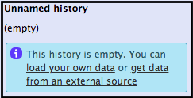
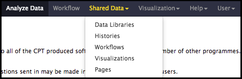
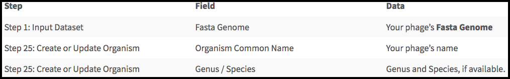
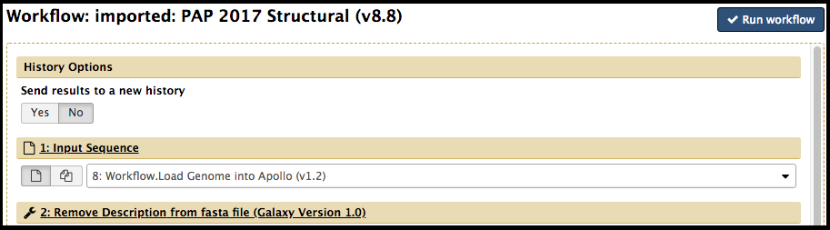
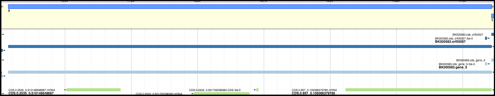
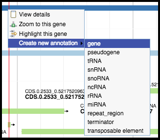

# Structural Annotation Workflow

This tutorial will walk you through the beginning of the phage genome annotation process: loading your genome into a Galaxy history,  running the structural annotation workflow and beginning your structural annotation.

> ### Agenda
>
> 1. Prerequisites
> 2. Workflow
> 3. Gene calling
>
{: .agenda}

# Prerequisites 
> ###  Are you ready?
> This module assumes you have already completed the following tutorials:
> [**Introduction to CPT Galaxy**](https://cpt.tamu.edu/training-material/topics/introduction/tutorials/introduction-to-cpt-galaxy/tutorial.html)
> [**Getting Started with Apollo**](https://cpt.tamu.edu/training-material/topics/introduction/tutorials/getting-started-with-apollo/tutorial.html).
{: .hands_on}

First, you must have an active account in Galaxy.  Navigate to [**CPT TAMU Galaxy**](https://cpt.tamu.edu/galaxy) and log in with your NetID. You should be presented with the main Galaxy page and an empty history.  If you are in a history with datasets already in it, click on *History Options* (the gear icon) at the top of the History panel and click *Create New*.

The class genomes for this year are stored in a Data Library within Galaxy. Click on *Shared Data > Data Libraries* and navigate to *BICH 464 Genomes* and the folder for 2019 class genomes. You have been assigned a phage genome in the class Google Drive. 

If it is a novel phage that has not been named yet, decide on a name for the phage. Access CPT Galaxy ([CPT Public Galaxy](https://cpt.tamu.edu/galaxy-pub), [CPT TAMU Galaxy](https://cpt.tamu.edu/galaxy)) to upload the FASTA file containing the desired phage genome. There are two methods to upload a FASTA file to Galaxy.
> * On the right side of the screen is a column titled “History;” it should be an empty, unnamed history containing only a blue box with a message. Click on the “… load your own data…” hyperlink.

> * On the left side of the screen is a column titled “Tools.” In the top right-hand corner of that column is an “upload” symbol. Click on it.

Both paths yield the same result; a white screen will appear, with different file upload options. 

Drag and drop the FASTA file from the download location on the local device, or select “Choose local file” to find the FASTA file. Click ‘Start’ once the desired file has appeared in the list. After loading, a new dataset entry will be present in the History pane on the right. It is ready for use when the dataset turns green. 

> ###  Troubleshooting: Dataset/Tool Turns Red
> When an upload fails, the dataset in the History column will turn red. During an upload, this is not usually the user's fault. If this happens, click on the failed dataset to expand it. Clicking on the bug icon will give the user the option to submit a bug report.
> 
Whenever you encounter a red dataset submit a bug report so that CPT staff can investigate the issue.
{: .comment}

# Workflow

The structural annotation workflow will analyze the input genome with three automated gene callers: *MetaGeneAnnotator*, *GeneMarkS*, and *Glimmer3*. A completely naïve set of open reading frames (ORFs) will also be generated from the *Sixpack* prediction program to ensure even unexpected genes can be called. Lastly, tNA and terminator finding tools will be run. To begin, click on Shared Data drop-down menu at the top of the center Galaxy panel and select the “Workflows” option.

The next page will list all the public and shared workflows developed at the CPT. The Phage Annotation Pipeline (PAP) workflows are available here. Look for most recent version labelled with the year and a version number, “PAP 201# Structural (v #.#)”. Click on the drop-down menu arrow for that most recent structural workflow, and select “Import.”

> ###  Note that…
> The screenshots displayed here may not precisely reflect what you see on your screen. As these are regularly updated, it is likely that the current version year or number is different. Just look for the most recent one.
{: .tip}

A successfully imported workflow will result in a message in a green box where you can click on the 'start using this workflow link'. 

Alternatively, click on the Workflows menu item at the top of the center panel of Galaxy. In this list will be all the workflows that can run from this Galaxy account. Find the structural workflow that has just imported, click on the drop-down menu, and select “Run". 

When workflow has loaded, there are three parameters that the user needs to set. These are required to properly execute the workflow.

Scroll through the steps in the workflow until you reach the sections that need user input listed in the table above. In the example here, phage P22 FASTA sequence and name were automatically selected from the available history datasets. Make sure this is the correct dataset. 

Further down the name is entered. A genus name was not entered. 

Once the proper parameters have been filled out, click “Run workflow,” found at both the bottom and top of the page. If the workflow was successful, a message in a green box will appear. Follow any instructions in the message (e.g. a need to refresh the History panel to see the jobs created by the workflow). 

# Gene Calling

When all jobs in the history panel generated by the Structural Annotation Workflow have turned green, the gene calling can begin. First, open the genome in Apollo: 

> * In the last dataset of the history, click the eyeball icon to open your genome in Apollo.

OR

> * In a new tab, navigate to Apollo by clicking on the Apollo icon at the homepage of [Galaxy](https://cpt.tamu.edu/galaxy-pub). 

When the genome has been opened in Apollo, each gene candidate must be examined. 

> ###  Working in Apollo
> For help with navigating in Apollo to do things like show and hide evidence tracks, maximize screen space, and create features, see this [Apollo tutorial]({{ site.baseurl }}//topics/genome-annotation/tutorials/getting-started-with-apollo/tutorial.html). 
{: .hands_on}

Recall that the three primary gene callers are correct ~90-95% of the time. Choose the best gene to call from the evidence tracks considering the start codon, presence of a Shine-Dalgarno sequence, and genome coverage (phage have high coding density and genes often overlap). 

For example, in the image below, the light blue and dark blue tracks are a better choice for a gene than the green track; they have a higher genomic coverage and a good Shine-Dalgarno site identified.

> ###  Calling Genes
>Right-clicking on the gene will display four options in the menu. Hover over “Create new annotation”, this will display more options. Click on “gene” to create a feature for that gene. Genes for the whole genome must be called before continuing on to the functional annotation.
>
>
{: .hands_on}

> ###  Calling Terminators
>Ensure the terminator evidence track is displayed. Evaluate the possible terminators based on score (greater than 90), at least 5 bp stem without mismatches, and at least 4 Ts after the stem. Right-clicking on the terminator evidence will display the options menu.  Hover over “Create new annotation”, and click on “terminator” to create a feature for that terminator. Only call terminators if they fit all the criteria. We cannot predict all terminators in the genome and we may not be able to identify any.
{: .hands_on}

> ###  Note that…
> It is better to over-call (call more genes than are likely to be in the genome) than to under-call genes and have to go back and re-run BLAST and related analyses. Do not leave large gaps with no gene calls as features can be deleted later.
{: .tip}

# Completion

Once genes have been identified and called across the full length of the genome, the [functional annotation workflow]({{ site.baseurl }}//topics/genome-annotation/tutorials/functional-annotation-workflow/tutorial.html) may be executed to proceed with the prediction part of the genome annotation.
