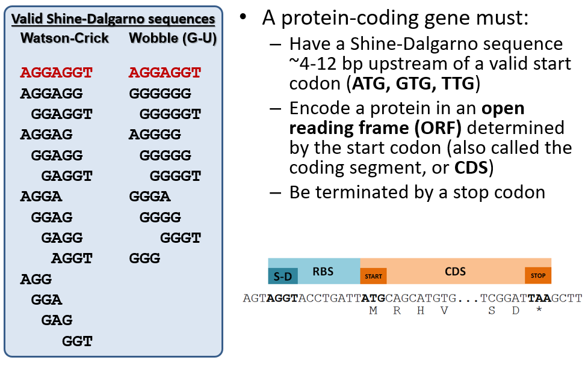

# Structural Annotation Workflow

This tutorial will walk you through the beginning of the phage genome annotation process: loading your genome into a Galaxy history,  running the structural annotation workflow and beginning your structural annotation.

> ### Agenda
>
> 1. Prerequisites
> 2. Importing and Running the Workflow
> 3. Gene calling
>
{: .agenda}

# Prerequisites 
> ###  Are you ready?
> This module assumes you have already completed the following tutorials:
>
> [**Introduction to CPT Galaxy**](https://cpt.tamu.edu/training-material/topics/introduction/tutorials/introduction-to-cpt-galaxy/tutorial.html)
>
> [**Getting Started with Apollo**](https://cpt.tamu.edu/training-material/topics/introduction/tutorials/getting-started-with-apollo/tutorial.html).
{: .hands_on}

First, you must have an active account in Galaxy.  Navigate to [**CPT TAMU Galaxy**](https://cpt.tamu.edu/galaxy) and log in with your NetID. You should be presented with the main Galaxy page and an empty history.

The class genomes for this year are stored in a Data Library within Galaxy. Click on *Shared Data > Data Libraries* on the top menu bar and navigate to *BICH 464 Genomes* and the folder for the 2019 class genomes. You have been assigned a phage genome by name in a spreadsheet in the class Google Drive. Locate your genome and import it into a new history by clicking the checkbox to the left of your genome's name and then clicking the *To History* button at the top of the window. Select or create the history you would like to use and click *Import*.  You should import the genome into an empty history.

Click *Analyze Data* on the top menu bar and you should be taken to the main Galaxy window. Your active history should now contain a single dataset: the DNA sequence of your phage in FASTA format.

# Importing and Running the Workflow

> ###  Annotation in a nutshell
Genome annotation is the process of interpreting the raw DNA sequence of a genome into predictions of its function.  Genome annotation can be divided into two major steps: structural annotation and functional annotation. **Structural annotation** is the process of defining the locations and boundaries of features in the genome ("where are the genes?"). **Functional annotation** is the process of assigning functions or predicted phenotypes to the genome features ("what do the genes do?"). More details on the principles of these processes will be provided in class.
{: .hands_on}

The structural annotation workflow will analyze the DNA sequence of the input genome with two automated gene callers: *MetaGeneAnnotator* and *Glimmer3*. A completely naïve set of open reading frames (ORFs) will also be generated from the *Sixpack* prediction program to ensure even unexpected genes can be called. Lastly, tRNA and terminator finding tools will be run. To begin, click on the *Shared Data* drop-down menu at the top of the center Galaxy panel and select the *Workflows* option.

The next page will list all the public and shared workflows developed at the CPT. The Phage Annotation Pipeline (PAP) workflows are available here. Look for most recent version labelled with the year and a version number, “PAP 2019 Structural (v #.#)”. Click on the drop-down menu arrow for that most recent structural workflow, and select “Import.”

> ###  Note that…
> The screenshots displayed here may not precisely reflect what you see on your screen. As these are regularly updated, it is likely that the current version year or number is different. Just look for the most recent one.
{: .tip}

A successfully imported workflow will result in a message in a green box where you can click on the 'start using this workflow link'. 

Once the workflow has been imported to your account, you can always run it by clicking on the *Workflow* menu item at the top of the center panel of Galaxy. In this list will be all the workflows that can run from this Galaxy account. Find the desired workflow, click on the drop-down menu, and select *Run*. 

When the Structural workflow has loaded, you will see that this workflow will invoke over twenty separate Galaxy tools to produce the data you will need for structural annotation in Apollo.  There are two parameters that the user **must** set for the workflow to function. Conveniently, Galaxy will automatically expand the workflow steps that need attention from the user.

> * **Step 1: Input Sequence** - This is the DNA sequence you want to annotate. Select the dataset containing the DNA sequence of your phage that you just imported. The tool expects a FASTA-formatted DNA sequence; any other file type will cause a workflow failure.
> * **Step 22: Create or Update Organism** - This is a component of the JBrowse-in-Galaxy system that was discussed in a [previous tutorial]({{ site.baseurl }}//topics/introduction/tutorials/getting-started-with-apollo/tutorial.html). The name typed in the *Organism Common Name* field will be used to define the name of your genome in Apollo for the rest of the course. Enter the name of your phage genome as provided (e.g., "Pokken", "Moby", etc.). Double-check the spelling!

Once the proper parameters have been filled out, click the *Run workflow* button found at both the bottom and top of the page. If the workflow was successful, a message in a green box will appear. Follow any instructions in the message (e.g. a need to refresh the History panel to see the jobs created by the workflow). The structural workflow is not computationally intensive and should complete running in a few minutes.

> ###  Troubleshooting: Dataset/Tool Turns Red
> When a Galaxy tool fails, the dataset in the History column will turn red. If this happens, click on the failed dataset to expand it. Contact your herd leader to try troubleshooting the problem; common causes for failures at this step include not specifying the correct input dataset, not entering the organism name in the correct field, or accidentally running the wrong workflow. Clicking on the bug icon will give the user the option to submit a bug report. 
> 
{: .comment}

# Gene Calling

When all jobs in the history panel generated by the Structural Annotation Workflow have turned green, the gene calling can begin. First, open the genome in Apollo: 

> * In the last dataset of the history, click the eyeball icon to open your genome in Apollo.

> **OR**

> * In a new tab, navigate to Apollo by clicking on the Apollo icon at the homepage of [Galaxy](https://cpt.tamu.edu/galaxy). 

When the genome has been opened in Apollo, you can begin structural annotation of your genome by examining the outputs of the gene calling tools and promoting the predicted features into genes, which will appear on the yellow *User annotation track* at the top of the Apollo window.

> ###  Working in Apollo
> For help with navigating in Apollo to do things like show and hide evidence tracks, maximize screen space, and create features, see the [Apollo tutorial]({{ site.baseurl }}//topics/introduction/tutorials/getting-started-with-apollo/tutorial.html). 
{: .hands_on}

## Protein-coding Genes

Recall that the primary gene callers *MetaGeneAnnotator* and *Glimmer3* use sophisticated algorithms to predict gene loctaions and are correct ~90-95% of the time. The *Sixpack* tool is a "dumb" gene caller in that it will detect any open reading frame (ORF) longer than 20 codons with a valid start codon. *Sixpack* is available as a "backup" tool to annotate genes that mnay have been missed by both *MetaGeneAnnotator* and *Glimmer3*.

Choose the best gene to call from the evidence tracks considering the start codon, presence of a Shine-Dalgarno sequence, and genome coverage (phage have high coding density and genes often touch or overlap). A summary of phage gene structure is provided below.

For example, in the image below, the light blue and dark blue tracks are a better choice for a gene than the features in the green track; they have a higher genomic coverage and a good Shine-Dalgarno identified.

> ###  Calling Genes
> Right-clicking on a predicted feature in the evidence track will display four options in the menu. Hover over *Create new annotation*, this will display more options. Click on *gene* to create a new gene feature in your genome based on the feature in the evidence track. **All predicted genes in the entire genome must be called before continuing on to the functional annotation.**
>
>
{: .hands_on}

> ###  Note that…
> It is better to over-call (call more genes than are likely to be in the genome) than to under-call genes and have to go back and re-run BLAST and related analyses. Do not leave large gaps with no gene calls as features can be deleted later. If *MetaGeneAnnotator* and *Glimmer3* have left large gaps in the DNA sequence, look in the *Sixpack* track for candidate genes that occupy the gaps and have valid Shine-Dalgarno sequences.
{: .tip}

## tRNA Genes

Some phages encode tRNA's as a part of their genomes, and the workflow uses the tool ARAGORN to predict tRNA genes. By turning on the tRNA evidence track, you can quickly see if your phage is predicted to carry tRNA genes. Some phages encode over 30 tRNA's, and many phages encode none at all. There is little user curation required for the tRNA evidence track; any tRNA genes detected by ARAGORN should be promoted to the *User annotation track* by right-clicking on the evidence feature, selecting *Create new annotation* and then selecting *tRNA*.

If your phage has many tRNA's, they will often occur as small clusters of genes. DNA sequence that is occupied by tRNA genes is extremely unlikely to contain any protein-coding sequence, and tRNA's should not overlap protein-coding genes.

## Transcriptional Terminators

Ensure the terminator evidence track is displayed. The workflow uses the tool TransTermHP to predict terminators, and this tool tends to over-call terminators.  Evaluate the possible terminators based on score (greater than 90), at least 5 bp stem without mismatches, and at least 4 Ts downstream of the stem. Right-clicking on the terminator evidence will display the options menu.  Hover over *Create new annotation* and click on *terminator* to create a feature for that terminator. Only call terminators if they fit all the criteria. We cannot predict all terminators in the genome and we may not be able to identify any.
{: .hands_on}

# Completion

Once genes have been identified and called across the full length of the genome, the [functional annotation workflow]({{ site.baseurl }}//topics/genome-annotation/tutorials/functional-annotation-workflow/tutorial.html) may be executed.

