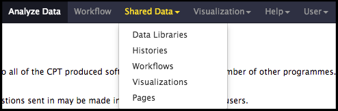
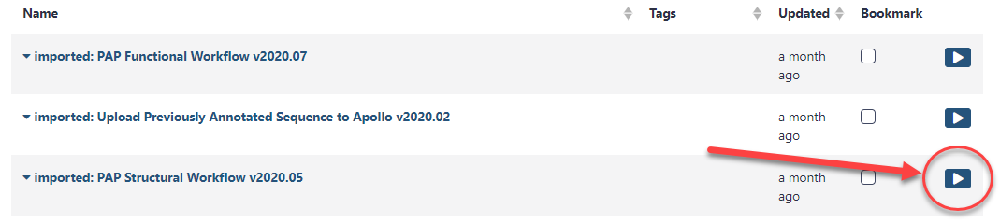
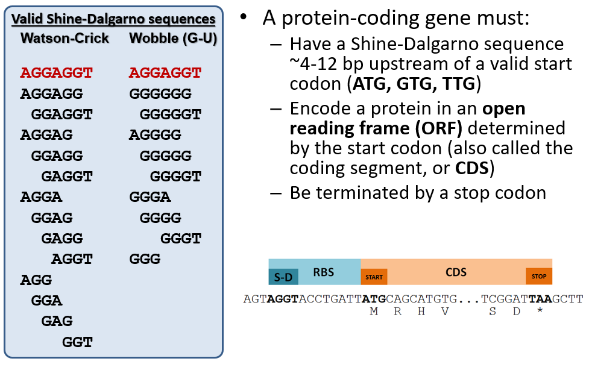
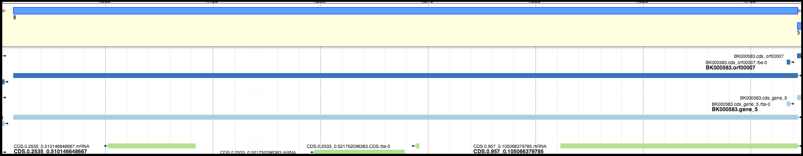
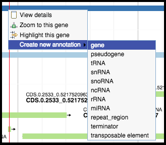
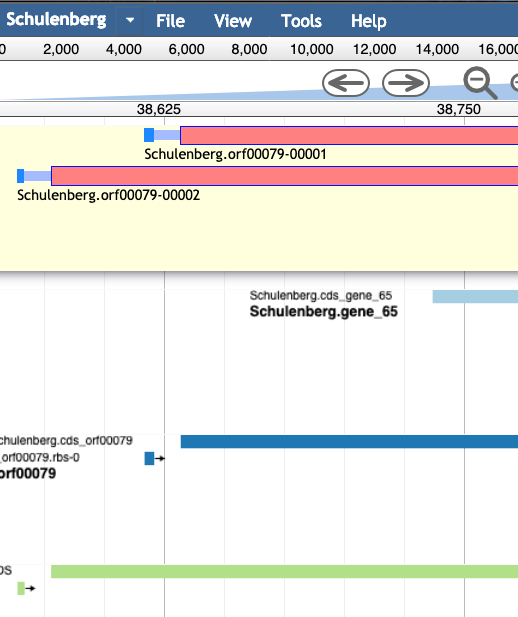

Last updated: Feb. 7, 2024

# Structural Annotation Workflow

This tutorial will walk you through the beginning of the phage genome annotation process: loading your genome into a Galaxy history, running the structural annotation workflow and beginning your structural annotation.

> ### Agenda
>
> 1. Prerequisites
> 2. Importing and Running the Workflow
> 3. Gene calling
>
{: .agenda}

# Prerequisites 
> ###  Are you ready?
> This module assumes you have already completed the following tutorials:
>
> [**Introduction to CPT Galaxy**](https://cpt.tamu.edu/training-material/topics/introduction/tutorials/introduction-to-cpt-galaxy/tutorial.html)
>
> [**Getting Started with Apollo**](https://cpt.tamu.edu/training-material/topics/introduction/tutorials/getting-started-with-apollo/tutorial.html)
{: .hands_on}

To use any workflows in Galaxy, you must have an active account in Galaxy AND Apollo. If you do not have an account at [usegalaxy.eu](https://usegalaxy.eu) you will need to create one. Once this is done, you should also navigate to Apollo while logged in to Galaxy; this will make sure a corresponding Apollo account that is tied to your Galaxy login is generated. Navigate to [usegalaxy.eu/apollo](https://usegalaxy.eu/apollo), it may give you an error saying you don't have access to any organisms in its database, which is fine for now. Once these steps are completed, you should navigate to the main Galaxy page at [phage.usegalaxy.eu](https://phage.usegalaxy.eu) and open an empty history.

> ###  For BICH/GENE 464 Students
> Starting in 2024, we will be running our Phage Genomics course through the Galaxy-Apollo instance at [phage.usegalaxy.eu](https://phage.usegalaxy.eu). You will need to register an account at this site using your **tamu.edu** email address (aka your NetID). You have been assigned a phage genome by name in a spreadsheet in the class Google Drive, in the *Genomics* folder. The class genomes for this year are also stored in the class Google Drive. Locate your genome FASTA file, download it to your computer, and upload it to an empty history in your Galaxy account (see the *Introduction* tutorial on uploading files to Galaxy).
{: .tip}

For all other users, upload or add your phage into an empty history. Your active history should now contain a single dataset: the DNA sequence of your phage in FASTA format.

> ###  Note that…
> The screenshots displayed here may not precisely reflect what you see on your screen. As these are regularly updated, it is likely that the current version year or number is different. Just look for the most recent one.
{: .tip}

# Importing and Running the Workflow

> ### Annotation in a nutshell
Genome annotation is the process of interpreting the raw DNA sequence of a genome into predictions of its function.  Genome annotation can be divided into two major steps: structural and functional. **Structural annotation** is the process of defining the locations and boundaries of features in the genome ("where are the genes?"). **Functional annotation** is the process of assigning functions or predicted phenotypes to the genome features ("what do the genes do?"). 

> ###  For BICH/GENE 464 Students
More details on the principles of these processes will be provided in class.
{: .tip}

The structural annotation workflow will analyze the DNA sequence of the input genome with two automated gene callers: *MetaGeneAnnotator* and *Glimmer3*. A completely naïve set of open reading frames (ORFs) will also be generated from the *GetORFs* prediction program to ensure even unexpected genes can be called. Lastly, tRNA finding tools will be run. To begin, click on the *Shared Data* drop-down menu at the top of the center Galaxy panel and select the *Workflows* option.

The next page will list all the public and shared workflows available on this Galaxy instance. To find the CPT Phage Structural Workflow, use the search box at the top of the page to search for 'CPT' or 'phage'. Look for the most recent version labelled with the year and a version number, e.g. “CPT Phage Structural Workflow v2024.1". Click on the drop-down menu arrow for that most recent structural workflow, and select “Copy.” This will create a copy of the workflow in your Galaxy account. Once the workflow has been imported to your account, you can run it by clicking on the *Workflow* menu item at the top of the center panel of Galaxy. In this list will be all the workflows that can run from this Galaxy account. Find the desired workflow and click on blue button to the right of the title to run it. 

When the Structural workflow has loaded, you will see that this workflow will invoke over twenty separate Galaxy tools to produce the data you will need for structural annotation in Apollo.  There are two parameters that the user **must** set for the workflow to function. You may have to click the "Expand" link to expose the workflow steps.

> * **Step 1: Input Sequence** - This is the DNA sequence you want to annotate. Select the dataset containing the DNA sequence of your phage that you just imported. The tool expects a FASTA-formatted DNA sequence; any other file type will cause a workflow failure.
>   
> * **Step 24: Create or Update Organism** - This is a component of the JBrowse-in-Galaxy system that was discussed in a [previous tutorial]({{ site.baseurl }}//topics/introduction/tutorials/getting-started-with-apollo/tutorial.html). The name typed in the *Organism Common Name* field will be used to define the name of your genome in Apollo for the rest of the annotation process. Enter the name of your phage genome (e.g., "Pokken", "Moby", etc.) in this field. Double-check the spelling! The organism name cannot be changed once it is registered in Apollo. The *Genus* field should be left blank, and other tool options do not need to be adjusted.

Once the proper parameters have been filled out, click the *Run workflow* button found at the top of the page. If the workflow was successful, a message in a green box will appear. Follow any instructions in the message (e.g. a need to refresh the History panel to see the jobs created by the workflow). The structural workflow is not computationally intensive and should complete running in a few minutes.

> ###  Troubleshooting: Dataset/Tool Turns Red
> When a Galaxy tool fails, the dataset in the History column will turn red. If this happens, click on the failed dataset to expand it. Common causes for failures at this step include not specifying the correct input dataset, the inputs dataset not being a properly formatted FASTA DNA sequence file, not entering the organism name in the correct field, or accidentally running the wrong workflow. Clicking on the bug icon will give the user the option to submit a bug report. 
> 
> 
> **Note:** If you are a first-time user and you did not properly register a linked Apollo account, the last few steps of the structural workflow may fail. Make sure that you have tried to access Apollo at least once while logged in to Galaxy to make sure Apollo has registered your account.
{: .comment}

# Gene Calling

When all jobs in the history panel generated by the Structural Annotation Workflow have turned green, the gene calling can begin. First, open the genome in Apollo: 

> * In the last dataset of the history (*Annotate on data XX*), click the eyeball icon to open your genome in Apollo.

> **OR**

> * In a new tab, navigate to Apollo by entering the URL [phage.usegalaxy.eu/apollo](https://phage.usegalaxy.eu/apollo). 

> ###  Troubleshooting: Cookie problems
>Sometimes when trying to access Apollo, you will get a message stating you do not have an Apollo cookie. Cookies are small files stored by your web browser that, among other things, tell which websites you are logged in to. Since Apollo can be accessed from the "main" usegalaxy.eu site and also from subsites like phage.usegalaxy.eu, it can get confused if you most recently logged into Galaxy at the usegalaxy.eu URL but then try to access Apollo from phage.usegalaxy.eu, and vice-versa. If you get a cookie error, try navigating to Apollo by manually editing the URL (e.g., to phage.usegalaxy.eu/apollo or usegalaxy.eu/apollo).
{: .comment}

When the genome has been opened in Apollo, you can begin structural annotation of your genome by examining the outputs of the gene calling tools and promoting the predicted features into genes, which will appear on the yellow *User annotation track* at the top of the Apollo window.

> ###  Working in Apollo
> For help with navigating in Apollo to do things like show and hide evidence tracks, maximize screen space, and create features, see the [Apollo tutorial]({{ site.baseurl }}//topics/introduction/tutorials/getting-started-with-apollo/tutorial.html). 
{: .hands_on}

## Protein-coding Genes

Recall that the primary gene callers *MetaGeneAnnotator* and *Glimmer3* use sophisticated algorithms to predict gene locations and are correct ~90-95% of the time. The *GetORFs* tool is a "dumb" gene caller in that it will detect any open reading frame (ORF) longer than 20 codons with a valid start codon; our workflow will also indicate those that have a valid Shine-Dalgarno (RBS), and you should generally use those only if needed.  *GetORFs* is basically a "backup" tool to annotate genes that may have been missed by both *MetaGeneAnnotator* and *Glimmer3*.

Choose the best gene to call from the evidence tracks considering the start codon, presence of a Shine-Dalgarno sequence, and genome coverage (phage have high coding density and genes often touch or overlap). A summary of phage gene structure is provided below.

For example, in the image below, the light blue and dark blue tracks are a better choice for a gene than the features in the green track; they have a higher genomic coverage and a good Shine-Dalgarno identified.

> ###  Calling Genes
> Right-clicking on a predicted feature in the evidence track will display four options in the menu. Hover over *Create new annotation*, this will display more options. Click on *gene* to create a new gene feature in your genome based on the feature in the evidence track. **All predicted genes in the entire genome must be called before continuing on to the functional annotation.**
>
>
{: .hands_on}

> ###  Gene calling tips
> Phages tend to maximize coding density (the amount of DNA that is occupied by a feature), since the amount of DNA they can fit into their capsid is limited. **Avoid leaving large gaps in your DNA sequence with no gene calls.** 
>
> * If *MetaGeneAnnotator* and *Glimmer3* have left large gaps in the DNA sequence, look in the *GetORFs* track for candidate genes that occupy the gaps and have valid Shine-Dalgarno sequences. 
>
> * If there is a large open reading frame that occupies a gap but does not have a good Shine-Dalgarno sequence, this *may* be worth calling as a gene as well.
>
> * If there are two overlapping predicted genes in the same reading frame, in general you should **choose the longer one** (the one with the first start codon). Take a look at the Shine-Dalgarno sequence too. A shorter gene with an SD closer to consensus might be the one preferred for translation in the cell.

>
>-- Often gene calling programs do not like to call gene starts inside upstream genes, because that is rare in bacteria or eukaryotes. However, phage genes are compressed and very often overlap each other by up to 15 codons or so. Usually there is a *GetORFs* call that will fix this problem. 
>-- In some cases (remember lambda *nu3-C*) there are two start codons far apart, indicating that two different products are made from the same mRNA. Likely this will not be revealed until the Functional workflow, so do not worry about this now. 
>--And, finally, the o-spanin gene (like Lambda *rz1*) is often embedded inside the i-spanin gene (*rz*). Gene calling programs NEVER detect embedded genes like this.  If you have a genome for a phage of a Gram-negative host, be alert for small out-of-frame genes (usually <100 codons) that have a good S-D but are wholly or partially embedded in a bigger gene (usually 130 - 200 codons).    
>
{: .tip}

## tRNA Genes

Some phages encode tRNAs as a part of their genomes, and the workflow uses the tool ARAGORN to predict tRNA genes. By turning on the tRNA evidence track, you can quickly see if your phage is predicted to carry tRNA genes. Some phages encode over 30 tRNAs, and many phages encode none at all. There is little user curation required for the tRNA evidence track; any tRNA genes detected by ARAGORN should be promoted to the *User annotation track* by right-clicking on the evidence feature, selecting *Create new annotation* and then selecting *tRNA*.

If your phage has many tRNAs, they will often occur as small clusters of genes. DNA sequence that is occupied by tRNA genes is extremely unlikely to contain any protein-coding sequence, and tRNA's should generally not overlap protein-coding genes.

# Completion

Once genes have been identified and called across the full length of the genome, the [functional annotation workflow]({{ site.baseurl }}//topics/phage-annotation-pipeline/tutorials/functional-annotation-workflow/tutorial.html) may be executed.

