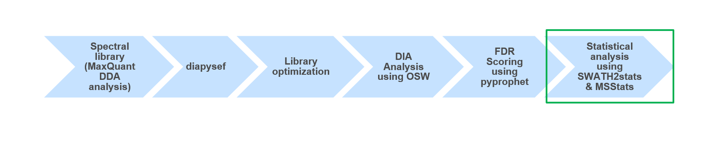
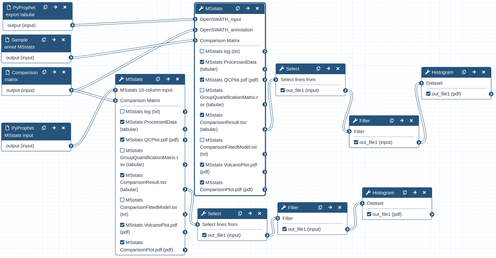

# Introduction


This training covers the statistical analysis of data independent acquisition (DIA) mass spectrometry (MS) data, after successfull identification and quantification of peptides and proteins. We therefore recommend to first go through the [DIA library generation tutorial]({{site.baseurl}}/topics/proteomics/tutorials/DIA_lib_OSW/tutorial.html) as well as the [DIA analysis tutorial]({{site.baseurl}}/topics/proteomics/tutorials/DIA_Analysis_OSW/tutorial.html), which teach the principles and characteristics of DIA data analysis.

Modern mass spectrometry approaches enables the identification and quantification of thousands of proteins and tens of thousands of peptides in single measurements. This provides immense potential to in-depth explorative analysis of a variety of biological samples. However, often the number of available samples is limited leading to large proteomic datasets with only a few numbers of replicates or samples per condition. Thus, the statistical analysis remains challenging in such in-depth proteomic studies.

Here we will use **MSstats**, which enables the statistical analysis and processing of proteomic data ().

> <agenda-title></agenda-title>
>
> In this tutorial, we will cover:
>
> 1. TOC
> {:toc}
>
{: .agenda}

## Get data
> <hands-on-title>Data upload</hands-on-title>
>
> 1. Create a new history for this tutorial and give it a meaningful name
>
>    
>
> 2. Import the DIA analysis results, the sample annotation and the comparison matrix from [Zenodo](https://zenodo.org/record/4307758)
>    ```
>    https://zenodo.org/record/4307758/files/PyProphet_export.tabular
>    https://zenodo.org/record/4307758/files/Sample_annot_MSstats.txt
>    https://zenodo.org/record/4307758/files/Comp_matrix_HEK_Ecoli.txt
>    https://zenodo.org/record/4307758/files/PyProphet_msstats_input.tabular
>    ```
>
>    
>
> 3. Once the files are green, rename the sample annotation file in 'Sample_annot_MSstats', the comparison matrix file in 'Comp_matrix_HEK_Ecoli' and the two DIA analysis results files in 'PyProphet_export' and 'PyProphet_msstats_input'
>
>    
>
{: .hands_on}


# Statistical analysis with **MSstats**

> <hands-on-title>Performing statistical analysis using <b>MSstats</b> and the tabular output from <b>PyProphet export</b></hands-on-title>
>
> 1.  with the following parameters:
>    - *"input source"*: `OpenSWATH`
>        -  *"OpenSWATH_input"*: `PyProphet_export`
>        -  *"OpenSWATH_annotation"*: `Sample_annot_MSstats`
>    - *"Compare Groups"*: `Yes`
>        -  *"Comparison Matrix"*: `Comp_matrix_HEK_Ecoli`
>
>    > <comment-title>data Process and group comparison</comment-title>
>    >During the data process step the peptide intensities are normalized and protein inference is performed. Using a predefined comparison matrix multiple comparisons can be performed.
>    {: .comment}
>
{: .hands_on}


> <question-title></question-title>
>
> 1. How many lines does the PyPyprophet_export.tabular file have? How many lines does the ProcessedData have and do you notice any differences in their structure or format?
> 2. How many proteins were used for the Group comparison? (see ComparisonResult)
>
> > <solution-title></solution-title>
> >
> > 1. The PyPyprophet_export.tabular has appr. 230.000 lines whereas the ProcessedData has over 1 mio lines and is in the so called long format. Here every individual transition (single m/z value) is reported per row.
> > 2. The ComparisonResult has 5022 lines, meaning over 5000 Proteins were compared between the two different Spike-in conditions.
> >
> {: .solution}
>
{: .question}


> <tip-title>Continue with results from Zenodo</tip-title>
>
> In case the **MSstats** run is not yet finished, the results can be downloaded from Zenodo to be able to continue the tutorial
> 1. Import the files from [Zenodo](https://zenodo.org/record/4307758)
>    ```
>    https://zenodo.org/record/4307758/files/MSstats_ComparisonResult_export_tabular.tsv
>    ```
{: .tip}

## Detailed investigation of Ecoli identifications and quantifications

> <hands-on-title>Investigating Ecoli proteins in the MSstats comparison results</hands-on-title>
>
> 1.  with the following parameters:
>    -  *"Select lines from"*: `MSstats_ComparisonResult_export_tabular` (output of **MSstats** )
>    - *"the pattern"*: `(ECOLI)|(log2FC)`
>
> 2.  with the following parameters:
>    -  *"Filter"*: `Select_Ecoli` (output of **Select** )
>    - *"With following condition"*: `c7!='NA'`
>    - *"Number of header lines to skip"*: `1`
>
> 3.  with the following parameters:
>    -  *"Dataset"*: `Filter_Ecoli` (output of the previous **Filter** )
>    - *"Numerical column for x axis"*: `Column: 3`
>    - *"Number of breaks (bars)"*: `25`
>    - *"Plot title"*: `Distribution of Ecoli Protein log FC values`
>    - *"Label for x axis"*: `log2 Fold Change`
>
>
>    > <comment-title>Extracting Ecoli information</comment-title>
>    >First we only select rows containing specific terms such as "Ecoli" from the complete ComparisonResults file. Afterwards, the table is filtered to containg only proteins with valid statistical information (e.g. p-value). Using the log2 Fold change values from all remaining Ecoli proteins we can observe the distribution of log2FC values from the comparison of the two Spike-in conditions.
>    {: .comment}
>
{: .hands_on}

> <question-title></question-title>
>
> 1. How many Ecoli proteins were identified and for how many was the p-value for the comparison of the two Spike-in conditions computed?
> 2. How does the distribution of the log2FC values look like? Which Spike-in contained higher amounts of Ecoli and is it possible to see how much more Ecoli was spiked-in?
>
> > <solution-title></solution-title>
> >
> > 1. In total, over 800 Ecoli proteins were identified from which 500 have a p-value for the comparison of the two Spike-in conditions.
> > 2. We can see a gaussian distribution of the log2FC values around a positive value of 3. Since we compared Spike_in_2 / Spike_in_1 we can directly see that Spike_in_2 contained higher amounts of Ecoli. Furthermore, since the apex of the distribution is around 3 and we compared log2 intensities, we could estimate that Spike_in_2 contained approx. 8-times more Ecoli than Spike_in_1.
> >
> {: .solution}
>
{: .question}


# Statistical analysis with **MSstats**

> <hands-on-title>Performing statistical analysis using <b>MSstats</b> and the msstats_input from <b>PyProphet export</b></hands-on-title>
>
> 1.  with the following parameters:
>    - *"input source"*: `MStats 10 column format`
>        -  *"MSstats 10-column input"*: `PyProphet_msstats_input`
>    - *"Compare Groups"*: `Yes`
>
>
>    > <comment-title>MSstats input format</comment-title>
>    >For the statistical analysis using MSstats the input must be in the long format, containing all relevant information in 10 predefined columns. The conversion of the **PyProphet export** output can either be done using **MSstats** (as we did above), or during the **Pyprophet export** step by using another R package called swath2stats (). Prior to the conversion the data can be processed and filtered using the swath2stats functionalities.
>    {: .comment}
>
{: .hands_on}

> <question-title></question-title>
>
> 1. How many lines does the `PyProphet_msstats_input.tabular` file have? How many lines does the ProcessedData have and do you notice any differences in their structure or format?
> 2. How many proteins were used for the Group comparison? And do you already see a difference to the first **MSstats** step?
>
> > <solution-title></solution-title>
> >
> > 1. The `PyProphet_msstats_input.tabular` has over 870.000 lines and the ProcessedData has over 1 mio lines. Here both files are in the long format, in which every transition is reported per row.
> > 2. Here the ComparisonResult has only 3871 lines, meaning that almonst 1200 fewer proteins were used in the comparison of the two spike-in conditions.
> >
> {: .solution}
>
{: .question}

> <tip-title>Continue with results from Zenodo</tip-title>
>
> In case the **MSstats** run is not yet finished, the results can be downloaded from Zenodo to be able to continue the tutorial
> 1. Import the files from [Zenodo](https://zenodo.org/record/4307758)
>    ```
>    https://zenodo.org/record/4307758/files/MSstats_ComparisonResult_msstats_input.tsv
>    ```
{: .tip}

## Detailed investigation of Ecoli identifications and quantifications

> <hands-on-title>Investigating Ecoli proteins in the MSstats comparison results</hands-on-title>
>
> 1.  with the following parameters:
>    -  *"Select lines from"*: `MSstats_ComparisonResult_msstats_input` (output of the second **MSstats** )
>    - *"the pattern"*: `(ECOLI)|(log2FC)`
>
> 2.  with the following parameters:
>    -  *"Filter"*: `Select_Ecoli` (output of the second **Select** )
>    - *"With following condition"*: `c7!='NA'`
>    - *"Number of header lines to skip"*: `1`
>
> 3.  with the following parameters:
>    -  *"Dataset"*: `Filter_Ecoli` (output of the previous **Filter** )
>    - *"Numerical column for x axis"*: `Column: 3`
>    - *"Number of breaks (bars)"*: `25`
>    - *"Plot title"*: `Distribution of Ecoli Protein log FC values`
>    - *"Label for x axis"*: `log2 Fold Change`
>
>
>
{: .hands_on}


> <question-title></question-title>
>
> 1. How many Ecoli proteins were identified and for how many was the p-value for the comparison of the two Spike-in conditions computed? Are there any differences compared to the selected and filtered results from the previous **MSstats** step?
> 2. How does the distribution of the log2FC values look like? Are there any differences compared to the selected and filtered results from the previous **MSstats** step?
>
> > <solution-title></solution-title>
> >
> > 1. In total, over 600 Ecoli proteins were identified from which 500 have a p-value for the comparison of the two Spike-in conditions. Here we identify 200 Ecoli proteins less than before, however, the number of proteins for which a p-value was calculated differs only slightly.
> > 2. Generally, the two log2FC distribution look very similar, showing a gaussian distribution of the log2FC values around a positive value of 3. There seems to be a slight difference of the apex of the distribution, in the first **MSstats** analysis it seems to be higher than 3, whereas in the second **MSstats** analysis the apex seems to be lower than 3.
> >
> {: .solution}
>
{: .question}


# Conclusion




Using **MSstats** we were able to identify and quantify differentially regulated proteins between two Spike-in conditions in a HEK/Ecoli Benchmark DIA datatset. Furthermore, the preprocessing of the proteomic data prior to the statistical analysis can directly impact results. Thus, it might be beneficial to try various ways of intermediate data processing and statistical analysis to increase the sensitivity and specificity of the investigation.


