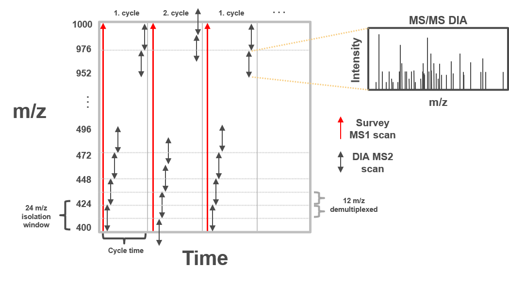
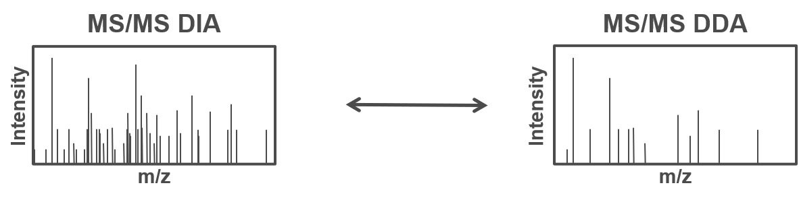
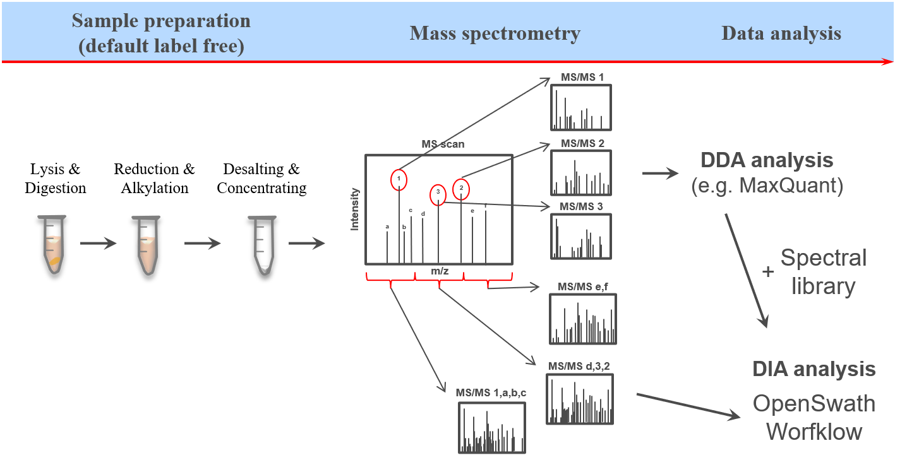
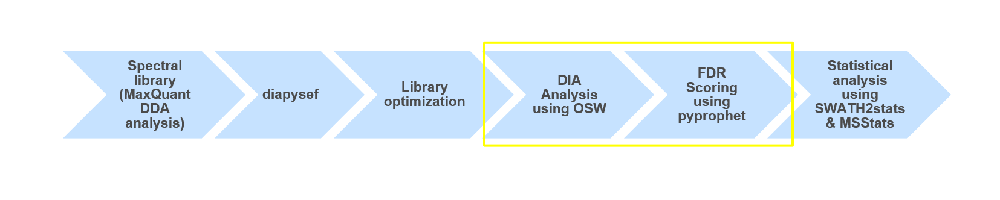
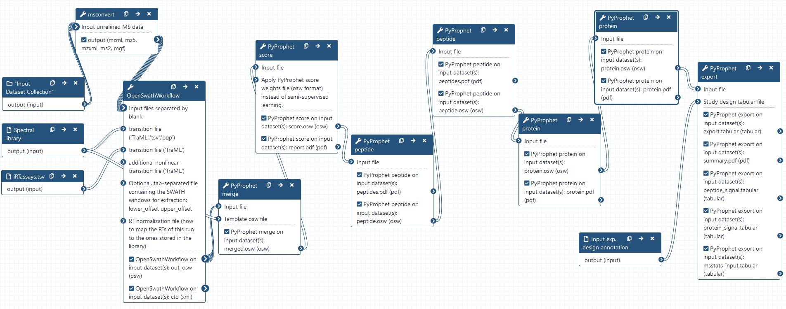

# Introduction


This training covers data independent acquisition (DIA) mass spectrometry (MS) applying spectral libraries for peptide identification and quantification.
You can learn how to prepare and optimize a spectral library for the analysis of DIA data in the[DIA library generation tutorial]({{site.baseurl}}/topics/proteomics/tutorials/DIA_lib_OSW/tutorial.html).

The proteome refers to the entirety of proteins in a biological system (e.g cell, tissue, organism). Proteomics is the large-scale experimental analysis of proteins and proteomes, most often performed by mass spectrometry that enables great sensitivity and throughput. Especially for complex protein mixtures, bottom-up mass spectrometry is the standard approach. In bottom-up proteomics, proteins are digested with a specific protease into peptides and the measured peptides are in silico reassembled into the corresponding proteins. Inside the mass spectrometer, not only the peptides are measured (MS1 level), but the peptides are also fragmented into smaller peptides which are measured again (MS2 level). This is referred to as tandem-mass spectrometry (MS/MS). Identification of peptides is performed by peptide spectrum matching of the theoretical spectra generated from the input protein database (fasta file) with the measured MS2 spectra. Peptide quantification is most often performed by measuring the area under the curve of the MS1 level peptide peaks, but special techniques such as TMT allow to quantify peptides on MS2 level. Nowadays, bottom-up tandem-mass spectrometry approaches allow for the identification and quantification of several thousand proteins.

In clinical proteomic studies often two or more conditions should be compared against each other, thus focusing on the proteins which were found in all conditions. Using the data dependent acquisition (DDA) approach could lead to limited numbers of cumulative proteins, due to method instrinsic dependencies (e.g. if the same peptides is selected for fragmentation in all measurements).
Over the last decade another acquisition method has been developed addressing the urgent need for increased cumulatively identified and quantified peptides and proteins across multiple measurements (). The so called data independent acquisition (DIA) circumvents the time and abundance dependent selection for fragmentation by using predefined fragmentation windows (m/z windows) going through the whole m/z range of the previous MS1 scan.



Therefore, all peptides which are present in the same m/z window at the same time are fragmented simultaneously and a MS2 spectra containing fragments from multiple peptides is acquired. Using the same m/z windows for all measurements, results in more reproducible fragmentation and potential identification across multiple measurements.
However, the resulting MS2 spectra contain fragments from multiple peptides and are often more complex and do not allow to directly link a specific (m/z) mass from the MS1 to a single MS2 fragment spectra.


To allow for the identification of peptides in those ambiguous MS2 spectra, a spectral library can be used. The spectral library contains experimentally measured  MS2 spectra, which are specific for one precursor (from previous DDA measurements). In more recent approaches the MS2 spectra can be predicted based on theoretical peptide sequences (e.g. from a protein database).


One of the open-source software options for DIA data analysis is *OpenSwath* (), which requires a spectral library, retention time alignment peptides as well as the DIA MS data.

The dataset in this tutorial consists of two different Spike-in mixtures of human and Ecoli peptides, with an increase of the Ecoli peptides in one of the Spike-ins. For each Spike-in there a four replicate measurements to allow for statistical analysis later on. Here we will go through the data analysis of DIA mass spectrometry data and will get first impressions on which of the Spike-ins might contain higher amounts of Ecoli peptides.


> <agenda-title></agenda-title>
>
> In this tutorial, we will cover:
>
> 1. TOC
> {:toc}
>
{: .agenda}

## Get data

> <hands-on-title>Data upload</hands-on-title>
>
> 1. Create a new history for this tutorial and give it a meaningful name
>
>    
>
> 2. Import the fasta and raw files as well as the sample annotation and the iRT Transition file from [Zenodo](https://zenodo.org/record/4307762)
>    ```
>    https://zenodo.org/record/4307762/files/HEK_Ecoli_lib.pqp
>    https://zenodo.org/record/4307762/files/iRTassays.tsv
>    https://zenodo.org/record/4307762/files/Sample_annotation.txt
>    https://zenodo.org/record/4307762/files/Sample1.raw
>    https://zenodo.org/record/4307762/files/Sample2.raw
>    https://zenodo.org/record/4307762/files/Sample3.raw
>    https://zenodo.org/record/4307762/files/Sample4.raw
>    https://zenodo.org/record/4307762/files/Sample5.raw
>    https://zenodo.org/record/4307762/files/Sample6.raw
>    https://zenodo.org/record/4307762/files/Sample7.raw
>    https://zenodo.org/record/4307762/files/Sample8.raw
>    ```
>
>    
>
> 3. Once the files are green, rename the sample annotation file in 'Sample_annotation', the spectral library in 'HEK_Ecoli_lib', the iRT transition file in 'iRTassays' and the raw files in 'Sample1.raw', 'Sample2.raw', 'Sample3.raw', 'Sample4.raw', 'Sample5.raw', 'Sample6.raw', 'Sample7.raw' and 'Sample8.raw'
>
>    
>
> 4. Generate a collection for all .raw files (and name it DIA_data)
>
>    
>
{: .hands_on}

# raw File conversion with **msconvert**

> <hands-on-title>Converting vendor specific raw to open mzML format</hands-on-title>
>
> 1.  with the following parameters:
>    -  *"Input unrefined MS data"*: `DIA_data`
>    - *"Do you agree to the vendor licenses?"*: `Yes`
>    - *"Output Type"*: `mzML`
>    - In *"Data Processing Filters"*:
>        - *"Apply peak picking?"*: `Yes`
>        - *"Demultiplex overlapping or MSX spectra"*: `Yes`
>            - *"Optimization"*: `Overlap only`
>    - In *"General Options"*:
>        - *"SIM as Spectra"*: `Yes`
>        - *"Ignore unknown instrument error"*: `Yes`
>    - In *"Output Encoding Settings"*:
>        - *"Intensity Encoding Precision"*: `64`
>
>
>    > <comment-title>Demultiplexing</comment-title>
>    >Demultiplexing is needed when the MS2 m/z windows of consecutive scan cycles are overlapping e.g. for the staggered approach (50% shift between the cycles).
>    {: .comment}
>
{: .hands_on}


# DIA analysis using **OpenSwathWorkflow**

> <hands-on-title>DIA analysis using OpenSwathWorkflow</hands-on-title>
>
> 1.  with the following parameters:
>    -  *"Input files separated by blank"*: `DIA_data` (output of **msconvert** )
>    -  *"transition file ('TraML','tsv','pqp')"*: `HEK_Ecoli_lib`
>    -  *"transition file ('TraML')"*: `iRTassays`
>    - *"Extraction window in Thomson or ppm (see mz_extraction_window_unit)"*: `10.0`
>    - *"Extraction window used in MS1 in Thomson or ppm (see mz_extraction_window_ms1_unit)"*: `10.0`
>    - In *"Parameters for the RTNormalization for iRT petides"*:
>        - *"Which outlier detection method to use (valid: 'iter_residual', 'iter_jackknife', 'ransac', 'none')"*: `none`
>        - *"Whether the algorithms should try to choose the best peptides based on their peak shape for normalization"*: `Yes`
>        - *"Minimal number of bins required to be covered"*: `7`
>    - In *"Scoring parameters section"*:
>        - In *"TransitionGroupPicker"*:
>            - *"Minimal peak width (s), discard all peaks below this value (-1 means no action)"*: `5.0`
>            - *"Tries to compute a quality value for each peakgroup and detect outlier transitions"*: `Yes`
>        - In *"Scores"*:
>            - *"Use the MI (mutual information) score"*: `No`
>    - *"Advanced Options"*: `Show Advanced Options`
>        - *"Output an XIC with a RT-window by this much large"*: `100.0`
>        - *"Extraction window used for iRT and m/z correction in Thomson or ppm (see irt_mz_extraction_window_unit)"*: `10.0`
>        - *"Whether to run OpenSWATH directly on the input data, cache data to disk first or to perform a datareduction step first"*: `cacheWorkingInMemory`
>        - *"Use the retention time normalization peptide MS2 masses to perform a mass correction (linear, weighted by intensity linear or quadratic) of all spectra"*: `regression_delta_ppm`
>    - *"Optional outputs"*: `out_osw`
>
>    > <comment-title>Mass tolerances and "Minimal number of bins required to be covered"</comment-title>
>    >Here we analyze data acquired on a QExactive Plus MS instrument which uses an Orbitrap and generates high resolution data. Therefore, we allow for 10 ppm mass tolerance for both the MS1 and the MS2 level. If larger mass deviation are expected the mass tolerances can be adjusted. Other instrumentation (such as TOF devices) might require larger mass tolerances for improved peptide identification. Furthermore, here we require at least 7 of the iRT peptides to be found in each of the DIA measurements. This number can be set to lower values if for some reasons fewer iRT peptides were found in some of the measurements. In case only a few iRT peptides are identified in the DIA measurements, the mass tolerance for the iRT extraction can be increased to 20 ppm. We than recommend to increase the extraction window for the MS2 level to 20 ppm. For more information see also [OpenSwathWorkflow](http://openswath.org/en/latest/docs/openswath.html).
>    {: .comment}
>
{: .hands_on}


## Combining osw results using **PyProphet merge**

> <hands-on-title>Combining the individual osw results with pyprophet merge</hands-on-title>
>
> 1.  with the following parameters:
>    -  *"Input file"*: `out_osw` (output of **OpenSwathWorkflow** )
>    -  *"Template osw file"*: `HEK_Ecoli_lib`
>
{: .hands_on}


# FDR estimation using **PyProphet score**

> <hands-on-title>Semi-supervised learning and scoring of OpenSwathWorkflow results</hands-on-title>
>
> 1.  with the following parameters:
>    -  *"Input file"*: `merged.osw` (output of **PyProphet merge** )
>    - *"Either a 'LDA' or 'XGBoost' classifier is used for semi-supervised learning"*: `XGBoost`
>
>    > <comment-title>FDR scoring using pyprophet score</comment-title>
>    >During this step q-values corresponding to the FDR of peak identification is estimated with pyprophet. Typically this is the most time consuming step due to the involved maschine learning processes. To decrease the input size one can use **PyProphet subsample** to randomly select subsets of the identifications from each run in the merged.osw (**PyProphet merge** output). In this case, the FDR estimation needs to be applied on the full merged.osw afterwards using the scored subsample.osw in the *"Apply PyProphet score weights file (osw format) instead of semi-supervised learning."* section of **PyProphet score**. The generated report.pdf is helpful to identify potential errors as well as get first insights on the quality of the identifications.
>    {: .comment}
>
{: .hands_on}

> <tip-title>Continue with results from Zenodo</tip-title>
>
> In case the pyprophet score run is not yet finished, the results can be downloaded from Zenodo to be able to continue the tutorial
> 1. Import the files from [Zenodo](https://zenodo.org/record/4307762)
>    ```
>    https://zenodo.org/record/4307762/files/PyProphet_score_report.pdf
>    https://zenodo.org/record/4307762/files/PyProphet_score.osw
>    ```
{: .tip}

> <question-title></question-title>
>
> 1. Does the distribution of target identifications differ from the decoy distribution?
> 2. Is the observed distribution of decoy and target identifications expected?
>
> > <solution-title></solution-title>
> >
> > 1. Yes, we can see a clearly different distribution of the target identification and the decoys. Both, target and decoy distribution were highest around 0. However, the target distribution shows a second peak at positiv d-score values.
> > 2. The decoy identifications show a Gaussian distribution around 0 which could be explained by the fact that the decoy sequences were randomly generated alterations from the target sequences in the spectral library (see [DIA library generation tutorial]({{site.baseurl}}/topics/proteomics/tutorials/DIA_lib_OSW/tutorial.html)). Most target identifications show also d-scores around 0, thus reflect potential false positive identifications. Only the distribution of target identifications shows a second increase in higher d-score values, representing more confident identifications.
> >
> {: .solution}
>
{: .question}


## Apply scores with **PyProphet peptide**

> <hands-on-title>Conduct peptide inference in experiment-wide and global context</hands-on-title>
>
> 1.  with the following parameters:
>    -  *"Input file"*: `score.osw` (output of **PyProphet score** )
>    - *"Context to estimate protein-level FDR control"*: `experiment-wide`
>
> 2.  with the following parameters:
>    -  *"Input file"*: `peptide.osw` (output of **PyProphet peptide** )
>    - *"Context to estimate protein-level FDR control"*: `global`
>
>
{: .hands_on}


## Apply scores with **PyProphet protein**

> <hands-on-title>Conduct protein inference in experiment-wide and global context</hands-on-title>
>
> 1.  with the following parameters:
>    -  *"Input file"*: `peptide.osw` (output of the second **PyProphet peptide** )
>    - *"Context to estimate protein-level FDR control"*: `experiment-wide`
>
> 2.  with the following parameters:
>    -  *"Input file"*: `protein.osw` (output of **PyProphet protein** )
>    - *"Context to estimate protein-level FDR control"*: `global`
>
{: .hands_on}

> <question-title></question-title>
>
> 1. How does the score distribution differ between the peptide and the protein inference (in global context)?
> 2. What could be the reason for this difference?
>
> > <solution-title></solution-title>
> >
> > 1. The d-score distribution and the ROC curve for the protein inference shows better target decoy discriminatory ability than for the peptide inference.
> > 2. The probabilty of multiple decoy peptides from the same protein having a high score is lower than for multiple target peptides from the same protein. Thus, the discriminatory scores on protein level are higher.
> >
> {: .solution}
>
{: .question}


## Exporting the results with **PyProphet export**

> <hands-on-title>Exporting pyprophet scored OSW results</hands-on-title>
>
> 1.  with the following parameters:
>    -  *"Input file"*: `protein.osw` (output of the second **PyProphet protein** )
>    - *"Export format, either matrix, legacy_split, legacy_merged (mProphet/PyProphet) or score_plots format"*: `legacy_merged`
>    - *"Use swath2stats to export file for statsics"*: `yes`
>        -  *"Study design tabular file"*: `Sample_annotation`
>
>    > <comment-title>PyProphet export and the swath2stats functionality</comment-title>
>    >All previous FDR scoring steps using **PyProphet peptide** and **PyProphet protein** are integrated in the respective `.osw` output. Therefore, the latest `protein.osw` can be used for the export step. If peptide and protein FDR scoring was performed in the global context, the exported results will be filtered to 1% FDR by default. For more information see also [PyProphet](http://openswath.org/en/latest/docs/pyprophet.html). Utilizing the swath2stats functionality generates a summary as well as a peptide and protein expression matrix. In addition to the non-processed pyprophet tabular output a refined tabular is generated using the specified criteria. The refined tabular `msstats_input.tabular` is dircetly compatable with **MSstats** for statistical analysis. The integration of swath2stats also allows to adjust the processing by applying different FFT and FDR settings as well as specifying a minimum number of peptides per protein. For more information see also [Swath2stats](https://bioconductor.org/packages/release/bioc/html/SWATH2stats.html).
>    {: .comment}
>
{: .hands_on}

> <question-title></question-title>
>
> 1. How many different peptides and proteins were identified and quatified?
> 2. Could you already tell from the summary which Spike-in contained higher amounts of Ecoli peptides?
>
> > <solution-title></solution-title>
> >
> > 1. In total, over 27,300 peptides and over 5,100 proteins were identified and quantified in the DIA measurements.
> > 2. No, the summary mainly provides an overview of the identifications in each individual DIA measurement as well as some descriptive statistics such as CVs and correlations.
> >
> {: .solution}
>
{: .question}

> <hands-on-title>Hands-On: Analysis of Ecoli Spike-in</hands-on-title>
>
> 1.  with the following parameters:
>    -  *"Select lines from"*: `protein_signal.tabular` (output of **PyProphet export** )
>    - *"that"*: `Matching`
>    - *"the pattern"*: `(ECOLI)|(Spike_in)`
>
{: .hands_on}

> <question-title></question-title>
> 1. How many Ecoli proteins were identified and quantified in the six DIA measurements?
> 2. Can you guess which Spike-in contains higher amounts of Ecoli peptides?
>
> > <solution-title></solution-title>
> > 1. Over 800 Ecoli proteins were identified and quantified in the six DIA measurements.
> > 2. It seems that the samples in Spike_in_2 contained higher amounts of Ecoli peptides than the samples in Spike_in_1.
> {: .solution }
{: .question}


# Conclusion




Using **OpenSwathWorkflow** and a spectral library (from DDA data) we were able to analyze data independent acquisition (DIA) data. Furthermore, we were able to process the FDR scored results and take a guess on which Spike-in contained higher amounts of Ecoli. To further investigate the two different Spike-in amounts as well as getting a significant result we would need to perform statistical analysis e.g. using **MSstats**.


