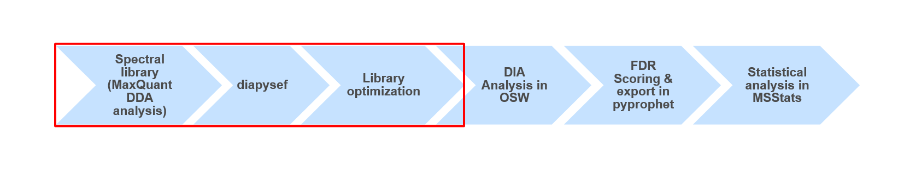
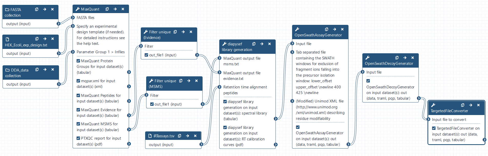

# Introduction


The proteome refers to the entirety of proteins in a biological system (e.g cell, tissue, organism). Proteomics is the large-scale experimental analysis of proteins and proteomes, most often performed by mass spectrometry that enables great sensitivity and throughput. Especially for complex protein mixtures, bottom-up mass spectrometry is the standard approach. In bottom-up proteomics, proteins are digested with a specific protease into peptides and the measured peptides are in silico reassembled into the corresponding proteins. Inside the mass spectrometer, not only the peptides are measured (MS1 level), but the peptides are also fragmented into smaller peptides which are measured again (MS2 level). This is referred to as tandem-mass spectrometry (MS/MS). Identification of peptides is performed by peptide spectrum matching of the theoretical spectra generated from the input protein database (fasta file) with the measured MS2 spectra. Peptide quantification is most often performed by measuring the area under the curve of the MS1 level peptide peaks, but special techniques such as TMT and DIA allow to quantify peptides on MS2 level. Nowadays, bottom-up tandem-mass spectrometry approaches allow for the identification and quantification of several thousand proteins.

To enable the identification and quantification of such high numbers of proteins in a time-wise limited measurement there has been a lot of MS method and data acquisition optimization. The most commonly used technique is the data dependent acquisition (DDA). Here only the most abundant (top N) peptides from each MS1 scan are selected for subsequent fragmentation, with the most promising chance for successful identifications due to high intensity signals. Afterwards the respective mass over charge (m/z) values are set on an exclusion list enabling the selection of less abundant peptides from the following MS1 scan for the next cycle of top N fragmentation (MS2) scans. However, since this acquisition method is highly dependent on the abundance of the respective peptides at a given retention time this method is referred to as data dependent acquisition (DDA). This dependency on both time as well as intensity leads to measurement specific identifications between multiple measurements.

Another more recently developed method is the so called data independent acquisition (DIA). However due to some unique characteristics of this acquisition method it requieres spectral libraries, which contain the peptide sequences as well as their respective fragment spectrum (MS2) information.
Here we will use DDA data from the same samples to build a spectral library which can than be used for the identification of peptides in data independent acquisition (DIA) data from the same samples using e.g. OpenSwathWorkflow [OpenSwathworkflow tutorial]({{site.baseurl}}/topics/proteomics/tutorials/DIA_Analysis_OSW/tutorial.html).

. Principles of data dependent acquisition (DDA).")

High quality spectral libraries can be generated by fractionation and separate measurment of a representative sample or mixture for a cohort. During the analysis the peptide and protein identifications of all fractions can than be combined into comprehensive spectral libraries. Here the spectral libraries tend to be relativly large offering great sensitivity (even to low abundant peptides), but also contain peptides which are only observable due to the prior fractionation.
Another way of generating spectral libraries is by measuring the same samples using DDA as well as using DIA. Here the DDA results will be analyzed and sample specific spectral library is generated which can than be used for the analysis of the DIA data. The resulting spectral libraries are often smaller and contain only peptides which are observable in complex and non-fractionated samples.

A plethora of software solutions were developed for the analysis of DDA proteomics data. MaxQuant is one of the most popular proteomics softwares because it is an easy to use and free software that offers functionalities for nearly all kinds of proteomics data analysis challenges . Mass spectrometry raw data is normally obtained in a vendor specific, proprietary file format. MaxQuant can directly take those raw files as input. For peptide identification MaxQuant uses a search engine called "Andromeda".

The dataset in this training consists of different Spike-in mixtures of stable amounts of human peptides and different amounts of Ecoli peptides. Each sample reflects a non-fractionated MS measurement (DDA) of different Spike-in ratios. To faciliate the analysis and directly combine the identifications of all measurements, we will define the different measurements as fractions of one sample, as it would be the case for e.g. high pH, SCX or HILIC fractionated samples.

> <agenda-title></agenda-title>
>
> In this tutorial, we will cover:
>
> 1. TOC
> {:toc}
>
{: .agenda}

## Get data

> <hands-on-title>Data upload</hands-on-title>
>
> 1. Create a new history for this tutorial and give it a meaningful name
>
>    
>
> 2. Import the fasta and raw files as well as the experimental annotation and the iRTassays file from [Zenodo](https://zenodo.org/record/4293493)
>    ```
>    https://zenodo.org/record/4293493/files/Human_database_plus_iRT.fasta
>    https://zenodo.org/record/4293493/files/Ecoli_database.fasta
>    https://zenodo.org/record/4293493/files/iRTassays.tsv
>    https://zenodo.org/record/4293493/files/HEK_Ecoli_exp_design.txt
>    https://zenodo.org/record/4293493/files/Sample1.raw
>    https://zenodo.org/record/4293493/files/Sample2.raw
>    https://zenodo.org/record/4293493/files/Sample3.raw
>    https://zenodo.org/record/4293493/files/Sample4.raw
>    https://zenodo.org/record/4293493/files/Sample5.raw
>    ```
>
>    
>
> 3. Once the files are green, rename the experimental design file in 'HEK_Ecoli_exp_design', the iRT transition file in 'iRTassays' and all of the the raw files in 'Sample1.raw', 'Sample2.raw', 'Sample3.raw', 'Sample4.raw' and 'Sample5.raw'
>
>    
>
> 5. Once the files are green, generate a collection for all .raw files (and name it DDA_data) as well as for both .fasta files (and name it FASTA)
>
>    
>
{: .hands_on}

# **MaxQuant** Analysis of DDA data

The MaxQuant Galaxy implementation contains the most important MaxQuant parameters. As an alternative, **MaxQuant (using mqpar.xml)**  can be used with a preconfigured mqpar.xml file.

> <hands-on-title>MaxQuant Analysis</hands-on-title>
>
> 1.  with the following parameters:
>    - In *"Input Options"*:
>        -  *"FASTA files"*: `FASTA` collection
>        - *"identifier parse rule"*: `>([^ ]*)`
>        - *"description parse rule"*: `^>.*\|.*\|[^ ]+ (.*) OS.*$`
>    - In *"Search Options"*:
>        -  *"Specify an experimental design template"*: `HEK_Ecoli_exp_design.txt`
>        - *"minimum unique peptides"*: `1`
>        - *"Match between runs"*: `Yes`
>    - In *"Protein quantification"*:
>        - *"Use only unmodified peptides"*: `No`
>    - In *"Parameter Group"*:
>        -  *"Infiles"*: `DDA_data` collection
>            - *"missed cleavages"*: `1`
>            - *"variable modifications"*: `Oxidation (M)`
>    - *"Generate PTXQC (proteomics quality control pipeline) report? (experimental setting)"*: `Yes`
>    - In *"Output Options"*:
>        - *"Select the desired outputs."*: `Protein Groups` `Peptides` `mqpar.xml` `Evidence` `MSMS`
>
>    > <comment-title>Protein Groups</comment-title>
>    > Proteins that share all their peptides with other proteins cannot be unambiguously identified. Therefore, MaxQuant groups such proteins into one protein group and only one common quantification will be calculated. The different protein properties are separated by semicolon.
>    {: .comment}
>
{: .hands_on}

Here we used a variation of the *"identifier parse rule"* to allow for the organism label to be present in the spectral library. For investigations of single organisms and to keep only the Uniprot identifier one can adjust the *"identifier parse rule"* accordingly
More details on the different **MaxQuant** parameters can be found in this [MaxQuant tutorial]({{site.baseurl}}/topics/proteomics/tutorials/maxquant-label-free/tutorial.html).

> <tip-title>Continue with results from Zenodo</tip-title>
>
> In case the MaxQuant run is not yet finished, the results can be downloaded from Zenodo to be able to continue the tutorial
> 1. Import the files from [Zenodo](https://zenodo.org/record/4293493)
>    ```
>    https://zenodo.org/record/4293493/files/MaxQuant_PTXQC_report.pdf
>    https://zenodo.org/record/4293493/files/MaxQuant_Protein_Groups.tabular
>    https://zenodo.org/record/4293493/files/MaxQuant_Peptides.tabular
>    https://zenodo.org/record/4293493/files/MaxQuant_Evidence.tabular
>    https://zenodo.org/record/4293493/files/MaxQuant_MSMS.tabular
>    https://zenodo.org/record/4293493/files/MaxQuant_mqpar.xml
>    ```
{: .tip}

## Quality control results

To get a first overview of the MaxQuant results, the PTXQC report is helpful. Click on the  eye of the PTXQC pdf file to open it in Galaxy. Screening through the different plots might already give you a hint on how many peptides and proteins were identified as well as some of the data quality.

The PTXQC software () was built to enable direct proteomcs quality control from MaxQuant result files. This quality control can be directly used in the Galaxy MaxQuant wrapper by setting *"Generate PTXQC"* to `yes`. This will generate a pdf file with multiple quality control plots. Be aware that the cutoffs set in PTXQC might not be applicable to your experiment and mass spectrometer type and therefore "under performing" and "fail" do not necessarily mean that the quality is poor.

> <question-title></question-title>
>
> 1. How many proteins were found in total?
> 2. How many peptides were found in total?
>
>
> > <solution-title></solution-title>
> > 1. Approximately 5,370 proteins were found (see ProteinGroups output)
> > 2. Approximately 34,970 peptides were found (see Peptides output)
> >
> {: .solution}
>
{: .question}


## **Filter** for unique peptides in the *evidence* and *msms* output

> <hands-on-title>Filtering the <b>MaxQuant</b> search results for unique peptides</hands-on-title>
>
> 1.  with the following parameters:
>        -  *"Infile"*: `MaxQuant_Evidence`
>    - *"With following condition"*: `len(c9.split(';')) < 2`
>    - *"Number of header lines to skip"*: `1`
>
> 2.  with the following parameters:
>        -  *"Infile"*: `MaxQuant_MSMS`
>    - *"With following condition"*: `len(c12.split(';')) < 2`
>    - *"Number of header lines to skip"*: `1`
>
>    > <comment-title>Unique Features / peptides</comment-title>
>    > Peptides which only occur in one protein are considered as unique for this specific protein. To avoid ambigious protein mapping later we filter the **MaxQuant** search results for unique peptides only. CAUTION: This increase in specificity (each peptide originates from only one protein) will reduce the size of the spectral library and might lead to decreased sensitivity  during the DIA analysis.
>    {: .comment}
>
{: .hands_on}

> <question-title></question-title>
>
> 1. How many unique features per lines remain after the filtering in the evidence and the msms output?
>
> > <solution-title></solution-title>
> >
> > 1. ~100,000 lines in the evidence and ~98,000 lines in the msms.
> >
> {: .solution}
>
{: .question}


# **diapysef library generation**

> <hands-on-title>Generation of a spectral library using the unique <b>MaxQuant</b> search results and indexed retention time <i>iRT</i> peptides</hands-on-title>
>
> 1.  with the following parameters:
>    - In *"MaxQuant output file msms.txt*:
>        -  *"Infile"*: `Filter on MaxQuant_MSMS`
>    - In *"MaxQuant output file evidence.txt*:
>        -  *"Infile"*: `Filter on MaxQuant_Evidence`
>    - In *"Retention time alignment method"*:
>        -  *"Infile"*: `iRTassays.tsv`
>
>    > <comment-title>Indexed retention time <i>iRT</i> peptides</comment-title>
>    >To allow for improved alignement of the different measurements, synthetic (non-endogenous) peptides which were spiked-in to all samples prior to the MS measurement. First the measured retention times (RTs) of those spiked-in peptides are extracted in the **MaxQuant** search results. Using the measured RTs as well as arbitrary assigned values (ranging from -26 to 99) a linear regression through the 11 synthetic peptides is applied.  Based on this linear regression fit *indexed* retention times (iRTs) are assigned to all other peptides.
>    {: .comment}
>
{: .hands_on}


> <question-title></question-title>
>
> 1. How many of the 11 synthetic peptides were found in the first DDA (Sample1) file?
> 2. How many were found in the second DDA (Sample2) file?
>
> > <solution-title></solution-title>
> >
> > 1. 8 iRT peptides were found in the first DDA file
> > 2. 9 iRT peptides were found in the second DDA file
> >
> {: .solution}
>
{: .question}

# Spectral library refinement with **OpenSwathAssayGenerator**

> <hands-on-title>Spectral library optimization and refinement using <b>OpenSwathAssayGenerator</b></hands-on-title>
>
> 1.  with the following parameters:
>    - *"Output file type -- default: determined from file extension or content"*: `tabular (tsv)`
>    - *"MZ threshold in Thomson for precursor ion selection"*: `0.015`
>    - *"upper MZ limit for precursor ions"*: `1000.0`
>    - *"MZ threshold in Thomson for fragment ion annotation"*: `0.015`
>
>
>    > <comment-title>Adjustment of the Spectral library</comment-title>
>    > The spectral library coming from **diapysef library generation** contains all observed fragment ions from the DDA runs resulting in a relativly large spectral library. Large libraries can lead to inceased processing times as well as fewer identifications after adjusting based on the False Discovery Rate (FDR). Thus, it is recommened to optimize and refine the spectral library by e.g. filtering for peptides with at least 6 transitions (increased confidence) and limiting the maximum also to 6 transitions (avoiding inflated libraries). Furthermore, the scan range can be adjusted (here between 400 - 1000 m/z) covering the same m/z range as in the DIA measurements.
>    {: .comment}
>
{: .hands_on}


> <question-title></question-title>
>
> 1. How many transitions does the refined spectral library contain and how many were removed?
>
> > <solution-title></solution-title>
> >
> > 1. The refined library contains ~170,000 lines, and almost 700,000 lines were removed.
> >
> {: .solution}
>
{: .question}

# Adding decoy sequences with **OpenSwathDecoyGenerator**

> <hands-on-title>Adding <i>decoy</i> transitions to the spectral library</hands-on-title>
>
> 1.  with the following parameters:
>    - *"Output file type -- default: determined from file extension or content"*: `tabular (tsv)`
>    - *"Advanced Options"*: `Show Advanced Options`
>        - *"MZ threshold in Thomson for fragment ion annotation"*: `0.015`
>
>    > <comment-title><i>Decoy</i> transitions</comment-title>
>    > To enable correct false discovery rate (FDR) computation later on, we add computanionally generated decoy sequences to the spectral library. Those "non-observed" sequences can be generated based on the observed sequences with slight modifications. The most commonly used methods are either **shuffle** (randomly altering the amino acid sequence of each observed transition) or **reverse** (by reversing the actually obeserved transitions). Those artificially generated transitions were labelled as **decoy** and are later on considered as known false positives.
>    > Example: By applying an FDR of 1 % we only allow for e.g only 1 such decoy transition out of 100 identifications. Thus one could estimate that the remaining 99 non-labeled identifications contain also 1 % false positive hits.
>    {: .comment}
>
{: .hands_on}

> <question-title></question-title>
>
> 1. How many lines do you expect after running the **OpenSwathDecoyGenerator** on your spectral library containing only observed transitions?
>
> > <solution-title></solution-title>
> >
> > 1. We expect double the amount of lines (~340,000), since we generate one *decoy* (non-observed) per *target* (observed) sequence.
> >
> {: .solution}
>
{: .question}

# Converting the spectral library with **TargetedFileConverter**

> <hands-on-title>Converting the final spectral library from <i>.tsv</i> to the sqlite <i>.pqp</i> format</hands-on-title>
>
> 1.  with the following parameters:
>    - *"Output file type -- default: determined from file extension or content"*: `pqp`
>
>    > <comment-title>Finding the right format for the spectral library.</comment-title>
>    >Generally there is a broad variety of data formats for spectral libraries including *.tsv*, *.dlib*, *.pqp* and more. Depending on the DIA analysis software one or multiple formats are supported and can be used. In **OpenSwathWorkflow** one needs to have the spectral library in *.pqp* format to being able to combine multiple runs after the DIA analysis and before applying the FDR scoring. This is particularily interesting when the multiple runs should be compared later on.
>    {: .comment}
>
{: .hands_on}


> <question-title></question-title>
>
> 1. How many peptides and proteins does the final library contain?
> 2. How many *target* peptides and proteins are in the library?
>
> > <solution-title></solution-title>
> >
> > 1. The final spectral library contains over 56,000 peptides covering over 10,200 proteins.
> > 2. Since we added equal numbers of *decoy* sequences we expect to have only half of the peptides and proteins (~28,000 and ~5,100) which are real targets.
> >
> {: .solution}
>
{: .question}


# Conclusion




Using data dependent acquisiton (DDA) mass spectrometry data we generated a spectral library which can be used for the analysis of data independent acquisition (DIA) data. The quality and content of the spectral library is crucial for the following DIA data analysis. Thus, in some analysis it might be beneficial or even necessary to use slightly adjusted spectral libraries, containing e.g. semi-tryptic peptides (see enzyme in **MaxQuant**), non-unique peptides (skip filtering) or longer peptides (higher missed cleavages).



