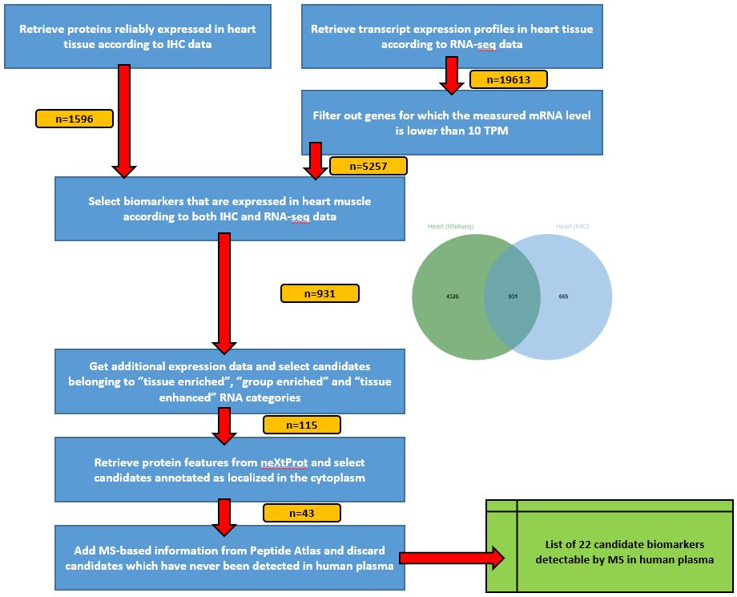
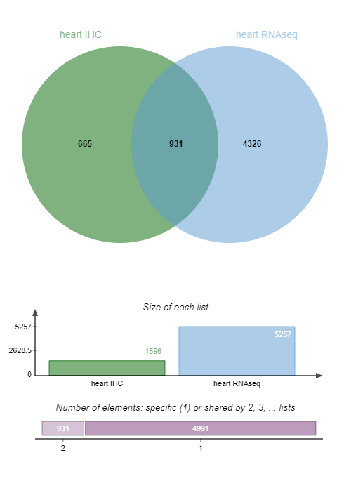

# Introduction

A biomarker is a measurable biological component that can be routinely detected in clinical practice and reflects a disease state,
response to therapeutic treatment, or other relevant biological state.

[ProteoRE Galaxy instance](http://www.proteore.org) provides necessary tools to execute a complete biomarkers selection pipeline.
In this tutorial we introduce successively the tools of this pipeline, and guide you to execute them in order to complete the entire
pipeline on a concrete example. This strategy is described by .

> <agenda-title></agenda-title>
>
> In this tutorial, we will cover:
>
> 1. TOC
> {:toc}
>
{: .agenda}

# Global view of the strategy

For this tutorial, no input data are required as the first steps will be to select data from
public databases with ProteoRE tools.

The strategy consists in selecting, one step after another, the most interesting candidates biomarkers.
Our use-case here is to identify candidate biomarkers for myocardial infarction tissue-leakage.

Criteria candidate biomarkers have to fulfill through this pipeline are:
- heart-specificity
- cytoplasmic localization
- detection in LC-MS/MS experiments already done



# Selection of tissue-specific proteins

We will start by selecting proteins associated with heart muscle tissue based on experimental data available from
[The Human Protein Atlas](https://www.proteinatlas.org/) (HPA) (Publication: )

> <hands-on-title>Build tissue-specific expression dataset based on ImmunoHistoChemistry</hands-on-title>
>
> 1. **Create a new history** and give it a name.
>
>    
>
> 2. **Build tissue-specific expression dataset**  with the following parameters:
>    - *"Experimental data source (antibody- or RNAseq-based)"*: `Expression profiles based on immunohistochemistry`
>    - *"Select tissue"*: `Heart muscle`
>    - *"Expression level"*: `High` and `Medium`
>    - *"Reliability score"*: `Enhanced` and `Supported`
>
>   > ### Output
>   > - **Tissue-specific expression from IHC** (1596 lines): List of the selected proteins.
>   > 6 columns: 'Gene', 'Gene name' and the retrieved info from HPA.
>   {: .comment}
{: .hands_on}

We will now rerun the same tool but to select transcripts according to their expression profile.

> <hands-on-title>Build tissue-specific expression dataset based on RNAseq</hands-on-title>
>
> 1. **Build tissue-specific expression dataset**  with the following parameters:
>    - *"Experimental data source (antibody- or RNAseq-based)"*: `RNA levels based on RNA-seq experiments`
>    - *"Select tissue"*: `Heart muscle`
>
>   > ### Output
>   > - **Tissue-specific expression from RNAseq** (19613 lines): List of the selected transcripts.
>   > 4 columns: 'Gene', 'Gene name' and the retrieved info from HPA.
>   {: .comment}
{: .hands_on}

This second list must be reduced by removing transcripts that are not highly enriched in heart muscle.
To do so, a filter is applied on the expression value provided by HPA and measured in TPM (last column of the output file).
In ProteoRE we'll use the "Filter by keywords and/or numerical value" tool.

> <hands-on-title>Filter on expression value criterion</hands-on-title>
>
> 1. **Filter by keywords and/or numerical value**  with the following parameters:
>    - *"Input File"*: `Tissue-specific expression from RNASeq` from the previous step
>    - *"Operation"*: `Discard`
>    - In *"Filter by numerical value"*:
>        -  *"Insert Filter by numerical value"*
>            - *"Column number on which to apply the filter"*: `c4`
>            - *"Select operator"*: `<=`
>            - *"Value"*: `10.0`
>    - *"Sort by column ?"*: `Yes`
>      - *"Sort result files by"*: `c4`
>
> > <question-title></question-title>
> >
> > How many lines are there in the file of heart transcripts
> > with a TPM value >10 ?
> >
> > > <solution-title></solution-title>
> > > 5257 lines.
> > {: .solution}
> {: .question}
>
>
{: .hands_on}

We have now 2 datasets of heart-muscle proteins/transcripts, based on IHC (Immonohistochemistry) data or [TPM](https://statquest.org/2015/07/09/rpkm-fpkm-and-tpm-clearly-explained/) (Expression level expressed in Transcripts Per Million) value.

We want now to select candidate biomarkers that are expressed in the heart muscle according to **both** IHC and RNA-seq data, using the Jvenn tool.

> <hands-on-title>Venn diagram</hands-on-title>
>
> 1. **Venn diagram**  with the following parameters:
>    - In *"List to compare"*:
>        -  *"Insert List to compare"*
>            - *"Enter your list"*: `Input file containing your list`
>                - *"Select your file"*: `Tissue-specific expression from IHC`
>                - *"Enter the name of this list"*: `heart IHC`
>        -  *"Insert List to compare"*
>            - *"Enter your list"*: `Input file containing your list`
>                - *"Select your file"*: `Filtered tissue-specific expression from RNAseq`
>                - *"Enter the name of this list"*: `heart RNAseq`
>
> 2. Examine  the Venn diagram output:
>
>    
>
>    > <question-title></question-title>
>    > How many IDs are common to both IHC and RNA-seq data?
>    >   > <solution-title></solution-title>
>    >   > 931 candidate biomarkers are detected by both IHC and RNA-seq data.
>    >   {: .solution}
>    {: .question}
{: .hands_on}

For greater clarity we'll keep only the column with those 931 candidate biomarkers detected in both IHC and RNA-seq data in the
rest of our pipeline.

> <hands-on-title>Obtain list of candidate biomarkers</hands-on-title>
>
> 1. **Cut**  with the following parameters:
>    - *"File to cut"*: `Venn diagram text output`
>    - *"Cut by"*: `fields`
>        - *"List of Fields"*: `Column: 3`
>
>    Now we'll filter this dataset not to keep the 'NA' lines.
>
> 2. **Filter by keywords and/or numerical value**  with the following parameters:
>    - *"Input file"*: output from **Cut** 
>    - *"Operation"*: `Discard`
>    - In *"Filter by keywords"*:
>        -  *"Insert Filter by keywords"*
>            - *"Search for exact match?"*: `Yes`
>            - *"Enter keywords"*: `copy/paste`
>                - *"Copy/paste keywords to find (keep or discard)"*: `NA`
>    - *"Sort by column ?"*: `Yes`
>      - *"Sort result files by"*: `c1`
>
> 3. Let's rename the 931 IDs dataset in "heart931" for simplification.
>
>    
>
{: .hands_on}

The pipeline will then continue based on these 931 candidates, from which we have to select biomarkers that are
highly specific to the heart using additional expression data (still from HPA).

> <hands-on-title>Add expression data</hands-on-title>
>
> 1. **Add expression data**  with the following parameters:
>    - *"Enter your IDs (Ensembl gene IDs only, e.g. ENSG00000064787)"*: `Input file containing your IDs`
>      - *"Select your file"*: `Heart931` output we created in the previous step
>    - In *"RNAseq/Ab-based expression data"*:
>        - *"Select information to add to your list"*:
>          -  `Gene name`
>          -  `Gene description`
>          -  `RNA tissue category`
>          -  `RNA tissue specificity abundance in Transcript Per Million`
>
{: .hands_on}

We wish to focus on transcripts that have been classed as (according to the HPA definition):
 - **Tissue enriched** (expression in one tissue at least fivefold higher than all other tissues),
 - **Group enriched** (fivefold higher average TPM in a group of two to to seven tissues compared to all other tissues) and
 - **Tissue enhanced** (fivefold higher average TPM in one or more tissues/cell lines compared to the mean TPM for all tissues)

This information is listed in the column 4 : *"RNA tissue category"* of the result dataset.

Let's use **Filter by keywords and/or numerical value**  to select the candidate biomarkers based on this
*"RNA tissue category"* criterion.

> <hands-on-title>Filter by keywords and/or numerical value</hands-on-title>
>
> 1. **Filter by keywords and/or numerical value**  with the following parameters:
>    - *"Input file"*: output from **Add expression data** 
>    - In *"Filter by keywords"*:
>        -  *"Insert Filter by keywords"*
>            - *"Column number on which to apply the filter"*: `c4`
>            - *"Enter keywords"*: `copy/paste`
>                - *"Copy/paste keywords to find (keep or discard)"*: `enriched enhanced`
>    - *"Sort by column ?"*: `Yes`
>      - *"Sort result files by"*: `c1`
>
>    > ### Output
>    > - **Filtered Add_expression_data**: output list of the heart biomarkers with RNA tissue category
>    >   containing "enriched" or "enhanced" (115 lines = what we are interested in)
>    >
>    > - **Filtered Add_expression_data - discarded lines**: output list of the heart biomarkers with
>    > RNA tissue category NOT containing "enriched" or "enhanced" (not what we are interested in)
>    {: .comment}
>
> 2. Let's rename the filtered dataset **heart115**
>
>    
>
{: .hands_on}

We now have identified 115 candidates considered to have significantly higher expression in heart muscle according to HPA criteria.

# Annotation with biochemical and cellular features

Candidate biomarkers we want to identify have to be cytoplasmic and without transmembrane domains (TMD).
Thus we will retrieve protein features from neXtProt to retrieve those informations.

Since HPA only considers [Ensemble](https://www.ensembl.org) `ENSG` identifiers (related to the gene), although [neXtProt](https://www.nextprot.org/) uses [UniProt](https://www.uniprot.org/) identifiers (related to proteins), first thing to do is to map the Ensembl identifiers contained our list of (115)
candidates to their corresponding UniProt accession number. The tool **ID Converter** is what we need to do so.

> <hands-on-title>ID Converter</hands-on-title>
>
> 1. **ID Converter**  with the following parameters:
>    - *"Enter IDs"*: `Input file containing IDs`
>    - *"Select your file"*: `heart115`
>    - *"Species"*: `Human (Homo sapiens)`
>        - *"Type/source of IDs"*: `Ensembl gene ID (e.g. ENSG00000166913)`
>        - In *"Target type"*:
>            - *"Target type of IDs you would like to map to"*:
>              -  `Uniprot accession number`
>              -  `Uniprot ID`
>
>   > ### Output
>   > **ID converter**: In this dataset, 2 columns (columns 6 and 7, at the end) which contain
>   > UniProt accession number and ID are added.
>   > Note: We used here the release "Homo sapiens 08/05/2019"; results can be slightly different
>   > according to the version number of Uniprot.
>   {: .comment}
{: .hands_on}

We have now UniProt IDs for the 115 candidate biomarkers: we are able to collect protein features from [neXtProt](https://www.nextprot.org/).
For this purpose, we use the **Add protein features**  ProteoRE tool.

> <hands-on-title>Add protein features</hands-on-title>
>
> 1. **Add protein features**  with the following parameters:
>    - *"Enter your IDs (neXtProt or UniProt)"*: `Input file containing your IDs `
>        - *"Select your file"*: the output from **ID Converter** 
>        - *"Column IDs (e.g : Enter c1 for column n°1)"*: `c6`
>    - In *"Select features"*:
>        - *"Physico-Chemical Features"*:
>          -  `Number of transmembrane domains`
>        - *"Localization"*:
>          -  `Subcellular Location`
>        - *"Disease information"*: `Yes`
>
>   > ### Output
>   > **Add information from NextProt**: In this file (115 lines), 3 columns (columns 8, 9 and 10)
>   > were added (at the end). These columns present TMDomains, Subcell Location and Diseases info.
>   {: .comment}
{: .hands_on}

With this dataset, we can select proteins reported as localized in the cytoplasm and having
no transmembrane domains by running the Filter by keywords and/or numerical value tool.

> <hands-on-title>Filter by keywords and/or numerical value</hands-on-title>
>
> 1. **Filter by keywords and/or numerical value**  with the following parameters:
>    - *"Input file"*: the output from **Add protein features** 
>    - *"Select an operator to combine your filters (if more than one)"*: `AND`
>    - In *"Filter by keywords"*:
>        -  *"Insert Filter by keywords"*
>            - *"Column number on which to apply the filter"*: `c9`
>            - *"Enter keywords"*: `copy/paste`
>                - *"Copy/paste keywords to find (keep or discard)"*: `cytoplasm cytosol`
>    - In *"Filter by numerical value"*:
>        -  *"Insert Filter by numerical value"*
>            - *"Column number on which to apply the filter"*: `c8`
>            - *"Value"*: `0`
>    - *"Sort by column ?"*: `Yes`
>        - *"Sort result files by:"*: `c5`
>        - *"Sort in descending order ?"*: `Yes`
>
>
>   > ### Output
>   > - **Filtered Add_information_from_neXtProt**: output list of the proteins having a cytoplasmic
>   > location and no TMD (48 proteins)
>   > - **Filtered Add_information_from_neXtProt - discarded lines**: output list of the proteins NOT
>   > cytoplasmic and having at least 1 TMD.
>   {: .comment}
{: .hands_on}

We have now 45 proteins. The next step is to identify those proteins already previously observed in
LS MS/MS experiments.

# Check for previous detection by LC-MS/MS experiments

> <hands-on-title>Get MS/MS observations in tissue/fluid</hands-on-title>
>
> 1. **Get MS/MS observations in tissue/fluid**  with the following parameters:
>    - *"Enter your IDs (UniProt Accession number only)"*: `Input file containing your IDs `
>        - *"Select your file"*: the filtered output from the previous step
>        - *"Column of IDs"*: `c6`
>    - *"Proteomics dataset (biological sample)"*:
>        -  `Human Heart`
>        -  `Human Plasma non glyco`
>
>   > ### Output
>   > **Get MS/MS observations in tissue/fluid**: In this file, 2 columns (11 and 12, at the end)
>   > were added with the info of number of times peptides were seen by MS/MS.
>   {: .comment}
{: .hands_on}

Let's now keep only proteins that have already been seen by MS/MS in the plasma (last column of the file).

> <hands-on-title>Filter for proteins seen in the plasma</hands-on-title>
>
> 1. **Filter by keywords and/or numerical value**  with the following parameters:
>    - *"Input file"*: the MA/MS observations output from the previous step
>    - *"Operation"*: `Discard`
>    - In *"Filter by keywords"*:
>        -  *"Insert Filter by keywords"*
>            - *"Column number on which to apply the filter"*: `c12`
>            - *"Search for exact match?"*: `Yes`
>            - *"Enter keywords"*: `copy/paste`
>                - *"Copy/paste keywords to find (keep or discard)"*: `NA`
>    - *"Sort by column ?"*: `Yes`
>      - *"Sort results file by"*: `c1`
>
>   > ### Output
>   > - **Filtered Get MS/MS observations in tissue/fluid**: output list of the proteins
>   > whose some peptides have been seen in plasma (21 proteins)
>   > - **Filtered Get MS/MS observations in tissue/fluid - discarded lines**:
>   > output list of proteins with no peptides seen in the plasma
>   {: .comment}
{: .hands_on}

# Conclusion

At the end of the process we end up with a list of 22 biomarkers that are **highly enriched in heart muscle**, localized
**in the cytosol** and **detectable by MS in the plasma**.
*NB: Please be aware that, due to databases update, number of biomarkers you end up with can be different from 21 that we obtain here.*

Briefly and from a biological point of view, 3 of these proteins exhibit a relative low detection level in the plasma
compared to heart muscle tissue, and are reported with a very high heart-muscle-specific RNA abundance.
These potential mechanistic biomarkers of myocardial infarction include (i) cardiac Troponin I type 3 (TNNI3 (P19429))
that is routinely used as the most specific marker of myocardial injury and (ii) the heart-type fatty acid-binding protein
(FABP3 (P05413)) that has been proposed as a diagnostic and prognostic marker for acute and chronic cardiac injury.

Extraction of a workflow from your history is valuable for analyses reproducibility and traceability.
Moreover, a workflow can also be made reusable with modifiable parameters, and as a result this strategy can
be applied to other types of tissue injury (e.g. brain, liver, kidney).
