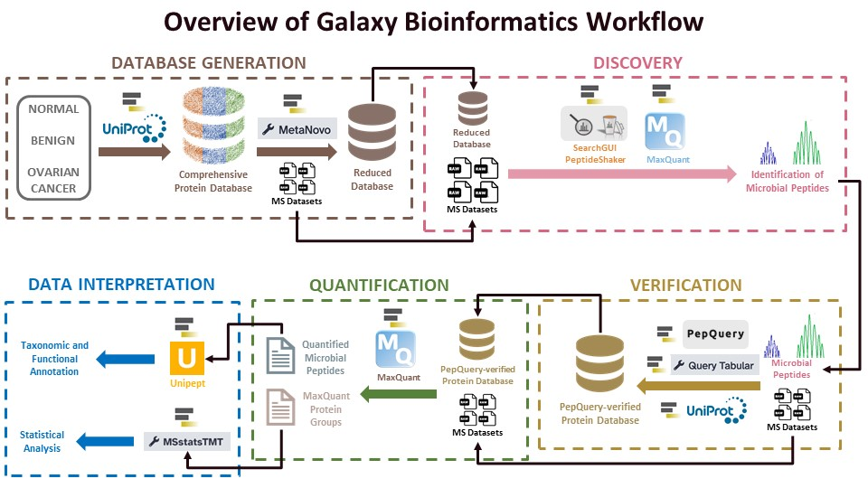
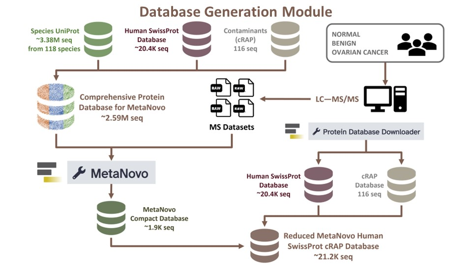

Metaproteomics is the large-scale characterization of the entire complement of proteins expressed by microbiota. However, metaproteomics analysis of clinical samples is challenged by the presence of abundant human (host) proteins which hampers the confident detection of lower abundant microbial proteins  ; [ .

To address this, we used tandem mass spectrometry (MS/MS) and bioinformatics tools on the Galaxy platform to develop a metaproteomics workflow to characterize the metaproteomes of clinical samples. This clinical metaproteomics workflow holds potential for general clinical applications such as potential secondary infections during COVID-19 infection, microbiome changes during cystic fibrosis as well as broad research questions regarding host-microbe interactions.




The first workflow for the clinical metaproteomics data analysis is the Database generation workflow. The Galaxy-P team has developed a workflow wherein a large database is generated by downloading protein sequences of known disease-causing microorganisms and then generating a compact database from the comprehensive database using the Metanovo tool.





> <agenda-title></agenda-title>
>
> In this tutorial, we will cover:
>
> 1. TOC
> {:toc}
>
{: .agenda}

# Data Upload

## Get data

> <hands-on-title> Data Upload </hands-on-title>
>
> 1. Create a new history for this tutorial
> 2. Import the files from [Zenodo]({{ page.zenodo_link }}) or from
>    the shared data library (`GTN - Material` -> `{{ page.topic_name }}`
>     -> `{{ page.title }}`):
>
>    ```
>    https://zenodo.org/records/10105821/files/HUMAN_SwissProt_Protein_Database.fasta
>    https://zenodo.org/records/10105821/files/Species_UniProt_FASTA.fasta
>    https://zenodo.org/records/10105821/files/Contaminants_(cRAP)_Protein_Database.fasta
>    https://zenodo.org/records/10105821/files/PTRC_Skubitz_Plex2_F10_9Aug19_Rage_Rep-19-06-08.mgf
>    https://zenodo.org/records/10105821/files/PTRC_Skubitz_Plex2_F11_9Aug19_Rage_Rep-19-06-08.mgf
>    https://zenodo.org/records/10105821/files/PTRC_Skubitz_Plex2_F13_9Aug19_Rage_Rep-19-06-08.mgf
>    https://zenodo.org/records/10105821/files/PTRC_Skubitz_Plex2_F15_9Aug19_Rage_Rep-19-06-08.mgf
>    ```
>
>    
>
>    
>
> 3. Rename the datasets
> 4. Check that the datatype
>
>    
>
>
> 5. Optional-Add to each database a tag corresponding to the file name.
> 6. Create a dataset collection of the 4 MGF datasets.
>
>    
>
{: .hands_on}

# Import Workflow


> <hands-on-title>Running the Workflow</hands-on-title>
>
> 1. **Import the workflow** into Galaxy:
>
>    
>
>
> 2. Run **Workflow**  using the following parameters:
>    - *"Send results to a new history"*: `No`
>    -  *" Input Dataset collection"*: `MGF dataset collection`
>    -  *" Species_tabular"*: `Species_tabular.tabular`
>
>    
>
{: .hands_on}

# Step-by-step analysis

## Download Protein Sequences using taxon names
First, we want to generate a large comprehensive protein sequence database using the UniProt XML Downloader to extract sequences for species of interest. To do so, you will need a tabular file that contains a list of species.

For this tutorial, a literature survey was conducted to obtain 118 taxonomic species of organisms that are commonly associated with the female reproductive tract . This species list was used to generate a protein sequence FASTA database was generated using the UniProt XML Downloader tool within the Galaxy framework. In this tutorial, the Species FASTA database (~3.38 million sequences) has already been provided as input. However, if you have your own list of species of interest as a tabular file (`Your_Species_tabular.tabular`), steps to generate a FASTA file from a tabular file are included:


## Download Species Protein Sequences using UniProt XML downloader with **UniProt**

> <hands-on-title> UniProt XML downloader</hands-on-title>
> 1.  with the following parameters:
>    - *"Select"*: `Your_Species_tabular.tabular`
>        -  *"Dataset (tab separated) with Taxon ID/Name column"*: `output` (Input dataset)
>        - *"Column with Taxon ID/name"*: `c1`
>    - *"UniProt output format"*: `fasta`
> 2. Rename the output as Species_UniProt_FASTA.fasta
>
>    > <comment-title> UniProt description </comment-title>
>    >
>    > This tool will help download the protein fasta sequences by inputting the taxon names.
>    {: .comment}
>
{: .hands_on}


> <question-title></question-title>
>
> 1. Can we use a higher taxonomy clade than species for the UniProt XML downloader?
> 2. Why are we using the tools separately? Can we run it all together?
> 3. Can we select multiple files together?
> 4. How many FASTA files can be merged at once, i.e. is there a limit on the number/size of files?
>
> > <solution-title></solution-title>
> >
> >
> > 1. Yes, the UniProt XML downloader can also be used for generating a database from Genus, Family, Order, or any other higher taxonomy clade.
> > 2. The tools are run separately to reduce the load on the server and tool. If you have a limited number of taxon names, then you can run it all together.
> > 3. Yes, that certainly can be done. We used one input file at a time to maintain the order of sequences in the database.
> > 4. There is no limit.
> >
> {: .solution}
>
{: .question}


## Merging databases to obtain a large comprehensive database for MetaNovo
Once generated, the Species UniProt database (~3.38 million sequences) will be merged with the Human SwissProt database (reviewed only; ~20.4K sequences) and contaminant (cRAP) sequences database (116 sequences) and filtered to generate the large comprehensive database (~2.59 million sequences). The large comprehensive database will be used to generate a compact database using MetaNovo, which is much more manageable.

> <hands-on-title> Download contaminants with **Protein Database Downloader </hands-on-title>
>
> 1.  with the following parameters:
>    - *"Download from?"*: `cRAP (contaminants)`
> 2. Rename as "Protein Database Contaminants (cRAP)"
>
{: .hands_on}

> <hands-on-title> Human SwissProt (reviewed) database</hands-on-title>
> 1.  with the following parameters:
>    - *"Download from?"*: `UniProtKB(reviewed only)`
>        - In *"Taxonomy"*: `Homo sapiens (Human)`
>        - In *"reviewed"*: `UniProtKB/Swiss-Prot (reviewed only)`
>	 - In  *"Proteome Set"*: `Reference Proteome Set`
>	 - In  *"Include isoform data"*: `False`
> 2. Rename as "Protein Database Human SwissProt".
{: .hands_on}

> <question-title></question-title>
>
> 1. How often is the Protein Database Downloader updated?
>
>
> > <solution-title></solution-title>
> >
> >
> > 1. It is updated every 3 months.
> >
> {: .solution}
>
{: .question}


> <hands-on-title> FASTA Merge Files and Filter Unique Sequences </hands-on-title>
>
> 1.  with the following parameters:
>    - *"Run in batch mode?"*: `Merge individual FASTAs (output collection if input is collection)`
>        - In *"Input FASTA File(s)"*:
>            -  *"Insert Input FASTA File(s)"*
>                -  *"FASTA File"*: `Species_UniProt_FASTA ` (output of **UniProt XML downloader** )
>                -  *"FASTA File"*: `Protein Database Human SwissProt` (output of **Protein Database Downloader** )
>                -  *"FASTA File"*: `Protein Database Contaminants (cRAP)` (output of **Protein Database Downloader** )
>
> 2. Rename out as "Human UniProt Microbial Proteins cRAP for MetaNovo".
>                  
{: .hands_on}

# Reducing Database size

## Metanovo tool generates a compact database from your comprehensive database with **MetaNovo**
Next, the large comprehensive database of ~2.59 million sequences can be reduced using the MetaNovo tool to generate a more manageable database that contains identified proteins.

The compact MetaNovo-generated database (~1.9K sequences) will be merged with Human SwissProt (reviewed only) and contaminants (cRAP) databases to generate the reduced database (~21.2k protein sequences) that will be used for peptide identification (see [Discovery Module tutorial](https://github.com/subinamehta/training-material/blob/main/topics/proteomics/tutorials/clinical-mp-discovery/tutorial.md)).

> <hands-on-title> MetaNovo </hands-on-title>
>
> 1.  with the following parameters:
>    - *"MGF Input Type"*: `Collection`
>        -  *"MGF Collection"*: `output` (Input dataset collection)
>    -  *"FASTA File"*: `output` (output of **FASTA Merge Files and Filter Unique Sequences** )
>    - In *"Spectrum Matching Parameters"*:
>        - *"Fragment ion mass tolerance"*: `0.01`
>        - *"Enzyme"*: `Trypsin (no P rule)`
>        - *"Fixed modifications as comma separated list"*: `Carbamidomethylation of C` `TMT 10-plex of K` `TMT 10-plex of peptide N-term`
>        - *"Variable modifications as comma separated list"*: `Oxidation of M`
>        - *"Maximal charge to search for"*: `5`
>    - In *"Import Filters"*:
>        - *"The maximal peptide length to consider when importing identification files"*: `50`
> 2. Rename as "MetaNovo Compact Database".
>
>
{: .hands_on}

> <question-title></question-title>
>
> 1. Why are we reducing the size of the database?
> 2. Why is this running TMT10 plex modification when the data is 11-plex?
> 3. Regarding MetaNovo Spectrum Matching parameters, what are the most “important” parameters? Meaning, that if a user wants to reduce or increase the sensitivity/number of output sequences, what should they change?
>
> > <solution-title></solution-title>
> >
> >
> > 1. Reducing the size of the database improves search speed, FDR, and sensitivity.
> > 2. There is no option for 11-plex modifications in Metanovo, hence we use the TMT-10plex.
> > 3. The most important parameters are the tolerance (MS1 and MS2) and any modifications introduced during the processing of the data.
> >
> {: .solution}
>
{: .question}

## Merging databases to obtain reduced MetaNovo database for peptide discovery with **FASTA Merge Files and Filter Unique Sequences**

> <hands-on-title> FASTA Merge Files and Filter Unique Sequences</hands-on-title>
>
> 1.  with the following parameters:
>    - *"Run in batch mode?"*: `Merge individual FASTAs (output collection if input is collection)`
>        - In *"Input FASTA File(s)"*:
>            -  *"Insert Input FASTA File(s)"*
>                -  *"FASTA File"*: `MetaNovo Compact Database` (output of **MetaNovo** )
>                -  *"FASTA File"*: `Protein Database Human SwissProt` (output of **Protein Database Downloader** )
>                -  *"FASTA File"*: `Protein Database Contaminants (cRAP)` (output of **Protein Database Downloader** )
>
>
{: .hands_on}

# Conclusion

The first step for the Clinical Metaproteomics study is database generation. As we didn’t have a reference database or information from 16srRNA-seq data, we generated a fasta database doing a literature survey, however, if 16S rRNA data is present, the taxon identified can be used for a customized database generation. As the size of the comprehensive database is generally  too large, we used the Metanovo tool to reduce the size of the database. This reduced database will be then used for clinical metaproteomics discovery workflow.
