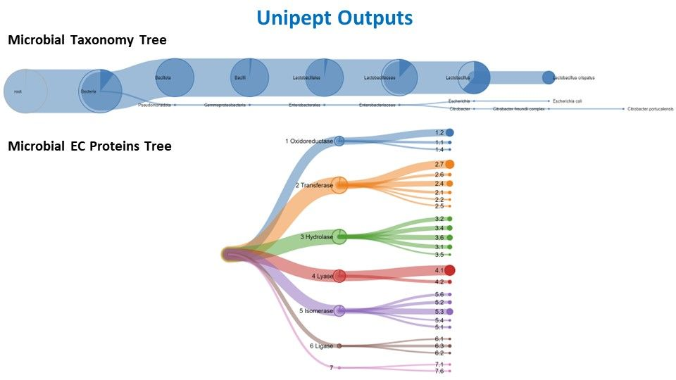
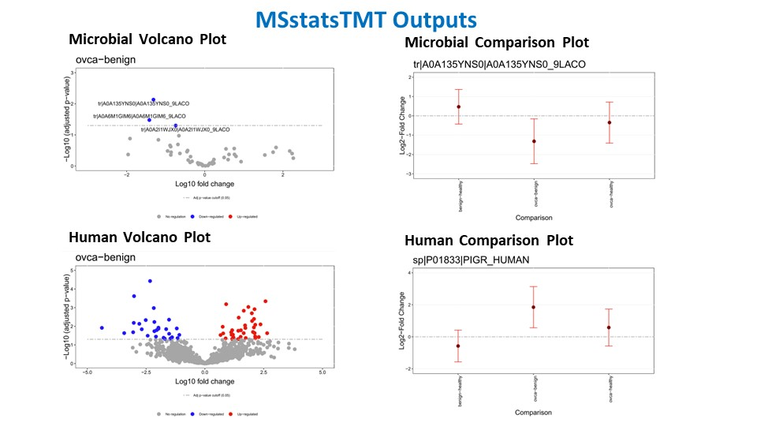

The final workflow in the array of clinical metaproteomics tutorials is the data interpretation workflow. Interpreting MaxQuant data using MSstats involves applying a rigorous statistical framework to glean meaningful insights from quantitative proteomic datasets. The MaxQuant output is explored to understand data distribution and variability. Subsequent normalization helps account for systematic variations. MSstats allows the user to define the experimental design, including sample groups and conditions, to perform statistical analysis. The output provides valuable information about differential protein expression across conditions, estimates of fold changes, and associated p-values, aiding in the identification of biologically significant proteins. Furthermore, MSstats enables quality control and data visualization, ultimately enhancing our ability to draw meaningful conclusions from complex proteomic datasets. Additional tutorial material for using MaxQuant and MSstatTMT for TMT data analysis can be found at [MaxQuant and MSstats for the analysis of TMT data](https://gxy.io/GTN:T00220).


> <agenda-title></agenda-title>
>
> In this tutorial, we will cover:
>
> 1. TOC
> {:toc}
>
{: .agenda}

## Get data

> <hands-on-title> Data Upload </hands-on-title>
>
> 1. Create a new history for this tutorial
> 2. Import the files from [Zenodo]({{ page.zenodo_link }}) or from
>    the shared data library (`GTN - Material` -> `{{ page.topic_name }}`
>     -> `{{ page.title }}`):
>
>    ```
>    https://zenodo.org/records/10105821/files/Annotation.tabular
>    https://zenodo.org/records/10105821/files/Comparison_Matrix.tabular
>    https://zenodo.org/records/10105821/files/MaxQuant_Evidence.tabular
>    https://zenodo.org/records/10105821/files/MaxQuant_Protein_Groups.tabular
>    https://zenodo.org/records/10105821/files/Quantified-Peptides.tabular
>    
>    ```
>
>    
>
>    
>
> 3. Rename the datasets
> 4. Check that the datatype
>
>    
>
> 5. Add to each database a tag corresponding to ...
>
>    
>
{: .hands_on}


## Taxonomic analysis with **Unipept**
Unipept serves as a vital bioinformatics platform for the analysis of mass spectrometry-based shotgun proteomics data, especially in the study of microbial communities. Its primary utility lies in taxonomic and functional analyses, enabling researchers to identify and quantify microorganisms within diverse environments. The platform facilitates comparative studies across samples, conditions, or time points, shedding light on the dynamic responses of microbial communities to environmental changes. Unipept integrates with public databases like UniProt, ensuring access to comprehensive and updated information for annotations. Being community-driven and open source, Unipept fosters collaboration and transparency, with a user-friendly web interface that accommodates researchers of varying bioinformatics expertise. In essence, Unipept is an invaluable resource, offering tools for the exploration of metaproteomic data and contributing to advancements in our understanding of microbial ecology.


> <hands-on-title> Unipept 5.0 </hands-on-title>
>
> 
> 1.  with the following parameters:
>    - *"Unipept application"*: `peptinfo: Tryptic peptides and associated EC and GO terms and lowest common ancestor taxonomy`
>    - *"Peptides input format"*: `tabular`
>        -  *"Tabular Input Containing Peptide column"*: `output` (Input dataset)
>        - *"Select column with peptides"*: `c1`
>    - *"Match input peptides by"*: `Match to the full input peptide`
>    - *"Choose outputs"*: `Tabular with one line per peptide` `JSON Taxomony Tree` `Peptide GO terms in normalized tabular` `Peptide InterPro entries in normalized tabular` `Peptide EC terms in normalized tabular` `JSON EC Coverage Tree`
>
{: .hands_on}



## Extraction of Microbial Sequences

> <hands-on-title> Extract Microbial sequences with Select </hands-on-title>
>
> 1.  with the following parameters:
>    -  *"Select lines from"*: `output` (Input dataset)
>    - *"that"*: `NOT Matching`
>    - *"the pattern"*: `(HUMAN)|(REV)|(CON)|(con)`
>    - *"Keep header line"*: `Yes`
>
>
{: .hands_on}


> <hands-on-title> Select sequences matching "HUMAN" </hands-on-title>
>
> 1.  with the following parameters:
>    -  *"Select lines from"*: `output` (Input dataset)
>    - *"the pattern"*: `(HUMAN)`
>    - *"Keep header line"*: `Yes`
>
>
{: .hands_on}

> <hands-on-title> Select out reverse and contaminants </hands-on-title>
>
> 1.  with the following parameters:
>    -  *"Select lines from"*: `out_file1` (output of **Select** )
>    - *"that"*: `NOT Matching`
>    - *"the pattern"*: `(REV)|(con)`
>    - *"Keep header line"*: `Yes`
>
>
{: .hands_on}


# MSstats TMT
MSstats TMT(Tandem Mass Tag) is a computational tool designed for the robust statistical analysis of mass spectrometry-based quantitative proteomics data using TMT labeling. TMT is a widely used method for multiplexed quantitative proteomics, enabling simultaneous identification and quantification of proteins across multiple samples. MSstats TMT plays a crucial role in this process by providing a statistical framework for analyzing TMT data, and facilitating accurate and reliable protein abundance measurements. The tool offers a range of features, including quality control, normalization, and statistical modeling, allowing researchers to identify differentially expressed proteins with confidence. MSstats TMT is particularly valuable in large-scale studies where quantifying protein expression across multiple conditions is essential for understanding complex biological processes. Its application contributes to advancing our understanding of proteomic changes in response to various experimental conditions or perturbations. 

## Statistical Analysis of Microbial proteins with **MSstatsTMT**

> <hands-on-title> MSstatsTMT </hands-on-title>
>
> 1.  with the following parameters:
>    - *"Input Source"*: `MaxQuant`
>        -  *"evidence.txt - feature-level data"*: `output` (Input dataset)
>        -  *"proteinGroups.txt"*: `out_file1` (output of **Select Microbial** )
>        -  *"annotation.txt"*: `output` (Input dataset)
>    - In *"Plot Output Options"*:
>        - *"Select protein IDs to draw plots"*: `generate all plots for each protein`
>    - *"Compare Groups"*: `Yes`
>        - *"Use comparison matrix?"*: `Yes`
>            -  *"Comparison Matrix"*: `output` (Input dataset)
>        - *"Select outputs"*: `Group Comparison` `MSstats Volcano Plot` `MSstats Comparison Plot`
>        - In *"Comparison Plot Options"*:
>            - *"Select protein IDs to draw plots"*: `generate all plots for each protein`
>            - *"Select comparisons to draw plots"*: `Generate all plots for each comparison`
>        - *"Select outputs"*: `MSstatsTMT summarization log` `MSstatsTMT summarization MSstats` `Protein abundance`
>
>
{: .hands_on}


## Statistical Analysis of Human proteins with **MSstatsTMT**

> <hands-on-title> MSstatsTMT</hands-on-title>
>
> 1.  with the following parameters:
>    - *"Input Source"*: `MaxQuant`
>        -  *"evidence.txt - feature-level data"*: `output` (Input dataset)
>        -  *"proteinGroups.txt"*: `out_file1` (output of **Select HUMAN** )
>        -  *"annotation.txt"*: `output` (Input dataset)
>    - In *"Plot Output Options"*:
>        - *"Select protein IDs to draw plots"*: `generate all plots for each protein`
>    - *"Compare Groups"*: `Yes`
>        - *"Use comparison matrix?"*: `Yes`
>            -  *"Comparison Matrix"*: `output` (Input dataset)
>        - *"Select outputs"*: `Group Comparison` `MSstats Volcano Plot` `MSstats Comparison Plot`
>        - In *"Comparison Plot Options"*:
>            - *"Select protein IDs to draw plots"*: `generate all plots for each protein`
>            - *"Select comparisons to draw plots"*: `Generate all plots for each comparison`
>        - *"Select outputs"*: `MSstatsTMT summarization log` `MSstatsTMT summarization MSstats` `Protein abundance`
>
>
{: .hands_on}

The MSstats output typically includes essential information such as estimated fold changes, p-values, and other statistical measures that help identify differentially expressed proteins across experimental conditions or sample groups. It provides a clear picture of the variations in protein expression levels, aiding in the prioritization of biologically relevant targets. MSstats output also often includes visualizations and quality control metrics, making it a valuable resource for researchers in their quest to extract meaningful insights from complex proteomic datasets and understand the underlying biology of their experiments.
Example of our data interpretation:




# Conclusion
With the completion of this tutorial, you have successfully completed the clinical metaproteomics tutorials.

In conclusion, clinical metaproteomics tutorials represent an essential gateway to harnessing the power of advanced proteomic techniques in the realm of clinical research and applications. These bioinformatics tutorials serve as valuable guides for understanding the intricacies of metaproteomic workflows, from  data analysis to interpretation. By providing comprehensive knowledge and practical insights, they equip researchers and clinicians with the tools necessary to explore the rich diversity of the microbiome and its impact on health and disease or environment. As metaproteomic techniques continue to evolve and integrate with clinical practice, we hope these tutorials will be instrumental in shaping clinical research.
