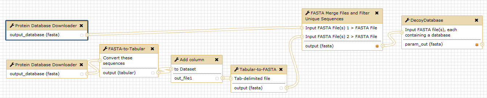
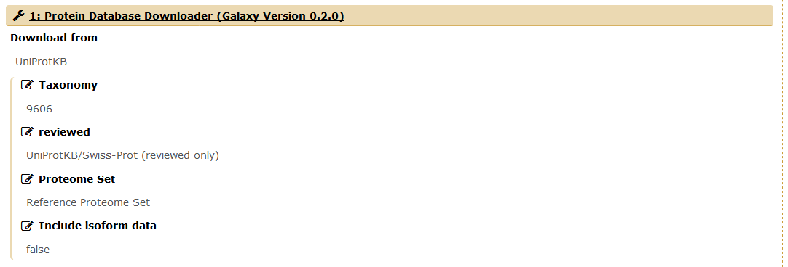

# GalaxyP Workflow: Database Handling

This workflow supplements the GalaxyP tutorial on database handling ([Link]({{site.url}}/topics/proteomics/tutorials/database-handling/tutorial.html)).
You can find two versions of the same workflow: one creates a database with only the Crap archive added, the other one additionally adds the proteomes of the most common mycoplasma contaminants.

An overview of the workflow is given below:

## Inputs and Customization

For this workflow, you need no prior inputs. You can change the database to download after starting to run the workflow (default: Homo sapiens). To do so, click on the `Taxonomy` option in `1: Protein Database Downloader`.
You may also change other options about the database to download (`reviewed`, `Proteome Set` and `Include isoform data`). Please refer to the [database handling tutorial]({{site.url}}/topics/proteomics/tutorials/database-handling/tutorial.html) for details.

## Outputs

The workflow provides two outputs:

1. the database with Crap (and mycoplasma) added, and
2. the same database with a reversed decoy database attached.
