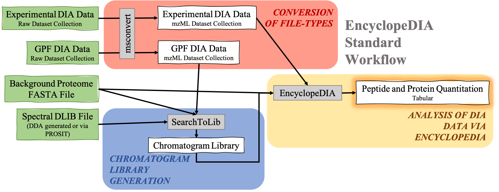
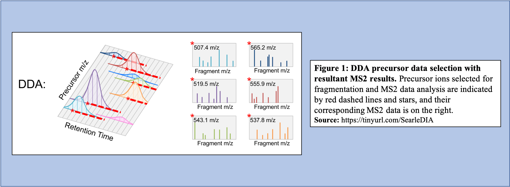
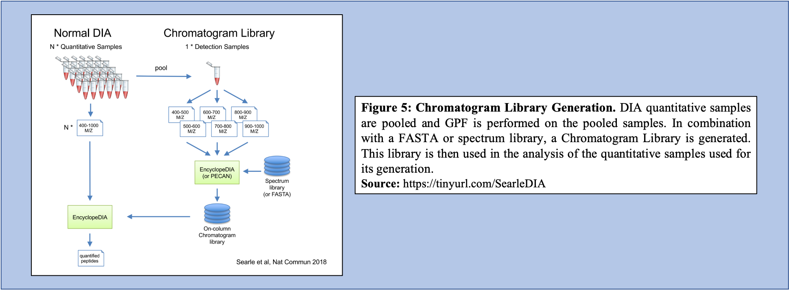

# Introduction


Data Independent Acquisition (DIA) was introduced as a method to provide reproducible quantitative information as an improvement over the Data Dependent Acquisition (DDA) . Despite benefits of DIA, such as increased depth of coverage and lesser missing values, the computational analysis of the complicated and multiplexed data presents challenges. Therefore, with the rise of usage of this technique, rises a need for new and robust methods of data analysis.

The EncyclopeDIA  workflow described in this tutorial contains three steps. The first step is the conversion of the input data files from RAW file-types to mzML file-type using the tool msconvert. The second step which is a critical component of this workflow is the generation of a Chromatogram Library. Chromatogram Library is generated by employing the gas-phase fractionation (GPF) method and can make use of DDA-generated or predicted spectral libraries. Lastly, the experimental wide-window DIA files are analyzed using the [EncyclopeDIA software tool](https://bitbucket.org/searleb/encyclopedia/wiki/Home) generated by [Brian Searle](https://isbscience.org/bio/brian-searle/). EncyclopeDIA analysis of experimental DIA data against the generated Chromatogram Library and the background proteome FASTA file generates peptide and protein quantitation outputs. The availability of EncyclopeDIA workflow within the Galaxy platform offers another easier way of analyzing DIA data.

**An Overview of the EncyclopeDIA Standard Workflow:**



**About the data:** In this tutorial, we will be analyzing the dataset provided by the iPRG.

> <agenda-title></agenda-title>
>
> In this tutorial, we will cover:
>
> 1. TOC
> {:toc}
>
{: .agenda}

# DDA, DIA, and their differences

Data Independent Acquisition (DIA) Mass Spectrometry is a promising alternative to Data Dependent Acquisition (DDA) Mass Spectrometry for protein quantitation.

In DDA-MS method, the instrument selects specific precursor ions for fragmentation based on their measured abundance in MS1 (Figure 1). Once selected, MS2 data is collected for these m/z time points and used to determine the sequences of the peptides that are present. Additionally, when integrated with the information given with the precursor peak, the quantity of peptide can be calculated.



On the other hand, in the DIA-MS method, the mass spectrometer fragments analytes within a specified m/z range (Figure 2). The MS2 data contribute to analyte identification and provide relative quantification. Compared to DDA that selects for a specific time point corresponding to a specific peptide, DIA scans across a time range resulting in multiplexed and complex MS2 data containing peak information from multiple peptides.


## What does a typical DIA experiment look like?

In a typical the DIA-MS experiment, the precursor scan usually ranges between 400-1000 m/z as opposed to 400-1600 m/z typically associated with DDA experiments. Multiple precursor scans are selected, each containing several fragment scans spanning across the entire 400-1000 m/z range (Figure 3A). Specific corresponding fragment ion scans can then be condensed and each combined fragment ion scan containing a small m/z range and its peaks can be examined and its peptide content can then be analyzed (Figure 3B).


> <details-title>Advantages of DIA over DDA</details-title>
>
> An advantage of DIA-MS compared to DDA-MS is that it is possible to obtain a better coverage of the proteome. Since DDA-MS focuses on the selection of precursor ions with significant abundance, data for less abundant (but perhaps equally interesting or important) peptides is not acquired. Therefore, DIA-MS, which fragments ions based on a mass range and not abundance, can provide a more comprehensive proteome coverage within a sample. DIA-MS relies on quantitation via fragment MS ions as compared to precursor ion MS and hence avoids the issue of quantitative interference due to co-eluting peptides associated with the DDA-MS methods. Finally, since DIA-MS is not dependent on the precursor intensity, MS2 signals can be used for quantitative analysis of low-abundance peptides and proteins.  For a more detailed description of DIA and its applications and advantages, we recommend users to watch two presentations by Brian Searle available on YouTube [Introduction to DIA](https://youtu.be/RidYXjvAk0s) and [DIA tips](https://youtu.be/coRDFs8Z8Ks).
>
{: .details}

# Import data

> <hands-on-title>Data upload</hands-on-title>
>
> 1. Create a new history for this tutorial
> 2. Import the files from [Zenodo]({{ page.zenodo_link }}) or from
>    the shared data library (`GTN - Material` -> `{{ page.topic_name }}`
>     -> `{{ page.title }}`):
>
>    ```
>    https://zenodo.org/record/4926594/files/Experimental_DIA_Dataset_Collection__191023JAT03_1_Mix_2_1ug_pOT_30k_390_1010_12%20.raw.raw
>    https://zenodo.org/record/4926594/files/Experimental_DIA_Dataset_Collection__191023JAT10_2_Mix_4_1ug_pOT_30k_390_1010_12%20.raw.raw
>    https://zenodo.org/record/4926594/files/Experimental_DIA_Dataset_Collection__191023JAT11_3_Mix_1_1ug_pOT_30k_390_1010_12%20.raw.raw
>    https://zenodo.org/record/4926594/files/Experimental_DIA_Dataset_Collection__191023JAT12_4_Mix_3_1ug_pOT_30k_390_1010_12%20.raw.raw
>    https://zenodo.org/record/4926594/files/GPF_DIA_Dataset_Collection__191023JAT04_P_1ug_395_505_4%20.raw.raw
>    https://zenodo.org/record/4926594/files/GPF_DIA_Dataset_Collection__191023JAT05_P_1ug_495_605_4%20.raw.raw
>    https://zenodo.org/record/4926594/files/GPF_DIA_Dataset_Collection__191023JAT06_P_1ug_595_705_4%20.raw.raw
>    https://zenodo.org/record/4926594/files/GPF_DIA_Dataset_Collection__191023JAT07_P_1ug_695_805_4%20.raw.raw
>    https://zenodo.org/record/4926594/files/GPF_DIA_Dataset_Collection__191023JAT08_P_1ug_795_905_4%20.raw.raw
>    https://zenodo.org/record/4926594/files/GPF_DIA_Dataset_Collection__191023JAT09_P_1ug_895_1005_4%20.raw.raw
>    https://zenodo.org/record/4926594/files/T4_Salmonella_Ecoli_Bacillus_BS_191102.fasta
>    https://zenodo.org/record/4926594/files/T4_Salmonella_Ecoli_Bacillus_fasta_trypsin_z2_nce33_BS_191102.dlib
>    ```
>
>    
>    
>
> 3. For all the datasets that you have just uploaded, please rename them as follows:
>     - The GPF files should be renamed as follows:
>       - From: **GPF_DIA_Dataset_Collection__191023JAT06_P_1ug_595_705_4%20.raw.raw**
>       - To: **191023JAT06_P_1ug_595_705_4.raw**
>       - Note that the "%20" characters were removed.
>     - The Experimental design files should be renamed as follows:
>       - From: **Experimental_DIA_Dataset_Collection__191023JAT12_4_Mix_3_1ug_pOT_30k_390_1010_12%20.raw.raw**
>       - To: **191023JAT12_4_Mix_3_1ug_pOT_30k_390_1010_12.raw**
>       - Again, the "%20" characters were removed
> 4. Check that the datatype
>    - For the FASTA file, the datatype should be set as `fasta`
>    - For the Library files, the datatype should be set as `dlib`
>    - For the Raw files, the datatype should be set as `thermo.raw`
>
>    
>
> 5. Add to each dataset a tag corresponding to file-type, i.e.
>    - GPF datasets can be labeled as `#gpf`
>    - Experimental DIA datasets as `#experimental`
>
>    
>
> 6. Please create a dataset collection for both the GPF files and the Experimental Design files.
>    - Name the dataset collections as "**GPF collection**" and "**Experimental Design collection**"
>
>    
>
{: .hands_on}

# Conversion of file types

msconvert is the first tool in this EncyclopeDIA workflow as before analysis of DIA data may begin, the data files (.RAW format) must be converted to the correct file-type (mzML) from the MS/MS data. Conversion from .raw to .mzML is important because the SearchToLib tool (responsible for generation of the Chromatogram Library), as well as the EncyclopeDIA tool (responsible for analysis of DIA data) require mzmL inputs. As msconvert exists on the Galaxy platform, conversion of files to the necessary type is straightforward, and can be incorporated into the workflow itself as opposed to a separate precursor. Both the GPF DIA raw data and the Experimental DIA raw data are run through msconvert for conversion to mzML for the following steps, creation of the Chromatogram Library and analysis of DIA data through EncyclopeDIA.

In this workflow, msconvert uses dataset collections. The tool will convert each of the data files in the collection from a raw file-type to a mzML file-type. Then, a dataset collection containing the mzML files will be generated as the output from msconvert. msconvert will run twice, as both the GPF raw DIA data as well as the Experimental DIA raw data need to be converted to mzML file-type. Therefore, two outputs will be generated:

- GPF mzML DIA dataset collection

  This output will serve as an input for SearchToLib in generating the Chromatogram Library.

- Experimental mzML DIA dataset collection

  This output will be the DIA data analyzed with EncyclopeDIA.


> <hands-on-title>Conversion of GPF DIA mass spectrometry raw data to mzML data-type.</hands-on-title>
>
> 1.  with the following parameters:
>    -  *"Input unrefined MS data"*: `GPF collection` (Input dataset collection)
>    - *"Do you agree to the vendor licenses?"*: `Yes`
>    - *"Output Type"*: `mzML`
>    - In *"Data Processing Filters"*:
>        - *"Apply peak picking?"*: `Yes`
>        - *"Apply m/z refinement with identification data?"*: `Yes`
>        - *"(Re-)calculate charge states?"*: `no`
>        - *"Filter m/z Window"*: `Yes`
>        - *"Filter out ETD precursor peaks?"*: `Yes`
>        - *"De-noise MS2 with moving window filter"*: `Yes`
>        - *"Demultiplex overlapping or MSX spectra"*: `Yes`
>    - In *"Scan Inclusion/Exclusion Filters"*:
>        - *"Filter MS Levels"*: `Yes`
>    - In *"General Options"*:
>        - *"Sum adjacent scans"*: `Yes`
>        - *"Output multiple runs per file"*: `Yes`
>
>
>    > <comment-title></comment-title>
>    >
>    > SearchToLib uses the mzML dataset collection from this step as its input, making this step vital for the function of the workflow.
>    {: .comment}
>
{: .hands_on}

> <question-title></question-title>
>
> 1. Why is conversion from raw to mzML necessary?
> 2. Can you use any other tool for conversion?
>
> > <solution-title></solution-title>
> >
> > 1. SearchToLib and EncyclopeDIA require mzML file inputs. Failing to convert the experimental DIA data and the GPF DIA data from raw files would mean that SearchToLib and EncyclopeDIA would not run successfully.
> > 2. msconvert is specifically used in this workflow as it specializes in conversion of mass spectrometry data, and can therefore be applied to the DIA data that requires conversion to be analyzed in this workflow. However, there is an option to convert from raw to mzML using a command line-based tool.
> >
> {: .solution}
>
{: .question}


> <hands-on-title>Conversion of Experimental DIA mass spectrometry raw data to mzML data-type.</hands-on-title>
>
> 1.  with the following parameters:
>    -  *"Input unrefined MS data"*: `Experimental Design collection` (Input dataset collection)
>    - *"Do you agree to the vendor licenses?"*: `Yes`
>    - *"Output Type"*: `mzML`
>    - In *"Data Processing Filters"*:
>        - *"Apply peak picking?"*: `Yes`
>        - *"Apply m/z refinement with identification data?"*: `Yes`
>        - *"(Re-)calculate charge states?"*: `no`
>        - *"Filter m/z Window"*: `Yes`
>        - *"Filter out ETD precursor peaks?"*: `Yes`
>        - *"De-noise MS2 with moving window filter"*: `Yes`
>        - *"Demultiplex overlapping or MSX spectra"*: `Yes`
>    - In *"Scan Inclusion/Exclusion Filters"*:
>        - *"Filter MS Levels"*: `Yes`
>    - In *"General Options"*:
>        - *"Sum adjacent scans"*: `Yes`
>        - *"Output multiple runs per file"*: `Yes`
>
>
>    > <comment-title></comment-title>
>    >
>    > In order for analysis of the Experimental DIA data via EncyclopeDIA to proceed, the raw dataset collection must be converted to mzML which makes this a critical step in the function of this workflow. Additionally, as DIA uses overlapping windows and fragments (Figure 3B), deconvolution of the data is vital to analyze it correctly in the removal of repeated data. Conversion from raw to mzML allows for this deconvolution to occur within the workflow as part of the data's conversion.
>    {: .comment}
>
{: .hands_on}

# Chromatogram Library Generation

Libraries used in DIA data analysis are often constructed from DDA data assuming that assuming that DDA data is a reasonable substitute or reasonable representation of DIA data, which is not always the case . However, researchers began postulating that libraries could be generated using DIA data, and formed methods of generating DIA data libraries as well as libraries generated through other methods.

As mentioned, there are challenges associated with the use of DDA libraries to analyze DIA data. The main challenge is that the difference in the method of data generation causes inconvenient variance between the DDA library and the DIA data to be analyzed, making accurate investigation of data difficult. One significant difference that arises between DDA libraries and DIA data is retention time. Dependent on how the protein elutes off the column as well as changes caused by coelution in the environment, retention time varies between DDA and DIA methods. Additionally, DDA libraries can be cumbersome to generate when examining DIA data due to differences in methods of fractionation. For example, SCX fractionation provides a vastly different profile compared to high pH reverse phase fractionation. Thus, to generate a comprehensive profile with a DDA library, multiple fractionation methods must be completed. So, while DDA libraries can be used to analyze DIA data, their use significantly increases the required labor and the quantity of data required to generate a library.

Libraries generated using DIA data can bypass several issues, including lowering the overall labor required to produce the library, as well as increasing the accuracy of the library concerning the sample that is being analyzed. To generate libraries using DIA data, Gas Phase Fractionation (GPF) is used. In DDA library generation, typically one injection is performed over the precursor scan, with multiple (24) ion fraction windows contained over the scan. However, using GPF, multiple acquisitions are used for each precursor scan to make up the range of 400-1000 m/z. For example, if six injections are performed over this m/z range, each containing the same number of windows like that of the injection in DDA library generation, then each window will be far smaller (Figure 4).


As shown in Figure 4, GPF and its multiple injections allows for a far richer and more in-depth understanding of the peptide content within the sample making it a useful tool in library generation. In addition to producing a more comprehensive picture of the sample, the GPF method can be used on pooled DIA quantitative samples (Figure 5). Therefore, the pooled sample generates a thorough library through GPF while incorporating a spectrum library to create an “On-column Chromatogram Library” from DIA sample data.



SearchToLib is the tool responsible for the generation of the Chromatogram Library in this EncyclopeDIA workflow. A library is generated using the GPF DIA dataset collection converted previously, a background proteome FASTA file, as well as a DLIB Spectral Library. Outputs from this tool include the Chromatogram Library in [ELIB format](https://support.proteomesoftware.com/hc/en-us/articles/360022979832-Reference-Libraries-Used-in-Scaffold-DIA), as well as a text log file.


> <hands-on-title>Building a Chromatogram Library with DIA MS/MS data.</hands-on-title>
>
> 1.  with the following parameters:
>    -  *"Spectrum files in  mzML format"*: `output` (output of **msconvert** )
>    -  *"Library: Chromatagram .ELIB or Spectrum .DLIB"*: `output` (Input dataset)
>    -  *"Background proteome protein fasta database"*: `output` (Input dataset)
>    - In *"Parameter Settings"*:
>        - *"Set Acquisition Options"*: `No - use default options`
>        - *"Set Tolerance Options"*: `No - use default options`
>        - *"Set Percolator Options"*: `No - use default options`
>        - *"Set Peak Options"*: `No - use default options`
>        - *"Set Window Options"*: `No - use default options`
>        - *"Set Modifications Options"*: `No - use default options`
>        - *"Set Search Options"*: `No - use default options`
>
>
>    > <comment-title></comment-title>
>    >
>    > Chromatogram Library generation using SearchToLib is the step that takes the most time in this workflow. With larger datasets, more time is required to generate the Chromatogram Library and SearchToLib may take up to several days to complete.
>    {: .comment}
>
{: .hands_on}

> <question-title></question-title>
>
> 1. What are the benefits to using Chromatogram Libraries compared to DDA generated libraries?
> 2. How does the EncyclopeDIA workflow change change in the absence of a spectral DLIB library?
>
> > <solution-title></solution-title>
> >
> > 1. The benefit to using Chromatogram Libraries compared to DDA generated libraries is largely found in the method of data aquisition. Because Chromatogram Libraries use pooled DIA sample data and use GPF to generate fractions, Chromatogram Libraries are found to be both very comprehensive, as well as very relevant libraries to the experimental samples that are to be analyzed. As Chromatogram Libraries take the form of an ELIB file-type, they contain additional information on retention times, peak intensities, and more compared to their DLIB DDA generated library counterparts. Furthermore, this method also avoids the extra labor associated with performing DDA for just library generation to analyze DIA samples.
> > 2. The EncyclopeDIA Walnut workflow, a variation of the Standard EncyclopeDIA workflow (described in this tutorial), can be run in the absence of a spectral DLIB library. The step in the workflow that is most affected by the absence of the spectral DLIB library is Chromatogram Library generation using SearchToLib. The EncyclopeDIA WALNUT workflow and the changed SearchToLib step are described below.
> >
> {: .solution}
>
{: .question}

> <details-title>SearchToLib Inputs and Outputs</details-title>
>
> In this Standard EncyclopeDIA workflow, SearchToLib requires three inputs:
>
> - GPF DIA MS/MS data in mzML file-type
>  This file is required for the generation of the Chromatogram Library
>
> - Spectral Library in DLIB file-type (DDA or PROSIT generated)
>
>  This Spectral Library (generated either from DDA data or via PROSIT) is incorporated in Chromatogram Library generation to build a more complete library with which to analyze the Experimental DIA data.
>
> - Background Proteome FASTA file
>
>  In generating the Chromatogram Library, a Background Proteome FASTA file is searched against to provide context for the experiment, as this file will contain information on all proteins that could be in the sample of interest.
>
> SearchToLib generates two output files:
>
> - Log txt file
>
>  This file is not visualized in the workflow output as it contains the progress of the workings of SearchToLib.
>
> - Chromatogram Library in ELIB format
>
>  As the Chromatogram Library is generated using an ELIB format, it contains additional quantification data on retention time, peak intensity, and m/z ratios compared to DDA library files, typically generated using a DLIB format. This file will serve as the Chromatogram Library ELIB File input when running EncyclopeDIA.
>
{: .details}

# Analysis of DIA data with EncyclopeDIA Without DLIB Spectral Library

DIA data analysis with EncyclopeDIA is still possible without a Spectral library. Although a Spectral library is a required input for SearchToLib in the Standard EncyclopeDIA workflow, WALNUT (another form of the EncyclopeDIA workflow) can be used. When using the WALNUT workflow, the Background Proteome FASTA file is important, as this will be the primary file SearchToLib will search against in formation of the Chromatogram Library. Otherwise, the WALNUT EncyclopeDIA workflow works similarly to the Standard EncyclopeDIA workflow:


> <hands-on-title>Chromatogram Library generation using WALNUT variation.</hands-on-title>
>
> 1.  with the following parameters:
>    -  *"Spectrum files in  mzML format"*: `output` (output of **msconvert** )
>    -  *"Library: Chromatagram .ELIB or Spectrum .DLIB"*: `Nothing selected`
>    -  *"Background proteome protein fasta database"*: `output` (Input dataset)
>    - In *"Parameter Settings"*:
>        - *"Set Acquisition Options"*: `No - use default options`
>        - *"Set Tolerance Options"*: `No - use default options`
>        - *"Set Percolator Options"*: `No - use default options`
>        - *"Set Peak Options"*: `No - use default options`
>        - *"Set Window Options"*: `No - use default options`
>        - *"Set Modifications Options"*: `No - use default options`
>        - *"Set Search Options"*: `No - use default options`
>
>    > <comment-title></comment-title>
>    >
>    > The biggest change between the WALNUT and the Standard EncyclopeDIA workflows is found in Chromatogram Library generation using SearchToLib.
>    {: .comment}
>
{: .hands_on}

> <details-title>Without a Chromatogram Library</details-title>
>
> However, there are situations in which DIA data is analyzed without the use of DIA data generated libraries (Chromatogram Libraries) or DDA libraries. There are a few different methods and tools that can be used in cases where neither a Chromatogram library nor a DDA library can be generated.
>
> Predicted libraries are being studied in their use in DIA experiments. Specifically, PROSIT is a tool that is used for predicted library generation and it functions by entering peptide sequences through its neural network where it estimates the fragmentation patterns as well as the retention times for the peptide . As PROSIT generates estimates on peptide inputs, it generates a predicted library that can be used in DIA data analysis. This predicted library requires neither DIA sample data nor DDA sample data and is, therefore, a low labor tool in library generation. Predicted libraries are still being studied in their application to DIA data analysis. Predicted libraries generally underperform compared to DDA generated libraries; however, these libraries do significantly increase the quality of results compared to forgoing the use of a library altogether. This fact combined with their non-laborious nature means that predicted libraries can be useful in analyzing DIA data.
>
> In the case in which a predicted library cannot be generated, DIA-Umpire is another tool that is involved in DIA data analysis in which pseudo-spectra are generated . This tool extracts information on coeluting fragment ions that are associated with a specific peptide. This information is used to generate a pseudo-spectrum examining the monoisotopic peak as well as its precursor signals and fragment ions that coelute. Once this information is combined and the pseudo-spectrum is generated with DIA-Umpire, this spectrum can be used relatively normally as if it were a DDA generated library. This method of generating pseudo-spectra is relatively robust; however, it does rely on the ability to detect monoisotopic precursor peaks.
>
{: .details}

# Analysis of DIA data through EncyclopeDIA

EncyclopeDIA is the tool used for DIA data analysis through searching peptides against the generated Chromatogram Library. Utilizing the generated Chromatogram library, as well as the experimental DIA data (mzML format), and the background protein database used previously, EncyclopeDIA searches the experimental DIA data against these libraries. Generated are a log .txt file and two quantitation outputs for both proteins and peptides.


> <hands-on-title>Library searching directly from DIA MS/MS data.</hands-on-title>
>
> 1.  with the following parameters:
>    -  *"Spectrum files in  mzML format"*: `output` (output of **msconvert** )
>    -  *"Library: Chromatagram .ELIB or Spectrum .DLIB"*: `elib` (output of **SearchToLib** )
>    -  *"Background proteome protein fasta database"*: `output` (Input dataset)
>    - In *"Parameter Settings"*:
>        - *"Set Acquisition Options"*: `No - use default options`
>        - *"Set Tolerance Options"*: `No - use default options`
>        - *"Set Percolator Options"*: `No - use default options`
>        - *"Set Peak Options"*: `No - use default options`
>        - *"Set Window Options"*: `No - use default options`
>        - *"Set Modifications Options"*: `No - use default options`
>        - *"Set Search Options"*: `No - use default options`
>
>
>    > <comment-title></comment-title>
>    >
>    > EncyclopeDIA will generate two important ouputs: Peptide Quantitation Ouput, as well as Protein Quantitation Output (both .txt files). These outputs will contain information on the peptide sequences, protein IDs, and quantitation of protein and peptide fragments.
>    {: .comment}
>
{: .hands_on}

> <question-title></question-title>
>
> 1. Are there any other tools available to analyze DIA data?
> 2. Can EncyclopeDIA be used if a Chromatogram Library is not generated?
>
> > <solution-title></solution-title>
> >
> > 1. There are other softwares to analyze DIA data, such as Spectronaut and Scaffold DIA. However, these softwares have not been wrapped to form tools on the GalaxyEU platform, and therefore cannot be incorporated into this workflow.
> > 2. EncyclopeDIA accepts ELIB (Chromatogram Library format) or DLIB (DDA Library format), and therefore a DDA generated library could be used with the EncyclopeDIA tool to analyze DIA data.
> >
> {: .solution}
>
{: .question}

As mentioned, EncyclopeDIA generates quantitative information on both peptides and proteins.

Sample ouput of the Peptide Quantitation Ouput:


Sample output of the Protein Quantitation Output:


> <details-title>EncyclopeDIA Inputs and Ouputs</details-title>
> Inputs required for EncyclopeDIA:
>
> - Chromatogram Library (.dlib)
>
> - Background Proteome FASTA file
>
> - Experimental DIA mzML datset collection
>
>EncyclopeDIA generated ouputs:
>
> - Log txt file
>
> - Quantification of datasets in ELIB format
>
> - Contatenated quantification of datasets in tabular format
>
> - Peptide quantitation in tabular format
>
> - Protein quantitation in tabular format
>
{: .details}

> <comment-title>Tool Versions</comment-title>
>
> The tools are subjected to changes while being upgraded.
> Thus, running the workflow provided with the tutorial, the user might need to make sure they are using the latest version including the updated parameters.
>
{: .comment}

# **Conclusion**


This completes the walkthrough of the EncyclopeDIA Standard workflow.


This tutorial is a guide to converting DIA data to the required input format, generation of a Chromatogram Library, and analysis of experimental DIA data using the EncyclopeDIA tool, developed by Brian Searle. This tutorial and workflow are available for use bt researchers with their data; however, please note that the tool parameters and the workflow will be needed to be modified accordingly.

This workflow was developed by the Galaxy-P team at the University of Minnesota. For more information about Galaxy-P or our ongoing work, please visit us at [galaxyp.org](https://galaxyp.org)
