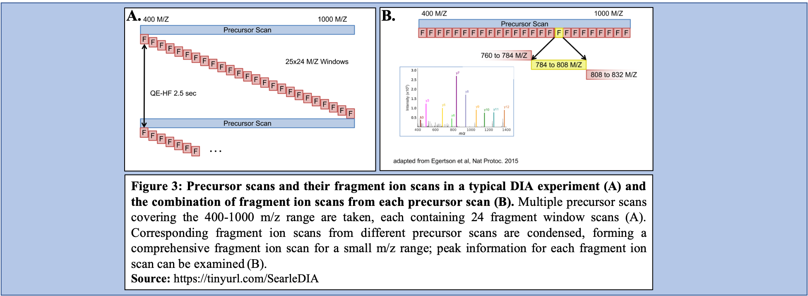
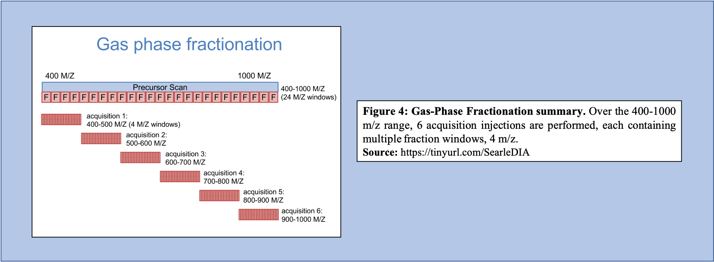

# Introduction
{:.no_toc}

<!-- This is a comment. -->

General introduction about the topic and then an introduction of the
tutorial (the questions and the objectives). It is nice also to have a
scheme to sum up the pipeline used during the tutorial. The idea is to
give to trainees insight into the content of the tutorial and the (theoretical
and technical) key concepts they will learn.

You may want to cite some publications; this can be done by adding citations to the
bibliography file (`tutorial.bib` file next to your `tutorial.md` file). These citations
must be in bibtex format. If you have the DOI for the paper you wish to cite, you can
get the corresponding bibtex entry using [doi2bib.org](https://doi2bib.org).

With the example you will find in the `tutorial.bib` file, you can add a citation to
this article here in your tutorial like this:
 ``.
This will be rendered like this: , and links to a
[bibliography section](#bibliography) which will automatically be created at the end of the
tutorial.


**Please follow our
[tutorial to learn how to fill the Markdown]({{ site.baseurl }}/topics/contributing/tutorials/create-new-tutorial-content/tutorial.html)**

> ### Agenda
>
> In this tutorial, we will cover:
>
> 1. What the EncyclopeDIA workflow accomplishes.
> 2. What inputs are needed to run the EncyclopeDIA workflow.
> 2. How to prepare inputs and how to run the EncyclopeDIA workflow.
> {:toc}
>
{: .agenda}

# DDA, DIA, and the differences between them

Data Independent Acquisition (DIA) is a novel technique for the analysis of proteomic data samples and is a promising alternative to Data Dependent Acquisition (DDA) which has been traditionally used. 

DDA is a method in which specific precursor ions are selected for fragmentation based on their measured abundance in MS1. Once selected, MS2 data is collected for these m/z time points and used to determine the sequences of the peptides that are present. Additionally, when integrated with the information given with the precursor peak, the quantity of peptide can be further calculated. The various precursor ions that are further analyzed with MS2 are selected based on their abundances in MS1 (Figure 1).


On the other hand, DIA selects for multiple ion fragments within a specified m/z range (Figure 2). Compared to DDA that selects for a specific time point corresponding to a specific peptide, DIA scans across a time range resulting in multiplexed and complex data containing peak information from multiple peptides. 


In a typical DIA experiment, the precursor scan usually ranges between 400-1000 m/z as opposed to 400-1600 m/z typically associated with DDA experiments. Multiple precursor scans are taken, each containing several fragment scans spanning across the entire 400-1000 m/z range (Figure 3A). Specific corresponding fragment ion scans can then be condensed and each combined fragment ion scan containing a small m/z range can be examined for peaks and peptide presence can then be analyzed (Figure 3B). 



-->(Give some background about what the trainees will be doing in the section.
Remember that many people reading your materials will likely be novices,
so make sure to explain all the relevant concepts.)<--

## Title for a subsection

-->(Section and subsection titles will be displayed in the tutorial index on the left side of
the page, so try to make them informative and concise!)<--

# Hands-on Sections

-->(Below are a series of hand-on boxes, one for each tool in your workflow file.
Often you may wish to combine several boxes into one or make other adjustments such
as breaking the tutorial into sections, we encourage you to make such changes as you
see fit, this is just a starting point :) )<--

-->(Anywhere you find the word "***TODO***", there is something that needs to be changed
depending on the specifics of your tutorial.) <--

have fun!

## Get data

> ###  Hands-on: Data upload
>
> 1. Create a new history for this tutorial
> 2. Import the files from [Zenodo]({{ page.zenodo_link }}) or from
>    the shared data library (`GTN - Material` -> `{{ page.topic_name }}`
>     -> `{{ page.title }}`):
>
>    ```
>    
>    ```
>    ***TODO***: *Add the files by the ones on Zenodo here (if not added)*
>
>    ***TODO***: *Remove the useless files (if added)*
>
>    
>    
>
> 3. Rename the datasets
> 4. Check that the datatype
>
>    
>
> 5. Add to each database a tag corresponding to ...
>
>    
>
{: .hands_on}

# Conversion of file types

msconvert is the first tool in this EncyclopeDIA workflow as before analysis of such DIA data may begin, the data files must be converted to the correct file type (mzML) from the raw data. Conversion from raw to mzML is important because SearchToLib (generation of the Chromatogram Library), as well as EncyclopeDIA (analysis of DIA data) require mzmL inputs. As msconvert exists on the Galaxy platform, conversion of files to the necessary type is straightforward, and can be incorporated into the workflow itself as opposed to a separate precursor. Both the GPF DIA raw data and the Experimental DIA raw data are run through msconvert for conversion to mzML for the following steps, creation of the Chromatogram Library and analysis of DIA data through EncyclopeDIA.

In this workflow, msconvert uses dataset collections. The tool will convert each of the data files in the collection from a raw file-type to a mzML file-type. Then, a dataset collection containing the mzML files will be generated as the output from msconvert.


***TODO***: *Consider adding a detail box to expand the theory*

> ###  More details about the theory
>
> But to describe more details, it is possible to use the detail boxes which are expandable
>
{: .details}

A big step can have several subsections or sub steps:


## Sub-step with **msconvert**

> ###  Hands-on: Task description
>
> 1.  with the following parameters:
>    -  *"Input unrefined MS data"*: `output` (Input dataset collection)
>    - *"Do you agree to the vendor licenses?"*: `Yes`
>    - *"Output Type"*: `mzML`
>    - In *"Data Processing Filters"*:
>        - *"Apply peak picking?"*: `Yes`
>        - *"Apply m/z refinement with identification data?"*: `Yes`
>        - *"(Re-)calculate charge states?"*: `no`
>        - *"Filter m/z Window"*: `Yes`
>        - *"Filter out ETD precursor peaks?"*: `Yes`
>        - *"De-noise MS2 with moving window filter"*: `Yes`
>        - *"Demultiplex overlapping or MSX spectra"*: `Yes`
>    - In *"Scan Inclusion/Exclusion Filters"*:
>        - *"Filter MS Levels"*: `Yes`
>    - In *"General Options"*:
>        - *"Sum adjacent scans"*: `Yes`
>        - *"Output multiple runs per file"*: `Yes`
>
>    ***TODO***: *Check parameter descriptions*
>
>    > ###  Comment
>    >
>    > For this workflow, msconvert requires that the raw datasets be in a dataset collection.
>    {: .comment}
>
{: .hands_on}

***TODO***: *Consider adding a question to test the learners understanding of the previous exercise*

> ###  Questions
>
> 1. Why is conversion from raw to mzML necessary?
> 2. Can you use any other tool for conversion?
>
> > ###  Solution
> >
> > 1. SearchToLib and EncyclopeDIA require mzML file inputs. Failing to convert the experimental DIA data and the GPF DIA data from raw files would mean that SearchToLib and EncyclopeDIA would not run successfully. 
> > 2. Answer for question2
> >
> {: .solution}
>
{: .question}

## Sub-step with **msconvert**

> ###  Hands-on: Task description
>
> 1.  with the following parameters:
>    -  *"Input unrefined MS data"*: `output` (Input dataset collection)
>    - *"Do you agree to the vendor licenses?"*: `Yes`
>    - *"Output Type"*: `mzML`
>    - In *"Data Processing Filters"*:
>        - *"Apply peak picking?"*: `Yes`
>        - *"Apply m/z refinement with identification data?"*: `Yes`
>        - *"(Re-)calculate charge states?"*: `no`
>        - *"Filter m/z Window"*: `Yes`
>        - *"Filter out ETD precursor peaks?"*: `Yes`
>        - *"De-noise MS2 with moving window filter"*: `Yes`
>        - *"Demultiplex overlapping or MSX spectra"*: `Yes`
>    - In *"Scan Inclusion/Exclusion Filters"*:
>        - *"Filter MS Levels"*: `Yes`
>    - In *"General Options"*:
>        - *"Sum adjacent scans"*: `Yes`
>        - *"Output multiple runs per file"*: `Yes`
>
>    ***TODO***: *Check parameter descriptions*
>
>    ***TODO***: *Consider adding a comment or tip box*
>
>    > ###  Comment
>    >
>    > A comment about the tool or something else. This box can also be in the main text
>    {: .comment}
>
{: .hands_on}

***TODO***: *Consider adding a question to test the learners understanding of the previous exercise*

> ###  Questions
>
> 1. Question1?
> 2. Question2?
>
> > ###  Solution
> >
> > 1. Answer for question1
> > 2. Answer for question2
> >
> {: .solution}
>
{: .question}

# Chromatogram Library Generation

Libraries used in DIA data analysis are often constructed from DDA data assuming that assuming that DDA data is a reasonable substitute or reasonable representation of DIA data, which is not always the case. However, researchers began postulating that libraries could be generated using DIA data, and have begun utilizing these libraries as well as libraries generated through other methods. 

As mentioned, there are challenges associated with the use of DDA libraries to analyze DIA data. The main challenge is that the difference in the method of data generation means that the retention times contained in DDA libraries are not always accurate to the retention times in the DIA data to which it is compared. Retention time accuracy is dependent on how the protein elutes off the column as well as how this changes based on what elutes in its environment creating variance between DDA and DIA methods. Additionally, DDA libraries can be cumbersome to generate when examining DIA data due to fractionation. More specifically, the method in which the fractions are generated is important. For example, SCX fractionation provides a vastly different profile compared to high pH reverse phase fractionation. Thus, to generate a comprehensive profile in DDA library generation, multiple fractionation methods must be completed. So, while DDA libraries can be used to analyze DIA data, their use significantly increases the required labor and the quantity of data required to generate a library.

Libraries generated using DIA data could bypass several issues, including lowering the overall labor required to produce the library, as well as increasing the accuracy of the library concerning the sample that is being analyzed. To generate libraries using DIA data, Gas Phase Fractionation (GPF) is used. In DDA library generation, typically one injection is performed over the precursor scan, with multiple (24) ion fraction windows contained over the scan. However, using GPF, multiple acquisitions are used for each precursor scan to make up the range of 400-1000 m/z. For example, if six injections are performed over this m/z range, each containing the same number of windows like that of the injection in DDA library generation, then each window will be far smaller (Figure 4). 



As shown in Figure 4, GPF and its multiple injections allows for a far richer and more in-depth understanding of the peptide content within the sample making it a useful tool in library generation. In addition to producing a more comprehensive picture of the sample, the GPF method can be used on pooled DIA quantitative samples (Figure 5). Therefore, the pooled sample generates a thorough library through GPF while incorporating a spectrum library to create an “On-column Chromatogram Library” from DIA sample data.


SearchToLib is the tool responsible for the generation of the Chromatogram Library in this EncyclopeDIA workflow. A library is generated using the spectral files converted previously, a background protein database in FASTA format, as well as a .dlib spectral library. Outputs from this tool include the Chromatogram Library in an .elib format, as well as a text log file.

SearchToLib generates two output files:

- Log txt file

  This file is not visualized in the workflow output as it contains the progress of the workings of SearchToLib.

- Chromatogram Library in ELIB format

  As the Chromatogram Library is generated using an ELIB format, it contains additional quantification data on retention time, peak intensity, and m/z ratios compared to DDA library files, typically generated using a DLIB format. This file will serve as the Chromatogram Library ELIB File input when running EncyclopeDIA.

## **SearchToLib**

> ###  Hands-on: Task description
>
> 1.  with the following parameters:
>    -  *"Spectrum files in  mzML format"*: `output` (output of **msconvert** )
>    -  *"Library: Chromatagram .ELIB or Spectrum .DLIB"*: `output` (Input dataset)
>    -  *"Background proteome protein fasta database"*: `output` (Input dataset)
>    - In *"Parameter Settings"*:
>        - *"Set Acquisition Options"*: `No - use default options`
>        - *"Set Tolerance Options"*: `No - use default options`
>        - *"Set Percolator Options"*: `No - use default options`
>        - *"Set Peak Options"*: `No - use default options`
>        - *"Set Window Options"*: `No - use default options`
>        - *"Set Modifications Options"*: `No - use default options`
>        - *"Set Search Options"*: `No - use default options`
>
>    ***TODO***: *Check parameter descriptions*
>
>    ***TODO***: *Consider adding a comment or tip box*
>
>    > ###  Comment
>    >
>    > A comment about the tool or something else. This box can also be in the main text
>    {: .comment}
>
{: .hands_on}

***TODO***: *Consider adding a question to test the learners understanding of the previous exercise*

> ###  Questions
>
> 1. Question 1?
> 2. 
>
> > ###  Solution
> >
> > 1. answer to question1

> > 2. answerto question2

> >
> {: .solution}
>
{: .question}

# Without Chromatogram library

However, there are situations in which DIA data is analyzed without the use of DIA data generated libraries (Chromatogram Libraries) or DDA libraries. There are a few different methods and tools that can be used in cases where neither a Chromatogram library nor a DDA library can be generated.

Predicted libraries are being studied in their use in DIA experiments. Specifically, PROSIT is a tool that is used for predicted library generation and it functions by entering peptide sequences through its neural network where it estimates the fragmentation patterns as well as the retention times for the peptide. As PROSIT generates estimates on peptide inputs, it generates a predicted library that can be used in DIA data analysis. This predicted library requires neither DIA sample data nor DDA sample data and is, therefore, a low labor tool in library generation. Predicted libraries are still being studied in their application to DIA data analysis; predicted libraries generally underperform compared to DDA generated libraries. However, these libraries do significantly increase the quality of results compared to forgoing the use of a library altogether. This fact combined with their non-laborious nature means that predicted libraries can be useful in the analysis of DIA data.

In the case in which a predicted library cannot be generated, DIA-Umpire is another tool that is involved in DIA data analysis in which pseudo-spectra are generated. This tool extracts information on coeluting fragment ions that are associated with a specific peptide. This information is used to generate a pseudo-spectrum examining the monoisotopic peak as well as its precursor signals and fragment ions that coelute. Once this information is combined and the pseudo-spectrum is generated with DIA-Umpire, this spectrum can be used relatively normally as if it were a DDA generated library. This method of generating pseudo-spectra is relatively robust; however, it does rely on the ability to detect the monoisotopic precursor peaks.

Write about Walnut if Chromatogram Libraries are absent and add few images


## Sub-step with **Walnut**

> ###  Hands-on: Task description
>
> 1.  with the following parameters:
>    -  *"Spectrum files in  mzML format"*: `output` (output of **msconvert** )
>    -  *"Library: Chromatagram .ELIB or Spectrum .DLIB"*: `elib` (output of **SearchToLib** )
>    -  *"Background proteome protein fasta database"*: `output` (Input dataset)
>    - In *"Parameter Settings"*:
>        - *"Set Acquisition Options"*: `No - use default options`
>        - *"Set Tolerance Options"*: `No - use default options`
>        - *"Set Percolator Options"*: `No - use default options`
>        - *"Set Peak Options"*: `No - use default options`
>        - *"Set Window Options"*: `No - use default options`
>        - *"Set Modifications Options"*: `No - use default options`
>        - *"Set Search Options"*: `No - use default options`
>
>    ***TODO***: *Check parameter descriptions*
>
>    ***TODO***: *Consider adding a comment or tip box*
>
>    > ###  Comment
>    >
>    > A comment about the tool or something else. This box can also be in the main text
>    {: .comment}
>
{: .hands_on}

# Analysis of DIA data through EncyclopeDIA

Encyclopedia is the tool used for DIA data analysis through searching peptides against the generated Chromatogram Library. Utilizing the generated Chromatogram library, as well as the experimental DIA data (mzML format), and the background protein database used previously, EncyclopeDIA searches the experimental DIA data against these libraries. Generated are a log .txt file and two quantitation outputs, one for protein quantitation and one for peptide quantitation. 


EncyclopeDIA generates five output files:

- Log txt file

- Quantification of datasets in ELIB format

- Contatenated quantification of datasets in txt format

- Peptide quantitation in txt format

  This file contains information on peptide sequence, protein ID, and quantity of fragments.

- Protein quantitation in txt format

  This file contains information on sequence of peptides, quantity of peptide fragments, as well as protein IDs.

## Sub-step with **EncyclopeDIA Quantify**

> ###  Hands-on: Task description
>
> 1.  with the following parameters:
>    -  *"Spectrum files in  mzML format"*: `output` (output of **msconvert** )
>    -  *"Library: Chromatagram .ELIB or Spectrum .DLIB"*: `elib` (output of **SearchToLib** )
>    -  *"Background proteome protein fasta database"*: `output` (Input dataset)
>    - In *"Parameter Settings"*:
>        - *"Set Acquisition Options"*: `No - use default options`
>        - *"Set Tolerance Options"*: `No - use default options`
>        - *"Set Percolator Options"*: `No - use default options`
>        - *"Set Peak Options"*: `No - use default options`
>        - *"Set Window Options"*: `No - use default options`
>        - *"Set Modifications Options"*: `No - use default options`
>        - *"Set Search Options"*: `No - use default options`
>
>    ***TODO***: *Check parameter descriptions*
>
>    ***TODO***: *Consider adding a comment or tip box*
>
>    > ###  Comment
>    >
>    > A comment about the tool or something else. This box can also be in the main text
>    {: .comment}
>
{: .hands_on}

***TODO***: *Consider adding a question to test the learners understanding of the previous exercise*

> ###  Questions
>
> 1. Question1?
> 2. Question2?
>
> > ###  Solution
> >
> > 1. Answer for question1
> > 2. Answer for question2
> >
> {: .solution}
>
{: .question}


## Re-arrange

To create the template, each step of the workflow had its own subsection.

***TODO***: *Re-arrange the generated subsections into sections or other subsections.
Consider merging some hands-on boxes to have a meaningful flow of the analyses*

# Conclusion
{:.no_toc}

Sum up the tutorial and the key takeaways here. We encourage adding an overview image of the
pipeline used.
