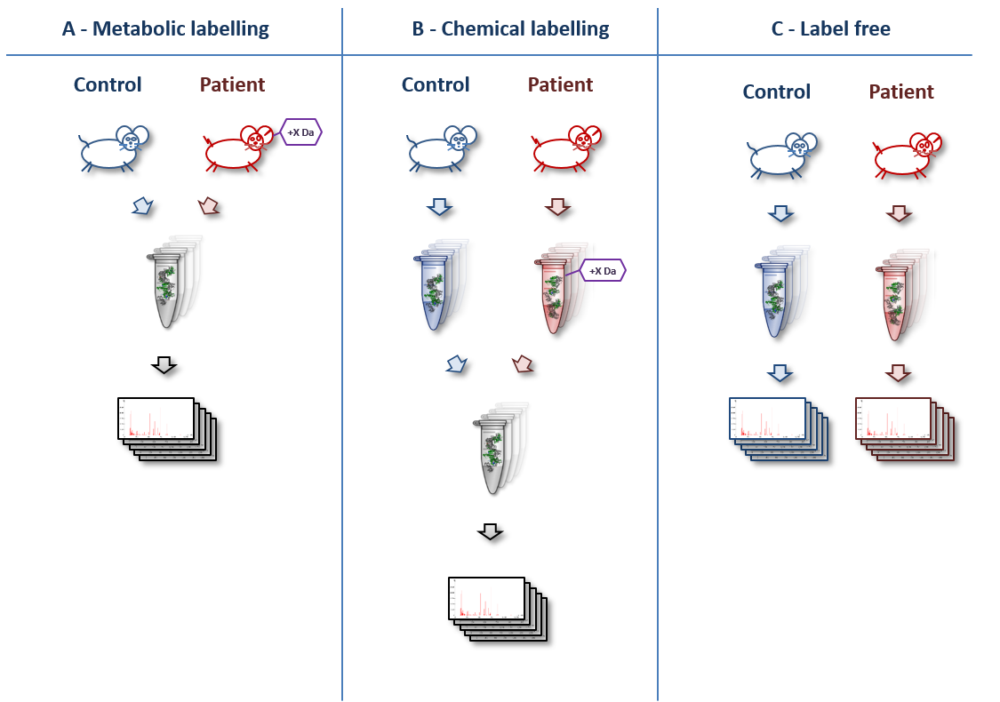

# Purpose

A basic question while planning any quantitative proteomic experiment is the choice between label-free versus labelled quantitation. Here, we would like to address and discuss benefits and drawbacks of each method.
Finally, we will offer a guideline to arrive at a decision on which labeling method to use. We will not discuss various labelling methods here in detail, but focus on our basicquestion on the choice of quantitation method.

A basic overview of various quantitation techniques is shown below ([original artwork](https://www.ncbi.nlm.nih.gov/pubmed/24678044) by Marc Vaudel):

> <agenda-title></agenda-title>
>
> In this tutorial, we will deal with:
>
> 1. TOC
> {:toc}
>
{: .agenda}

# Benefits and Drawbacks of Labelled Quantitation
Label-free methods for quantitation are popular in the proteomics community and may be the most straight-forward laboratory technique in the field. However, labelled approaches have some benefits, which make them the method-of-choice for some scientific questions or experimental designs.

We summarized the Pros and Cons in the table below:

## Benefits and Drawbacks: Overview Table

category | label-free | labelled
:--|:--:|:--:
machine time | more | **less**
wet lab complexity & time | **little** | medium
comparability of samples | difficult | **easy**
data analysis | complex | complex
study design | **flexible** | fixed

The **superior technique** in each line is marked in **bold**.

## Benefits and Drawbacks: Detailed Explanation
- **Machine time**: In label-free experiments, each sample is measured in a separate mass spectrometry (MS) run. In labelled experiments, samples of each condition are combined prior to the MS run. This cuts down the machine time needed by the complexity of the labelling technique (usually between 2 and 8 times less machine time).
- **Wet lab complexity & time**: While label-free samples can be measured without much preparation, all labelling techniques need additional pretreatments in the wet lab. The samples have to be labelled either metabolically (e.g. by SILAC) or chemically (e.g. iTRAQ or TMT) and the different conditions have to be combined. Thus, label-free techniques are less prone to wet lab errors than labelling techniques.
- **Comparability of samples**: A drawback of the label-free approaches is that run conditions (e.g. temperature, experimenter, column condition) may differ between samples. Such differences do not occur in labelled experiments, because samples that are compared to each other are measured in the very same MS run. Therefore, label-free are more prone to errors introduced by the measurement conditions than labelled.
Including a well-chosen standard in label-free experiments (e.g. a labelled control sample mixed to each sample prior to the MS run or the ["Super-SILAC"](https://www.ncbi.nlm.nih.gov/pubmed/20364148) approach) may reduce this problem, but has to be carefully planned in beforehand.
A benefit of label free experiments is that any sample can be directly compared with any other, whereas in labelled experiments, you can typically only directly compare those samples that were physically mixed and measured in one run. A sample that is measured as a reference in each run of a labelled experiment can help to avoid this problem.
- **Data analysis**: Data analysis of each type of experiment has it's special pitfalls. In our opinion, the benefits and drawbacks need to be considered to strike the right balance.
- **Study design**: Label-free approaches have the advantage of being very adaptable, even after having started the study. New samples may be included at any time. In contrast, labelled approaches need the same number (n) of each condition. New samples cannot be included into the study, if they cannot be physically mixed with and measured together with a control.
Labelled techniques like the ["Super-SILAC"](https://www.ncbi.nlm.nih.gov/pubmed/20364148) approach do reduce this problem, but also need to be carefully planned in beforehand.

> <question-title></question-title>
>
> 1. What is the difference between metabolic and chemical labelling?
> 2. What is the "Super-SILAC" approach?
>
> > <solution-title></solution-title>
> > 1. In metabolic labelling (e.g. "SILAC"), samples like cells or whole animals are labelled *in vivo* by providing amino acids containing stable isotope before starting the experiment. In chemical labelling, samples are labelled *in vitro* after extracting the proteins.
> > 2. The "Super-SILAC" approach features mixing of easy obtainable control samples that are related to the sample of interest. An example is to use a mixture of several breast cancer cell lines to compare to breast cancer patient samples. The control sample usually is labelled with heavy isotopes, while the sample of interest is unlabelled. The "Super-SILAC" approach thus combines benefits of labelled and label-free experiments.
> {: .solution }
{: .question}

# Guideline: How to Choose Your Technique
Considering the points mentioned above, the following guideline may help you in finding the right method for your scientific question:

1. **Study design** & **Comparability of samples**: If you cannot predict the availability of samples in beforehand, flexibility is highly important. Therefore, it is advised to use a label-free approach for animal or clinical samples.
2. **Wet lab complexity** & **Data analysis**: Your experience matters! If you see only weak advantages of one approach, stick to the technique you are already used to. It will save time and reduce the likelihood of errors, both in the wet lab and *in silico*.
3. **Machine time**: If you have only limited access to the mass spectrometer, choose a labelling approach.
4. **Wet lab complexity & time**: If you have limited lab resources (e.g. time, man-power, chemicals), choose a label-free approach.
