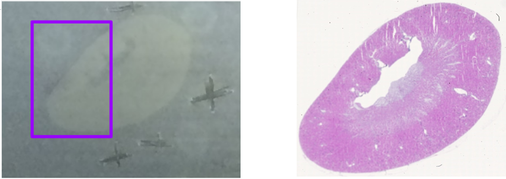
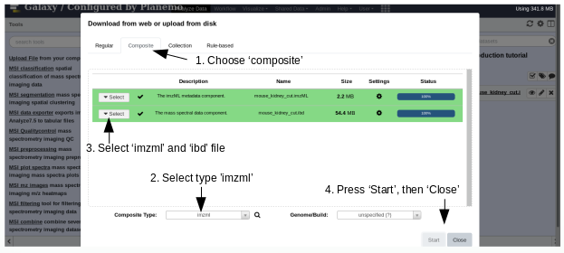
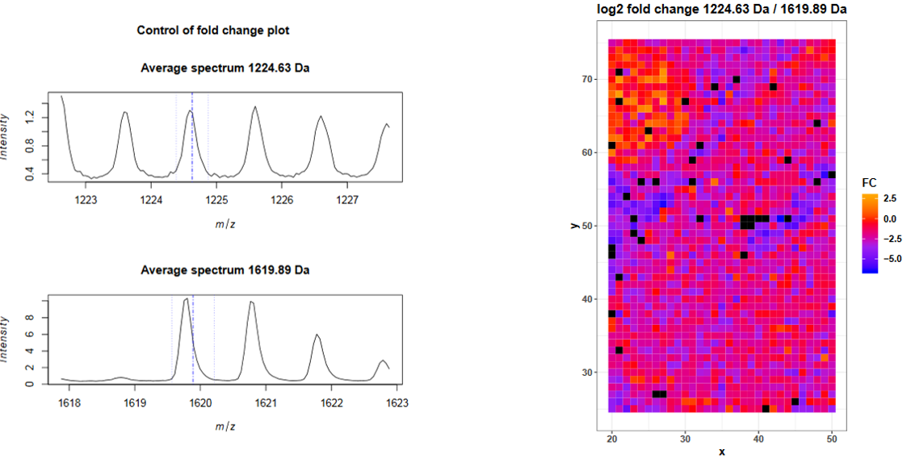
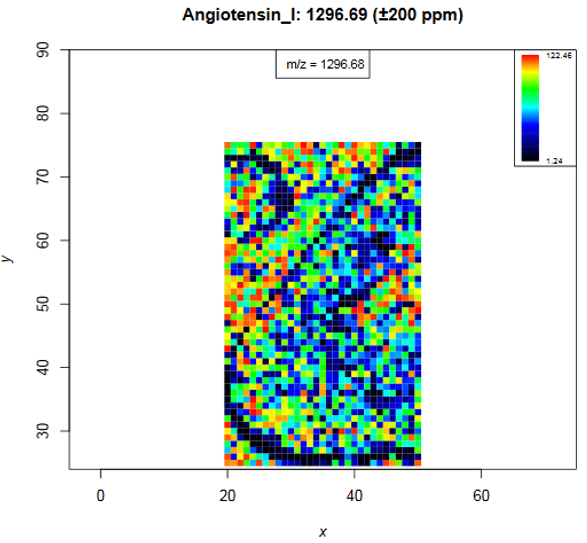
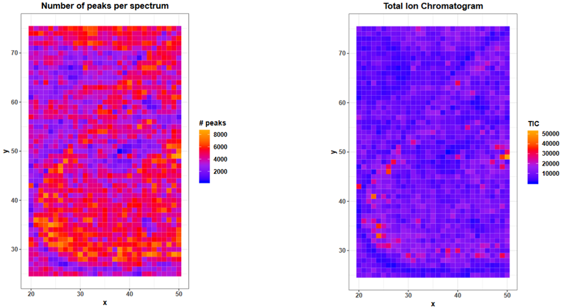
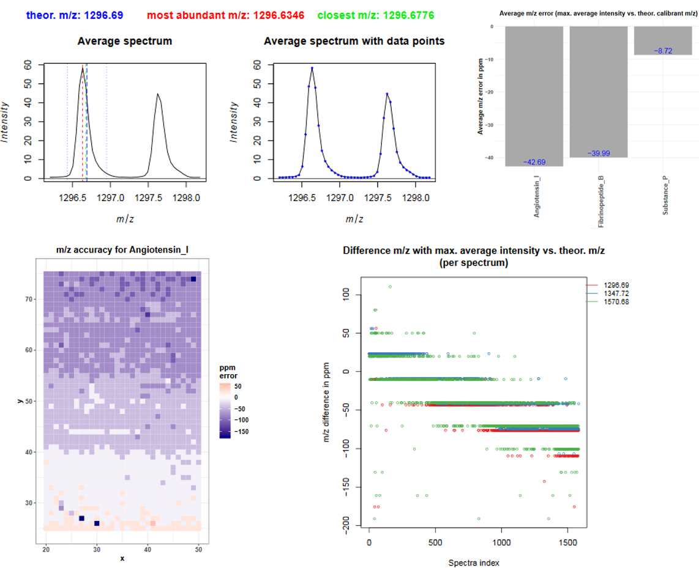

# Introduction
{:.no_toc}

This tutorial introduces the handling of the mass spectrometry imaging (MSI) file type imzML in Galaxy and some first steps to explore the data.

Mass spectrometry imaging is applied to measure the spatial distribution of biomolecules such as peptides, proteins, metabolites or chemical compounds.
Depending on the analyte of interest, different ionization sources and mass analyzers are used in the mass spectrometer.
Traditionally, the resulting MSI data is exported in the file format of the mass spectrometry vendor. With the introduction of the common standard format imzML, more and more vendors provide an imzML export option and further software exists to convert proprietary files into an imzML file.
The imzML file format was introduced to ease the exchange of MSI data between different instruments and data analysis software [Schramm et al., Journal of Proteomics, 2012](https://doi.org/10.1016/j.jprot.2012.07.026).
Galaxy also supports the `Analyze7.5` data format, that is used by ABSciex mass spectrometers.
Independent of the file type all MSI data experiments contain full mass spectra consisitng of mass over charge (m/z) - intensity pairs. Each spectrum has x- and y-coordinates that define the pixel in which it was measured. Often thousands of spectra with hundrets of m/z features are acquired leading to big and complex data.
Before starting with the data analysis it is therefore helpful to visualize all levels of the data in different ways to better understand the data and to obtain an idea about it's quality and usefulness.

> ### Agenda
>
> In this tutorial, we will deal with:
>
> 1. TOC
> {:toc}
>
{: .agenda}


# Uploading an imzML file into Galaxy

In case no direct imzML export is provided by the mass spectrometer software, proprietary files can be converted to imzML files with the tools provided on the following website: [ms-imaging.org](https://ms-imaging.org/wp/imzml/software-tools/).
The imzML file consists of two files: The first file contains the metadata in an XML file and has the extension `.imzML`. The second file contains the mass spectra data and is saved as binary file and its extension is `.ibd`. To be valid both files must have the same filename before the extension. More information about the imzML file structure can be found here: [ms-imaging.org](https://ms-imaging.org/wp/imzml/data-structure/). Galaxy provides the `composite` upload for files consisting of several components.

In this tutorial we will use a dataset obtained from imaging a mouse kidney. To make computation times more suitable for this training, only the m/z range from 1220 - 1625 and a part of the pixels (purple rectangle in figure 1) containing about half of the kidney and one *Bombesin* spot were kept.



> ###  Hands-on: Uploading an imzML file
>
> 1. **Create a new history** and give it a name.
>
>    
>
> 2. Download the imzML data from [Zenodo](https://doi.org/10.5281/zenodo.156064) locally:
>    - [imzML metadata component](https://zenodo.org/record/1560646/files/mouse_kidney_cut.imzML)
>    - [mass spectral data component](https://zenodo.org/record/1560646/files/mouse_kidney_cut.ibd)
>
>    ```
>    https://zenodo.org/record/1560646/files/mouse_kidney_cut.imzML
>    https://zenodo.org/record/1560646/files/mouse_kidney_cut.ibd
>    ```
>
> 3. Upload the data on Galax via the **composite** option
>
>    > ###  Tip: Upload via the composite option
>    > - Open the Galaxy Upload Manager ( on the top-right of the tool panel)
>    > - Click on **Composite** on the top
>    > - Set **Composite Type** to `imzml`
>    > - Expand the first **Select** button (for the imzML metadata component)
>    > - Select **Choose local file** and the local `mouse_kidney_cut.imzML` file
>    > - Paste the link into the text field: `https://zenodo.org/record/1560646/files/mouse_kidney_cut.imzML`
>    > - Expand the second **Select** button (for the mass spectral data component)
>    > - Select **Choose local file** and the local `mouse_kidney_cut.ibd` file
>    > - Press **Start**
>    > - **Close** the window
>    {: .tip}
>
>    
>
>    > ###  Tip: FTP upload for large files
>    > * In case one subfile is larger than 2 GB the uploading needs to be done via ftp.
>    > * The necessary steps are explained in this tutorial [Getting data into Galaxy]({{ site.baseurl }}/topics/galaxy-data-manipulation/tutorials/get-data/slides.html)
>    {: .tip}
>
>    > ###  Tip: Uploading an Analyze7.5 file
>    > * `Analyze7.5` files are also supported by Galaxy.
>    > * The file consists of three components and is therefore uploaded via the 'composite' function, analogously to the imzML upload.
>    > * The files to select in the `composite` tab are the header file `.hdr`, the m/z values file `.t2m` and the spectra file `.img`.
>    {: .tip}
{: .hands_on}


# Exploring MSI data with the MSI quality report tool

Before starting any analysis, it is important to confirm that the quality of the acquired data is sufficient.
Furthermore, knowing the data's properties is important to choose the right preprocessing steps and parameters.
The MSI quality report tool provides a fast way to obtain plenty of descriptive statistic plots for MSI data.
Internal calibrants or other known, ubiquitous m/z features can further be used to obtain further quality measures, such as m/z accuracies.

Our mouse kidney dataset contains internal calibrants that were sprayed together with the matrix onto the tissue. The used calibrants are *Angiotensin I*, *Substance P*,
*Fibrinopeptide B* and *ACTH_18-39*. We furthermore spotted *Bombesin* peptides close to the tissue to monitor the digestion quality with the fold change of digested vs. undigested *Bombesin*.


> ###  Hands-on: Running the MSI quality report tool
> 1. Create the tabular file with the m/z values of the internal calibrants:
>    ```
>    m/z       name
>    1296.69    Angiotensin_I
>    1347.72    Substance_P
>    1570.68    Fibrinopeptide_B
>    2465.19    ACTH_18-39
>    ```
>    
>
> 2. **Rename dataset** to `Calibrants`
>
>    
>
> 3. Run the **MSI quality report**  with the following parameters:
>    -  *"MSI data"*: `mouse_kidney_cut` will be automatically recognized as input file
>    - *"Title"*: `Mouse kidney introduction tutorial`
>    -  *"m/z of interest"*: Select the `Calibrants` tabular file
>    - *"Column with m/z values"*: `Column: 1`
>    - *"Column with name of m/z values"*: `Column: 2`
>    - *"Tabular file contains a header line"*: `Yes`
>    - *"Plot fold change of two m/z"*: `Insert Plot fold change of two m/z`
>    - *"M/z 1"*: `1224.63` (digested *Bombesin*)
>    - *"M/z 2"*: `1619.89` (full length *Bombesin*)
{: .hands_on}


Open the pdf by clicking on the eye icon (view data) and answer the following questions according to the table on the first page.

> ###  Questions
>
> 1. How many m/z features does the dataset contain?
> 2. Are the spectra in profile mode or centroided?
> 3. What is the median number of peaks per spectrum and how can this number be interpreted?
> 4. How many of the provided Calibrants were valid?
>
> > ###  Solution
> > 1. 9013
> > 2. Centroided = FALSE means that the data were read in profile mode. The user has to define in every tool if the input data is in profile or centroided mode. The Centroid value reported here corresponds to the choice the user has made in the tool and not by automatic recognition.
> > 3. Median # peaks per spectrum: 4158. The quality report tool consideres intensities > 0 as peaks. Before peak picking this means that also noise with small intensities is counted as peak, therefore the number 4158 is not as astonighing anymore and will probably decrease dramatically after peak picking. So far nearly every second m/z value has an intensity > 0 (4158 peaks /9013 m/z values).
> > 4. 3 Calibrants out of the 4 Calibrants in the tabular files were valid. As we cut the m/z axis for this tutorial, ACTH is outside the m/z range that we kept (1220 - 1625).
> {: .solution }
{: .question}

The pdf report continous with plots that show the pixel of the sample in an x-y-coordinate grid. As in each pixel one spectrum is acquired, different properties of the mass spectra can be visualized in the pixel image. The help section of the quality report tool describes each plot of the pdf report, the tutorial here will discuss only some plots in more detail.

#### Fold change plots

On page 4 and 5 there are the fold change plot that can be used to estimate the efficiency of the tryptic digestion. The first plot shows the average mass spectra for the digested and the undigested *Bombesin* peptide. The blue lines indicate the provided ppm range and the provided m/z value. The spectrum of the digested peptide probably overlaps with another peptide pattern, while the monoisotopic peak of the *Bombesin* peptide is clear. The average intensity of the full length *Bombesin* peptide is higher than the one of the digested peptide.
The average intensity is not helpful here, because we only spotted one drop next to the tissue and the intensity fold change in those pixels is important. The previous spectra plot is useful to control the chosen m/z value and ppm range. To obtain the local fold change in each spectrum the intensities in the m/z ranges of both peptides are averaged, the intensity of the first m/z is divided by the intensity of the second m/z and log2 transformed to obtain the log2 fold change. This value is plotted for each spectrum (pixel) and then it is obvious that many spectra in the upper left corner have a log2 fold change > 0. The drop contains also spectra with a log2 fold change smaller 0 but larger than -5, what indicates that in these spectra less than half of the *Bombesin* was digested. With the used amounts of spotted *Bombesin* and sprayed *trypsin* the log2 fold changes indicate sufficient (but not ideal) digestion.




#### Calibrant heatmaps

Starting from page 6 for each calibrant an intensity heatmap is plotted. The colour code shows the intensity of the m/z value that is closet to the input m/z value and within the given ppm range. The input m/z value and its name are printed on top of the image, the m/z number in the image shows the closest m/z value, so the m/z value which intensites are plotted in the heatmap. Low *Angiotensin* intensities occur at the boarder of the *Bombesin* spot and at the kidney boarder and on some spots in the kidney. In general calibrant intensities are higher in the matrix background than on the tissue due to ion suppression effects. *Substance P* shows also ion suppression in the *Bombesin* spot. The heatmap shows no intensity gradient what indicates that spraying of calibrants and matrix was homogeneous.



> ###  Tip: Plotting heatmaps
> * The **MSI mz images**  tool allows to generate heatmaps with options such as contrast enhancement and smoothing functions.
{: .tip}

#### Number of peaks and TIC images

On page 9 and 10 the number of peaks and the total ion chromatogram (TIC) are plotted per spectrum.

The number of peaks is defined as intensity > 0 what means that before peak picking also noise with intensity > 0 is counted in. Therefore the number of peaks is not much higher in the tissue compared to the background matrix, but this should change after peak picking.

The TIC is the sum of all intensities of one spectrum. Therefore with more peaks in one spectrum the TIC should also be higher. due to their low intensities, noise peaks contribute less to TICs than real peaks, but with the large amount of noise we have in our data, this of course sums also up (4158 peaks per spectrum but we expect only a few hundret peaks with our MS).

Both plots are helpful to decide if TIC normalization can be performed, as TIC normalization assumes that the number of peaks per spectrum are the same in all spectra (QUELLE).



Both plots can also serve to check for spraying gradients or reduced machine performance during acquisition time. The mouse kidney was measured from bottom to top (plot on page 2), the performance over time can be easier spotted in the upper plots on page 14 and 15, where the x axis represents the spectra in the order they were measured.

#### Mass spectra and m/z error

From page 18 on, average mass spectra plots for each (valid) calibrant are plotted (A). Three different m/z scales are used and in one spectrum each blue dot indicates one data point. The theoretical *Angiotensin* I m/z (1296.69 - dashed blue line) is higher than the maximum of the peak (red line). There is no m/z value with exact m/z value of *Angiotensin I* (1296.69) but a close m/z value that is 1296.6776 (green line).



> ###  Tip: Plotting mass spectra
> * The **MSI plot spectra**  tool allows to generate different mass spectra plots:
> * For single pixels, average spectra for the complete file or pixels of interest
> * With different m/z axis ranges (zoom function)
{: .tip}

Figure D) The average plots already give a good estimation about the m/z error, but the error of each spectrum should also be considered. For this dataset a shift over time can be seen: At the beginning of the measurement the spectra had m/z errors up to 50 ppm for Fibrinopeptide B and during measurement the m/z error changed to -100ppm. This indicates that the dataset has to be binned or aligned with 150 ppm tolerance to ensure that the same peptides get a common m/z value.


# Exporting MSI data to tabular files

The data from the imzMl file format is not directly readable, therefore special tools are needed to extract information. The **MSI data exporter**  provides the option to export spectra, feature and intensity data from imzML files as tabular files. The underlaying values of the quality report can be found in the tabular files and allow to follow up on interesting aspects seen in quality report plots. Furthermore, tabular files are compatible with most software for statistical analysis and to generate plots. The intensity matrix of an unprocessed file might be huge as all pixels and all m/z values are stored in the file - the intensity matrix is often more helpful after preprocessing and filtering of the data. Despite preprocessing and filtering, the output tabular files are often too large for visual inspection. Galaxy offers many different text manipulation tools that are helpful to sort and filter such large tabular files. > To find the m/z value that has the highest mean intensity over all pixels, the data can be sorted on the column with the mean intensities:

> ###  Hands-on: Export and explore information from MSI data
>
> 1. Run **MSI data exporter**  with the following parameters:
>    -  *"MSI data"*: `mouse_kidney_cut`
>    - *"Multiple output files can be selected"*: `mz feature output` and `pixel output`
>
> 2. Run **Sort data in ascending or descending order**  with the following parameters:
>    -  *"Sort Query"*: `MSI data exporter on data 1: features` (output of **MSI data exporter** )
>    - *"Number of header lines"*: `1`
>    - *"on column"*: `column: 3`
>    - *"in"*: `descending order`
>    - *"Flavor"*: `general numeric sort`
>
{: .hands_on}

The m/z values with the highest mean intensities over all pixels are the monoisotopic peaks and isotopic peaks of the calibrant
Substance P with some ppm errors because the data was not yet binned or aligned.

> ###  Questions
>
> 1. How many spectra does the dataset contain?
> 2. How many numeric properties does the m/z feature output contain?
>
> > ###  Solution
> > 1. 1581 - The pixel output file has 1582 lines, every line contains the information of one spectrum, but the first line is a header line (click on dataset "MSI data exporter on data 1: spectra" in the history, the line number of the file is written below the dataset name)
> > 2. 7 - The feature file has 8 columns and except for the mz_names, all columns contain numeric properties, that can be used for further calculations.
> {: .solution }
{: .question}

# Conclusion
{:.no_toc}
