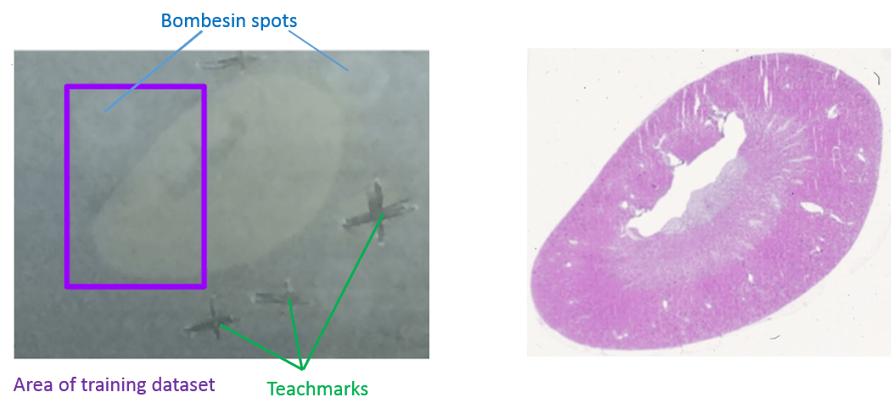

# Introduction


Mass spectrometry imaging (MSI) is applied to measure the spatial distribution of hundreds of biomolecules in a sample. A mass spectrometer scans over the entire sample and collects a mass spectrum every 5-200 µm. This results in thousands of spots in which a mass spectrum is acquired. Each mass spectrum consists of hundreds of analytes that are measured by their mass-to-charge (m/z) ratio. For each analyte the peak intensity in the mass spectra of every pixel is known and can be set together to map the spatial distribution of the analyte in the sample.

The technique has a broad range of applications as it is able to measure many different kinds of analytes such as peptides, proteins, metabolites or chemical compounds in a large variety of samples such as cells, tissues and liquid biopsies. Application areas include pharmacokinetic studies, biomarker discovery, molecular pathology, forensic studies, plant research and material sciences. The strength of MSI is the simultaneous analysis of hundreds of analytes in an unbiassed, untargeted, label free, fast and affordable measurement while maintaining morphological information.

Depending on the analyte of interest and the application, different mass spectrometers are used. A mass spectrometer measures the analytes by ionizing, evaporating and sorting them by their mass-to-charge (m/z) ratio. Put simply, a mass spectrometer needs basically three parts: an ionization source, a mass analyzer and a detector. Most common ionization sources for MSI are MALDI (Matrix Assisted Laser Desorption/Ionization), DESI (Desorption Electrospray Ionization) and SIMS (Secondary Ion Mass Spectrometry).


One common type of mass spectrometer for MSI is a MALDI Time-Of-Flight (MALDI-TOF) device. During MALDI ionization a laser shoots onto the sample that was covered with a special matrix which absorbs the laser energy and transfers it to the analytes. This process evaporizes and ionizes the analytes that due to their charge can then be accelerated in an electrical field towards the TOF tube. The time of flight through the tube to the detector is measured and as this correlates with the mass over charge (m/z) of the analyte, the flight time allows the calculation of m/z. During measurement complete mass spectra with hundreds of m/z - intensity pairs are acquired in thousands of sample plots leading to big and complex data. Each mass spectrum is annotated with coordinates (x,y) that define its location in the sample. This allows to visualize the intensity distribution of each m/z feature in the sample as a heatmap. Depending on the analyte of interest, the sample type and the mass spectrometer the sample preparation steps as well as the properties of the acquired data differ.

This tutorial introduces the handling of the mass spectrometry imaging (MSI) file type imzML in Galaxy and some first steps to explore the data.
The imzML file format was introduced to ease the exchange of MSI data between different instruments and data analysis software ([Schramm et al., Journal of Proteomics, 2012](https://doi.org/10.1016/j.jprot.2012.07.026)). More and more vendors provide an imzML export option and there are [software solutions](https://ms-imaging.org/wp/imzml/software-tools/) to convert proprietary files into imzML files. Before starting any analysis it is recommended to visualize all features of the data in different ways to better understand the data and to obtain an idea about it's quality and usefulness.


> <agenda-title></agenda-title>
>
> In this tutorial, we will deal with:
>
> 1. TOC
> {:toc}
>
{: .agenda}


# Uploading an imzML file into Galaxy

In case no direct imzML export is provided by the mass spectrometer software, proprietary files can be converted to imzML files with the tools provided on the following website: [ms-imaging.org](https://ms-imaging.org/wp/imzml/software-tools/).
The imzML file consists of two files: The first file contains the metadata in an XML file and has the extension `.imzML`. The second file contains the mass spectra data and is saved as binary file and its extension is `.ibd`. To be valid both files must have the same filename before the extension. More information about the imzML file structure can be found here: [ms-imaging.org](https://ms-imaging.org/wp/imzml/data-structure/). Galaxy provides the `composite` upload for files consisting of several components.

The data for this tutorial comes from MALDI-TOF imaging of peptides in a mouse kidney. To make computation times more suitable for this training, only the m/z range from 1220 - 1625 and a part of the pixels (purple rectangle in figure 1) containing about half of the kidney and one digestion control spot were kept.




> <hands-on-title>Uploading an imzML file</hands-on-title>
>
> 1. **Create a new history** and give it a name.
>
>    
>
> 2. Upload the data from [Zenodo](https://zenodo.org/record/1560646) via the **composite** option
>
>    > <tip-title>Upload via the composite option</tip-title>
>    > - Open the Galaxy Upload Manager( on the top-right of the tool panel)
>    > - Click on **Composite** on the top
>    > - Set **Composite Type** to `imzml`
>    > - Expand the first **Select** button (for the imzML metadata component)
>    > - Select **Paste/Fetch data** and paste
>    >    ```
>    > https://zenodo.org/record/1560646/files/mouse_kidney_cut.imzML
>    >    ```
>    > - Expand the second **Select** button (for the mass spectral data component)
>    > - Select **Paste/Fetch data** and paste
>    >    ```
>    > https://zenodo.org/record/1560646/files/mouse_kidney_cut.ibd
>    >    ```
>    > - Press **Start**
>    > - **Close** the window
>    {: .tip}
>
>    
>
>    > <tip-title>FTP upload for large files</tip-title>
>    > * In case one subfile is larger than 2 GB the uploading needs to be done via ftp.
>    > * The necessary steps are explained in this tutorial [Getting data into Galaxy]({{ site.baseurl }}/topics/galaxy-interface/tutorials/get-data/slides.html)
>    {: .tip}
>
>    > <tip-title>Uploading an Analyze7.5 file</tip-title>
>    > * `Analyze7.5` files are also supported by Galaxy.
>    > * The file consists of three components and is therefore uploaded via the 'composite' function, analogously to the imzML upload.
>    > * The files to select in the `composite` tab are the header file `.hdr`, the m/z values file `.t2m` and the spectra file `.img`.
>    {: .tip}
>
> 3. Rename the data into `mouse_kidney_cut`
>
>    > <tip-title>Rename a dataset</tip-title>
>    > - Click on the  **pencil icon** for the dataset to edit its attributes
>    > - In the central panel, change the **Name** field to `mouse_kidney_cut`
>    > - Click the **Save** button
>    {: .tip}
{: .hands_on}


# Exploring MSI data with the MSI Qualitycontrol tool

Before starting any analysis, it is important to confirm that the quality of the acquired data is sufficient.
Furthermore, knowing the data's properties is important to choose the right preprocessing steps and parameters.
The steps that most influence the spatial delocalization and preparation quality in an MALDI imaging experiment is the homogeneous matrix deposition and for peptide analysis in addition the trypsin deposition and digestion step as reported by [Ly et al.](https://doi.org/10.1002/prca.201800029). To monitor the digestion quality, three *Bombesin* peptide drops were spotted close to the tissue. Furthermore, the mouse kidney dataset contains internal calibrants that were sprayed together with the matrix onto the tissue and can be used to monitor intensity gradients and mass accuracy. The used calibrants were *Angiotensin I*, *Substance P*, *Fibrinopeptide B* and *ACTH_18-39*.

The **MSI Qualitycontrol*  provides a fast way to obtain plenty of descriptive statistic plots for MSI datasets.
Internal calibrants or other known, ubiquitous m/z features can be used to obtain further quality measures, such as m/z accuracies.

The mouse kidney dataset contains internal calibrants that were sprayed together with the matrix onto the tissue. The used calibrants were *Angiotensin I*, *Substance P*,
*Fibrinopeptide B* and *ACTH_18-39*. We furthermore spotted *Bombesin* peptides close to the tissue to monitor the digestion quality with the fold change of digested vs. undigested *Bombesin*.


> <hands-on-title>Running the MSI Qualitycontrol tool</hands-on-title>
> 1. Create the tabular file with the m/z values of the internal calibrants:
>    ```
>    m/z       name
>    1296.69    Angiotensin_I
>    1347.72    Substance_P
>    1570.68    Fibrinopeptide_B
>    2465.19    ACTH_18-39
>    ```
>    
>
> 2. **Rename dataset** to `Calibrants`
>
>    
>
> 3. Run the **MSI Qualitycontrol**  with the following parameters:
>    -  *"MSI data"*: `mouse_kidney_cut imzML` will be automatically recognized as input file
>    - *"Title"*: `Mouse kidney introduction tutorial`
>    -  *"m/z of interest"*: Select the `Calibrants` tabular file
>    - *"Column with m/z values"*: `Column: 1`
>    - *"Column with name of m/z values"*: `Column: 2`
>    - *"Tabular file contains a header line"*: `Yes`
>    - *"Plot fold change of two m/z"*: `Insert Plot fold change of two m/z`
>    - *"M/z 1"*: `1224.63` (digested *Bombesin*)
>    - *"M/z 2"*: `1619.89` (full length *Bombesin*)
>    - Press **Execute**
{: .hands_on}


Open the pdf by clicking on the eye icon (view data) and answer the following questions according to the summary table on the first page.

> <question-title></question-title>
>
> 1. How many m/z features does the dataset contain?
> 2. Are the spectra in profile mode or centroided?
> 3. What is the median number of peaks per spectrum and how can this number be interpreted?
> 4. How many of the provided Calibrants were valid?
>
> > <solution-title></solution-title>
> > 1. 9013
> > 2. Centroided = FALSE means that the data were read in profile mode. The user has to define in every tool if the input data is in profile or centroided mode. The Centroid value reported here corresponds to the choice the user has made in the tool and not by automatic recognition. To find out what the correct choice is visit [Mass spectrometry imaging: Examining the spatial distribution of analytes]({{ site.baseurl }}/topics/metabolomics/tutorials/msi-analyte-distribution/tutorial.html#quality-control-of-the-data).
> > 3. Median # peaks per spectrum: 4158. The **MSI Qualitycontrol**  consideres intensities > 0 as peaks. Before peak picking this means that also noise with small intensities is counted as peak what explains why nearly every second m/z value has an intensity > 0 (4158 peaks /9013 m/z values). After peak picking the number of peaks will decrease dramatically because only real peaks will be left.
> > 4. 3 Calibrants out of the 4 Calibrants in the tabular files were valid, that means in the m/z range of the dataset. As we cut the m/z axis for this tutorial, *ACTH* is outside the m/z range that we kept (1220 - 1625).
> {: .solution }
{: .question}

Each plot of the **MSI Qualitycontrol**  is described in the help section at the bottom of the tool, this tutorial will discuss a few selected plots in more detail.


#### Digestion efficiency

The complete digestion of proteins into peptides is a crucial step when performing mass spectrometry of peptides. In MSI the digestion is further hindered by the fact that digestion has to occur on the tissue. One way to control digestion efficiency was suggested by [Erich et al.](https://www.sciencedirect.com/science/article/pii/S1570963916301820?via%3Dihub). They spotted *cytochrome c* next to the tissue before and after digestion and compared the protein intensities in the two spots.

For the mouse kidney dataset we applied a similar approach and added three *bombesin* spots next to the kidney tissue (Figure 2) before digestion. *Bombesin* has the amino acid sequence QRLGNQWAVGHLM and a mass of 1619.89 Da. During trypsin digestion *bombesin* is cleaved by trypsin after arginin (R) what leads to the cleaved peptide LGNQWAVGHLM with a mass of 1224.63 Da. The digestion efficiency can be estimated from the log2 ratio (fold change) of these two peptides in the pixels of the *bombesin* spot.

The fold change plots are on page 4 and 5 of the pdf report. The first plot shows the average mass spectra for the digested and the undigested *bombesin* peptides. The blue lines indicate the provided m/z value and the chosen ppm range. The average intensity of the full length *bombesin* peptide is higher than the one of the digested peptide but the average intensity is not helpful here, because we only spotted one drop next to the tissue and only the intensity fold change in those pixels is important. The spectra plot is useful to control the chosen m/z value and ppm range. To obtain the log2 fold change in each spectrum, for each peptide the intensities in the m/z ranges are averaged, the intensity of the first m/z feature is divided by the intensity of the second m/z feature and log2 transformed. The log2 fold change for each spectrum (pixel) is plotted on page 5 and reveals that many spectra in the upper left corner (where the *bombesin* spot is) have a log2 fold change >= 0 what indicates that there is more digested than undigested *bombesin* peptides and that the tryptic digestion was successful.


#### Distribution images for Calibrants

Have a look at the calibrant plots from page 6 on, especially regarding the distribution patterns. The colour code shows the intensity of the m/z value that is closest to the input m/z and if the ppm range contains several m/z features their intensities are averaged. The input m/z value and its name are printed on top of the image, the m/z number in the box shows the closest m/z value (that is 1296.68, as the m/z axis consists of mass bins slight differences are expected). Low *angiotensin* intensities occur at the boarder of the *bombesin* spot and at the boarder of the kidney tissue and on some spots in the kidney. In general calibrant intensities are higher in the matrix background than on the tissue due to ion suppression effects. *Substance P* shows also ion suppression in the *bombesin* spot. The heatmap shows no spatial intensity gradient what indicates that spraying of calibrants and matrix was homogeneous and that the MS performed stable during data acquisition.


> <comment-title>Plotting heatmaps</comment-title>
> * The **MSI mz images**  tool allows to generate heatmaps with futher options such as contrast enhancement and smoothing functions. The usage of the tool is explained in more detail in the tutorial [Mass spectrometry imaging: Examining the spatial distribution of analytes]({{ site.baseurl }}/topics/metabolomics/tutorials/msi-analyte-distribution/tutorial.html).
{: .comment}

#### Number of peaks and total ion current images

On page 9 the number of peaks per spectrum is plotted and the shape of the kidney can be estimated due to slightly higher number of peaks. The number of peaks is defined as intensity > 0 what means that before peak picking also noise with intensity > 0 is counted in. It is quite common for raw MALDI datasets to have a noise baseline in each spectrum and therefore high amounts of 'peaks' before baseline removal is performed. For the mouse kidney dataset baseline removal was already done during acquisition but as also suggested by the median number of peaks per spectrum in the summary table, about half of every m/z value has an intensity > 0. This suggests to check the mass spectra for a baseline and if applicable remove the baseline during preprocessing of the data.

The plot on page 10 shows the total ion current (TIC) for each spectrum with a few outlier TIC > 25000. The TIC is the sum of all intensities of a spectrum. Therefore with more peaks in a spectrum the TIC should also be higher. Due to their low intensities, noise peaks contribute less to the TIC than analyte peaks, but with the large amount of noise we have in this dataset, this of course also sums up. Deviations in TICs are common in MALDI MSI due to e.g. unhomogeneous matrix spray, ion source contamination or pH gradients. To render the spectra more comparable TIC normalization is a default preprocessing step for MALDI MSI data but is based on the assumption that there are comparable numbers of signals present in each spectrum [Deininger et al.](https://link.springer.com/article/10.1007%2Fs00216-011-4929-z).
Both plots can also serve to check for spraying gradients or reduced machine performance during acquisition time. The mouse kidney was measured from bottom to top (plot on page 2), the performance over time can be easier spotted in the upper plots on page 14 and 15, where the x axis represents the spectra in the order they were measured.


#### Most abundand m/z features

The plot on page 13 shows for each spectrum the m/z with the highest intensity ('base peak'). This plot can already reveal some morphological features of the dataset. The plot for the mouse kidney dataset shows that the base peak is the same on the kidney tissue and the matrix background but a different one in the *bombesin* spot. According to the legend the base peak in most spectra is roughly at m/z 1350, the base peak in the *bombesin* spot is roughly at 1280 and in a few spectra at 1570. Later, we will export the spectra information, including the base peak of each spectrum, as a tabular file to find the correct m/z values of the most abundant features in the following spectra: x = 40 y = 50; x = 23, y = 70; x = 20, y = 73.


As the feature around m/z 1350 is the highest feature in most of the spectra it is no suprise to find this feature as highest peak in the average spectra plot on page 20. The second highest peak is around 1300 m/z. It is obvious that those features are the calibrants *substance P* and *angiotensin* as they occur as high intensity peaks on the tissue as well as on the background. At least the concentration of *substance P* but also the concentration of *angiotensin I* could be reduced in further experiments. The concentration of *fibrinopeptide B* is chosen well as the peak at m/z 1570 is visible in most of the spectra plots but does not dominate the spectra as the other two calibrants do.


#### m/z accuracy

A MSI dataset has not only deviations in the intensity dimension but also in the m/z dimension. Mass shifts can occur due to sample topography, small length changes in the flight tube or instable high voltage power supply. Mass accuracy is important for two reasons: First, the identification of m/z relies on accurate mass values and second, comparing m/z features across several spectra or even samples requires them to have similar values in order to be considered as the same molecule.

For precise m/z measurements the mass spectrometers are regularly calibrated with external calibrants that are often applied next to the sample. [Gustafsson et al.](https://www.sciencedirect.com/science/article/pii/S1874391912003259?via%3Dihub) sprayed calibrants onto the complete sample and after MSI measurement used those internal calibrants to recalibrate every spectra what dramatically reduced the m/z error and improved the identification of the m/z features. The same approach was used for the mouse kidney dataset that we use in this tutorial: three internal calibrants are in the m/z range that we work with. These calibrants enable the calculation of the average m/z error as well as the m/z error in each spectrum.

Starting at page 22 for each of the three calibrants average mass spectra are plotted. Three different m/z ranges are visualized while the fourth plot represents each datapoint as blue dot what helps to estimate the correct window sizes during preprocessing of the data. The dashed blue line represents the theoretical m/z, the red line indicates the m/z with the highest average intensity and the green line shows the m/z value that is closest to the theoretical m/z. For *angiotensin I* the theoretical m/z value is ~0.06 m/z higher than the peak maximum. There is no m/z value with the exact m/z of *angiotensin I* (1296.69), the closest m/z value is 1296.6776 (green line). The following barplot (on page 25) shows the average m/z error for each calibrant by taking the difference between the m/z of the peak maximum and the theoretical m/z. For *angiotensin I* this is 1296.6346 - 1296.69 = -0.0554 m/z and corresponds to 0.0554/1296.69*1000000 = 42.7 ppm. The next barplot shows the smallest m/z error that is possible due to the discrete m/z bins of the dataset: the difference between the closest m/z value and the theoretical m/z value.

The average m/z error already gives a hint about the m/z accuracy but it is even more important to consider the m/z error in each individual spectrum. The plot on page 27 shows for each calibrant the m/z error in each spectrum. The spectra index corresponds to the order in which the spectra were measured and it becomes obvious that for all calibrants there is a m/z shift of about 200 ppm happening during acquisition. This gradient is also visible in the following plots where the m/z error in ppm is plotted in each pixel. The ppm error for *angiotensin* is about +50 ppm at the bottom of the dataset (start of acquisition) and decreases to about -150 ppm at the top of the image (end of acquisition). To be able to compare m/z features across the spectra they need to have the same m/z value, therefore recalibration with the **MALDIquant preprocessing**  or binning with the **MSI preprocessing**  and a  tolerance of 200 ppm is highly recommended.


> <comment-title>Plotting mass spectra</comment-title>
> * The **MSI plot spectra**  tool allows to single, average or overlayed mass spectra plots and to zoom into m/z regions of interest. The tool is explained in more detail in the tutorial [Mass spectrometry imaging: Examining the spatial distribution of analytes]({{ site.baseurl }}/topics/metabolomics/tutorials/msi-analyte-distribution/tutorial.html).
{: .comment}


# Exporting MSI data to tabular files for further exploration of the data

The data from the imzML file format is not directly readable, therefore special tools are needed to extract its information. The **MSI data exporter**  provides the option to export spectra, feature and intensity data from imzML files as tabular files. The underlaying values of the quality report can be found in the tabular files and allow to follow up on interesting aspects seen in the quality report plots. Furthermore, tabular files are compatible with most software for statistical analysis and visualization. The intensity matrix of an unprocessed file might be huge as all pixels and all m/z values are stored in the file - therefore, the intensity matrix is often more helpful after preprocessing and filtering of the data. Despite preprocessing and filtering, the output tabular files are often too large for visual inspection. Galaxy offers many different text manipulation tools that are helpful to sort and filter such large tabular files.

To find the m/z value that has the highest mean intensity across all pixels, the feature data can be sorted on the column with the mean intensities. Keep in mind that so far also background spectra are included in the calculation of the mean intensity and those would need to be removed before the mean intensities for the tissue can be calculated.
The spectra data output can be filtered for certain spectra to obtain some spectra properties such as the accurate value of its base peak that could not be accurately determined in the corresponding plot of the quality report before.

> <hands-on-title>Export and explore information from MSI data</hands-on-title>
>
> 1. Run **MSI data exporter**  with the following parameters:
>    -  *"MSI data"*: `mouse_kidney_cut imzML`
>    - *"Multiple output files can be selected"*: `mz feature output` and `pixel output`
>
> 2. Run **Sort data in ascending or descending order**  from the 'text manipulation' category with the following parameters:
>    -  *"Sort Query"*: `Data exporter features` (output of **MSI data exporter** )
>    - *"Number of header lines"*: `1`
>    - *"on column"*: `column: 3`
>    - *"in"*: `descending order`
>    - *"Flavor"*: `general numeric sort`
>
> 3. Run **Select lines that match an expression**  from the 'filter and sort' category with the following parameters:
>    -  *"Select lines from"*: `Data exporter spectra` (output of **MSI data exporter** )
>    - *"the pattern"*: `(xy_40_40)|(xy_23_70)|(xy_20_73)`
>
{: .hands_on}

> <question-title></question-title>
>
> 1. How many spectra does the dataset contain?
> 2. How many numeric properties does the m/z feature output report?
> 3. Which m/z values have the highest mean intensities over all pixels?
>
> > <solution-title></solution-title>
> > 1. 1581 - Clicking on pixel output file name reveals that it has 1582 lines, every line contains the information of one spectrum, but the first line is a header line (click on dataset "MSI data exporter on data 1: spectra" in the history, the line number of the file is written below the dataset name)
> > 2. 7 - The feature file has 8 columns and except for the mz_names, all columns contain numeric properties, that can be used for further calculations.
> > 3. The top m/z values are around 1347.71 and its isotopes (+1 m/z). This m/z feature derives from the *substance P* internal calibrant (the m/z value is not accurate and ondolates a bit because the data was not yet binned or aligned).
> {: .solution }
{: .question}

Exporting and sorting the feature information reveals that *substance P* has the highest mean intensity across all spectra what confirms our estimation when examining the average spectrum plot.
Exporting and filtering the spectra information for three pixel that have different base peaks confirms that the calibrants are the most abundant peaks in most of the spectra. *Substance P* is the base peak in spectrum xy_40_40 and thereby also the most abundant peak in most of the spectra (according to the colouring in the 'most abundant m/z in each spectrum' plot) regardless if they belong to tissue or matrix. Only the pixels that belong to the *bombesin* spot show different base peaks. In spectrum xy_23_70 *angiotensin I* is the highest feature while in spectrum xy_20_73 *fibrinopeptide B* appears as base peak.

