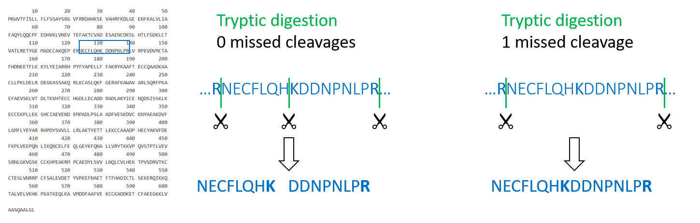
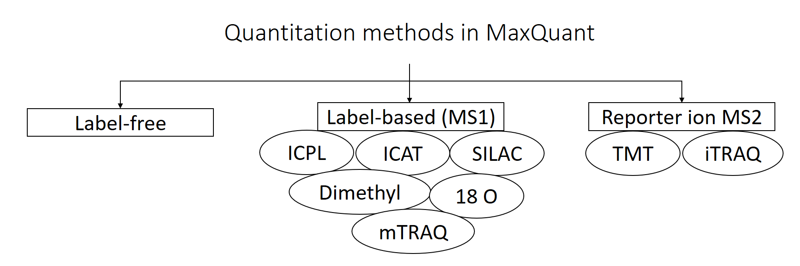
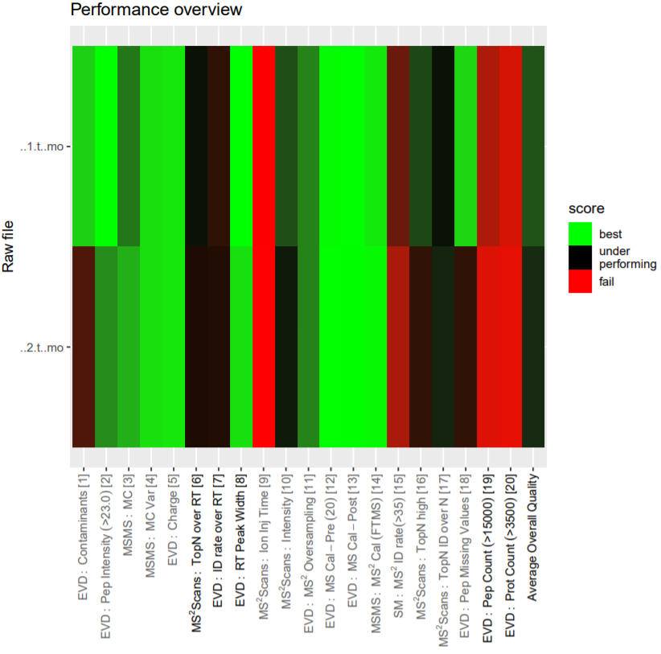
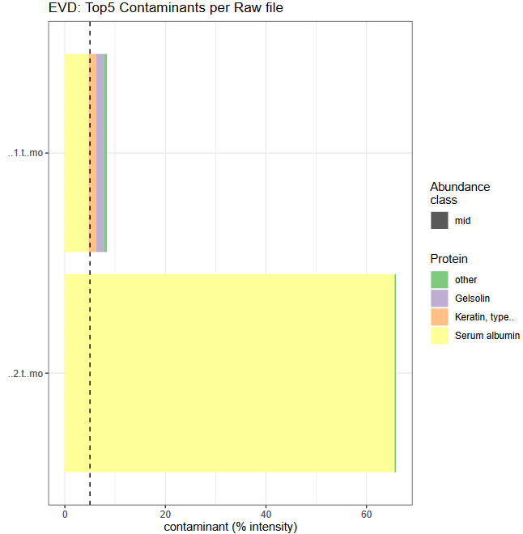
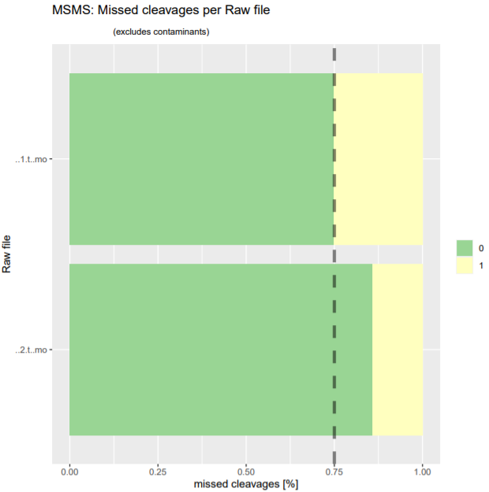
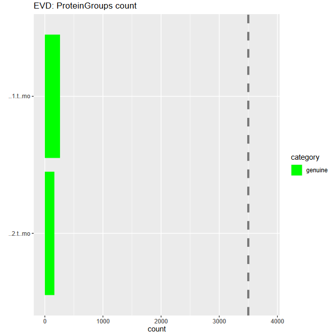
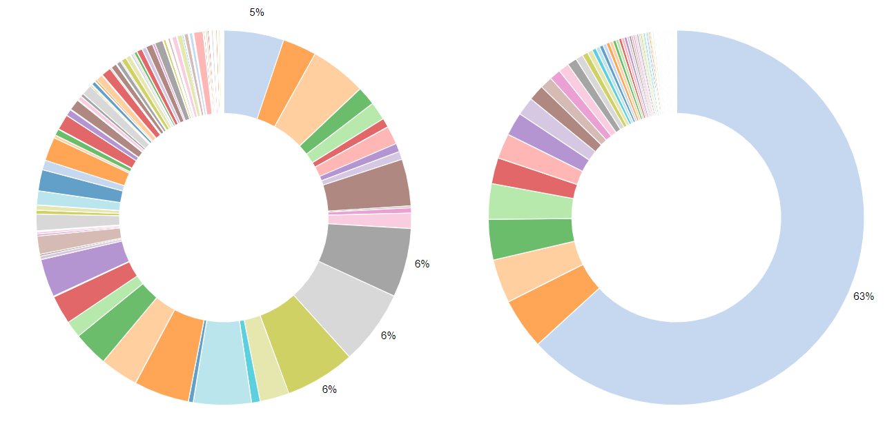
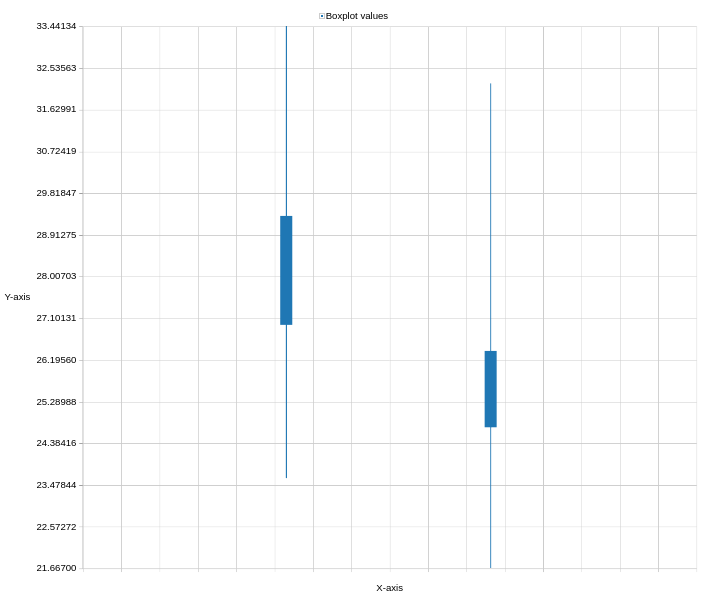
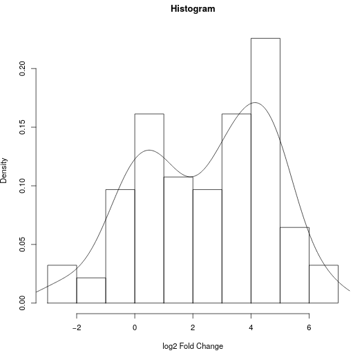

# Introduction


The proteome refers to the entirety of proteins in a biological system (e.g cell, tissue, organism). Proteomics is the large-scale experimental analysis of proteins and proteomes, most often performed by mass spectrometry that enables great sensitivity and throughput. Especially for complex protein mixtures, bottom-up mass spectrometry is the standard approach. In bottom-up proteomics, proteins are digested with a specific protease into peptides and the measured peptides are *in silico* reassembled into the corresponding proteins. Inside the mass spectrometer, not only the peptides are measured (MS1 level), but the peptides are also fragmented into smaller peptides which are measured again (MS2 level). This is referred to as tandem-mass spectrometry (MS/MS). Identification of peptides is performed by peptide spectrum matching of the theoretical spectra generated from the input protein database (fasta file) with the measured spectra. Peptide quantification is most often performed by measuring the area under the curve of the MS1 level peptide peaks, but special techniques such as TMT allow to quantify peptides on MS2 level. Nowadays, bottom-up tandem-mass spectrometry approaches allow for the identification and quantification of several thousand proteins.

. Adapted from <a href="https://en.wikipedia.org/wiki/Tandem_mass_spectrometry#/media/File:MS_MS.png">wikipedia</a>.")


A plethora of software solutions were developed for the analysis of proteomics data. MaxQuant is one of the most popular proteomics softwares because it is an easy to use and free software that offers functionalities for nearly all kinds of proteomics data analysis challenges . Mass spectrometry raw data is normally obtained in a vendor specific, proprietary file format. MaxQuant can directly take those raw files as input. For peptide identification MaxQuant uses a search engine called "Andromeda". MaxQuant offers highly accurate functionalities for many different proteomics quantification strategies, e.g. label-free, SILAC, TMT.

Blood is a commonly used biofluid for diagnostic procedures. The cell-free liquid blood portion is called plasma and after coagulation serum. Plasma and serum proteomics are frequently performed to find new biomarkers e.g. for diagnostic purposes and personalized medicine (). Serum and Plasma proteomics are particularily challenging due to protein concentration differences in the orders of ten magnitudes. Therefore, most sample preparation protocols include a depletion step in which the most abundant proteins are (partially) depleted from the sample e.g. via columns with immobilized antibodies.

This stand-alone tutorial introduces the data analysis from raw data files to protein identification and quantification of two label-free human serum samples with the MaxQuant software. One sample is a pure serum sample, while the other sample has been depleted for several abundant blood proteins. One of the questions in this tutorial is to find out which sample was depleted and which not.

For more advanced proteomics workflows, please consult the OpenMS [identification]({{site.baseurl}}/topics/proteomics/tutorials/protein-id-oms/tutorial.html), [quantification]({{site.baseurl}}/topics/proteomics/tutorials/protein-quant-sil/tutorial.html) as well as [SearchGUI/PeptideShaker]({{site.baseurl}}/topics/proteomics/tutorials/protein-id-sg-ps/tutorial.html) tutorials.


> <agenda-title></agenda-title>
>
> In this tutorial, we will cover:
>
> 1. TOC
> {:toc}
>
{: .agenda}

# Get data

The serum proteomic samples and the fasta file for this training were deposited at [Zenodo](https://zenodo.org/record/3774452). It is of course possible to use other fasta files that contain human proteome sequences, but to ensure that the results are compatible we recommend to use the provided fasta file. MaxQuant not only adds known contaminants to the fasta file, but also generates the "decoy" hits for false discovery rate estimation itself, therefore the fasta file is not allowed to have decoy entries. To learn more about fasta files, have a look at [Protein FASTA Database Handling]({{site.baseurl}}/topics/proteomics/tutorials/database-handling/tutorial.html).


> <hands-on-title>Data upload</hands-on-title>
>
> 1. Create a new history for this tutorial and give it a meaningful name
>
>    
>
> 2. Import the fasta and raw files from [Zenodo](https://zenodo.org/record/3774452)
>
>    ```
>    https://zenodo.org/record/4274987/files/Protein_database.fasta
>    https://zenodo.org/record/4274987/files/Sample1.raw
>    https://zenodo.org/record/4274987/files/Sample2.raw
>    ```
>
>    
>
> 3. Once the files are green, rename the raw datasets into 'sample1' and 'sample2' and the fasta file into 'protein database'
>
>    
>
> 4. Set the data type to thermo.raw for 'sample1' and 'sample2'
>
>    
>
{: .hands_on}

# MaxQuant Analysis

The MaxQuant Galaxy implementation contains the most important MaxQuant parameters. As an alternative, **MaxQuant (using mqpar.xml)**  can be used with a preconfigured mqpar.xml file. We will explain the parameters after starting the MaxQuant run which takes some time to finish.


> <hands-on-title>MaxQuant analysis</hands-on-title>
>
> 1.  with the following parameters
>    - In *"Input Options"*:
>        -  *"FASTA files"*: `protein database`
>        - *"Identifier parse rule"*: `>.*\|(.*)\|`
>        - *"Description parse rule"*: `>(.*) OS`
>    - In *"Search Options"*:
>        - *"minimum unique peptides"*: `1`
>    - In *"Parameter Group"*:
>        -  *"Infiles"*: `sample1`, `sample2`
>        - *"missed cleavages"*: `1`
>        - *"variable modifications"*: `unselect all variable modifications`
>        - *"Quantitation Methods"*: `label free quantification`
>    - *"Generate PTXQC (proteomics quality control pipeline) report?"*: `Yes`
>    - In *"Output Options"*:
>        - *"Select the desired outputs."*: `Protein Groups` `Peptides` `mqpar.xml`
>
>    > <comment-title>Protein Groups</comment-title>
>    > Proteins that share all their peptides with other proteins cannot be unambiguously identified. Therefore, MaxQuant groups such proteins into one protein group and only one common quantification will be calculated. The different protein properties are separated by semicolon.
>    {: .comment}
{: .hands_on}

## More details on MaxQuant Parameters

The *"parse rules"* in the input section are applied to the fasta sequence headers. Regular expressions can be adjusted to keep different information from the fasta file header. Examples are given in the MaxQuant help section at the bottom of the tool. The fasta file for this training comes from Uniprot, therefore the parse rules are adjusted accordingly.

The *"minimum peptide length"* defines the minimum number of amino acids a peptide should have to be included for protein identification and quantification. Below 7 amino acids a peptide cannot be unique and is therefore not informative, thus typical values are in the range 7-9.

Several, even longer peptides are not unique, meaning that they are shared by several proteins e.g. when they are part of a common protein domain. During protein inference the peptides are statistically assembled into the corresponding proteins and the decision should be mainly based on the unique peptides. Therefore, we set *"min unique peptides"* to `1` - only proteins that have at least one unique peptide are reported in the output table.

In most bottom-up proteomics experiments Trypsin is used as a protease because it has many advantages such as it's accurate cleavage specificity. Trypsin cleaves peptides c-terminal of Arginine (R) and Lysine (K), except when those are followed by Proline (P). Therefore, in MaxQuant the default *"enzyme"* is set to `Trypsin/P`. This trypsin specific cleavage rule is used by MaxQuant to perform an *in silico* digestion of the protein database that was provided in the fasta file.

Protease digestion is not always complete, therefore we set the *"number of missed cleavages"* to `1`, meaning that the *in silico* digestion also includes peptides that have an additional Arginine or Lysine in their sequence.



From the *in silico* generated peptide database the masses of the peptides are calculated and matched to the measured masses in order to identify them. A peptide's mass will change due to peptide modifications such as chemical labelling for example applied in different quantitation strategies or biological post translational modifications. Therefore, it is important to also include possible peptide modifications in the *in silico* generated peptide mass list. *"Fixed modifications"* are modifications that occur on every occurence of the specific amino acid. Those are often artificially introduced modifications such as Carbamidomethylation of cysteins (C) to prevent re-formation of the disulfid bridges. This is a common procedure in proteomics sample preparation and therefore also the default option in MaxQuant: `Carbamidomethyl (C)`. *"Variable modifications"* are modifications that do not occur on every amino acid such as Oxidation of Methionine might only occur on some Methionines and not all, but only a few peptide N-termini are acetylated. Variable modifications increase the *in silico* peptide database because each peptide's mass is calculated once with and once without the additional modification. To keep computation times as short as possible we did not use any variable modification this training, despite the MaxQuant defaults Oxidation of Methionine and Acetylation of N-termini would have been completely valid to use.

MaxQuant supports different *"Quantitation Methods"*. The three main categories are `label-free quantification`, `label-based quantification` and `reporter ion MS2` quantification. In this tutorial we have chosen `label-free` because we did not apply any specific labeling/quantitation strategy to the samples.



The PTXQC software () was built to enable direct proteomcs quality control from MaxQuant result files. This quality control can be directly used in the Galaxy MaxQuant wrapper by setting *"Generate PTXQC"* to `yes`. This will generate a pdf file with multiple quality control plots. Be aware that the cutoffs set in PTXQC might not be applicable to your experiment and mass spectrometer type and therefore "under performing" and "fail" do not necessarily mean that the quality is poor.




MaxQuant automatically generates several output files. In the *"Output Options"* all or some of the output files can be selected. The protein information can be obtained by selecting `Protein Groups`, while the peptide information is obtained by choosing `Peptides`. The applied MaxQuant parameters are stored in the `mqpar.xml` This file can be re-used as an input file in the **MaxQuant (using mqpar.xml)** .


> <details-title>More MaxQuant parameters</details-title>
> - For pre-fractionated data an *"experimental design template"* has to be used. This has to be a tab-separated text file with a column for the fractions (e.g. 1-10) and a column for the experiment (sample1, sample2, sample3) and a column for post translational modifications (PTM). Examples are given in the help section of the MaxQuant tool.
>
> - *"Match between run"* allows to transfer identifications (peptide sequences) from one run to another. If the MS1 (full length peptide) signal is present in both runs, but was only selected for fragmentation in one of them, MaxQuant can transfer the resulting peptide sequence to the run where the MS1 peptide was not fragmented. The Information if a peptides was identified via fragmentation (MS/MS) or match between run (matching) can be found in the evidence output.
>
> - MaxQuant allows to process different raw files with different parameters. In this tutorial we have loaded both files into the same *"parameter group"* in order to process them with the same parameters. To apply different parameters, new parameter groups can be added by clicking on the  *"insert parameter group"* button. In each *"parameter group"* one or several raw files can be specified and for them only the parameter specified within this parameter group section are applied.
{: .details}

> <tip-title>Continue with results from Zenodo</tip-title>
>
> In case the MaxQuant run is not yet finished, the results can be downloaded from Zenodo to be able to continue the tutorial
> 1. Import the files from [Zenodo](https://zenodo.org/record/3774452)
>
>    ```
>    https://zenodo.org/record/4274987/files/PTXQC_report.pdf
>    https://zenodo.org/record/4274987/files/MaxQuant_Protein_Groups.tabular
>    https://zenodo.org/record/4274987/files/MaxQuant_Peptides.tabular
>    https://zenodo.org/record/4274987/files/MaxQuant_mqpar.xml
>    ```
{: .tip}

> <question-title></question-title>
>
> 1. How many proteins were found in total?
> 2. How many peptides were found in total?
> 3. How many proteins identified and quantified? (Tipp: There is a tool called "filter data on any column", select the LFQ column for both files and remove rows containing "0")
>
>
> > <solution-title></solution-title>
> >
> > 1. 271 protein (groups) were found in total.
> > 2. 2387 peptides were found in total.
> > 3. Sample1: 237, Sample2: 123 (**filter data on any column**  on the `protein groups` file *"with following condition"* `c32!=0` or `c33!=0` and *"Number of header lines" `1`)
> >
> {: .solution}
>
{: .question}


# Quality control results

To get a first overview of the MaxQuant results, the PTXQC report is helpful. Click on the  eye of the PTXQC pdf file to open it in Galaxy. Screening through the different plots might already give you a hint which of the samples was pure and which was depleted of abundant proteins. Both samples failed in some categories (see Figure 4 above), especially due to low peptide and protein numbers, which is expected in serum samples and therefore not a quality problem.

> <question-title></question-title>
>
> 1. In which sample were more contaminantes quantified?
> 2. How good was the tryptic digestion (percentage of zero missed cleavages)?
> 3. Which sample yielded more protein identifications?
> 4. Do you already have a guess on which sample was depleted?
>
>
> > <solution-title></solution-title>
> >
> > 1. Sample 2 has more contaminants, especially serum albumin is high abundant. 
> > 2. The digestion was not ideal but good enough to work with. The proportion of zero missed cleavages was 75% for sample1 and around 85% for sample2. 
> > 3. Sample 1 yielded more protein identifications 
> > 4. Sample1, more information can be found in the next section.
> >
> {: .solution}
{: .question}


# Serum composition

To explore the proteomic composition of the two serum samples some postprocessing steps on the Protein Groups file are necessary. The Protein Groups file contains all relevant information on the protein level. The best way to explore this vast table is by clicking on the  scratch book  on the top menu. Clicking on the  eye icon opens the Protein Groups file. Galaxy does not work with the names of the columns but instead with their number. Find the column numbers for: Fasta headers (includes protein ID + name + species), LFQ intensities for each sample and reverse proteins. First we remove "decoy" proteins, which are named "reverse" in MaxQuant. Next, we remove contaminants. For non-human samples, we could just remove all proteins, that are marked with a "+" in the "potential contaminant" column. We have seen before that many human proteins were marked as contaminant and as we study a human sample we don't want to remove them. Therefore, we only remove non-human contaminant proteins. Then, we shrink the file to keep only columns that are interesting in the next steps: the fasta header and the columns with LFQ intensities for both files. To find the most abundant proteins per sample, the LFQ intensities can be sorted. On this sorted dataset we will explore the composition of the serum proteins within both samples using an interactive pie charts diagram.

> <hands-on-title>Exploring serum composition</hands-on-title>
>
> 1.  with the following parameters:
>    -  *"Filter"*: `proteinGroups` (output of **MaxQuant** )
>    - *"With following condition"*: `c38!="+"`
>    - *"Number of header lines to skip"*: `1`
>
> 2.  with the following parameters:
>    -  *"Select lines from"*: `filter_file` (output of **Filter** )
>    - *"the pattern"*: `(HUMAN)|(Majority)`
>
> 3.  with the following parameters:
>    - *"Cut columns"*: `c8,c32,c33`
>    -  *"From"*: `select_file` (output of **Select** )
>
> 4.  with the following parameters:
>    -  *"Sort Query"*: `cut_file` (output of **Cut** )
>    - *"Number of header lines"*: `1`
>    - In *"Column selections"*:
>        - *"on column"*: `c2`
>        - *"in"*: `Descending order`
>        - *"Flavor"*: `General numeric sort ( scientific notation -g)`
>
> 5.  with the following parameters:
>    -  *"Sort Query"*: `cut_file` (output of **Cut** )
>    - *"Number of header lines"*: `1`
>    - In *"Column selections"*:
>        - *"on column"*: `c3`
>        - *"in"*: `Descending order`
>        - *"Flavor"*: `General numeric sort ( scientific notation -g)`
> 6. Click  “Visualize this data” on the last **Sort**  result.
>   - Select `Pie chart (NVD3)`
>   - *"Provide a title"*: `Serum compositions`
>   - Click `Select data` 
>   - *"Provide a label"*: `sample1`
>   - *"Labels"*: `Column: 1`
>   - *"Values"*: `Column: 2`
>   - Click `Insert data series`
>   - *"Provide a label"*: `sample2`
>   - *"Labels"*: `Column: 1`
>   - *"Values"*: `Column: 3`
>   - Save    (file is saved under "User" --> "Visualizations")
{: .hands_on}





> <question-title></question-title>
>
> 1. How many decoy proteins were removed?
> 2. What are the top 5 most abundant proteins in both files? Do they reflect typical serum proteins?
> 3. Which sample was depleted for the top serum proteins?
> 4. How much did the serum albumin abundance percentage decrease? Was the depletion overall succesful?
>
> > <solution-title></solution-title>
> >
> > 1. 2 (272 lines (Protein Groups) minus 272 lines (Filter))
> > 2. Sample1: Complement C4-A, Ceruloplasmin, Hemopexin, Serum albumin, Complement factor B. Sample2: Serum albumin, Immunoglobulin heavy constant gamma 1, Serotransferrin, Immunoglobulin kappa constant, Haptoglobin. All of those proteins are typical (high abundant) serum proteins ([plasma proteins found by MS](https://www.proteinatlas.org/humanproteome/blood/proteins+detected+in+ms)).
> > 3. Sample1 was depleted, sample2 was pure serum.
> > 4. In the depleted sample1, there is a depletion in some of the most abundant proteins, especially Albumin, which proportion of the total sample intensities decreased by 58 percentage. Compared to the pure serum the depleted sample showed a duplication of identified and quantified proteins rendering it quite successful. However, there is still room for improvement as some of the most abundant proteins which should have been depleted did not change their abundance compared to the overall protein abundance.
> >
> {: .solution}
>
{: .question}


# Quantitative Assessment

After analyzing the composition of each sample separately, the intensities between both samples are compared. For this, the intensity values are log2-transform and the normal distribution is visualized as boxplots, this requires cutting only the relevant columns before visualization. Next the log2 fold change is calculated and its distribution visualized as histogram. The log2 fold change helps to find proteins with abundances changes between the samples.

> <hands-on-title>Quantitative Assessment</hands-on-title>
>
> 1.  with the following parameters:
>    - *"Add expression"*: `log(c2,2)`
>    -  *"as a new column to"*: `cut_file` (output of **Cut** )
>    - *"Skip a header line"*: `yes`
>        - *"The new column name"*: `log2 intensity sample1`
> 2.  with the following parameters:
>    - *"Add expression"*: `log(c3,2)`
>    -  *"as a new column to"*: `compute_file` (output of **Compute** )
>    - *"Skip a header line"*: `yes`
>        - *"The new column name"*: `log2 intensity sample2`
> 3.  with the following parameters:
>    - *"Cut columns"*: `c4,c5`
>    -  *"From"*: `compute_file` (output of the last **Compute** )
> 4. Click  “Visualize this data” on the **cut**  result.
>   - Select `box plot(jqPlot)`
>   - *"Use multi-panels"*: `No`
>   - Click `Select data` 
>   - *"Provide a label"*: `log2 sample1`
>   - *"Observations"*: `Column: 1`
>   - Click `Insert data series`
>   - *"Provide a label"*: `log sample2`
>   - *"Observations"*: `Column: 2`
>   - Confirm and save  (file is saved under "User" --> "Visualizations")
> 5.  with the following parameters:
>    - *"Add expression"*: `c4-c5`
>    -  *"as a new column to"*: `compute_file` (output of the last **Compute** )
>    - *"Skip a header line"*: `yes`
>        - *"The new column name"*: `log2 Fold Change (sample1/sample2)`
> 6.  with the following parameters:
>    -  *"Dataset"*: `compute_file` (output of the previous **Compute** )
>    - *"Numerical column for x axis"*: `c6`
>    - *"Label for x axis"*: `log2 Fold Change`
>
{: .hands_on}


> <question-title></question-title>
>
> 1. Describe the distribution of the log2 intensities in the box plots.
> 2. How much is the log2 fold change of serum albumin and what does it mean?
> 3. What does the distribution of the log2 fold changes mean?
>
> > <solution-title></solution-title>
> >
> > 1. The log2 transformation leads to a close to normal intensity distribution for both samples. Intensities in the depleted sample are shifted towards higher values compared to the non-depleted samples. The big difference comes from artificially depleting (changing) protein intensities. 
> > 2. The log2 fold change (depleted vs. not depleted samples) is about -2.91. This means that the abundance in the not depleted sample is about 2^2.91 = 7.52 times higher than in the depleted sample, showing again that a large proportion of serum albumin was successfully removed by the antibody columns.
> > 3. Most of the log2 fold changes are larger than zero. This means that many proteins have higher intensities in the depleted sample compared to the not-depleted sample. These are the proteins that benefitted from the depletion of serum albumin and other high abundand serum proteins. There is also a maximum around zero meaning that a substantial amount of proteins had a similar abundance in both samples. The negative log2 fold changes derive from the proteins that were depleted, e.g. serum albumin. 
> >
> {: .solution}
>
{: .question}


> <tip-title>Analyzing your own data</tip-title>
>
> For this training we have chosen two small example files to keep analysis time minimal. Real proteomic projects comprise more samples leading to longer MaxQuant run times from many hours to several days (depending on input file size, number of input files and parameters). Real projects also require different follow up analysis. Here are some things to consider for your proteomic project:
> 1. The columns in the MaxQuant output file change with the number of input files. Before using the cut tool, open the output file and check which columns contain the LFQ intensities - then adjust the cut tool to cut all those columns from the file.
> 2. A necessary first step is to log2-transform the LFQ intensities.
> 3. Even though LFQ intensities are already normalized, before statistical analysis it is recommended to median normalize the LFQ intensities for each sample. Control the intensity distribution with histograms or boxplots. Even before normalization the boxplots should already be more similar in their intensity range if a normal biological replicate was analyzed (and not a different sample preparation protocol as in the training dataset). After normalization box plot medians should be very similar.
> 4. Often the aim of proteomic projects is finding differentially regulated proteins across conditions. Classical statistical methods like t-test and ANOVA are not ideal options but ok when multiple testing correction (e.g. benjamini-hochberg) is performed afterwards. The better option are algorithms tailored for the analysis of omics intensity data such as [LIMMA](https://www.doi.org/10.1093/nar/gkv007), [SAM](https://www.doi.org/10.1073/pnas.091062498) and [MSstats](https://doi.org/10.1093/bioinformatics/btu305) . Do not apply statistical methods designed for count data (e.g. RNA-seq) such as Limma-voom or DESq2 - those are not applicable for proteomics intensity data.
>
{: .tip}


