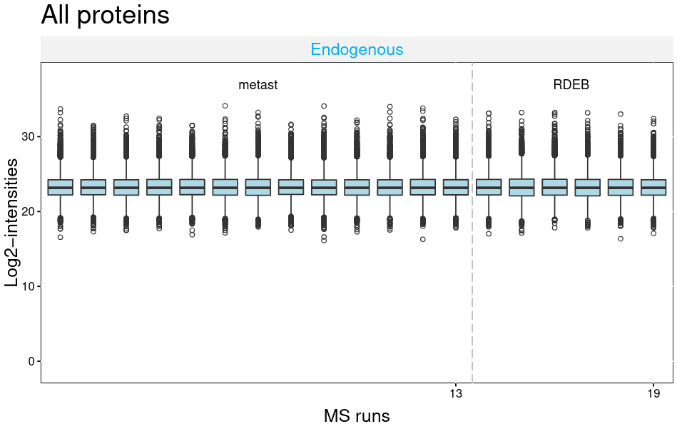
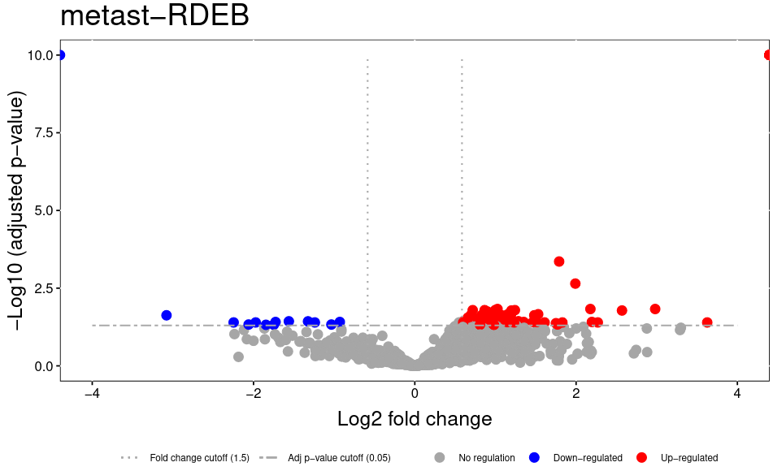
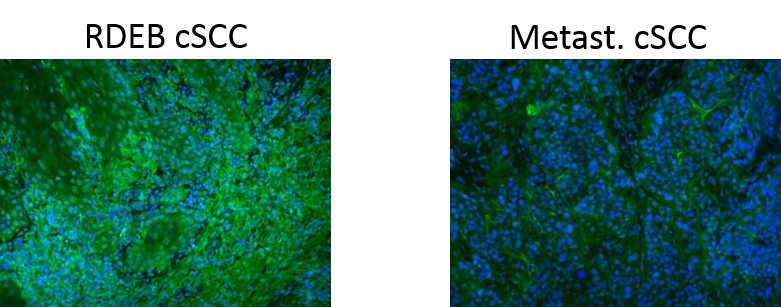

# Introduction
{:.no_toc}

Modern mass spectrometry-based proteomics enables the identification and quantification of thousands of proteins. Therefore, quantitative mass spectrometry represents an indispensable technology for biological and clinical research. Statistical analyses are required for the unbiased answering of scientific questions and to uncover all important information in the proteomic data. Classical statistical approaches and methods from other omics technologies are not ideal because they do not take into account the speciality of mass spectrometry data that include several thousands of proteins but often only a few dozens of samples (referred to as ‘curse of dimensionality’) and stochastic data properties that reflect sample preparation and spectral acquisition (Choi 2014). 

In this training we will cover the full analysis workflow from label-free, data dependent acquisition (DDA) raw data to statistical results. We’ll use two popular quantitative proteomics software: MaxQuant and MSstats. MaxQuant allows protein identification and quantification for many different kinds of proteomics data (Cox and Mann 2008).  In case you have no previous experience with MaxQuant, we recommend to go through the [MaxQuant beginners tutorial]({{site.baseurl}}/topics/proteomics/tutorials/maxquant-label-free/tutorial.html) before. MSstats provides statistical functionalities to find differentially abundant peptides or proteins from data dependent acquisition (DDA), data independent acquisition (DIA) or single reaction monitoring (SRM) proteomic experiments. 
The training dataset consists of a skin cancer cohort of 19 patients, which is a subset of a [published study](https://doi.org/10.1016/j.matbio.2017.11.004). One fifth of all non melanoma skin cancers are cutaneous squamous cell carcinomas (cSCC) that mainly derive from exposure to ultraviolet light. Most cSCC have a good prognosis but the few metastasizing cSCC have dramatically increased mortality. Here, we compare these metastasizing cSCC to cSCC in patients with the genetic disease recessive dystrophic epidermolysis bullosa (RDEB). RDEB is a genetic skin blistering and extracellular matrix disease caused by collagen VII deficiency. To investigate molecular differences between these two aggressive cSCCs with different origin, we used global proteomic analysis of formalin-fixed paraffin-embedded human cSCC tissues. 


> ### Agenda
>
> In this tutorial, we will cover:
>
> 1. TOC
> {:toc}
>
{: .agenda}

# Get data

The raw data is available via the [PRIDE repository](https://www.ebi.ac.uk/pride/archive/projects/PXD006914). The annotation file, group comparison file and FASTA file for this training is deposited at [Zenodo](https://zenodo.org/record/4544529). It is of course possible to use another FASTA file with human proteome sequences, but to ensure that the results are compatible we recommend to use the provided FASTA file. MaxQuant not only adds known contaminants to the FASTA file, but also generates the “decoy” hits for false discovery rate estimation itself, therefore the FASTA file is not allowed to have decoy entries. To learn more about FASTA files, have a look at [Protein FASTA Database Handling tutorial]({{site.baseurl}}/topics/proteomics/tutorials/database-handling/tutorial.html).


> ###  Hands-on: Data upload
>
> 1. Create a new history for this tutorial and give it a meaningful name
>
>    
>
> 2. Import the FASTA database, annotation file and comparison matrix from [Zenodo](https://zenodo.org/record/4544529)
>
>    ```
>    https://zenodo.org/record/4544529/files/input_protein_database.fasta
>    https://zenodo.org/record/4544529/files/input_annotation_file.tabular
>    https://zenodo.org/record/4544529/files/input_comparison_matrix.tabular
>    ```
>    
>
> 3. Import the raw data from [PRIDE](https://www.ebi.ac.uk/pride/archive/projects/PXD006914)
>
>    ```
>    ftp://ftp.pride.ebi.ac.uk/pride/data/archive/2017/11/PXD006914/Experiment105_metast_cSCC1.raw
>    ftp://ftp.pride.ebi.ac.uk/pride/data/archive/2017/11/PXD006914/Experiment106_metast_cSCC2.raw
>    ftp://ftp.pride.ebi.ac.uk/pride/data/archive/2017/11/PXD006914/Experiment107_metast_cSCC3.raw
>    ftp://ftp.pride.ebi.ac.uk/pride/data/archive/2017/11/PXD006914/Experiment109_metast_cSCC4.raw
>    ftp://ftp.pride.ebi.ac.uk/pride/data/archive/2017/11/PXD006914/Experiment116_metast_cSCC5.raw
>    ftp://ftp.pride.ebi.ac.uk/pride/data/archive/2017/11/PXD006914/Experiment117_metast_cSCC6.raw
>    ftp://ftp.pride.ebi.ac.uk/pride/data/archive/2017/11/PXD006914/Experiment118_metast_cSCC7.raw
>    ftp://ftp.pride.ebi.ac.uk/pride/data/archive/2017/11/PXD006914/Experiment119_metast_cSCC8.raw
>    ftp://ftp.pride.ebi.ac.uk/pride/data/archive/2017/11/PXD006914/Experiment120_metast_cSCC9.raw
>    ftp://ftp.pride.ebi.ac.uk/pride/data/archive/2017/11/PXD006914/Experiment121_metast_cSCC10.raw
>    ftp://ftp.pride.ebi.ac.uk/pride/data/archive/2017/11/PXD006914/Experiment122_metast_cSCC11.raw
>    ftp://ftp.pride.ebi.ac.uk/pride/data/archive/2017/11/PXD006914/Experiment123_metast_cSCC12.raw
>    ftp://ftp.pride.ebi.ac.uk/pride/data/archive/2017/11/PXD006914/Experiment124_metast_cSCC13.raw
>    ftp://ftp.pride.ebi.ac.uk/pride/data/archive/2017/11/PXD006914/Experiment110_RDEB_cSCC1.raw
>    ftp://ftp.pride.ebi.ac.uk/pride/data/archive/2017/11/PXD006914/Experiment111_RDEB_cSCC2.raw
>    ftp://ftp.pride.ebi.ac.uk/pride/data/archive/2017/11/PXD006914/Experiment112_RDEB_cSCC3.raw
>    ftp://ftp.pride.ebi.ac.uk/pride/data/archive/2017/11/PXD006914/Experiment113_RDEB_cSCC4.raw
>    ftp://ftp.pride.ebi.ac.uk/pride/data/archive/2017/11/PXD006914/Experiment114_RDEB_cSCC5.raw
>    ftp://ftp.pride.ebi.ac.uk/pride/data/archive/2017/11/PXD006914/Experiment115_RDEB_cSCC6.raw
>
>    ```
> 4. Once the files are green, rename the raw datasets into 'metast_cSCC1' etc., the fasta file into 'protein database', the annotation file into 'annotation file' and the comparison matrix file into 'comparison matrix'.
>    
>
> 5. Control that the data type of the raw files is 'thermo.raw' otherwise change the datatype into 'thermo.raw'
>
>    
>
>6. Generate a collection for all raw files and name it 'raw_files', hide the individual raw files
>
>    
>
{: .hands_on}

# MaxQuant analysis

The run time of **MaxQuant**  depends on the number and size of the input files and on the chosen parameters. The run of the training datasets will take a few hours, but the training can be directly continued with the MaxQuant result files from Zenodo. We start the MaxQuant run with the default parameters, with a few adjustments. All peptides are used for quantification. A quality control report is generated with the [PTXQC functionality](https://pubs.acs.org/doi/10.1021/acs.jproteome.5b00780) that is directly implemented in the MaxQuant Galaxy tool. To continue with statistical analysis in MSstats, the Protein Groups and the Evidence files are needed from MaxQuant.

> ###  Hands-on: MaxQuant analysis
>
> 1.  with the following parameters:
>    - In *"Input Options"*:
>        -  *"FASTA files"*: `protein database`
>    - In *"Parameter Group"*:
>        -  *"Insert Parameter Group"*
>            -  *"Infiles"*: `raw_files`
>    - *"Generate PTXQC (proteomics quality control pipeline) report?"*: `Yes`
>    - In *"Output Options"*:
>        - *"Select the desired outputs."*: `Protein Groups` `Evidence` `mqpar.xml`
>
>    > ###  Tip: Continue with results from Zenodo
>    >
>    > Because the MaxQuant run takes really long, we recommend to download the MaxQuant results from Zenodo and continue with the tutorial
>    > 1. Import the files from [Zenodo](https://zenodo.org/record/4544529)
>    >
>    >  ```
>    > https://zenodo.org/record/4544529/files/Evidence.tabular
>    > https://zenodo.org/record/4544529/files/protein_groups.tabular
>    > https://zenodo.org/record/4544529/files/PTXQC_report.pdf
>    > ```
>    {: .tip}
>
{: .hands_on}


> ###  Questions
>
> 1. How many proteins and features were identified in total? 
> 2. How large is the proportion of potential contaminants? 
>
> > ###  Solution
> >
> > 1. 2634 protein groups and ~150000 features were found in total (number of lines of protein group and evidence files)
> > 2. Up to 60% of the samples intensities derive from potential contaminants (PTXQC plots page 6) 
> >
> {: .solution}
>
{: .question}


# MSstats analysis

The protein groups and evidence files of MaxQuant can directly be input into MSstats. MSstats automatically removes all proteins that are labelled as contaminants ('+' sign in the column 'potential contaminant' of both MaxQuant outputs). However, in this skin dataset we expect that the skin proteins are part of the sample and not a contamination. Therefore, we keep all human contaminants by first removing non human proteins and then removing (replacing with '') the '+' sigin in the 'potential contaminant' column. 

We use the modified MaxQuant protein groups and evidence files as input in MSstats. In addition, an annotation file that describes the experimental design and a comparison matrix is needed. Please start the MSstats run first and while it is running you can find more details on its parameters below. 

> ###  Hands-on: MSstats Analysis
>
> 1.  with the following parameters:
>    -  *"Select lines from"*: `Protein Groups` (output of **MaxQuant** )
>    - *"the pattern"*: `(HUMAN)|(Majority)`
> 2.  with the following parameters:
>    -  *"Select lines from"*: `Evidence` (output of **MaxQuant** )
>    - *"the pattern"*: `(HUMAN)|(Sequence)`
> 3.  with the following parameters:
>    -  *"File to process"*: `select protein groups` (output of **Select** )
>    - In *"Replacement"*:
>            - *"in column"*: `c118`
>            - *"Find pattern"*: `+`
> 4.  with the following parameters:
>    -  *"File to process"*: `select evidence` (output of **Select** )
>    - In *"Replacement"*:
>            - *"in column"*: `c54`
>            - *"Find pattern"*: `+`
> 5.   with the following parameters:
>    - *"input source"*: `MaxQuant`
>        -  *"evidence.txt - feature-level data"*: `selected Evidence` (output of **Select** )
>        -  *"proteinGroups.txt - protein-level data"*: `selected Protein Groups` (output of **Select** )
>        -  *"annotation file"*: `annotation file`
>        - *"Select Protein ID in evidence.txt"*: `Leading razor protein column`
>        - In *"MaxQtoMSstatsFormat Options"*:
>            - *"Remove the proteins which have only 1 peptide and charge"*: `Yes`
>    - *"Select outputs"*: `MSstats log` `MSstats ProcessedData` `MSstats QCPlot` `RunlevelData` `Group Quantification Matrix Table` `Sample Quantification Matrix Table`
>    - In *"DataProcess Plot Options"*:
>	 - *"Angle of labels represented each condition at the top of graph"*: `0`
>        - *"Select protein IDs to draw plots"*: `Option for QC plot: "allonly" will generate one QC plot with all proteins`
>    - *"Compare Groups"*: `Yes`
>        -  *"Comparison Matrix"*: `comparison matrix`
>        - *"Select outputs"*: `MSstats ComparisonResult` `MSstats VolcanoPlot`
>    - In *"Comparison Plot Options"*:
>	 - *"Involve fold change cutoff or not for volcano plot or heatmap."*: `1.5`
>	 - *"Display protein names in Volcano Plot."*: `No`
>
{: .hands_on}


> ###  Questions
>
> 1. How many proteins were removed as potential non human contaminants?
> 2. How many proteins were included into the statistical analysis? 
>
> > ###  Solution
> >
> > 1. 29 (2635 lines in protein group file minus 2606 lines after select)
> > 2. 1296 (MSstats log)
> >
> {: .solution}
>
{: .question}


## More details on MSstats

MSstats  is designed for statistical modelling of mass spectrometry based proteomic data [Choi 2014](https://doi.org/10.1093/bioinformatics/btu305 ). 
Proteomic data analysis requires statistical approaches that reduce bias and inefficiencies and distinguish systematic variation from random artifacts [Käll and Vitek 2011]( https://doi.org/10.1371/journal.pcbi.1002277).

MSstats is directly compatible with the output of several quantitative proteomics software. In addition to the results of the proteomics software an annotation file is needed as input. The annotation file describes the experimental design such as the conditions, biological and technical replicates. To be compatible with MaxQuant results, an additional column with the label type is needed, which only contains L (light) in DDA experiments. 

First, the input data is converted into an MSstats compatible table. For this step several parameters to filter and adjust the input data can be selected. We keep the default parameters and only change one parameter in order to remove proteins which have only a single peptide measurement. 
Next, data processing optimizes the data for statistical modelling via log-transformation, and normalization of intensities, feature selection, missing value imputation, and run-level summarization. 
Log- transformation is performed to transform multiplicative signals to additive signals which are compatible with linear statistical models and bring the intensity distribution close to a normal distribution. Furthermore, it changes the dependence of variances from the intensity values: in the raw data larger intensities have larger variances but after log transformation lower intensities have larger variances. 

Normalization aims to make the intensities of different runs more comparable to each other. The default normalization method, equalize medians, assumes that the majority of proteins do not change across runs and shifts all intensities of a run by a constant to obtain equal median intensities across runs. 
A feature in label-free DDA data corresponds to a peptide at a given charge state (m/z value), resulting from the identification of MS2 spectra combined with the quantitative information from the MS1 scans. Feature selection allows the use of either all, only the most abundant features or only high quality peptides for protein summarization. 

Missing values and noisy features with outliers are typical in label-free DDA datasets but influence protein summarization. Therefore, it is recommended to perform missing value imputation. Missing values are reported differently in different Softwares. MaxQuant reports them as NA and MSstats assumes that missing intensity values from MaxQuant mean that the intensity was below the limit of quantification. This means the values are not missing for random but for the reason of low abundance. Therefore, the values are only partially known and  called “censored”. This may also be the case for very low intensity values, which might not be reliable. The percentile that is not trusted and should be considered a censored value is defined via the “Maximum quantile for deciding censored missing values” parameter. Censored values are replaced by an intensity that is generated via an accelerated failure time model (AFT). Alternatively censored values may be replaced by the minimum value of the features, runs or both as defined in the “Cutoff value for censoring”. Runs with no intensity measurement for a protein will be removed for any further calculation on this protein.

Protein summarization is by default performed via Tukey’s median polish for robust parameter estimation with median across rows and columns. Run-level summaries are later used for statistical group comparison. 

Any two groups can be compared to find differentially abundant proteins between them. MSstats uses a family of linear mixed models that are automatically adjusted for the comparison type according to the information in the annotation file, such as conditions, biological and technical replicates and runs. This allows comparison of groups with different sizes; comparison of the mean of some groups, paired designs and time course experiments. 


# Follow up on MSstats results

We obtain several output files from MSstats. MSstats log file contains the MSstats report with warnings and information about the analysis steps. 
The MSstats QCPlot visualizes the log transformed intensities for all proteins and runs of the processed data. 
The volcano plot plots the statistical result as transformed p-values vs. the log2 fold change. A fold change of 1.5 means that a protein is 50% more abundand in one condition than the other. The log2 fold change is 0.58. 





The processed data file contains the transformed, normalized and imputed intensities for each peptide in each run. Run level data summarizes intensities per run and protein.
We’ll count and visualize the number of features per run and calculate the distribution of peptides per protein and run. 

> ###  Hands-on: Follow up on MSstats results
>
> 1.  with the following parameters:
>    -  *"Input tabular dataset"*: `RunLevel data` (output of **MSstats** )
>    - *"Group by fields"*: `8`
>    - *"Input file has a header line"*: `Yes`
>    - *"Print header line"*: `Yes`
>    - *"Sort input"*: `Yes`
>    - In *"Operation to perform on each group"*:
>        -  *"Insert Operation to perform on each group"*
>            - *"On column"*: `c1`
> 2. Click on  “Visualize this data” on the **Datamash**  result.
>   - Select `Bar diagram (NVD3)`
>   - *"Provide a title"*: `Number of features per sample`
>   - Click `Select data` 
>   - *"Data point labels"*: `Column: 1`
>   - Save  (file is saved under "User" --> "Visualizations")
> 2.  with the following parameters:
>    -  *"Summary statistics on"*: `RunLevel data` (output of **MSstats** )
>    - *"Column or expression"*: `c4`
>
{: .hands_on}


> ###  Questions
>
> 1. Which sample has the lowest amount of features? 
> 2. In the complete experiment, how many features has a protein on average?
>
> > ###  Solution
> >
> > 1. RDEB cSCC4 ")
> > 2. Around 5 features per protein.
> >
> {: .solution}
>
{: .question}


# Filtering MSstats results

The comparison result table summarizes the statistical results per protein and comparison. First, we keep only the Uniprot ID in column 1 to make the ID less cluttered. 
Then we keep only statistically significant proteins that means they have an adjusted p-value below 0.05. 
Next, we separate up- and down-regulated proteins by filtering for a positive and negative log2FC. 
The Sample Quantification Matrix Table contains the summarized intensities per protein and sample. 
In order to make its IDs compatible with the ones from the comparison result at a later step, we keep only the Uniprot ID as well. 


> ###  Hands-on: Filtering MSstats results
>
> 1.  with the following parameters:
>    -  *"File to process"*: `Comparison Result` (output of **MSstats** )
>    - In *"Replacement"*:
>            - *"in column"*: `c1`
>            - *"Find pattern"*: `sp\|`
>        -  *"Insert Replacement"*
>            - *"in column"*: `c1`
>            - *"Find pattern"*: `\|.*`
> 2.  with the following parameters:
>    -  *"Filter"*: `replaced comparison result` (output of the last **Replace Text** )
>    - *"With following condition"*: `c8<0.05`
>    - *"Number of header lines to skip"*: `1`
> 3.  with the following parameters:
>    -  *"Filter"*: `filtered comparison result` (output of **Filter** )
>    - *"With following condition"*: `c3>0.58`
>    - *"Number of header lines to skip"*: `1`
> 4. Add a tag `#metastasized` to the filtered file 
>      
>
> 5.  with the following parameters:
>    -  *"Filter"*: `filtered comparison result` (output of the run before last **Filter** )
>    - *"With following condition"*: `c3<-0.58`
>    - *"Number of header lines to skip"*: `1`
> 6. Add a tag `#rdeb` to the filtered file
>
{: .hands_on}

> 1. Why do we filter for the adjusted p-value? 
>
> > ###  Solution
> >
> > 1. Adjusted p-values control for the multiplicity of testing. Since we fit a separate model, and conduct a separate comparison for each protein, the number of tests equals the number of comparisons. A 0.05 cutoff of an adjusted p-value controls the False Discovery Rate in the collection of tests over all the proteins at 5%. Since they account for the multiplicity, adjusted p-values are more conservative (i.e. it is more difficult to detect a change). 
> >
> {: .solution}
>
{: .question}


# Follow up on proteins that are missing in one condition

For each group we separate the proteins that are missing in one condition (that means p-value is 0) from the other significant proteins.
From all missing in one condition proteins we keep only the column with the Uniprot ID and combine the “upregulated” and “downregulated” ones into one file. 
We extract their average intensities per sample from the sample quantification matrix file and generate a heatmap on their intensities. 

> ###  Hands-on: Filter proteins missing in one condition
>
> 1.  with the following parameters:
>    -  *"Filter"*: `metastasized filtered` (output of **Filter** )
>    - *"With following condition"*: `c8==0`
>    - *"Number of header lines to skip"*: `1`
> 2.  with the following parameters:
>    - *"Cut columns"*: `c1`
>    -  *"From"*: `metastasized filtered` (output of the last **Filter** )
> 3.  with the following parameters:
>    -  *"Filter"*: `rdeb filtered` (output of **Filter** )
>    - *"With following condition"*: `c8==0`
>    - *"Number of header lines to skip"*: `1`
> 4.  with the following parameters:
>    - *"Cut columns"*: `c1`
>    -  *"From"*: `rdeb filtered` (output of the last **Filter** )
> 5. {% tool [Remove beginning](Remove%20beginning1) %} with the following parameters:
>    -  *"from"*: `cut rdeb` (output of the last **Cut** )
> 6.  with the following parameters:
>    -  *"Concatenate Dataset"*: `cut metastasized` (output of **Cut** )
>    - In *"Dataset"*:
>        -  *"Insert Dataset"*
>            -  *"Select"*: `remove beginning rdeb` (output of **Remove beginning** )
> 7.  with the following parameters:
>    -  *"File to process"*: `Sample Quantification Matrix Table` (output of **MSstats** )
>    - In *"Replacement"*:
>            - *"in column"*: `c1`
>            - *"Find pattern"*: `sp\|`
>        -  *"Insert Replacement"*
>            - *"in column"*: `c1`
>            - *"Find pattern"*: `\|.*`
> 8.  with the following parameters:
>    -  *"1st file"*: `replaced sample quantification matrix` (output of **Replace Text** )
>    - *"Column to use from 1st file"*: `c1`
>    -  *"2nd File"*: `concatenated file` (output of **Concatenate datasets** )
>    - *"Column to use from 2nd file"*: `c1`
>    - *"First line is a header line"*: `Yes`
> 9.  with the following parameters:
>    -  *"Select table"*: `joined file` (output of **Join** )
>    - *"Select input dataset options"*: `Dataset with header and row names`
>        - *"Select column, for row names"*: `c1`
>    - In *"Output Options"*:
>        - *"width of output"*: `15.0`
>        - *"height of output"*: `10.0`
>
{: .hands_on}

> 1. How many proteins have no intensity values in one condition?
> 2. Which protein is present in all samples of one condition and absent in all samples of the other condition?
>
> > ###  Solution
> >
> > 1. 80 (79 are missing in RDEB cSCC condition; 1 is missing in metastasizing cSCC condition)
> > 2. Q02388 which is collagen VII (https://www.uniprot.org). Collagen VII is expected in all skin samples, but due to the genetic disease that hinders the production of functional collagen VII in RDEB patients. 
> >
> {: .solution}
>
{: .question}


# Finding differentially abundant proteins

The same procedure is applied to the significant proteins that were not missing in one condition. 
To obtain them we filter the up- and downregulated proteins (p-value <0.05) for p-values > 0 to obtain all p-values larger than 0 but smaller than 0.05. 

> ###  Hands-on: filter differentially abundant proteins
>
> 1.  with the following parameters:
>    -  *"Filter"*: `metastasized filtered` (output of **Filter** , first file with the 'metastasized' tag)
>    - *"With following condition"*: `c8>0`
>    - *"Number of header lines to skip"*: `1`
> 2.  with the following parameters:
>    - *"Cut columns"*: `c1`
>    -  *"From"*: `metastasized filtered ` (output of last **Filter** )
> 3.  with the following parameters:
>    -  *"Filter"*: `rdeb filtered` (output of **Filter** , first file with the 'rdeb' tag)
>    - *"With following condition"*: `c8>0`
>    - *"Number of header lines to skip"*: `1`
> 4.  with the following parameters:
>    - *"Cut columns"*: `c1`
>    -  *"From"*: `rdeb filtered` (output of last **Filter** )
> 5.  with the following parameters:
>    -  *"1st file"*: `replaced sample quantification matrix` (output of **Replace text** )
>    - *"Column to use from 1st file"*: `c1`
>    -  *"2nd File"*: `metastasized cut` (output of **Cut** )
>    - *"Column to use from 2nd file"*: `c1`
>    - *"First line is a header line"*: `Yes`
> 6.  with the following parameters:
>    -  *"1st file"*: `replaced sample quantification matrix` (output of **Replace Text** )
>    - *"Column to use from 1st file"*: `c1`
>    -  *"2nd File"*: `rdeb cut` (output of **Cut** )
>    - *"Column to use from 2nd file"*: `c1`
>    - *"First line is a header line"*: `Yes`
> 7.  with the following parameters:
>    -  *"Input should have column headers - these will be the columns that are plotted"*: `metastasized join` (output of **Join** )
>    - *"Plot title"*: `Upregulated proteins in metastasized cSCC`
>    - *"Enable data clustering"*: `No`
>    - *"Data scaling"*: `Scale my data by row`
> 8.  with the following parameters:
>    -  *"Input should have column headers - these will be the columns that are plotted"*: `rdeb join` (output of **Join** )
>    - *"Plot title"*: `Upregulated proteins in RDEB cSCC`
>    - *"Enable data clustering"*: `No`
>    - *"Data scaling"*: `Scale my data by row`
>
{: .hands_on}

> 1. How many proteins are differentially abundant?
>
> > ###  Solution
> >
> > 1. 42 (36 are upregulated in metastasized cSCC and 6 are upregulated in RDEB cSCC)
> >
> {: .solution}
>
{: .question}

# Follow up on differentially abundant proteins

In addition we retrieve for each Uniprot ID the corresponding protein names from uniprot to allow an easier interpretation. 

> ###  Hands-on: MSstats visualizations
>
> 1.  with the following parameters:
>    -  *"Input file with IDs"*: `metastasized join` (output of **Join** )
>    - *"ID column"*: `c1`
>    - *"Do you want to map IDs or retrieve data from UniProt"*: `Retrieve: request entries by uniprot accession using batch retrieval`
> 2.  with the following parameters:
>    -  *"Input file with IDs"*: `rdeb join` (output of **Join** )
>    - *"ID column"*: `c1`
>    - *"Do you want to map IDs or retrieve data from UniProt"*: `Retrieve: request entries by uniprot accession using batch retrieval`
> 3.  with the following parameters:
>    -  *"Convert these sequences"*: `metastasized uniprot` (output of **UniProt** )
>    - *"How many columns to divide title string into?"*: `2`
> 4.  with the following parameters:
>    -  *"Convert these sequences"*: `rdeb uniprot` (output of **UniProt** )
>    - *"How many columns to divide title string into?"*: `2`
>
{: .hands_on}

Two of the differentially abundant proteins found here were also found and stained with antibodies in the original publication: Collagen XIV which is higher in RDEB cSCC than in metastasizing cSCC and Vitronectin which is higher in metastasizing cSCC than in RDEB cSCC. Vitronectin is an acute phase response protein and a marker of specific changes in the extracellular matrix organization. 
Collagen XIV is a fibril associated collagen which may have tissue stabilizing function in the dermis. The upregulation of collagen XIV could be a compensation effort due to the missing collagen VII in RDEB tissues. 


