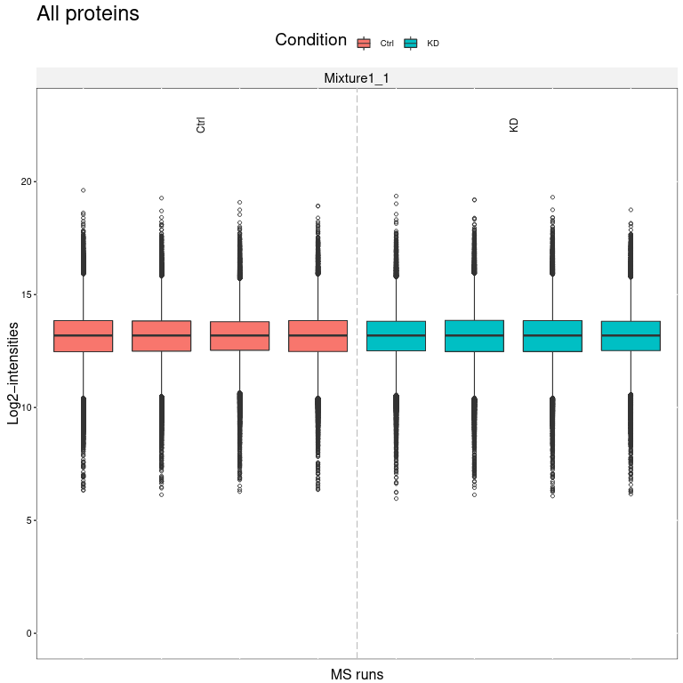
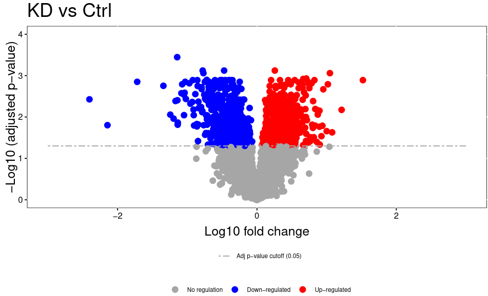

# Introduction


In this training we will cover the full analysis workflow from tandem mass tag (TMT) labeled samples using MaxQuant in conjunction with MSstatsTMT. 

The training dataset consists of a dataset from a [study](https://doi.org/10.1186/s12935-020-1141-2) which investigates the effects of a recently discovered histone methyltransferase, lysine methyl transferase 9 (KMT9α) in A549 cells. High KMT9α expression in lung cancer correlates with poor patient survival. Therefore,  KMT9α is a very interesting research target in light of the fact that lung cancer survival rates could not be improved over the last 15 years. The example dataset consists of 4 cell culture samples from KMT9α knock-down cells and 4 cell culture samples from control (Ctrl) cells. In order to increase the proteome coverage the TMT experiment was pre-fractionated using offline high pH reverse phase chromatography resulting in 12 MS runs.

> <agenda-title></agenda-title>
>
> In this tutorial, we will cover:
>
> 1. TOC
> {:toc}
>
{: .agenda}

## Get data

The raw data is available via the PRIDE repository under the ID: [PXD014145](https://www.ebi.ac.uk/pride/archive/projects/PXD014145). The MaxQuant experimental design template file, MSstatsTMT annotation file and FASTA file for this training are deposited at Zenodo(https://zenodo.org/record/5195800). It is of course possible to use another FASTA file with human proteome sequences, but to ensure that the results are compatible, we recommend using the provided FASTA file. MaxQuant not only adds known contaminants to the FASTA file, but also generates the “decoy” hits for false discovery rate estimation itself, therefore the FASTA file is not allowed to have decoy entries. To learn more about FASTA files, have a look at [Protein FASTA Database Handling tutorial](https://training.galaxyproject.org/training-material/topics/proteomics/tutorials/database-handling/tutorial.html).

> <hands-on-title>Data upload</hands-on-title>
>
> 1. Create a new history for this tutorial and give it a meaningful name
>
>    
>
> 2. Import the FASTA database, experimental design template, and annotation file [Zenodo](https://zenodo.org/record/5195800)
>
>    ```
>    https://zenodo.org/record/5195800/files/protein_database.fasta
>    https://zenodo.org/record/5195800/files/MaxQuant%20experimental%20design%20template.tabular
>    https://zenodo.org/record/5195800/files/MSstatsTMT%20annotation%20file.tabular
>    ```
>    
>
> 3. Once the files are green, rename the fasta file into 'protein database', the experimental design template into 'experimental design template', and the annotation file into 'annotation file'.
>
>    
>
> 4. To run MaxQuant, import the raw data from [PRIDE](https://www.ebi.ac.uk/pride/archive/projects/PXD014145) as a 'Collection'.
>    ```
>    ftp://ftp.pride.ebi.ac.uk/pride-archive/2020/05/PXD014145/MFA380.raw
>    ftp://ftp.pride.ebi.ac.uk/pride-archive/2020/05/PXD014145/MFA381.raw
>    ftp://ftp.pride.ebi.ac.uk/pride-archive/2020/05/PXD014145/MFA382.raw
>    ftp://ftp.pride.ebi.ac.uk/pride-archive/2020/05/PXD014145/MFA383.raw
>    ftp://ftp.pride.ebi.ac.uk/pride-archive/2020/05/PXD014145/MFA384.raw
>    ftp://ftp.pride.ebi.ac.uk/pride-archive/2020/05/PXD014145/MFA385.raw
>    ftp://ftp.pride.ebi.ac.uk/pride-archive/2020/05/PXD014145/MFA386.raw
>    ftp://ftp.pride.ebi.ac.uk/pride-archive/2020/05/PXD014145/MFA387.raw
>    ftp://ftp.pride.ebi.ac.uk/pride-archive/2020/05/PXD014145/MFA388.raw
>    ftp://ftp.pride.ebi.ac.uk/pride-archive/2020/05/PXD014145/MFA389.raw
>    ftp://ftp.pride.ebi.ac.uk/pride-archive/2020/05/PXD014145/MFA390.raw
>    ftp://ftp.pride.ebi.ac.uk/pride-archive/2020/05/PXD014145/MFA391.raw
>    ```
>    
>    
{: .hands_on}


# MaxQuant analysis

We start the MaxQuant run with TMT parameters for MS2 based reporter quantitation. A quality control report will be generated with the [PTXQC functionality](https://pubs.acs.org/doi/10.1021/acs.jproteome.5b00780) that is directly implemented in the MaxQuant Galaxy tool. For more information about MaxQuant and its parameter please have a look at the [Label-free data analysis using MaxQuant tutorial]({{site.baseurl}}/topics/proteomics/tutorials/maxquant-label-free/tutorial.html). To continue with statistical analysis in MSstatsTMT, the Protein Groups and the Evidence files are needed from MaxQuant. The run time of MaxQuant depends on the number and size of the input files and on the chosen parameters. The run of the training datasets will take a while, but the training can be directly continued with the MaxQuant result files from Zenodo. 


> <hands-on-title>MaxQuant analysis</hands-on-title>
>
> 1.  with the following parameters:
>    - In *"Input Options"*:
>        -  *"FASTA files"*: `protein database`
>    - In *"Search Options"*:
>        -  *"Specify an experimental design template"*: `experimental design template` 
>    - In *"Parameter Group"*:
>        -  *"Infiles"*: `MFA380.raw` `MFA381.raw` `MFA382.raw` `MFA383.raw` `MFA384.raw` `MFA385.raw` `MFA386.raw` `MFA387.raw` `MFA388.raw` `MFA389.raw` `MFA390.raw` `MFA391.raw`
>        - *"Quantitation Methods"*: `reporter ion MS2`
>            - *"isobaric labeling"*: `TMT11plex`
>            - *"Filter by PIF"*: `Yes`
>    - *"Generate PTXQC (proteomics quality control pipeline) report? (experimental setting)"*: `Yes`
>    - In *"Output Options"*:
>        - *"Select the desired outputs."*: `Protein Groups` `mqpar.xml` `Evidence` `MaxQuant and PTXQC log`
>
>    > <tip-title>Continue with results from Zenodo</tip-title>
>    >
>    > Because the MaxQuant run takes quite a while, we recommend to download the MaxQuant results from Zenodo and continue with the tutorial
>    > 1. Import the files from [Zenodo](https://zenodo.org/record/5195800)
>    >
>    >  ```
>    > https://zenodo.org/record/5195800/files/MaxQuant%20Result%20evidence.tabular
>    > https://zenodo.org/record/5195800/files/MaxQuant%20Result%20protein%20groups.tabular
>    > ```
>    {: .tip}
{: .hands_on}

> <question-title></question-title>
>
> 1. How many protein groups were found with MaxQuant?
>
> > <solution-title></solution-title>
> >
> > 1. 6911 (numbers might slightly vary with different MaxQuant versions); number of lines minus header line in the MaxQuant protein groups output
> >
> {: .solution}
>
{: .question}


> <tip-title>PIF parameter for TMT data</tip-title>
> Co-isolation of multiple peptides can lead to inaccurate TMT signals, as not only one peptide is fragmented but multiple different peptides are fragmented and the TMT signals cannot be distinguished anymore. MaxQuant can “check” the MS1 scans to predict, whether multiple different peptides were cofragmented. Precursor Intensity Filtering (PIF) allows you to implement a cutoff how high the purity of fragmentation was (1 = no coisolation, 0.75 = default).
{: .tip}

> <tip-title>Preparing an MaxQuant experimental design template for your own analysis</tip-title>
> For this tutorial all files needed for the analysis are provided. Nevertheless here are some guidelines for the generation of the experimental design template for MaxQuant for your own data analyses.
> For thermo.raw files, “.raw” is considered a part of the filename. Therefore, file names should be 'Filename1.raw', 'Filename2.raw' etc.. Please pay special attention to your experimental design, since MaxQuant will summarize peptide and protein intensities differently depending on this input. In brief, MaxQuant will summarize the protein intensities within each specified experiment. Often, TMT experiments are not measured in one MS run, but in multiple runs (either as so called fractions, or as replicates). Over the last years, high pH prefractionation has become the standard for fractionating TMT samples. Alternatively, SCX or HILIC fractionations can be employed. Although you fractionated your samples prior to measurement you still want MaxQuant to group all samples which belong to “one” TMT experiment. Since the fractions originate from one sample the experimental design template allows to map multiple measurements to one experiment (= Sample). Additionally, it is possible to have a more complex experimental setup including multiple TMT experiments, possibly containing multiple fractions per experiment. All MS files which are labeled with the same “Experiment” name are summarized in the proteinGroups and peptides output of MaxQuant.
{: .tip}

# MSstatsTMT analysis

The protein groups and evidence files of MaxQuant can directly be used as an input for MSstatsTMT. MSstatsTMT automatically removes all proteins that are labelled as contaminants (‘+’ sign in the column ‘potential contaminant’ of both MaxQuant outputs). In case you want to prevent this step either run MaxQuant with "Include Contaminants: No" or remove the '+' sign from the MaxQuant files as described in the [label-free MSstats training]({{site.baseurl}}/topics/proteomics/tutorials/maxquant-msstats-dda-lfq/tutorial.html). Additionally, MSstatsTMT will combine all quantitations according to the annotation file, which you have to provide (e.g all fractions of the same mixture are combined).
For this dataset, the standard parameters of MSstatsTMT fit quite nicely, as this is a straightforward two group comparison. If you have more than two groups, you may consider using the comparison matrix option of MSstatsTMT (for more information see [label-free MSstats training]({{site.baseurl}}/topics/proteomics/tutorials/maxquant-msstats-dda-lfq/tutorial.html)).


> <hands-on-title>MSstatsTMT analysis</hands-on-title>
>
> 1.  with the following parameters:
>    - *"Input Source"*: `MaxQuant`
>        -  *"evidence.txt - feature-level data"*: `evidence` (output of **MaxQuant** )
>        -  *"proteinGroups.txt"*: `proteinGroups` (output of **MaxQuant** )
>        -  *"annotation.txt"*: `annotation file`
>    - In *"Plot Output Options"*:
>        - *"Select protein IDs to draw plots"*: `Option for QC plot: "allonly" will generate one QC plot with all proteins`
>    - *"Compare Groups"*: `Yes`
>        - In *"Comparison Plot Options"*:
>            - *"Display protein names in Volcano Plot."*: `No`
>    - *"Select Outputs"*: `MSstatsTMT summarization log` `Protein Abundance` `QC Plot`
{: .hands_on}

> <tip-title>Waiting for MSstatsTMT result</tip-title>
> This training consists of a real proteomics experiments. Therefore, calculation times take longer than in usual Galaxy tutorials. You may want to come back later to the training or use the time to prepare your own data for the analysis with MaxQuant and MSstatsTMT with the tips provided in this training (yellow boxes).
{: .tip}

> <question-title></question-title>
>
> 1. How many differentially regulated proteins were detected in the MSstatsTMT group comparison? 
>
> > <solution-title></solution-title>
> >
> > 1. 7139 (numbers might slightly vary with different MSstatsTMT versions); number of lines minus header line in the MSstatsTMT group comparison output
> >
> {: .solution}
>
{: .question}

> <tip-title>Preparing an MSstatsTMT annotation file for your own analysis</tip-title>
> 
> For this tutorial all files needed for the analysis are provided. Nevertheless here are some guidelines for the generation of annotation file for MSstatsTMT for your own data analyses.
> As MSstatsTMT has to perform statistical analyses, you have to provide the following basic information: Which quantitation channel in every sample corresponds to which original biological sample and which biological condition (e.g WT or knock-down) does this sample belong to? To fully automate the process of choosing an appropriate statistical model for analysis, MSstatsTMT needs an annotation matrix that is extremely powerful because it can deal with any experimental setup. 
> 
> The annotation file contains the following columns:
> - **Run** corresponds to your MS file names. Please note that MaxQuant in Galaxy will add a “.thermo” to your raw file name as it appears in your history. Since we first analyse the data with MaxQuant, MSstatsTMT needs this additional extension for this annotation file. The correct run names can be found after MaxQuant is finished in the evidence file in the column ‘Raw file’.
> - **Fraction** corresponds to the aforementioned optional pre-fractionation fraction of your samples (e.g high pH RP, or SCX)
> - **TechRepMixture** corresponds to the n-th time this fraction was measured. If you measured the first Fraction of your first sample twice, Fraction would stay the same, but the TechRepMixture would have to differ.
> - **Channel** corresponds to the TMT channel which was used in your Experiments.We recommend to always include all channels in your searches and your annotations, even when these channels are empty. So if you only used 9 of 11 channels in your TMT experiments, add the last 2 channels anyway and just label them as “Empty” in the Condition column. In Galaxy the channel names need to be named ‘channel.X’, with X being the number of the channel.
> - **Condition** represents the biological condition, which the observation belongs to (e.g Ctrl). Normalization Channel are labeled as “Norm”. Empty Channels as “Empty”
> - **Mixture** corresponds to the “TMT experiment” mentioned above.
> - **BioReplicate** corresponds to the biological specimen this observation derives from.
> On first glance this might sound overwhelming, but used correctly, this annotation matrix can describe very complex experimental setups in a definitive way.
> 
> An example: 
>
> Consider you perform a study on the difference between primary liver tumors and liver tumor metastases. It makes a very big difference whether all your samples derive from different patients, or whether you were able to obtain some primary tumors and metastases samples from the same patient. The samples obtained from the same patient are expected to be related to each other (they are not independent observations and this must be considered during statistical testing).
> A short illustration: 
> You measured 2 different samples of one patient (metastasis and primary tumor sample).This patient would be considered patient 1 and you would label the primary tumor with the first channel of a TMT-11 plex kit (126) and you would label the metastasis with the second channel (127N). After labeling you combine both samples in one Mixture and measure them in one MS run.
>
> Your annotation file for this case would look like this:
>
> | Run                | Fraction | TechRepMixture | Channel | Condition | Mixture | BioReplicate |
> |--------------------|----------|----------------|---------|-----------|---------|--------------|
> | File1.thermo.raw   | 1        | 1              |channel.1|primary    |mixture1 |1             |
> | File1.thermo.raw   | 1        | 1              |channel.2|metastasis |mixture1 |1             |
>
> 
> Let us assume you now have 10 primary tumors and 10 metastases (from 20 different patients). Since you do not have 20plex capabilities, you have to divide your samples into two experiments / mixtures. For simplicity, after labeling and combining all channels belonging to the same experiments, the mixtures are directly measured ( 1 fraction per Mixture). To avoid batch effects due to allocation you use randomization. In order to be able to normalize all quantitations you use a reference sample, which you add to each experiment (this is referred to as “Normalization Channel”). The reference sample is ideally a mixture of all your samples. 
>
> The annotation matrix would now look like this:
>
> | Run                | Fraction | TechRepMixture | Channel  | Condition | Mixture | BioReplicate |
> |--------------------|----------|----------------|----------|-----------|---------|--------------|
> | File1.thermo.raw   | 1        | 1              |channel.1 |primary    |mixture1 |1             |
> | File1.thermo.raw   | 1        | 1              |channel.2 |metastasis |mixture1 |2             |
> | File1.thermo.raw   | 1        | 1              |channel.3 |primary    |mixture1 |3             |
> | File1.thermo.raw   | 1        | 1              |channel.4 |metastasis |mixture1 |4             |
> | File1.thermo.raw   | 1        | 1              |channel.5 |primary    |mixture1 |5             |
> | File1.thermo.raw   | 1        | 1              |channel.6 |metastasis |mixture1 |6             |
> | File1.thermo.raw   | 1        | 1              |channel.7 |primary    |mixture1 |7             |
> | File1.thermo.raw   | 1        | 1              |channel.8 |metastasis |mixture1 |8             |
> | File1.thermo.raw   | 1        | 1              |channel.9 |primary    |mixture1 |9             |
> | File1.thermo.raw   | 1        | 1              |channel.10|metastasis |mixture1 |10            |
> | File1.thermo.raw   | 1        | 1              |channel.11|Norm       |mixture1 |100           |
> | File2.thermo.raw   | 1        | 1              |channel.1 |primary    |mixture2 |1             |
> | File2.thermo.raw   | 1        | 1              |channel.2 |metastasis |mixture2 |2             |
> | File2.thermo.raw   | 1        | 1              |channel.3 |primary    |mixture2 |3             |
> | File2.thermo.raw   | 1        | 1              |channel.4 |metastasis |mixture2 |4             |
> | File2.thermo.raw   | 1        | 1              |channel.5 |primary    |mixture2 |5             |
> | File2.thermo.raw   | 1        | 1              |channel.6 |metastasis |mixture2 |6             |
> | File2.thermo.raw   | 1        | 1              |channel.7 |primary    |mixture2 |7             |
> | File2.thermo.raw   | 1        | 1              |channel.8 |metastasis |mixture2 |8             |
> | File2.thermo.raw   | 1        | 1              |channel.9 |primary    |mixture2 |9             |
> | File2.thermo.raw   | 1        | 1              |channel.10|metastasis |mixture2 |10            |
> | File2.thermo.raw   | 1        | 1              |channel.11|Norm       |mixture2 |100           |
>
>
> Normalization Channels are always labeled as “Norm” in Condition and get an arbitrary BioReplicate number. Since we want the Normalization channel to be a reference, it always has to be the same sample and therefore also should have the same BioReplicate number.
> If you have empty channels, label them as “Empty” in the Condition column and also give them an arbitrary BioReplicate number.
> 
> Exercise: 
>
> How would the annotation file look like for the following experiment:
> 27 samples (12 primary, 12 metastases samples from different patients + 3 reference samples) over 3 TMT experiments / mixtures. 
> You use Channels 1-8 in Exp1, 2-9 in Exp2 and 3-11 in Exp3. Your first used channel is always taken for the reference channel (Exp1: Channel1 = Norm, Exp2: Channel2 = Norm etc). 
> You fractionate all 3 experiments / mixtures into 3 fractions each and measure every MS sample twice (resulting in 18 measurements / raw files total). 
>
> The solution can be found on [Zenodo](https://zenodo.org/record/5195800/files/annotation_exercise.txt).
{: .tip}

For more information on MSstats parameters and ideas on how to follow up with your MSstatsTMT results visit the [label-free MSstats training]({{site.baseurl}}/topics/proteomics/tutorials/maxquant-msstats-dda-lfq/tutorial.html). 

# Follow up on MSstatsTMT results

We obtain several output files from MSstatsTMT. MSstats log file contains the MSstats report with warnings and information about the analysis steps. 
The QC report allows to visualize protein abundance of conditions for all proteins (first page) or if enabled for each individual protein (following pages). 



The MSstatsTMT Group Comparison Plot is a very convenient pdf, which you can search for your favorite proteins of interest to check whether these are dysregulated between the conditions. The red error bar gives you a confidence interval of the fold change.

")

The volcano plot plots the negative log10 of the adjusted P Value derived from statistical testing over the log2 fold change between the conditions you compared. A value of 3 on the y axis corresponds to an adjusted P Value of 0.001, whereas a value of 1 on the x axis corresponds to a ratio of 2 meaning that the protein is twice as high in condition 1 than condition 2..
Please bear in mind that TMT quantitation suffers from ratio compression. There are ways to calculate more accurate fold changes from measured data (or alternatively you can use MS3 quantitation on some machines). However, even with ratio compression, MS2 TMT is an excellent quantitation strategy to detect differentially regulated proteins. Just bear in mind that the reported fold chances of proteins are almost always smaller than the real fold changes between your conditions.




