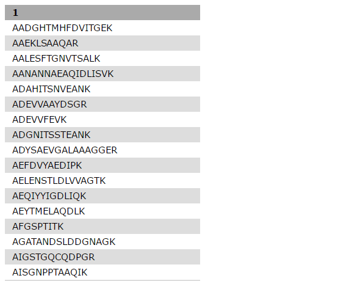
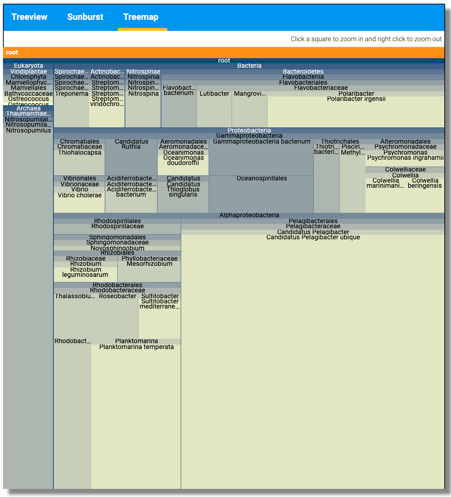
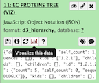
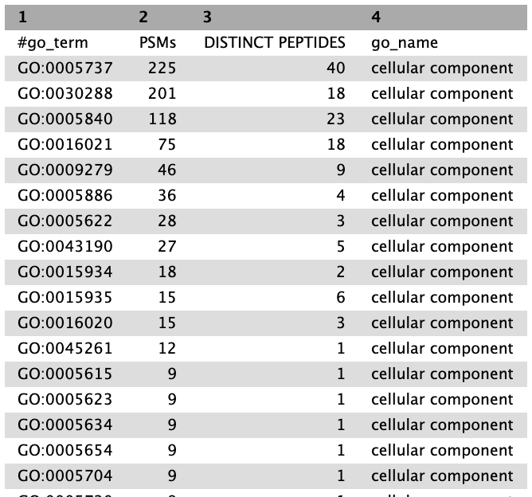
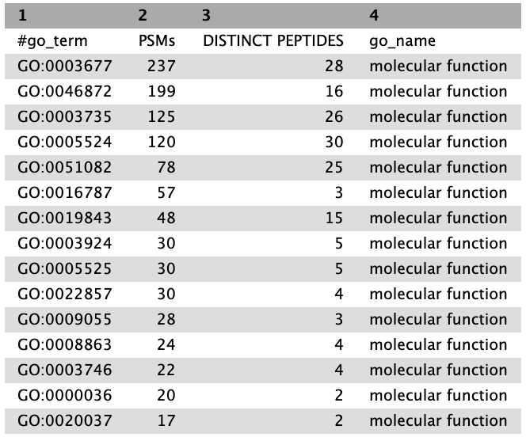

# Introduction
{:.no_toc}

In this metaproteomics tutorial we will identify expressed proteins from a complex bacterial community sample.
For this MS/MS data will be matched to peptide sequences provided through a FASTA file.

Metaproteomics is the large-scale characterization of the entire protein complement of environmental microbiota
at a given point in time. It has the potential to unravel the mechanistic details of microbial interactions with
the host / environment by analyzing the functional dynamics of the microbiome.

In this tutorial, we will analyze a sample of sea water that was collected in August of 2013 from the Bering
Strait chlorophyll maximum layer (7m depth, 65° 43.44″ N, 168° 57.42″ W). The data were originally published in [May et al., 2016](https://www.ncbi.nlm.nih.gov/pubmed/27396978).

> ### Agenda
>
> In this tutorial, we will deal with:
>
> 1. TOC
> {:toc}
>
{: .agenda}

# Pretreatments

## Data upload

There are three ways to upload your data.

*   Upload/Import the files from your computer
*   Using a direct link
*   Import from the data library if your instance provides the files

In this tutorial, we will get the data from Zenodo: .

> ###  Hands-on: Data upload and organization
>
> 1. Create a new history and name it something meaningful (e.g. *Metaproteomics tutorial*)
>
>    
>    
>
> 2. Import the three MGF MS/MS files and the FASTA sequence file from Zenodo.
>
>    
>
>    As default, Galaxy takes the link as name.
>
>    > ###  Comments
>    > - Rename the datasets to a more descriptive name
>    > - There is a GO term file in the zenodo folder is for reference purposes, please do not load it on your account.
>    {: .comment}
>
> 3. Build a **Dataset list** for the three MGF files
>    - Click the **Operations on multiple datasets** check box at the top of the history panel
>       
>    - Check the three boxes next to the MGF files
>    - Click **For all selected...** and choose **Build dataset list**
>    - Ensure the three control samples are the only ones selected, and enter a name for the new collection (e.g. *MGF files*)
>    - Click **Create list** and exit by clicking again the dataset operations icon
>
{: .hands_on}

# Analysis

## Match peptide sequences

The search database labelled `FASTA_Bering_Strait_Trimmed_metapeptides_cRAP.FASTA` is the input database that
will be used to match MS/MS to peptide sequences via a sequence database search. It is a small excerpt of the original database, which was constructed based on a metagenomic screening of the sea water samples (see [May et al. (2016)](https://www.ncbi.nlm.nih.gov/pubmed/27396978)). The full original database can be accessed from [here](https://noble.gs.washington.edu/proj/metapeptide/data/metapeptides_BSt.fasta). The contaminant database (cRAP) was merged with the original database.

For this, the sequence database-searching program called [SearchGUI](https://compomics.github.io/projects/searchgui.html) will be used.
The created dataset collection of the three *MGF files* in the history is used as the MS/MS input.

#### SearchGUI

> ###  Hands-on: SearchGUI
>
> 1. **SearchGUI** : Run **SearchGUI** with:
>    - **Protein Database**: `FASTA_Bering_Strait_Trimmed_metapeptides_cRAP.FASTA`(or however you named the `FASTA` file)
>    - **Input Peak lists (mgf)**: `MGF files` dataset collection.
>
>    > ###  Tip: Select dataset collections as input
>    >
>    > * Click the **Dataset collection** icon on the left of the input field:
>    >
>    >      
>    > * Select the appropriate dataset collection from the list
>    {: .tip}
>
>    Section **Search Engine Options**:
>
>    - **Search Engines**: `X!Tandem`
>
>   -  *”Protein database”*: `Output dataset ‘output’ from step 1`
>   -  *”Create a concatenated target/decoy before running PeptideShaker”*: `Yes`
>   -  *”Gene mappings will be used and salves along with the project (UniProt databases only)”* `No`
>   -  *”Update gene mappings automatically from Esembl (UniProt databases only)”*: `No`
>   -  *”Input Peak Lists (mgf)”*: `Output dataset ‘output’ from step 2`
>   -  *”DB-Search engines”*:`X!Tandem`
>   -  *”Digestion”*: `Select enzymes`
>   -  *”Enzyme”* `Trypsin`
>   -  *”Maximum Missed Cleavages”*: `2`
>   -  *”Precursor Ion Tolerance Units”*: `Parts per million (ppm)`
>   -  *”Precursor Ion Tolerance”*: `10.0`
>   -  *”Fragment Tolerance Units”*: `Daltons`
>   -  *” Fragment Tolerance”*: `0.02`
>   -  *”Minimum Charge”*: `2`
>   -  *”Maximum Charge”*: `6`
>   -  *”Forward Ion”*: `b`
>   -  *”Reverse Ion”*: `y`
>   -  *”Minimum precursor isotope”*: `0`
>   -  *”Maximum precursor isotope”*: `1`
>   -  *”Fixed Modifications”*: `Carbamidomethylation of C`
>   -  *”Variable Modifications”*: `Oxidation of M`
>
>    > ###  Tip: Search for options
>    >
>    > * For selection lists, typing the first few letters in the window will filter the available options.
>    {: .tip}
>
>   -  *”Search GUI Options”*: `Default`
>   -  *”X!Tandem Options”*: `Advanced`
>   -  *”X!Tandem: Total Peaks”*: `50`
>   -  *”X!Tandem: Min Peaks”*: `15`
>   -  *”X!Tandem: Min Frag m/z”*: `200`
>   -  *”X!Tandem: Min Precursor Mass”*: `200`
>   -  *”X!Tandem: Noise Suppression”*: `Yes`
>   -  *”X!Tandem: Dynamic Range”*: `100`
>   -  *”X!Tandem: Quick Acetyl”*: `No`
>   -  *”X!Tandem: Quick Pyrolidone”*: `No`
>   -  *”X!Tandem: Protein stP Bias”*: `No`
>   -  *”X!Tandem: Maximum Valid Expectation Value”*: `100.0`
>   -  *” X!Tandem: Output proteins”*: `No`
>   -  *”X!Tandem: Output sequences”*: `No`
>   -  *”X!Tandem: Output Spectra”*: `Yes`
>   -  *”X!Tandem peptide model refinement”*: `Don’t refine`
>   - leave everything else as default
>
> 2. Click **Execute**.
>
{: .hands_on}

Once the database search is completed, the SearchGUI tool will output a file (called a
SearchGUI archive file) that will serve as an input for the next section, PeptideShaker.

> ###  Comment
> Note that sequence databases used for metaproteomics are usually much larger than the excerpt used in this tutorial. When using large databases, the peptide identification step can take much more time for computation. In metaproteomics, choosing the optimal database is a crucial step of your workflow, for further reading see [Timmins-Schiffman et al (2017)](https://www.ncbi.nlm.nih.gov/pubmed/27824341).
>
> To learn more about database construction in general, like integrating contaminant databases or using a decoy strategy for FDR searching, please consult our tutorial on [Database Handling]({{site.baseurl}}/topics/proteomics/tutorials/database-handling/tutorial.html).
>
{: .comment}

#### PeptideShaker

[PeptideShaker](https://compomics.github.io/projects/peptide-shaker.html) is a post-processing software tool that
processes data from the SearchGUI software tool. It serves to organize the Peptide-Spectral
Matches (PSMs) generated from SearchGUI processing and is contained in the SearchGUI archive.
It provides an assessment of confidence of the data, inferring proteins identified from the
matched peptide sequences and generates outputs that can be visualized by users to interpret
results. PeptideShaker has been wrapped in Galaxy to work in combination with SearchGUI
outputs.

> ###  Comment
> There are a number of choices for different data files that can be generated using
> PeptideShaker. A compressed file can be made containing all information needed to view the
> results in the standalone PeptideShaker viewer. A `mzidentML` file can be created that contains
> all peptide sequence matching information and can be utilized by compatible downstream
> software. Other outputs are focused on the inferred proteins identified from the PSMs, as well
> as phosphorylation reports, relevant if a phosphoproteomics experiment has been undertaken.
> More detailed information on peptide inference using SearchGUI and PeptideShaker can be found in our tutorial on [Peptide and Protein ID]({{site.baseurl}}/topics/proteomics/tutorials/protein-id-sg-ps/tutorial.html).
{: .comment}

> ###  Hands-on: PeptideShaker
>
> 1. **PeptideShaker** : Run **PeptideShaker** with:
>   -  *”Compressed SearchGUI results”*: `Output dataset ‘searchgui_results’ from step 3`
>   -  *”Specify Advanced Peptide Shaker Processing Options”*: `Advanced Processing Options`
>   -  *”FDR at the protein level”*: `1.0`
>   -  *”FDR at the peptide level”*: `1.0`
>   -  *”FDR at the PSM level”*: `1.0`
>   -  *”Minimum confidence required for a protein in the fraction MW plot”*: `95.0`
>   -  *”The PRM probabilistic score to use for PTM localization”*: `A-score`
>   -  *”The PTM to peptide sequence matching type”*: `Amino Acids`
>   -  *”Align peptide ambiguously localizes PRMs on confident sites”*: `Yes`
>   -  *”Specify Advanced FIltering Options”*: `Advanced Filtering Options`
>   -  *”Minimum Peptide Length”*: `6`
>   -  *”Maximum Peptide Length”*: `65`
>   -  *”Maximum Precursor Error”*: `10.0`
>   -  *”Maximum Precursor Error Type”*: `ppm`
>   -  *”Exclude Unknown PTMs”: `Yes`
>   -  *”Creates a mzldentML file*”: `No`
>   -  *”Compress results into single zip file”*: `No`
>   -  *”Exports the CPS file”*: `No`
>   -  *”Reports to be generated”*: `Select the ‘PSM Report’`
>
>
> 2. Click **Execute** and inspect the resulting files after they turned green with the **View data** icon:
>     
>
{: .hands_on}

A number of new items will appear in your history, each corresponding to the outputs selected
in the PeptideShaker parameters. Most relevant for this tutorial is the PSM report:

Scrolling towards left will show the sequence for the PSM that matched to these
metapeptide entries. Column 3 is the sequence matched for each PSM entry. Every identified PSM is a
new row in the tabular output.

In the following steps of this tutorial, selected portions of this output will be extracted and used for
analysis of the taxonomic make-up of the sample as well as the biochemical functions
represented by the proteins identified.

## Taxonomy analysis

In the previous section, the genome sequencing and mass spectrometry data from
processing of biological samples was used to identify peptides present in those samples.
Now those peptides are used as evidence to infer which organisms are represented in the sample,
and what biological functions those peptides and associated proteins suggest are occurring.

The UniProt organization collects and annotates all known proteins for organisms. A UniProt
entry includes the protein amino acid sequence, the NCBI taxonomy, and any annotations
about structure and function of the protein. The UniPept web resource developed
by Ghent University will be used to match the sample peptides to proteins. UniPept indexes all Uniprot
proteins and provides a fast matching algorithm for peptides.

> ###  Unipept
>
> Users can access UniPept via a [web page](https://unipept.ugent.be) and paste peptide
> sequences into the search form to retrieve protein information. But we'll use the Galaxy
> *Unipept* tool to automate the process. The *Unipept* tool sends the peptide list to the
> UniPept REST API service, then transforms the results into datasets that can be further analyzed
> or operated on within Galaxy.
{: .comment}

#### Recieving the list of peptides: Query Tabular

In order to use *Unipept*, a list containing the peptide sequences has to be generated.
The tool **Query Tabular** can load tabular data (the PSM report in this case) into a SQLite data base.
As a tabular file is being read, line filters may be applied and an SQL query can be performed.

> ###  Hands-on: Query Tabular
>
> 1. **Query Tabular** : Run **Query Tabular** with:
>
>   -  *”Tabular Dataset for Table”*: `Output dataset ‘output_psm’ from step 4`
>   -  *”Specify Name for Table”*: `psm`
>   -  *”Use first line as column names”*: `No`
>   -  *”Specify Column Names (comma-separated list)”*: `id,,sequence,,,,,,,,,,,,,,,,,,,,confidence,validation`
>   -  *”Only load the columns you have named into database”*: `Yes`
>   -  *”Save the sqlite database in your history”*: `No`
>
>        > ###  Comment
>        >
>        > By default, table columns will be named: c1,c2,c3,...,cn (column names for a table must be unique).
>        > You can override the default names by entering a comma separated list of names, e.g. `,name1,,,name2`
>        > would rename the second and fifth columns.
>        >
>        > Check your input file to find the settings which best fits your needs.
>        {: .comment}
>
>        > ###  Querying SQLite Databases
>        >
>        > * **Query Tabular** can also use an existing SQLite database. Activating `Save the sqlite database in your history`
>        > will store the created database in the history, allowing to reuse it directly.
>        >
>        {: .comment}
>
>    - **SQL Query to generate tabular output**:
>
>          `SELECT distinct sequence
>
>          FROM psm
>
>          WHERE confidence >= 95
>
>          ORDER BY sequence`
>
>    > ###  Questions
>    >
>    > The SQL query might look confusing at first, but having a closer look should clarify a lot.
>    >
>    > 1. What does `FROM psm` mean?
>    > 2. What need to be changed if we only want peptides with a confidence higher then 98%?
>    >
>    > > ###  Solution
>    > > 1. We want to read from table "psm". We defined the name before in the "Specify Name for Table" option.
>    > > 2. We need to change the value in line 3: "WHERE validation IS NOT 'Confident' AND confidence >= 98"
>    > {: .solution }
>    {: .question}
>
>    - **include query result column headers**: `No`
>
> 2. Click **Execute** and inspect the query results file after it turned green. If everything went well, it should look similiar:
>
>     
>
{: .hands_on}

#### Retrieve taxonomy for peptides: Unipept

The generated list of peptides can now be used to search via *Unipept*.
We do a taxonomy analysis using the UniPept peptinfo function to return the taxonomic lowest common ancestor for each peptide:

> ###  Hands-on: Unipept
>
> 1. **Unipept** : Run **Unipept** with:
>   -  *”Unipept application”*: `peptinfo: Tryptic peptides and associated EC and GO terms and lowest common ancestor taxonomy`
>   -  *”Equate isoleucine and leucine”*: `No`
>   -  *”Retrieve extra information*”: `No`
>   -  *”Group responses by GO namespace (biological process, molecular function, cellular component)”*: `Yes`
>   -  *”Names”*: `No`
>   -  *”Allfields”*: `No`
>   -  *”Peptides input format”*: `Tabular`
>   -  *”Tabular Input Containing Peptide column”*: `Output dataset ‘output’ from step 5`
>   -  *”Select column with peptides”*: `1`
>   -  *”Choose outputs”*: `Select the ‘JSON Taxonomy Tree (for pepet2lca, pe2taxa, and peptinfo),’ ‘Peptide GO terms in normalized tabular (for pept2go, pept2funct, and peptinfo),’ ‘Peptide EC terms in normalized tabular (for pept2ec, pept2funct, and peptinfo),’ ‘JSON EC Coverage Tree (for pept2ec, pep2funct, and peptinfo)’`
>   -  *”Exit with error on invalid peptides, otherwise ignore them”*: `No`
>
> 2. Click **Execute**. The history should grow by two files. View each to see the difference.
>
>       > ###  Comment
>       >
>       > The JSON (JavaScript Object Notation) file contains the same information as the tabular file but is not comfortably human readable.
>       > Instead, we can use it to use JavaScript libraries to visualize this data.
>       {: .comment}
>
> 3. Visualize the data:
>
>    - Click on the JSON output file from the *Unipept* tool to expand it. Click on the **Visualize** button and select **Unipept Tree viewer**:
>
>       
>
>
>       
>
>
>    - A new window should appear with a visualization of the taxonomy tree of your data. Use the mouse wheel to scroll in and out and click on nodes to expand or collapse them:
>
>       
>
>       
>
>       

> The user can perform the same functions for viewing the EC output.
> 
>
> The Unipept viewer also provides interactive viewer for EC number (Tree view, Sunburst and Treemap)
>
> 
{: .hands_on}

## Genus taxonomy level summary

The tabular *Unipept* output lists the taxonomy assignments for each peptide. To create a meaningful summary, the **Query Tabular** tool is
once again used, aggregating the number of peptides and PSMs for each genus level taxonomy assignment:

> ###  Hands-on: Query Tabular
>
> 1. **Query Tabular** : Run **Query Tabular** with:
>   -  *”Add tables to this Database”*: ‘‘
>   -  *”Tabular Dataset for Table”*: `Output dataset ‘output_psm’ from step 4`
>   -  *”Filter By”*: `by regex expression matching`
>   -  *”Regex pattern”*: `^\d`
>   -  *”Action for regex match”*: `include line on pattern match`
>   -  *”Specify Name for Table”*: `psm`
>   -  *”Use first line as column names”*: `No`
>   -  *”Specify Column Names (comma-separated list)”*: `,,sequence,,,,,,,,,,,,,,,,,,,,confidence,validation`
>   -  *”Only load the columns you have named into database”*: `Yes`
>   -  *”Add an auto increment primary key column with this name”*: ``
>   -  *”Tabular Dataset for Table”*: `Output dataset ‘output_tsv’ from step 7`
>   -  *”Filter By”*: `by regex expression matching`
>   -  *”Regex pattern”*: `#peptide`
>   -  *”Action for regex match”*: `exclude line on pattern match`
>   -  *”Specify Name for Table”*: `lca`
>   -  *”Use first line as column names”*: `No`
>   -  *”Specify Column Names (comma-separated list)”*: `peptide,,,,,,,,,,,,,,,,,,,,,genus`
>   -  *”Only load the columns you have named into database”*: `Yes`
>   -  *”Add an auto increment primary key column with this name”*: ``
>   -  *”Save the sqlite database in your history”*: `Yes`
>   -  *”SQL Query to generate tabular output”*:
 `SELECT lca.genus,count(psm.sequence) as "PSMs",count(distinct psm.sequence) as "DISTINCT PEPTIDES"
FROM psm LEFT JOIN lca ON psm.sequence = lca.peptide
WHERE confidence >= 95
GROUP BY lca.genus
ORDER BY PSMs desc, 'DISTINCT PEPTIDES' desc`
>
>   -  *”Include query result column headers”*: `Yes`
>   -  *”Prefix character for column_header line”*: ‘#’
>
>
> 2. Click **Execute** and inspect the query results file after it turned green:
>
>     
>
{: .hands_on}

## Functional Analysis

Recent advances in microbiome research indicate that functional characterization via metaproteomics analysis has the potential to accurately measure the microbial response to perturbations. In particular, metaproteomics enables the estimation of the function of the microbial community based on expressed microbial proteome.

In the following chapter, a functional analysis will be performed using the **UniPept** application `peptinfo` in order to match the list of peptides with the correlated Gene Ontology terms.
This allows to get an insight of the **biological process**, the **molecular function** and the **cellular component** related to the sample data. We also performed EC number analysis on this dataset

> ###  Gene Ontology (GO) Consortium
>
> The [Gene Ontology Consortium](http://www.geneontology.org/) provides with its Ontology a framework for the model of biology.
> The GO defines concepts/classes used to describe gene function, and relationships between these concepts. It classifies functions along three aspects:
>
>
> - **molecular function**
>
>   - molecular activities of gene products
>
> - **cellular component**
>
>   - where gene products are active
>
> - **biological process**
>
>   - pathways and larger processes made up of the activities of multiple gene products.
>
> [more information](http://geneontology.org/page/ontology-documentation)
>
{: .comment}

#### Retrieve GO and EC IDs for peptides: Unipept

The **UniPept** application `peptinfo` can be used to return the list of proteins containing each peptide.The option `retrieve extra information` option is set to `yes` so that we retrieve Gene Ontology assignments for each protein. Unipept 4.0 has inbuilt GO terms.

> ###  Hands-on: Unipept
>
> 1. **Unipept** : Run **Unipept** with:
>   -  *”Unipept application”*: ‘peptinfo: Tryptic peptides and associated EC and GO terms and lowest common ancestor taxonomy’
>   -  *”Equate isoleucine and leucine”*: `No`
>   -  *”Retrieve extra information*”: `No`
>   -  *”Group responses by GO namespace (biological process, molecular function, cellular component)”*: `Yes`
>   -  *”Names”*: `No`
>   -  *”Allfields”*: `No`
>   -  *”Peptides input format”*: `Tabular`
>   -  *”Tabular Input Containing Peptide column”*: `Output dataset ‘output’ from step 5`
>   -  *”Select column with peptides”*: `1`
>   -  *”Choose outputs”*: `Select the ‘Tabular with one line per peptide,’ ‘JSON Taxonomy Tree (for pepet2lca, pe2taxa, and peptinfo),’ ‘Peptide GO terms in normalized tabular (for pept2go, pept2funct, and peptinfo),’ ‘JSON EC Coverage Tree (for pept2ec, pep2funct, and peptinfo)`
>   -  *”Exit with error on invalid peptides, otherwise ignore them”*: `No`
> 2. Click **Execute**.
>
> 3. inspect the result:
>
>    - The output should be a tabular file containing a column labeled `go_references`. This is what we're looking for.
>
{: .hands_on}

#### Combine all information to quantify the EC and GO results

As a final step we will use **Query Tabular** in a more sophisticated way to combine all information to quantify the EC analysis. 
> ###  Hands-on: Query Tabular
>
>1.**Query Tabular**  with the following parameters:
>   -  *”Add tables to this Database”*: ``
>   -  *”Tabular Dataset for Table”*: `Output dataset ‘output_psm’ from step 4`
>   -  *”Filter By”*: `by regex expression matching`
>   -  *”Regex pattern”*: `^\d`
>   -  *”Action for regex match”*: `include line on pattern match`
>   -  *”Specify Name for Table”*: `psm`
>   -  *”Use first line as column names”*: `No`
>   -  *”Specify Column Names (comma-separated list)”*: `,,sequence,,,,,,,,,,,,,,,,,,,,confidence,validation`
>   -  *”Only load the columns you have named into database”*: `Yes`
>   -  *”Add an auto increment primary key column with this name”*: ``
>   -  *”Tabular Dataset for Table”*: `Output dataset ‘output_ec_tsv’ from step 6`
>   -  *”Filter By”*: `by regex expression matching`
>   -  *”Regex pattern”*: `#peptide`
>   -  *”Action for regex match”*: `exclude line on pattern match`
>   -  *”Specify Name for Table”*: `goec`
>   -  *”Use first line as column names”*: `No`
>   -  *”Specify Column Names (comma-separated list)”*: `peptide,total_protein_count,ec_number,protein_count`
>   -  *”Save the sqlite database in your history”*: `No`
>   -  *”SQL Query to generate tabular output”*: 
`SELECT goec.ec_number,count(psm.sequence) as "PSMs",count(distinct psm.sequence) as "DISTINCT PEPTIDES" 
FROM psm LEFT JOIN goec ON psm.sequence = goec.peptide 
WHERE confidence >= 95 
GROUP BY goec.ec_number 
ORDER BY PSMs desc, 'DISTINCT PEPTIDES' desc`
>   -  *”Include query result column headers”*: `Yes`
>   -  *”Prefix character for column_header line”*: `#`
>
> 2. Click **Execute**.
>
{: .hands_on}

Here is another query tabular on extracting all the GO terms from the Unipept results

> ###  Hands-on: Query Tabular
>
> 1. **Query Tabular** : Run **Query Tabular** with:
>
>   -  *”Add tables to this Database”*: ``
>   -  *”Tabular Dataset for Table”*: ‘Output dataset `output_psm’ from step 4`
>   -  *”Filter By”*: `by regex expression matching`
>   -  *”Regex pattern”*: `^\d`
>   -  *”Action for regex match”*: `include line on pattern match`
>   -  *”Specify Name for Table”*: `psm`
>   -  *”Use first line as column names”*: `No`
>   -  *”Specify Column Names (comma-separated list)”*: `,,sequence,,,,,,,,,,,,,,,,,,,,confidence,validation`
>   -  *”Only load the columns you have named into database”*: `Yes`
>   -  *”Add an auto increment primary key column with this name”*: ``
>   -  *”Tabular Dataset for Table”*: `Output dataset ‘output_go_tsv’ from step 6`
>   -  *”Filter By”*: `by regex expression matching`
>   -  *”Regex pattern”*: `#peptide`
>   -  *”Action for regex match”*: `exclude line on pattern match`
>   -  *”Specify Name for Table”*: `goterm`
>   -  *”Use first line as column names”*: `No`
>   -  *”Specify Column Names (comma-separated list)”*: `peptide,total_protein_count,go_term,protein_count,go_name`
>   -  *”Only load the columns you have named into database”*: `Yes`
>   -  *”Add an auto increment primary key column with this name”*: ``
>   -  *”Save the sqlite database in your history”*: `Yes`
>   -  *”SQL Query to generate tabular output”*: 
`SELECT goterm.go_term,count(psm.sequence) as "PSMs",count(distinct psm.sequence) as "DISTINCT PEPTIDES",goterm.go_name 
FROM psm LEFT JOIN goterm ON psm.sequence = goterm.peptide 
WHERE confidence >= 95 
GROUP BY goterm.go_term 
ORDER BY PSMs desc, 'DISTINCT PEPTIDES' desc`
>   -  *”Include query result column headers”*: `Yes`
>   -  *”Prefix character for column_header line”*: `#`
>
>
> 2. Click **Execute**.
>
{: .hands_on}

The next three steps are to filter out the three different Go terms. For that we use the Filter data on any column using simple expressions tool and extract the GO terms and the corresponding number of peptides associated with these terms.

> ###  Hands-on: Filter data on any column using simple expressions
>
> **Filter**  with the following parameters: 
>   -  *”Filter”*: `Output dataset ‘output’ from step 9`
>   -  *”With following condition”*: `c4=='biological process'`
>   -  *”Number of header lines to skip”*: `1`
>
> 2. Click **Execute**.
>
{: .hands_on}
> 

> ###  Hands-on: Filter data on any column using simple expressions
>
> **Filter**  with the following parameters: 
>   -  *”Filter”*: `Output dataset ‘output’ from step 9`
>   -  *”With following condition”*: `c4=='cellular component'`
>   -  *”Number of header lines to skip”*: `1`
>
> 2. Click **Execute**.
>
{: .hands_on}
> 
> ###  Hands-on: Filter data on any column using simple expressions
>
> **Filter**  with the following parameters: 
>   -  *”Filter”*: `Output dataset ‘output’ from step 9`
>   -  *”With following condition”*: `c4==’molecular function’`
>   -  *”Number of header lines to skip”*: `1`
>
> 2. Click **Execute**.
>
{: .hands_on}
> 

With these three output files the functional analysis of this tutorial is finished. Each record contains the name of a GO term, the amount of peptides related to it and the amount of PSMs for these peptides.

This marks the end to the metaproteomics workflow! 

> ###  References
>
> - [Dataset](https://www.ncbi.nlm.nih.gov/pubmed/27824341) and [SixGill software](https://www.ncbi.nlm.nih.gov/pubmed/27396978)
>
> - [Galaxy workflows for metaproteomics](https://www.ncbi.nlm.nih.gov/pubmed/26058579)
>
> - [Metaproteomics community effort](https://z.umn.edu/gcc2017mporal)
>
> - [Unipept](https://www.ncbi.nlm.nih.gov/pubmed/28552653)
>
> - [Galaxy-P Metaproteomics instance](http://z.umn.edu/metaproteomicsgateway)
>
> - [Metaproteomics video](http://z.umn.edu/mpvideo2018)
{: .comment}

