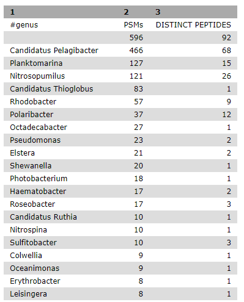

# Introduction
{:.no_toc}

In this metaproteomics tutorial we will identify expressed proteins from a complex bacterial community sample.
For this MS/MS data will be matched to peptide sequences provided through a FASTA file.

Metaproteomics is the large-scale characterization of the entire protein complement of environmental microbiota
at a given point in time. It has the potential to unravel the mechanistic details of microbial interactions with
the host / environment by analyzing the functional dynamics of the microbiome.

In this tutorial, we will analyze a sample of sea water that was collected in August of 2013 from the Bering
Strait chlorophyll maximum layer (7m depth, 65° 43.44″ N, 168° 57.42″ W). The data were originally published in [May et al., 2016](https://www.ncbi.nlm.nih.gov/pubmed/27396978).

> ### Agenda
>
> In this tutorial, we will deal with:
>
> 1. TOC
> {:toc}
>
{: .agenda}

# Pretreatments

## Data upload

There are a many ways how you can upload your data. Three among these are:

*   Upload the files from your computer
*   Using a direct link
*   Import from the data library if your instance provides the files

In this tutorial, we will get the data from Zenodo: .

> ###  Hands-on: Data upload and organization
>
> 1. Create a new history and name it something meaningful (e.g. *Metaproteomics tutorial*)
> 2. Import the three MGF MS/MS files and the FASTA sequence file from Zenodo.
>
>    > ###  Tip: Importing data via links
>    >
>    > * Copy the link location
>    > * Open the Galaxy Upload Manager
>    > * Select **Paste/Fetch Data**
>    > * Paste the link into the text field. You can add multiple links, each on a separate line.
>    > * Press **Start**
>    {: .tip}
>
>    As default, Galaxy takes the link as name.
>
>    > ###  Comments
>    > - Rename the datasets to a more descriptive name
>    {: .comment}
>
> 3. Build a **Dataset list** for the three MGF files
>    - Click the **Operations on multiple datasets** check box at the top of the history panel
>       
>    - Check the three boxes next to the MGF files
>    - Click **For all selected...** and choose **Build dataset list**
>    - Ensure the three control samples are the only ones selected, and enter a name for the new collection (e.g. *MGF files*)
>    - Click **Create list** and exit by clicking again the dataset operations icon
>
{: .hands_on}

# Analysis

## Match peptide sequences

The search database labelled `FASTA_Bering_Strait_Trimmed_metapeptides_cRAP.FASTA` is the input database that
will be used to match MS/MS to peptide sequences via a sequence database search. It is a small excerpt of the original database, which was constructed based on a metagenomic screening of the sea water samples (see [May et al. (2016)](https://www.ncbi.nlm.nih.gov/pubmed/27396978)). The full original database can be accessed from [here](https://noble.gs.washington.edu/proj/metapeptide/data/metapeptides_BSt.fasta). A contaminant database was added.

For this, the sequence database-searching program called [SearchGUI](https://compomics.github.io/projects/searchgui.html) will be used.
The created dataset collection of the three *MGF files* in the history is used as the MS/MS input.

#### SearchGUI

> ###  Hands-on: SearchGUI
>
> 1. **SearchGUI** : Run **SearchGUI** with:
>    - **Protein Database**: `FASTA_Bering_Strait_Trimmed_metapeptides_cRAP.FASTA`(or however you named the `FASTA` file)
>    - **Input Peak lists (mgf)**: `MGF files` dataset collection.
>
>    > ###  Tip: Select dataset collections as input
>    >
>    > * Click the **Dataset collection** icon on the left of the input field:
>    >
>    >      
>    > * Select the appropriate dataset collection from the list
>    {: .tip}
>
>    Section **Search Engine Options**:
>
>    - **B-Search Engines**: `X!Tandem`
>
>    > ###  Comment
>    >
>    > The section **Search Engine Options** contains a selection of sequence database searching
>    > programs that are available in SearchGUI. Any combination of these programs can be used for
>    > generating PSMs from MS/MS data. For the purpose of this tutorial, **X!Tandem** we will be used.
>    {: .comment}
>
>    Section **Precursor Options**:
>
>    - **Fragment Tolerance (Daltons)**: `0.02`- this is high resolution MS/MS data
>
>    Section **Protein Modification Options**:
>
>    - **Fixed Modifications**: `Carbamidomethylation of C`
>    - **Variable modifications**: `Oxidation of M`
>
>    > ###  Tip: Search for options
>    >
>    > * For selection lists, typing the first few letters in the window will filter the available options.
>    {: .tip}
>
>    Section **Advanced Options**:
>    - **X!Tandem Options**: `Advanced`
>    - **X!Tandem: Quick Acetyl**: `No`
>    - **X!Tandem: Quick Pyrolidone**: `No`
>    - **X!Tandem: Protein stP Bias**: `No`
>    - **X!Tandem: Maximum Valid Expectation Value**: `100`
>
>    - leave everything else as default
>
> 2. Click **Execute**.
>
{: .hands_on}

Once the database search is completed, the SearchGUI tool will output a file (called a
SearchGUI archive file) that will serve as an input for the next section, PeptideShaker.

> ###  Comment
> Note that sequence databases used for metaproteomics are usually much larger than the excerpt used in this tutorial. When using large databases, the peptide identification step can take much more time for computation. In metaproteomics, choosing the optimal database is a crucial step of your workflow, for further reading see [Timmins-Schiffman et al (2017)](https://www.ncbi.nlm.nih.gov/pubmed/27824341).
>
> To learn more about database construction in general, like integrating contaminant databases or using a decoy strategy for FDR searching, please consult our tutorial on [Database Handling]({{site.url}}/topics/proteomics/tutorials/database-handling/tutorial.html).
>
{: .comment}

#### PeptideShaker

[PeptideShaker](https://compomics.github.io/projects/peptide-shaker.html) is a post-processing software tool that
processes data from the SearchGUI software tool. It serves to organize the Peptide-Spectral
Matches (PSMs) generated from SearchGUI processing and is contained in the SearchGUI archive.
It provides an assessment of confidence of the data, inferring proteins identified from the
matched peptide sequences and generates outputs that can be visualized by users to interpret
results. PeptideShaker has been wrapped in Galaxy to work in combination with SearchGUI
outputs.

> ###  Comment
> There are a number of choices for different data files that can be generated using
> PeptideShaker. A compressed file can be made containing all information needed to view the
> results in the standalone PeptideShaker viewer. A `mzidentML` file can be created that contains
> all peptide sequence matching information and can be utilized by compatible downstream
> software. Other outputs are focused on the inferred proteins identified from the PSMs, as well
> as phosphorylation reports, relevant if a phosphoproteomics experiment has been undertaken. 
> More detailed information on peptide inference using SearchGUI and PeptideShaker can be found in our tutorial on [Peptide and Protein ID]({{site.url}}/topics/proteomics/tutorials/protein-id-sg-ps/tutorial.html).
{: .comment}

> ###  Hands-on: PeptideShaker
>
> 1. **PeptideShaker** : Run **PeptideShaker** with:
>   - **Compressed SearchGUI results**: The SearchGUI archive file
>   - **Specify Advanced PeptideShaker Processing Options**: `Default Processing Options`
>   - **Specify Advanced Filtering Options**: `Default Filtering Options`
>   - **Specify Contact Information for mzIdendML**: You can leave the default dummy options for now, but feel free to enter custom contact information.
>   - **Include the protein sequences in mzIdentML**: `No`
>   - **Output options**: Select the `PSM Report` (Peptide-Spectral Match) and the `Certificate of Analysis`
>
>       > ###  Comment
>       >
>       > The **Certificate of Analysis** provides details on all the parameters
>       > used by both SearchGUI and PeptideShaker in the analysis. This can be downloaded from the
>       > Galaxy instance to your local computer in a text file if desired.
>       {: .comment}
>
> 2. Click **Execute** and inspect the resulting files after they turned green with the **View data** icon:
>     
>
{: .hands_on}

A number of new items will appear in your history, each corresponding to the outputs selected
in the PeptideShaker parameters. Most relevant for this tutorial is the PSM report:

Scrolling at the bottom to the left will show the sequence for the PSM that matched to these
metapeptide entries. Column 3 is the sequence matched for each PSM entry. Every PSM is a
new row in the tabular output.

In the following steps of this tutorial, selected portions of this output will be extracted and used for
analysis of the taxonomic make-up of the sample as well as the biochemical functions
represented by the proteins identified.

## Taxonomy analysis

In the previous section, the genome sequencing and mass spectrometry data from
processing of biological samples was used to identify peptides present in those samples.
Now those peptides are used as evidence to infer which organisms are represented in the sample,
and what biological functions those peptides and associated proteins suggest are occurring.

The UniProt organization collects and annotates all known proteins for organisms. A UniProt
entry includes the protein amino acid sequence, the NCBI taxonomy, and any annotations
about structure and function of the protein. The UniPept web resource developed
by Ghent University will be used to match the sample peptides to proteins. UniPept indexes all Uniprot
proteins and provides a fast matching algorithm for peptides.

> ###  Tip: Unipept
>
> Users can access UniPept via a [web page](https://unipept.ugent.be) and paste peptide
> sequences into the search form to retrieve protein information. But we`ll use a Galaxy
> *Unipept* tool to automate the process. The *Unipept* tool sends the peptide list to the
> UniPept REST API service, then transforms the results into datasets that can be further analyzed
> or operated on within Galaxy.
{: .tip}

#### Recieving the list of peptides: Query Tabular

In order to use *Unipept*, a list containing the peptide sequences has to be generated.
The tool **Query Tabular** can load tabular data (the PSM report in this case) into a SQLite data base.
As a tabular file is being read, line filters may be applied and an SQL query can be performed.

> ###  Hands-on: Query Tabular
>
> 1. **Query Tabular** : Run **Query Tabular** with:
>
>    - **Database Table**: Click on `+ Insert Database Table`:
>    - **Tabular Dataset for Table**: The PSM report
>
>    Section **Filter Dataset Input**:
>
>    - **Filter Tabular Input Lines**: Click on `+ Insert Filter Tabular Input Lines`:
>    - **Filter By**: Select `by regex expression matching`
>        - **regex pattern**: `^\d`
>        - **action for regex match**: `include line on pattern match`
>
>    Section **Table Options**:
>
>    - **Specify Name for Table**: `psm`
>    - **Specify Column Names (comma-separated list)**: `id,,sequence,,,,,,,,,,,,,,,,,,,,confidence,validation`
>
>        > ###  Comment
>        >
>        > By default, table columns will be named: c1,c2,c3,...,cn (column names for a table must be unique).
>        > You can override the default names by entering a comma separated list of names, e.g. `,name1,,,name2`
>        > would rename the second and fifth columns.
>        >
>        > Check your input file to find the settings which best fits your needs.
>        {: .comment}
>
>    - **Only load the columns you have named into database**: `Yes`
>
>    - **Save the sqlite database in your history**: `Yes`
>
>        > ###  Tip
>        >
>        > * **Query Tabular** can also use an existing SQLite database. Activating `Save the sqlite database in your history`
>        > will store the created database in the history, allowing to reuse it directly.
>        >
>        {: .tip}
>
>    - **SQL Query to generate tabular output**:
>
>          SELECT distinct sequence
>
>          FROM psm
>
>          WHERE validation IS NOT 'Confident' AND confidence >= 95
>
>          ORDER BY sequence
>
>    > ###  Questions
>    >
>    > The SQL query might look confusing at first, but having a closer look should clarify a lot.
>    >
>    > 1. What does `FROM psm` mean?
>    > 2. What need to be changed if we only want peptides with a confidence higher then 98%?
>    >
>    >    

>    >    
Click to view answers

>    >    <ol type="1">
>    >    <li>We want to read from table "psm". We defined the name before in the "Specify Name for Table" option.</li>
>    >    <li>We need to change the value in line 3: "WHERE validation IS NOT 'Confident' AND confidence >= 98"</li>
>    >    </ol>
>    >    

>    {: .question}
>
>    - **Omit column headers from tabular output**: `Yes`
>
> 2. Click **Execute** and inspect the query results file after it turned green. If everything went well, it should look similiar:
>
>     
>
{: .hands_on}

While we can proceed with this list of peptides, let's practice using the created SQLite database for further queries.
We might not only be interested in all the distinct peptides, but also on how many PSMs a single peptide had.
Therefore we can search the database for the peptides and count the occurrence without configuring the tables and columns again:

> ###  Hands-on: SQLite to tabular
>
> 1. **SQLite to tabular** : Run **SQLite to tabular** with:
>
>    - **SQL Query**:
>
>          SELECT sequence as "peptide", count(id) as "PSMs"
>
>          FROM psm
>
>          WHERE validation IS NOT 'Confident' AND confidence >= 95
>
>          GROUP BY sequence
>
>          ORDER BY sequence
>
> 2. Click **Execute**. The resulting file should have two columns, one with the distinct peptides, the other with the count number of PSMs.
>
{: .hands_on}

#### Retrieve taxonomy for peptides: Unipept

The generated list of peptides can now be used to search via *Unipept*.
We do a taxonomy analysis using the UniPept pept2lca function to return the taxonomic lowest common ancestor for each peptide:

> ###  Hands-on: Unipept
>
> 1. **Unipept** : Run **Unipept** with:
>
>    - **Unipept application**: `pept2lca: lowest common ancestor`
>    - **Peptides input format**: `tabular`
>    - **Tabular Input Containing Peptide column**: The query results file.
>    - **Select column with peptides**: `Column 1`
>    - **Choose outputs**: Select `tabular` and `JSON taxonomy tree`
>
> 2. Click **Execute**. The history should grow by two files. View each to see the difference.
>
>       > ###  Comment
>       >
>       > The JSON (JavaScript Object Notation) file contains the same information as the tabular file but is not comfortably human readable.
>       > Instead, we can use it to use JavaScript libraries to visualize this data.
>       {: .comment}
>
> 3. Visualize the data:
>
>    - Click on the JSON output file from the *Unipept* tool to expand it. Click on the **Visualize** button and select **Unipept Tree viewer**:
>
>       
>
>    - A new window should appear with a visualization of the taxonomy tree of your data. Use the mouse wheel to scroll in and out and click on nodes to expand or collapse them:
>
>       
>
{: .hands_on}

## Genus taxonomy level summary

The tabular *Unipept* output lists the taxonomy assignments for each peptide. To create a meaningful summary, the **Query Tabular** tool is
once again used, aggregating the number of peptides and PSMs for each genus level taxonomy assignment:

> ###  Hands-on: Query Tabular
>
> 1. **Query Tabular** : Run **Query Tabular** with:
>
>    - **Database Table**: Click on `+ Insert Database Table`
>    - **Tabular Dataset for Table**: The PSM report
>
>    Section **Filter Dataset Input**:
>
>    - **Filter Tabular Input Lines**: Click on `+ Insert Filter Tabular Input Lines`:
>    - **Filter By**: Select `by regex expression matching`
>        - **regex pattern**: `^\d`
>        - **action for regex match**: `include line on pattern match`
>
>    Section **Table Options**:
>
>    - **Specify Name for Table**: `psm`
>    - **Specify Column Names (comma-separated list)**: `,,sequence,,,,,,,,,,,,,,,,,,,,confidence,validation`
>
>    - **Only load the columns you have named into database**: `Yes`
>
> 2. Repeat this step to have a second **Database Table**:
>
>    - **Database Table**: Click on `+ Insert Database Table`
>    - **Tabular Dataset for Table**: The **Unipept** `tabular`/`tsv` output
>
>    Section **Filter Dataset Input**:
>
>    - **Filter Tabular Input Lines**: Click on `+ Insert Filter Tabular Input Lines`:
>    - **Filter By**: Select `by regex expression matching`
>        - **regex pattern**: `#peptide`
>        - **action for regex match**: `exclude line on pattern match`
>
>    Section **Table Options**:
>
>    - **Specify Name for Table**: `lca`
>    - **Specify Column Names (comma-separated list)**: `peptide,,,,,,,,,,,,,,,,,,,,,genus`
>
>    - **Only load the columns you have named into database**: `Yes`
>
>    - **Save the sqlite database in your history**: `No`
>
>    - **SQL Query to generate tabular output**:
>
>          SELECT lca.genus,count(psm.sequence) as "PSMs",count(distinct psm.sequence) as "DISTINCT PEPTIDES"
>
>          FROM psm LEFT JOIN lca ON psm.sequence = lca.peptide
>
>          WHERE validation IS NOT 'Confident' AND confidence >= 95
>
>          GROUP BY lca.genus
>
>          ORDER BY PSMs desc, 'DISTINCT PEPTIDES' desc
>
>    - **Omit column headers from tabular output**: `No`
>
> 2. Click **Execute** and inspect the query results file after it turned green:
>
>     
>
{: .hands_on}

## Functional Analysis

Recent advances in microbiome research indicate that functional characterization via metaproteomics analysis has the potential to accurately
measure the microbial response to perturbations. In particular, metaproteomics enables the estimation of the function of the microbial
community based on expressed microbial proteome.

In the following chapter, a functional analysis will be performed using the **UniPept** application `pept2prot` in order to match the list of peptides with the correlated Gene Ontology terms.
This allows to get an insight of the **biological process**, the **molecular function** and the **cellular component** related to the sample data.

> ###  Gene Ontology Consortium
>
> The [Gene Ontology Consortium](http://www.geneontology.org/) provides with its Ontology a framework for the model of biology.
> The GO defines concepts/classes used to describe gene function, and relationships between these concepts. It classifies functions along three aspects:
>
>
> - **molecular function**
>
>   - molecular activities of gene products
>
> - **cellular component**
>
>   - where gene products are active
>
> - **biological process**
>
>   - pathways and larger processes made up of the activities of multiple gene products.
>
> [more information](http://geneontology.org/page/ontology-documentation)
>
{: .comment}

#### Data upload

For this tutorial, a tabular file containing the relevant GO terms has been created. It contains the GO aspect, the ID and the name.
It is available at Zenodo: .

> ###  Hands-on: Data upload
>
> 1. Import the file `Gene_Ontology_Terms.tabular` from Zenodo.
>
>    > ###  Tip: Setting file metadata on upload
>    >
>    > In the upload window of Galaxy you can set the filetype and related genome of the file you're uploading in the corresponding columns beforehand.
>    > This might be handy if the automatic detection of the filetype didn't work out perfectly or if you want to avoid setting the genome later on, especially for multiple files.
>    >
>    {: .tip}
>
>    As default, Galaxy takes the link as name.
>
>    > ###  Comments
>    > - Rename the datasets to a more descriptive name, e.g. `Gene Ontology Terms`
>    {: .comment}
>
>
{: .hands_on}

> ###  Tip: Creating your own Gene Ontology list
>
> The latest Gene Ontology can be downloaded [here](http://geneontology.org/page/download-ontology) as a text file in the `OBO` format.
> `OBO` files are human-readable (in addition to machine-readable) and can be opened in any text editor. They contain more information than just the name and aspect.
>
> In order to receive a file like we use in the tutorial for your own analysis, different tools are available to extract information from `OBO` files,
> one of them being [ONTO-PERL](https://doi.org/10.1093/bioinformatics/btn042).
> An example file with all GO terms from 08.07.2017 named `Gene_Ontology_Terms_full_07.08.2017.tabular` can be found on the [Zenodo repository](https://doi.org/10.5281/zenodo.839701) of this tutorial as well.
>
{: .tip}

#### Retrieve GO IDs for peptides: Unipept

The **UniPept** application `pept2prot` can be used to return the list of proteins containing each peptide.
The option `retrieve extra information` option is set to `yes` so that we retrieve Gene Ontology assignments (`go_references`)
for each protein.

> ###  Hands-on: Unipept
>
> 1. **Unipept** : Run **Unipept** with:
>
>    - **Unipept application**: `pept2prot: UniProt entries containing a given tryptic peptide`
>    - **retrieve extra information**: `Yes`
>    - **Peptides input format**: `tabular`
>    - **Tabular Input Containing Peptide column**: The first query results file.
>    - **Select column with peptides**: `Column 1`
>    - **Choose outputs**: Select `tabular`
>
> 2. Click **Execute**.
>
> 3. inspect the result:
>
>    - The output should be a tabular file containing a column labeled `go_references`. This is what we're looking for.
>
{: .hands_on}

#### Normalizing a table: Split Tabular Columns

The UniPept result file can contain multiple GO IDs in a single row. In order to create a normalized table of this data, these rows will be split so each record contains only one GO ID using the **Split Tabular Columns** tool:

> ###  Hands-on: Split Tabular Columns
>
> 1. **Split Tabular Columns** : Run **Split Tabular Columns** with:
>
>    - **Tabular Dataset to normalize**: The latest UniPept `tabluar`/`tsv` output
>    - **Columns to split**: Select `Column: 6`, the one containing the GO IDs
>
> 2. Click **Execute**.
>
> 3. inspect the result:
>
>    - The column labeled `go_references` should now contain only no or one entry.
>
{: .hands_on}

#### Combine all information to quantify the GO results

As a final step we will use **Query Tabular** in a more sophisticated way to combine all information to quantify the GO analysis. The three used file and the extracted information are:

- **Gene Ontology Terms**:
    - `go_id` to match with **Normalized UniPept output**
    - The GO `aspect` to group the results in three separate files
    - The GO `description` to annotate the results
- **Normalized UniPept output**:
    - `peptide` to match with **PSM Report** and to count distinct peptides per GO term
    - `go_reference` to match with **Gene Ontology Terms**
- **PSM Report**:
    - `sequence` to match with **Normalized UniPept output**
    - `id` to count distinct PSM's per GO term

> ###  Hands-on: Query Tabular
>
> 1. **Query Tabular** : Run **Query Tabular** with:
>
>    - **Database Table**: Click on `+ Insert Database Table`
>    - **Tabular Dataset for Table**: The `Gene Ontology Terms` file
>
>    Section **Table Options**:
>
>    - **Specify Name for Table**: `go`
>    - **Specify Column Names (comma-separated list)**: `aspect,go_id,description`
>
>
> 2. Repeat this step to have a second **Database Table**:
>
>    - **Database Table**: Click on `+ Insert Database Table`
>    - **Tabular Dataset for Table**: The **Unipept** normalized `tabluar`/`tsv` output
>
>    Section **Filter Dataset Input**:
>
>    - **Filter Tabular Input Lines**: Click on `+ Insert Filter Tabular Input Lines`:
>    - **Filter By**: Select `comment char`
>        - **Ignore lines beginning with these characters**: Select `#`
>
>    Section **Table Options**:
>
>    - **Specify Name for Table**: `bering`
>    - **Specify Column Names (comma-separated list)**: `peptide,uniprot_id,taxon_id,taxon_name, ec_references,go_reference,refseq_ids,refseq_protein_ids,insdc_ids,insdc_protein_ids`
>
> 3. Repeat this step to have a third **Database Table**:
>
>    - **Database Table**: Click on `+ Insert Database Table`
>    - **Tabular Dataset for Table**: The `PSM Report`
>
>    Section **Filter Dataset Input**:
>
>    - **Filter Tabular Input Lines**: Click on `+ Insert Filter Tabular Input Lines`:
>    - **Filter By**: Select `by regex expression matching`
>        - **regex pattern**: `^\d`
>        - **action for regex match**: `include line on pattern match`
>
>    Section **Table Options**:
>
>    - **Specify Name for Table**: `bering_psms`
>    - **Specify Column Names (comma-separated list)**: `id,,sequence,,,,,,,,,,,,,,,,,,,,confidence,validation`
>
>
>    - **Save the sqlite database in your history**: `Yes`
>
>    - **SQL Query to generate tabular output**:
>
>          SELECT g.description, count(distinct b.peptide) as "bering_peptides", count(distinct b.id) as "bering_psms"
>
>          FROM go as g JOIN
>
>          ( SELECT go.description, bering.peptide, bering_psms.id
>
>          FROM go LEFT OUTER JOIN bering ON go.go_id = bering.go_reference JOIN bering_psms ON bering.peptide = bering_psms.sequence
>
>          GROUP BY go.description, bering.peptide, bering_psms.id
>
>          ) as b ON g.description = b.description
>
>          WHERE g.aspect = 'biological_process'
>
>          GROUP BY g.description
>
>          ORDER BY  bering_peptides desc,bering_psms desc
>
>    - **Omit column headers from tabular output**: `No`
>
> 4. Click **Execute** and inspect the three query result files.
>
{: .hands_on}

With these three resulting files the functional analysis of this tutorial is finished. Each record contains the name of a GO term, the amount of peptides
related to it and the amount of PSMs for these peptides.

> ###  References
>
> - [Dataset](https://www.ncbi.nlm.nih.gov/pubmed/27824341) and [SixGill software](https://www.ncbi.nlm.nih.gov/pubmed/27396978)
>
> - [Galaxy workflows for metaproteomics](https://www.ncbi.nlm.nih.gov/pubmed/26058579)
>
> - [Metaproteomics community effort](https://z.umn.edu/gcc2017mporal)
>
> - [Unipept](https://www.ncbi.nlm.nih.gov/pubmed/28552653)
>
{: .comment}

