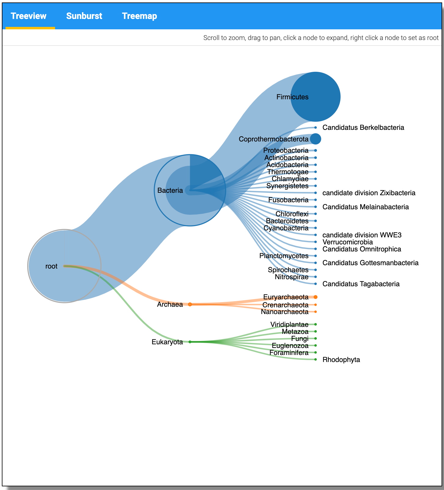
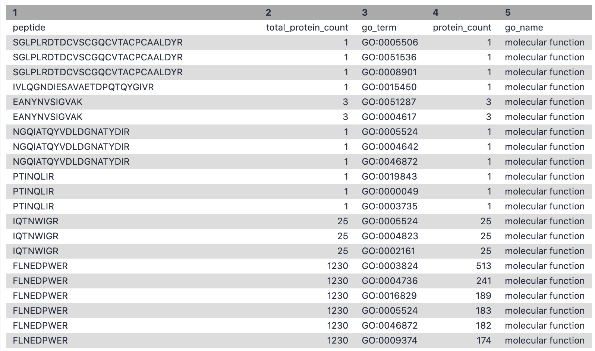

# Introduction
{:.no_toc}

Metaproteomics  involves characterization of community level expression of microbial proteins from an environmental
or clinical sample. Metaproteomics data   is primarily used to determine the functional status of the microbiome under study along with its taxonomic composition. The [Galaxy-P](http://galaxyp.org/)  team published a software suite named metaQuantome { % cite Easterly2019 %} to enable quantitative and statistical analysis and visualization of functional,
taxonomic expression as well as functional and taxonomy interaction. metaQuantome leverages peptide level quantitative information to analyze the taxonomic, functional expression within the microbial community in different conditions.

{: width="75%"}

metaQuantome offers differential abundance analysis, principal components analysis, and clustered heat map visualizations,
across multiple experimental conditions. metaQuantome, an open source tool, is available via command line and also
accessible via Galaxy platform for reproducible analysis. As a first step for metaQuantome analysis, metaproteomics
data needs to be made compatible for subsequent analysis. With this in mind, we have developed a metaQuantome data
generation workflow tutorial that will help users generate inputs for metaQuantome analysis.

{: width="75%"}

To demonstrate the use of the data creation workflow, we have used a thermophilic biogas reactor dataset wherein municipal
food waste and manure is digested to generate methane gas. After one round in the reactor, the microbial community was
simplified and enriched via serial dilution. This inoculum was then transferred to a solution of cellulose from Norwegian
Spruce and incubated at 65°C. Triplicate samples were taken in a time series from 0 to 43 hours after inoculation and mass
spectrometry data was acquired on a Q-Exactive (Thermo) mass spectrometer. For this training, we have chosen two time points-8 hour and 33 hour.

{: width="75%"}

> ### Agenda
>
> In this tutorial, we will cover:
>
> 1. TOC
> {:toc}
>
{: .agenda}

# **Pretreatments**

The first step in a tutorial is to get the data from the zenodo link provided and making sure that it is in the correct format.

## *Get data*

> ###  Hands-on: Data upload
>
> 1. Create a new history for this tutorial and give it a meaningful name
>
>    
>    
>
> 2. Import the files: 6 MZML files, a Protein FASTA file, and an Experimental Design file from [Zenodo]({{ page.zenodo_link }})
>    or from the shared data library (`GTN - Material` -> `{{ page.topic_name }}` -> `{{ page.title }}`)
>
>    ```
>    https://zenodo.org/record/4037137/files/ExperimentalDesign.tsv
>    https://zenodo.org/record/4037137/files/ProteinDB_cRAP.fasta
>    https://zenodo.org/record/4037137/files/T2_A1.mzml
>    https://zenodo.org/record/4037137/files/T2_B1.mzml
>    https://zenodo.org/record/4037137/files/T7A_1.mzml
>    https://zenodo.org/record/4037137/files/T7B_1.mzml
>    ```
>    
>    
>
>
> 3. Rename the datasets (If needed)
> 4. Check that the datatype ( Make sure they are in the correct formats).
> 6 MZML files (format=`mzml`, a Protein FASTA file (format=`fasta`), and an Experimental Design file (format=`tabular`)
>
>    
>
> 5. Add to each database a tag corresponding to the name of the input data (optional).
> 6. Build a **Dataset list** for the four mzml files.
>    - Click the **Operations on multiple datasets** check box at the top of the history panel
>
>    
>
> 7. Rename the dataset collection as `MZML dataset collection`.
>
{: .hands_on}

We have a choice to run all these steps using a single workflow, then discuss each step and the results in more detail.

> ###  Hands-on: Pretreatments
>
> 1. **Import the workflow** into Galaxy
>    - Copy the URL (e.g. via right-click) of [this workflow]({{ site.baseurl }}{{ page.dir }}workflows/main_workflow.ga) or download it to your computer.
>    - Import the workflow into Galaxy
>
>    
>
> 2. Run **Workflow**  using the following parameters:
>    - *"Send results to a new history"*: `No`
>    -  *"1: Input Dataset collection"*: `MZML dataset collection`
>    -  *"2: Experimental Design"*: `Experimental Design.tsv`
>    -  *"3: FASTA_db"*: `ProteinDB_cRAP.fasta`
>    -  *"4: In FlashLFQ - control condition for Bayesian protein fold-change analysis"*: `S1`
>
>    
>
{: .hands_on}


# **Match peptide sequences**

For this, the sequence database-searching program called [SearchGUI](https://compomics.github.io/projects/searchgui.html) will be used.
The created dataset collection of the four *MZML files* in the history has to be first converted to MGF to be used as the MS/MS input.


### *Convert mzml to MGF with msconvert*

msconvert is used in order to convert the input file type, a mzml data collection, to a mgf file type.
The mgf file type can then be used as the Input Peak Lists when running SearchGUI.

> ###  Hands-on: mzml to MGF
>
> 1.  with the following parameters:
>    -  *"Input unrefined MS data"*: `MZML dataset collection`
>    - *"Do you agree to the vendor licenses?"*: `Yes`
>    - *"Output Type"*: `mgf`
>    - In *"Data Processing Filters"*:
>        - *"Apply peak picking?"*: `Yes`
>        - *"Apply m/z refinement with identification data?"*: `No`
>        - *"(Re-)calculate charge states?"*: `No`
>        - *"Filter m/z Window"*: `No`
>        - *"Filter out ETD precursor peaks?"*: `No`
>        - *"De-noise MS2 with moving window filter"*: `No`
>    - In *"Scan Inclusion/Exclusion Filters"*:
>        - *"Filter MS Levels"*: `No`
>    - In *"General Options"*:
>        - *"Sum adjacent scans"*: `No`
>        - *"Output multiple runs per file"*: `No`
>
>
>    > ###  Comment
>    > This is a critical step for running this workflow.
>    {: .comment}
>
{: .hands_on}


> ###  Questions
>
> 1. Why do we need to convert the files to MGF?
> 2. Can we use any other input format?
>
> > ###  Solution
> >
> > 1. The files have to be converted to MGF for this workflow because we use SearchGUI as the searching tool and it can only read MGF files.
> > 2. Yes, we can also use RAW files as input and just convert RAW files to MGF.
> >
> {: .solution}
>
{: .question}

##  *Search GUI*
SearchGUI is a tool that searches sequence databases on any number of MGF files. In this case, the previously made collection of three MGF files (entitles MGF files) will be used as the MS/MS input. This tool will produce an output file, called a SearchGUI archive file. This file will serve as in input for the next tool used, PeptideShaker.
>
> ###  Hands-on: Search sequence databases
> 1.  with the following parameters:
>    -  *"Protein Database"*: `ProteinDB_cRAP.fasta`
>    -  *"Input Peak Lists (mgf)"*: `output` (output of **msconvert** )
>    - In *"Search Engine Options"*:
>        - *"DB-Search Engines"*: `X!tandem`
>    - In *"Protein Digestion Options"*:
>        - *"Digestion"*: `Trypsin`
>        - *"Maximum Missed Cleavages"*: `2`
>    - In *"Precursor Options"*:
>        - *"Fragment Tolerance"*: `0.2`
>        - *"Maximum Charge"*: `6`
>    - In *"Protein Modification Options"*:
>        - *"Fixed Modifications"*: `Carbamidomethylation of C`
>        - *"Variable Modifications"*: `Oxidation of M, Acetylation of Protein N-term`
>    - In *"Andvanced Options"*:
>        - *"SearchGUI Options"*: `Default`
>        - *"X!Tandem Options"*: `Advanced`
>            - *"X!Tandem: Quick Acetyl"*: `No`
>            - *"X!Tandem: Quick Pyrolidone"*: `No`
>            - *"X!Tandem: Maximum Valid Expectation Value"*: `100.0`
>            - *"X!Tandem peptide model refinement"*: `Don't refine`
>        - *"OMSSA Options"*: `Default`
>        - *"MSGF Options"*: `Default`
>        - *"MS Amanda Options"*: `Default`
>        - *"TIDE Options"*: `Default`
>        - *"MyriMatch Options"*: `Default`
>        - *"Comet Options"*: `Default`
>        - *"DirectTag Options"*: `Default`
>        - *"Novor Options"*: `Default`
>
>
>
>    > ###  Comment
>    >
>    >  Note that sequence databases used for metaproteomics are usually much larger than the excerpt used in this tutorial. When using large databases, the peptide identification step can take much more time for computation. In metaproteomics, choosing the optimal database is a crucial step of your workflow, for further reading see [Timmins-Schiffman et al (2017)](https://www.ncbi.nlm.nih.gov/pubmed/27824341). To learn more about database construction in general, like integrating contaminant databases or using a decoy strategy for FDR searching, please consult our tutorial on [Database Handling]({{site.baseurl}}/topics/proteomics/tutorials/database-handling/tutorial.html).
>    {: .comment}
>
{: .hands_on}


> ###  Questions
>
> 1. How many Search Engines can be used?
> 2. Can the parameters be manipulated?
>
> > ###  Solution
> >
> > 1. There are 8 database search algorithms, you can use as many as you want. Ideally, 4 database algorithms gives the best results.
> > 2. Yes, The parameters can be manipulated according to the experimental design of the datasets.
> >
> {: .solution}
>
{: .question}

##  *Peptide Shaker*

[PeptideShaker](https://compomics.github.io/projects/peptide-shaker.html) is a post-processing software tool that processes data from the SearchGUI software tool. PeptideShaker is a search engine for interpretation of proteomics identification results from multiple search engines, currently supporting X!Tandem, MS-GF+, MS Amanda, OMSSA, MyriMatch, Comet, Tide, Mascot, Andromeda and mzIdentML. More specifically, PeptideShaker processes data from  the SearchGUI tool through the organization of Peptide-Spectral Matches (PSMs) generated. In addition to organization, it provides an assessment of confidence of the data and generates outputs that can be visualized by users to interpret the results.
>
> ###  Hands-on: Interpretation of SearchGUI
> 1.  with the following parameters:
>    -  *"Compressed SearchGUI results"*: `searchgui_results` (output of **Search GUI** )
>    - *"Specify Advanced PeptideShaker Processing Options"*: `Advanced Processing Options`
>        - *"The PTM probabilistic score to use for PTM localization"*: `A-score`
>    - *"Specify Advanced Filtering Options"*: `Advanced Filtering Options`
>        - *"Maximum Peptide Length"*: `60`
>    - *"Specify Contact Information for mzIdendML"*: `GalaxyP Project contact (Not suitable for PRIDE submission)`
>    - In *"Exporting options"*:
>        - *"Creates a mzIdentML file"*: `Yes`
>        - *"Compress results into a single zip file"*: `No`
>        - *"Reports to be generated"*: `PSM Report, Peptide Report, Protein Report, Certificate of Analysis,`
>
>
>
>    > ###  Comment
>    >
>    >  There are a number of choices for different data files that can be generated using
 PeptideShaker. A compressed file can be made containing all information needed to view the
results in the standalone PeptideShaker viewer. A `mzidentML` file can be created that contains
all peptide sequence matching information and can be utilized by compatible downstream
software. Other outputs are focused on the inferred proteins identified from the PSMs, as well
as phosphorylation reports, relevant if a phosphoproteomics experiment has been undertaken.
More detailed information on peptide inference using SearchGUI and PeptideShaker can be found in
our tutorial on [Peptide and Protein ID]({{site.baseurl}}/topics/proteomics/tutorials/protein-id-sg-ps/tutorial.html).
>    {: .comment}
>
{: .hands_on}


##  *Removing Contaminants*

> ###  Hands-on: Remove contaminants from PSM report
> This Select tool is used to remove all the contaminants from the Peptide Spectral Match (PSM) search results.
>
> 1.  with the following parameters:
>    -  *"Select lines from"*: `output_psm` (PSM report output of **Peptide Shaker** )
>    - *"that"*: `NOT Matching`
>    - *"the pattern"*: `con_`
>
> 2. Rename  to output file to `PSM_Report_no_contaminants`
>
>    
{: .hands_on}

> ###  Hands-on: Removing contaminants from Peptide report
>
>
> 1.  with the following parameters:
>    -  *"Select lines from"*: `output_peptides` (Peptide Report output of **Peptide Shaker** )
>    - *"that"*: `NOT Matching`
>    - *"the pattern"*: `con_`
>
> 2. Rename  the output file to `Peptide_Report_no_contaminants`
>
>
>    > ###  Comment
>    >
>    > In Proteomics, contamination is generally detected as peaks in spectra that did not originate
from the samples and can be introduced in the sample from a variety of environmental sources or human error. Identification of these
contaminants is critical to enable their removal before data analysis, mainly, to maintain the validity of conclusions
drawn from statistical analyses. Thus, this selection tool helps us remove the contaminants that were identified in the spectral data.
>    {: .comment}
>
{: .hands_on}

> ###  Questions
>
> 1. Why is removing contaminants important?
>
> > ###  Solution
> >
> > 1. Ideally, we would like to remove known contaminants from our samples just to maintain discovering novel proteoforms in our sample.
> >
> {: .solution}
>
{: .question}


## *Removing file extensions for Quantification*
This is a data manipulation step to make the data compatible with other downstream processing tools. The Replace text tool replaces the .mgf extension from the PSM report so that it can be used as an input for FlashLFQ.

> ###  Hands-on: Removing file extensions
>
>
> 1.  with the following parameters:
>    -  *"File to process"*: `PSM_Report_no_contaminants` (output of **Select** )
>    - In *"Replacement"*:
>        -  *"Insert Replacement"*
>            - *"in column"*: `Column: 10`
>            - *"Find pattern"*: `.mzml.mgf`
> 2. Rename Input_for_FlashLFQ.
>
>
>
>    > ###  Comment
>    >
>    > Replace Text searches given columns and finds and replaces patterns provided by the user.
This tool is removing the extensions (.raw,.mzml,.mgf) in the spectral file column provided by the PeptideShaker tool. This step is critical for FlashLFQ to work.
>    {: .comment}
>
{: .hands_on}

## *Extracting Peptide list*

> ###  Hands-on: Selecting peptide list
This step selects the peptide column from the Select output ( where we have removed the contaminants)
>
> 1.  with the following parameters:
>    - *"Cut columns"*: `c6`
>    -  *"From"*: `Peptide_Report_no_contaminants` (output of **Select** )
>
>2. Rename file as peptide_list.
{: .hands_on}

# **Peptide Quantification**

In this tutorial, we are using FlashLFQ as the quantitation tool. The user can choose to work with other quantitation tools, e.g. moFF and MaxQuant are available in Galaxy.

### *FlashLFQ*
[FlashLFQ](https://github.com/smith-chem-wisc/FlashLFQ) can quantify MS peaks in order to find the abundances of peptides. FlashLFQ is a fast label-free quantification algorithm. Additionally, the abundances of peptides within the sample can be compared between samples as further analysis beyond this workflow.
>
> ###  Hands-on: Quantification
>
> 1.  with the following parameters:
>    -  *"identification file"*: `Input_for_FlashLFQ` (output of **Replace Text** )
>    -  *"spectrum files"*: `MZML dataset collection`
>    - *"match between runs"*: `Yes`
>    - *"Use experimental design for normalization or protein fold-change analysis"*: `Yes`
>        -  *"ExperimentalDesign.tsv"*: `ExperimentalDesign.tsv`
>        - *"Perform Bayesian protein fold-change analysis"*: `Yes`
>            - *"control condition for Bayesian protein fold-change analysis"*: `S1`
>
>
>    > ###  Comment
>    >
>    > [FlashLFQ](https://github.com/smith-chem-wisc/FlashLFQ) is a label-free quantification tool for mass-spectrometry proteomics. It supports both .mzML and Thermo .raw file formats.
>    > To run FlashLFQ on Galaxy, there are three main input files:
>    > - PSM report from Peptide Shaker (`Input_for_FlashLFQ`)
>    > - MZML/ RAW spectrum files (`MZML dataset collection`)
>    > - Experimental Design File ( `ExperimentalDesign.tsv`)
>    >   The Experimental Design file should be a tabular file with a "File", "Condition", "Sample", "Fraction", and "Replicate" column. The "File" column should match your mzml spectrum file name.
>    {: .comment}
>
{: .hands_on}

> ###  Questions
>
> 1. Can FlashLFQ be used with fractionated data?
>
> 2. Does FlashLFQ perform peptide and protein level quantification?
>
> > ###  Solution
> >
> > 1. Yes, FlashLFQ can be used with fractionated datasets and multiple conditions
> >
> > 2. FlashLFQ performed both peptide level and protein level quantification. For protein level, FlashLFQ used Bayesian Fold change analysis.
> >
> {: .solution}
>
{: .question}

## *Filtering peptides that are less than 50 amino acids*

> ###  Hands-on: Extracting peptides<50 amino acids
> This is a data manipulation tool. Here, we select those peptides with less than 50 amino acids in length.
>
> 1.  with the following parameters:
>    -  *"Filter"*: `peptide_list` (output of **Cut** )
>    - *"With following condition"*: `len(c1)<=50`
>    - *"Number of header lines to skip"*: `1`
>
> 2. Rename as Unipept_peptide_list.
>
>    > ###  Comment
>    > Unipept fails with peptides more than 50 amino acids in length, thus we decided to work with peptides that are less than 50 amino acids.
>    >
>    {: .comment}
>
{: .hands_on}


## *Manipulating text for metaQuantome*

> ###  Hands-on: Text manipulation for metaQuantome intensity file
> Regex Find And Replace goes line by line through the input file and will remove any patterns specified by the user and replace them with expressions also specified by the user. In this case, Regex Find And Replace is being used on a FlashLFQ output file and manipulating the header to make it compatible with metaQuantome along with completely removing the N-terminus and C-terminus tag in the peptide sequences.
>
> 1.  with the following parameters:
>    -  *"Select lines from"*: `QuantifiedPeptides` (output of **FlashLFQ** )
>    - In *"Check"*:
>        -  *"Insert Check"*
>            - *"Find Regex"*: `Base Sequence`
>            - *"Replacement"*: `peptide`
>        -  *"Insert Check"*
>            - *"Find Regex"*: `Intensity_`
>        -  *"Insert Check"*
>            - *”Find Regex”*: `NH2-`
>            - *”Replacement”*: `leave it blank`
>        -  *"Insert Check"*
>            - *”Find Regex”*: `-COOH`
>            - *”Replacement”*: `leave it blank`
>
> 2. Rename the file as `Intensity`
>
{: .hands_on}

# **Functional and Taxonomy annotation**


## *Unipept* for taxonomy annotation

Unipept  is used again to match tryptic peptides and find the taxonomy and lowest common ancestor of each peptide.

> ###  Hands-on: Taxonomy annotation
>
> 1.  with the following parameters:
>    - *"Unipept application"*: `pept2lca: lowest common ancestor`
>        - *"Equate isoleucine and leucine"*: `Yes`
>        - *"allfields"*: `Yes`
>    - *"Peptides input format"*: `tabular`
>        -  *"Tabular Input Containing Peptide column"*: `Unipept_peptide_list` (output of **Filter** )
>        - *"Select column with peptides"*: `c1`
>    - *"Choose outputs"*: `Select all`
>
>
>
>    > ###  Comment
>    >
>    > There are two Unipept in this workflow, One for taxonomy and other for function.
>    {: .comment}
>
{: .hands_on}


{: width="75%"}

> ###  Questions
>
> 1. Can any other taxonomy and functional tool be used apart from Unipept?
>
> > ###  Solution
> >
> > 1. Yes, any tool can be used for taxonomy and functional output. Please make sure the output has the information that includes peptide,taxon_name, taxon_id, genus, species etc.
> >
> {: .solution}
>
{: .question}

The JSON output from the Taxonomy can be visualized using the visualize option and Select the Unipept Taxonomyviewer.

{: width="30%"}

{: width="30%"}

{: width="75%"}


## *Unipept* for Functional annotation

Unipept is used to match tryptic peptides and find the taxonomy and Functional annotation of the peptides. Unipept is used to match sample tryptic peptides to proteins using a fast-matching algorithm. Although Unipept can be accessed and used through the web page, the use of Unipept on Galaxy allows the production of output datasets including the peptide information to be used in sequential steps. Unipept requires a list containing the peptide sequences which was generated by Query Tabular.

> ###  Hands-on: Functional annotation
>
> 1.  with the following parameters:
>    - *"Unipept application"*: `peptinfo: Tryptic peptides and associated EC and GO terms and lowest common ancestor taxonomy`
>        - *"Equate isoleucine and leucine"*: `Yes`
>        - *"retrieve extra information"*: `Yes`
>        - *"group responses by GO namespace (biological process, molecular function, cellular component)"*: `Yes`
>        - *"allfields"*: `Yes`
>    - *"Peptides input format"*: `tabular`
>        -  *"Tabular Input Containing Peptide column"*: `Unipept_peptide_list` (output of **Filter** )
>        - *"Select column with peptides"*: `c1`
>    - *"Choose outputs"*: `Select all`
>
>
>    > ###  Comment
>    >
>    > There are two Unipept in this workflow, One for taxonomy and other for function. Please select all the output options from Unipept.
>    {: .comment}
>
The JSON output from the Taxonomy can be visualized using the visualize option and Select the Unipept Taxonomyviewer.
>
>
{: .hands_on}

## *Extracting EC values*

> ###  Hands-on: Extract EC numbers
The cut tool cuts out specific columns from the dataset. In this case, the cut tool is being used to extract columns 1 (peptide) and 3 (EC number) from the dataset peptinfo EC.tsv output. This is a manipulation tool for metaQuantome's convenience.
>
> 1.  with the following parameters:
>    - *"Cut columns"*: `c1,c3`
>    -  *"From"*: `output_ec_tsv` (output of **Unipept** )
> 2. Rename EC_table.
{: .hands_on}


## *Filtering confident peptides*

Query Tabular is a tool that can load tabular data into a SQLite database. This step precedes UniPept, as a list containing the peptide sequences must be generated. In this step a list of gene ontology (GO) terms is being generated.

> ###  Hands-on: Filtering confident peptides
>
> 1.  with the following parameters:
>    - In *"Database Table"*:
>        -  *"Insert Database Table"*
>            -  *"Tabular Dataset for Table"*: `output_go_tsv` (output of **Unipept** )
>            - In *"Table Options"*:
>                - *"Specify Name for Table"*: `Goterm`
>                - *"Specify Column Names (comma-separated list)"*: `peptide,total_protein_count,go_term,protein_count,go_name,go_funct`
>    - *"SQL Query to generate tabular output"*:
```
SELECT Goterm.*
FROM Goterm
WHERE ((1.0*Goterm.protein_count)/(1.0*Goterm.total_protein_count)) >= 0.05
```
>    - *"include query result column headers"*: `Yes`
>
> 2. Rename as Unipept_Function.
>
>    > ###  Comment
>    >
>    > In the Unipept API output, the threshold is set to 0.5% of the overall number of peptides unambiguously assigned to a taxon at a particular taxonomic rank level. Here in the Galaxy platform, we are using Query tabular to perform this filtering.
>    {: .comment}
>
{: .hands_on}


## *Removing Hashtag from output*

This step is to remove the hashtag from the Peptide header in the Unipept output.

> ###  Hands-on: Remove # from peptide header
> 1.  with the following parameters:
>    -  *"File to process"*: `Unipept_Function` (output of **Unipept** )
>    - In *"Replacement"*:
>        -  *"Insert Replacement"*
>            - *"Find pattern"*: `#peptide`
>            - *"Replace with:"*: `peptide`
>
> 2. Rename file as All_functions
{: .hands_on}


## *Filter* - EC values

We are using this Query tabular to rename the output that we obtained from the Cut column tool.

> ###  Hands-on: Extracting EC for metaQuantome
>
> 1.  with the following parameters:
>    - In *"Database Table"*:
>        -  *"Insert Database Table"*
>            -  *"Tabular Dataset for Table"*: `EC_table` (output of **Cut** )
>            - In *"Table Options"*:
>                - *"Specify Name for Table"*: `ec`
>                - *"Specify Column Names (comma-separated list)"*: `peptide,go_ec`
>    - *"SQL Query to generate tabular output"*:
`SELECT *
FROM ec`
>    - *"include query result column headers"*: `Yes`
>
> 2. Rename file as go_ec
{: .hands_on}


## *Filter* - Biological Functions

The filter tool allows restriction of the dataset using simple conditional statements. This step is used to filter out the GO terms with biological processes and the corresponding number of peptides associated with these terms.


> ###  Hands-on: Extracting biological processes for metaQuantome
>
> 1.  with the following parameters:
>    -  *"Filter"*: `Unipept_Function` (output of **Query Tabular** )
>    - *"With following condition"*: `c5=='biological process'`
>    - *"Number of header lines to skip"*: `1`
>
> 2. Rename file as `go_bp`
{: .hands_on}


{: width="60%"}

## *Filter* - Cellular components

This step is used to filter out the GO terms with cellular components and the corresponding number of peptides associated with these terms.

> ###  Hands-on: Extracting cellular component for metaQuantome
>
> 1.  with the following parameters:
>    -  *"Filter"*: `Unipept_Function` (output of **Query Tabular** )
>    - *"With following condition"*: `c5=='cellular component'`
>    - *"Number of header lines to skip"*: `1`
>
> 2. Rename file as `go_cc`
{: .hands_on}


{: width="60%"}

## *Filter* - Molecular Function

This step is used to filter out the GO terms with molecular function and the corresponding number of peptides associated with these terms.

> ###  Hands-on: Extracting molecular function for metaQuantome
>
> 1.  with the following parameters:
>    -  *"Filter"*: `Unipept_Function` (output of **Query Tabular** )
>    - *"With following condition"*: `c5=='molecular function'`
>    - *"Number of header lines to skip"*: `1`
> 2. Rename file as `go_mf`
{: .hands_on}


{: width="60%"}

# **Conclusion**
{:.no_toc}

This completes the walkthrough of the metaQuantome data creation workflow. This tutorial is a guide to have datasets that are metaQuantome ready/compatible and can be used for metaproteomics research. We have incorporated only two conditions in this workflow but users can use as many as they want. Researchers can use this workflow with their data also, please note that the tool parameters and the workflow will be needed to be modified accordingly.

This workflow was developed by the Galaxy-P team at the University of Minnesota. For more information about Galaxy-P or our ongoing work, please visit us at [galaxyp.org](https://galaxyp.org)


{: .comment}
