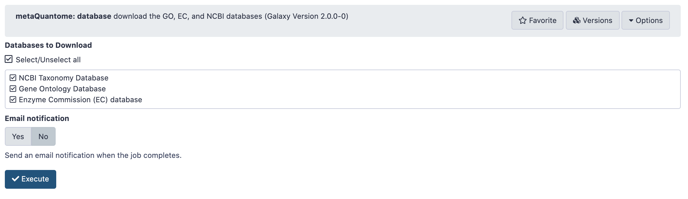

# Introduction
{:.no_toc}

The Galaxy-P  team published a software suite named metaQuantome { % cite Easterly2019 %} to enable quantitative and statistical analysis and visualization of functional, taxonomic expression as well as functional and taxonomy interaction. metaQuantome leverages peptide level quantitative information to analyze the taxonomic, functional expression within the microbial community in different conditions

In this tutorial, we will learn specifically about the metaQuantome Function workflow. To demonstrate the use of the metaQuantome Function workflow, we have used a thermophilic biogas reactor dataset wherein municipal food waste and manure is digested to generate methane gas. After one round in the reactor, the microbial community was simplified and enriched via serial dilution. This inoculum was then transferred to a solution of cellulose from Norwegian Spruce and incubated at 65°C. Triplicate samples were taken in a time series from 0 to 43 hours after inoculation and mass spectrometry data was acquired on a Q-Exactive (Thermo) mass spectrometer. For this training, we have chosen three time points-8 hour, 18 hour and 33 hour. 

{: width="55%"}


> ### Agenda
>
> In this tutorial, we will cover:
>
> 1. TOC
> {:toc}
>
{: .agenda}


# **Pretreatments**

The first step in a tutorial is to get the data from the zenodo link provided and making sure that it is in the correct format.


## *Get data*

> ###  Hands-on: Data upload
>
> 1. Create a new history for this tutorial and give it a meaningful name
>
>    
>    
>
> 2. Import the files: a Functional File, an Intensity file from [Zenodo]({{ page.zenodo_link }})
>    or from the shared data library (`GTN - Material` -> `{{ page.topic_name }}` -> `{{ page.title }}`)
>
>    ```
>
>    ```
>    
>    
>
>
> 3. Rename the datasets (If needed)
> 4. Check that the datatype ( Make sure they are in the correct formats).
>  Functional File (format=`tabular`), a Intensity file (format=`tabular`)
>
>    
>
> 5. Add to each database a tag corresponding to the name of the input data (optional).
>
{: .hands_on}

# **Download metaQuantome Databases**

> ###  Hands-on: Run metaQuantome databases
>
> 1.  with the following parameters:
>    -  *"Databases to Download"*: `Select All` (NCBI Taxonomy Database, Gene Ontology Database and Enzyme Commission (EC) database)
>
> 2. Execute
>
>    > ###  Comment
>    >
>    > metaQuantome uses freely available bioinformatic databases to expand your set of direct annotations. 
>    > 
>    > 
>    > The databases are:
>    > 
>    > 1. NCBI taxonomy database. consists of a list of all currently identified taxa and the relationships between them.
>    > 
>    > 2. Gene Ontology (GO) term database. metaQuantome uses the go-basic.obo file and the metagenomics slim GO (subset of the full GO). More details are 
>    > available at http://geneontology.org/docs/download-ontology/
>    > 
>    > 3. ENZYME database with Enzyme Classification (EC) numbers. This database classifies enzymes and organizes the relationships between them.
>    > 
>    {: .comment}
>
{: .hands_on}


{: width="55%"}

> ###  Questions
>
> 1. Why is it necessary to download metaQuanome databases?
> 2. Can these databases be downloaded from other sources?
>
> > ###  Solution
> >
> > 1. metaQuantome databases help the metaQuantome:expand tool to co-relate information your have provided in your input files according to the GO term, taxa or EC databases and its relationship .
> > 2. For metaQuantome, we use freely available databases. This module downloads the most recent releases of the specified databases and stores them in a single file, which can then be accessed by the rest of the metaQuantome modules. For reference, the taxonomy database is the largest (~500 Mb), while the GO and EC databases are smaller: ~34 Mb and ~10Mb, respectively. Also, note that the databases will be stored in the history so that the date of download can be referenced later. Thus, the databases will not be modified, except for the NCBI database.
> >
> {: .solution}
>
{: .question}

# **Create metaQuantome sample file**

The create samples file module is used to generate the samples file input file for the metaQuantome workflow. This input file is used to specify the column names used for each experimental group. These column names are referenced when handling the input data and performing statistical analysis. 

> ###  Hands-on: Create an experimental Design file for sorting samples
>
> 1.  with the following parameters:
>    -  *"Sample file creation method"*: `Manually specify experimental conditions and samples`
>    - In *"Insert Samples"*:
>        - *"1.Samples"*: 
>            - *"Group Name"*: `T2`
>               - *"Column"*: `T2_A1,T2_B1`
>        - *"2.Samples"*: 
>            - *"Group Name"*: `T4`
>               - *"Column"*: `T4A_1,T4B_1`
>        - *"3.Samples"*: 
>            - *"Group Name"*: `T7`
>               - *"Column"*: `T7A_1,T7B_1`
>     
> 2. Execute

{: width="55%"}

# **Run metaQuantome**


## **metaQuantome: expand**

The expand module is the first analysis step in the metaQuantome analysis workflow, and can be run to analyze differently expressed functions in the samples.
In function mode, the following information is required apart from metaQuantome databases and samples file:
- the name of the peptide column in the functional annotation file (# peptide)
- the name of the functional annotation column in the functional annotation file.(# go_term)
- the name of the peptide column in the Intensity file (# peptide)

> ###  Hands-on: Run metaQuantome expand
>
> 1.  with the following parameters:
>    -  *"Database Archive File"*: `metaQuantome databases` (output of **metaQuantome: database** )
>    -  *"Samples file"*: `metaQuantome: create samples_file` (output of **metaQuantome: create samples file** )
>    - *"Mode"*: `Functional analysis`
>        -  *"Functional file"*: `Function File` (Input dataset)
>        - *"Functional file: peptide column name"*: `peptide`
>        - *"Ontology"*: `Gene Ontology (GO terms)`
>        - *"Functional column name"*: `go_term`
>    -  *"Intensity file"*: `Intensity File` (Input dataset)
>        - *"Intensity file: peptide column name"*: `peptide`
> 2.Execute
>
>    > ###  Comment
>    >The structure of the output file depends on the analysis mode and the experimental design, but the columns generally look like this, with one row for each term:
>    > 
| term id | info about term. (one or more columns) | mean term intensity (by sample group)            | term intensity (by sample)                                                      | number of unique peptides (by sample) | number of sample children in each sample |
|---------|----------------------------------------|--------------------------------------------------|---------------------------------------------------------------------------------|---------------------------------------|------------------------------------------|
| term1   | name, rank, etc.                       | note that this is the log2 of the mean intensity | this is the log2 of term intensity in each sample. Missing data is coded as NA. | integer. 0 is coded as NA             | integer. 0 is coded as NA                |
|         |                                        |                                                  |                                                                                 |                                       |                                          |
>    {: .comment}
>
{: .hands_on}


##  **metaQuantome: filter**

> ###  Hands-on: Task description
>
> 1.  with the following parameters:
>    - *"Mode"*: `Functional analysis`
>        - *"Ontology"*: `Gene Ontology (GO terms)`
>    -  *"Samples file"*: `samples_file` (output of **metaQuantome: create samples file** )
>    -  *"metaquantome expand file"*: `outfile` (output of **metaQuantome: expand** )
>    - *"min_peptides"*: `1`
>    - *"min_pep_nsamp"*: `1`
>    - *"min_children_non_leaf"*: `2`
>    - *"min_child_nsamp"*: `1`
>    - *"qthreshold"*: `2`
>
>    ***TODO***: *Check parameter descriptions*
>
>    ***TODO***: *Consider adding a comment or tip box*
>
>    > ###  Comment
>    >
>    > A comment about the tool or something else. This box can also be in the main text
>    {: .comment}
>
{: .hands_on}

***TODO***: *Consider adding a question to test the learners understanding of the previous exercise*

> ###  Questions
>
> 1. Question1?
> 2. Question2?
>
> > ###  Solution
> >
> > 1. Answer for question1
> > 2. Answer for question2
> >
> {: .solution}
>
{: .question}

##  **metaQuantome: stat**

> ###  Hands-on: Task description
>
> 1.  with the following parameters:
>    -  *"Samples file"*: `samples_file` (output of **metaQuantome: create samples file** )
>    -  *"metaquantome expanded or filtered file"*: `outfile` (output of **metaQuantome: filter** )
>    - *"Mode"*: `Functional analysis`
>        - *"Ontology"*: `Gene Ontology (GO terms)`
>    - *"Name of the control sample group of control (used as denominator for fold change evaluation)."*: `T2`
>    - *"Statistical test to perform"*: `standard t-test (parametric)`
>    - *"Perform paired tests"*: `Yes`
>
>    ***TODO***: *Check parameter descriptions*
>
>    ***TODO***: *Consider adding a comment or tip box*
>
>    > ###  Comment
>    >
>    > A comment about the tool or something else. This box can also be in the main text
>    {: .comment}
>
{: .hands_on}

***TODO***: *Consider adding a question to test the learners understanding of the previous exercise*

> ###  Questions
>
> 1. Question1?
> 2. Question2?
>
> > ###  Solution
> >
> > 1. Answer for question1
> > 2. Answer for question2
> >
> {: .solution}
>
{: .question}

## **metaQuantome: visualize**

> ###  Hands-on: Task description
>
> 1.  with the following parameters:
>    -  *"Tabular file from metaQuantome stats or metaQuantome filter"*: `outfile` (output of **metaQuantome: stat** )
>    -  *"Samples file"*: `outfile` (output of **metaQuantome: stat** )
>    - *"Mode"*: `Functional analysis`
>        - *"Plot type"*: `Bar Chart (bar)`
>            - *"Mean intensity column name"*: `T2_mean`
>            - *"GO category to restrict to"*: `Molecular Function`
>            - *"Color for the bar fill"*: `Orange`
>
>    ***TODO***: *Check parameter descriptions*
>
>    ***TODO***: *Consider adding a comment or tip box*
>
>    > ###  Comment
>    >
>    > A comment about the tool or something else. This box can also be in the main text
>    {: .comment}
>
{: .hands_on}

***TODO***: *Consider adding a question to test the learners understanding of the previous exercise*

> ###  Questions
>
> 1. Question1?
> 2. Question2?
>
> > ###  Solution
> >
> > 1. Answer for question1
> > 2. Answer for question2
> >
> {: .solution}
>
{: .question}

##  **metaQuantome: visualize**

> ###  Hands-on: Task description
>
> 1.  with the following parameters:
>    -  *"Tabular file from metaQuantome stats or metaQuantome filter"*: `outfile` (output of **metaQuantome: stat** )
>    -  *"Samples file"*: `samples_file` (output of **metaQuantome: create samples file** )
>    - *"Mode"*: `Functional analysis`
>        - *"Plot type"*: `Bar Chart (bar)`
>            - *"Mean intensity column name"*: `T4_mean`
>            - *"GO category to restrict to"*: `Molecular Function`
>            - *"Color for the bar fill"*: `Orange`
>
>    ***TODO***: *Check parameter descriptions*
>
>    ***TODO***: *Consider adding a comment or tip box*
>
>    > ###  Comment
>    >
>    > A comment about the tool or something else. This box can also be in the main text
>    {: .comment}
>
{: .hands_on}

***TODO***: *Consider adding a question to test the learners understanding of the previous exercise*

> ###  Questions
>
> 1. Question1?
> 2. Question2?
>
> > ###  Solution
> >
> > 1. Answer for question1
> > 2. Answer for question2
> >
> {: .solution}
>
{: .question}

## **metaQuantome: visualize**

> ###  Hands-on: Task description
>
> 1.  with the following parameters:
>    -  *"Tabular file from metaQuantome stats or metaQuantome filter"*: `outfile` (output of **metaQuantome: stat** )
>    -  *"Samples file"*: `samples_file` (output of **metaQuantome: create samples file** )
>    - *"Mode"*: `Functional analysis`
>        - *"Plot type"*: `Bar Chart (bar)`
>            - *"Mean intensity column name"*: `T7_mean`
>            - *"GO category to restrict to"*: `Molecular Function`
>            - *"Color for the bar fill"*: `Orange`
>
>    ***TODO***: *Check parameter descriptions*
>
>    ***TODO***: *Consider adding a comment or tip box*
>
>    > ###  Comment
>    >
>    > A comment about the tool or something else. This box can also be in the main text
>    {: .comment}
>
{: .hands_on}

***TODO***: *Consider adding a question to test the learners understanding of the previous exercise*

> ###  Questions
>
> 1. Question1?
> 2. Question2?
>
> > ###  Solution
> >
> > 1. Answer for question1
> > 2. Answer for question2
> >
> {: .solution}
>
{: .question}

## **metaQuantome: visualize**

> ###  Hands-on: Task description
>
> 1.  with the following parameters:
>    -  *"Tabular file from metaQuantome stats or metaQuantome filter"*: `outfile` (output of **metaQuantome: stat** )
>    -  *"Samples file"*: `samples_file` (output of **metaQuantome: create samples file** )
>    - *"Mode"*: `Functional analysis`
>        - *"Plot type"*: `Volcano Plot (volcano)`
>            - *"Name of the fold change column in the stat dataframe"*: `log2fc_T7_over_T2`
>            - *"Name of the Corrected p-value column in the stat dataframe"*: `corrected_p_T7_over_T2`
>            - *"Name of the annotation column"*: `id`
>
>    ***TODO***: *Check parameter descriptions*
>
>    ***TODO***: *Consider adding a comment or tip box*
>
>    > ###  Comment
>    >
>    > A comment about the tool or something else. This box can also be in the main text
>    {: .comment}
>
{: .hands_on}

***TODO***: *Consider adding a question to test the learners understanding of the previous exercise*

> ###  Questions
>
> 1. Question1?
> 2. Question2?
>
> > ###  Solution
> >
> > 1. Answer for question1
> > 2. Answer for question2
> >
> {: .solution}
>
{: .question}

## **metaQuantome: visualize**

> ###  Hands-on: Task description
>
> 1.  with the following parameters:
>    -  *"Tabular file from metaQuantome stats or metaQuantome filter"*: `outfile` (output of **metaQuantome: stat** )
>    -  *"Samples file"*: `samples_file` (output of **metaQuantome: create samples file** )
>    - *"Mode"*: `Functional analysis`
>        - *"Plot type"*: `Volcano Plot (volcano)`
>            - *"Name of the fold change column in the stat dataframe"*: `log2fc_T4_over_T2`
>            - *"Name of the Corrected p-value column in the stat dataframe"*: `corrected_p_T4_over_T2`
>            - *"Name of the annotation column"*: `id`
>
>    ***TODO***: *Check parameter descriptions*
>
>    ***TODO***: *Consider adding a comment or tip box*
>
>    > ###  Comment
>    >
>    > A comment about the tool or something else. This box can also be in the main text
>    {: .comment}
>
{: .hands_on}

***TODO***: *Consider adding a question to test the learners understanding of the previous exercise*

> ###  Questions
>
> 1. Question1?
> 2. Question2?
>
> > ###  Solution
> >
> > 1. Answer for question1
> > 2. Answer for question2
> >
> {: .solution}
>
{: .question}


## Re-arrange

To create the template, each step of the workflow had its own subsection.

***TODO***: *Re-arrange the generated subsections into sections or other subsections.
Consider merging some hands-on boxes to have a meaningful flow of the analyses*

# Conclusion
{:.no_toc}

Sum up the tutorial and the key takeaways here. We encourage adding an overview image of the
pipeline used.
