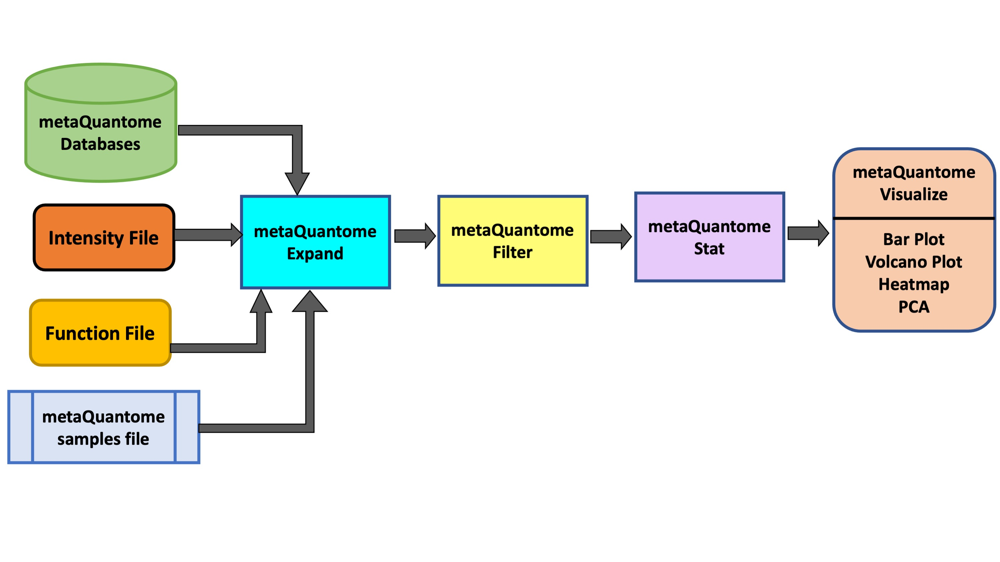
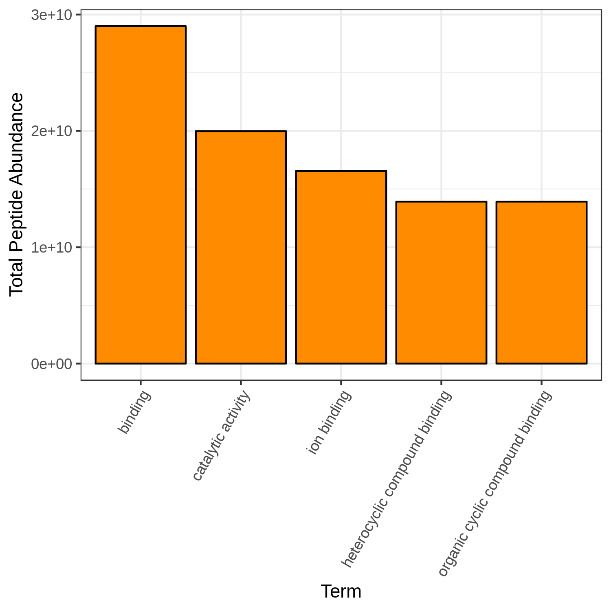
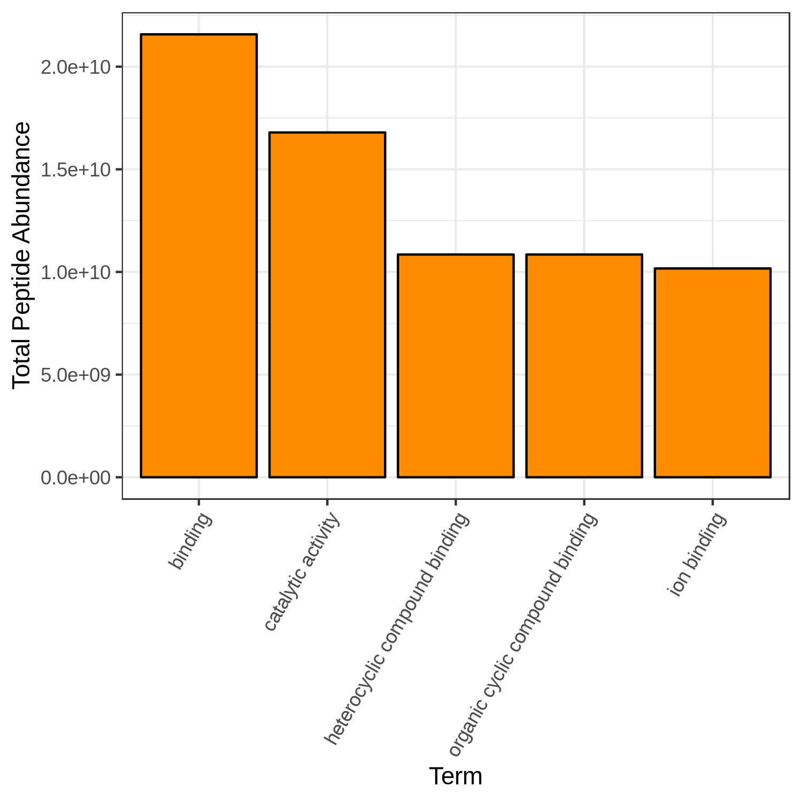
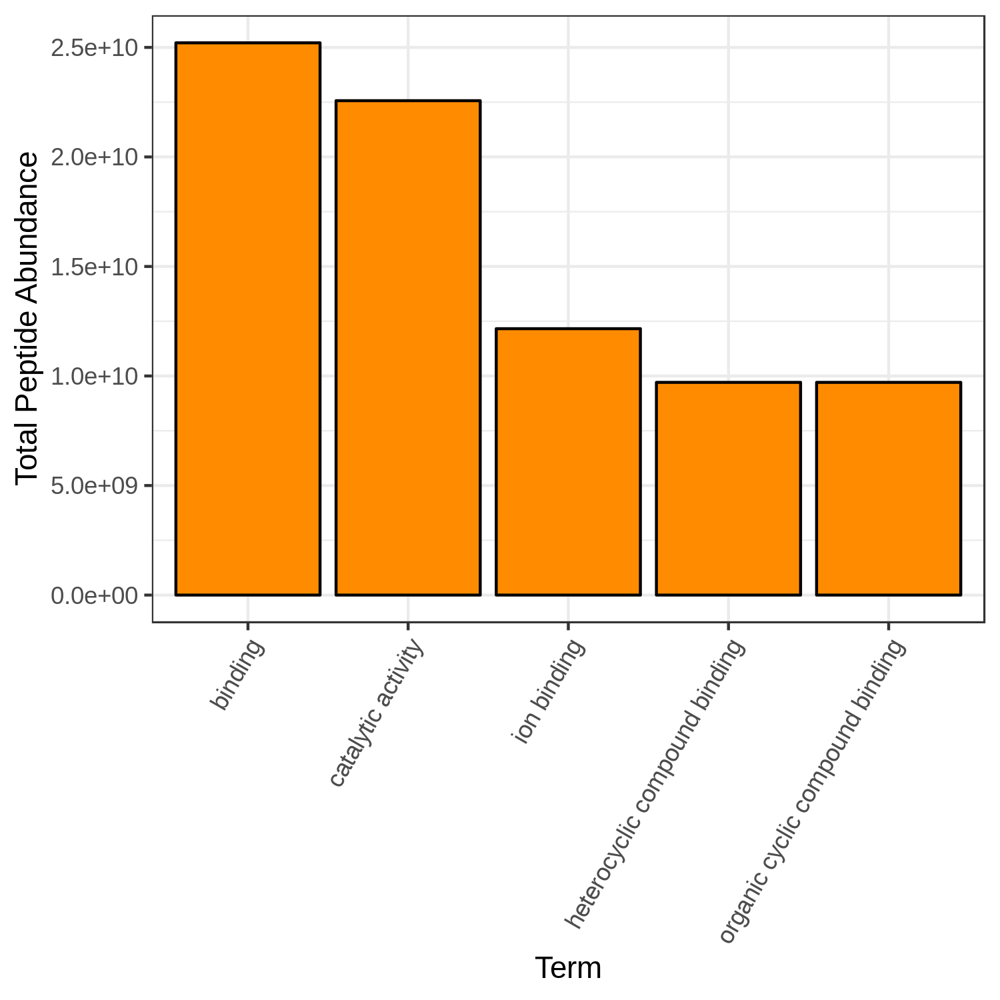
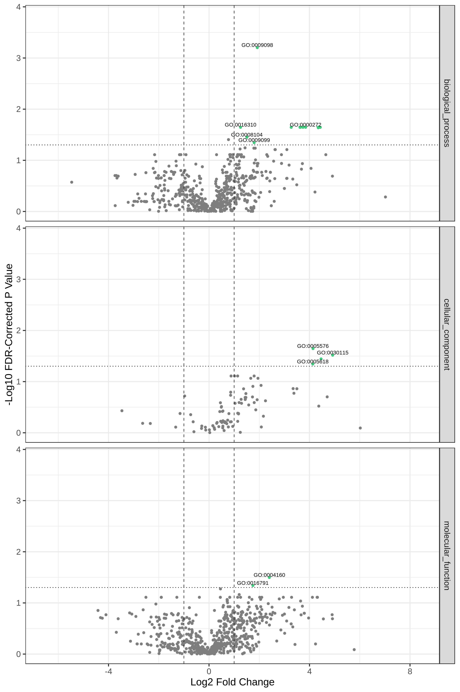
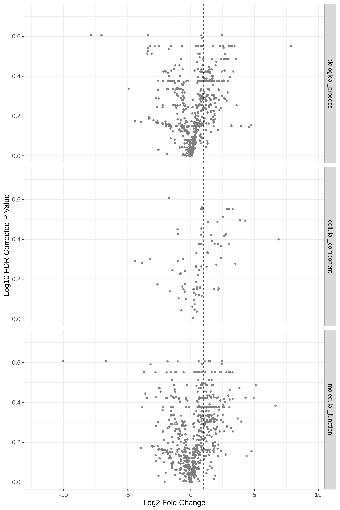

# Introduction


metaQuantome software suite  was developed by the  for quantitative and statistical analysis of metaproteomics data. For taxonomic and functional expression analysis within the microbial community, metaQuantome leverages peptide-level quantitative information to generate visual outputs for data interpretation. It also generates outputs that help in understanding the taxonomic contribution to a selected function as well as functions expressed by selected taxonomic group.

In this tutorial, we will learn specifically about the metaQuantome Function workflow. In particular, we will learn about how peptide-level quantitation and associated functional information can be used to generate bar plots (for functional information such as molecular function, cellular components and biological processes), volcano plots (to detect differentially expressed function) and heatmap cluster analysis. To demonstrate the use of this workflow, we have used a thermophilic biogas reactor dataset wherein municipal food waste and manure is digested to generate methane gas (). After one round in the reactor, the microbial community was simplified and enriched via serial dilution. This inoculum was then transferred to a solution of cellulose from Norwegian Spruce and incubated at 65°C. Triplicate samples were taken in a time series from 0 to 43 hours after inoculation and mass spectrometry data was acquired on a Q-Exactive (Thermo) mass spectrometer. For this training, we have chosen three time points (8 hours, 18 hours and 33 hours) from this dataset.

{: width="100%"}


> <agenda-title></agenda-title>
>
> In this tutorial, we will cover:
>
> 1. TOC
> {:toc}
>
{: .agenda}


# **Pretreatments**

The first step in this tutorial is to get the data from the Zenodo link provided and make sure that it is in the correct format.


## *Get data*

> <hands-on-title>Data upload</hands-on-title>
>
> 1. Create a new history for this tutorial and give it a meaningful name
>
>    
>    
>
> 2. Import the files from [Zenodo]({{ page.zenodo_link }}): a Functional File and an Intensity file.
>
>
>    ```
>    https://zenodo.org/record/4110725/files/Function-File.tabular
>    https://zenodo.org/record/4110725/files/Intensity-File.tabular
>
>    ```
>    
>
>    Alternatively, import the files from the shared data library (`GTN - Material` -> `{{ page.topic_name }}` -> `{{ page.title }}`)
>
>    
>
>
>
{: .hands_on}

# **Download metaQuantome Databases**

> <hands-on-title>Run metaQuantome databases</hands-on-title>
>
> 1.  with the following parameters:
>    -  *"Databases to Download"*: `Select All` (NCBI Taxonomy Database, Gene Ontology Database and Enzyme Commission (EC) database)
>
>
>    > <comment-title></comment-title>
>    >
>    > metaQuantome uses freely available bioinformatic databases to expand your set of direct annotations.
>    >
>    >
>    > The databases are:
>    >
>    > 1. NCBI taxonomy database. consists of a list of all currently identified taxa and the relationships between them.
>    >
>    > 2. Gene Ontology (GO) term database. metaQuantome uses the go-basic.obo file and the metagenomics slim GO (subset of the full GO). More details are
>    > available at http://geneontology.org/docs/download-ontology/
>    >
>    > 3. ENZYME database with Enzyme Classification (EC) numbers. This database classifies enzymes and organizes the relationships between them.
>    >
>    {: .comment}
>
{: .hands_on}


> <question-title></question-title>
>
> 1. Why is it necessary to download metaQuantome databases?
> 2. Can these databases be downloaded from other sources?
>
> > <solution-title></solution-title>
> >
> > 1. metaQuantome databases help the metaQuantome:expand tool to co-relate information your have provided in your input files according to the GO term, taxa or EC databases and its relationship .
> > 2. For metaQuantome, we use freely available databases. This module downloads the most recent releases of the specified databases and stores them in a single file, which can then be accessed by the rest of the metaQuantome modules. For reference, the taxonomy database is the largest (~500 Mb), while the GO and EC databases are smaller: ~34 Mb and ~10Mb, respectively. Also, note that the databases will be stored in the history so that the date of download can be referenced later. Thus, the databases will not be modified, except for the NCBI database.
> >
> {: .solution}
>
{: .question}

# **Create metaQuantome sample file**

The create samples file module is used to generate the samples file input file for the metaQuantome workflow. This input file is used to specify the column names used for each experimental group. These column names are referenced when handling the input data and performing statistical analysis.

> <hands-on-title>Create an experimental Design file for sorting samples</hands-on-title>
>
> 1.  with the following parameters:
>    -  *"Sample file creation method"*: `Manually specify experimental conditions and samples`
>    - In *"Insert Samples"*:
>        - *"1.Samples"*:
>            - *"Group Name"*: `T2`
>               - *"Column"*: `T2_A1,T2_B1`
>        - *"2.Samples"*:
>            - *"Group Name"*: `T4`
>               - *"Column"*: `T4A_1,T4B_1`
>        - *"3.Samples"*:
>            - *"Group Name"*: `T7`
>               - *"Column"*: `T7A_1,T7B_1`
>
>
{: .hands_on}


# **Run metaQuantome**


## *metaQuantome: expand*

The expand module is the first analysis step in the metaQuantome analysis workflow, and can be run to analyze differently expressed functions in the samples.
In function mode, the following information is required apart from metaQuantome databases and samples file:
- The name of the peptide column in the functional annotation file (`peptide`)
- The name of the functional annotation column in the functional annotation file (`go_term`)
- The name of the peptide column in the Intensity file (`peptide`)

> <hands-on-title>Run metaQuantome expand</hands-on-title>
>
> 1.  with the following parameters:
>    -  *"Database Archive File"*: `metaQuantome databases` (output of **metaQuantome: database** )
>    -  *"Samples file"*: `metaQuantome: create samples_file` (output of **metaQuantome: create samples file** )
>    - *"Mode"*: `Functional analysis`
>        -  *"Functional file"*: `Function File` (Input dataset)
>        - *"Functional file: peptide column name"*: `peptide`
>        - *"Ontology"*: `Gene Ontology (GO terms)`
>        - *"Functional column name"*: `go_term`
>    -  *"Intensity file"*: `Intensity File` (Input dataset)
>        - *"Intensity file: peptide column name"*: `peptide`
>
> 2. **Rename**  the output file to `metaQuantome expand`.
>
>
>
>
>    > <comment-title></comment-title>
>    > The structure of the output file depends on the analysis mode and the experimental design, but the columns generally look like this, with one row for each term:
>    >
>    > | term id | info about term. (one or more columns) | mean term intensity (by sample group)            | term intensity (by sample)                                                      | number of unique peptides (by sample) | number of sample children in each sample |
>    > |---------|----------------------------------------|--------------------------------------------------|---------------------------------------------------------------------------------|---------------------------------------|------------------------------------------|
>    > | term1   | name, rank, etc.                       | note that this is the log2 of the mean intensity | this is the log2 of term intensity in each sample. Missing data is coded as NA. | integer. 0 is coded as NA             | integer. 0 is coded as NA                |
>    > |         |                                        |                                                  |                                                                                 |                                       |                                          |
>    {: .comment}
>
{: .hands_on}


##  *metaQuantome: filter*

The filter module is the second step in the metaQuantome workflow. The filter module filters the expanded terms to those that are representative of the data according to the sample parameters the user has specified.

> <hands-on-title>Filtering the expanded data</hands-on-title>
>
> 1.  with the following parameters:
>    - *"Mode"*: `Functional analysis`
>        - *"Ontology"*: `Gene Ontology (GO terms)`
>    -  *"Samples file"*: `metaQuantome:create samples_file` (output of **metaQuantome: create samples file** )
>    -  *"metaquantome expand file"*: `metaQuantome:expand` (output of **metaQuantome: expand** )
>    - *"min_peptides"*: `1`
>    - *"min_pep_nsamp"*: `1`
>    - *"min_children_non_leaf"*: `2`
>    - *"min_child_nsamp"*: `1`
>    - *"qthreshold"*: `2`
>
>
> 2. **Rename**  the output file to `metaQuantome:Filter`.
>
>
>    > <comment-title></comment-title>
>    >
>    > To learn more about the filter module please read the metaQuantome paper published by Galaxy-P .
>    {: .comment}
>
{: .hands_on}


> <question-title></question-title>
>
> 1. Can we change the filter parameters?
>
> > <solution-title></solution-title>
> >
> > 1. The parameters can be changed according to the experimental design or depending on the data.
> >
> {: .solution}
>
{: .question}

##  *metaQuantome: stat*

> <hands-on-title>Statistical analysis of the filtered data on multiple conditions.</hands-on-title>
>
> 1.  with the following parameters:
>    -  *"Samples file"*: `metaQuantome:create samples_file` (output of **metaQuantome: create samples file** )
>    -  *"metaquantome expanded or filtered file"*: `metaQuantome:Filter` (output of **metaQuantome: filter** )
>    - *"Mode"*: `Functional analysis`
>        - *"Ontology"*: `Gene Ontology (GO terms)`
>    - *"Name of the control sample group of control (used as denominator for fold change evaluation)."*: `T2`
>    - *"Statistical test to perform"*: `standard t-test (parametric)`
>    - *"Perform paired tests"*: `Yes`
>
>
> 2. **Rename**  the output file to `metaQuantome:stat`.
>
>    > <comment-title></comment-title>
>    >
>    > In this tutorial, we have used the sample T2 as the control group for fold change evaluation. The users have the ability to choose their own control sample group. The initial version of the metaQuantome stat module could only process 2 conditions at a time. However, the new update of metaQuantome has the ability to perform statistical analysis across multiple conditions.
>    {: .comment}
>
{: .hands_on}

# **Visualize your Data**

The  outputs of the visualization module of metaQuantome are high-quality, publication-ready visualizations: barplots for the analysis of a single sample or experimental condition and differential abundance analysis, volcano plots, heatmaps, and principal components analysis for comparisons between two or more experimental conditions.
Here were are showing 2 visualizations: **Barplot and Volcano Plot**. The Heatmap and PCA plot for multiple conditions are under development.
There are two outputs of the visualization tool : an **HTML file (figure) and a tabular output containing the plot data**.

## *metaQuantome: visualize* Bar Chart

> <hands-on-title>Bar chart visualization of Functions in T2 sample.</hands-on-title>
>
> 1.  with the following parameters:
>    -  *"Tabular file from metaQuantome stats or metaQuantome filter"*: `metaQuantome:stat` (output of **metaQuantome: stat** )
>    -  *"Samples file"*: `metaQuantome:create samples_file` (output of **metaQuantome: stat** )
>    - *"Mode"*: `Functional analysis`
>        - *"Plot type"*: `Bar Chart (bar)`
>            - *"Mean intensity column name"*: `T2_mean`
>            - *"GO category to restrict to"*: `Molecular Function`
>            - *"Color for the bar fill"*: `Orange`
>
>    > <comment-title></comment-title>
>    > The user has a choice to run Bar plot for T2, T4 and T7 to know the top 5 or 10 most differently expressed functions. Here we have restricted the GO category to Molecular Function but the user can choose Biological Processes or Cellular component as their category.
>    >
>    {: .comment}
>
{: .hands_on}

{: width="85%"}

> <question-title></question-title>
>
> 1. Can we select any color for the bar chart?
> 2. Can we increase the number of terms to display?
>
> > <solution-title></solution-title>
> >
> > 1. Yes, the available colors are blue, orange, yellow, violet, black and red.
> > 2. Yes, the user can choose their own number, however, the larger the display numbers are the dimensions of the image has to be adjusted accordingly.
> >
> {: .solution}
>
{: .question}


> <hands-on-title>Bar chart visualization of Functions in T4 sample.</hands-on-title>
>
> 1.  with the following parameters:
>    -  *"Tabular file from metaQuantome stats or metaQuantome filter"*: `metaQuantome:stat` (output of **metaQuantome: stat** )
>    -  *"Samples file"*: `metaQuantome:create samples_file` (output of **metaQuantome: create samples file** )
>    - *"Mode"*: `Functional analysis`
>        - *"Plot type"*: `Bar Chart (bar)`
>            - *"Mean intensity column name"*: `T4_mean`
>            - *"GO category to restrict to"*: `Molecular Function`
>            - *"Color for the bar fill"*: `Orange`
>
{: .hands_on}
{: width="85%"}


> <hands-on-title>Bar chart visualization of Functions in T7 sample.</hands-on-title>
>
> 1.  with the following parameters:
>    -  *"Tabular file from metaQuantome stats or metaQuantome filter"*: `metaQuantome:stat` (output of **metaQuantome: stat** )
>    -  *"Samples file"*: `metaQuantome:create samples_file` (output of **metaQuantome: create samples file** )
>    - *"Mode"*: `Functional analysis`
>        - *"Plot type"*: `Bar Chart (bar)`
>            - *"Mean intensity column name"*: `T7_mean`
>            - *"GO category to restrict to"*: `Molecular Function`
>            - *"Color for the bar fill"*: `Orange`
>
>
{: .hands_on}
{: width="85%"}

## *metaQuantome: visualize* Volcano Plots

> <hands-on-title>Volcano Plot visualization of the data T7 and T2.</hands-on-title>
>
> 1.  with the following parameters:
>    -  *"Tabular file from metaQuantome stats or metaQuantome filter"*: `metaQuantome:stat` (output of **metaQuantome: stat** )
>    -  *"Samples file"*: `metaQuantome:create samples_file` (output of **metaQuantome: create samples file** )
>    - *"Mode"*: `Functional analysis`
>        - *"Plot type"*: `Volcano Plot (volcano)`
>            - *"Name of the fold change column in the stat dataframe"*: `log2fc_T7_over_T2`
>            - *"Name of the Corrected p-value column in the stat dataframe"*: `corrected_p_T7_over_T2`
>            - *"Name of the annotation column"*: `id`
>        -  *"Flip the fold change (i.e., multiply log fold change by -1)"*: `No`
>        -  *"Make one plot for each of BiologicalProcess, CellularComponent, and MolecularFunction GO term categories"*: `Yes`
>
>    > <comment-title></comment-title>
>    >
>    > Here, we show metaQuantome's Functional differential abundance volcano plot. The user may select the significance threshold (0.05 by default), and terms with statistically significant fold changes are colored green and labeled. However, we can currently only compare two conditions at a time. Here we have compared T7 and T2 time points.
>    {: .comment}
>
{: .hands_on}
{: width="100%"}


> <question-title></question-title>
>
> 1. Can we choose to Flip the fold change?
> 2. Could we create a single volcano plot for all the functions than splitting into different categories?
>
> > <solution-title></solution-title>
> >
> > 1. Certainly, the user has the ability to flip the fold changes.
> > 2. Yes, the Go term that passes the threshold value will be represented in green. The user can then find out from the tabular output which category the GO term belonged to.
> >
> {: .solution}
>
{: .question}


> <hands-on-title>Volcano Plot visualization of the data T4 and T2.</hands-on-title>
>
> 1.  with the following parameters:
>    -  *"Tabular file from metaQuantome stats or metaQuantome filter"*: `metaQuantome:stat` (output of **metaQuantome: stat** )
>    -  *"Samples file"*: `metaQuantome:create samples_file` (output of **metaQuantome: create samples file** )
>    - *"Mode"*: `Functional analysis`
>        - *"Plot type"*: `Volcano Plot (volcano)`
>            - *"Name of the fold change column in the stat dataframe"*: `log2fc_T4_over_T2`
>            - *"Name of the Corrected p-value column in the stat dataframe"*: `corrected_p_T4_over_T2`
>            - *"Name of the annotation column"*: `id`
>        -  *"Flip the fold change (i.e., multiply log fold change by -1)"*: `No`
>        -  *"Make one plot for each of BiologicalProcess, CellularComponent, and MolecularFunction GO term categories"*: `Yes`
>
{: .hands_on}
{: width="100%"}

# Conclusion


This completes the walkthrough of the metaQuantome function workflow. This tutorial is a guide to run the metaQuantome modules and can be used for metaproteomics research. Here, we have incorporated only two visualization modules in this workflow but we will make the heatmap and PCA plot also available. Researchers can use this workflow with their data also, please note that the tool parameters and the workflow will be needed to be modified accordingly. Also, refer to the metaQuantome data creation workflow to understand how to make files metaQuantome compatible.

This workflow was developed by the Galaxy-P team at the University of Minnesota. For more information about Galaxy-P or our ongoing work, please visit us at [galaxyp.org](https://galaxyp.org)

{: .comment}
