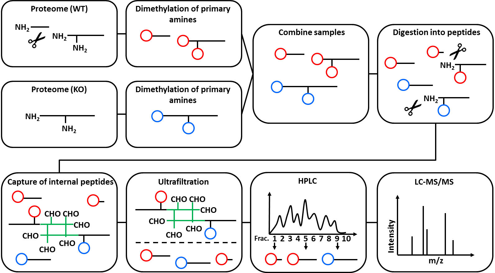

N-Tails is a special Proteomics technique to analyze peptide abundancy changes of protein N-termini. Prior to the MS measurement, N-Tails enriches unmodified, as well as acetylated N-termini. Both common and "unusual" N-termini are identified, where "unusual" means that the protein N-terminus was changes.
This is best explained by an example: directly after translation, a protein has exactly one N-terminus. When a protease is cutting the protein in half, each half has its own N-terminus. While the N-terminus of the first half protein is exactly the same as the one of the full protein precursor ("native N-terminus"), the N-terminus of the second half is different ("neo-N-terminus") and depends on the amino acid sequence where the protein was cut.
The N-Tails technique includes the use of heavy isotope dimethyl labelling.

The figure below illustrates the mechanism of N-Tails. It was originally published by Stefan Tholen (doctoral thesis, not available online). Further reading on N-Tails and other N-terminal techniques, see [Tholen et al., Springer Vienna, 2013](https://dx.doi.org/10.1007/978-3-7091-0885-7_5).

The N-Tails technique was originally designed to research protease biology and has most often been used in this field. It was originally published in [Kleifeld et al., Nat. Biotechnol., 2010](https://www.ncbi.nlm.nih.gov/pubmed/20208520).

> ###  Comment: Interpretation of N-Tails results
>
> Be careful when interpreting the results of N-Tails experiments. While the technique **is** fit to identify direct protease substrates, it does not discriminate direct from indirect ("downstream") effects. Thus, most of the identified N-termini will **not** be direct protease substrates, even if their change in protein abundance is statistically significant. To identify direct protease substrates, you have to further validate substrate candidates by comparing the prime and non-prime amino acids of each identified N-terminus with the protease cleavage motif. The information can be extracted from the peptide IDs, but this step is so far not included in the workflow.
>
> Lacking discrimination between direct and indirect effects is a general restriction also in other N-terminal screening techniques (e.g. COFRADIC), and is not specific for the N-Tails technique.
{: .comment}

This workflow was originally built in the OpenMS framework "TOPPAS" and published in [Lai, Weisser et al., MCP, 2016](https://www.ncbi.nlm.nih.gov/pubmed/27087653). It was converted to OpenMS v2.1, rebuild for the Galaxy framework and tested on the original dataset by Melanie Föll. It was designed for data analysis of a three samples combined in one MS run, a technique based on dimethyl stable isotope labeling (SIL). For more information on SIL, consult [this tutorial]({{site.url}}/topics/proteomics/tutorials/protein-quant-sil/tutorial.html). The original data were generated using pre-fractionation. Thus, peptides of one biological experiment are measured in multiple consecutive MS runs (one run per fraction).

The figure below gives an overview of the used Galaxy nodes. For further description of the workflow, please consider the [original publication](https://www.ncbi.nlm.nih.gov/pubmed/27087653).

Notice that the given digestion enzyme is "ArgC", even if the proteins were digested using trypsin. Due to the used labelling method prior to digestion, lysine ("K") residues are dimethylated. Therefore, trypsin will not cut c-terminal of lysine, but only c-terminal of arginine in a N-TAILS experiment. This resembles the ArgC specificity and generally results in longer peptides [Rogers and Overall, MCP, 2013](http://www.mcponline.org/content/12/12/3532.full).

## Input

The workflow needs two input files:

  1) A collection of mzML files (multiple fractions of the same experiment).
  2) A FASTA protein database for the organism of interest. For more information on protein databases, consult [this tutorial]({{site.url}}/topics/proteomics/tutorials/database-handling/tutorial.html)

## Customizing the Workflow

- *Running the workflow on a non-prefractionated sample:* Simply use only one file as an input.
- *Running the workflow on a double dimethyl labeling (only light and heavy labeling):* remove the third **MSGFPlusAdapter**  and the following **PeptideIndexer**  . Make sure that the mass changes are correctly given in the **MSGFPlusAdapter**  .

## Citation

If you use this workflow directly, or any derivative of it, in work leading to a scientific publication,
please cite:

Lai, Z.W., Weisser, J., Nilse, L., Costa, F., Keller, E., Tholen, M., Kizhakkedathu, J.N., Biniossek, M., Bronsert, P., and Schilling, O. (2016). Formalin-Fixed, Paraffin-Embedded Tissues (FFPE) as a Robust Source for the Profiling of Native and Protease-Generated Protein Amino Termini. Mol. Cell. Proteomics 15, 2203–2213.
