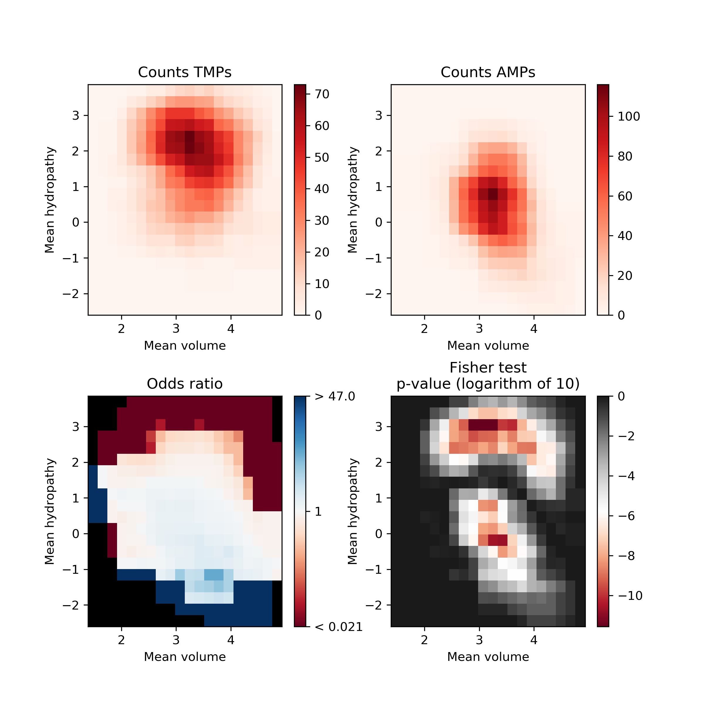
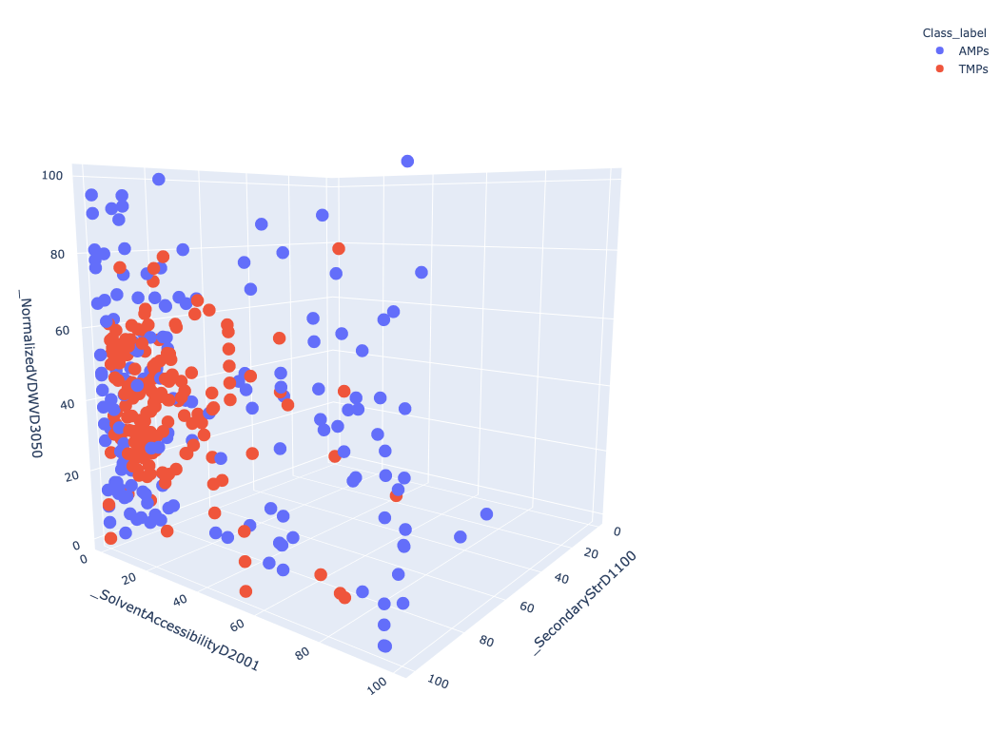

# Introduction
{:.no_toc}

<!-- This is a comment. -->

Several computational methods have been proven very useful in the initial screening and prediction of peptides for various biological properties. These methods have emerged as effective alternatives to the lengthy and expensive traditional experimental approaches. In this tutorial, we will be discussing how to analyze peptide libraries on the basis of quantitative properties.   In this tutorial, we will learn how to use different utilities of PDAUG to calculate various peptide-based features and utilize these features for various informative plots.  

> ### Agenda
>
> In this tutorial, we will cover:
>
> 1. TOC
> {:toc}
>
{: .agenda}

## Peptide Data

In this step, we will retrieve the inbuild dataset, which contains anti-microbial and transmembrane peptides.

> ###  Hands-on: Task description
>
> 1. **PDAUG Peptide Data Access**  with the following parameters:
>    - *"Datasets"*: `AMPvsTM` 
>
{: .hands_on}

## Converting tabular data into fasta formate

In this step, we will be converting and splitting the tabular data file into fasta format.  This tool splits data into two files based on their class labels. 

> ###  Hands-on: Task description
>
> 1. **PDAUG TSVtoFASTA**  with the following parameters:
>    -  *"Input file"*: `output1` (output of **PDAUG Peptide Data Access** )
>    - *"Data conversion"*: ` WithClassLabel `
>
>
{: .hands_on}

## Calculating Sequence Property-Based Descriptors 

In this step, we will be utilizing the "PDAUG Sequence Property Based Descriptors" tool to calculate  CTD (Composition Transition and Distribution) descriptor.  

> ###  Hands-on: Task description
>
> 1. **PDAUG Sequence Property Based Descriptors**  with the following parameters:
>    -  *"Input fasta file"*: `OutFile1` (output of **PDAUG TSVtoFASTA** )
>    - *"Descriptor Type"*: `CTD`
>
>
{: .hands_on}

## Summary Plot for peptide libraries 

In this step, we utilize **PDAUG Peptide Sequence Analysis** tool to compare peptide sequences based on hydrophobicity, hydrophobic movement, charge, amino acid fraction, and sequence length and creates a summary plot.

> ###  Hands-on: Task description
>
> 1. **PDAUG Peptide Sequence Analysis**  with the following parameters:
>    - *"Analysis options"*: `Plot Summary`
>        -  *"First input file"*: `OutFile1` (output of **PDAUG TSVtoFASTA** )
>        -  *"Second input file"*: `OutFile2` (output of **PDAUG TSVtoFASTA** )
>        - *"Second input file"*: `AMP`
>        - *"Second input file"*: `TM `
>
>
{: .hands_on}

## Calculating Sequence Property-Based Descriptors

In this step, we will be utilizing the "PDAUG Sequence Property Based Descriptors" tool to calculate  CTD (Composition Transition and Distribution) descriptor.

> ###  Hands-on: Task description
>
> 1. **PDAUG Sequence Property Based Descriptors**  with the following parameters:
>    -  *"Input fasta file"*: `OutFile2` (output of **PDAUG TSVtoFASTA** )
>    - *"Descriptor Type"*: `CTD`
>
>
{: .hands_on}

## Assessing feature space distribution 

In this tool, we have used **PDAUG Fisher's Plot** that compare two peptide library based on the feature space using the Fisher test. 

> ###  Hands-on: Task description
>
> 1. **PDAUG Fisher's Plot**  with the following parameters:
>    -  *"First fasta file"*: `OutFile1` (output of **PDAUG TSVtoFASTA** )
>    -  *"Second fasta file"*: `OutFile2` (output of **PDAUG TSVtoFASTA** )
>    - *"Lebel for first population"*: `AMP`
>    - *"Label for second population"*: `TM`
>
>
{: .hands_on}

## Adding Class labels 

> ###  Hands-on: Task description
>
> 1. **PDAUG Add Class Label**  with the following parameters:
>    -  *"Input file"*: `output1` (output of **PDAUG Sequence Property Based Descriptors** )
>
>
{: .hands_on}

> ###  Hands-on: Task description
>
> 1. **PDAUG Add Class Label**  with the following parameters:
>    -  *"Input file"*: `output1` (output of **PDAUG Sequence Property Based Descriptors** )
>    - *"Class Label"*: `1`
>
>
{: .hands_on}

## Merging the two data frames 

We utilize **PDAUG Merge Dataframes** to merge two dataframes. 

> ###  Hands-on: Task description
>
> 1. **PDAUG Merge Dataframes**  with the following parameters:
>    -  *"Input files"*: `OutFile1` (output of **PDAUG Add Class Label** ), `OutFile1` (output of **PDAUG Add Class Label** )
>
>
{: .hands_on}

##  Basic data plotting 

In this step, we utilize the **PDAUG Basic Plots** tool to compare two libraries based on three CTD descriptors SecondaryStrD1100, SolventAccessibilityD2001, and NormalizedVDWVD3050 respectively. A 3D scatter plot will be generated. 

> ###  Hands-on: Task description
>
> 1. **PDAUG Basic Plots**  with the following parameters:
>    - *"Data plotting method"*: `Scatter Plot`
>        -  *"Input file"*: `output1` (output of **PDAUG Merge Dataframes** )
>        - *"Scatter Plot type"*: `3D`
>            - *"First feature"*: `_SecondaryStrD1100`
>            - *"Second feature"*: `_SolventAccessibilityD2001`
>            - *"Third feature"*: `_NormalizedVDWVD3050`
>        - *"Class label column"*: `Class_label`
>
>
{: .hands_on}

# Conclusion
{:.no_toc}

In this tutorial, we learned the flexible and extensible analysis of the peptide data using PDAUG tools. We generated various plots based on the quantitative properties of amino acids and peptide sequences. 

