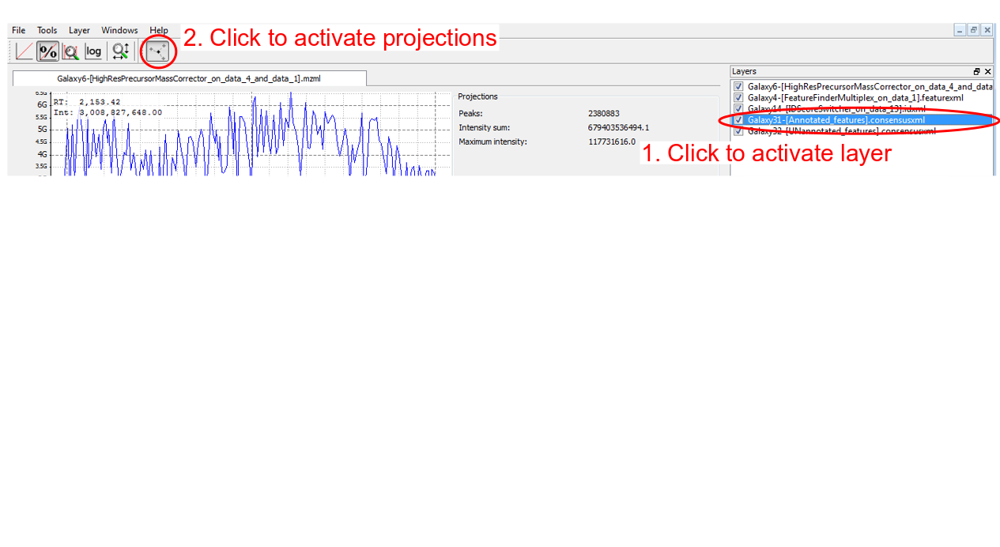

# Introduction
{:.no_toc}

To compare protein amounts in different samples from MS/MS data, two different experiment setups exist. Firstly, unmodified proteins can be measured in separate runs at one sample per MS-run. Secondly, proteins of samples to compare can be labelled with small chemical tags, mixed, and measured side-by-side in a single MS-run.
There are two types of chemical tags:
  1. Isobaric tags display the same mass on first hand, but fragment during the generation of the MS/MS spectra to yield reporter ions of different mass. The intensity of those reporter ions can be compared in MS/MS spectra. There are two types of isobaric tags commercially available: *tandem mass tags* (TMT) and *isobaric tags for relative and absolute quantitation* (iTRAQ).
  2. Isotopic tags are chemically identical, but differ in their mass due to incorporated stable isotopes. Examples of different isotopic tags for stable isotope labelling (SIL) are ICAT, SILAC, dimethylation, or heavy oxygen (18O).

This tutorial deals with protein quantitation via stable isotope labelling (SIL). For isotopic tags, quantitation can be achieved by comparing the intensity of MS1 peptide mass traces. The whole MS1 profile of a peptide, i.e. the intensities of all its isotopic peaks over time, is called a *peptide feature* (Figure 1a). 
Incorporation of stable isotopes results in different peptide masses on MS1 level, which give rise to coeluting ion traces in the TIC with a mass difference typical for each different chemical tag (Figure 1b). Figure originally published in [Nilse et al, 2015](http://www.ncbi.nlm.nih.gov/pubmed/25931027).

In this tutorial, we will use tools of the [OpenMS suite](http://www.openms.org) to identify and quantify peptides and proteins.

 Two peptide features of co-eluting SIL peptides. B) MS1 spectra at a given RT. C) XIC monoisotopic peak light peptide. D) XIC monoisotopic peak heavy peptide.")

## Prerequisites
{:.no_toc}

If you are in the planning phase of your quantitative proteomics experiment, you may want to consider our tutorial on different [quantitation methods]({{site.baseurl}}/topics/proteomics/tutorials/labelfree-vs-labelled/tutorial.html) first.

To learn about *protein identification* in Galaxy, please consider our OpenMS-based [peptide ID tutorial]({{site.baseurl}}/topics/proteomics/tutorials/protein-id-oms/tutorial.html).

> ###  Hands-on: Introduction
> In the hands-on section of this tutorial, we will use a quantitative comparison of HEK cell lysate as a test dataset. In this experiment, HEK cells were once labelled with light, once with heavy SILAC. Both cultures were lysed simultaneously and the cell lysates were mixed in a certain ratio. 
> A detailed description of the full dataset is available in the [PRIDE archive]().
>
> Your objective in this hands-on-tutorial is to find out the correct mixing ratio of the test sample.
>
> To speed up analysis, the input dataset was filtered to include only those data acquired in second 2000-3000 of the original LC gradient.
{: .hands_on}

> ### Agenda
>
> In this tutorial, we will deal with:
>
> 1. TOC
> {:toc}
>
{: .agenda}

# MS1 Feature Detection
MS1 feature detection is a critical step in quantitative workflows. In principle, there are two different ways to define features:
1. Feature detection solely based upon MS1 data (mzML/raw files) without prior knowledge of peptide identifications (IDs).
    - Advantage: Feature results can be used to assist in peptide identification.
    - Drawback: Not all peptide identifications can be mapped to features, thus not every identified peptide can be quantified.
2. Feature detection based upon peptide IDs.
    - Advantage: Most peptide IDs trigger a feature detection.
    - Drawback: Feature results cannot be used to improve peptide ID.

The OpenMS suite provides several tools (FeatureFinders) for MS1 feature detection. For SIL we have to use ***FeatureFinderMultiplex***, which does not take peptide IDs as an input.

> ###  Hands-on: MS1 Feature Detection
>
> 1. Import the test dataset from [zenodo](https://zenodo.org/record/1051552). The data have been preprocessed during the conversion from the machine raw file. We used background removal on MS1 and MS2 level, and MS2 deisotoping.
> 2. Run ***FeatureFinderMultiplex***  with
>   - the mzML file as **LC-MS dataset in centroid or profile mode**,
>   - **Labels used for labelling the samples** set to `[ ][Arg6,Lys6]`, 
>   - **m/z tolerance for search of peak patterns** set to `10`, and
>   - **Maximum number of missed cleavages due to incomplete digestion** set to `1`.
>
>   > ###  Comment: Multiple labels per peptide
>   > When using SILAC-KR or dimethyl-labelling and trypsin digestion, exactly one labelled amino acid per peptide is expected. The only labelled amino acids are lysine (K) and arginine (R) and trypsin cuts after each of them. However, a small percentage of missed cleavage normally occur also in those datasets. Setting **Maximum number of missed cleavages due to incomplete digestion** to `1` will be sufficient to deal with most missed cleavages.
>   >
>   > When using other enzymes (e.g. Lys-C) or other labels (e.g. 18O), several labelled amino acids per peptide are expected. You can search for those features by increasing the parameter **Maximum number of missed cleavages due to incomplete digestion**.
{: .hands_on}

# Peptide and Protein Identification

In this tutorial, peptide identification will be performed using the workflow of the previous [Peptide ID Tutorial]({{site.baseurl}}/topics/proteomics/tutorials/protein-id-oms/tutorial.html). 

A common problem in mass spectrometry are misassigned mono-isotopic precursor peaks. Although most search engines allow for some adaptation of the monoisotopic peak, we will instead perform a recalculation of the monoisotopic peaks based on the previously identified features prior to peptide identification.
This step facilitates mapping peptide IDs to identified features [later on](#mapping-identifications-to-features). To do so, we will use the OpenMS tool ***HighResPrecursorMassCorrector*** .

[//]: # TODO: Read about monoisotopic peak problem, give citation to review!

> ###  Hands-on: Peptide and Protein Identification and Conversion
> 1. Run ***HighResPrecursorMassCorrector***  with
>   - the `mzML` file as **Input file**,
>   - the output of ***FeatureFinderMultiplex*** as **Features used to correct precursor masses**, and
>   - **The precursor mass tolerance** set to `10`.
> 1. Import the human protein database (including cRAP contaminants and decoys) from [zenodo](https://zenodo.org/record/892005/files/Human_database_including_decoys_%28cRAP_added%29.fasta).
> 2. Import the [workflow]({{site.baseurl}}/topics/proteomics/tutorials/protein-id-oms/workflows/workflow.ga) from the tutorial "Protein identification using OpenMS" and modify it:
>   - Delete the **PeakPickerHiRes**  node, as the MS2 data of our test dataset are already centroided.
>   - Connect the `mzML` input directly to the **MSGFPlusAdapter**  node.
>   - Change the **MSGFPlusAdapter**  parameters: Add the variable modifications `Label:13C(6) (K)` and `Label:13C(6) (R)`.
> 3. Run the workflow with
>   - the output of ***HighResPrecursorMassCorrector*** as `1: Input: mzML dataset`
>   - the human FASTA database as `2: protein FASTA database`
>
>   > ###  Tip: Using Galaxy Workflows
>   > If you want to learn more about Galaxy workflows, please consult the [Galaxy Introduction]({{site.baseurl}}/topics/introduction/tutorials/galaxy-intro-101/tutorial.html#the-workflow-editor)
>   {: .tip}
{: .hands_on}

# Mapping Identifications to Features

We now have feature quantifications for MS1 elution peaks, peptide identifications for the MS2 spectra and protein identifications. 
The next step is to map the MS2-based peptide identifications to the quantified MS1 precursor peaks ("peptide features"). This will enable the quantification of identified peptides.
For labelled data, it is necessary to map peptide identifications to *consensus* features (i.e. a pair of one light peptide feature with one matching heavy feature in the correct m/z distance).
For `consensusXML`, IDMapper uses the consensus centroids, not the feature boundaries for mapping. Therefore, the RT tolerance has to be set higher than for mapping to `featureXML`. A good starting value is half the expected typical retention time.

Sometimes several peptide identifications are mapped to a feature. The tool [IDConflictResolver](http://ftp.mi.fu-berlin.de/pub/OpenMS/release-documentation/html/TOPP_IDConflictResolver.html) filters the mapping so that only the identification with the best score is associated to each feature.

Finally, we will combine the peptide quantifications to protein quantifications.

> ###  Hands-on: Quant to ID matching
>
> 1. Run ***IDMapper***  with
>   - the output of ***IDFilter*** as **Protein/peptide identifications file**,
>   - the `consensusXML` output of ***FidoAdapter*** as **Feature map/consensus map file**, 
>   - **RT tolerance (in seconds) for the matching of peptide identifications and (consensus) features** set to `20`,
>   - **m/z tolerance (in ppm or Da) for matching of peptide identifications and (consensus) features** set to `10`, and
>   - **Match using RT and m/z of sub-features instead of consensus RT and m/z** set to `Yes`.
> 2. Change the filetype of the ***IDMapper*** output to `consensusXML`.
> 3. Run ***FileFilter***  with
>   - **Remove unassigned peptide identifications** set to `Yes`.
> 4. Run ***IDConflictResolver*** .
> 5. Run ***ProteinQuantifier***  with
>   - the output of ***IDConflictResolver*** as **Input file**,
>   - the output of ***IDFilter*** as **Protein inference results [...]**,
>   - **Calculate protein abundance from this number of proteotypic peptides (most abundant first; '0' for all)** set to `0`, 
>   - **Include results for proteins with fewer proteotypic peptides than indicated by 'top'** set to `Yes`,
>   - **Averaging method used to compute protein abundances from peptide abundances** set to `sum`, and
>   - **Add the log2 ratios of the abundance values to the output** set to `Yes`.
>
>   > ###  Comment: ProteinQuantifier parameters
>   > Peptide quantitation algorithms are more precise for high abundant peptides. Therefore, it is recommended to base protein quantitations on those peptides. In ProteinQuantifier, you may restrict the calculation of protein abundances to the most abundant peptides by using the option "Calculate protein abundance from this number of proteotypic peptides".
>   > However, we recommend to use the averaging method `sum` instead. By using this option, protein ratios are based on the sum of all peptide abundances. Thus, highly abundant peptides thus have more influence on protein abundance calculation than low abundant peptides. 
>   > A simple sum-of-intensities algorithm provided the best estimates of true protein ratios in a comparison of several protein quantitation algorithms ([Carrillo et al., Bioinformatics, 2009](https://www.ncbi.nlm.nih.gov/pubmed/19892804)).
>   {: .comment}
{: .hands_on}

# Descriptive Statistics and Plotting of Protein Quantitations
***ProteinQuantifier*** produces two output tables: the first one gives information about the quantified proteins, the second one gives information about the quantified peptides.
For proteins, we added a log-transformed ratio to the output, which is saved in column 8 of the protein table. The ratio is calculated as **log2 (abundance2/abundance1)**, which is sometimes called the *fold change (FC)* ratio.

To get a quick overview of the results, you can calculate basic descriptive statistics and plot the data as a histogram.
Comment lines in the beginning of a `tabular` file may sometimes cause errors, therefore we will remove them with the tool ***Select last (tail)***.

> ###  Hands-on: Descriptive Statistics
> 1. Run ***Summary Statistics***  with
>   - **Summary statistics on** set to the ***ProteinQuantifier*** protein table output, and
>   - **Column or expression** set to `c8`.
> 2. Run ***Select last***  with
>   - **Text file** set to the ***ProteinQuantifier*** protein table output,
>   - **Operation** set to `Keep everything from this line on`, and
>   - **Number of lines** set to `4`.
> 2. Run ***Histogram***  with
>   - **Dataset** set to the ***Select last*** output,
>   - **Numerical column for x axis** set to `Column: 8`, and
>   - **Number of breaks (bars)** set to `20`.
>   - Set the **Plot title** and **Label for x axis** to something meaningful.
>
>   > ###  Tip: Calculating descriptive statistics for peptides
>   > The peptide table output of ***ProteinQuantifier*** does not give the log-transformed ratio for each peptide. Nonetheless, you may calculate basic statistics of the FC values by running ***Summary Statistics*** with **Column or expression** set to `log(c6/c5,2)`.
> {: .tip}
>
>   > ###  Questions
>   > 1. How many peptides and proteins were successfully quantified?
>   > 2. What might have been the mixing ratio of the input dataset?
>   > 3. In the histogram, there is a second local maximum at about FC 0. What might that mean?
>   >
>   >  

>   >  
Click to view answers

>   >   <ol type="1">
>   >     <li> With the above parameters, you should have quantified 818 peptides and 407 proteins.</li>
>   >     <li> In the histogram, you see that the peak of the density curve is between -1.1 and -1.2. In the summary statistics, you can see that the mean protein ratio was -0.98. An FC of -1 indicates that the unlabelled proteins were twice as abundant as their heavy-labelled counterparts. Indeed, the mixing ratio of the dataset was 2 parts light labelled HEK cell lysate and 1 part heavy labelled HEK cell lysate.</li>
>   >     <li> Some proteins were quantified with an FC close to 0. These may stem from incomplete SILAC labelling. Even after two weeks of cell culture in SILAC medium, some proteins with a very low turnover rate may remain unlabelled.
>   >   </ol>
>   >  

>   {: .question}
{: .hands_on}

# Evaluation and Optimization of Quantitation Results
Protein quantitation is a multi-step procedure. Many parameters of different steps influence the final results. Therefore, it is recommended to optimize the tool parameters for each dataset and to carefully evaluate quantitation results. While the total number of quantified proteins is a first important parameter for optimization, it is also necessary to visualize the results and check for correct feature finding and ID mapping.

Galaxy does not provide a tool for proteomics visualization, we recommend to use the OpenMS Viewer ***TOPPView***.
Basic TOPPView tutorials are available as [videos](https://www.openms.de/getting-started/command-line-and-visualisations/) and a more comprehensive tutorial as [HTML](http://ftp.mi.fu-berlin.de/pub/OpenMS/release-documentation/html/TOPP_TOPPView.html) or [PDF](http://ftp.mi.fu-berlin.de/pub/OpenMS/release-documentation/TOPP_tutorial.pdf).

For the optimization of tool parameters, it is recommended not to work with a complete LC-MS/MS run. Instead, we will use ***FileFilter*** to extract a small *RT-slice* of our input dataset, i.e. a fraction of the original dataset that was measured during a short period of time. Reducing the test data reduces the time needed for analysis and facilitates visual examination of the data.

Using Galaxy Workflows enables us to quickly re-run a full analysis with changed parameters. To learn about Galaxy Workflows, consult this [tutorial]({{site.baseurl}}/topics/introduction/tutorials/galaxy-intro-history-to-workflow/tutorial.html).

**Cave:** Be aware that only very small parts of your dataset can be checked by visual examination. To minimize biases, try to look at the same areas / features of each result file.

> ###  Hands-on: Data reduction and visual evaluation with TOPPView
>
> 1. Run ***FileFilter***  with
>   - **Retention time range to extract** set to `2000:2200`.
> 1. Extract a workflow out of your history or import the [premade workflow](./workflows/workflow.ga).
> 3. Run the whole workflow again with default settings on the reduced `mzML` file.
> 4. Run ***FileFilter***  with
>   - the IDConflictResolver output as **Input file**, and
>   - **Remove features without annotations** set to `Yes`.
> 5. Rename the FileFilter output to "Annotated features"
> 5. Run ***FileFilter***  with
>   - the IDConflictResolver output as **Input file**, and
>   - **Remove features with annotations** set to `Yes`.
> 5. Rename the FileFilter output to "UNannotated features"
> 2. Download the following files:
>   - Spectra: ***HighResPrecursorMassCorrector*** `mzML` output file
>   - peptide IDs: ***IDScoreSwitcher*** `idXML` output file
>   - features: ***FeatureFinderMultiplex*** `featureXML` output file
>   - consensus features: ***FileFilter*** `consensusXML` output files ("Annotated" and "UNannotated" features)
> 2. Open **TOPPView**.
> 3. Open the `mzML` file in **TOPPView** with
>   - **Open as** set to `new window`,
>   - **Map view** set to `2D`, and
>   - **Low intensity cutoff** set to `off`.
> 4. Open all other downloaded files in **TOPPView** with
>   - **Open as** set to `new layer`.
> 5. Activate the `mzML` layer and click on `Show projections`.
>   >  and plotted against m/z (right panel).")
> 6. Activate the `consensusXML` layers and click on `Show consensus feature element positions` (Figure).
>   > 
> 7. Evaluate your data analysis, by
>   - zooming into a specific region (hold `Ctrl` and use the mouse to zoom),
>   - measuring m/z and RT distances (select the `mzML` layer, hold `Shift` and use the mouse to measure),
>   - displaying an area in 3D view (`right-click` into the 2D View and select `Switch to 3D view`),
>   - switching on and off the display of single layers (`left-click` at the tick-boxes in the window "Layers").
{: .hands_on}

## Examples
1. **Displaying annotated vs. UNannotated features**: visualize annotated (= mapped) and unannotated (= unmapped) features by switching between activating only the "Annotated_features.consensusxml" or only the "UNannotated_features.consensusxml" layer
     Annotated layer is active. B) UNannotated layer is active.")

2. **Correct mapping**: a feature was detected, a peptide was identified and the two were mapped.
     2D View. B) 3D View.")
     2D View. B) 3D View.")

3. **No feature detected for a contaminant.** Contaminants are often not labelled, but occur only in their unlabelled isoform. Therefore, they do not give rise to a consensus feature in FeatureFinderMultiplex.
     2D View. B) 3D View.")

> ###  Hands-on: Check a possible contaminant
> 1. Run ***TextExporter*** with
>   - the IDFilter output file as the **Input file**.
> 2. Run ***Search in textfiles (grep)*** with
>   - **Select lines from** set to the TextExporter output file, and
>   - **Regular Expression** set to the peptide sequence (e.g. "MFLSFPTTK")
> 3. Check if the peptide was mapped to a protein marked with "CONTAMINANT".
{: .hands_on}

## Typical Problems
Three problems typically hamper correct peptide mapping:
1. **A feature is detected, but no peptide identification is nearby.**
    - *Possible cause*: This may be caused by imperfect peptide identification. However, it is never expected that every single MS2-spectrum leads to an identification. The protein might be missing in the database, or the peptide may carry a modification that was not included in the search.
    - *Possible solution*: Improve your search engine settings.
    , but did not lead to a peptide identification.")
2. **A peptide was identified, but no feature is nearby.**
    - *Possible cause*: 
        1. The elution peaks of the peptide may be distorted. This is typical for low intensity peptides. If a lot of peptides have distorted elution peaks this may be a sign of spray instability.
        2. The peptide is a contaminant.
    - *Possible solution*: 
        1. Lower the FeatureFinderMultiplex parameters **Two peptides in a multiplet are expected to have the same isotopic pattern** and/or **The isotopic pattern of a peptide should resemble the averagine model at this m/z position** or broaden the **Range of isotopes per peptide in the sample** (in **Advanced Options**).
        2. No optimization of parameters is needed (see [example above](#examples))
     2D View. No third isotopic peak was detected for the labelled peptide. B) 3D View.")
3. **A peptide was identified and a feature was detected nearby, but the two are not mapped to each other.**
    - *Possible cause*: 
        1. The MS2 event and the feature are too far apart to be mapped.
        2. The precursor of the MS2 was not correctly assigned to the mono-isotopic peak.
        3. The detected feature is too small in RT dimension and covers only a part of the peptide peaks.
    - *Possible solution*: 
        1. Increase the IDMapper parameter **RT tolerance (in seconds) for the matching of peptide identifications and (consensus) features**.
        2. Increase the HighResPrecursorMassCorrector parameter **Additional retention time tolerance added to feature boundaries**
        3. Feature size in RT dimension cannot be directly corrected, use solution 1 instead.
     2D View. B) 3D View.")

Two problems typically disturb correct peptide quantitation:
1. **A peptide is mapped to the wrong feature.**
    - *Possible cause*: Co-eluting peptides of a similar mass may be falsely mapped to a nearby feature, if the correct peptide did not lead to an identification or was identified only with a low score. In *high-resolution data*, this problem of is very limited. Co-eluting peptides can normally be distinguished by slightly different m/z values. In *low-resolution data*, wrong assignment may occur more often. 
    - *Possible solution*: If a high value is used for the precursor mass tolerance, try to keep the RT tolerance low to avoid false mapping.
2. **Background noise (1) or co-eluting peptides (2) are incorporated in a feature.**
    - *Possible solution*: 
        1. Use noise-filtering either during pre-processing or by increasing the FeatureFinderMultiplex parameter **Lower bound for the intensity of isotopic peaks**
        2. Reduce the FeatureFinderMultiplex parameter **m/z tolerance for search of peak patterns**.

> ###  Question
> 2. How many peptides could not be mapped to MS1 features? (Click on the IDMapper output and look at the tool's infobox.)
> 3. How many features could not be mapped to a peptide identification? (Click on the ProteinQuantifier output and look at the tool's infobox.)
> 1. Which problems are most prominent in the test dataset?
>
>  

>  
Click to view answers

>    <ol type="1">
>      <li> 1,395 peptide IDs could not be mapped to a feature.</li>
>      <li> 1,898 features, corresponding to 949 consensus features could not be mapped to a peptide identification.</li>
>      <li> The mapping of peptide IDs to features seems to have worked mostly fine. The main problems seem to be (1) missing peptide identifications, (2) missing features where a peptide was identified and (3) features that span a shorter RT range than the corresponding peptide's elution peak.</li>
>    </ol>
>  

{: .question}

## Optimization of Quantitation Results
For optimization, it is critical to modify **only one parameter at a time**.
Also, it is recommended to optimize the tools in the order of their position in the workflow.

In the test dataset, several peptides were identified, but not quantified. Some of the peptides were even identified in the unlabelled, as well as in the labelled form. To optimize the feature detection, we will relax the parameters of FeatureFinderMultiplex.

> ###  Hands-on: Optimize Feature Detection
>
> 1. Run the whole WF again, change the FeatureFinderMultiplex parameter **Range of isotopes per peptide in the sample** from `3:6` to `2:6`.
> 2. Run the whole WF again, change the HighResPrecursorMassCorrector parameter **Additional retention time tolerance added to feature boundaries** from `0.0` to `10.0`.
> 3. Compare the number of identified proteins, unmatched features and unmapped peptides for each parameter setting.
> 4. Visualize the results with TOPPView to check for correct feature detection and feature-to-peptide mapping.
>
>   > ###  Tip: Sending workflow results to new history
>   > When running a workflow, you may send the results to a new history. This helps keeping track of different parameter settings.
>   {: .tip}
>
>   > ###  Question
>   > 1. Which parameter improved the number of quantified proteins?
>   >
>   >  

>   >  
Click to view answers

>   >    <ol type="1">
>   >      <li> Both changes led to more quantified proteins. Increasing the isotope range led to 26 \% more protein quantitations, increasing the RT tolerance led to 7 \% more protein quantitations. </li>
>   >    </ol>
>   >  

>   {: .question}
{: .hands_on}
