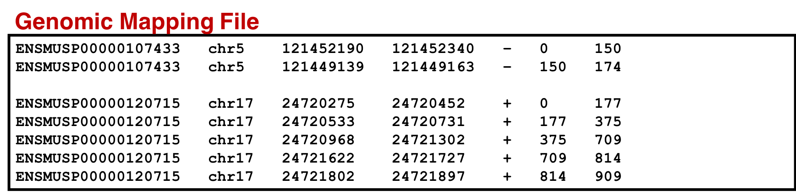

# Introduction
{: .no_toc}

**Proteogenomics** involves the use of mass spectrometry (MS) based proteomics data against genomics and transcriptomics data to identify peptides and to understand protein-level evidence of gene expression. In the first section of the tutorial, we will create a protein database (FASTA) using RNA-sequencing files (FASTQ) and then perform sequence database searching using the resulting FASTA file with the MS data to identify peptides corresponding to novel proteoforms. Then, we will assign the genomic coordinates and annotations for these identified peptides and visualize the data for its spectral quality and genomic localization


Proteogenomics integrates **RNA-Seq** data for generating customized protein sequence databases with mass spectrometry-based proteomics data, which are matched to these databases to identify protein sequence variants. (Cancer Res. (2017); 77(21):e43-e46. doi: <a target="_blank" href="https://doi.org/10.1158/0008-5472.CAN-17-0331">10.1158/0008-5472.CAN-17-0331</a>).


> ### Agenda
>
> In this tutorial, we will cover:
> 1. TOC
> {:toc}
>
{: .agenda}

# Overview
{: .no_toc}

This tutorial focuses on creating a **FASTA** database generated from RNA-seq data. There are two outputs from this workflow: (1) a **sequence database** consisting of variants and known reference sequences and (2) mapping files containing **genomic** and **variant** mapping data.


The first part of the workflow deals with creating the FASTA file containing sequences with single amino acid variants (SAVs), insertions and deletions (indels). The second part of the workflow helps in creating a FASTA file with transcript assemblies (splicing variants).


# Data upload

In this tutorial, protein and the total RNA sample was obtained from the early development of B-cells from mice. It was obtained at two developmental stages of B-cells: *Ebf1* -/- pre-pro-B and *Rag2* -/- pro-B. Please refer to the original study  [Heydarian, M. et al.](https://www.ncbi.nlm.nih.gov/pmc/articles/PMC4276347/)for details.


> ###  Hands-on: data upload and organization
>
> 1. Create a new history and name it something meaningful (e.g. *Proteogenomics DB creation*)
> 2. Import the FASTQ file and the GTF file from Zenodo [](https://doi.org/10.5281/zenodo.1302055)
>    ```
>    https://zenodo.org/record/1302055/files/FASTQ_ProB_22LIST.fastqsanger
>    https://zenodo.org/record/1302055/files/Mus_musculus.GRCm38.86.gtf
>    ```
>
>    
>
> 3. Rename the datasets with more descriptive names (strip off the url prefixes)
>
>
{: .hands_on}


# Aligning FASTQ files to the human genome

The first tool in the workflow is the [**HISAT2**](http://ccb.jhu.edu/software/hisat) alignment tool. It maps next-generation sequence (NGS) reads to the reference genome. This tool requires an RNA-seq file (.FASTQ) and a reference genome file in Gene transfer format (GTF). This .gtf file is obtained from the Ensembl database. When successful, this tool outputs a .bam file (binary version of a SAM: **S**equence **A**lignment/**M**ap).

> ###  Hands-on: Alignment with HISAT2
>
>  1. **HISAT2**  with the following parameters:
>    - *"Source for the reference genome"*: `Use a built-in genome` mm10
>    - *"Single-end or paired-end reads"*: `Single end`
>    - *"Input FASTQ files"*: `FASTQ_ProB_22LIST.fastqsanger`
>    - *"Specify strand information"*: `Unstranded`
>
> > ###  Note on strandedness
> > Note that if your reads are from a stranded library, you need to choose the appropriate
> > setting for "Specify strand information" mentioned above. For single-end reads, use `F` or `R`.
> > `F` means that a read corresponds to a forward transcript. `R` means that a read corresponds to the reverse
> > complemented counterpart of a transcript.
> >
> > For paired-end reads, use either `FR` or `RF`. With this
> > option being used, every read alignment will have an XS attribute tag: `+` means a read
> > belongs to a transcript on the positive `+` strand of the genome. `-` means a read belongs to a
> > transcript on the negative `-` strand of the genome. (TopHat has a similar option, `--library--type` option,
> > where fr - first strand corresponds to R and RF; fr - second strand corresponds to F and FR.)
> {: .comment}
>
{: .hands_on}


# Variant Analysis

## Variant Calling

[FreeBayes]( https://github.com/ekg/freebayes) is a Bayesian genetic variant detector designed to find small polymorphisms, specifically SNPs (single-nucleotide polymorphisms), indels (insertions and deletions), MNPs (multi-nucleotide polymorphisms), and complex events (composite insertion and substitution events) smaller than the length of a short-read sequencing alignment.


Provided with some BAM dataset(s) and a reference sequence, FreeBayes will generate
a VCF dataset describing SNPs, indels, and complex variants in samples in the input
alignments. By default, FreeBayes will consider variants supported by at least two observations
in a single sample (`-C`) and also by at least 20% of the reads from a single sample (`-F`). These
settings are suitable for low to high depth sequencing in haploid and diploid samples, but
users working with polyploid or pooled samples may adjust them depending on the characteristics
of their sequencing data.

FreeBayes is capable of calling variant haplotypes shorter than a read length where multiple
polymorphisms segregate on the same read. The maximum distance between polymorphisms phased in
this way is determined by the `--max-complex-gap`, which defaults to 3bp. In practice, this can
comfortably be set to half the read length. Ploidy may be set to any level (`-p`), but by default
all samples are assumed to be diploid. FreeBayes can model per-sample and per-region variation
in copy-number (`-A`) using a copy-number variation map.

FreeBayes can act as a frequency-based pooled caller and can describe variants and haplotypes in
terms of observation frequency rather than called genotypes. To do so, use --pooled-continuous
and set input filters to a suitable level. Allele observation counts will be described by AO
and RO fields in the VCF output.


> ###  Hands-on: Variant Calling with FreeBayes
>
> 1. **FreeBayes**  with the following parameters:
>   - *"Choose the source for the reference genome"*: `Locally cached file`
>      - *"Run in batch mode?"*: `Run Individually`
>   - *"BAM dataset:*: `HISAT_Output.BAM`
>   - *"Using reference genome"*: `mm10`
>   - *"Limit variant calling to a set of regions?"*: `Do not Limit`
>   - *"Choose parameter selection level"*: `Simple diploid calling`
>
> 2. Click **Execute** and inspect the resulting files
>
{: .hands_on}

> ###  FreeBayes options
>
>    Galaxy allows five levels of control over FreeBayes options, provided by the Choose
>    parameter selection level menu option. These are:
>    1. Simple diploid calling: The simplest possible FreeBayes application. Equivalent to using
>    FreeBayes with only a BAM input and no other parameter options.
>
>    2. Simple diploid calling with filtering and coverage: Same as #1 plus two additional options:
>     (1) `-0` (standard filters: `--min-mapping-quality 30 --min-base-quality 20 --min-supporting-allele
>     -qsum 0 --genotype-variant-threshold 0`) and (2) `--min-coverage`.
>
>    3. Frequency-based pooled calling: This is equivalent to using FreeBayes with the following
>    options: `--haplotype-length 0 --min-alternate-count 1 --min-alternate-fraction 0 --pooled
>    -continuous  --report- monomorphic`. This is the best choice for calling variants in mixtures
>    such as viral, bacterial, or organellar genomes.
>
>    4. Frequency-based pooled calling with filtering and coverage: Same as #3 but adds `-0` and
>    `--min-coverage` like in #2.
>
>  Complete list of all options: Gives you full control by exposing all FreeBayes options as Galaxy parameters.
{: .comment}

## Variant annotation and Genome Mapping

[CustomProDB]( http://dx.doi.org/10.1093/bioinformatics/btt543) generates custom protein FASTA sequences files from exosome or transcriptome data. Once Freebayes creates the .vcf file, CustomProDB uses this file to generate a custom protein FASTA file from the transcriptome data. For this tool, we use Ensembl 89 mmusculus (GRm38.p5) (dbsnp142) as the genome annotation. We create three FASTA files from CustomProDB: (1) a variant FASTA file for short indels, (2) a Single Amino acid Variant (SAV) FASTA file, an SQLite database file (genome mapping and variant mapping) for mapping proteins to a genome and (3) an RData file for variant protein coding sequences.
The reference protein set can be filtered by transcript expression level (RPKM calculated from a BAM file), and variant protein forms can be predicted based on variant calls (SNPs and indels reported in a VCF file).

Annotations CustomProDB depends on a set of annotation files (in RData format) to
create reference and variant protein sequences. Galaxy administrators can use the CustomProDB
data manager to create these annotations to make them available for users.


> ###  Hands-on: Generate protein FASTAs from exosome or transcriptome data
>
> 1. **CustomProDB**  with the following parameters:
>   - *"Will you select a genome annotation from your history or use a built-in annotation?"*: `Use built in genome annotation`
>   - *"Using reference genome"*: `Ensemble 89 mmusculus (GRm38.p5) (dbsnp142)`
>   - *"BAM file"*: `HISAT_Output.BAM`
>   - *"VCF file"*: `Freebayes.vcf`
>   - *"Annotate SNPs with rsid from dbSNP"*: `No`
>   - *"Annotate somatic SNPs from COSMIC (human only)"*: `No`
>   - *"Transcript Expression Cutoff (RPKM)"*: `1`
>   - *"Create a variant FASTA for short insertions and deletions"*: `Yes`
>   - *"Create SQLite files for mapping proteins to genome and summarizing variant proteins"*: `Yes`
>   - *"Create RData file of variant protein coding sequences"*: `Yes`
>
{: .hands_on}

Three FASTA files are generated through the CustomProDB tool:
- a variant FASTA file for short indels,
- a Single Amino acid Variant (SAV) FASTA file
- an Sqlite file (genome mapping and variant mapping)

for mapping proteins to genome and an RData file for variant protein coding sequences.
Similar to the genomic mapping, a variant mapping file is also generated from CustomProDB.
This SQLite file is also converted to tabular format and made SearchGUI-compatible. This
variant annotation file will be used to visualize the variants in the Multi-omics Visualization
Platform (in-house visualization platform developed by Galaxy-P senior developers).

# Transcript Assembly

## RNA-seq to transcripts

[StringTie](http://ccb.jhu.edu/software/stringtie/) is a fast and highly efficient assembler of RNA-Seq alignments into potential transcripts. It uses a network flow algorithm as well as an optional *de novo* assembly step to assemble and quantitate full-length transcripts representing multiple splice variants for each gene locus.

Its input can include not only the alignments of raw reads used by other transcript assemblers, but also alignments of longer sequences that have been assembled from those reads. To identify differentially expressed genes between experiments, StringTie's output can be processed by specialized software like Ballgown, Cuffdiff or other programs (DESeq2, edgeR, etc.).


> ###  Hands-on: Transcript assembly with StringTie
>
> 1. **StringTie**  with the following parameters:
>   - *"Input mapped reads"*: `FASTQ_ProB_22LIST.BAM`
>   - *"Specify strand information"*: `Unstranded`
>   - *"Use a reference file to guide assembly?"*: `Use Reference GTF/GFF3`
>   - *"Reference file"*: `Use file from History`
>       - *"GTF/GFF3 dataset to guide assembly"*: `Mus_musculus.GRCm38.86.gtf`
>   - *"Use Reference transcripts only?"*: `No`
>   - *"Output files for differential expression?"*: `No additional output`
>   - *"Output coverage file?"*: `No`
>   - *"Advanced Options"*: `Default Parameters`
>
{: .hands_on}

StringTie accepts a BAM (or SAM) file of paired-end RNA-seq reads, which must be
sorted by genomic location (coordinate position). This file contains spliced read alignments
and can be produced directly by programs such as HISAT2. We recommend using HISAT2 as it is a
fast and accurate alignment program. Every spliced read alignment (i.e. an alignment across
at least one junction) in the input BAM file must contain the tag XS to indicate the genomic
strand that produced the RNA from which the read was sequenced. Alignments produced by HISAT2
(when run with the `--dta` option) already include this tag, but if you use a different read mapper
you should check that this XS tag is included for spliced alignments.

> ###  Note about parameter settings
> Be sure to run HISAT2 with the `--dta` option for alignment (under 'Spliced alignment options'),
> for the best results.
>
> Also note that if your reads are from a stranded library, you need to choose the appropriate
> setting for 'Specify strand information' above. As, if Forward (FR) is selected, StringTie will
> assume the reads are from a `--fr` library, while if Reverse (RF) is selected, StringTie will
> assume the reads are from a `--rf` library, otherwise it is assumed that the reads are from an
> unstranded library (the widely-used, although now deprecated, TopHat had a similar `--library-type`
> option, where fr-firststrand corresponded to RF and fr-secondstrand corresponded to FR).
> If you don't know whether your reads are from a stranded library or not, you could use the
> tool 'RSeQC Infer Experiment' to try to determine.
>
> As an option, a reference annotation file in GTF/GFF3 format can be provided to StringTie. In
> this case, StringTie will prefer to use these "known" genes from the annotation file, and for
> the ones that are expressed it will compute coverage, TPM and FPKM values. It will also produce
> additional transcripts to account for RNA-seq data that aren't covered by (or explained by) the
> annotation. Note that if option `-e` is not used, the reference transcripts need to be fully covered
> by reads in order to be included in StringTie's output. In that case, other transcripts assembled
> from the data by StringTie and not present in the reference file will be printed as well.
>
> We highly recommend that you provide annotation if you are analyzing a genome that is well
> annotated, such as human, mouse, or other model organisms.
{: .details}

## Evaluate the assembly with annotated transcripts

[GffCompare](https://ccb.jhu.edu/software/stringtie/gffcompare.shtml) compares and evaluates the accuracy of RNA-Seq transcript assemblers (Cufflinks, Stringtie). * collapse (merge) duplicate transcripts from multiple GTF/GFF3 files (e.g. resulted from assembly of different samples) * classify transcripts from one or multiple GTF/GFF3 files as they relate to reference transcripts provided in a annotation file (also in GTF/GFF3 format)

The original form of this program is also distributed as part of the Cufflinks suite, under the name [CuffCompare](http://cole-trapnell-lab.github.io/cufflinks/cuffcompare/). Most of the options and parameters of CuffCompare are supported by GffCompare, while new features will likely be added to GffCompare in the future.

> ###  Hands-on: compare assembled transcripts against a reference annotation
>
> 1. **GffCompare**  with the following parameters:
>   - *"GTF inputs for comparison"*`Stringtie_outut.gtf`
>   - *"Use Reference Annotation"*: `Mus_musculus.GRCm38.86.gtf`
>   - *"Reference Annotation"*: `Unstranded`
>   - *"Ignore reference transcripts that are not overlapped by any input transfrags"*: `No`
>   - *"Ignore input transcripts that are not overlapped by any reference transcripts"*: `No`
>   - *"Use Sequence Data"*: `No`
>   - *"discard (ignore) single-exon transcripts"*: `No`
>   - *"Max. Distance for assessing exon accuracy"*: `100`
>   - *"Max distance for transcript grouping"*: `100`
>   - *"discard intron-redundant transfrags sharing 5'"*: `No`
>
{: .hands_on}

> ###  GffCompare vs CuffCompare
> A notable difference between GffCompare and CuffCompare is that when a single query GTF/GFF file is
> given as input along with a reference annotation (-r option), GFFCompare switches into "annotation mode"
> and it generates a .annotated.gtf file instead of the .merged.gtf produced by CuffCompare with the same
> parameters. This file has the same general format as CuffCompare's .merged.gtf file (with "class
> codes" assigned to transcripts as per their relationship with the matching/overlapping reference,
> transcript) but the original transcript IDs are preserved, so GffCompare can thus be used as a
> simple way of annotating a set of transcripts.
>
> Another important difference is that the input transcripts are no longer discarded when they
> are found to be "intron redundant", i.e. contained within other, longer isoforms. CuffCompare
> had the -G option to prevent collapsing of such intron redundant isoforms into their longer
> "containers", but GffCompare has made this the default mode of operation (hence the -G option is
> no longer needed and is simply ignored when given).
>
{: .details}

## Translate transcripts

> ###  Hands-on: Translate transcripts to protein sequence
>
> First, we must convert the GffCompare annotated GTF file to BED format.
>
> 1. **Convert gffCompare annotated GTF to BED**  with the following parameters:
>   - *"GTF annotated by gffCompare"*: `output from gff compare`
>   - *"filter GffCompare class_codes to convert:*:
>     - `j : Potentially novel isoform (fragment): at least one splice junction is shared with a reference transcript`
>     - `e : Single exon transfrag overlapping a reference exon and at least 10 bp of a reference intron, indicating a possible   pre-mRNA fragment.`
>     - `i : A transfrag falling entirely within a reference intron`
>     - `p : Possible polymerase run-on fragment (within 2Kbases of a reference transcript)`
>     - `u : Unknown, intergenic transcript`
>
>     Next, we translate transcripts from the input BED file into protein sequences.
>
> 1. **Translate BED transcripts cDNA in 3frames or CDS**  with the following parameters:
>   - *"A BED file with 12 columns"*: `Convert GffCompare-annotated GTF to BED`
>   - *"Source for Genomic Sequence Data"*: `Locally cached File`
>   - *"Select reference 2bit file"*: `mm10`
>   - *"BED Filtering Options"*: `default`
>   - *"Translation Options"*: `default`
>   - *"FASTA ID Options"*: `default`
>
>     Finally, we convert a BED format file of the proteins from a proteomics search database into a tabular format for the Multiomics Visualization Platform (MVP).
>
> 1. **bed to protein map**  with the following parameters:
>   - *"A BED file with 12 columns, thickStart and thickEnd define protein coding region"*: `Translate cDNA_minus_CDS`
>
{: .hands_on}

> ###  Note on data formats
> - The tabular output can be converted to a sqlite database using the Query_Tabular tool.
> - The sqlite table should be named: feature_cds_map.
> - The names for the columns should be: name, chrom, start, end, strand, cds_start, cds_end
> - This SQL query will return the genomic location for a peptide sequence in a protein
>   (multiply the amino acid position by 3 for the cds location)
{: .comment}

# Creating FASTA Databases

In this section we will perform the following tasks:
- The **Protein Database Downloader** tool is used to download the FASTA database from UniProt and cRAP (**c**ommon **R**epository of **A**dventitious **P**roteins) database containing known/reference mouse proteins.
- The **Regex Text Manipulation** tool is used to manipulate the FASTA file to make it SearchGUI-compatible.
- The **FASTA Merge Files and Filter Unique Sequences** tool is used to merge the databases obtained from CustomProDB and "Translate BED" tool
along with the UniProt and cRAP databases.

> ###  Hands-on
>
> 1. **FASTA Merge Files and Filter Unique Sequences**  with the following parameters:
>   - *"Run in batch mode?"*: `Merge individual FASTAs (output collection if input is collection)`
>   - *"Input FASTA File(s)"* : `Input Custom ProDB Fasta File output`
>     ```
>     1.HISAT_Output.rpkm
>     2.HISAT_Output.snv
>     3.HISAT_Output.indel
>     ```
>   - *"How are sequences judged to be unique?"*: `Accession and Sequence`
>   - *"Accession Parsing Regular Expression"*: `^>([^ |]+).*$`
>
{: .hands_on}

> ###  Tool parameters explained
> This tool concatenates FASTA database files together.
> - If the uniqueness criterion is "Accession and Sequence", only the first appearence of each unique sequence will appear in the output. Otherwise, duplicate sequences are allowed, but only the first appearance of each accession will appear in the output.
> - The default accession parser will treat everything in the header before the first space as the accession.
{: .comment}


For visualization purposes we also use the concatenate tool to concatenate the genomic mapping with the protein mapping dataset. This output will be used for visualization in MVP to view the genomic coordinates of the variant peptide.

An SQLite database containing the genomic mapping SQLite, variant annotation and information from the protein mapping file is concatenated to form a single genomic mapping SQLite database later used as an input for the 'Peptide Genomic Coordinate' tool. For that we need to follow the steps below:

## Genomic mapping database

> ###  Hands-on: Create Database for genomic mapping
>
> 1. **SQLite to tabular for SQL query**  with the following parameters:
>   - *"SQLite Database"*: `genomic_mapping.sqlite` from CustomProDB
>   - *"Query"*:
>      ```
>      SELECT pro_name, chr_name, cds_chr_start - 1, cds_chr_end,strand,cds_start - 1, cds_end
>      FROM genomic_mapping
>      ORDER BY pro_name, cds_start, cds_end
>      ```
>
>     The output is further processed so that the results are compatible with the Multiomics Visualization Platform.
>
> 1. **Column Regex Find And Replace**  with the following parameters:
>   - *"Select cells from"*: `genomic_mapping_sqlite' (tabular)`
>   - *"Using"*: `column 1`
>   - **Check 1**
>   - *"Find Regex"* : `^(ENS[^_]+_\d+:)([ACGTacgt]+)>([ACGTacgt]+)\s*`
>   - *"Replacement"*: `\1\2_\3`
>   - **Check 2**
>   - *"Find Regex"*:  `,([A-Z]\d+[A-Z])\s*`
>   - *"Replacement"*: `.\1`
>   - **Check 3**
>   - *"Find Regex"*: `^(ENS[^ |]*)\s*`
>   - *"Replacement"*: `\1`
>
>     This tool goes line by line through the specified input file and if the text in the selected column matches a specified regular expression pattern, it replaces the text with the specified replacement.
>
>     Next, we will concatenate the output from this tool with the "Bed to protein map" output.
>
> 1. **Concatenate multiple datasets**  with the following parameters:
>   -  *"Concatenate Datasets"*: Select the output from the previous tool and the `Bed2protein_SJ_SAV_INDEL` output.
>
>     Output will be the "Genomic_Protein_map"
>
>     Now, we load this tabular datasets into an SQLite database.
>
> 1. **Query Tabular using SQLite**  with the following parameters:
>    - *"Database Table"*: Click on `+ Insert Database Table`
>    - *"Tabular Dataset for Table"*: `Genomic_Protein_map`
>    - Section **Table Options**:
>    - *"Specify Name for Table"*: `feature_cds_map`
>    - *"Specify Column Names (comma-separated list)"*: `name,chrom,start,end,strand,cds_start,cds_end`
>    - *"Only load the columns you have named into database"*: `No`
>    - Section **Table Index**:
>    - *"This is a unique index"*: `No`
>    - *"Index on columns"*: `name,cds_start,cds_end`
>
> 1. Rename the output as **"genomic_mapping_sqlite"**
>
>    
>
{: .hands_on}


## Variant Annotations database

We will repeat the process for the variant annotations

> ###  Hands-on: Create database for variant annotations
>
> 1. **SQLite to tabular**  with the following parameters:
>  - *"SQLite Database"*: `variant_annotations.sqlite` from CustomProDB
>  - *"Query"*:
>    ```
>    SELECT var_pro_name,pro_name,cigar,annotation
>    FROM variant_annotation
>    ```
>
>    We will subject the output to text manipulation so that the results are compatible with the Multiomics Visualization Platform.
>
> 1. **Column Regex Find And Replace**  with the following parameters:
>  - *"Select cells from"*: `variant_annotations_sqlite' (tabular)`
>  - *"Using:"* `column 1`
>  - **Check 1**
>  - *"Find Regex"*: `^(ENS[^_]+_\d+:)([ACGTacgt]+)>([ACGTacgt]+)\s*`
>  - *"Replacement"*: `\1\2_\3`
>  - **Check 2**:
>  - *"Find Regex"*: `,([A-Z]\d+[A-Z])\s*`
>  - *"Replacement"*: `.\1`
>  - **Check 3**:
>  - *"Find Regex"*: `^(ENS[^ |]*)\s*`
>  - *"Replacement"*:  `\1`
>
>    Next, we will load this tabular dataset into an SQLite database.
>
> 1. **Query Tabular**  with the following parameters:
>    - *"Database Table"*: Click on `+ Insert Database Table`
>    - *"Tabular Dataset for Table"*: `variant_annotation`
>    - Section **Table Options**:
>    - *"Specify Name for Table"*: `variant_annotation`
>    - *"Specify Column Names (comma-separated list)"*: `name,reference,cigar,annotation`
>    - *"Only load the columns you have named into database"*: `No`
>    - Section **Table Index**:
>    - *"This is a unique index"*: `No`
>    - *"Index on columns"*: `name,cigar`
>
> 1. Rename the output as **"Variant_annotation_sqlitedb"**
>
{: .hands_on}

These SQLite databases, which contain the genomic mapping SQLite and variant
annotation information from the protein mapping file, will be utilized
by MVP to visualize the genomic loci of any variant peptides.


### What's next?

Please look at the following tutorials in this proteogenomics series:
- [Proteogenomics database search]({{ site.baseurl }}/topics/proteomics/tutorials/proteogenomics-dbsearch/tutorial.html)
- [Proteogenomics novel peptide analysis]({{ site.baseurl }}/topics/proteomics/tutorials/proteogenomics-novel-peptide-analysis/tutorial.html)
