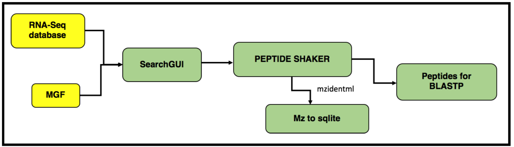
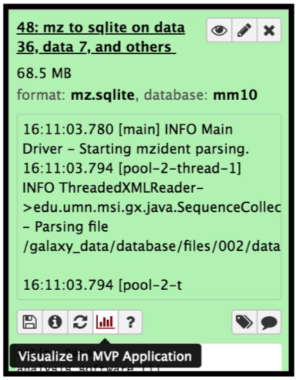
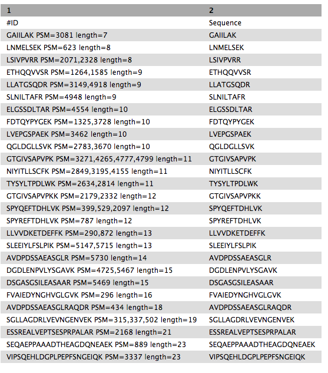

# Introduction
{: .no_toc}

In this tutorial, we perform proteogenomic database searching using the Mass Spectrometry data. The inputs for performing the proteogenomic database searching are the peaklist MGF files and the FASTA database file. The FASTA database is obtained by running the first workflow “Uniprot_cRAP_SAV_indel_translatedbed.FASTA”. The second workflow focuses on performing database search of the peak list files (MGFs).




> ### Agenda
>
> In this tutorial, we will deal with:
> 1. TOC
> {:toc}
>
{: .agenda}


# Pretreatments

{: .no_toc}

> ###  Hands-on: data upload and organization
>
> 1. Create a **new history** and name it something meaningful (e.g. *Proteogenomics DB search*)
> 2. Import the four MGF MS/MS files and the FASTA sequence file from Zenodo.[](https://doi.org/10.5281/zenodo.1489208)
>    ```
>    https://zenodo.org/record/1489208/files/Mo_Tai_Trimmed_mgfs__Mo_Tai_iTRAQ_f4.mgf
>    https://zenodo.org/record/1489208/files/Mo_Tai_Trimmed_mgfs__Mo_Tai_iTRAQ_f5.mgf
>    https://zenodo.org/record/1489208/files/Mo_Tai_Trimmed_mgfs__Mo_Tai_iTRAQ_f8.mgf
>    https://zenodo.org/record/1489208/files/Mo_Tai_Trimmed_mgfs__Mo_Tai_iTRAQ_f9.mgf
>    ```
>
>    
>
> 3. Rename the datasets to something more recognizable (strip the URL prefix)
> 4. Build a **Dataset list** for the three MGF files, name it something recognizable, for example *MGF files*
>
>    
>
{: .hands_on}


# Match peptide sequences

The search database labelled `Uniprot_cRAP_SAV_indel_translatedbed.FASTA` is the input database that
will be used to match MS/MS to peptide sequences via a sequence database search.

For this, the sequence database-searching program called [SearchGUI](https://compomics.github.io/projects/searchgui.html) will be used.The generated dataset collection of the three *MGF files* in the history is used as the MS/MS input. We will walk through a number of these settings in order to utilize SearchGUI on these example MGF files.

## SearchGUI

> ###  Hands-on: SearchGUI
>
> 1. **SearchGUI**  with the following parameters:
>    -  *"Protein Database"*: `Uniprot_cRAP_SAV_indel_translatedbed.FASTA` (Or however you named the `FASTA` file)
>    -  *"Input Peak lists (mgf)"*: `MGF files` dataset collection.
>
>      > ###  Tip: Select dataset collections as input
>      >
>      > * Click the **Dataset collection** icon on the left of the input field:
>      >
>      > * Select the appropriate dataset collection from the list
>      {: .tip}
>
>    - Section **Search Engine Options**:
>      -  *"B-Search Engines"*: `X!Tandem`
>
>        > ###  Comment:
>        >    The section **Search Engine Options** contains a selection of sequence database searching
>        >    programs that are available in SearchGUI. Any combination of these programs can be used for
>        >    generating PSMs from MS/MS data. For the purpose of this tutorial, **X!Tandem** we will be
>        >    used.
>        {: .comment}
>
>    -  Section **Protein Digestion Options**:
>       -  *"Enzyme"*: `Trypsin`
>       -  *"Maximum Missed Cleavages"*: `2`
>
>    - Section **Precursor options**:
>       -  *"Precursor Ion Tolerance Units"*: `Parts per million (ppm)`
>       -  *"Precursor Ion Tolerance"*:` 10`
>       -  *"Fragment Tolerance (Daltons)"*: `0.05` (this is high resolution MS/MS data)
>       -  *"Minimum charge"*:`2`
>       -  *"Maximum charge"*:`6`
>       -  *"Forward Ion"*: `b`
>       -  *"Reverse Ion"*:` y`
>       -  *"Minimum Precursor Isotope"* :`0`
>       -  *"Maximum Precursor Isotope"* :`1`
>
>    - Section **Protein Modification Options**:
>      -  *"Fixed Modifications"*: `Carbamidomethylation of C, ITRAQ-4Plex of K, ITRAQ-4Plex of Ntermini`
>      -  *"Variable modifications"*: `Oxidation of M, ITRAQ-4Plex of Y`
>
>        > ###  Tip: Search for options
>        > For selection lists, typing the first few letters in the window will filter the
>        > available options.
>        {: .tip}
>
>    - Section **Advanced Options**:
>      -  **"X!Tandem Options"*: `Advanced`
>        -  **"X!Tandem: Quick Acetyl"*: `No`
>        -  **"X!Tandem: Quick Pyrolidone"*: `No`
>        -  **"X!Tandem: Protein stP Bias"*: `No`
>        -  **"X!Tandem: Maximum Valid Expectation Value"*: `100`
>
>    - Leave everything else as default
>    - Click **Execute**
>
>
> Once the database search is completed, the SearchGUI tool will output a file (called a
> SearchGUI archive file) that will serve as an input for the next section, PeptideShaker.
>
> > ###  Comment:
> > Note that sequence databases used for proteogenomics are usually much larger than
> > the excerpt used in this tutorial. When using large databases, the peptide identification
> > step can take much more time for computation. In proteogenomics, choosing the optimal
> > database is a crucial step of your workflow.
> {: .comment}
>
{: .hands_on}


## PeptideShaker

[PeptideShaker](https://compomics.github.io/projects/peptide-shaker.html) is a post-processing software tool that
processes data from the SearchGUI software tool. It serves to organize the Peptide-Spectral
Matches (PSMs) generated from SearchGUI processing and is contained in the SearchGUI archive.
It provides an assessment of confidence of the data, inferring proteins identified from the
matched peptide sequences and generates outputs that can be visualized by users to interpret
results. PeptideShaker has been wrapped in Galaxy to work in combination with SearchGUI
outputs.

> ###  Comment: File Formats
>   There are a number of choices for different data files that can be generated using
>   PeptideShaker. A compressed file can be made containing all information needed to
>   view them results in the standalone PeptideShaker viewer. A `mzidentML` file can
>   be generated that contains all peptide sequence matching information and can be
>   utilized by compatible downstream software. Other outputs are focused on the inferred
>   proteins identified from the PSMs, as well as phosphorylation reports, relevant if
>   a phosphoproteomics experiment has been undertaken.
{: .comment}


> ###  Hands-on: PeptideShaker
>
> 1. **PeptideShaker**  with the following parameters:
>   -  *"Compressed SearchGUI results"*: The SearchGUI archive file
>   -  *"Specify Advanced PeptideShaker Processing Options"*: `Default Processing Options`
>   -  *"Specify Advanced Filtering Options"*: `Default Filtering Options`
>   -  *"Include the protein sequences in mzIdentML"*: `No`
>   -  *"Output options"*: Select the `PSM Report` (Peptide-Spectral Match) and the `Certificate of Analysis`
>
>     > ###  Comment: Certificate of Analysis
>     >
>     > The "Certificate of Analysis" provides details on all the parameters
>     > used by both SearchGUI and PeptideShaker in the analysis. This can be downloaded from the
>     > Galaxy instance to your local computer in a text file if desired.
>     >
>     {: .comment}
>
> 2. Inspect the resulting files after they turned green with the **View data** icon
>
{: .hands_on}


A number of new items will appear in your history, each corresponding to the outputs selected
in the PeptideShaker parameters. Most relevant for this tutorial is the PSM report:

Scrolling at the bottom to the left will show the sequence for the PSM that matched to these
peptide entries. Column 3 is the sequence matched for each PSM entry. Every PSM is a
new row in the tabular output.

A number of new items will appear in your History, each corresponding to the outputs selected in the PeptideShaker parameters. The Peptide Shaker’s PSM report is used as an input for the BlastP analysis. Before performing BlastP analysis. The Query Tabular tool and few test manipulation tools are used to remove spectra that belongs to the reference proteins. The output tabular file “Peptides_for_Blast-P_analysis” will contain only those spectra that did not belong to any known proteins.

# Create database

The mzidentml output from the Peptide shaker is converted into an sqlite database file by using the mz to sqlite tool. This sqlite output is used to open the Multi-omics visualization platform, wherein you can view the spectra of the peptides using Lorikeet parameters. To open the MVP viewer, click on the “Visualize in MVP Application” icon ( this will pop-open the interactive multi-omics viewer in a new window/tab)


> ###  Hands-on: mz to sqlite
>
> This tool extracts mzidentml and its associated proteomics datasets into a sqlite db
>
> 1. **mz to sqlite**  with the following parameters:
>    -  *"Proteomics identification files"*: `PeptideShaker_mzidentml`
>    -  *"Proteomics Spectrum files"*: `Mo_Tai_MGFs`
>    -  *"Proteomics Search Database Fasta"*: `Uniprot_cRAP_SAV_indel_translatedbed.FASTA`
>
>    {:width="20%"}
>
{: .hands_on}

The next step is to remove known peptides from the list of PSM's that we acquired from the Peptide Shaker results. For that we need to perform some text manipulation steps to extract list of known peptides from the UniProt and cRAP database.

# Remove known peptides

## Merged Uniprot and cRAP database

The file named "Trimmed_ref_500_Uniprot_cRAP.fasta" is the trimmed version of Uniprot and cRAP database merged Fasta files.

This Fasta file will be subjected to few text manipulation steps in order to get the tabular file for the known peptides. The first step is to convert this FASTA file to tabular in order to proceed with text manipulation.

> ###   Hands-on: FASTA to Tabular
>
> 1. Run **FASTA to Tabular**  with the following parameters:
>    -  *"Data input 'input' (fasta)"*: `Trimmed_ref_500_Uniprot_cRAP.fasta`
>    -  *"How many columns to divide title string into?"*: `2`
>    -  *"How many title characters to keep?"*: `0`
>
{: .hands_on}

The resultant tabular file will go through a series of text manipulation steps to make it suitable for
input to the Query Tabular tool.


## Text Manipulation steps

> ###  Hands-on: Text Manipulation
>
> 1. **Cut**  with the following parameters:
>    - *"Cut Columns"*: `c1`
>    - *"Delimited by"*: `Tab`
>
>    Upon completion of this step you will have extracted C1 (column 1) from the input tabular file
>
> 2. **Convert**  with the following parameters:
>    - *"Convert all"*: `Whitespaces`
>    - *"in Dataset"* : `Data input 'input' (txt)`
>    - *"Strip leading and trailing whitespaces"*: `Yes`
>    - *"Condense consecutive delimiters in one TAB"*: `Yes`
>
>    This step will convert all the white spaces into different tabular column.
>
> 3. **Cut**  with the following parameters:
>    - *"Cut Columns"*: `c2`
>    - *"Delimited by"*: `Pipe`
>
>    This step will extract information in column2 separated by Pipe
>
> 4. **Convert**  with the following parameters:
>    - *"Convert all"*: `Dots`
>    - *"in Dataset"* : `Data input 'input' (txt)`
>    - *"Strip leading and trailing whitespaces"*: `Yes`
>    - *"Condense consecutive delimiters in one TAB"*: `Yes`
>
>    This step will convert all the dots into different tabular column.
>
> 5. **Group**  with the following parameters:
>    - *"Select data"*: `input from above`
>    - *"Group by column"*: `1`
>
{: .hands_on}

Now that we have the list of known peptides, the query tabular tool is used to move these reference pepides from the PSM report.

## Query Tabular

> ###  Hands-on: Query Tabular
>
>  1. **Query Tabular**  with the following parameters:
>
>  -  **Insert Database Table** (a):
>    - Section **Table Options**:
>      - *"Tabular Dataset for Table"*: Uniprot
>      - *"Use first line as column names"* : `No`
>      - *"Specify Column Names (comma-separated list)"*:`prot`
>      -  **Insert Table Index**:
>        - *"Table Index"*: `No`
>        - *"Index on Columns"*: `Prot`
>  -  **Insert Database Table** (b):
>    - Section **Filter Dataset Input**:
>      -  **Insert Filter Tabular Input Lines**
>        - *"Filter by"*:  `skip leading lines`
>        - *"Skip lines"*: `1`
>
>    - Section **Table Options**:
>      - *"Specify Name for Table"*: `psms`
>      - *"Use first line as column names"* : `No`
>      - *"Specify Column Names (comma-separated list)"*:`id,Proteins,Sequence`
>      - *"Only load the columns you have named into database"*: `Yes`
>      -  **Table Index**
>        - *"Table Index"*: `No`
>        - *"Index on Columns"*: `id`
>
> -  **Insert Database Table** (c):
>
>    - Section **Filter Dataset Input**
>      -  **Insert Filter Tabular Input Lines**
>        - *"Filter by"*:  `skip leading lines`
>        - *"Skip lines"*: `1`
>      -  **Insert Filter Tabular Input Lines**
>        - *"Filter by"*:  `select columns`
>        - *"Enter column numbers to keep"*: `1,2`
>      -  **Insert Filter Tabular Input Lines**
>        - *"Filter by"*:  `normalize list columns,replicate rows for each item in the list`
>        - *"Enter column numbers to normalize"*: `2`
>        - *"List item delimiter in column"*: `,`
>
>    - Section **Table Options**:
>      - *"Specify Name for Table"*: `prots`
>      - *"Use first line as column names"* : `No`
>      - *"Specify Column Names (comma-separated list)"*:`id,prot`
>      - *"Only load the columns you have named into database"*: `Yes`
>      -  **Insert Table Index**:
>        - *"Table Index"*: `No`
>        - *"Index on Columns"*: `prot, id`
>
>      > ###  Comment:
>      >
>      > By default, table columns will be named: c1,c2,c3,...,cn (column names for a table must be unique).
>      > You can override the default names by entering a comma separated list of names, e.g. `,name1,,,name2`
>      > would rename the second and fifth columns.
>      > Check your input file to find the settings which best fits your needs.
>      >
>      {: .comment}
>
>
>    - *"Save the sqlite database in your history"*: `No`
>
>      > ### Tip:
>      > **Query Tabular** can also use an existing SQLite database.
>      > Activating `Save the sqlite database in your history`
>      > will store the generated database in the history, allowing to reuse it directly.
>      {: .tip}
>
>    - *"SQL Query to generate tabular output"*:
>      ```
>      SELECT psms.*
>      FROM psms
>      WHERE psms.id NOT IN
>      (SELECT distinct prots.id
>      FROM prots JOIN uniprot ON prots.prot = uniprot.prot)
>      ORDER BY psms.id
>      ```
>
>    - *"include query result column headers"*: `Yes`
>
>  - Click **Execute** and inspect the query results file after it turned green.
>
{: .hands_on}

The output from this step is that the resultant peptides would be those which doesn't belong in the Uniprot or cRAP database. The query tabular tool is used again to create a tabular output containing peptides ready for Blast P analysis.


> ###  Hands-on: Query Tabular
>
>  **Query Tabular** : with the following parameters:
>
>  - Section **Filter Dataset Input**
>    -  *"Insert Filter Tabular Input Lines"*
>        - *"Filter by"*:  `skip leading lines`
>        - *"Skip lines"*: `1`
>
>  - Section **Table Options**:
>    - *"Specify Name for Table"*: `psm`
>    - *"Use first line as column names"* : `No`
>    - *"Specify Column Names (comma-separated list)"*:`id,Proteins,Sequence`
>    - *"Only load the columns you have named into database"*: `Yes`
>
>  - *"SQL Query to generate tabular output"*:
>    ```
>    SELECT Sequence || ' PSM=' || group_concat(id,',') || ' length='
>    || length(Sequence) as "ID",Sequence
>    FROM  psm
>    WHERE length(Sequence) >6
>    AND length(Sequence) <= 30
>    GROUP BY Sequence
>    ORDER BY length(Sequence),Sequence
>    ```
>  - *"include query result column headers"*: `Yes`
>
>  - Click **Execute** and inspect the query results file after it turned green.
>
> 
>
{: .hands_on}


# BLASTP (Basic Local Alignment Search Tool- proteins)

[BLAST](https://blast.ncbi.nlm.nih.gov/Blast.cgi) is a web based tool used to compare biological sequences. BlastP, matches protein sequences against a protein database. More specifically, it looks at the amino acid sequence of proteins and can detect and evaluate the amount of differences between say, an experimentally derived sequence and all known amino acid sequences from a database. It can then find the most similar sequences and allow for identification of known proteins or for identification of potential peptides associated with novel proteoforms.

BlastP search is carried out with the PSM report (output from PeptideShaker). Before, BlastP analysis the “Peptides_for_Blast-P_analysis” is first converted from Tabular format to FASTA file format which can be easily read by the BlastP algorithm. This is done with the help of “Tabular to FASTA” conversion tool.
The short BlastP uses parameters for short peptide sequences (8-30 aas). Please use the rerun option to look at the parameters used.

> ###  Hands-on: Tabular to FASTA
> 1. **Tabular to FASTA** : with the following parameters:
>    - *"Title column"*: `1`
>    - *"Sequence Column"*:`2`
>
{: .hands_on}

The output FASTA file is going to be subjected to BLAST-P analysis.

> ###  Hands-on: NCBI BLAST+ blastp
>
> 1. **NCBI BLAST+ blastp** : Run **BLASTP** with:
>    -  *"Protein query sequence(s)"*: `Data input 'query' (fasta)`
>    -  *"Subject database/sequences"*: `Locally installed BLAST database`
>      -  *"Protein Blast database"*: Select `nr_mouse_current`
>    -  *"Type of BLAST"*: `blastp-short - BLASTP optimized for queries shorter than 30 residues`
>    -  *"Set expectation value cutoff"*:`200000.0`
>    -  *"Output format"*: `Tabular(extended 25 columns)`
>    - *"Advanced Options"*: `Show Advanced Options`
>      -  *"Filter out low complexity regions (with SEG)"*: `No`
>      -  *"Scoring matrix and gap costs"*: `PAM30`
>        -  *"Gap Costs"*: `Existence: 9 Extension: 1`
>      -  *"Maximum hits to show"*: `1`
>      -  *"Maximum number of HSPs (alignments) to keep for any single query-subject pair"*:`1`
>      -  *"Word size for wordfinder algorithm"*: `2`
>      -  *"Multiple hits window size"*: `40`
>      -  *"Minimum score to add a word to the BLAST lookup table"*: `11`
>      -  *"Composition-based statistics"*: `0 (No composition)`
>      -  *"Should the query and subject defline(s) be parsed?"*: `No`
>      -  *"Restrict search of database to a given set of ID's"*:`No restriction`
>
>      > ###  Comment:
>      >
>      > This feature provides a means to exclude ID's from a BLAST database search.
>      > The expectation values in the BLAST results are based upon the sequences actually
>      > searched, and not on the underlying database. Note this cannot be used when
>      > comparing against a FASTA file.
>      >
>      {: .comment}
>
>    -  *"Minimum query coverage per hsp (percentage, 0 to 100)"*: `0`
>    -  *"Compute locally optimal Smith-Waterman alignments"*:`No`
>
{: .hands_on}

Once BlastP search is performed, it provides with a tabular output containing peptides corresponding to novel proteoforms termed as “**Novel peptides**”. Now this output is further processed by comparing the novel peptide output with the PSM report for selecting only distinct peptides which pass these criteria. This could be achieved by proceeding to the novel peptide analysis tutorial.

# What's next?

Please look at the following tutorials in this proteogenomics series:
- Previous: [Proteogenomics database creation]({{ site.baseurl }}/topics/proteomics/tutorials/proteogenomics-dbcreation/tutorial.html)
- Next: [Proteogenomics novel peptide analysis]({{ site.baseurl }}/topics/proteomics/tutorials/proteogenomics-novel-peptide-analysis/tutorial.html)
