# Introduction
{: .no_toc}

The third and the last workflow in the proteogenomics tutorial is to identifying the "**Novel peptides**" using BlastP and to localize the peptides to its genomic coordinates. Inputs from both workflow 1 and 2 will be used in this workflow.
Please look at the following tutorials in this proteogenomics series before starting this tutorial:
1. [Proteogenomics database creation]()
2. [Proteogenomics database search]()

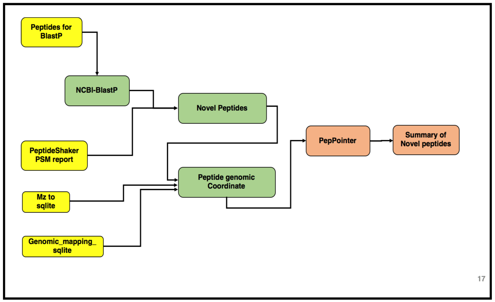

> <agenda-title></agenda-title>
>
> In this tutorial, we will deal with:
> 1. TOC
> {:toc}
>
{: .agenda}

# Pretreatments

{: .no_toc}

All the files to run this workflow can be obtained from the [second tutorial]() output. Once the tabular output is generated, we convert this tabular report into a FASTA file. This can be achieved by using the Tabular to FASTA convertion tool.

> <hands-on-title>data organization</hands-on-title>
>
> 1. The inputs for this workflow are:
>    - **Tabular file** – “**Peptides for BlastP analysis**”
>    - **Tabular file** – “**PeptideShaker_PSM**”
>    - **Mz to sqlite**
>    - **Genomic mapping sqlite**
>
> If you do not have these files from the previous tutorials in this series, you can import them from Zenodo:
> ```
> https://zenodo.org/record/1489208/files/Peptides_for_Blast-P_analysis.tabular
> https://zenodo.org/record/1489208/files/PeptideShaker_PSM.tabular
> https://zenodo.org/record/1489208/files/mz_to_sqlite.mz.sqlite
> https://zenodo.org/record/1489208/files/genomic_mapping_sqlite.sqlite
> ```
{: .hands_on}


# Peptide Selection

[BLAST](https://blast.ncbi.nlm.nih.gov/Blast.cgi) is a web based tool used to compare biological sequences. BlastP, matches protein sequences against a protein database. More specifically, it looks at the amino acid sequence of proteins and can detect and evaluate the amount of differences between say, an experimentally derived sequence and all known amino acid sequences from a database. It can then find the most similar sequences and allow for identification of known proteins or for identification of potential peptides associated with novel proteoforms.

The first step in this tutorial is to perfrom BLAST-P analysis using the NCBI-NR database. The output from BLASTP will determine the identification of the novel peptides. The result is a tabular file with 25 columns containing all the information regarding the alignment of these peptides with the sequences in the NCBI-NR database.

> <hands-on-title>NCBI BLAST+ blastp</hands-on-title>
>
> 1.  with the following parameters:
>    -  **Protein query sequence(s)** - `Peptides for Blast-P analysis.tabular`
>    -  **Subject database/sequences** - `Locally installed BLAST database`
>      -  **Protein BLAST database** - `NCBI-NR(dated)`
>    -  **Type of BLAST** - `blast-p short`
>    -  **Set expectation value cutoff** - `200000.0`
>    -  **Output format** - `Tabular format (25 columns)`
>    -  **Advanced Options** - `show advanced options`
>      -  **Filter out low complexity regions (with SEG)** - `No`
>      -  **Scoring matrix and gap costs** - `PAM30`
>         -  **Gap Costs** - `Extension:9 Extension:1`
>      -  **Maximum hits to consider/show** - `1`
>      -  **Maximum number of HSPs (alignments) to keep for any single query-subject pair** - `1`
>      -  **Word size for wordfinder algorithm** - `2`
>      -  **Multiple hits window size: use 0 to specify 1-hit algorithm, leave blank for default** - `40`
>      -  **Minimum score to add a word to the BLAST lookup table** - `11`
>      -  **Composition-based statistics** - `0: no composition-based statistics`
>      -  **Should the query and subject defline(s) be parsed?** - `No`
>      -  **Restrict search of database to a given set of ID's** - `No restriction, search the entire database`
>      -  **Minimum query coverage per hsp (percentage, 0 to 100)?** - `0`
>      -  **Compute locally optimal Smith-Waterman alignments** - `No`
>  2. Click **Execute** and inspect the query results file after it turned green.
>
{: .hands_on}

Once Blast-P search is performed, it provides a tabular output containing “**Novel peptides**”. Now this output is further processed by comparing the Novel Peptide output with the PSM report for selecting only distinct peptides which meet the criteria.


> <hands-on-title>Query Tabular</hands-on-title>
>
> 1.  with the following parameters:
>    -  **Insert Database Table**
>      - Section **Table Options**
>        - *"Specify Name for Table"*: `blast`
>        - *"Use first line as column names"* : `No`
>        - *"Specify Column Names (comma-separated list)"*:
>`qseqid,sseqid,pident,length,mismatch,gapopen,qstart,qend,sstart,send,evalue,bitscore,sallseqid,score,nident,positive,gaps,ppos,qframe,sframe,qseq,sseq,qlen,slen,salltitles`
>        - *"Only load the columns you have named into database"*: `Yes`
>        -  **Insert Table Index**
>          - *"Table Index"*: `No`
>          - *"Index on Columns"*: `qseqid`
>
>    -  **Insert Database Table**
>      - Section **Filter Dataset Input**
>        -  **Filter Tabular Input Lines**
>          - *"Filter by"*:  `skip leading lines`
>          - *"Skip lines"*: `1`
>      - Section **Table Options**
>        - *"Specify Name for Table"*: `psm`
>        - *"Use first line as column names"* : `No`
>        - *"Specify Column Names (comma-separated list)"*: `ID,Proteins,Sequence,AAs_Before,AAs_After,Position,Modified_Sequence,Variable_Modifications,Fixed_Modifications,Spectrum_File,Spectrum_Title,Spectrum_Scan_Number,RT,mz,Measured_Charge,Identification_Charge,Theoretical_Mass,Isotope_Number,Precursor_mz_Error_ppm,Localization_Confidence,Probabilistic_PTM_score,Dscore,Confidence,Validation`
>        - *"Only load the columns you have named into database"*: `Yes`
>
>
>    - *"Save the sqlite database in your history"*: `No`
>
>       > <comment-title>Querying an SQLite Database</comment-title>
>       >
>       > **Query Tabular** can also use an existing SQLite database. Activating `Save the sqlite database in your history`
>       > will store the created database in the history, allowing to reuse it directly.
>       >
>       {: .comment}
>
>    - *"SQL Query to generate tabular output"*:
>      ```
>      SELECT distinct psm.*
>      FROM psm join blast ON psm.Sequence = blast.qseqid
>      WHERE blast.pident < 100 OR blast.gapopen >= 1 OR blast.length < blast.qlen
>      ORDER BY psm.Sequence, psm.ID
>      ```
>
>       > <comment-title>Query information</comment-title>
>       >
>       > The query wants a tabular list of peptides in which the lenght of the PSM sequence is equal to the length of the Blast sequence, where in the pident (percentage identity) is less that 100 i.e. Peptide cannot be a 100% identical to the NCBI-nr reference database. Or it should fulfill the criteria that there should be atleast 1 gap present (blast.gapopen >= 1) or the length of the peptide in NCBI-nr should be less than the length of the query length. If the peptide follows all this then it is accepted as a "Novel" proteoform.
>       >
>       {: .comment}
>    - *"Include query result column headers"*: `Yes`
>
>  2. Click **Execute** and inspect the query results file after it turned green.
>
{: .hands_on}

Once this step is completed, a tabular output containing novel proteoforms are displayed. These novel proteforms fulfill our criteria of not being present in the existing NCBI repository. The next step is to remove any duplicate sequences. For this, we use the Query tabular tool again to select distinct sequences from the tabular output.

> <hands-on-title>Query Tabular</hands-on-title>
>
> 1. 
>    -  **Insert Database Table**
>      - Section **Filter Dataset Input**
>        -  **Insert Filter Tabular Input Lines**
>          - *"Filter by"*:  `skip leading lines`
>          - *"Skip lines"*: `1`
>      - Section **Table Options**
>        - *"Specify Name for Table"*: `psm`
>        - *"Use first line as column names"* : `No`
>        - *"Specify Column Names (comma-separated list)"*:`ID,Proteins,Sequence`
>        - *"Only load the columns you have named into database"*: `Yes`
>
>    - *"SQL Query to generate tabular output"*:
>      ```
>      SELECT distinct Sequence from psm
>      ```
>    - *"include query result column headers"*: `Yes`
>
> 2. Click **Execute** and inspect the query results file after it turned green.
>
{: .hands_on}


# Multiomics Visualization Platform (MVP)

The Multiomics Visualization Platform is a Galaxy visualization plugin that allows the user to browse the selected proteomics data. It uses the SQlite database which allows the data to be filtered and aggregated in a user defined manner. It allows various features such as; the PSM can be displayed with a lorikeet spectral view, the selected peptide can be displayed in a protein view and an IGV browser is also available for the selected protein. The step by step guide shown below will provide a walkthrough on how to use this plugin (NOTE: the example shown below is a representative peptide which is subjected to change, so while you are running this tool please take a look at the "Novel Peptide" output from the previous steps).

> <hands-on-title>Guide to MVP</hands-on-title>
>
> The spectra belonging to these "Novel peptides" can be viewed using MVP,this can be achieved by selecting the output from the `mz to sqlite tool` (Generated in the second workflow).
> Here is a step by step guide to obtain the proteogenomic view of the "Novel peptides".
>
>
> 1) Click on the **Visualize in MVP application**, it will open up options for visualization application in the center pane, Select **MVP Application** from the options (or Right click to open in a new window).
>
> 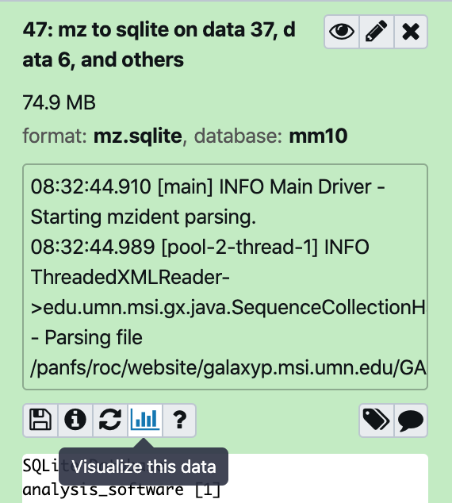{:width="20%"}
>
> This will open in the Center Pane. Select the MVP application.
>
>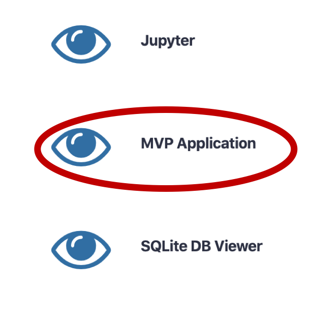{:width="20%"}
>
> This is how it will look.
>
> 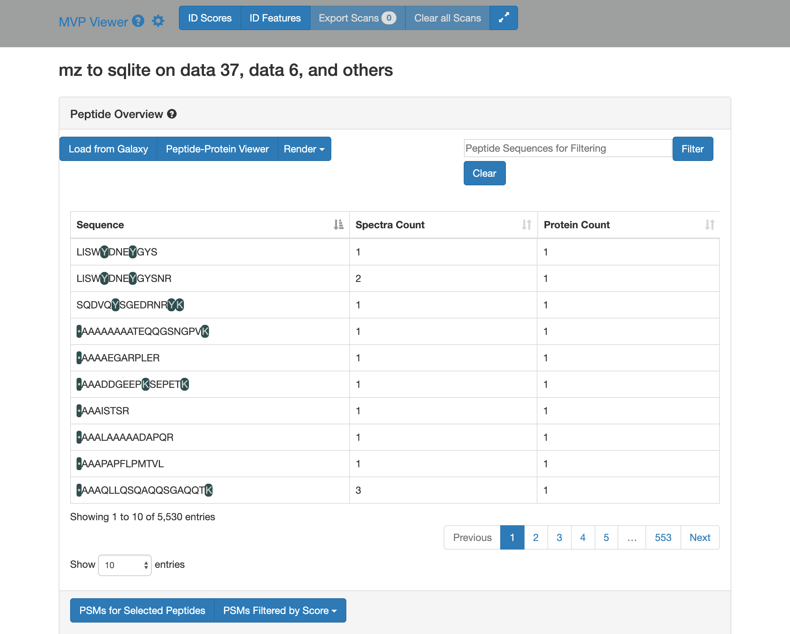{:width="60%"}
>
> 2) Click on **Load from Galaxy** to open the list of peptides you would like to view.
>
> 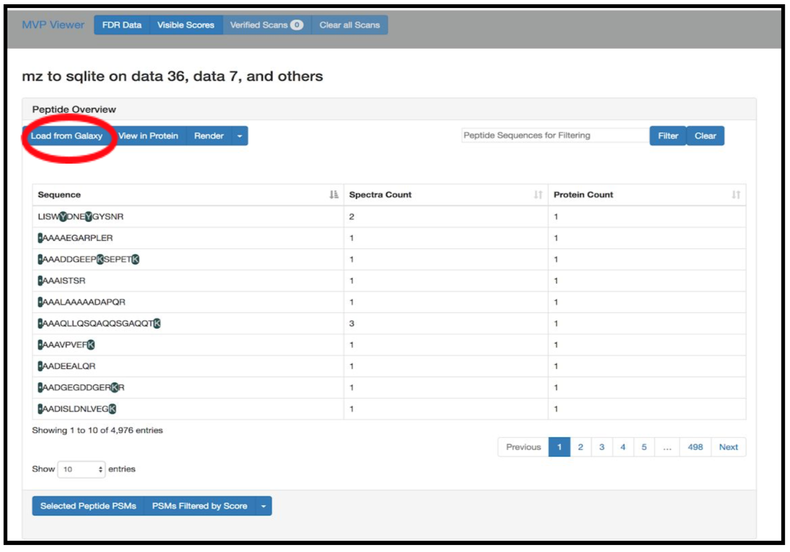{:width="80%"}
>
>This will open a dropdown list. Select the novel peptides from there.
>
>
> 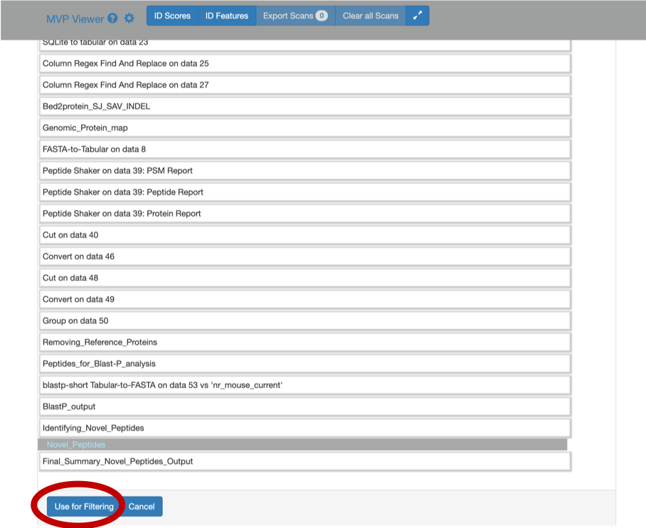{:width="50%"}
>
>
> 3) Select **Novel Peptides** from the right hand side.
>
> 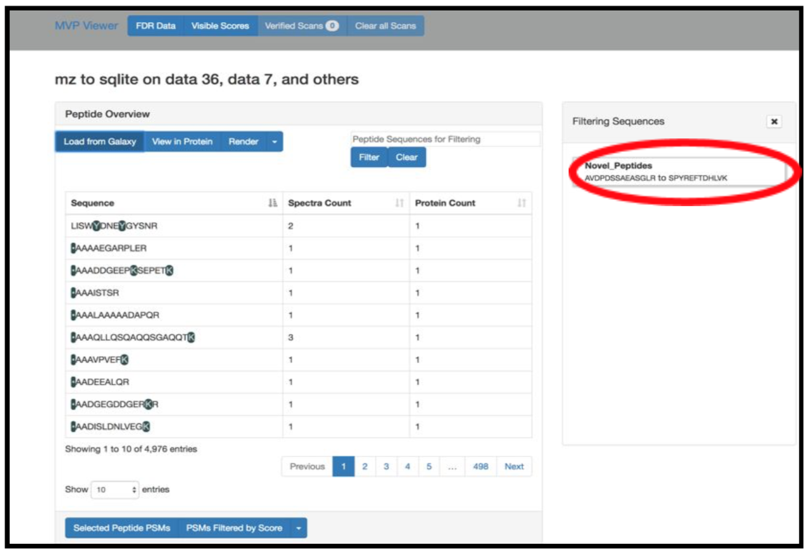{:width="70%"}
>
> 4) Select any peptide, For eg: `DGDLENPVLYSGAV`, and then click on **Selected Peptide PSMs**.
>
> 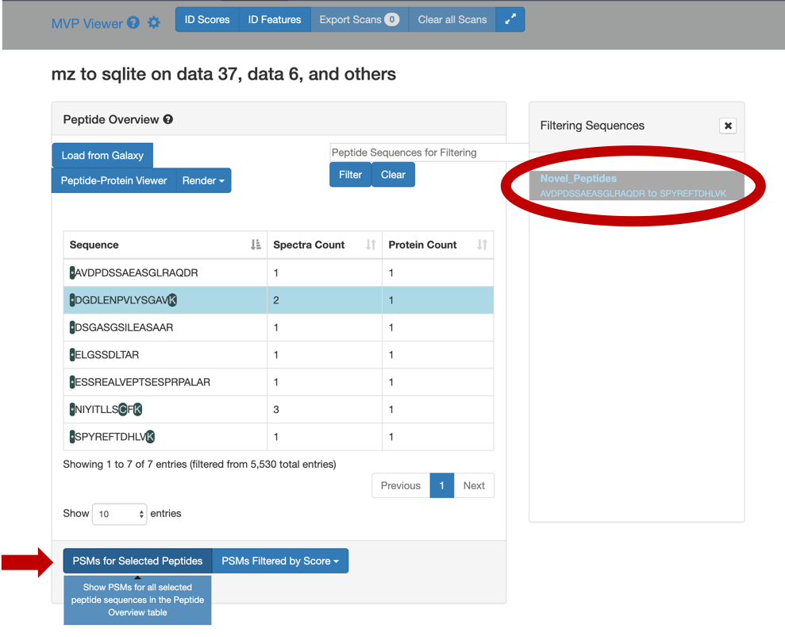{:width="70%"}
>
> 5) If you scroll down, the PSM associated with the peptide will be displayed. By clicking on the PSM, the *Lorikeet*
> values will be shown. The Lorikeet visualization is interactive, i.e the user can change the values or select any
> parameter and click on Update button to view these changes.
>
> 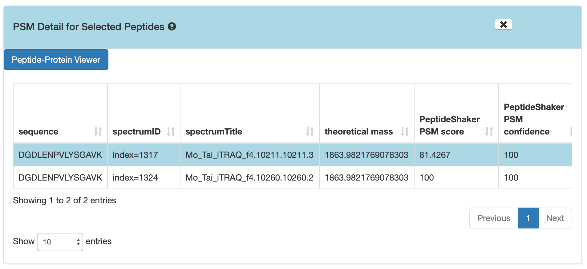{:width="90%"}
>
> {:width="70%"}
>
>
> 6) For a Protein centric view, click on **View in Protein** , it will open up all the proteins associate with the
> peptides. For eg: Select the `DGDLENPVLYSGAV` peptide and click on the first protein. The chromosome location
> of the peptide will be displayed.
>
> 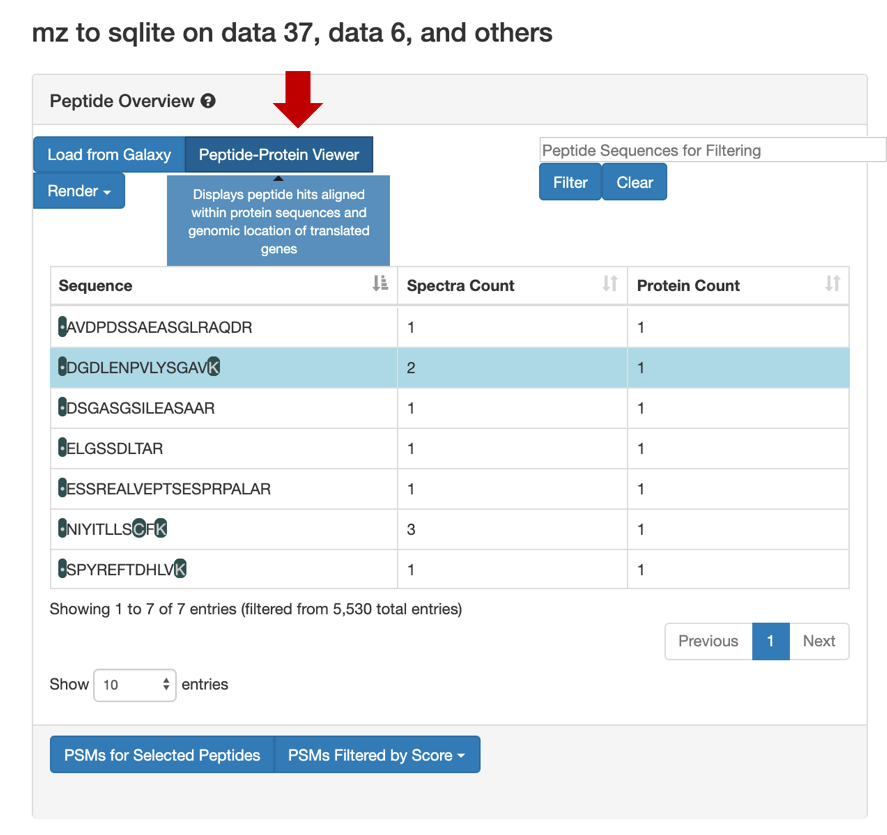{:width="70%"}
>
> Once you click on protein it will show the list of proteins the belongs to the peptides.
>
> 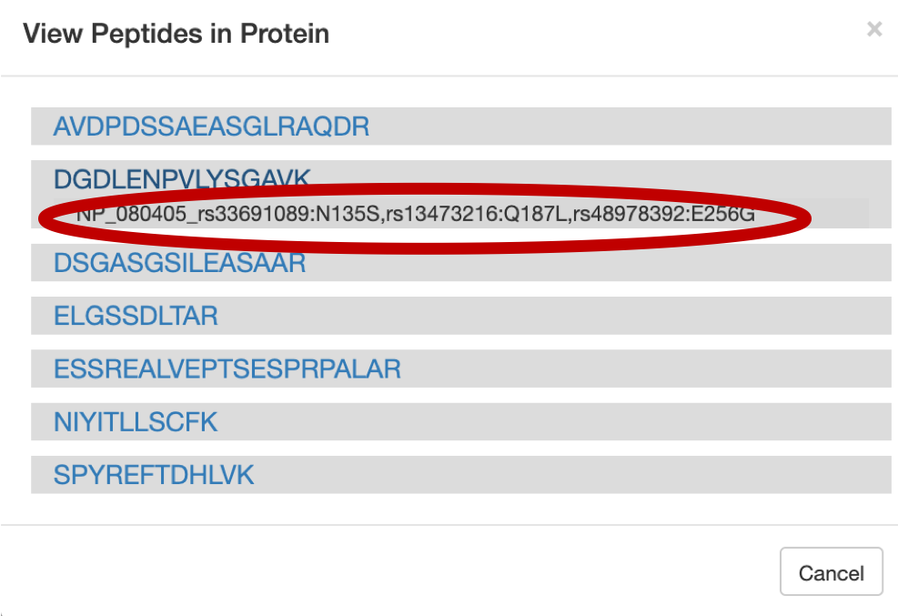{:width="60%"}
>
> Once you select the protein that you want to visualize you can click on the protein view.
>
> 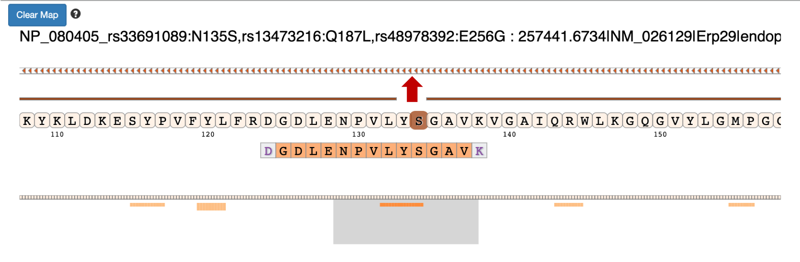{:width="80%"}
>
>
> 7) Clicking on the arrow marks will open up the IGV(js) visualization tool, where-in the genomic localization of the
> peptide will be displayed.
>
>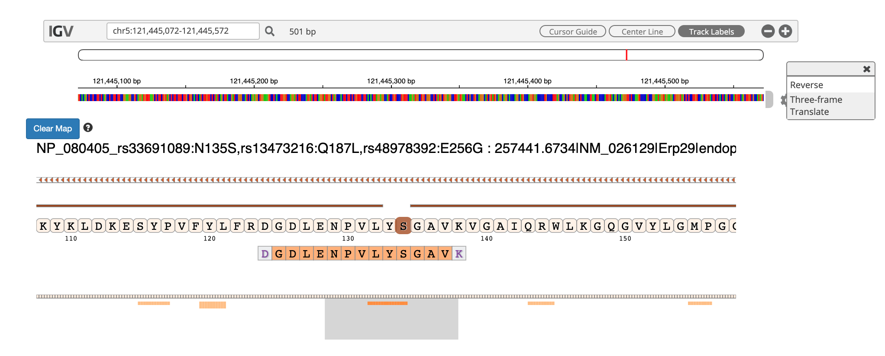{:width="90%"}
>
>
> 8) To add tracks to your IGV viewer, click on **Add Track**. This will open up a list of tracks that are compatible
> to view in your IGV viewer. For eg. Select the `Pep_gen_coordinate.bed` file and then click on **Load Track**.
> This will open up the bed will below the nucleotide sequence.
>
> 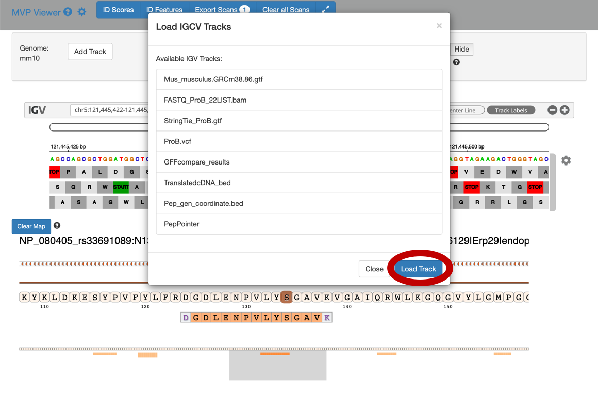{:width="90%"}
>
> 9) By clicking the wheel, you can select the **three frame translate** which will show the three frame translated
> region of your sequence.
>
> 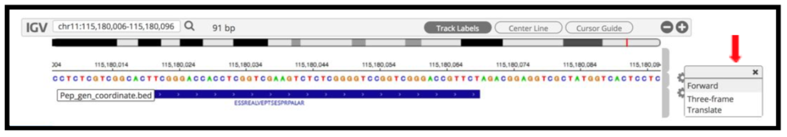{:width="90%"}
>
>
> 10) The IGV is inbuilt in the MVP viewer and is very interactive, you could also load more tracks such as the aligned
> proBAM file (from HISAT) or the identified probam file (one of the input file).
> MVP has many useful features beyond those covered in this workshop and is under active development.
>
>
>{:width="60%"}
>
{: .hands_on}

The next tool in the workflow is the Peptide genomic coordinate tool which takes the "novel peptides" as the input along with the mztosqlite file and the genomic mapping sqlite file (obtained during creation of the database). This tool helps create a bed file with the genomic coordinate information of the peptides based on the sqlite files.


# Obtain Peptide genomic Coordinates

Gets genomic coordinate of peptides based on the information in mzsqlite and genomic mapping sqlite files. This program
loads two sqlite databases (mzsqlite and genomic mapping sqlite files) and calculates the genomic coordinates of the
peptides provided as input. This outputs bed file for peptides.

> <hands-on-title>Peptide genomic Coordinate</hands-on-title>
>
> 1. Run  with the following parameters:
>    - *"Input"*: `Peptide list file`, `mzsqlite sqlite DB file`, and `genomic mapping sqlite DB file`
>    - *"Output"*: `Tabular BED file with all the columns`
>
>      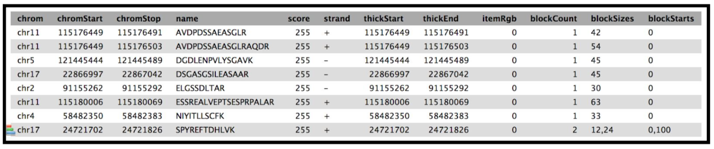{:width="50%"}
>
>
> 2. Click **Execute** and inspect the resulting files
>
{: .hands_on}


# Classify Peptides

Given chromosomal locations of peptides in a BED file, PepPointer classifies them as CDS, UTR, exon, intron, or intergene.

> <hands-on-title>Peppointer</hands-on-title>
>
> 1.  with the following parameters:
>   -  *"Choose the source of the GTF file"* - `From History`
>   -  *"GTF file with the genome of interest"* - `edited_Mus_Musculus_GRCm38.90_Ensembl_GTF`
>   -  *"BED file with chromosomal coordinates of peptides"*: `Bed file from Peptide genomic coordinate tool`
>
> 2. Click **Execute** and inspect the query results file after it turned green.
>
> This tool provides a bed output with the classification of the genomic location of the peptides.The Mus-musculus GTF file will be in your history if you have completed the proteogenomics 1 tutorial.
>
> 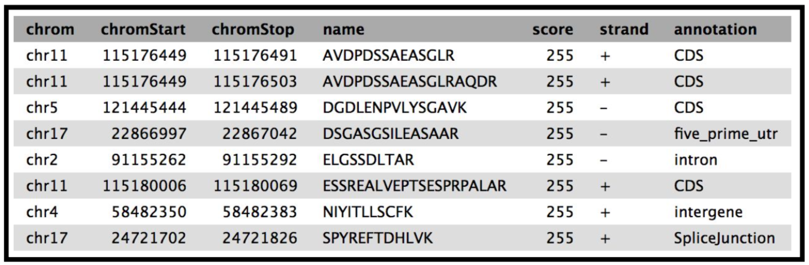{:width="50%"}
>
{: .hands_on}

The final tool for this workflow generates a tabular output that summarizes the information after running these workflows. The final summary output consists of the Peptide sequence, the spectra associated with the peptides, the protein accession number, chromosome number, Start and Stop of the genomic coordinate, the annotation, the genomic coordinate entry for viewing in Integrative Genomics Viewer (IGV), MVP or UCSC genome browser and the URL for viewing it on UCSC genome browser. This summary is created with the help of the query tabular tool.


# Final Summary Output

> <hands-on-title>Query Tabular</hands-on-title>
>
>  1. 
>     -   **Insert Database Table**
>       - Section **Table Options**:
>         - *"Specify Name for Table"*: `bed_pep_pointer`
>         - *"Use first line as column names"* : `No`
>         - *"Specify Column Names (comma-separated list)"*:`chrom,start,end,peptide,score,strand,annot`
>         - *"Only load the columns you have named into database"*: `No`
>
>     -  **Insert Database Table**
>       - Section **Filter Dataset Input**
>         -  **Insert Filter Tabular Input Lines**
>           - *"Filter by"*:  `skip leading lines`
>           - *"Skip lines"*: `1`
>       - Section **Table Options**
>         - *"Specify Name for Table"*: `psm`
>         - *"Use first line as column names"* : `No`
>         - *"Specify Column Names (comma-separated list)"*: `ID,Proteins,Sequence,AAs_Before,AAs_After,Position,Modified_Sequence,Variable_Modifications,Fixed_Modifications,Spectrum_File,Spectrum_Title,Spectrum_Scan_Number,RT,mz,Measured_Charge,Identification_Charge,Theoretical_Mass,Isotope_Number,Precursor_mz_Error_ppm,Localization_Confidence,Probabilistic_PTM_score,Dscore,Confidence,Validation`
>         - *"Only load the columns you have named into database"*: `No`
>     - *"SQL Query to generate tabular output"*:
>       ```
>       SELECT psm.Sequence AS PeptideSequence,
>       count(psm.Sequence) AS SpectralCount,
>       psm.Proteins AS Proteins,
>       bed_pep_pointer.chrom AS Chromosome,
>       bed_pep_pointer.start AS Start,
>       bed_pep_pointer.end AS End,
>       bed_pep_pointer.strand AS Strand,
>       bed_pep_pointer.annot AS Annotation,
>       bed_pep_pointer.chrom||':'||bed_pep_pointer.start||'-'||bed_pep_pointer.end AS GenomeCoordinate,
>       'https://genome.ucsc.edu/cgi-bin/hgTracks?db=mm10&position='||bed_pep_pointer.chrom||'%3A'||bed_pep_pointer.start||'-'||bed_pep_pointer.end AS UCSC_Genome_Browser
>       FROM psm
>       INNER JOIN bed_pep_pointer on bed_pep_pointer.peptide = psm.Sequence
>       GROUP BY psm.Sequence
>       ```
>
>     - *"include query result column headers"*: `Yes`
>
> 2. Click **Execute** and inspect the query results file after it turned green. If everything went well, it should look similiar:
>
>    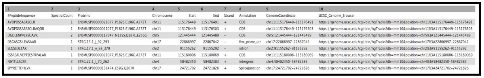{:width="100%"}
>
> The Final summary displays a tabular output containing the list of novel peptides and its corresponding protein. It also provides the users with the chromosomal location of the novel proteoform along with the peptide's start and end position.	The output also features the strand information, gene	annotation and the genomic coordinates in a specific format that could be used on IGV or UCSC browser. It also provides the user with a	UCSC Genome Browser link, which the user can directly copy and paste it on a web browser to learn more about the novel proteoform. Here we are demonstrating the use of proteogenomics workflow on an example trimmed mouse dataset. This study explores the possibilities for downstream biological /functional analysis of peptides corresponding to novel proteoforms.
>
{: .hands_on}

### Conclusion

This completes the proteogenomics workflow analysis. This training workflow uses mouse data. For any other organism the data, tool paramters and the workflow will need to be modified accordingly.This workflow is also available at [usegalaxy.eu](https://usegalaxy.eu/).

This workflow was developed by the Galaxy-P team at the University of Minnesota.
For more information about Galaxy-P or our ongoing work, please visit us at [galaxyp.org](http://galaxyp.org)
