# Introduction

The third and the last workflow in the proteogenomics tutorial is to identifying the "**Novel peptides**" using BlastP and to localize the peptides to its genomic coordinates. Inputs from both workflow 1 and 2 will be used in this workflow.

### Agenda
>
> In this tutorial, we will deal with:
>

> - _Inputs required_
>
> - _Interactive visualization of the Peptides_
>
> - _Classification of "Novel Peptides"_
>
> - _Summary of Identified "Novel peptides"_
>
>>      The inputs for this workflow are:
>>            - Tabular file – “Peptides from BlastP analysis”
>>            - Tabular file – “PeptideShaker_PSM”
>>            - Mz to sqlite
>>            - Genomic mapping sqlite

> All the files to run this workflow can be obtained from the second workflow output.Once the tabular output is generated,
> we convert this tabular report into a FASTA file. This can be achieved by using the Tabular to FASTA convertion tool.

Once Blast-P search is performed, it provides with a tabular output containing “Novel peptides”. Now this output is further processed by comparing the Novel Peptide output with the PSM report for selecting only distinct peptides which meet the criteria.

# Analysis

### Query tabular (Extract "Novel peptides" after BlastP)
1. **Query Tabular** : Run **Query Tabular** with:
>
>    - (a)**Database Table**: Click on `+ Insert Database Table`:
>
>    Section **Table Options**:
>
>    - **Specify Name for Table**: `blast`
>    - **Use first line as column names** : `No`
>    - **Specify Column Names (comma-separated list)**:
>`qseqid,sseqid,pident,length,mismatch,gapopen,qstart,qend,sstart,send,evalue,bitscore,sallseqid,score,nident,positive,gaps,ppos,qframe,sframe,qseq,sseq,qlen,slen,salltitles`
>    - **Only load the columns you have named into database**: `Yes`
>
>    Section **Table Index**:
>    - **Table Index**: `No`
>    - **Index on Columns**: `id`
>
>     - (c) **Database Table**: Click on `+ Insert Database Table`:
>    Section **Filter Dataset Input**
>      - **Filter Tabular input lines**
>      - **Filter by**:  `skip leading lines`
>      - **Skip lines**: `1`
>
>
>    Section **Table Options**:
>
>    - **Specify Name for Table**: `psm`
>    - **Use first line as column names** : `No`
>    - **Specify Column Names (comma-separated list)**: `ID,Proteins,Sequence,AAs_Before,AAs_After,Position,Modified_Sequence,Variable_Modifications,Fixed_Modifications,Spectrum_File,Spectrum_Title,Spectrum_Scan_Number,RT,mz,Measured_Charge,Identification_Charge,Theoretical_Mass,Isotope_Number,Precursor_mz_Error_ppm,Localization_Confidence,Probabilistic_PTM_score,Dscore,Confidence,Validation`
>    - **Only load the columns you have named into database**: `Yes`
>
>
>    - **Save the sqlite database in your history**: `No`
>
>        > ###  Tip
>        >
>        > * **Query Tabular** can also use an existing SQLite database. Activating `Save the sqlite database in your history`
>        > will store the created database in the history, allowing to reuse it directly.
>        >
>        {: .tip}
>
>    - **SQL Query to generate tabular output**:
>
>>       SELECT distinct psm.*
>>       FROM psm join blast on psm.Sequence = blast.qseqid
>>       WHERE blast.pident < 100 OR blast.gapopen >= 1 OR blast.length < blast.qlen
>>       ORDER BY psm.Sequence, psm.ID

>
>    - **include query result column headers**: `Yes`
>
> 2. Click **Execute** and inspect the query results file after it turned green.
>

### Query tabular (Distinct Peptides from the list of "Novel peptides")
1. **Query Tabular** : Run **Query Tabular** with:
>
>    - (a)**Database Table**: Click on `+ Insert Database Table`:
>
>    Section **Filter Dataset Input**
>    - **Filter Tabular input lines**
>      - Filter by:  `skip leading lines`
>      - Skip lines: `1`
>
>    Section **Table Options**:
>
>    - **Specify Name for Table**: `psm`
>    - **Use first line as column names** : `No`
>    - **Specify Column Names (comma-separated list)**:`ID,Proteins,Sequence`
>    - **Only load the columns you have named into database**: `Yes`
>
>    - **SQL Query to generate tabular output**:
>
>>       select distinct Sequence from psm
>
>    - **include query result column headers**: `Yes`
>
> 2. Click **Execute** and inspect the query results file after it turned green.
>

### MVP

> The spectra belonging to these "Novel peptides" can be viewed using MVP,this can be achieved by selecting the output from the mz to sqlite tool.
> Here is a step by step proteogenomic view of the "Novel peptides" obtained from running this workflow:

> 1) Click on the “Visualize in MVP application”, it will open up a new window for MVP.
> 
>
> 2) Click on “Load from Galaxy”.
> 
>
> 3) Select “Novel Peptides” from the right hand side.
> 
>
> 4) Select any peptide, For eg: ESSREALVEPTSESPRPALAR, and then click on “Selected Peptide PSMs”.
> 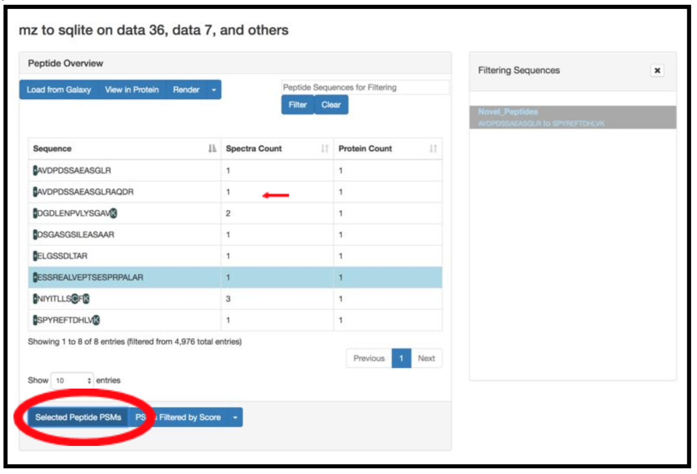
>
> 5) If you scroll down, the PSM associated with the peptide will be displayed. By clicking on the PSM, the Lorikeet
> values will be shown. The Lorikeet visualization is interactive, i.e the user can change the values or select any
> parameter and click on Update button to view these changes.
>
> 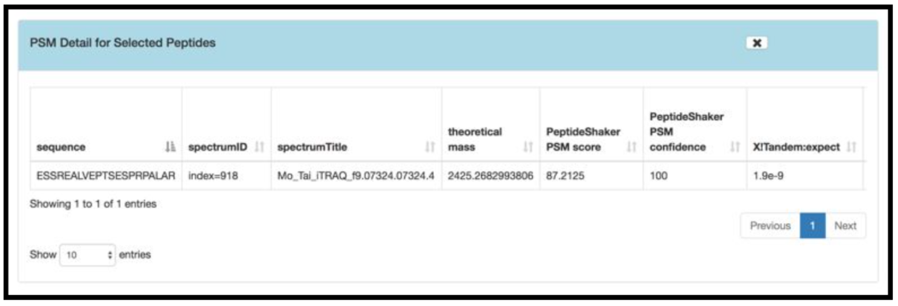
>
> 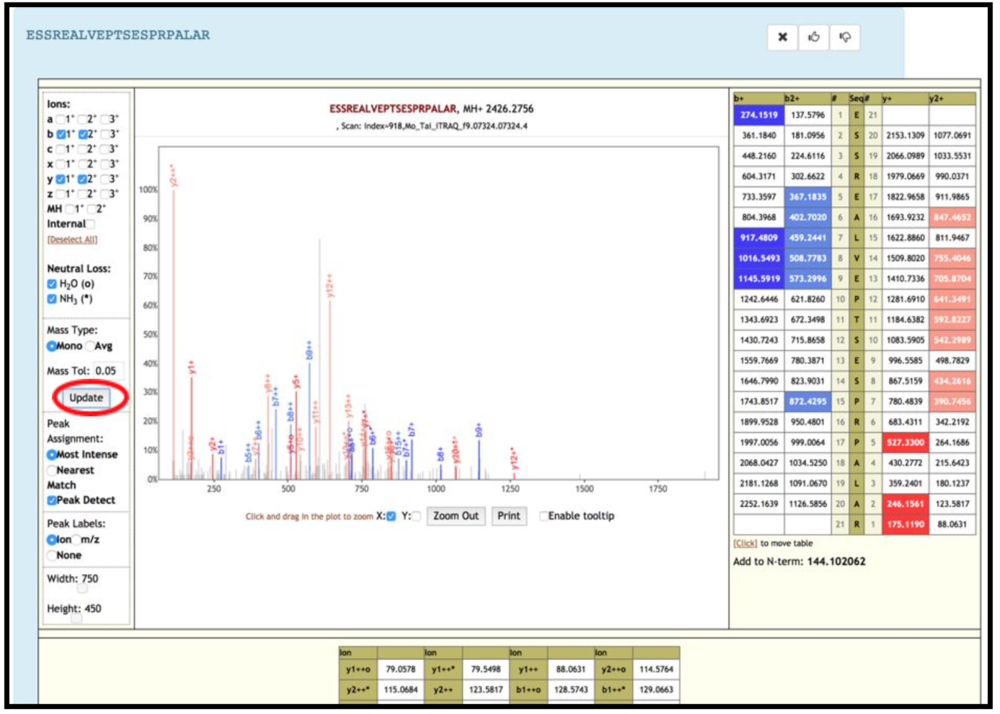
>
>
> 6) For a Protein centric view, click on “View in Protein” , it will open up all the proteins associate with the
> peptides. For eg: Select the “ESSREALVEPTSESPRPALAR” peptide and click on the first protein. The chromosome location
> of the peptide will be displayed.
>
> 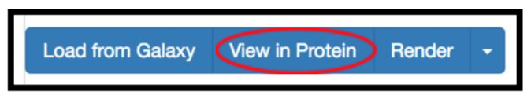
>
> Once you click on protein it will show the list of proteins the belongs to the peptides.
>
> 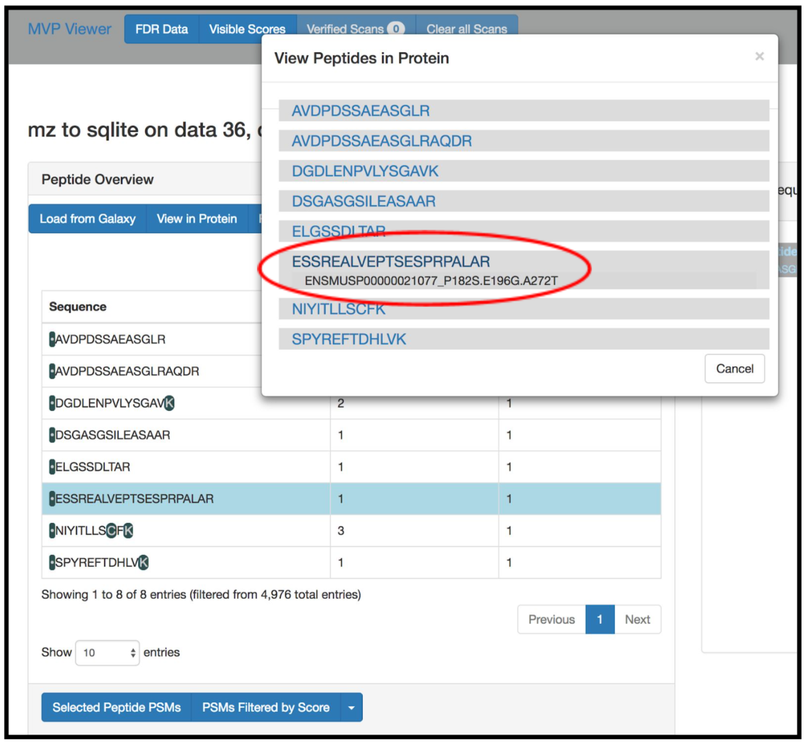
>
>
> Once you select the protein that you want to visualize you can click on the protein view.
>
>
> 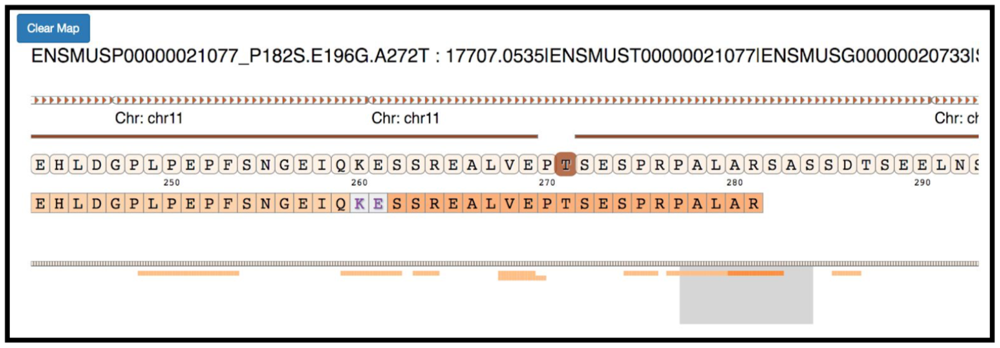
>
>
> 7) Clicking on the arrow marks will open up the IGV(js) visualization tool, where-in the genomic localization of the
> peptide will be displayed.
>
> 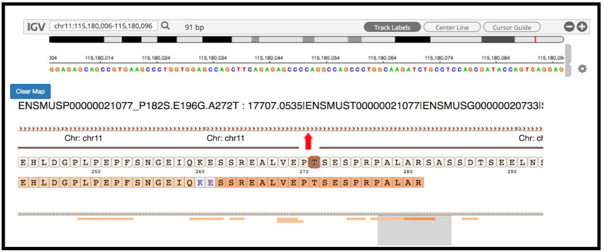
>
>
> 8) To add tracks to your IGV viewer, click on “Add Track”. This will open up a list of tracks that are compatible
> to view in your IGV viewer. For eg. Select the “Pep_gen_coordinate.bed” file and then click on “Load Track”.
> This will open up the bed will below the nucleotide sequence.
> 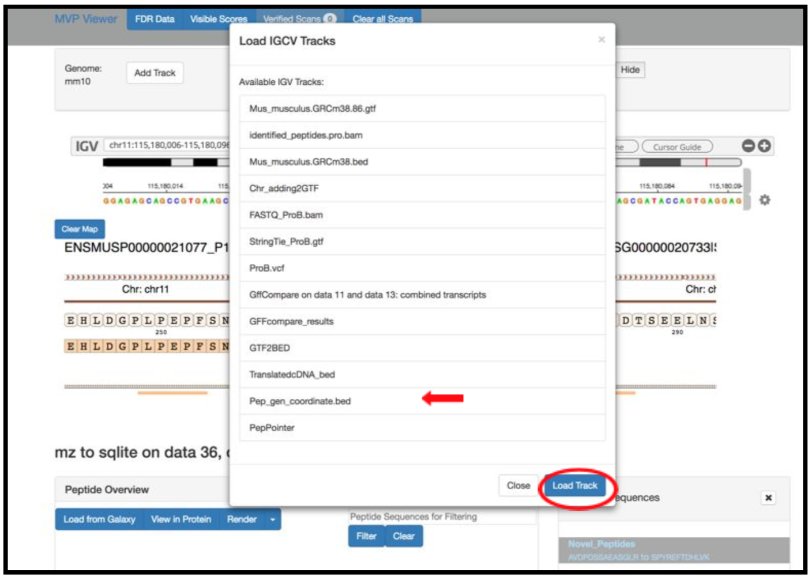
>
> 9) By clicking the wheel, you can select the “three frame translate” which will show the three frame translated
> region of your sequence.
> 
>
>
> 10) The IGV is inbuilt in the MVP viewer and is very interactive, you could also load more tracks such as the aligned
> proBAM file (from HISAT) or the identified probam file (one of the input file).
> MVP has many useful features beyond those covered in this workshop and is under active development.
>
> 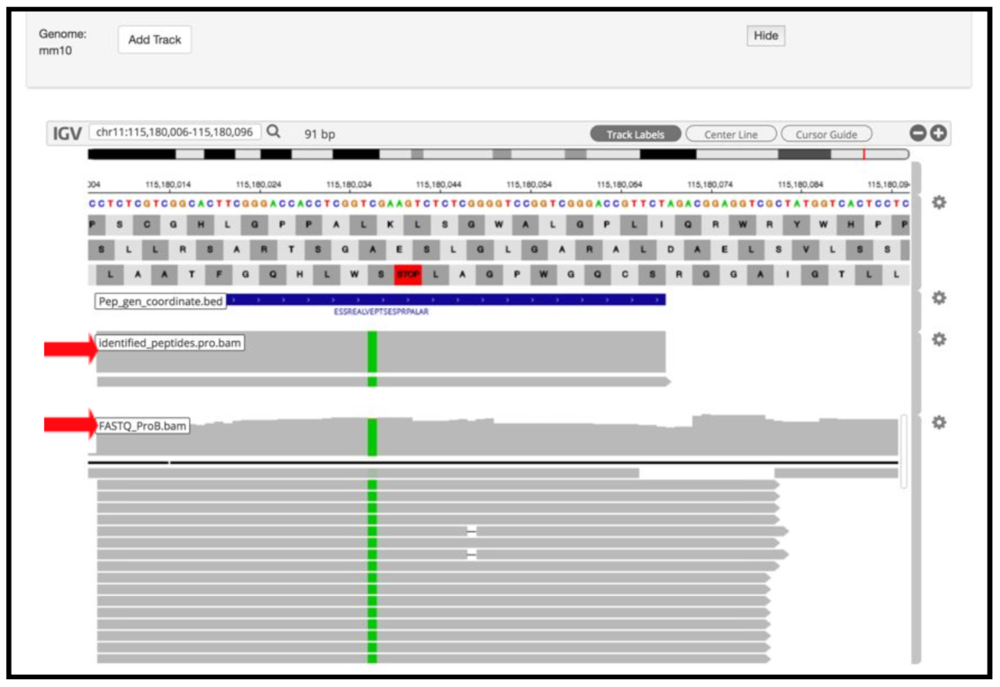
>
>
The next tool in the workflow is the Peptide genomic coordinate tool which takes the "novel peptides" as the input along with the mztosqlite file and the genomic mapping sqlite file (obtained during creation of the database). This tool helps create a bed file with the genomic coordinate information of the peptides based on the sqlite files.

### Peptide genomic Coordinate
Gets genomic coordinate of peptides based on the information in mzsqlite and genomic mapping sqlite files. This program
loads two sqlite databases (mzsqlite and genomic mapping sqlite files) and calculates the genomic coordinates of the
peptides provided as input. This outputs bed file for peptides.
>
> 1. Peptide genomic Coordinate
>       - **Input**: `Peptide list file`, `mzsqlite sqlite DB file`, and `genomic mapping sqlite DB file`
>       - **Output**: `Tabular BED file with all the columns`
> 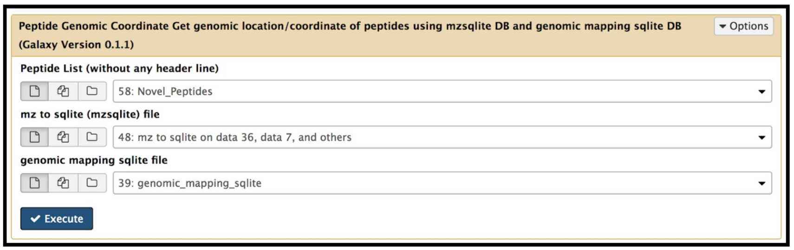
>
> mzsqlite file from: https://toolshed.g2.bx.psu.edu/repos/galaxyp/mz_to_sqlite/mz_to_sqlite/2.0.0
> genome mapping sqlite file from: https://toolshed.g2.bx.psu.edu/view/galaxyp/translate_bed/038ecf54cbec
>
> 
>  2. Click **Execute** and inspect the query results file after it turned green.
>

### Peppointer

Given chromosomal locations of peptides in a BED file, PepPointer classifies them as CDS, UTR, exon, intron, or intergene.

> 1. Peppointer
>      - **Choose the source of the GTF file** - `Locally Installed`
>              - **GTF file with the genome of interest** - `Mus_Musculus_GRCm38.90_Ensembl_GTF`
>      - **Input** - `Bed file from Peptide genomic coordinate tool`
> 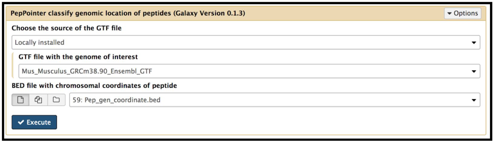
>  This tool provides a bed output with the classification of the genomic location of the peptides.
> 
> 2. Click **Execute** and inspect the query results file after it turned green.

The final tool for this workflow generates a tabular output that summarizes the information after running these workflows. The final summary output consists of the Peptide sequence, the spectra associated with the peptides, the protein accession number, chromosome number, Start and Stop of the genomic coordinate, the annotation, the genomic coordinate entry for viewing in Integrative Genomics Viewer (IGV), MVP or UCSC genome browser and the URL for viewing it on UCSC genome browser. This summary is created with the help of the query tabular tool.

### Query tabular( Final Summary)

1. **Query Tabular** : Run **Query Tabular** with:
>
>    - (a)**Database Table**: Click on `+ Insert Database Table`:
>
>    Section **Table Options**:
>
>    - **Specify Name for Table**: `bed_pep_pointer`
>    - **Use first line as column names** : `No`
>    - **Specify Column Names (comma-separated list)**:`chrom,start,end,peptide,score,strand,annot`
>    - **Only load the columns you have named into database**: `No`
>
>
>     - (b) **Database Table**: Click on `+ Insert Database Table`:
>    Section **Filter Dataset Input**
>      - **Filter Tabular input lines**
>      - **Filter by**:  `skip leading lines`
>      - **Skip lines**: `1`
>    Section **Table Options**:
>
>    - **Specify Name for Table**: `psm`
>    - **Use first line as column names** : `No`
>    - **Specify Column Names (comma-separated list)**: `ID,Proteins,Sequence,AAs_Before,AAs_After,Position,Modified_Sequence,Variable_Modifications,Fixed_Modifications,Spectrum_File,Spectrum_Title,Spectrum_Scan_Number,RT,mz,Measured_Charge,Identification_Charge,Theoretical_Mass,Isotope_Number,Precursor_mz_Error_ppm,Localization_Confidence,Probabilistic_PTM_score,Dscore,Confidence,Validation`
>    - **Only load the columns you have named into database**: `No`
>
>    - **SQL Query to generate tabular output**:
>
>>       `SELECT psm.Sequence as PeptideSequence, count(psm.Sequence) as SpectralCount, psm.Proteins as  Proteins,bed_pep_pointer.chrom as Chromosome, bed_pep_pointer.start as Start, bed_pep_pointer.end as End, bed_pep_pointer.strand as Strand, bed_pep_pointer.annot as Annotation, bed_pep_pointer.chrom||':'||bed_pep_pointer.start||'-'||bed_pep_pointer.end as GenomeCoordinate,'https://genome.ucsc.edu/cgi-bin/hgTracks?db=mm10&position='||bed_pep_pointer.chrom||'%3A'||bed_pep_pointer.start||'-'||bed_pep_pointer.end as UCSC_Genome_Browser
FROM psm
INNER JOIN bed_pep_pointer on bed_pep_pointer.peptide = psm.Sequence
GROUP BY psm.Sequence`
>
>    - **include query result column headers**: `Yes`
>
> 2. Click **Execute** and inspect the query results file after it turned green. If everything went well, it should look similiar:
>

This completes the proteogenomics workflow analysis. This training workflow uses mouse data. For any other organism the data, tool paramters and the workflow will need to be modified accordingly.

This workflow is also available at [Proteogenomics gateway](z.umn.edu/proteogenomicsgateway).

This workflow was developed by the Galaxy-P team at the University of Minnesota.
For more information about Galaxy-P or our ongoing work, please visit us at www.galaxyp.org
